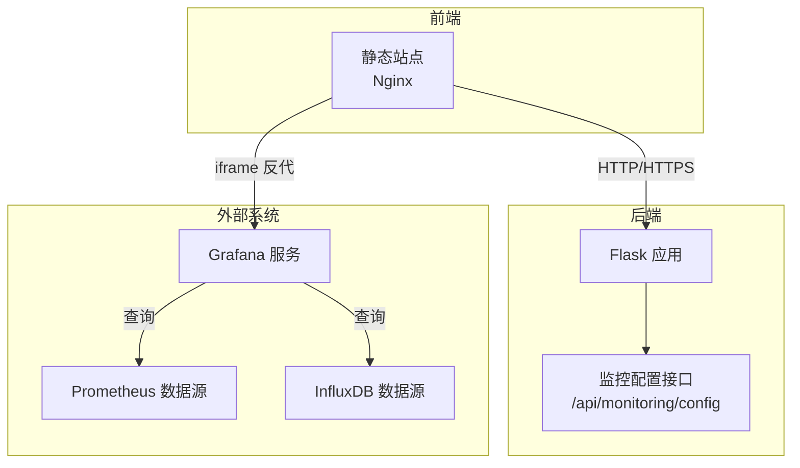
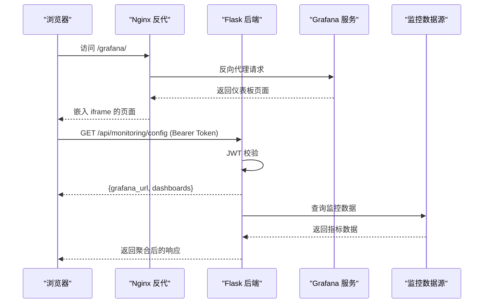
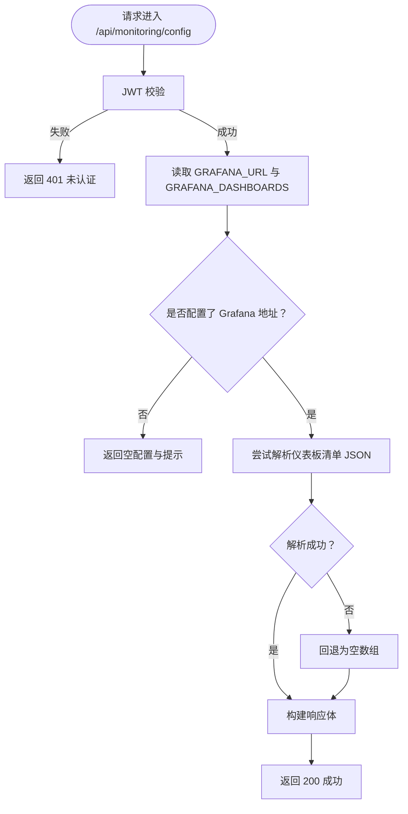
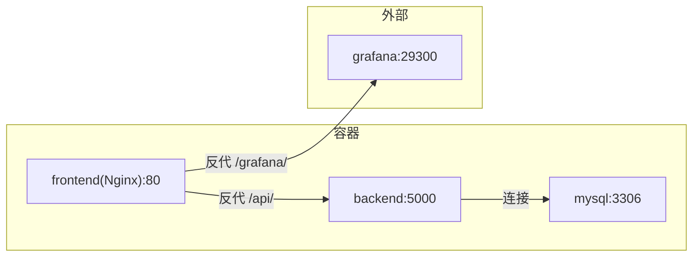

# Grafana监控集成

<cite>
**本文引用的文件**
- [docker-compose.yml](file://docker-compose.yml)
- [nginx.conf](file://nginx.conf)
- [backend/app/config.py](file://backend/app/config.py)
- [backend/app/api/monitoring.py](file://backend/app/api/monitoring.py)
- [backend/app/utils/decorators.py](file://backend/app/utils/decorators.py)
- [backend/app/utils/auth.py](file://backend/app/utils/auth.py)
- [backend/Dockerfile](file://backend/Dockerfile)
- [backend/requirements.txt](file://backend/requirements.txt)
- [backend/run.py](file://backend/run.py)
</cite>

## 目录
1. [简介](#简介)
2. [项目结构](#项目结构)
3. [核心组件](#核心组件)
4. [架构总览](#架构总览)
5. [详细组件分析](#详细组件分析)
6. [依赖分析](#依赖分析)
7. [性能考虑](#性能考虑)
8. [故障排查指南](#故障排查指南)
9. [结论](#结论)
10. [附录](#附录)

## 简介
本文件面向运维与开发团队，系统化说明如何在本项目中完成Grafana监控集成，包括：
- Grafana数据源连接配置（以Prometheus、InfluxDB为例）
- 监控指标的收集与上报机制（系统性能、应用、业务指标）
- Grafana仪表板配置与模板管理（面板布局、图表类型、查询语句）
- 告警规则配置（阈值、触发条件、通知渠道）
- 最佳实践、性能优化与故障排查

当前后端通过环境变量暴露Grafana访问地址与预置仪表板清单，并提供受JWT保护的接口供前端读取配置。反向代理层负责将Grafana嵌入页面并处理混合内容问题。

## 项目结构
后端采用Flask微服务，结合Nginx反向代理与Docker编排，统一对外提供API与静态资源服务。Grafana通过反向代理嵌入前端页面，实现安全访问与跨域控制。

图示来源
- [docker-compose.yml:1-103](file://docker-compose.yml#L1-L103)
- [nginx.conf:1-70](file://nginx.conf#L1-L70)
- [backend/app/api/monitoring.py:1-42](file://backend/app/api/monitoring.py#L1-L42)

章节来源
- [docker-compose.yml:1-103](file://docker-compose.yml#L1-L103)
- [nginx.conf:1-70](file://nginx.conf#L1-L70)

## 核心组件
- Grafana配置读取接口：提供Grafana访问URL与仪表板清单，受JWT保护。
- 环境变量配置：集中管理Grafana地址与仪表板UID映射。
- 反向代理：将Grafana服务以iframe方式嵌入前端，解决Mixed Content问题。
- 认证与授权：JWT鉴权装饰器保障接口安全。

章节来源
- [backend/app/api/monitoring.py:1-42](file://backend/app/api/monitoring.py#L1-L42)
- [backend/app/config.py:52-53](file://backend/app/config.py#L52-L53)
- [nginx.conf:49-59](file://nginx.conf#L49-L59)
- [backend/app/utils/decorators.py:26-123](file://backend/app/utils/decorators.py#L26-L123)

## 架构总览
下图展示从浏览器到后端、再到Grafana与数据源的整体调用链路，以及JWT认证与反向代理的关键节点。

图示来源
- [nginx.conf:49-59](file://nginx.conf#L49-L59)
- [backend/app/api/monitoring.py:11-41](file://backend/app/api/monitoring.py#L11-L41)
- [backend/app/utils/decorators.py:26-123](file://backend/app/utils/decorators.py#L26-L123)

## 详细组件分析

### 组件一：Grafana配置接口
- 功能概述
  - 提供Grafana访问地址与仪表板清单，用于前端渲染导航或内嵌链接。
  - 当未配置Grafana地址时，返回空配置提示。
- 认证机制
  - 接口使用JWT装饰器保护，要求请求头携带合法Bearer Token。
- 数据来源
  - Grafana地址与仪表板清单来自后端配置对象的环境变量。
- 错误处理
  - 未配置Grafana时返回友好提示；仪表板JSON解析失败时回退为空数组。

图示来源
- [backend/app/api/monitoring.py:11-41](file://backend/app/api/monitoring.py#L11-L41)

章节来源
- [backend/app/api/monitoring.py:11-41](file://backend/app/api/monitoring.py#L11-L41)
- [backend/app/utils/decorators.py:26-123](file://backend/app/utils/decorators.py#L26-L123)

### 组件二：环境变量与配置加载
- Grafana相关配置
  - GRAFANA_URL：Grafana服务访问地址（HTTPS优先）。
  - GRAFANA_DASHBOARDS：仪表板清单（名称与UID的JSON数组）。
- 配置加载流程
  - 后端启动时从环境变量读取配置，注入Flask应用配置对象。
  - 前端通过接口读取该配置，用于生成导航或内嵌链接。

章节来源
- [backend/app/config.py:52-53](file://backend/app/config.py#L52-L53)
- [docker-compose.yml:58-59](file://docker-compose.yml#L58-L59)

### 组件三：反向代理与嵌入策略
- Nginx反代
  - 将 /grafana/ 请求转发至Grafana实例，保持升级与连接头以便WebSocket等协议。
- 混合内容解决
  - 通过反代统一HTTP/HTTPS，避免HTTPS页面内嵌HTTP iframe导致的Mixed Content问题。
- 与后端协作
  - /api/ 路由反代至后端，/grafana/ 路由反代至Grafana，实现前后端分离部署。

章节来源
- [nginx.conf:49-59](file://nginx.conf#L49-L59)
- [docker-compose.yml:82-96](file://docker-compose.yml#L82-L96)

### 组件四：认证与授权（JWT）
- 装饰器逻辑
  - 校验Authorization头格式与Token有效性。
  - 校验用户是否存在、状态正常、密码变更时间晚于签发时间。
  - 将当前用户信息注入g对象，供后续处理使用。
- 适用范围
  - 监控配置接口使用此装饰器，确保只有合法用户可读取Grafana配置。

章节来源
- [backend/app/utils/decorators.py:26-123](file://backend/app/utils/decorators.py#L26-L123)
- [backend/app/utils/auth.py:31-44](file://backend/app/utils/auth.py#L31-L44)

## 依赖分析
- 运行时依赖
  - Flask、Flask-CORS、Gunicorn、PyMySQL、PyJWT、APScheduler、OpenPyXL、Cryptography、bcrypt、Paramiko等。
- 编排与网络
  - Docker Compose定义后端、MySQL、Nginx服务及网络拓扑，后端健康检查确保依赖服务就绪后再启动。
- 反向代理
  - Nginx同时承担静态资源、API反代与Grafana反代职责。

图示来源
- [docker-compose.yml:30-96](file://docker-compose.yml#L30-L96)
- [nginx.conf:32-59](file://nginx.conf#L32-L59)

章节来源
- [backend/requirements.txt:1-17](file://backend/requirements.txt#L1-L17)
- [docker-compose.yml:30-96](file://docker-compose.yml#L30-L96)
- [backend/Dockerfile:1-36](file://backend/Dockerfile#L1-L36)

## 性能考虑
- 反向代理超时与缓冲
  - Nginx对后端代理设置了合理的连接、发送、读取超时与缓冲区大小，适合长轮询与大响应场景。
- Web服务器并发
  - 后端使用Gunicorn单worker多线程模式，避免APScheduler在多进程场景重复注册任务。
- 健康检查
  - 后端服务具备健康检查测试，确保在依赖服务就绪后再对外提供服务。

章节来源
- [nginx.conf:35-41](file://nginx.conf#L35-L41)
- [backend/Dockerfile:34-36](file://backend/Dockerfile#L34-L36)
- [docker-compose.yml:69-80](file://docker-compose.yml#L69-L80)

## 故障排查指南
- Grafana未配置或不可达
  - 症状：接口返回空配置或前端无法打开仪表板。
  - 排查：确认环境变量 GRAFANA_URL 与 GRAFANA_DASHBOARDS 是否正确设置；检查Nginx /grafana/ 反代目标与连通性。
- JWT认证失败
  - 症状：接口返回401未认证。
  - 排查：确认请求头 Authorization 格式为 Bearer Token；核对JWT_SECRET_KEY配置；检查用户状态与密码变更时间。
- 混合内容问题
  - 症状：HTTPS页面内嵌Grafana出现Mixed Content警告或加载失败。
  - 排查：确认Nginx反代已启用并正确转发Host、X-Forwarded-*头；确保Grafana与反代使用一致的协议。
- 后端服务不可用
  - 症状：/api/ 路由无法访问。
  - 排查：查看后端健康检查日志；确认数据库连接参数与网络可达；检查Gunicorn线程数与超时配置。

章节来源
- [backend/app/api/monitoring.py:20-28](file://backend/app/api/monitoring.py#L20-L28)
- [backend/app/utils/decorators.py:35-70](file://backend/app/utils/decorators.py#L35-L70)
- [nginx.conf:49-59](file://nginx.conf#L49-L59)
- [docker-compose.yml:69-80](file://docker-compose.yml#L69-L80)

## 结论
本项目通过环境变量集中管理Grafana配置，结合JWT保护的配置接口与Nginx反向代理，实现了安全、可维护的监控集成方案。建议在生产环境中：
- 明确监控数据源（Prometheus/InfluxDB）的接入点与鉴权方式；
- 为仪表板清单维护版本化管理与变更审计；
- 对告警规则进行分级与收敛，减少噪声；
- 持续优化查询与缓存策略，降低后端压力。

## 附录

### A. Grafana数据源连接配置（Prometheus/InfluxDB）
- Prometheus
  - 在Grafana中新增Prometheus数据源，填写HTTP访问地址与鉴权（如需）。
  - 使用PromQL编写查询语句，结合标签筛选与聚合函数。
- InfluxDB
  - 新增InfluxDB数据源，配置连接参数与组织/存储桶。
  - 使用Flux语言编写查询，注意时间范围与精度控制。

[本节为通用配置说明，不直接对应具体源码文件]

### B. 监控指标采集与上报机制
- 系统性能指标
  - CPU、内存、磁盘、网络等基础指标，可通过exporter（如node_exporter）采集并上报至Prometheus。
- 应用指标
  - 业务侧埋点或框架内置指标（如HTTP请求耗时、队列长度），通过SDK或中间件上报。
- 业务指标
  - 关键业务事件（订单量、支付成功率等），通过埋点或日志采集后转换为指标。

[本节为通用配置说明，不直接对应具体源码文件]

### C. 仪表板配置与模板管理
- 面板布局
  - 使用行/列网格布局，合理安排图表尺寸与间距。
- 图表类型
  - 时序趋势、热力图、状态机、表格等，按指标特性选择。
- 查询语句
  - Prometheus使用PromQL，InfluxDB使用Flux；注意时间窗口与采样间隔。
- 模板变量
  - 主机、集群、业务线等维度，通过模板变量实现动态切换。

[本节为通用配置说明，不直接对应具体源码文件]

### D. 告警规则配置指南
- 阈值设置
  - 基于历史基线与SLA设定阈值，区分严重/警告级别。
- 触发条件
  - 单值阈值、滑动窗口统计、同比/环比异常等。
- 通知渠道
  - Webhook、邮件、IM群组等，建议对高频告警做收敛与静默。

[本节为通用配置说明，不直接对应具体源码文件]

### E. 最佳实践与性能优化
- 查询优化
  - 控制时间范围、减少标签组合、使用预聚合。
- 缓存与降采样
  - 对热点查询结果进行短期缓存，对历史数据进行降采样。
- 分层告警
  - 一级告警直达值班，二级告警汇总分析，避免告警风暴。
- 日志与可观测性
  - 统一日志格式与索引策略，结合追踪与指标形成闭环。

[本节为通用配置说明，不直接对应具体源码文件]