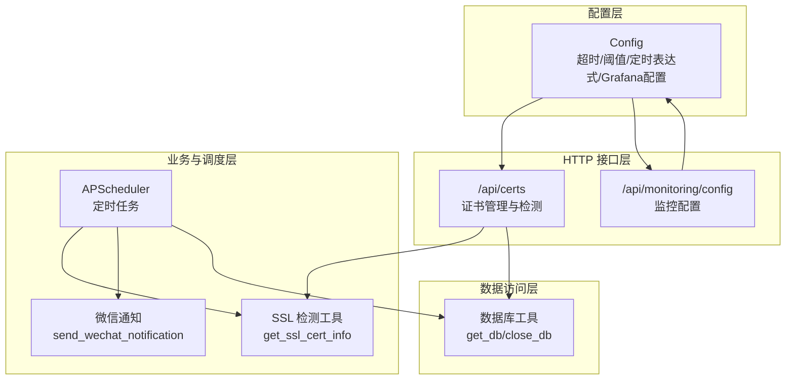
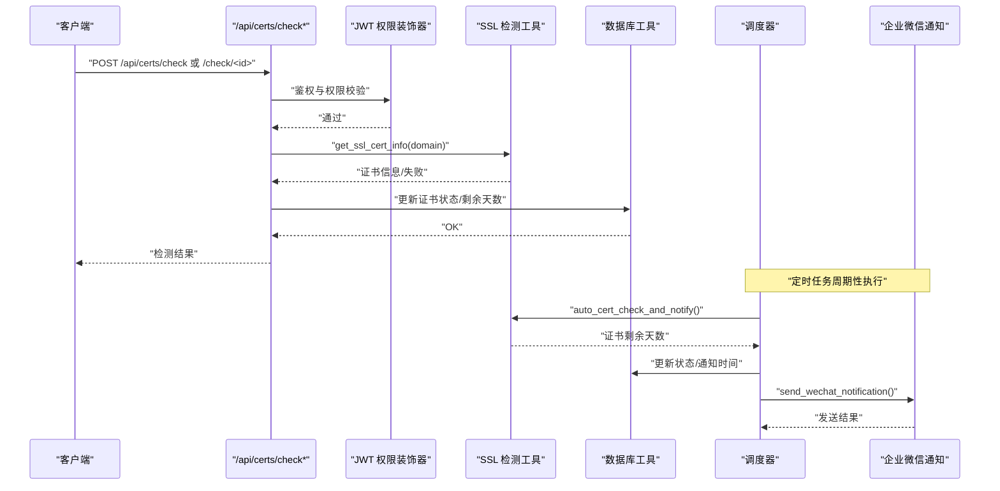
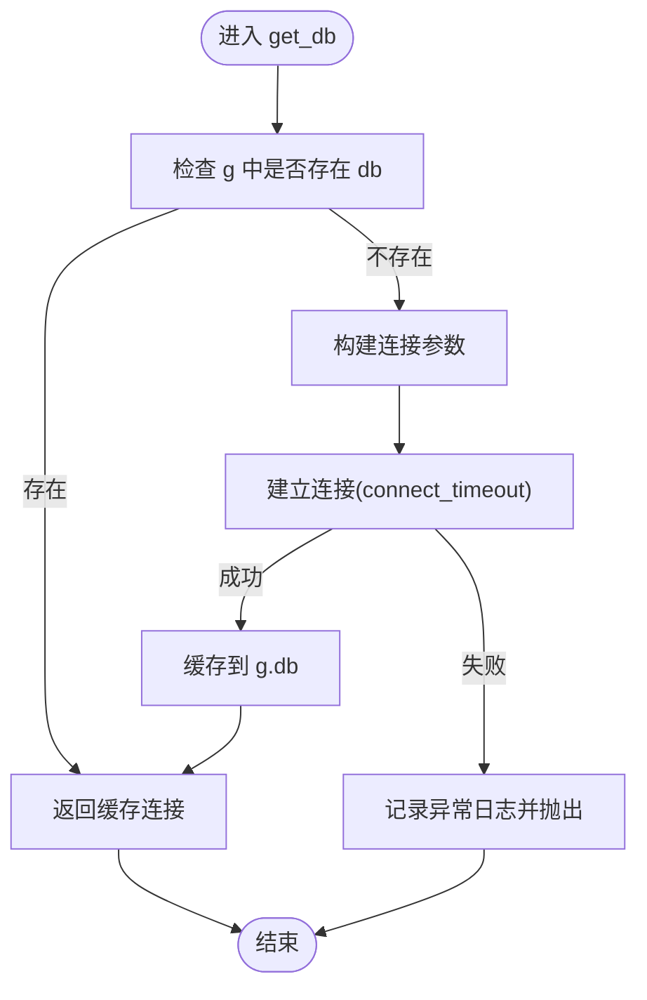
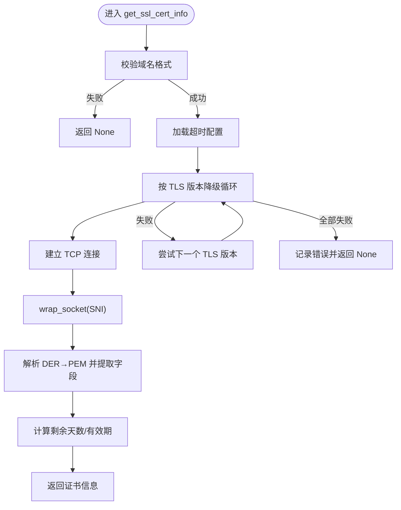
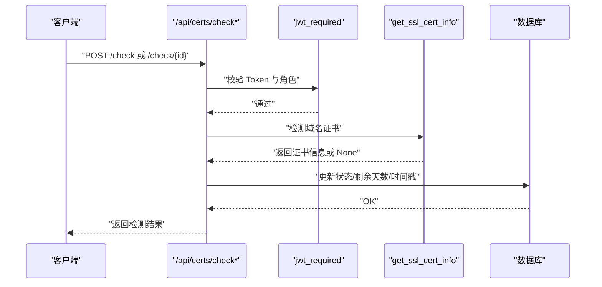
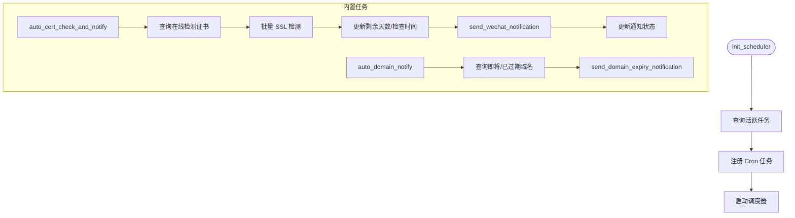
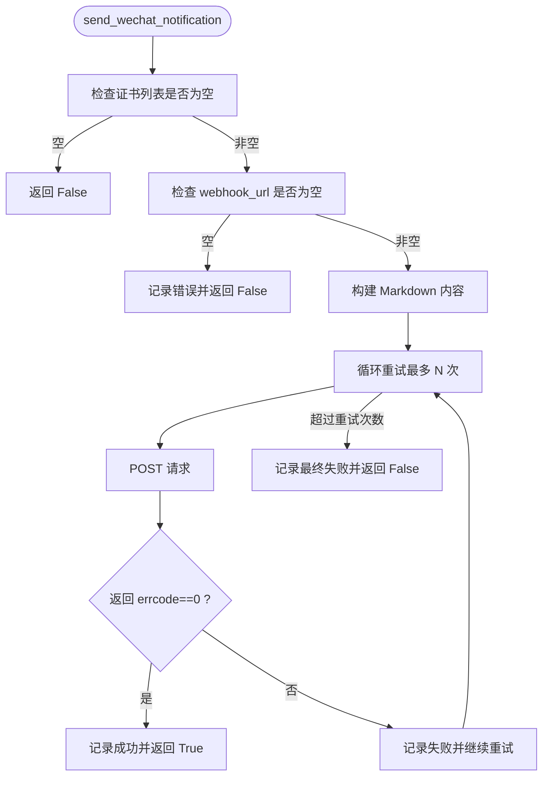
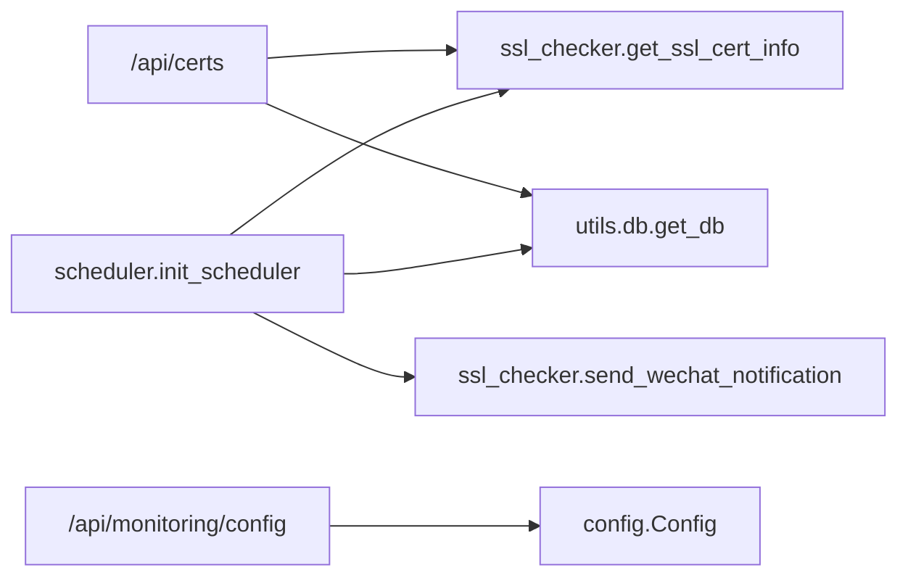

# 健康检查机制

<cite>
**本文引用的文件**
- [backend/app/utils/db.py](file://backend/app/utils/db.py)
- [backend/app/utils/ssl_checker.py](file://backend/app/utils/ssl_checker.py)
- [backend/app/utils/scheduler.py](file://backend/app/utils/scheduler.py)
- [backend/app/api/certs.py](file://backend/app/api/certs.py)
- [backend/app/api/monitoring.py](file://backend/app/api/monitoring.py)
- [backend/app/config.py](file://backend/app/config.py)
- [backend/app/__init__.py](file://backend/app/__init__.py)
</cite>

## 目录
1. [简介](#简介)
2. [项目结构](#项目结构)
3. [核心组件](#核心组件)
4. [架构总览](#架构总览)
5. [详细组件分析](#详细组件分析)
6. [依赖分析](#依赖分析)
7. [性能考虑](#性能考虑)
8. [故障排查指南](#故障排查指南)
9. [结论](#结论)
10. [附录](#附录)

## 简介
本文件系统性阐述该仓库的健康检查机制，覆盖服务可用性监控的实现方式，包括：
- HTTP 接口检查：基于认证与权限装饰器的受控访问
- 数据库连接检查：连接建立、超时与异常处理
- 外部 API 调用检查：SSL 证书在线检测、阿里云证书同步、企业微信通知
- 健康状态报告与告警：定时任务驱动的证书与域名到期预警
- 配置方法：检查间隔、超时设置、重试策略
- 性能优化与故障排查建议

## 项目结构
围绕健康检查的关键模块分布如下：
- 配置层：集中于配置类，提供超时、告警阈值、定时任务表达式等
- 数据访问层：数据库连接封装，提供连接获取与关闭
- 业务层：证书管理 API，提供在线 SSL 检测与批量检测
- 定时任务层：基于 APScheduler 的后台调度器，负责周期性检测与通知
- 通知层：企业微信机器人通知，支持重试与幂等
- 监控配置 API：对外暴露 Grafana 监控配置

图表来源
- [backend/app/config.py:10-58](file://backend/app/config.py#L10-L58)
- [backend/app/api/certs.py:585-797](file://backend/app/api/certs.py#L585-L797)
- [backend/app/api/monitoring.py:11-42](file://backend/app/api/monitoring.py#L11-L42)
- [backend/app/utils/scheduler.py:244-384](file://backend/app/utils/scheduler.py#L244-L384)
- [backend/app/utils/ssl_checker.py:48-166](file://backend/app/utils/ssl_checker.py#L48-L166)
- [backend/app/utils/db.py:43-80](file://backend/app/utils/db.py#L43-L80)

章节来源
- [backend/app/config.py:10-58](file://backend/app/config.py#L10-L58)
- [backend/app/__init__.py:125-149](file://backend/app/__init__.py#L125-L149)

## 核心组件
- 配置中心：集中管理 SSL 检测超时、告警阈值、定时任务表达式、Grafana 监控配置等
- 数据库工具：提供 Flask 应用上下文缓存的数据库连接，统一异常处理
- SSL 检测工具：支持多 TLS 版本降级、证书解析与有效期计算
- 定时任务调度器：注册内置任务（证书检测+通知、域名到期通知），周期性执行
- 证书管理 API：提供单个/批量 SSL 在线检测，更新数据库状态
- 企业微信通知：Markdown 格式通知，带重试与失败回退
- 监控配置 API：对外暴露 Grafana 地址与仪表盘配置

章节来源
- [backend/app/config.py:42-53](file://backend/app/config.py#L42-L53)
- [backend/app/utils/db.py:43-80](file://backend/app/utils/db.py#L43-L80)
- [backend/app/utils/ssl_checker.py:48-166](file://backend/app/utils/ssl_checker.py#L48-L166)
- [backend/app/utils/scheduler.py:391-580](file://backend/app/utils/scheduler.py#L391-L580)
- [backend/app/api/certs.py:585-797](file://backend/app/api/certs.py#L585-L797)
- [backend/app/api/monitoring.py:11-42](file://backend/app/api/monitoring.py#L11-L42)

## 架构总览
健康检查的整体流程由“配置 → 接口触发/定时任务 → 检测与更新 → 通知”构成。

图表来源
- [backend/app/api/certs.py:585-797](file://backend/app/api/certs.py#L585-L797)
- [backend/app/utils/ssl_checker.py:48-166](file://backend/app/utils/ssl_checker.py#L48-L166)
- [backend/app/utils/scheduler.py:391-533](file://backend/app/utils/scheduler.py#L391-L533)

## 详细组件分析

### 组件一：数据库连接与健康检查
- 连接获取：在 Flask 应用上下文中缓存数据库连接，避免重复连接
- 超时设置：连接超时参数控制网络等待时间
- 异常处理：捕获连接异常并记录日志，便于定位配置问题
- 关闭策略：应用上下文结束时关闭连接，防止资源泄漏

图表来源
- [backend/app/utils/db.py:43-80](file://backend/app/utils/db.py#L43-L80)

章节来源
- [backend/app/utils/db.py:43-80](file://backend/app/utils/db.py#L43-L80)

### 组件二：SSL 证书在线检测
- 多版本 TLS 降级：按 TLSv1.3 → TLSv1.2 → TLSv1.1 → TLSv1 顺序尝试
- 超时控制：支持从配置读取超时时间，避免长时间阻塞
- 证书解析：使用 cryptography 库解析证书，提取有效期、剩余天数等
- 失败回退：任一版本失败均记录并尝试下一个版本，全部失败记录最后异常

图表来源
- [backend/app/utils/ssl_checker.py:48-166](file://backend/app/utils/ssl_checker.py#L48-L166)

章节来源
- [backend/app/utils/ssl_checker.py:48-166](file://backend/app/utils/ssl_checker.py#L48-L166)

### 组件三：证书管理 API（HTTP 接口检查）
- 单个检测：/api/certs/check/<id>，调用 SSL 检测工具，更新数据库状态
- 批量检测：/api/certs/check，支持指定 ID 列表或全量检测（cert_type=0）
- 权限控制：JWT 认证与角色校验，确保仅授权用户可触发检测
- 结果反馈：返回成功/失败计数与明细，便于前端展示

图表来源
- [backend/app/api/certs.py:585-797](file://backend/app/api/certs.py#L585-L797)
- [backend/app/utils/ssl_checker.py:48-166](file://backend/app/utils/ssl_checker.py#L48-L166)

章节来源
- [backend/app/api/certs.py:585-797](file://backend/app/api/certs.py#L585-L797)

### 组件四：定时任务与健康状态报告
- 初始化：从数据库加载活跃任务，注册内置任务（证书检测+通知、域名到期通知）
- 证书检测任务：周期性拉取在线检测类型证书，调用 SSL 检测工具，更新剩余天数与检查时间
- 通知任务：根据阈值筛选即将过期/已过期证书，调用企业微信通知
- 域名到期通知：查询即将过期/已过期域名，发送 Markdown 通知
- 配置来源：从 app_config 读取超时、阈值、Webhook URL 等

图表来源
- [backend/app/utils/scheduler.py:244-384](file://backend/app/utils/scheduler.py#L244-L384)
- [backend/app/utils/scheduler.py:391-580](file://backend/app/utils/scheduler.py#L391-L580)
- [backend/app/utils/ssl_checker.py:304-395](file://backend/app/utils/ssl_checker.py#L304-L395)
- [backend/app/utils/ssl_checker.py:398-491](file://backend/app/utils/ssl_checker.py#L398-L491)

章节来源
- [backend/app/utils/scheduler.py:244-384](file://backend/app/utils/scheduler.py#L244-L384)
- [backend/app/utils/scheduler.py:391-580](file://backend/app/utils/scheduler.py#L391-L580)

### 组件五：企业微信通知与告警机制
- 重试策略：最大重试次数可配置，失败时短暂延迟后重试
- 通知内容：Markdown 格式，包含统计信息与逐条域名/证书详情
- 失败处理：记录失败原因与尝试次数，最终更新通知状态

图表来源
- [backend/app/utils/ssl_checker.py:304-395](file://backend/app/utils/ssl_checker.py#L304-L395)

章节来源
- [backend/app/utils/ssl_checker.py:304-395](file://backend/app/utils/ssl_checker.py#L304-L395)

### 组件六：监控配置 API
- 接口：GET /api/monitoring/config
- 功能：返回 Grafana 地址与仪表盘配置，便于前端集成
- 安全：受 JWT 装饰器保护

章节来源
- [backend/app/api/monitoring.py:11-42](file://backend/app/api/monitoring.py#L11-L42)

## 依赖分析
- 组件耦合
  - 证书管理 API 依赖 SSL 检测工具与数据库工具
  - 定时任务依赖 SSL 检测工具、数据库工具与企业微信通知
  - 监控配置 API 依赖配置类
- 外部依赖
  - APScheduler：后台调度
  - cryptography：证书解析
  - requests：通知发送
  - pymysql：数据库连接
- 循环依赖：未见明显循环依赖

图表来源
- [backend/app/api/certs.py:585-797](file://backend/app/api/certs.py#L585-L797)
- [backend/app/utils/scheduler.py:244-384](file://backend/app/utils/scheduler.py#L244-L384)
- [backend/app/api/monitoring.py:11-42](file://backend/app/api/monitoring.py#L11-L42)
- [backend/app/config.py:10-58](file://backend/app/config.py#L10-L58)

章节来源
- [backend/app/__init__.py:125-149](file://backend/app/__init__.py#L125-L149)

## 性能考虑
- 连接池与复用
  - 数据库连接在 Flask 上下文中缓存，减少重复握手开销
  - 建议在生产环境结合连接池中间件进一步优化
- SSL 检测并发
  - 当前实现按序尝试 TLS 版本，整体耗时受最慢版本影响
  - 可考虑引入异步/并发检测（需注意 TLS 版本降级的兼容性）
- 超时与重试
  - SSL 检测超时与通知重试次数可配置，避免阻塞主线程
- 定时任务粒度
  - Cron 表达式决定检测频率，建议根据域名数量与外部 API 速率合理设置

## 故障排查指南
- 数据库连接失败
  - 现象：日志出现连接异常
  - 排查：确认 DB_HOST/PORT/USER/PASSWORD/NAME 配置，检查网络连通性与防火墙
  - 参考：[backend/app/utils/db.py:48-68](file://backend/app/utils/db.py#L48-L68)
- SSL 检测失败
  - 现象：返回 None 或日志记录异常
  - 排查：检查域名可达性、DNS 解析、TLS 版本协商、超时设置
  - 参考：[backend/app/utils/ssl_checker.py:95-166](file://backend/app/utils/ssl_checker.py#L95-L166)
- 通知发送失败
  - 现象：微信通知返回非成功状态或抛出异常
  - 排查：确认 webhook_url、网络连通性、重试次数与超时
  - 参考：[backend/app/utils/ssl_checker.py:377-395](file://backend/app/utils/ssl_checker.py#L377-L395)
- 定时任务未执行
  - 现象：未产生检测或通知
  - 排查：确认调度器启动状态、Cron 表达式、数据库连接、配置项
  - 参考：[backend/app/utils/scheduler.py:368-384](file://backend/app/utils/scheduler.py#L368-L384)
- 权限拒绝
  - 现象：401/403
  - 排查：确认 Authorization 头、Token 有效性与用户状态
  - 参考：[backend/app/utils/decorators.py:26-123](file://backend/app/utils/decorators.py#L26-L123)

章节来源
- [backend/app/utils/db.py:48-68](file://backend/app/utils/db.py#L48-L68)
- [backend/app/utils/ssl_checker.py:95-166](file://backend/app/utils/ssl_checker.py#L95-L166)
- [backend/app/utils/ssl_checker.py:377-395](file://backend/app/utils/ssl_checker.py#L377-L395)
- [backend/app/utils/scheduler.py:368-384](file://backend/app/utils/scheduler.py#L368-L384)
- [backend/app/utils/decorators.py:26-123](file://backend/app/utils/decorators.py#L26-L123)

## 结论
本健康检查机制以配置为中心，结合 HTTP 接口与定时任务实现多维度监控：
- HTTP 接口提供即时检测能力，受 JWT 与角色保护
- 定时任务实现自动化与规模化检测，联动通知
- 数据库工具与 SSL 检测工具分别保障连接稳定与检测准确
- 通过超时与重试策略提升鲁棒性，便于运维观测与告警

## 附录

### 健康检查配置清单
- 数据库连接
  - DB_HOST/DB_PORT/DB_USER/DB_PASSWORD/DB_NAME
  - 参考：[backend/app/config.py:16-20](file://backend/app/config.py#L16-L20)
- SSL 检测
  - SSL_CHECK_TIMEOUT（秒）
  - 参考：[backend/app/config.py:42](file://backend/app/config.py#L42)
- 告警阈值
  - SSL_WARNING_DAYS（证书剩余天数阈值）
  - DOMAIN_WARNING_DAYS（域名剩余天数阈值）
  - 参考：[backend/app/config.py:43-45](file://backend/app/config.py#L43-L45)
- 定时任务表达式
  - CERT_AUTO_CHECK_CRON（证书检测任务）
  - DOMAIN_AUTO_NOTIFY_CRON（域名通知任务）
  - 参考：[backend/app/config.py:47-48](file://backend/app/config.py#L47-L48)
- 通知
  - WECHAT_WEBHOOK_URL（企业微信机器人地址）
  - NOTIFY_MAX_RETRIES（通知最大重试次数）
  - 参考：[backend/app/config.py:40](file://backend/app/config.py#L40)

### 健康检查类型与实现要点
- HTTP 接口检查
  - 通过 /api/certs/check* 触发，受 JWT 与角色保护
  - 参考：[backend/app/api/certs.py:585-797](file://backend/app/api/certs.py#L585-L797)
- 数据库连接检查
  - 通过 get_db 建立连接并捕获异常
  - 参考：[backend/app/utils/db.py:43-80](file://backend/app/utils/db.py#L43-L80)
- SSL 证书检查
  - 多版本 TLS 降级、证书解析、剩余天数计算
  - 参考：[backend/app/utils/ssl_checker.py:48-166](file://backend/app/utils/ssl_checker.py#L48-L166)
- 域名到期检查
  - 查询即将/已过期域名并通知
  - 参考：[backend/app/utils/scheduler.py:535-580](file://backend/app/utils/scheduler.py#L535-L580)
- 外部 API 调用检查
  - 企业微信通知，带重试与失败回退
  - 参考：[backend/app/utils/ssl_checker.py:304-395](file://backend/app/utils/ssl_checker.py#L304-L395)