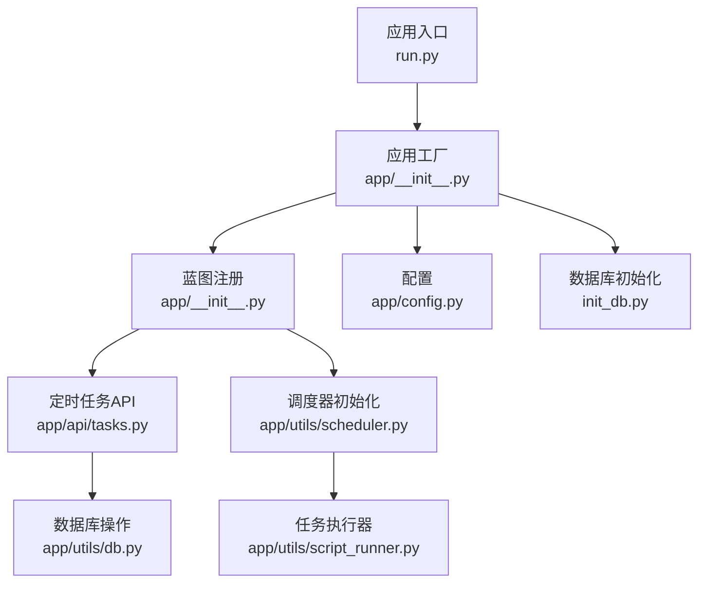
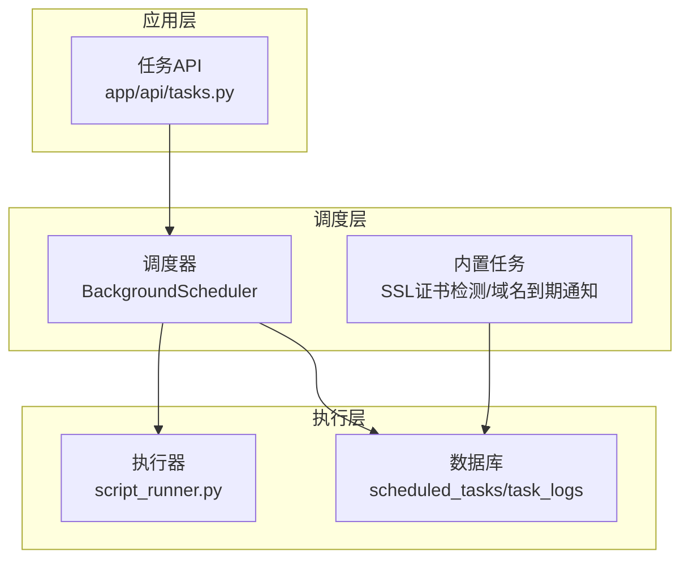
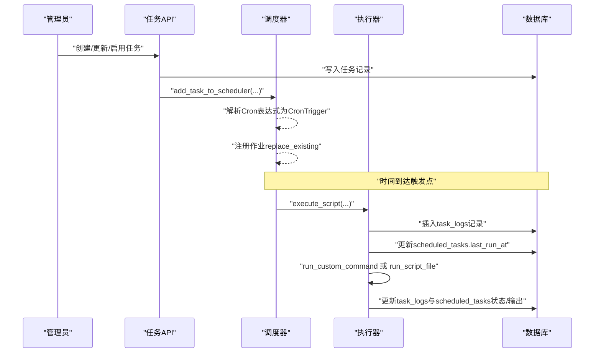
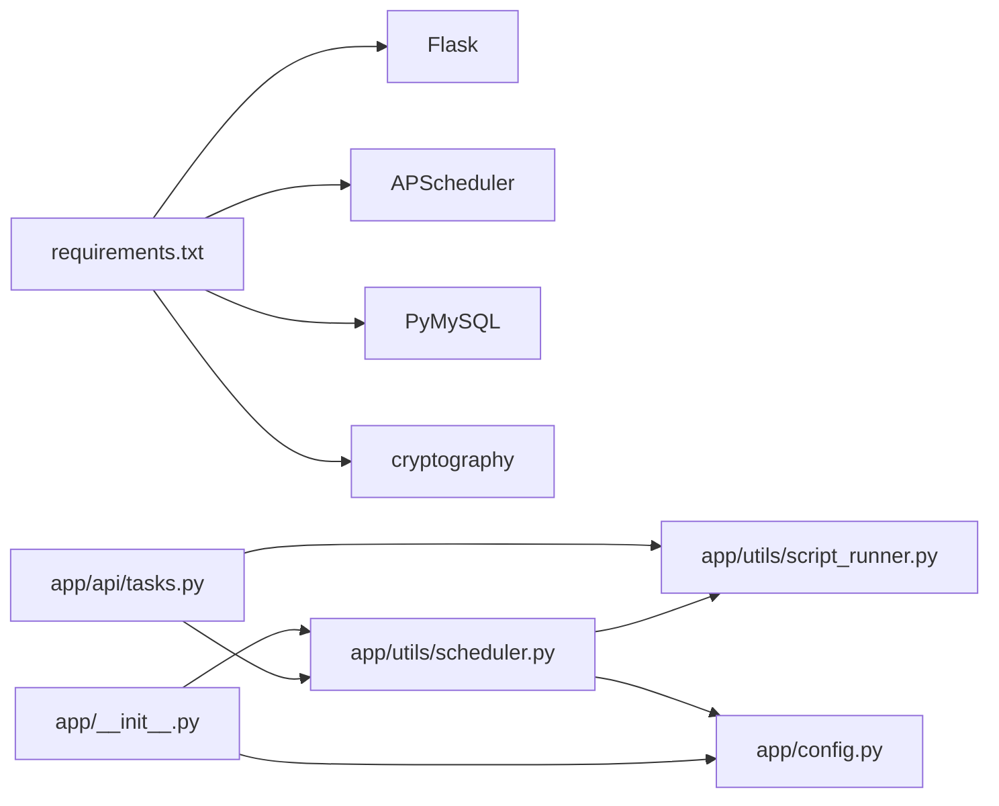

# 定时任务调度

<cite>
**本文引用的文件**
- [scheduler.py](file://backend/app/utils/scheduler.py)
- [tasks.py](file://backend/app/api/tasks.py)
- [config.py](file://backend/app/config.py)
- [__init__.py](file://backend/app/__init__.py)
- [script_runner.py](file://backend/app/utils/script_runner.py)
- [init_db.py](file://backend/init_db.py)
- [requirements.txt](file://backend/requirements.txt)
- [run.py](file://backend/run.py)
</cite>

## 目录
1. [简介](#简介)
2. [项目结构](#项目结构)
3. [核心组件](#核心组件)
4. [架构总览](#架构总览)
5. [详细组件分析](#详细组件分析)
6. [依赖分析](#依赖分析)
7. [性能考虑](#性能考虑)
8. [故障排除指南](#故障排除指南)
9. [结论](#结论)
10. [附录](#附录)

## 简介
本项目实现了一个基于 Flask 的定时任务调度系统，采用 APscheduler 作为调度引擎，支持 Cron 表达式驱动的任务执行。系统提供任务的创建、编辑、启用/禁用、删除、手动执行以及执行日志查询等能力，并内置了 SSL 证书到期检测与通知、域名到期通知等内置任务。调度器在应用启动时初始化，从数据库加载活跃任务并注册到调度器；同时支持动态增删改任务并在运行时生效。

## 项目结构
- 后端采用 Flask 应用，入口位于 run.py，应用工厂在 app/__init__.py 中创建并注册蓝图。
- 定时任务相关的核心逻辑集中在 app/utils/scheduler.py，API 路由集中在 app/api/tasks.py。
- 配置集中于 app/config.py，数据库初始化脚本在 init_db.py，依赖在 requirements.txt。
- 任务执行器封装在 app/utils/script_runner.py，负责根据脚本类型选择合适的执行方式（Python、Bash/Shell、MySQL 客户端）。

图表来源
- [run.py:1-8](file://backend/run.py#L1-L8)
- [__init__.py:28-114](file://backend/app/__init__.py#L28-L114)
- [tasks.py:18-18](file://backend/app/api/tasks.py#L18-L18)
- [scheduler.py:244-384](file://backend/app/utils/scheduler.py#L244-L384)
- [script_runner.py:19-116](file://backend/app/utils/script_runner.py#L19-L116)
- [config.py:10-58](file://backend/app/config.py#L10-L58)
- [init_db.py:191-236](file://backend/init_db.py#L191-L236)

章节来源
- [run.py:1-8](file://backend/run.py#L1-L8)
- [__init__.py:28-114](file://backend/app/__init__.py#L28-L114)
- [tasks.py:18-18](file://backend/app/api/tasks.py#L18-L18)
- [scheduler.py:244-384](file://backend/app/utils/scheduler.py#L244-L384)
- [script_runner.py:19-116](file://backend/app/utils/script_runner.py#L19-L116)
- [config.py:10-58](file://backend/app/config.py#L10-L58)
- [init_db.py:191-236](file://backend/init_db.py#L191-L236)

## 核心组件
- 调度器与任务执行
  - 调度器：BackgroundScheduler 实例，全局共享，负责任务注册、启停、内置任务注册。
  - 任务执行：execute_script 作为调度器回调，负责创建执行日志、更新任务状态、调用脚本执行器、记录输出与错误、处理超时与异常。
  - 任务注册：add_task_to_scheduler 接收 Cron 表达式与任务参数，解析 Cron 触发器并注册到调度器。
  - 任务移除：remove_task_from_scheduler 根据任务ID移除调度器中的作业。
  - 初始化：init_scheduler 从数据库加载活跃任务，判断新旧两种执行模式（自定义命令+多文件目录 或 单文件路径），并注册内置任务（SSL 证书检测+通知、域名到期通知）。
- API 层
  - 任务 CRUD：创建、更新、删除、启用/禁用、手动执行、查看日志。
  - 文件上传与目录管理：支持多文件上传到任务专属目录，文件名冲突自动编号。
  - 动态同步：当任务处于活跃状态时，更新会触发调度器的移除与重新注册。
- 执行器
  - run_custom_command：在指定工作目录执行自定义命令，支持超时控制。
  - run_script_file：根据扩展名选择执行方式，支持 .py、.sh、.sql，分别使用 Python、Bash/Shell、MySQL 客户端。
- 配置
  - 通过环境变量注入，包含数据库连接、CORS、Webhook、内置任务 Cron 表达式等。

章节来源
- [scheduler.py:181-241](file://backend/app/utils/scheduler.py#L181-L241)
- [scheduler.py:244-384](file://backend/app/utils/scheduler.py#L244-L384)
- [tasks.py:144-496](file://backend/app/api/tasks.py#L144-L496)
- [script_runner.py:19-116](file://backend/app/utils/script_runner.py#L19-L116)
- [config.py:10-58](file://backend/app/config.py#L10-L58)

## 架构总览
系统采用“应用层 + 调度层 + 执行层”的三层架构：
- 应用层：Flask 蓝图提供 REST API，负责任务的生命周期管理与手动执行。
- 调度层：APScheduler 负责任务注册、调度与触发，内置任务与用户任务统一管理。
- 执行层：根据脚本类型选择执行器，确保跨语言与跨工具链的兼容性。

图表来源
- [tasks.py:144-496](file://backend/app/api/tasks.py#L144-L496)
- [scheduler.py:244-384](file://backend/app/utils/scheduler.py#L244-L384)
- [script_runner.py:19-116](file://backend/app/utils/script_runner.py#L19-L116)
- [init_db.py:191-236](file://backend/init_db.py#L191-L236)

## 详细组件分析

### 调度器与任务执行
- 调度器初始化
  - 从配置读取数据库连接参数，建立连接后查询所有 is_active = TRUE 的任务。
  - 判断任务执行模式：若存在 execute_command 且任务目录存在，则使用“自定义命令+多文件”模式；否则回退到“单文件路径”模式。
  - 注册内置任务：SSL 证书自动检测+通知、域名到期自动通知，使用配置中的 Cron 表达式。
  - 启动调度器，存储 db_config 以便后续使用。
- 任务注册
  - 解析 Cron 表达式为 CronTrigger，移除同名作业后新增作业，replace_existing 确保更新生效。
- 任务移除
  - 根据 job_id（task_{id}）移除作业。
- 任务执行
  - 回调函数创建执行日志、更新任务 last_run_at。
  - 优先执行自定义命令（run_custom_command），否则执行脚本文件（run_script_file）。
  - 统一记录状态、输出、错误信息，处理超时与异常，最终更新任务状态与输出预览。

图表来源
- [tasks.py:144-496](file://backend/app/api/tasks.py#L144-L496)
- [scheduler.py:181-241](file://backend/app/utils/scheduler.py#L181-L241)
- [scheduler.py:39-178](file://backend/app/utils/scheduler.py#L39-L178)
- [script_runner.py:19-116](file://backend/app/utils/script_runner.py#L19-L116)

章节来源
- [scheduler.py:244-384](file://backend/app/utils/scheduler.py#L244-L384)
- [scheduler.py:181-241](file://backend/app/utils/scheduler.py#L181-L241)
- [scheduler.py:39-178](file://backend/app/utils/scheduler.py#L39-L178)

### Cron 表达式与执行策略
- Cron 表达式格式
  - 5 个字段：分 时 日 月 周。
  - 支持数字、通配符、范围、步长、特殊符号（如 L、W、#）等标准语法。
- 执行策略
  - 新模式：execute_command + 任务目录（多文件），适合复杂场景与多文件协作。
  - 旧模式：script_path（单文件），保持向后兼容。
  - 手动执行：无论何种模式，均走相同执行流程，先写入日志，再执行，最后更新状态与输出。

章节来源
- [scheduler.py:181-241](file://backend/app/utils/scheduler.py#L181-L241)
- [tasks.py:498-631](file://backend/app/api/tasks.py#L498-L631)

### 任务状态管理与日志记录
- 状态字段
  - scheduled_tasks：is_active、last_run_at、last_status、last_output。
  - task_logs：status、start_time、end_time、output、error_message、triggered_by。
- 日志记录
  - 执行前插入一条 status=running 的日志，执行后根据结果更新状态与输出。
  - 支持手动执行与计划触发两种触发方式（triggered_by=schedule/manual）。
- 异常与超时
  - 超时：subprocess.TimeoutExpired 统一处理为 failed，并记录超时信息。
  - 异常：捕获并记录错误，保证数据库事务提交与连接释放。

章节来源
- [init_db.py:191-236](file://backend/init_db.py#L191-L236)
- [scheduler.py:39-178](file://backend/app/utils/scheduler.py#L39-L178)
- [tasks.py:498-631](file://backend/app/api/tasks.py#L498-L631)

### 任务动态管理
- 创建任务
  - 支持多文件上传，自动去重与命名冲突处理。
  - 若仅有一个文件且无自定义命令，自动设置 script_path 以兼容旧模式。
  - 写入数据库后立即添加到调度器。
- 更新任务
  - 支持删除文件、追加文件、更新自定义命令。
  - 若任务处于活跃状态，先移除旧作业，再重新注册。
- 删除任务
  - 从调度器移除，删除任务目录与相关日志，兼容旧数据的单文件路径清理。
- 启用/禁用
  - 启用：根据当前模式重新注册；禁用：从调度器移除。

章节来源
- [tasks.py:144-496](file://backend/app/api/tasks.py#L144-L496)
- [scheduler.py:231-241](file://backend/app/utils/scheduler.py#L231-L241)

### 内置任务与通知
- SSL 证书自动检测+通知
  - 查询在线检测类型的证书，逐个进行 TLS 握手与证书解析，计算剩余天数并更新数据库。
  - 当剩余天数小于等于阈值时，通过企业微信 Webhook 发送通知，并更新通知状态。
- 域名到期自动通知
  - 查询即将到期或已过期的域名，按阈值筛选后发送通知。
- 配置项
  - WECHAT_WEBHOOK_URL、SSL_CHECK_TIMEOUT、SSL_WARNING_DAYS、DOMAIN_WARNING_DAYS、CERT_AUTO_CHECK_CRON、DOMAIN_AUTO_NOTIFY_CRON。

章节来源
- [scheduler.py:391-580](file://backend/app/utils/scheduler.py#L391-L580)
- [config.py:40-48](file://backend/app/config.py#L40-L48)

## 依赖分析
- 外部依赖
  - Flask、APScheduler、PyMySQL、cryptography、Gunicorn 等。
- 内部模块依赖
  - app/__init__.py 在应用启动时调用 init_scheduler，注册蓝图与数据库校验。
  - tasks.py 依赖 scheduler 的 add/remove/get_db_config，依赖 script_runner 的执行器。
  - scheduler.py 依赖 script_runner 的执行器与 config 的 db_config。

图表来源
- [requirements.txt:1-17](file://backend/requirements.txt#L1-L17)
- [__init__.py:108-111](file://backend/app/__init__.py#L108-L111)
- [tasks.py:11-16](file://backend/app/api/tasks.py#L11-L16)
- [scheduler.py:13-13](file://backend/app/utils/scheduler.py#L13-L13)
- [config.py:10-58](file://backend/app/config.py#L10-L58)

章节来源
- [requirements.txt:1-17](file://backend/requirements.txt#L1-L17)
- [__init__.py:108-111](file://backend/app/__init__.py#L108-L111)
- [tasks.py:11-16](file://backend/app/api/tasks.py#L11-L16)
- [scheduler.py:13-13](file://backend/app/utils/scheduler.py#L13-L13)
- [config.py:10-58](file://backend/app/config.py#L10-L58)

## 性能考虑
- 线程模型
  - 任务执行在独立线程中运行，避免阻塞调度器主线程。
- 超时控制
  - 执行器统一设置超时（默认 300 秒），防止长时间阻塞。
- 数据库连接
  - 每次执行新建独立连接，避免连接池竞争；完成后及时关闭。
- Cron 表达式设计
  - 合理设置触发频率，避免高并发重叠；利用 replace_existing 减少重复作业。
- 内置任务
  - SSL/TLS 握手尝试多种 TLS 版本，注意网络与证书解析开销；可通过配置调整超时。

章节来源
- [scheduler.py:175-178](file://backend/app/utils/scheduler.py#L175-L178)
- [script_runner.py:39-46](file://backend/app/utils/script_runner.py#L39-L46)
- [scheduler.py:391-580](file://backend/app/utils/scheduler.py#L391-L580)

## 故障排除指南
- 调度器初始化失败
  - 现象：应用启动但定时任务不可用。
  - 排查：检查数据库连接参数（DB_HOST、DB_PORT、DB_USER、DB_PASSWORD、DB_NAME），确认 MySQL 可达；查看日志异常堆栈。
- 任务未触发
  - 现象：任务未按预期执行。
  - 排查：确认 Cron 表达式格式正确（5 个字段），检查任务 is_active 状态；查看 task_logs 最近记录。
- 手动执行失败
  - 现象：点击“手动执行”无响应或失败。
  - 排查：确认任务配置了有效执行命令或脚本路径；检查超时与权限；查看 task_logs 错误信息。
- SSL 证书检测异常
  - 现象：证书检测失败或通知未发送。
  - 排查：确认 WECHAT_WEBHOOK_URL 已配置；检查网络连通性与 TLS 握手；查看内置任务日志。
- 文件上传/删除问题
  - 现象：多文件上传冲突或删除不彻底。
  - 排查：确认文件扩展名白名单（.py/.sh/.sql），查看任务目录权限；删除任务会清理目录与日志。

章节来源
- [__init__.py:88-104](file://backend/app/__init__.py#L88-L104)
- [scheduler.py:244-384](file://backend/app/utils/scheduler.py#L244-L384)
- [tasks.py:498-631](file://backend/app/api/tasks.py#L498-L631)
- [scheduler.py:391-580](file://backend/app/utils/scheduler.py#L391-L580)

## 结论
该定时任务调度系统以 APscheduler 为核心，结合 Flask API 提供了完整的任务生命周期管理与执行监控。系统支持灵活的执行模式（自定义命令+多文件目录与单文件路径），具备完善的日志与状态管理、超时与异常处理机制，并内置了实用的 SSL 证书与域名到期通知功能。通过合理的 Cron 设计与资源管理，可在生产环境中稳定运行。

## 附录

### Cron 表达式语法速查
- 字段：分 时 日 月 周
- 支持：
  - 数字：0-59、0-23、1-31、1-12、0-7（周日=0 或 7）
  - 通配符：*
  - 范围：a-b
  - 步长：*/n
  - 特殊符号：L（月末/最后一周）、W（工作日）、#（第 n 周）

章节来源
- [scheduler.py:181-241](file://backend/app/utils/scheduler.py#L181-L241)

### 数据库表结构要点
- scheduled_tasks：任务元数据、Cron 表达式、执行模式字段、状态与输出字段。
- task_logs：任务执行日志，包含状态、时间戳、输出与错误信息。

章节来源
- [init_db.py:191-236](file://backend/init_db.py#L191-L236)