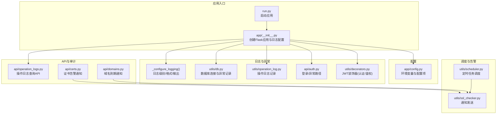
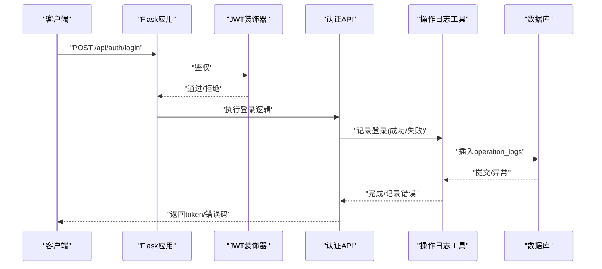
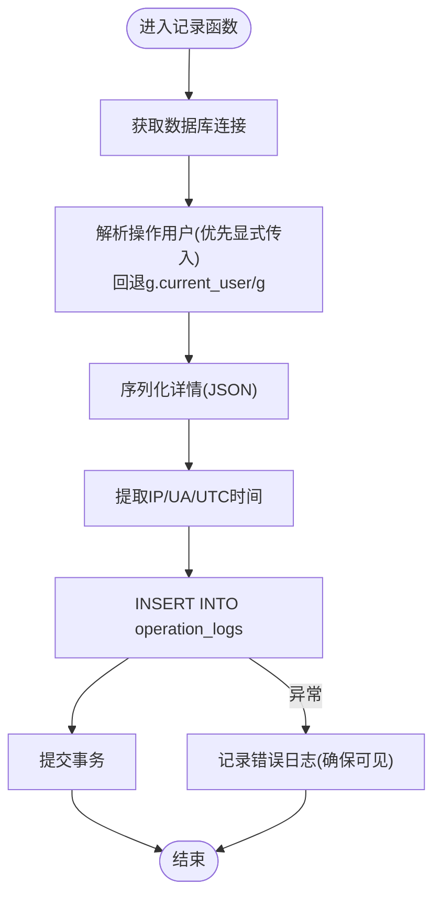
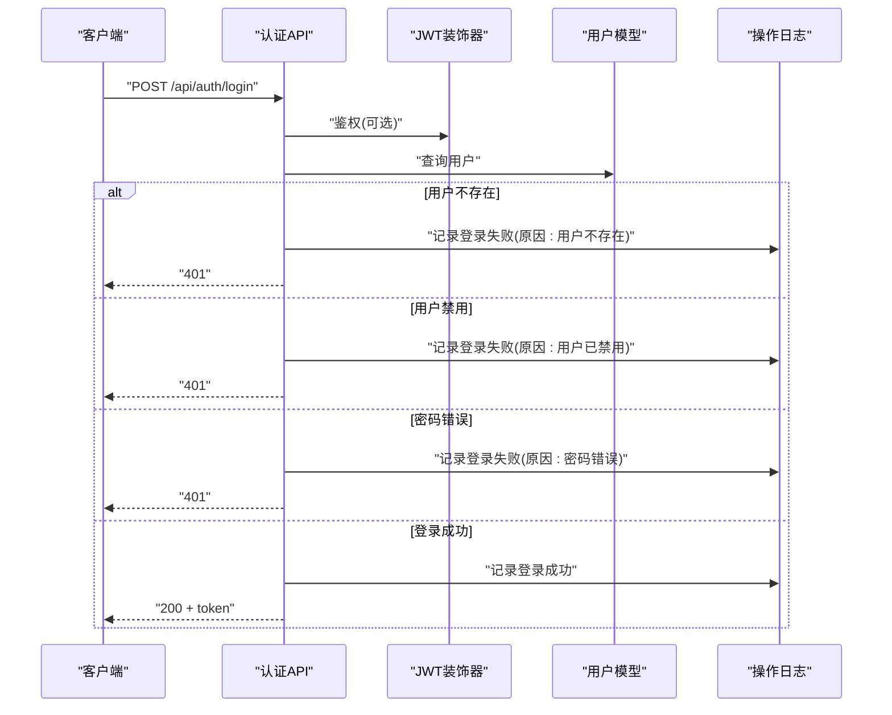
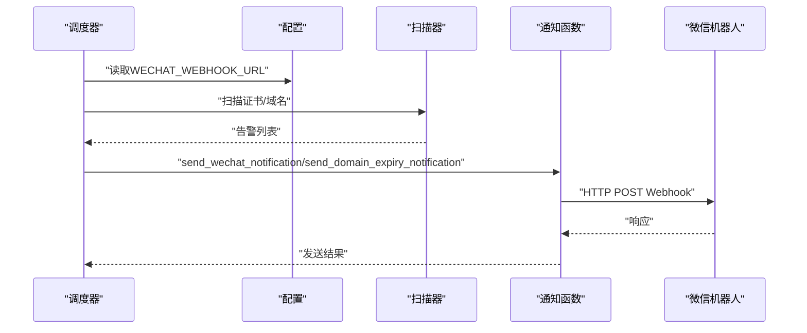
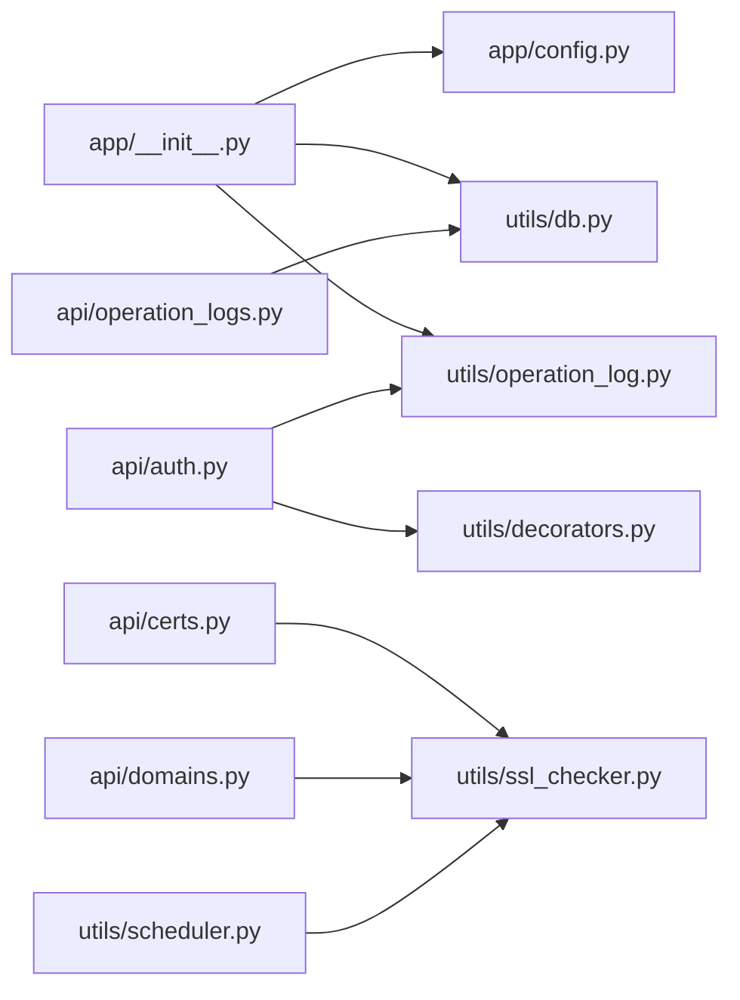

# 异常处理与日志

<cite>
**本文引用的文件**
- [app/__init__.py](file://backend/app/__init__.py)
- [app/config.py](file://backend/app/config.py)
- [app/utils/db.py](file://backend/app/utils/db.py)
- [app/utils/operation_log.py](file://backend/app/utils/operation_log.py)
- [app/api/operation_logs.py](file://backend/app/api/operation_logs.py)
- [app/api/auth.py](file://backend/app/api/auth.py)
- [app/utils/decorators.py](file://backend/app/utils/decorators.py)
- [app/utils/scheduler.py](file://backend/app/utils/scheduler.py)
- [app/utils/ssl_checker.py](file://backend/app/utils/ssl_checker.py)
- [app/api/certs.py](file://backend/app/api/certs.py)
- [app/api/domains.py](file://backend/app/api/domains.py)
- [run.py](file://backend/run.py)
</cite>

## 目录
1. [简介](#简介)
2. [项目结构](#项目结构)
3. [核心组件](#核心组件)
4. [架构总览](#架构总览)
5. [详细组件分析](#详细组件分析)
6. [依赖分析](#依赖分析)
7. [性能考虑](#性能考虑)
8. [故障排查指南](#故障排查指南)
9. [结论](#结论)
10. [附录](#附录)

## 简介
本文件系统性梳理了该运维平台的异常处理与日志记录体系，涵盖以下方面：
- 异常捕获与处理机制：应用级日志配置、数据库连接异常处理、认证流程中的异常分支、API 层错误响应策略。
- 日志记录实现：日志级别、输出格式、日志轮转策略现状与建议。
- 操作日志与审计：操作日志模型、记录接口、查询 API、审计字段设计。
- 错误报告与告警通知：微信机器人通知集成、定时调度触发告警。
- 日志分析与监控最佳实践：指标采集、可视化、故障定位方法。

## 项目结构
后端基于 Flask 应用，采用蓝图组织 API，日志与异常处理集中在应用初始化与工具模块中，数据库连接与操作日志由独立工具模块提供。

图表来源
- [app/__init__.py:28-114](file://backend/app/__init__.py#L28-L114)
- [app/config.py:10-58](file://backend/app/config.py#L10-L58)
- [app/utils/db.py:43-80](file://backend/app/utils/db.py#L43-L80)
- [app/utils/operation_log.py:49-172](file://backend/app/utils/operation_log.py#L49-L172)
- [app/api/auth.py:15-96](file://backend/app/api/auth.py#L15-L96)
- [app/utils/decorators.py:26-163](file://backend/app/utils/decorators.py#L26-L163)
- [app/api/operation_logs.py:20-136](file://backend/app/api/operation_logs.py#L20-L136)
- [app/api/certs.py:14](file://backend/app/api/certs.py#L14)
- [app/api/domains.py:6](file://backend/app/api/domains.py#L6)
- [app/utils/scheduler.py:303](file://backend/app/utils/scheduler.py#L303)
- [app/utils/ssl_checker.py:303](file://backend/app/utils/ssl_checker.py#L303)

章节来源
- [app/__init__.py:28-114](file://backend/app/__init__.py#L28-L114)
- [app/config.py:10-58](file://backend/app/config.py#L10-L58)

## 核心组件
- 应用日志配置：统一将日志输出到标准错误流，设置根日志器与 Flask 应用日志器级别，并抑制第三方库噪声。
- 数据库连接异常处理：连接失败时记录详细参数与异常栈，确保运维可观测性。
- 操作日志记录：封装通用记录函数，支持模块化、动作类型、目标对象、详情、IP、UA 等审计字段。
- 认证与异常路径：登录失败、用户不存在、禁用、密码错误等分支均记录操作日志并返回明确错误码。
- 定时告警与通知：通过调度器周期性扫描证书与域名，调用微信机器人 Webhook 发送告警。

章节来源
- [app/__init__.py:10-26](file://backend/app/__init__.py#L10-L26)
- [app/utils/db.py:43-80](file://backend/app/utils/db.py#L43-L80)
- [app/utils/operation_log.py:49-172](file://backend/app/utils/operation_log.py#L49-L172)
- [app/api/auth.py:15-96](file://backend/app/api/auth.py#L15-L96)
- [app/utils/scheduler.py:303](file://backend/app/utils/scheduler.py#L303)
- [app/utils/ssl_checker.py:303](file://backend/app/utils/ssl_checker.py#L303)

## 架构总览
应用启动时完成日志配置、数据库连通性检查、模式初始化与调度器启动。API 层在认证装饰器保护下访问业务逻辑，业务逻辑在必要处调用操作日志记录与数据库访问。定时任务周期性触发告警通知。

图表来源
- [app/api/auth.py:15-96](file://backend/app/api/auth.py#L15-L96)
- [app/utils/operation_log.py:49-132](file://backend/app/utils/operation_log.py#L49-L132)
- [app/utils/decorators.py:26-124](file://backend/app/utils/decorators.py#L26-L124)

## 详细组件分析

### 日志配置与异常处理
- 日志输出：统一输出到标准错误流，便于容器与进程管理器收集。
- 日志级别：根据调试开关设置根日志器与 Flask 应用日志器级别；抑制第三方库噪声。
- 数据库连接异常：连接失败时记录主机、端口、用户、数据库与异常栈，确保快速定位配置问题。
- 应用启动检查：启动阶段进行数据库连通性检查，失败时记录详细提示并抛出异常，避免静默失败。

章节来源
- [app/__init__.py:10-26](file://backend/app/__init__.py#L10-L26)
- [app/__init__.py:88-104](file://backend/app/__init__.py#L88-L104)
- [app/utils/db.py:43-80](file://backend/app/utils/db.py#L43-L80)

### 操作日志记录与审计
- 记录接口：提供通用记录函数，解析操作用户、提取客户端 IP 与 UA、序列化详情、使用 UTC 时间戳。
- 审计字段：包含模块、动作、目标 ID/名称、操作用户 ID/名称、IP、UA、详情 JSON、创建时间。
- 登录/登出快捷接口：封装登录成功/失败、登出的专用记录。
- 查询 API：支持按模块、动作、用户名、日期范围分页查询，返回总数与分页信息。

图表来源
- [app/utils/operation_log.py:49-119](file://backend/app/utils/operation_log.py#L49-L119)

章节来源
- [app/utils/operation_log.py:49-172](file://backend/app/utils/operation_log.py#L49-L172)
- [app/api/operation_logs.py:20-136](file://backend/app/api/operation_logs.py#L20-L136)

### 认证流程中的异常处理
- 缺失/格式错误的认证头：直接返回未认证错误。
- Token 校验失败/过期：返回未认证错误。
- 用户不存在/禁用：返回未认证/权限不足错误。
- 密码错误：返回未认证错误，并记录登录失败。
- 登录成功：生成令牌并返回用户信息，同时记录登录成功。

图表来源
- [app/api/auth.py:15-96](file://backend/app/api/auth.py#L15-L96)
- [app/utils/decorators.py:26-124](file://backend/app/utils/decorators.py#L26-L124)
- [app/utils/operation_log.py:121-131](file://backend/app/utils/operation_log.py#L121-L131)

章节来源
- [app/api/auth.py:15-96](file://backend/app/api/auth.py#L15-L96)
- [app/utils/decorators.py:26-124](file://backend/app/utils/decorators.py#L26-L124)

### 定时告警与通知
- 配置项：通过配置项提供微信机器人 Webhook 地址。
- 调度器：在调度器中读取配置，周期性扫描证书与域名，调用通知函数发送告警。
- 通知函数：封装微信通知与域名到期通知，返回发送结果布尔值。

图表来源
- [app/config.py:40](file://backend/app/config.py#L40)
- [app/utils/scheduler.py:303](file://backend/app/utils/scheduler.py#L303)
- [app/utils/scheduler.py:505](file://backend/app/utils/scheduler.py#L505)
- [app/utils/scheduler.py:563](file://backend/app/utils/scheduler.py#L563)
- [app/utils/ssl_checker.py:303](file://backend/app/utils/ssl_checker.py#L303)
- [app/api/certs.py:1049](file://backend/app/api/certs.py#L1049)
- [app/api/domains.py:605](file://backend/app/api/domains.py#L605)

章节来源
- [app/config.py:40](file://backend/app/config.py#L40)
- [app/utils/scheduler.py:303](file://backend/app/utils/scheduler.py#L303)
- [app/utils/scheduler.py:505](file://backend/app/utils/scheduler.py#L505)
- [app/utils/scheduler.py:563](file://backend/app/utils/scheduler.py#L563)
- [app/utils/ssl_checker.py:303](file://backend/app/utils/ssl_checker.py#L303)
- [app/api/certs.py:14](file://backend/app/api/certs.py#L14)
- [app/api/domains.py:6](file://backend/app/api/domains.py#L6)

## 依赖分析
- 组件耦合：日志配置集中于应用初始化；数据库工具与操作日志工具分别服务于不同层次；认证 API 依赖装饰器与操作日志工具；调度器依赖通知工具与配置。
- 外部依赖：Flask、Flask-CORS、PyMySQL、定时任务调度器、微信 Webhook。
- 可能的循环依赖：当前模块间为单向依赖，未发现循环导入。

图表来源
- [app/__init__.py:28-114](file://backend/app/__init__.py#L28-L114)
- [app/config.py:10-58](file://backend/app/config.py#L10-L58)
- [app/utils/db.py:43-80](file://backend/app/utils/db.py#L43-L80)
- [app/utils/operation_log.py:49-172](file://backend/app/utils/operation_log.py#L49-L172)
- [app/api/auth.py:15-96](file://backend/app/api/auth.py#L15-L96)
- [app/utils/decorators.py:26-163](file://backend/app/utils/decorators.py#L26-L163)
- [app/api/operation_logs.py:20-136](file://backend/app/api/operation_logs.py#L20-L136)
- [app/api/certs.py:14](file://backend/app/api/certs.py#L14)
- [app/api/domains.py:6](file://backend/app/api/domains.py#L6)
- [app/utils/scheduler.py:303](file://backend/app/utils/scheduler.py#L303)
- [app/utils/ssl_checker.py:303](file://backend/app/utils/ssl_checker.py#L303)

## 性能考虑
- 日志级别：生产环境建议使用 INFO 或更高，避免 DEBUG 过多带来的 I/O 压力。
- 日志输出：标准错误流利于外部收集，但需结合日志聚合系统实现轮转与归档。
- 数据库连接：连接超时与异常栈记录有助于快速定位配置问题，避免长阻塞。
- 操作日志写入：批量写入与异步队列可进一步降低写入延迟，当前实现为同步写入。
- 告警频率：调度器 Cron 配置需合理设置，避免频繁告警风暴。

## 故障排查指南
- 启动阶段数据库检查失败
  - 现象：启动时报错并提示核对环境变量与网络。
  - 排查：确认数据库主机、端口、用户、密码、库名；检查网络连通性与防火墙。
  - 参考
    - [app/__init__.py:88-104](file://backend/app/__init__.py#L88-L104)
    - [app/utils/db.py:43-80](file://backend/app/utils/db.py#L43-L80)
- 认证失败
  - 现象：登录返回 401，操作日志记录失败原因。
  - 排查：确认用户名是否存在、是否启用、密码是否正确；检查 Token 是否过期。
  - 参考
    - [app/api/auth.py:15-96](file://backend/app/api/auth.py#L15-L96)
    - [app/utils/operation_log.py:121-131](file://backend/app/utils/operation_log.py#L121-L131)
- 操作日志无法查询
  - 现象：查询接口返回错误或空数据。
  - 排查：确认分页参数、筛选条件、数据库连通性；检查 operation_logs 表结构。
  - 参考
    - [app/api/operation_logs.py:20-136](file://backend/app/api/operation_logs.py#L20-L136)
- 告警未送达
  - 现象：调度器扫描到风险但未收到通知。
  - 排查：确认微信 Webhook URL 配置；检查网络可达性与 Webhook 有效性。
  - 参考
    - [app/config.py:40](file://backend/app/config.py#L40)
    - [app/utils/scheduler.py:505](file://backend/app/utils/scheduler.py#L505)
    - [app/utils/ssl_checker.py:303](file://backend/app/utils/ssl_checker.py#L303)

章节来源
- [app/__init__.py:88-104](file://backend/app/__init__.py#L88-L104)
- [app/utils/db.py:43-80](file://backend/app/utils/db.py#L43-L80)
- [app/api/auth.py:15-96](file://backend/app/api/auth.py#L15-L96)
- [app/utils/operation_log.py:121-131](file://backend/app/utils/operation_log.py#L121-L131)
- [app/api/operation_logs.py:20-136](file://backend/app/api/operation_logs.py#L20-L136)
- [app/config.py:40](file://backend/app/config.py#L40)
- [app/utils/scheduler.py:505](file://backend/app/utils/scheduler.py#L505)
- [app/utils/ssl_checker.py:303](file://backend/app/utils/ssl_checker.py#L303)

## 结论
该系统在日志与异常处理方面具备清晰的职责划分：应用初始化集中配置日志与数据库检查，工具模块提供数据库与操作日志能力，API 层在认证与业务流程中嵌入审计点，调度器驱动告警通知。建议在生产环境中强化日志轮转与聚合、引入异步通知与重试、优化操作日志写入性能，并完善错误恢复与降级策略。

## 附录
- 启动入口
  - [run.py:1-8](file://backend/run.py#L1-L8)
- 配置项参考
  - [app/config.py:10-58](file://backend/app/config.py#L10-L58)
- 操作日志模型字段
  - [app/utils/operation_log.py:90-108](file://backend/app/utils/operation_log.py#L90-L108)