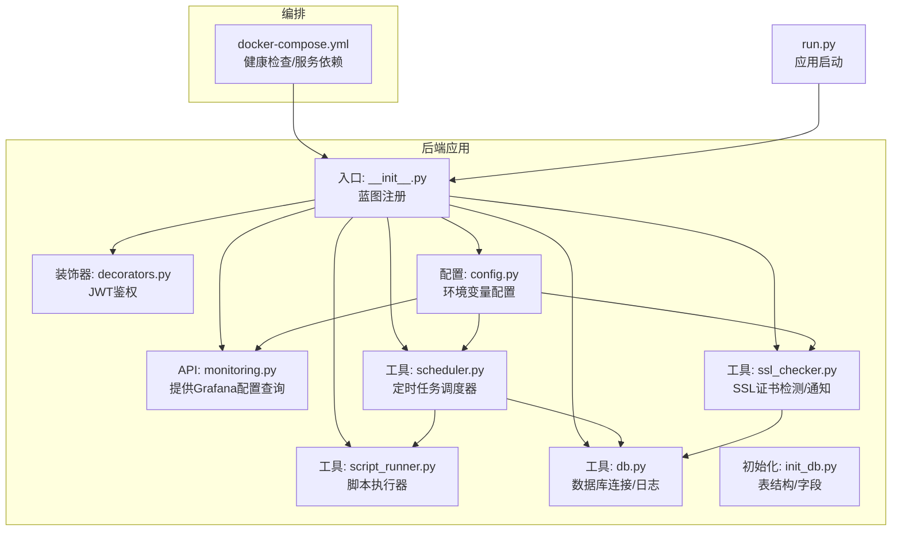
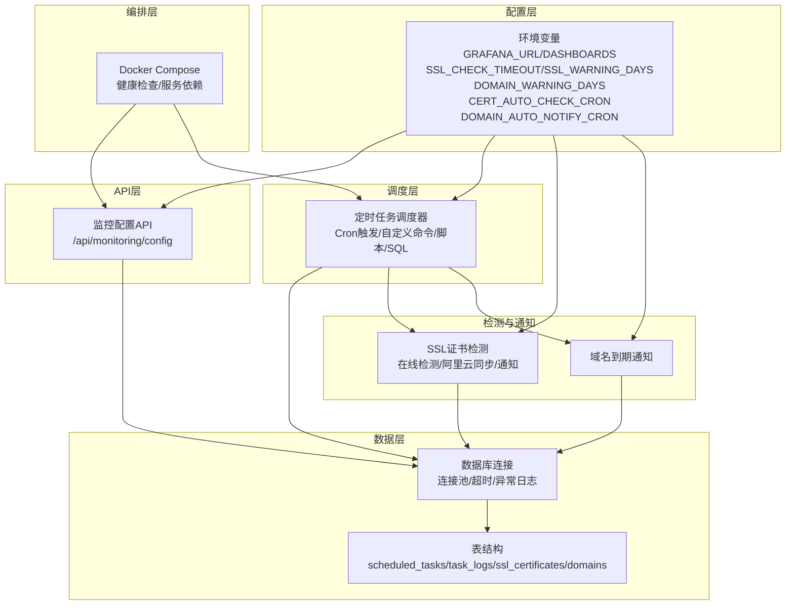
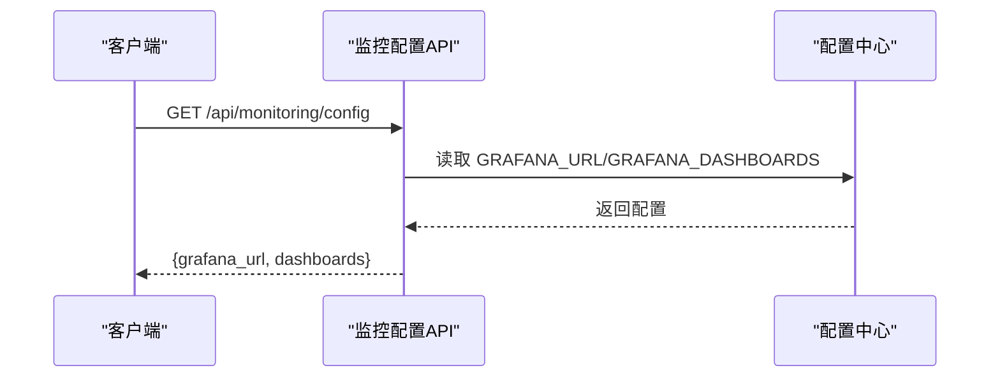
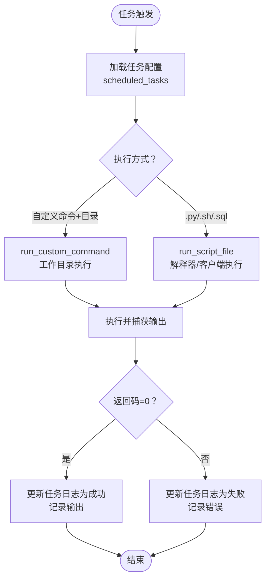
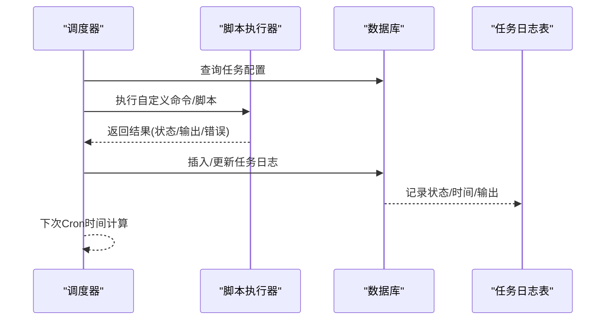
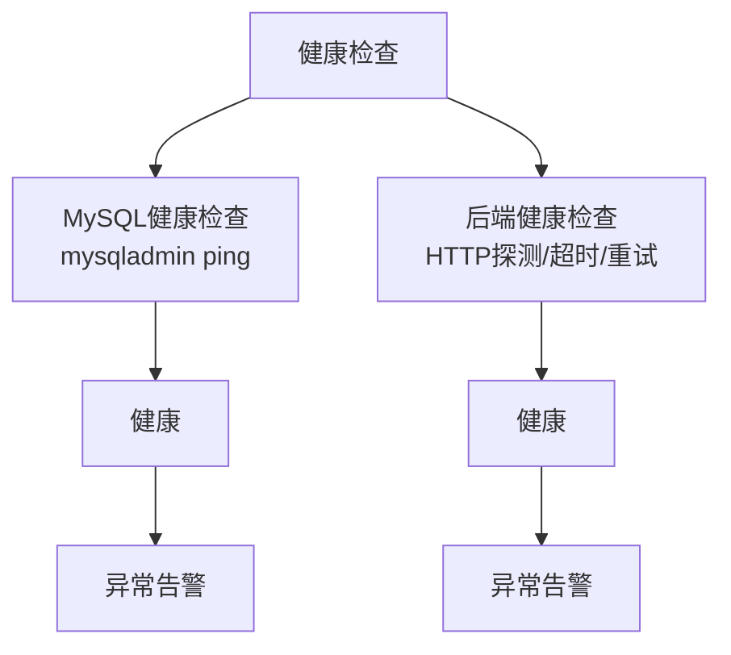
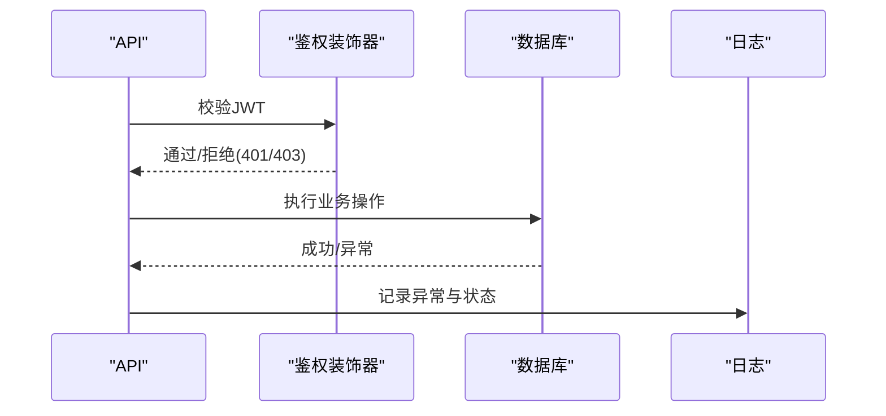
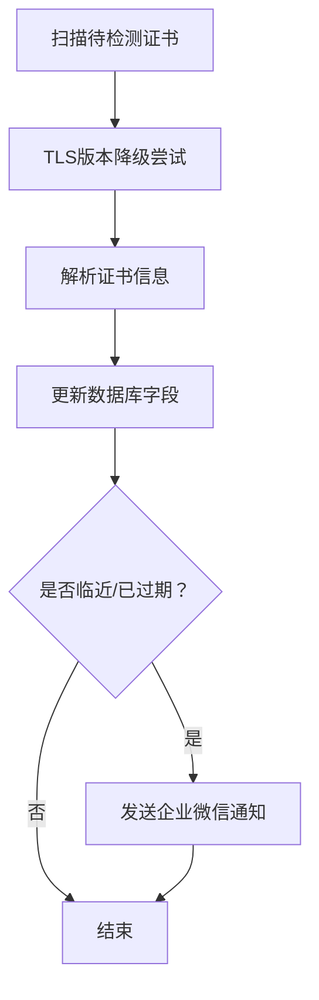
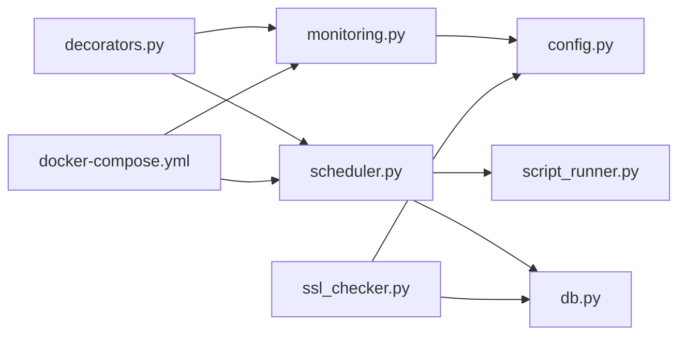

# 监控告警

<cite>
**本文引用的文件**
- [backend/app/api/monitoring.py](file://backend/app/api/monitoring.py)
- [backend/app/utils/scheduler.py](file://backend/app/utils/scheduler.py)
- [backend/app/utils/db.py](file://backend/app/utils/db.py)
- [backend/app/utils/ssl_checker.py](file://backend/app/utils/ssl_checker.py)
- [backend/app/utils/script_runner.py](file://backend/app/utils/script_runner.py)
- [backend/app/utils/decorators.py](file://backend/app/utils/decorators.py)
- [backend/app/config.py](file://backend/app/config.py)
- [backend/app/__init__.py](file://backend/app/__init__.py)
- [backend/init_db.py](file://backend/init_db.py)
- [docker-compose.yml](file://docker-compose.yml)
- [backend/run.py](file://backend/run.py)
</cite>

## 目录
1. [简介](#简介)
2. [项目结构](#项目结构)
3. [核心组件](#核心组件)
4. [架构总览](#架构总览)
5. [组件详解](#组件详解)
6. [依赖关系分析](#依赖关系分析)
7. [性能考量](#性能考量)
8. [故障排查指南](#故障排查指南)
9. [结论](#结论)
10. [附录](#附录)

## 简介
本文件面向OPS项目的监控与告警体系，围绕以下目标展开：
- Grafana集成：配置与使用，包括监控指标采集、仪表板配置、告警规则设置
- 定时任务调度器：任务定义、执行策略、异常处理、性能监控
- 健康检查机制：服务可用性监控、数据库连接检查、外部API调用监控
- 异常处理与错误报告：错误捕获、日志记录、告警通知
- 最佳实践、性能优化、故障诊断与运维自动化
- 监控数据分析与趋势预测方法

## 项目结构
后端采用Flask应用，监控与告警相关能力主要分布在如下模块：
- API层：提供监控配置查询接口
- 工具层：调度器、数据库连接、SSL证书检测、脚本执行、鉴权装饰器
- 配置层：环境变量驱动的监控与告警参数
- 初始化：数据库表结构与默认数据
- 编排：Docker Compose健康检查与服务编排

**图表来源**
- [backend/app/api/monitoring.py:1-42](file://backend/app/api/monitoring.py#L1-L42)
- [backend/app/utils/scheduler.py:1-580](file://backend/app/utils/scheduler.py#L1-L580)
- [backend/app/utils/ssl_checker.py:1-613](file://backend/app/utils/ssl_checker.py#L1-L613)
- [backend/app/utils/script_runner.py:1-126](file://backend/app/utils/script_runner.py#L1-L126)
- [backend/app/utils/db.py:1-80](file://backend/app/utils/db.py#L1-L80)
- [backend/app/utils/decorators.py:1-163](file://backend/app/utils/decorators.py#L1-L163)
- [backend/app/config.py:1-58](file://backend/app/config.py#L1-L58)
- [backend/app/__init__.py:120-149](file://backend/app/__init__.py#L120-L149)
- [backend/init_db.py:190-236](file://backend/init_db.py#L190-L236)
- [docker-compose.yml:1-103](file://docker-compose.yml#L1-L103)
- [backend/run.py:1-8](file://backend/run.py#L1-L8)

**章节来源**
- [backend/app/__init__.py:120-149](file://backend/app/__init__.py#L120-L149)
- [backend/app/config.py:10-58](file://backend/app/config.py#L10-L58)
- [docker-compose.yml:1-103](file://docker-compose.yml#L1-L103)

## 核心组件
- Grafana集成配置API：提供Grafana地址与仪表板UID列表，便于前端或运维配置
- 定时任务调度器：基于APScheduler，支持Cron表达式、自定义命令、脚本文件、SQL执行、日志记录与异常处理
- SSL证书检测与通知：在线证书检测、阿里云证书同步、企业微信通知
- 数据库连接与日志：连接池化、超时控制、异常记录
- 健康检查：MySQL与后端服务的健康检查
- 鉴权装饰器：JWT认证与权限控制

**章节来源**
- [backend/app/api/monitoring.py:11-42](file://backend/app/api/monitoring.py#L11-L42)
- [backend/app/utils/scheduler.py:181-384](file://backend/app/utils/scheduler.py#L181-L384)
- [backend/app/utils/ssl_checker.py:48-166](file://backend/app/utils/ssl_checker.py#L48-L166)
- [backend/app/utils/db.py:43-80](file://backend/app/utils/db.py#L43-L80)
- [docker-compose.yml:25-79](file://docker-compose.yml#L25-L79)
- [backend/app/utils/decorators.py:26-124](file://backend/app/utils/decorators.py#L26-L124)

## 架构总览
OPS后端通过配置中心（环境变量）驱动监控与告警参数，API层提供Grafana配置查询，调度器负责周期性任务执行，SSL检测模块负责证书与域名到期预警，数据库模块负责连接与日志记录，Docker Compose负责服务健康检查与依赖编排。

**图表来源**
- [backend/app/config.py:40-58](file://backend/app/config.py#L40-L58)
- [backend/app/api/monitoring.py:11-42](file://backend/app/api/monitoring.py#L11-L42)
- [backend/app/utils/scheduler.py:244-384](file://backend/app/utils/scheduler.py#L244-L384)
- [backend/app/utils/ssl_checker.py:304-491](file://backend/app/utils/ssl_checker.py#L304-L491)
- [backend/app/utils/db.py:43-80](file://backend/app/utils/db.py#L43-L80)
- [backend/init_db.py:190-236](file://backend/init_db.py#L190-L236)
- [docker-compose.yml:25-79](file://docker-compose.yml#L25-L79)

## 组件详解

### Grafana集成配置
- 接口：GET /api/monitoring/config
- 功能：返回Grafana地址与仪表板UID列表；若未配置返回空地址与空列表
- 配置来源：环境变量 GRAFANA_URL、GRAFANA_DASHBOARDS
- 使用建议：前端根据返回的URL与UID拼接仪表板链接；在Grafana中确保数据源可用

**图表来源**
- [backend/app/api/monitoring.py:11-42](file://backend/app/api/monitoring.py#L11-L42)
- [backend/app/config.py:52-53](file://backend/app/config.py#L52-L53)

**章节来源**
- [backend/app/api/monitoring.py:11-42](file://backend/app/api/monitoring.py#L11-L42)
- [backend/app/config.py:52-53](file://backend/app/config.py#L52-L53)

### 定时任务调度器
- 任务来源：数据库 scheduled_tasks 表，包含任务ID、名称、Cron表达式、脚本路径/命令、脚本文件集合、状态与输出等
- 执行策略：
  - Cron触发：解析5字段表达式，替换旧任务并加入调度器
  - 执行命令：优先使用自定义命令与任务目录（多脚本）
  - 脚本文件：支持 .py/.sh/.sql，分别由对应解释器或mysql客户端执行
  - 线程执行：在独立线程中执行，避免阻塞调度器
- 异常处理：
  - 超时：300秒超时，记录失败
  - 文件/命令/脚本错误：捕获异常并更新任务日志与状态
  - 数据库异常：记录错误并提交/回滚
- 性能监控：
  - 任务日志表 task_logs 记录状态、开始/结束时间、输出与错误
  - 调度器启动后记录日志，便于追踪
- 内置任务：
  - SSL证书自动检测与通知（Cron可配置）
  - 域名到期自动通知（Cron可配置）

**图表来源**
- [backend/app/utils/scheduler.py:39-179](file://backend/app/utils/scheduler.py#L39-L179)
- [backend/app/utils/script_runner.py:19-116](file://backend/app/utils/script_runner.py#L19-L116)

**图表来源**
- [backend/app/utils/scheduler.py:244-384](file://backend/app/utils/scheduler.py#L244-L384)
- [backend/app/utils/script_runner.py:19-116](file://backend/app/utils/script_runner.py#L19-L116)
- [backend/init_db.py:190-236](file://backend/init_db.py#L190-L236)

**章节来源**
- [backend/app/utils/scheduler.py:181-384](file://backend/app/utils/scheduler.py#L181-L384)
- [backend/app/utils/script_runner.py:19-116](file://backend/app/utils/script_runner.py#L19-L116)
- [backend/init_db.py:190-236](file://backend/init_db.py#L190-L236)

### 健康检查机制
- 数据库健康检查：MySQL容器健康检查使用 ping 命令
- 后端服务健康检查：容器健康检查通过HTTP探测本地端口，失败重试
- 健康检查建议：结合Prometheus/Grafana指标与容器健康检查双通道监控

**图表来源**
- [docker-compose.yml:25-28](file://docker-compose.yml#L25-L28)
- [docker-compose.yml:70-80](file://docker-compose.yml#L70-L80)

**章节来源**
- [docker-compose.yml:25-28](file://docker-compose.yml#L25-L28)
- [docker-compose.yml:70-80](file://docker-compose.yml#L70-L80)

### 异常处理与错误报告
- 数据库连接异常：捕获连接失败并记录详细参数
- 任务执行异常：统一捕获超时、文件/命令/脚本错误，更新日志与状态
- 通知异常：企业微信通知带重试与错误日志
- 鉴权异常：JWT认证失败、用户不存在/禁用、密码变更导致令牌失效等

**图表来源**
- [backend/app/utils/decorators.py:26-124](file://backend/app/utils/decorators.py#L26-L124)
- [backend/app/utils/db.py:48-68](file://backend/app/utils/db.py#L48-L68)
- [backend/app/utils/scheduler.py:134-168](file://backend/app/utils/scheduler.py#L134-L168)
- [backend/app/utils/ssl_checker.py:377-395](file://backend/app/utils/ssl_checker.py#L377-L395)

**章节来源**
- [backend/app/utils/decorators.py:26-124](file://backend/app/utils/decorators.py#L26-L124)
- [backend/app/utils/db.py:48-68](file://backend/app/utils/db.py#L48-L68)
- [backend/app/utils/scheduler.py:134-168](file://backend/app/utils/scheduler.py#L134-L168)
- [backend/app/utils/ssl_checker.py:377-395](file://backend/app/utils/ssl_checker.py#L377-L395)

### SSL证书检测与通知
- 在线检测：支持TLS版本降级，解析证书并计算剩余天数
- 阿里云证书：扫描与下载证书内容
- 通知：企业微信Markdown通知，带统计与分级状态

**图表来源**
- [backend/app/utils/ssl_checker.py:48-166](file://backend/app/utils/ssl_checker.py#L48-L166)
- [backend/app/utils/scheduler.py:391-533](file://backend/app/utils/scheduler.py#L391-L533)

**章节来源**
- [backend/app/utils/ssl_checker.py:48-166](file://backend/app/utils/ssl_checker.py#L48-L166)
- [backend/app/utils/scheduler.py:391-533](file://backend/app/utils/scheduler.py#L391-L533)

## 依赖关系分析
- API依赖配置中心与数据库；调度器依赖脚本执行器与数据库；SSL检测依赖数据库与外部API；健康检查依赖Docker Compose
- 关键耦合点：数据库连接、Cron表达式解析、通知Webhook

**图表来源**
- [backend/app/api/monitoring.py:11-42](file://backend/app/api/monitoring.py#L11-L42)
- [backend/app/utils/scheduler.py:181-384](file://backend/app/utils/scheduler.py#L181-L384)
- [backend/app/utils/script_runner.py:19-116](file://backend/app/utils/script_runner.py#L19-L116)
- [backend/app/utils/db.py:43-80](file://backend/app/utils/db.py#L43-L80)
- [backend/app/utils/ssl_checker.py:304-491](file://backend/app/utils/ssl_checker.py#L304-L491)
- [backend/app/utils/decorators.py:26-124](file://backend/app/utils/decorators.py#L26-L124)
- [docker-compose.yml:25-79](file://docker-compose.yml#L25-L79)

**章节来源**
- [backend/app/api/monitoring.py:11-42](file://backend/app/api/monitoring.py#L11-L42)
- [backend/app/utils/scheduler.py:181-384](file://backend/app/utils/scheduler.py#L181-L384)
- [backend/app/utils/script_runner.py:19-116](file://backend/app/utils/script_runner.py#L19-L116)
- [backend/app/utils/db.py:43-80](file://backend/app/utils/db.py#L43-L80)
- [backend/app/utils/ssl_checker.py:304-491](file://backend/app/utils/ssl_checker.py#L304-L491)
- [backend/app/utils/decorators.py:26-124](file://backend/app/utils/decorators.py#L26-L124)
- [docker-compose.yml:25-79](file://docker-compose.yml#L25-L79)

## 性能考量
- 调度器并发：任务在独立线程执行，避免阻塞；建议限制同时运行任务数量
- 超时控制：脚本执行默认300秒超时，可根据任务复杂度调整
- 数据库连接：连接超时与异常日志，建议使用连接池与重试
- 通知重试：企业微信通知带最大重试次数，避免瞬时网络波动影响
- Cron粒度：合理设置Cron表达式，避免高并发重叠

[本节为通用指导，无需特定文件引用]

## 故障排查指南
- Grafana配置为空：确认环境变量 GRAFANA_URL 与 GRAFANA_DASHBOARDS 是否正确
- 任务未执行：检查 scheduled_tasks 表 isActive、cron_expression、脚本路径/命令是否存在
- 任务执行失败：查看 task_logs 表 status、error_message、output 字段
- 数据库连接失败：检查DB_HOST/PORT/USER/PASSWORD/NAME，查看日志异常堆栈
- 通知失败：检查 WECHAT_WEBHOOK_URL 与重试日志
- 健康检查失败：查看Docker Compose健康检查配置与后端HTTP可达性

**章节来源**
- [backend/app/api/monitoring.py:17-28](file://backend/app/api/monitoring.py#L17-L28)
- [backend/app/utils/scheduler.py:134-168](file://backend/app/utils/scheduler.py#L134-L168)
- [backend/app/utils/db.py:48-68](file://backend/app/utils/db.py#L48-L68)
- [backend/app/utils/ssl_checker.py:377-395](file://backend/app/utils/ssl_checker.py#L377-L395)
- [docker-compose.yml:70-80](file://docker-compose.yml#L70-L80)

## 结论
OPS项目的监控与告警体系以配置为中心，结合定时任务调度、SSL与域名预警、数据库与服务健康检查，形成闭环。建议在生产环境中完善Grafana指标采集、Prometheus抓取、告警规则与通知链路，并持续优化任务执行策略与异常处理流程。

[本节为总结，无需特定文件引用]

## 附录

### 监控最佳实践
- 指标采集：统一使用Grafana数据源，按模块划分仪表板
- 告警规则：基于阈值与趋势，区分紧急/严重/提醒级别
- 可视化：关键指标卡片化，支持快速定位
- 日志聚合：集中化日志收集与检索

[本节为通用指导，无需特定文件引用]

### 运维自动化方案
- 任务编排：通过Cron表达式与任务目录实现多脚本协作
- 通知自动化：企业微信通知与邮件/IM联动
- 健康检查：容器健康检查与外部探活结合

[本节为通用指导，无需特定文件引用]

### 监控数据分析与趋势预测
- 指标趋势：基于历史任务日志与证书检测数据，识别异常波动
- 预测方法：移动平均、指数平滑、季节性分解等时间序列方法
- 告警联动：趋势异常触发预警，避免误报

[本节为通用指导，无需特定文件引用]