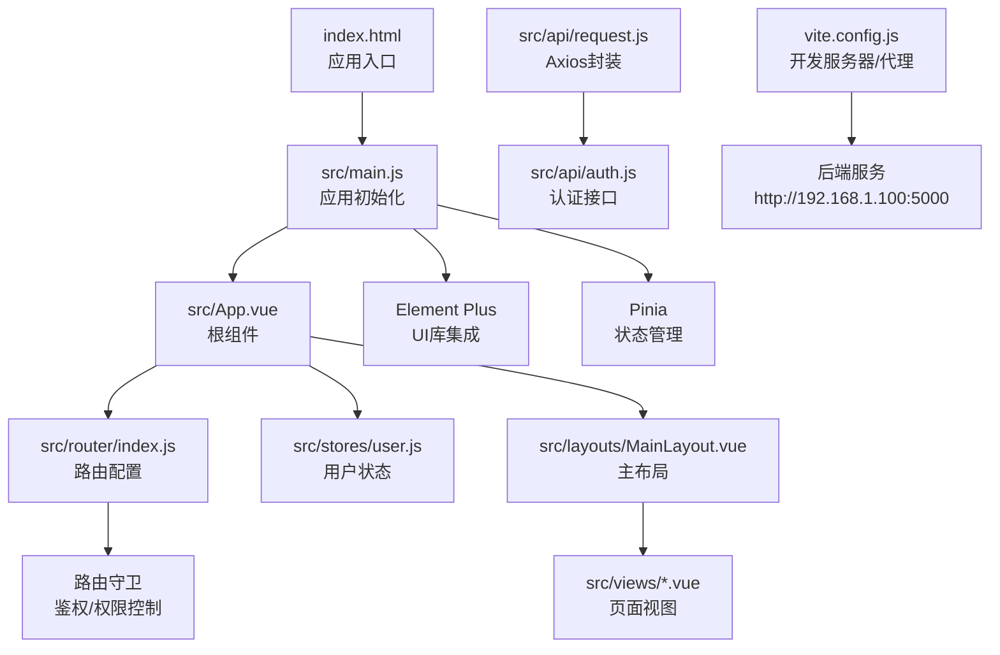
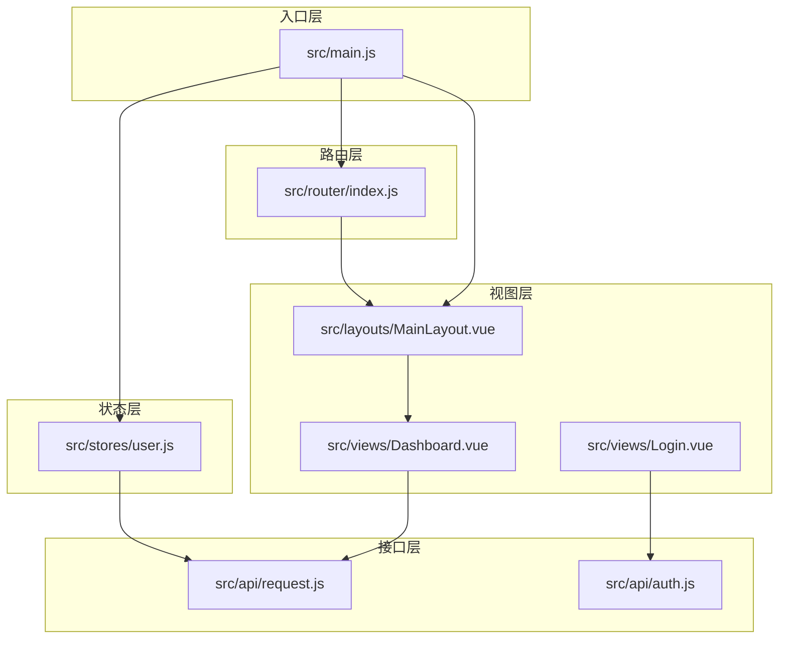
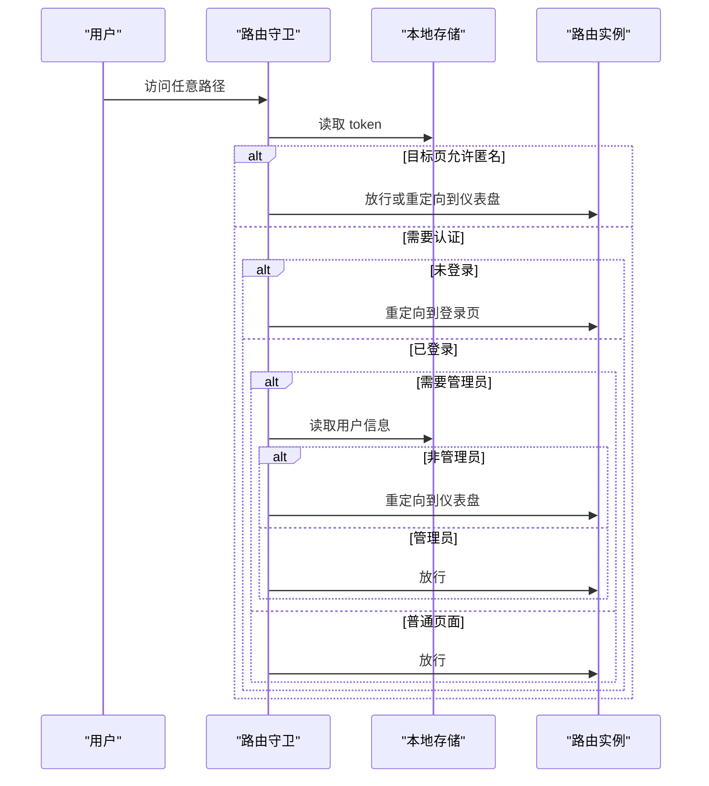
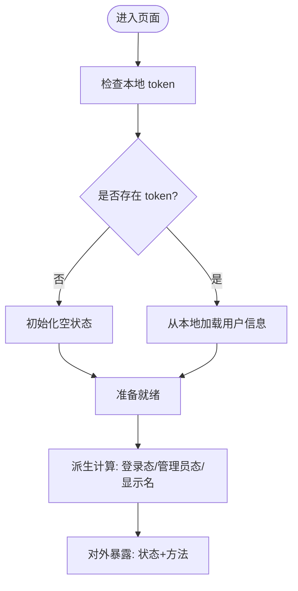
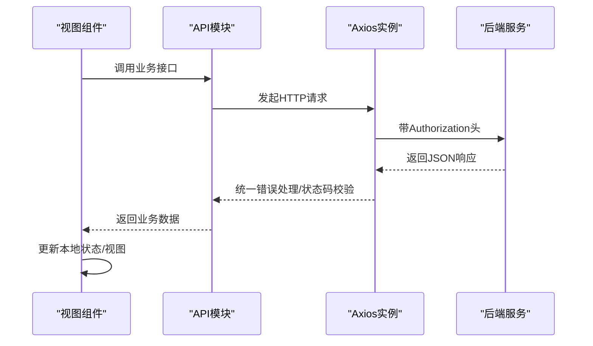
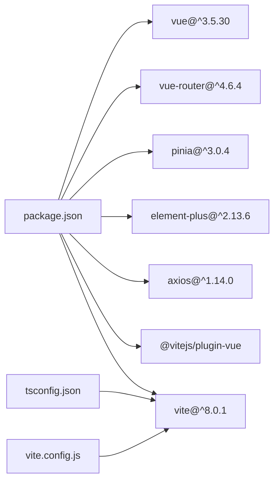
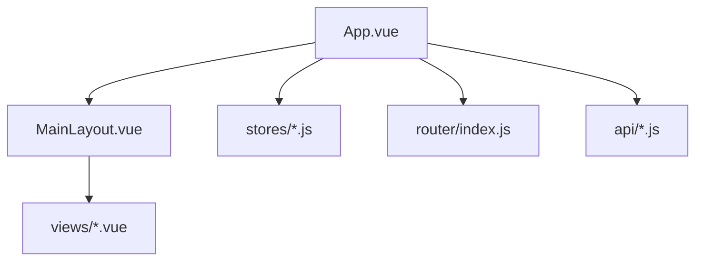
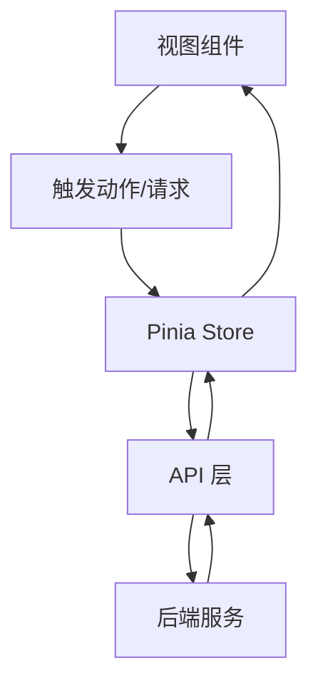

# 前端架构设计

<cite>
**本文引用的文件**
- [frontend/src/main.js](file://frontend/src/main.js)
- [frontend/src/App.vue](file://frontend/src/App.vue)
- [frontend/src/router/index.js](file://frontend/src/router/index.js)
- [frontend/src/stores/user.js](file://frontend/src/stores/user.js)
- [frontend/src/layouts/MainLayout.vue](file://frontend/src/layouts/MainLayout.vue)
- [frontend/src/views/Login.vue](file://frontend/src/views/Login.vue)
- [frontend/src/views/Dashboard.vue](file://frontend/src/views/Dashboard.vue)
- [frontend/src/api/request.js](file://frontend/src/api/request.js)
- [frontend/src/api/auth.js](file://frontend/src/api/auth.js)
- [frontend/package.json](file://frontend/package.json)
- [frontend/vite.config.js](file://frontend/vite.config.js)
- [frontend/tsconfig.json](file://frontend/tsconfig.json)
- [frontend/src/style.css](file://frontend/src/style.css)
- [frontend/index.html](file://frontend/index.html)
</cite>

## 目录
1. [引言](#引言)
2. [项目结构](#项目结构)
3. [核心组件](#核心组件)
4. [架构总览](#架构总览)
5. [详细组件分析](#详细组件分析)
6. [依赖关系分析](#依赖关系分析)
7. [性能考虑](#性能考虑)
8. [故障排查指南](#故障排查指南)
9. [结论](#结论)
10. [附录](#附录)

## 引言
本文件面向Vue.js单页应用（SPA）的前端架构设计，围绕以下目标展开：  
- Vue.js 3.x Composition API 的使用与组件化开发理念  
- 路由系统设计（路由守卫、动态路由、嵌套路由）  
- 状态管理（Pinia Store）与数据流管理  
- UI 组件库 Element Plus 的集成与自定义组件开发规范  
- 构建配置、开发环境与生产环境优化策略  
- 提供组件层次结构图与数据流向图，帮助读者快速理解系统全貌

## 项目结构
前端采用基于功能域的组织方式，核心目录如下：  
- src：源代码根目录  
  - api：统一的后端接口封装与拦截器  
  - components：可复用通用组件  
  - layouts：布局容器组件  
  - router：路由定义与守卫  
  - stores：Pinia 状态管理模块  
  - views：页面级视图组件  
  - assets：静态资源  
  - App.vue、main.js：应用入口与挂载点  
- public：公共资源与模板页（本项目主要使用 SPA 模式，public 下的模板页为历史遗留）  
- 配置文件：package.json、vite.config.js、tsconfig.json、index.html  

图表来源
- [frontend/index.html:1-14](file://frontend/index.html#L1-L14)
- [frontend/src/main.js:1-23](file://frontend/src/main.js#L1-L23)
- [frontend/src/App.vue:1-18](file://frontend/src/App.vue#L1-L18)
- [frontend/src/router/index.js:1-61](file://frontend/src/router/index.js#L1-L61)
- [frontend/src/stores/user.js:1-41](file://frontend/src/stores/user.js#L1-L41)
- [frontend/src/layouts/MainLayout.vue:1-237](file://frontend/src/layouts/MainLayout.vue#L1-L237)
- [frontend/src/api/request.js:1-54](file://frontend/src/api/request.js#L1-L54)
- [frontend/src/api/auth.js:1-14](file://frontend/src/api/auth.js#L1-L14)
- [frontend/vite.config.js:1-16](file://frontend/vite.config.js#L1-L16)

章节来源
- [frontend/src/main.js:1-23](file://frontend/src/main.js#L1-L23)
- [frontend/src/App.vue:1-18](file://frontend/src/App.vue#L1-L18)
- [frontend/src/router/index.js:1-61](file://frontend/src/router/index.js#L1-L61)
- [frontend/src/stores/user.js:1-41](file://frontend/src/stores/user.js#L1-L41)
- [frontend/src/layouts/MainLayout.vue:1-237](file://frontend/src/layouts/MainLayout.vue#L1-L237)
- [frontend/src/api/request.js:1-54](file://frontend/src/api/request.js#L1-L54)
- [frontend/src/api/auth.js:1-14](file://frontend/src/api/auth.js#L1-L14)
- [frontend/vite.config.js:1-16](file://frontend/vite.config.js#L1-L16)
- [frontend/package.json:1-24](file://frontend/package.json#L1-L24)
- [frontend/tsconfig.json:1-27](file://frontend/tsconfig.json#L1-L27)
- [frontend/src/style.css:1-297](file://frontend/src/style.css#L1-L297)
- [frontend/index.html:1-14](file://frontend/index.html#L1-L14)

## 核心组件
- 应用入口与插件注册：在入口中完成 Pinia、路由、Element Plus 的安装与全局图标注册，随后挂载到 DOM。  
- 根组件：最外层容器，仅负责渲染当前路由视图。  
- 主布局：提供侧边菜单、面包屑、顶部导航与内容区域，承载页面级视图。  
- 用户状态：集中管理 token、用户信息、登录态与管理员角色等，支持持久化与派生计算。  
- 路由系统：定义登录页与嵌套路由，配合全局前置守卫进行鉴权与权限控制。  
- 接口层：Axios 封装统一添加 Authorization 头、错误处理与 401 自动登出；各业务模块通过独立 API 文件调用。

章节来源
- [frontend/src/main.js:1-23](file://frontend/src/main.js#L1-L23)
- [frontend/src/App.vue:1-18](file://frontend/src/App.vue#L1-L18)
- [frontend/src/layouts/MainLayout.vue:1-237](file://frontend/src/layouts/MainLayout.vue#L1-L237)
- [frontend/src/stores/user.js:1-41](file://frontend/src/stores/user.js#L1-L41)
- [frontend/src/router/index.js:1-61](file://frontend/src/router/index.js#L1-L61)
- [frontend/src/api/request.js:1-54](file://frontend/src/api/request.js#L1-L54)

## 架构总览
整体采用“入口初始化 → 路由驱动 → 布局承载 → 视图渲染 → 状态与接口协同”的分层架构。  
- 入口层：注册插件、全局样式与图标，确保运行时环境就绪。  
- 路由层：定义页面路径、嵌套关系与守卫逻辑，保证访问安全与体验一致性。  
- 视图层：页面组件按功能拆分，共享布局与通用交互。  
- 状态层：Pinia Store 抽象用户会话与权限，避免跨组件重复逻辑。  
- 接口层：统一请求/响应拦截，屏蔽底层细节，提升可维护性。

图表来源
- [frontend/src/main.js:1-23](file://frontend/src/main.js#L1-L23)
- [frontend/src/router/index.js:1-61](file://frontend/src/router/index.js#L1-L61)
- [frontend/src/layouts/MainLayout.vue:1-237](file://frontend/src/layouts/MainLayout.vue#L1-L237)
- [frontend/src/views/Login.vue:1-114](file://frontend/src/views/Login.vue#L1-L114)
- [frontend/src/views/Dashboard.vue:1-307](file://frontend/src/views/Dashboard.vue#L1-L307)
- [frontend/src/stores/user.js:1-41](file://frontend/src/stores/user.js#L1-L41)
- [frontend/src/api/request.js:1-54](file://frontend/src/api/request.js#L1-L54)
- [frontend/src/api/auth.js:1-14](file://frontend/src/api/auth.js#L1-L14)

## 详细组件分析

### 路由系统与守卫
- 路由定义：包含登录页与根路径下的嵌套路由，子路由覆盖仪表盘、服务器、服务、账户、应用、证书、记录、任务、用户管理、修改密码等。  
- 动态导入：视图组件采用异步加载，提升首屏性能。  
- 守卫逻辑：  
  - requiresAuth=false：登录页无需认证；若已登录访问登录页则重定向至仪表盘。  
  - 需认证但未登录：重定向至登录页。  
  - requiresAdmin：仅管理员可见，非管理员跳转回仪表盘。  
- 嵌套路由：根布局组件承载子路由视图，形成“布局-页面”层级。

图表来源
- [frontend/src/router/index.js:35-58](file://frontend/src/router/index.js#L35-L58)

章节来源
- [frontend/src/router/index.js:1-61](file://frontend/src/router/index.js#L1-L61)

### 状态管理（Pinia Store）
- Store 设计：使用组合式 API defineStore，集中管理 token、用户信息、登录态、管理员角色与显示名等。  
- 数据持久化：token 与用户信息写入 localStorage 并在登出时清理。  
- 派生状态：基于响应式数据计算登录态与管理员态，减少重复判断。  
- 方法职责：设置 token、设置用户信息、拉取个人资料、登出操作。

图表来源
- [frontend/src/stores/user.js:5-40](file://frontend/src/stores/user.js#L5-L40)

章节来源
- [frontend/src/stores/user.js:1-41](file://frontend/src/stores/user.js#L1-L41)

### UI 组件库与自定义组件规范
- Element Plus 集成：在入口中安装并设置语言包，批量注册图标组件，全局可用。  
- 主布局组件：包含侧边菜单、面包屑、顶部导航、内容区与下拉菜单，内部使用 Element Plus 的容器、菜单、头、主、消息与确认框等组件。  
- 自定义组件开发建议：  
  - 使用 Composition API 编写，保持单一职责与可复用性  
  - 明确 props/emit 与默认值，避免隐式依赖  
  - 在组件内统一处理 Element Plus 的尺寸、主题与交互反馈  
  - 通过 scoped 样式隔离样式影响范围

章节来源
- [frontend/src/main.js:1-23](file://frontend/src/main.js#L1-L23)
- [frontend/src/layouts/MainLayout.vue:1-237](file://frontend/src/layouts/MainLayout.vue#L1-L237)

### 页面与数据流
- 登录页：表单校验、调用认证接口、设置 token 与用户信息、跳转仪表盘。  
- 仪表盘：统计卡片、环境分布与到期提醒表格、最近更新记录，均通过接口拉取数据并展示。  
- 接口层：Axios 实例统一设置基础路径、超时与头部；请求拦截器自动附加 Authorization；响应拦截器统一错误处理与 401 自动登出。

图表来源
- [frontend/src/views/Login.vue:50-66](file://frontend/src/views/Login.vue#L50-L66)
- [frontend/src/views/Dashboard.vue:159-167](file://frontend/src/views/Dashboard.vue#L159-L167)
- [frontend/src/api/request.js:14-51](file://frontend/src/api/request.js#L14-L51)
- [frontend/src/api/auth.js:1-14](file://frontend/src/api/auth.js#L1-L14)

章节来源
- [frontend/src/views/Login.vue:1-114](file://frontend/src/views/Login.vue#L1-L114)
- [frontend/src/views/Dashboard.vue:1-307](file://frontend/src/views/Dashboard.vue#L1-L307)
- [frontend/src/api/request.js:1-54](file://frontend/src/api/request.js#L1-L54)
- [frontend/src/api/auth.js:1-14](file://frontend/src/api/auth.js#L1-L14)

## 依赖关系分析
- 运行时依赖：Vue 3、Vue Router 4、Pinia、Element Plus、Axios  
- 开发依赖：Vite、@vitejs/plugin-vue  
- 类型与编译：TypeScript 配置启用严格模式与 bundler 模式  
- 构建与开发：Vite 提供开发服务器与代理，将 /api 前缀转发至后端地址

图表来源
- [frontend/package.json:1-24](file://frontend/package.json#L1-L24)
- [frontend/tsconfig.json:1-27](file://frontend/tsconfig.json#L1-L27)
- [frontend/vite.config.js:1-16](file://frontend/vite.config.js#L1-L16)

章节来源
- [frontend/package.json:1-24](file://frontend/package.json#L1-L24)
- [frontend/tsconfig.json:1-27](file://frontend/tsconfig.json#L1-L27)
- [frontend/vite.config.js:1-16](file://frontend/vite.config.js#L1-L16)

## 性能考虑
- 代码分割：路由视图采用动态导入，按需加载，降低首屏体积  
- 图标按需注册：仅注册需要的图标组件，减少打包体积  
- Axios 超时与拦截：合理设置超时时间，统一错误处理，避免阻塞主线程  
- 本地存储：token 与用户信息持久化，减少重复请求与鉴权开销  
- 开发服务器代理：本地联调时避免跨域问题，提升开发效率

## 故障排查指南
- 登录后 401 自动登出：当后端返回 401 时，前端清除本地 token 与用户信息并跳转登录页  
- 请求失败提示：统一通过消息组件提示错误信息，便于定位问题  
- 路由守卫异常：检查 meta 字段与本地存储键值，确认 requiresAuth/requireAdmin 行为是否符合预期  
- 开发代理不可用：确认 vite.config.js 中代理配置与后端地址一致

章节来源
- [frontend/src/api/request.js:25-51](file://frontend/src/api/request.js#L25-L51)
- [frontend/src/router/index.js:35-58](file://frontend/src/router/index.js#L35-L58)
- [frontend/vite.config.js:8-14](file://frontend/vite.config.js#L8-L14)

## 结论
该前端架构以 Vue 3 + Composition API 为核心，结合 Element Plus 与 Pinia，实现了清晰的路由分层、可维护的状态管理与统一的接口层。通过路由守卫与权限控制保障访问安全，借助动态导入与代理配置优化开发体验。整体设计具备良好的扩展性与可维护性，适合在多页面场景下持续演进。

## 附录
- 组件层次结构（概念示意）

- 数据流向（概念示意）
