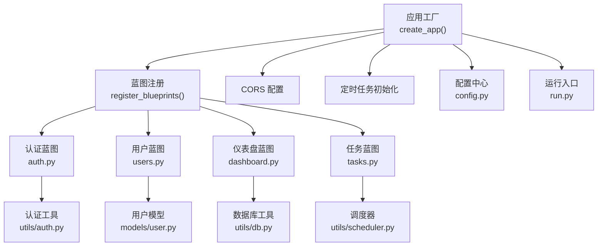
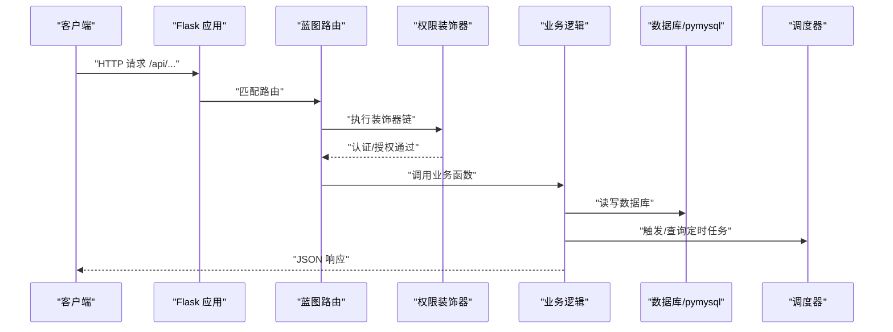
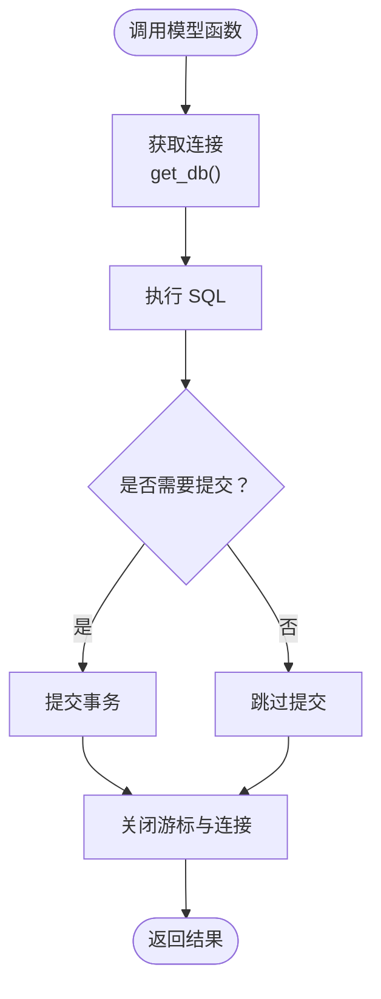
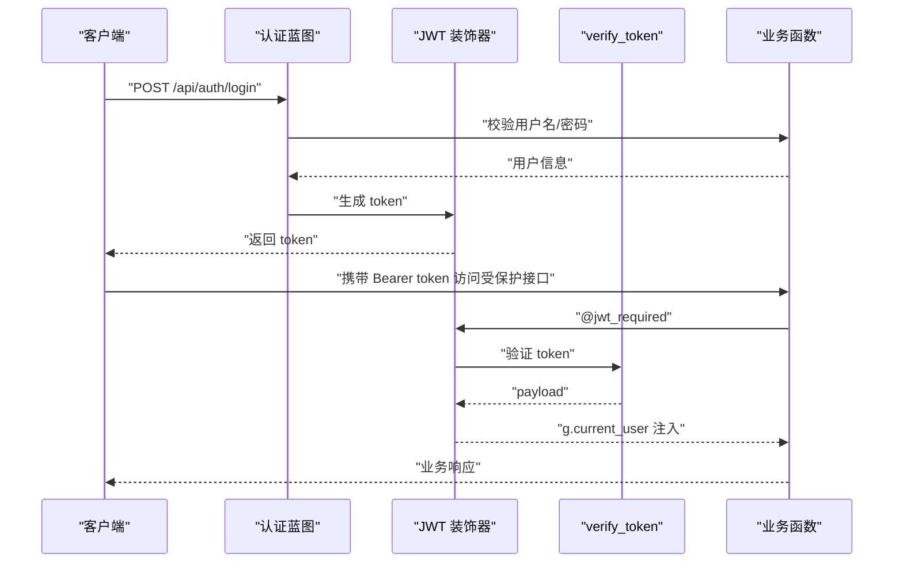
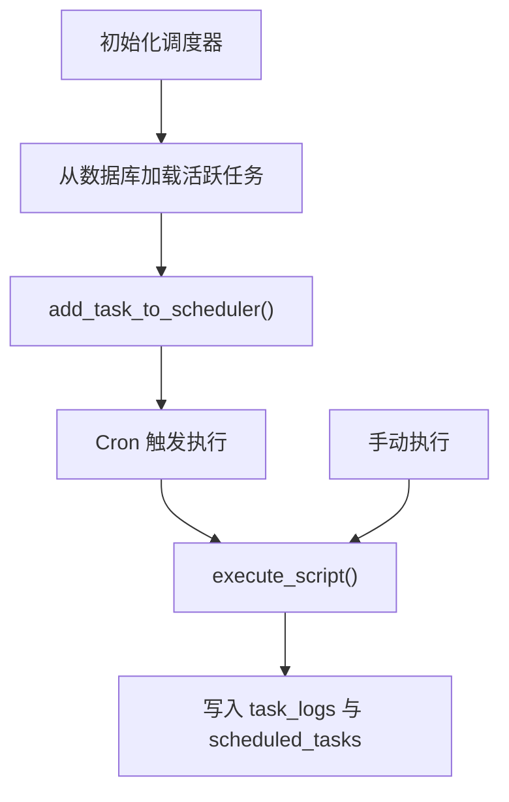
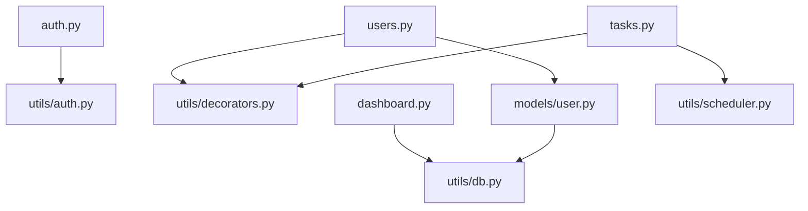

# 后端架构设计

<cite>
**本文档引用的文件**
- [backend/app/__init__.py](file://backend/app/__init__.py)
- [backend/app/config.py](file://backend/app/config.py)
- [backend/run.py](file://backend/run.py)
- [backend/app/utils/db.py](file://backend/app/utils/db.py)
- [backend/app/utils/auth.py](file://backend/app/utils/auth.py)
- [backend/app/utils/decorators.py](file://backend/app/utils/decorators.py)
- [backend/app/utils/scheduler.py](file://backend/app/utils/scheduler.py)
- [backend/app/models/user.py](file://backend/app/models/user.py)
- [backend/app/api/auth.py](file://backend/app/api/auth.py)
- [backend/app/api/users.py](file://backend/app/api/users.py)
- [backend/app/api/dashboard.py](file://backend/app/api/dashboard.py)
- [backend/app/api/tasks.py](file://backend/app/api/tasks.py)
</cite>

## 目录
1. [引言](#引言)
2. [项目结构](#项目结构)
3. [核心组件](#核心组件)
4. [架构总览](#架构总览)
5. [详细组件分析](#详细组件分析)
6. [依赖分析](#依赖分析)
7. [性能考虑](#性能考虑)
8. [故障排查指南](#故障排查指南)
9. [结论](#结论)
10. [附录](#附录)

## 引言
本文件面向运维管理平台后端，系统基于 Flask 框架构建，采用蓝图（Blueprint）分层组织 API，统一通过装饰器实现 JWT 认证与角色权限控制；数据库访问通过 pymysql 连接，结合调度器实现定时任务的脚本执行与日志记录。本文档旨在帮助开发者与运维人员快速理解系统架构、数据流与关键设计决策。

## 项目结构
后端采用“工厂函数 + 蓝图 + 工具模块 + 模型层”的分层组织方式：
- 应用工厂：创建 Flask 应用、注册蓝图、初始化定时任务
- 配置中心：集中管理密钥、数据库、上传与运行参数
- 蓝图层：按功能域划分 API（认证、用户、仪表盘、任务等）
- 工具层：认证、装饰器、数据库连接、调度器
- 模型层：封装数据库访问函数

图表来源
- [backend/app/__init__.py:6-34](file://backend/app/__init__.py#L6-L34)
- [backend/app/__init__.py:37-62](file://backend/app/__init__.py#L37-L62)
- [backend/app/config.py:1-21](file://backend/app/config.py#L1-L21)
- [backend/run.py:1-8](file://backend/run.py#L1-L8)

章节来源
- [backend/app/__init__.py:6-62](file://backend/app/__init__.py#L6-L62)
- [backend/app/config.py:1-21](file://backend/app/config.py#L1-L21)
- [backend/run.py:1-8](file://backend/run.py#L1-L8)

## 核心组件
- 应用工厂与蓝图注册：集中创建应用、加载配置、注册全部蓝图、初始化定时任务
- 配置中心：集中管理密钥、数据库、上传与运行参数
- 数据库连接：通过工具函数获取连接，统一字符集与游标类型
- 认证与权限：JWT 工具与装饰器组合，支持认证与角色校验
- 定时任务：基于 APScheduler，支持 Cron 表达式、脚本执行与日志记录

章节来源
- [backend/app/__init__.py:6-62](file://backend/app/__init__.py#L6-L62)
- [backend/app/config.py:1-21](file://backend/app/config.py#L1-L21)
- [backend/app/utils/db.py:1-17](file://backend/app/utils/db.py#L1-L17)
- [backend/app/utils/auth.py:1-83](file://backend/app/utils/auth.py#L1-L83)
- [backend/app/utils/decorators.py:1-95](file://backend/app/utils/decorators.py#L1-L95)
- [backend/app/utils/scheduler.py:1-249](file://backend/app/utils/scheduler.py#L1-L249)

## 架构总览
系统采用“请求进入 -> 蓝图路由 -> 权限装饰器 -> 业务逻辑 -> 数据库/外部脚本 -> 统一响应”的处理链路。CORS 对 /api/* 路由开放跨域并支持凭据。

图表来源
- [backend/app/__init__.py:24-25](file://backend/app/__init__.py#L24-L25)
- [backend/app/__init__.py:37-62](file://backend/app/__init__.py#L37-L62)
- [backend/app/utils/decorators.py:9-56](file://backend/app/utils/decorators.py#L9-L56)
- [backend/app/utils/db.py:5-17](file://backend/app/utils/db.py#L5-L17)
- [backend/app/utils/scheduler.py:201-244](file://backend/app/utils/scheduler.py#L201-L244)

## 详细组件分析

### 应用工厂与蓝图注册
- 应用工厂负责加载配置、根路由、CORS、注册蓝图、初始化调度器
- 蓝图注册集中管理，便于扩展与维护
- CORS 对 /api/* 开放跨域并允许凭据

章节来源
- [backend/app/__init__.py:6-34](file://backend/app/__init__.py#L6-L34)
- [backend/app/__init__.py:37-62](file://backend/app/__init__.py#L37-L62)

### 配置中心
- 集中定义密钥、数据库连接参数、运行参数、上传目录与大小限制
- 通过环境变量覆盖默认值，便于生产部署

章节来源
- [backend/app/config.py:1-21](file://backend/app/config.py#L1-L21)

### 数据库连接与访问
- 工具函数统一获取连接，设置字符集与 Dict 游标
- 模型层封装 CRUD 操作，每个函数内打开/关闭连接，确保资源释放

图表来源
- [backend/app/utils/db.py:5-17](file://backend/app/utils/db.py#L5-L17)
- [backend/app/models/user.py:8-36](file://backend/app/models/user.py#L8-L36)

章节来源
- [backend/app/utils/db.py:1-17](file://backend/app/utils/db.py#L1-L17)
- [backend/app/models/user.py:1-183](file://backend/app/models/user.py#L1-L183)

### 认证与权限控制
- JWT 工具：生成 token、验证 token、密码哈希与校验
- 权限装饰器：从 Authorization 头解析 Bearer Token，验证后注入用户信息至 g
- 角色装饰器：在 JWT 之后使用，校验用户角色是否在允许列表

图表来源
- [backend/app/api/auth.py:14-82](file://backend/app/api/auth.py#L14-L82)
- [backend/app/utils/auth.py:11-35](file://backend/app/utils/auth.py#L11-L35)
- [backend/app/utils/auth.py:38-55](file://backend/app/utils/auth.py#L38-L55)
- [backend/app/utils/decorators.py:9-56](file://backend/app/utils/decorators.py#L9-L56)
- [backend/app/utils/decorators.py:59-94](file://backend/app/utils/decorators.py#L59-L94)

章节来源
- [backend/app/utils/auth.py:1-83](file://backend/app/utils/auth.py#L1-L83)
- [backend/app/utils/decorators.py:1-95](file://backend/app/utils/decorators.py#L1-L95)
- [backend/app/api/auth.py:1-184](file://backend/app/api/auth.py#L1-L184)

### 定时任务调度
- 调度器基于 APScheduler，支持 Cron 表达式
- 任务创建/更新/删除/启停均与数据库状态同步
- 手动执行与计划执行均记录日志并更新任务状态

图表来源
- [backend/app/utils/scheduler.py:201-244](file://backend/app/utils/scheduler.py#L201-L244)
- [backend/app/utils/scheduler.py:146-185](file://backend/app/utils/scheduler.py#L146-L185)
- [backend/app/api/tasks.py:63-136](file://backend/app/api/tasks.py#L63-L136)
- [backend/app/api/tasks.py:309-420](file://backend/app/api/tasks.py#L309-L420)

章节来源
- [backend/app/utils/scheduler.py:1-249](file://backend/app/utils/scheduler.py#L1-L249)
- [backend/app/api/tasks.py:1-458](file://backend/app/api/tasks.py#L1-L458)

### 蓝图与路由分层
- 认证蓝图：登录、获取资料、修改密码
- 用户蓝图：管理员视角的用户增删改查与密码重置
- 仪表盘蓝图：统计聚合与最近变更/证书数据
- 任务蓝图：任务生命周期管理、脚本上传、日志查询

章节来源
- [backend/app/api/auth.py:1-184](file://backend/app/api/auth.py#L1-L184)
- [backend/app/api/users.py:1-268](file://backend/app/api/users.py#L1-L268)
- [backend/app/api/dashboard.py:1-86](file://backend/app/api/dashboard.py#L1-L86)
- [backend/app/api/tasks.py:1-458](file://backend/app/api/tasks.py#L1-L458)

## 依赖分析
- 组件耦合：蓝图对工具层（认证、装饰器、数据库、调度器）有直接依赖；模型层对数据库工具有直接依赖
- 外部依赖：Flask、Flask-CORS、PyMySQL、APScheduler、Werkzeug
- 风险点：装饰器链顺序严格（JWT 必须在角色前），否则角色装饰器无法读取 g 中的用户信息

图表来源
- [backend/app/api/auth.py:1-10](file://backend/app/api/auth.py#L1-L10)
- [backend/app/api/users.py:1-14](file://backend/app/api/users.py#L1-L14)
- [backend/app/api/dashboard.py:1-8](file://backend/app/api/dashboard.py#L1-L8)
- [backend/app/api/tasks.py:1-15](file://backend/app/api/tasks.py#L1-L15)
- [backend/app/models/user.py:1-6](file://backend/app/models/user.py#L1-L6)

章节来源
- [backend/app/api/auth.py:1-10](file://backend/app/api/auth.py#L1-L10)
- [backend/app/api/users.py:1-14](file://backend/app/api/users.py#L1-L14)
- [backend/app/api/dashboard.py:1-8](file://backend/app/api/dashboard.py#L1-L8)
- [backend/app/api/tasks.py:1-15](file://backend/app/api/tasks.py#L1-L15)
- [backend/app/models/user.py:1-6](file://backend/app/models/user.py#L1-L6)

## 性能考虑
- 数据库连接：每次操作独立获取连接并在 finally 中关闭，避免连接泄漏；建议在高并发场景引入连接池以减少连接开销
- 调度器执行：脚本执行在独立线程中进行，避免阻塞主进程；建议增加超时与异常处理的统一日志记录
- 蓝图路由：按功能域拆分，便于缓存与限流策略的精细化配置
- CORS：对 /api/* 开放跨域并允许凭据，注意生产环境需限制 origins 以提升安全性

## 故障排查指南
- 认证失败：检查 Authorization 头格式是否为 Bearer Token，确认 token 未过期，核对 JWT_SECRET_KEY
- 权限不足：确认用户角色是否在装饰器允许列表，检查装饰器顺序（先 @jwt_required 再 @role_required）
- 数据库连接：确认 DB_HOST/PORT/USER/PASSWORD/NAME 环境变量正确，检查字符集与游标配置
- 定时任务：确认 Cron 表达式格式正确，脚本文件存在且可执行，查看 task_logs 与 scheduled_tasks 的状态更新

章节来源
- [backend/app/utils/decorators.py:9-56](file://backend/app/utils/decorators.py#L9-L56)
- [backend/app/utils/decorators.py:59-94](file://backend/app/utils/decorators.py#L59-L94)
- [backend/app/utils/auth.py:38-55](file://backend/app/utils/auth.py#L38-L55)
- [backend/app/utils/scheduler.py:146-185](file://backend/app/utils/scheduler.py#L146-L185)

## 结论
该后端采用清晰的分层与模块化设计，通过蓝图实现 API 的功能域隔离，配合装饰器完成统一的认证与权限控制；数据库访问与定时任务通过工具层抽象，具备良好的可维护性与扩展性。建议在生产环境中引入连接池、细化 CORS 策略与增强日志监控能力。

## 附录
- 运行入口：通过 run.py 启动应用，读取配置并运行
- 配置项：密钥、数据库、上传与运行参数均来自配置中心

章节来源
- [backend/run.py:1-8](file://backend/run.py#L1-L8)
- [backend/app/config.py:1-21](file://backend/app/config.py#L1-L21)