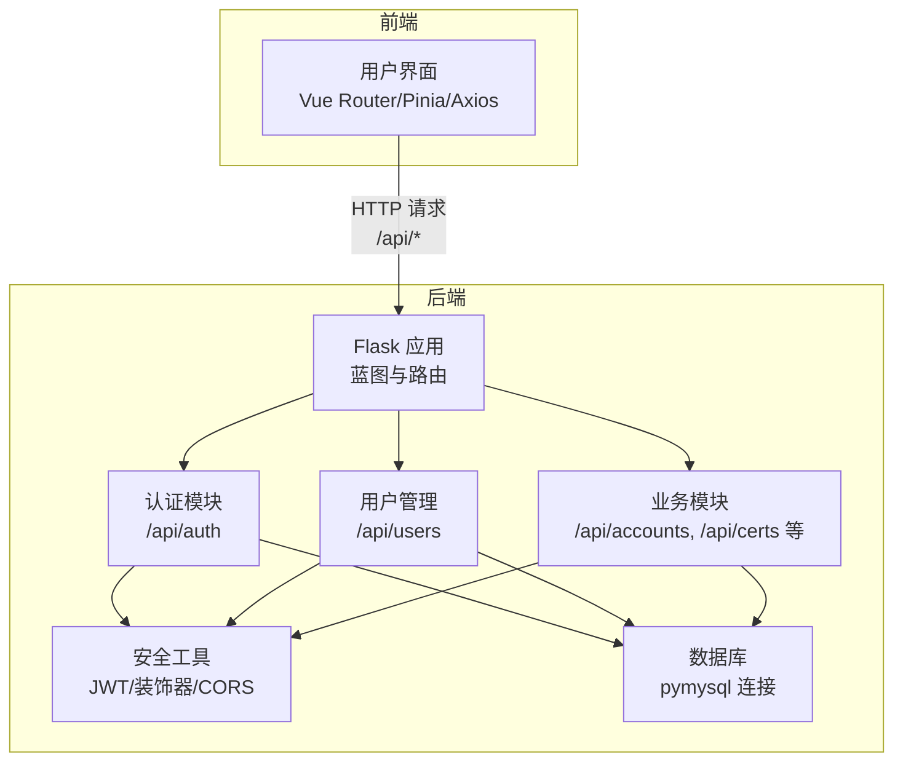
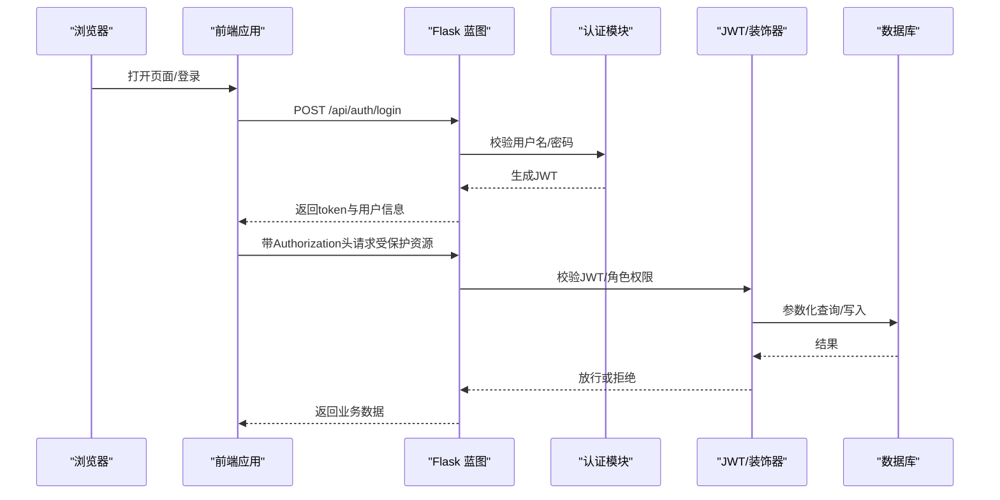
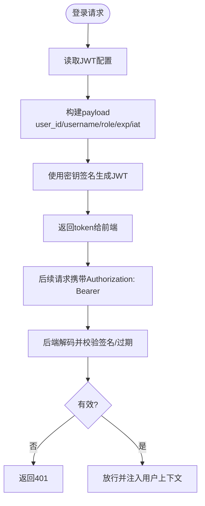
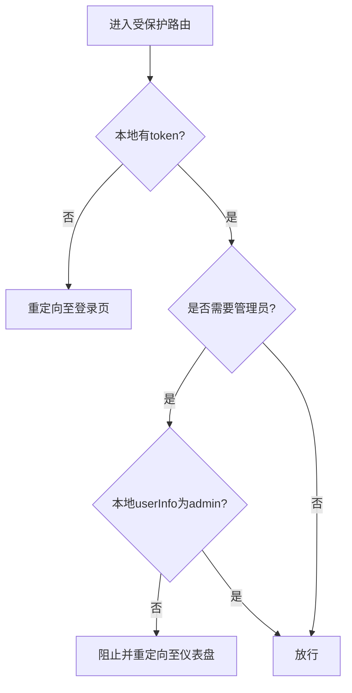
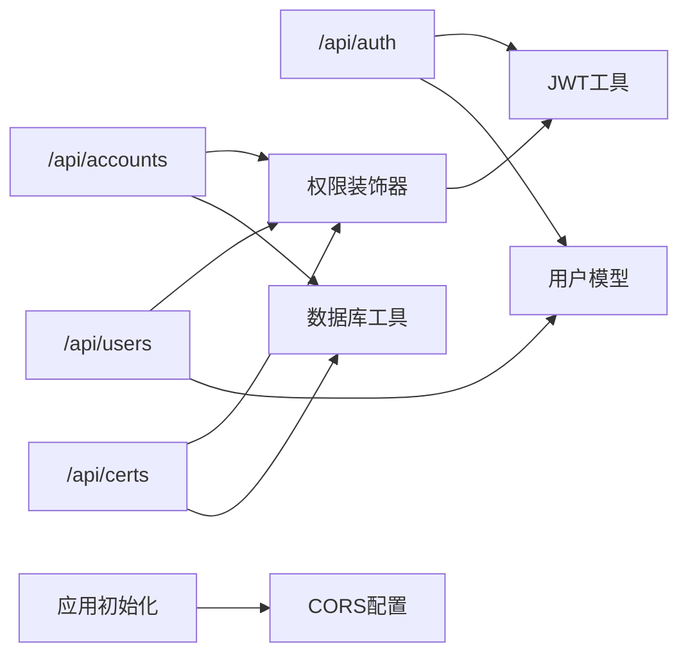

# 安全架构设计

<cite>
**本文引用的文件**
- [backend/app/api/auth.py](file://backend/app/api/auth.py)
- [backend/app/utils/auth.py](file://backend/app/utils/auth.py)
- [backend/app/models/user.py](file://backend/app/models/user.py)
- [backend/app/config.py](file://backend/app/config.py)
- [backend/app/utils/decorators.py](file://backend/app/utils/decorators.py)
- [backend/app/utils/db.py](file://backend/app/utils/db.py)
- [backend/app/__init__.py](file://backend/app/__init__.py)
- [backend/app/api/users.py](file://backend/app/api/users.py)
- [backend/app/api/accounts.py](file://backend/app/api/accounts.py)
- [backend/app/api/certs.py](file://backend/app/api/certs.py)
- [frontend/src/stores/user.js](file://frontend/src/stores/user.js)
- [frontend/src/router/index.js](file://frontend/src/router/index.js)
- [frontend/src/api/auth.js](file://frontend/src/api/auth.js)
- [frontend/src/api/request.js](file://frontend/src/api/request.js)
</cite>

## 目录
1. [引言](#引言)
2. [项目结构](#项目结构)
3. [核心组件](#核心组件)
4. [架构总览](#架构总览)
5. [详细组件分析](#详细组件分析)
6. [依赖分析](#依赖分析)
7. [性能考虑](#性能考虑)
8. [故障排查指南](#故障排查指南)
9. [结论](#结论)
10. [附录](#附录)

## 引言
本文件面向云运维平台的安全架构设计，系统性阐述后端认证授权、前端路由与会话管理、跨域策略、API安全防护、密码与敏感数据保护、以及SQL注入防护等关键安全机制。文档同时提供安全架构图与威胁模型分析，帮助读者快速理解整体安全设计与潜在风险及应对策略。

## 项目结构
后端采用Flask微服务架构，按功能模块划分蓝图；前端使用Vue 3 + Pinia + Element Plus构建单页应用，通过Axios统一发起API请求。安全相关的关键位置包括：
- 后端：认证与用户模型、JWT工具、权限装饰器、CORS配置、数据库连接工具
- 前端：用户状态管理、路由守卫、请求拦截器

图表来源
- [backend/app/__init__.py:37-62](file://backend/app/__init__.py#L37-L62)
- [backend/app/api/auth.py:11-11](file://backend/app/api/auth.py#L11-L11)
- [backend/app/api/users.py:14-14](file://backend/app/api/users.py#L14-L14)
- [backend/app/api/accounts.py:8-8](file://backend/app/api/accounts.py#L8-L8)
- [backend/app/api/certs.py:8-8](file://backend/app/api/certs.py#L8-L8)

章节来源
- [backend/app/__init__.py:37-62](file://backend/app/__init__.py#L37-L62)

## 核心组件
- JWT认证与令牌管理：负责登录签发、令牌校验、过期处理与密码哈希
- RBAC权限控制：基于角色的访问控制，结合路由守卫与后端装饰器
- CORS跨域策略：统一跨域资源共享配置
- 数据库访问：参数化查询与事务回滚，降低SQL注入风险
- 前端会话与路由守卫：本地存储令牌、自动鉴权头注入、未授权跳转

章节来源
- [backend/app/utils/auth.py:11-36](file://backend/app/utils/auth.py#L11-L36)
- [backend/app/utils/decorators.py:9-57](file://backend/app/utils/decorators.py#L9-L57)
- [backend/app/__init__.py:24-25](file://backend/app/__init__.py#L24-L25)
- [backend/app/utils/db.py:5-17](file://backend/app/utils/db.py#L5-L17)
- [frontend/src/stores/user.js:6-21](file://frontend/src/stores/user.js#L6-L21)
- [frontend/src/router/index.js:36-58](file://frontend/src/router/index.js#L36-L58)
- [frontend/src/api/request.js:14-23](file://frontend/src/api/request.js#L14-L23)

## 架构总览
下图展示从浏览器到后端API与数据库的完整调用链路，以及安全控制点：

图表来源
- [backend/app/api/auth.py:14-82](file://backend/app/api/auth.py#L14-L82)
- [backend/app/utils/auth.py:11-36](file://backend/app/utils/auth.py#L11-L36)
- [backend/app/utils/decorators.py:9-57](file://backend/app/utils/decorators.py#L9-L57)
- [backend/app/utils/db.py:5-17](file://backend/app/utils/db.py#L5-L17)
- [frontend/src/api/request.js:14-23](file://frontend/src/api/request.js#L14-L23)

## 详细组件分析

### JWT认证机制
- 令牌生成：包含用户ID、用户名、角色、签发时间与过期时间，使用对称算法签名
- 令牌验证：解析并校验签名与有效期，过期或无效直接拒绝
- 令牌刷新：当前实现未提供专用刷新接口，建议引入短期访问令牌+长期刷新令牌策略

图表来源
- [backend/app/utils/auth.py:11-36](file://backend/app/utils/auth.py#L11-L36)
- [backend/app/utils/auth.py:38-56](file://backend/app/utils/auth.py#L38-L56)
- [backend/app/api/auth.py:63-82](file://backend/app/api/auth.py#L63-L82)
- [frontend/src/api/request.js:14-23](file://frontend/src/api/request.js#L14-L23)

章节来源
- [backend/app/utils/auth.py:11-36](file://backend/app/utils/auth.py#L11-L36)
- [backend/app/utils/auth.py:38-56](file://backend/app/utils/auth.py#L38-L56)
- [backend/app/api/auth.py:14-82](file://backend/app/api/auth.py#L14-L82)
- [frontend/src/api/request.js:14-23](file://frontend/src/api/request.js#L14-L23)

### 基于角色的访问控制（RBAC）
- 后端装饰器：@jwt_required负责提取与校验令牌并将用户信息注入请求上下文；@role_required用于检查角色白名单
- 前端路由守卫：根据meta标记requiresAuth与requiresAdmin进行页面级权限控制
- 典型用法：用户管理仅允许管理员访问，部分业务模块允许管理员与操作员

图表来源
- [frontend/src/router/index.js:36-58](file://frontend/src/router/index.js#L36-L58)
- [frontend/src/stores/user.js:10-11](file://frontend/src/stores/user.js#L10-L11)
- [backend/app/utils/decorators.py:59-95](file://backend/app/utils/decorators.py#L59-L95)
- [backend/app/api/users.py:18-30](file://backend/app/api/users.py#L18-L30)

章节来源
- [backend/app/utils/decorators.py:9-57](file://backend/app/utils/decorators.py#L9-L57)
- [backend/app/utils/decorators.py:59-95](file://backend/app/utils/decorators.py#L59-L95)
- [frontend/src/router/index.js:36-58](file://frontend/src/router/index.js#L36-L58)
- [frontend/src/stores/user.js:10-11](file://frontend/src/stores/user.js#L10-L11)
- [backend/app/api/users.py:18-30](file://backend/app/api/users.py#L18-L30)

### CORS跨域安全策略
- 后端启用CORS并对/api/*路径开放跨域，支持凭据传递
- 建议生产环境限定具体源地址，避免通配符暴露

章节来源
- [backend/app/__init__.py:24-25](file://backend/app/__init__.py#L24-L25)

### API接口安全防护
- 统一响应结构：所有接口返回包含状态码与消息的对象，便于前端集中处理
- 未授权处理：后端装饰器返回401，前端拦截器检测401并清除本地令牌与用户信息，跳转登录
- 权限不足：后端装饰器返回403，前端提示权限不足

章节来源
- [frontend/src/api/request.js:26-51](file://frontend/src/api/request.js#L26-L51)
- [backend/app/utils/decorators.py:24-46](file://backend/app/utils/decorators.py#L24-L46)

### 密码加密与敏感数据保护
- 密码存储：使用强哈希算法生成密码摘要，不保存明文
- 敏感数据：前端本地存储token与用户信息，建议配合HTTPS与安全Cookie策略（当前为localStorage）

章节来源
- [backend/app/models/user.py:21-21](file://backend/app/models/user.py#L21-L21)
- [backend/app/api/auth.py:171-172](file://backend/app/api/auth.py#L171-L172)
- [frontend/src/stores/user.js:6-21](file://frontend/src/stores/user.js#L6-L21)

### 会话管理与CSRF防护
- 会话模型：基于JWT无状态会话，无需服务端存储
- CSRF防护：当前未实现CSRF令牌机制，建议在表单提交场景增加CSRF中间件或同源策略强化

章节来源
- [backend/app/utils/auth.py:11-36](file://backend/app/utils/auth.py#L11-L36)
- [frontend/src/api/request.js:14-23](file://frontend/src/api/request.js#L14-L23)

### SQL注入防护
- 参数化查询：数据库访问均使用参数化语句，避免拼接SQL
- 事务回滚：异常时执行回滚，保证一致性

章节来源
- [backend/app/utils/db.py:5-17](file://backend/app/utils/db.py#L5-L17)
- [backend/app/api/accounts.py:57-63](file://backend/app/api/accounts.py#L57-L63)
- [backend/app/api/certs.py:54-55](file://backend/app/api/certs.py#L54-L55)

## 依赖分析
后端安全相关模块之间的耦合关系如下：

图表来源
- [backend/app/api/auth.py:7-8](file://backend/app/api/auth.py#L7-L8)
- [backend/app/api/users.py:12-12](file://backend/app/api/users.py#L12-L12)
- [backend/app/api/accounts.py:6-6](file://backend/app/api/accounts.py#L6-L6)
- [backend/app/api/certs.py:6-6](file://backend/app/api/certs.py#L6-L6)
- [backend/app/utils/decorators.py:6-6](file://backend/app/utils/decorators.py#L6-L6)
- [backend/app/utils/auth.py:4-6](file://backend/app/utils/auth.py#L4-L6)
- [backend/app/models/user.py:4-5](file://backend/app/models/user.py#L4-L5)
- [backend/app/utils/db.py:1-2](file://backend/app/utils/db.py#L1-L2)
- [backend/app/__init__.py:24-25](file://backend/app/__init__.py#L24-L25)

章节来源
- [backend/app/api/auth.py:7-8](file://backend/app/api/auth.py#L7-L8)
- [backend/app/api/users.py:12-12](file://backend/app/api/users.py#L12-L12)
- [backend/app/api/accounts.py:6-6](file://backend/app/api/accounts.py#L6-L6)
- [backend/app/api/certs.py:6-6](file://backend/app/api/certs.py#L6-L6)
- [backend/app/utils/decorators.py:6-6](file://backend/app/utils/decorators.py#L6-L6)
- [backend/app/utils/auth.py:4-6](file://backend/app/utils/auth.py#L4-L6)
- [backend/app/models/user.py:4-5](file://backend/app/models/user.py#L4-L5)
- [backend/app/utils/db.py:1-2](file://backend/app/utils/db.py#L1-L2)
- [backend/app/__init__.py:24-25](file://backend/app/__init__.py#L24-L25)

## 性能考虑
- JWT解析成本低，适合高并发场景
- 建议开启令牌缓存与短路判断（如黑名单）以进一步优化
- 数据库连接池与参数化查询可减少SQL解析与注入风险

## 故障排查指南
- 登录失败：检查用户名/密码与账户状态，确认令牌生成逻辑
- 401未授权：确认前端是否正确注入Authorization头，后端是否正确校验
- 403权限不足：确认用户角色与所需角色白名单
- CORS跨域失败：核对后端CORS配置与前端请求源
- 数据库异常：查看参数化语句与事务回滚逻辑

章节来源
- [frontend/src/api/request.js:36-51](file://frontend/src/api/request.js#L36-L51)
- [backend/app/utils/decorators.py:24-46](file://backend/app/utils/decorators.py#L24-L46)
- [backend/app/__init__.py:24-25](file://backend/app/__init__.py#L24-L25)
- [backend/app/utils/db.py:5-17](file://backend/app/utils/db.py#L5-L17)

## 结论
该平台采用JWT无状态认证与RBAC权限控制，结合CORS与参数化查询，形成了较为完善的前后端安全框架。建议在生产环境中补充CSRF防护、令牌刷新策略、更严格的CORS白名单与安全Cookie实践，并持续监控与审计访问日志。

## 附录

### 威胁模型与应对策略
- 令牌泄露：短期有效期、撤销机制、HTTPS传输
- 中间人攻击：强制HTTPS、严格CORS白名单
- 权限提升：最小权限原则、角色分离、审计日志
- SQL注入：参数化查询、输入校验、只读账户
- 前端敏感信息：限制localStorage使用范围、安全存储方案