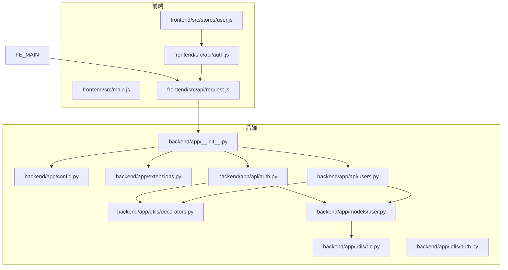
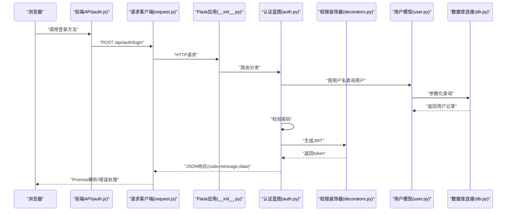
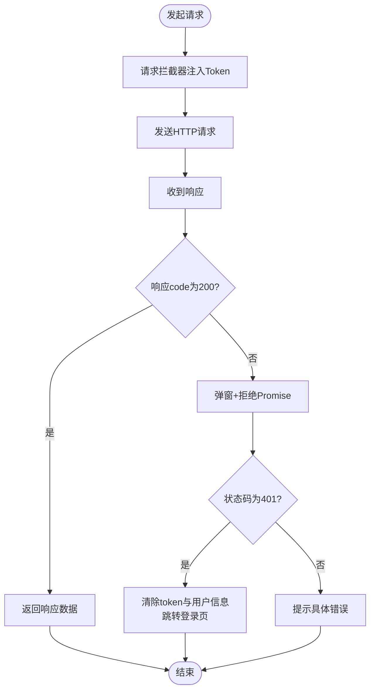
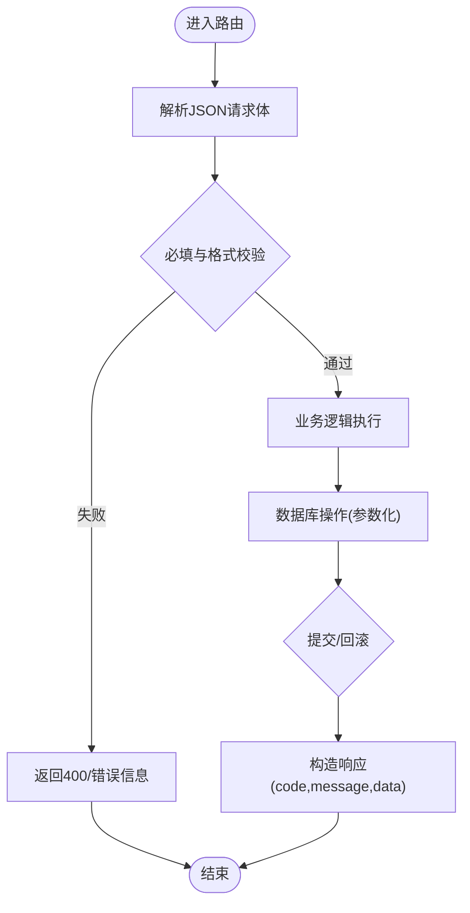
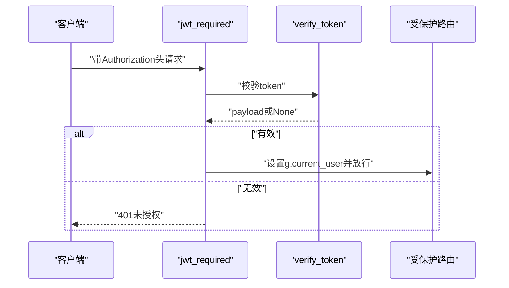
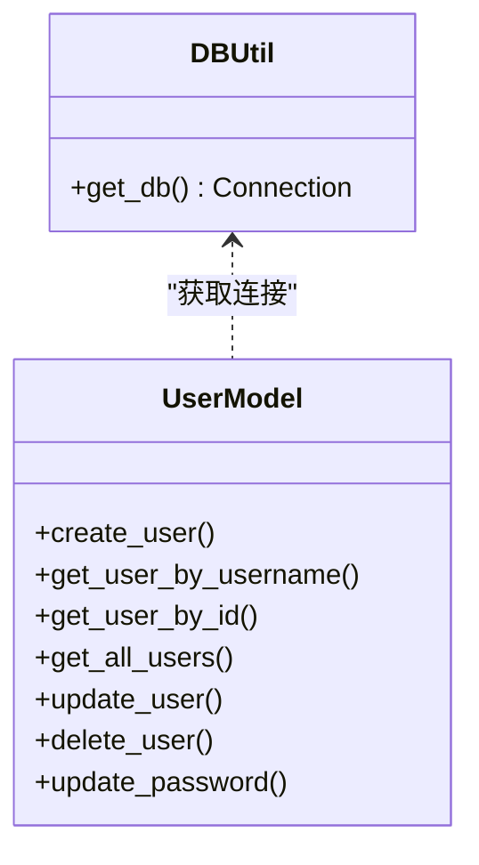
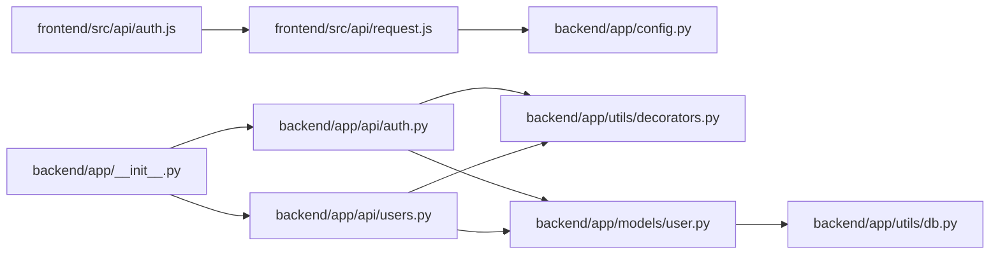

# 数据流设计

<cite>
**本文引用的文件**
- [backend/app/__init__.py](file://backend/app/__init__.py)
- [backend/app/config.py](file://backend/app/config.py)
- [backend/app/extensions.py](file://backend/app/extensions.py)
- [backend/app/api/auth.py](file://backend/app/api/auth.py)
- [backend/app/api/users.py](file://backend/app/api/users.py)
- [backend/app/utils/db.py](file://backend/app/utils/db.py)
- [backend/app/utils/auth.py](file://backend/app/utils/auth.py)
- [backend/app/utils/decorators.py](file://backend/app/utils/decorators.py)
- [backend/app/models/user.py](file://backend/app/models/user.py)
- [frontend/src/main.js](file://frontend/src/main.js)
- [frontend/src/api/request.js](file://frontend/src/api/request.js)
- [frontend/src/api/auth.js](file://frontend/src/api/auth.js)
- [frontend/src/stores/user.js](file://frontend/src/stores/user.js)
</cite>

## 目录
1. [引言](#引言)
2. [项目结构](#项目结构)
3. [核心组件](#核心组件)
4. [架构总览](#架构总览)
5. [详细组件分析](#详细组件分析)
6. [依赖分析](#依赖分析)
7. [性能考虑](#性能考虑)
8. [故障排查指南](#故障排查指南)
9. [结论](#结论)
10. [附录](#附录)

## 引言
本文件面向云运维平台的数据流设计与实现，覆盖从前端用户操作到后端数据库的完整数据链路：HTTP请求处理、参数校验、业务逻辑执行、数据响应；AJAX异步请求与API客户端设计及错误处理；数据库事务与连接管理；以及安全防护（防SQL注入、防XSS）与缓存、批量操作、实时同步等主题。目标是帮助不同技术背景的读者快速理解系统如何接收、处理、持久化与反馈数据。

## 项目结构
- 后端基于Flask应用，采用蓝图组织API模块，统一由应用工厂创建并注册。
- 前端基于Vue 3 + Pinia，通过Axios封装的请求客户端统一访问后端API。
- 配置集中于Config类，数据库连接通过工具函数按需获取。

图表来源
- [backend/app/__init__.py:1-62](file://backend/app/__init__.py#L1-L62)
- [backend/app/config.py:1-21](file://backend/app/config.py#L1-L21)
- [backend/app/extensions.py:1-2](file://backend/app/extensions.py#L1-L2)
- [backend/app/api/auth.py:1-184](file://backend/app/api/auth.py#L1-L184)
- [backend/app/api/users.py:1-268](file://backend/app/api/users.py#L1-L268)
- [backend/app/utils/db.py:1-17](file://backend/app/utils/db.py#L1-L17)
- [backend/app/utils/auth.py:1-83](file://backend/app/utils/auth.py#L1-L83)
- [backend/app/utils/decorators.py:1-95](file://backend/app/utils/decorators.py#L1-L95)
- [backend/app/models/user.py:1-183](file://backend/app/models/user.py#L1-L183)
- [frontend/src/main.js:1-23](file://frontend/src/main.js#L1-L23)
- [frontend/src/api/request.js:1-54](file://frontend/src/api/request.js#L1-L54)
- [frontend/src/api/auth.js:1-14](file://frontend/src/api/auth.js#L1-L14)
- [frontend/src/stores/user.js:1-41](file://frontend/src/stores/user.js#L1-L41)

章节来源
- [backend/app/__init__.py:1-62](file://backend/app/__init__.py#L1-L62)
- [backend/app/config.py:1-21](file://backend/app/config.py#L1-L21)
- [frontend/src/main.js:1-23](file://frontend/src/main.js#L1-L23)

## 核心组件
- 应用工厂与蓝图注册：应用工厂负责CORS、配置注入、蓝图注册与定时任务初始化。
- API蓝图：认证、用户管理等模块以蓝图形式提供REST接口。
- 工具层：JWT生成与校验、权限装饰器、数据库连接工具。
- 模型层：用户相关数据库操作封装，使用参数化查询避免SQL注入。
- 前端请求客户端：Axios实例、请求/响应拦截器、统一错误处理与鉴权头注入。
- 状态管理：Pinia Store管理token与用户信息，支持登录态与角色态判断。

章节来源
- [backend/app/__init__.py:6-34](file://backend/app/__init__.py#L6-L34)
- [backend/app/api/auth.py:14-83](file://backend/app/api/auth.py#L14-L83)
- [backend/app/api/users.py:17-96](file://backend/app/api/users.py#L17-L96)
- [backend/app/utils/auth.py:11-35](file://backend/app/utils/auth.py#L11-L35)
- [backend/app/utils/decorators.py:9-56](file://backend/app/utils/decorators.py#L9-L56)
- [backend/app/models/user.py:8-36](file://backend/app/models/user.py#L8-L36)
- [frontend/src/api/request.js:5-51](file://frontend/src/api/request.js#L5-L51)
- [frontend/src/stores/user.js:5-40](file://frontend/src/stores/user.js#L5-L40)

## 架构总览
下图展示一次典型“登录”请求从浏览器到数据库的全链路：

图表来源
- [frontend/src/api/auth.js:3-5](file://frontend/src/api/auth.js#L3-L5)
- [frontend/src/api/request.js:14-34](file://frontend/src/api/request.js#L14-L34)
- [backend/app/__init__.py:37-62](file://backend/app/__init__.py#L37-L62)
- [backend/app/api/auth.py:14-83](file://backend/app/api/auth.py#L14-L83)
- [backend/app/utils/decorators.py:9-56](file://backend/app/utils/decorators.py#L9-L56)
- [backend/app/models/user.py:39-58](file://backend/app/models/user.py#L39-L58)
- [backend/app/utils/db.py:5-16](file://backend/app/utils/db.py#L5-L16)

## 详细组件分析

### 前端AJAX与API客户端
- Axios实例：基础URL指向/api，超时15秒，JSON内容类型。
- 请求拦截器：自动从localStorage读取token并附加到Authorization头。
- 响应拦截器：统一处理非200状态码与401未授权；401时清理本地存储并跳转登录页；网络异常提示“网络连接失败”。

图表来源
- [frontend/src/api/request.js:14-51](file://frontend/src/api/request.js#L14-L51)

章节来源
- [frontend/src/api/request.js:1-54](file://frontend/src/api/request.js#L1-L54)
- [frontend/src/api/auth.js:1-14](file://frontend/src/api/auth.js#L1-L14)
- [frontend/src/stores/user.js:23-30](file://frontend/src/stores/user.js#L23-L30)

### 后端HTTP请求处理与参数校验
- 登录接口：接收用户名与密码，校验必填与格式，查询用户并校验状态与密码，生成JWT返回。
- 用户管理接口：列表、创建、更新、删除、重置密码均进行参数校验与角色权限控制。
- 统一返回结构：code/message/data，便于前端统一处理。

图表来源
- [backend/app/api/auth.py:23-82](file://backend/app/api/auth.py#L23-L82)
- [backend/app/api/users.py:43-96](file://backend/app/api/users.py#L43-L96)
- [backend/app/models/user.py:24-36](file://backend/app/models/user.py#L24-L36)

章节来源
- [backend/app/api/auth.py:14-83](file://backend/app/api/auth.py#L14-L83)
- [backend/app/api/users.py:17-96](file://backend/app/api/users.py#L17-L96)

### 权限与认证机制
- JWT生成：携带用户ID、用户名、角色与过期时间，使用配置密钥签名。
- Token校验：捕获过期与非法令牌异常，返回None表示无效。
- 权限装饰器：从Authorization头提取Bearer token，校验后将用户信息写入g对象；角色装饰器在JWT之后使用，检查角色集合。

图表来源
- [backend/app/utils/auth.py:11-35](file://backend/app/utils/auth.py#L11-L35)
- [backend/app/utils/auth.py:38-55](file://backend/app/utils/auth.py#L38-L55)
- [backend/app/utils/decorators.py:9-56](file://backend/app/utils/decorators.py#L9-L56)

章节来源
- [backend/app/utils/auth.py:1-83](file://backend/app/utils/auth.py#L1-L83)
- [backend/app/utils/decorators.py:1-95](file://backend/app/utils/decorators.py#L1-L95)

### 数据库操作与事务管理
- 连接获取：每次操作通过工具函数按应用配置动态获取连接，使用字典游标返回结果。
- 参数化查询：用户模型中所有写操作均使用参数化，避免SQL注入风险。
- 事务边界：每个操作在with上下文中执行，commit或异常后关闭连接，确保资源释放。

图表来源
- [backend/app/utils/db.py:5-16](file://backend/app/utils/db.py#L5-L16)
- [backend/app/models/user.py:8-36](file://backend/app/models/user.py#L8-L36)

章节来源
- [backend/app/utils/db.py:1-17](file://backend/app/utils/db.py#L1-L17)
- [backend/app/models/user.py:1-183](file://backend/app/models/user.py#L1-L183)

### 安全防护与输入校验
- SQL注入防护：用户模型使用参数化查询，避免拼接字符串。
- XSS防护：前端使用Element Plus组件渲染，未见直接DOM拼接；建议后端模板渲染场景也避免内联脚本与不可信输入。
- 认证与授权：JWT签名与有效期控制；角色装饰器限制敏感操作。
- 输入校验：后端对必填字段、长度、枚举值进行严格校验；前端统一错误提示。

章节来源
- [backend/app/models/user.py:26-32](file://backend/app/models/user.py#L26-L32)
- [backend/app/api/users.py:56-68](file://backend/app/api/users.py#L56-L68)
- [frontend/src/api/request.js:29-32](file://frontend/src/api/request.js#L29-L32)

### 缓存策略、批量操作与实时同步
- 缓存策略：当前实现未发现专用缓存层；可在用户信息频繁读取场景引入Redis缓存热点数据，并设置合理TTL。
- 批量操作：用户管理接口未提供批量导入/导出；建议在导出蓝图中增加批量数据拉取与分页处理。
- 实时同步：当前未发现WebSocket或长轮询；可在仪表盘等场景引入SSE或WebSocket推送变更事件。

## 依赖分析
- 前端依赖：Axios、Element Plus、Vue Router/Pinia。
- 后端依赖：Flask、Flask-CORS、PyMySQL、Werkzeug、PyJWT。
- 关键耦合点：API蓝图依赖装饰器与模型；模型依赖数据库工具；前端API依赖请求客户端。

图表来源
- [frontend/src/api/request.js:1-54](file://frontend/src/api/request.js#L1-L54)
- [frontend/src/api/auth.js:1-14](file://frontend/src/api/auth.js#L1-L14)
- [backend/app/__init__.py:37-62](file://backend/app/__init__.py#L37-L62)
- [backend/app/api/auth.py:1-184](file://backend/app/api/auth.py#L1-L184)
- [backend/app/api/users.py:1-268](file://backend/app/api/users.py#L1-L268)
- [backend/app/utils/decorators.py:1-95](file://backend/app/utils/decorators.py#L1-L95)
- [backend/app/models/user.py:1-183](file://backend/app/models/user.py#L1-L183)
- [backend/app/utils/db.py:1-17](file://backend/app/utils/db.py#L1-L17)
- [backend/app/config.py:1-21](file://backend/app/config.py#L1-L21)

章节来源
- [backend/app/__init__.py:1-62](file://backend/app/__init__.py#L1-L62)
- [frontend/src/main.js:1-23](file://frontend/src/main.js#L1-L23)

## 性能考虑
- 连接池：当前使用短连接，建议引入连接池（如pymysql连接池）降低握手开销。
- 查询优化：对高频查询建立索引（如用户表username），避免SELECT *，仅取必要字段。
- 分页与批量：大数据量列表分页，导出/导入走后台队列与分批处理。
- 缓存：热点数据（用户信息、配置）加入Redis，减少数据库压力。
- 前端节流：高频请求（搜索、筛选）增加防抖/节流，减少后端压力。

## 故障排查指南
- 登录失败：检查用户名/密码是否为空、用户是否激活、密码哈希是否匹配。
- 401未授权：确认前端是否正确注入Authorization头、后端装饰器是否生效、token是否过期。
- 数据库连接失败：核对配置项DB_HOST/PORT/USER/PASSWORD/NAME，确保网络可达。
- 响应异常：查看后端日志与响应code/message定位问题；前端统一错误提示已在拦截器中处理。

章节来源
- [backend/app/api/auth.py:23-82](file://backend/app/api/auth.py#L23-L82)
- [frontend/src/api/request.js:25-51](file://frontend/src/api/request.js#L25-L51)
- [backend/app/config.py:9-13](file://backend/app/config.py#L9-L13)

## 结论
该系统采用前后端分离架构，后端以Flask蓝图组织API，前端通过Axios统一请求与错误处理。数据流自上而下清晰：前端参数校验与拦截器 -> 后端路由与装饰器 -> 模型层参数化数据库操作 -> 统一响应。安全方面通过JWT与参数化查询形成基本防线；性能与可扩展性可通过连接池、缓存与批量处理进一步提升。建议后续补充缓存、批量与实时能力，完善可观测性与告警。

## 附录
- 配置项概览：密钥、数据库连接、上传大小、CORS跨域等。
- 前端入口：Vue应用挂载、路由与状态管理初始化。
- API示例：登录、获取资料、修改密码、用户增删改查等。

章节来源
- [backend/app/config.py:4-21](file://backend/app/config.py#L4-L21)
- [frontend/src/main.js:10-22](file://frontend/src/main.js#L10-L22)
- [backend/app/api/auth.py:14-184](file://backend/app/api/auth.py#L14-L184)
- [backend/app/api/users.py:17-268](file://backend/app/api/users.py#L17-L268)