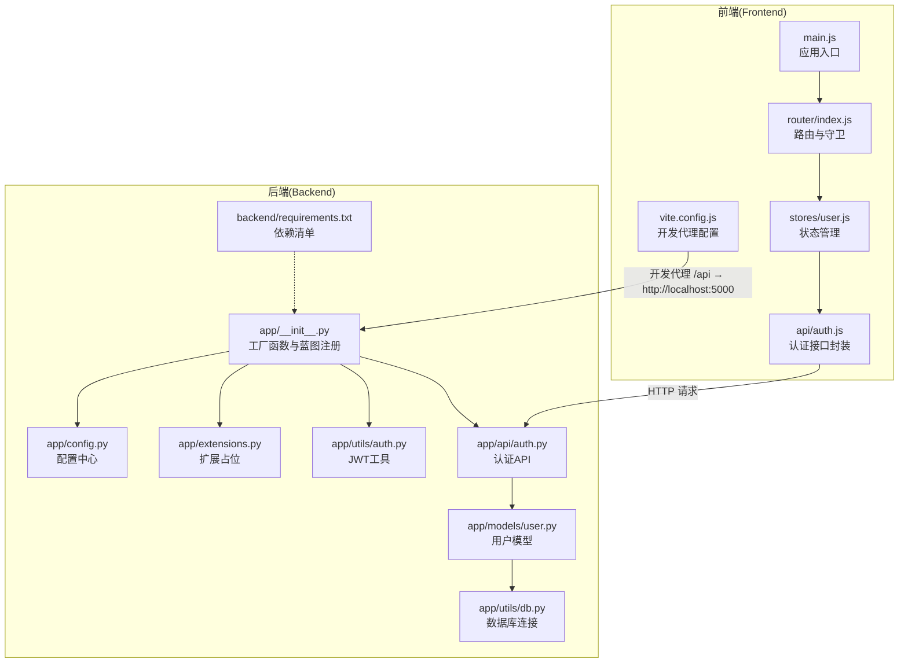
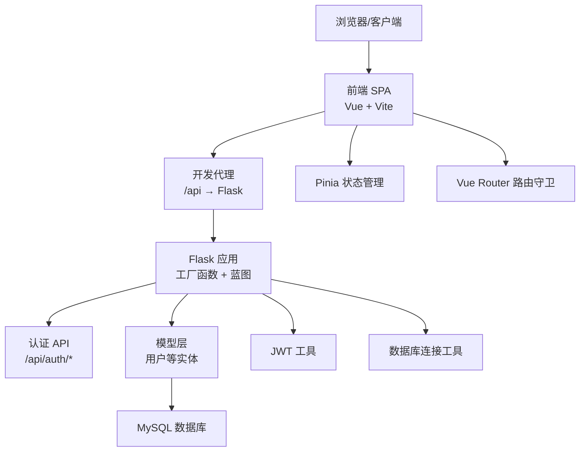
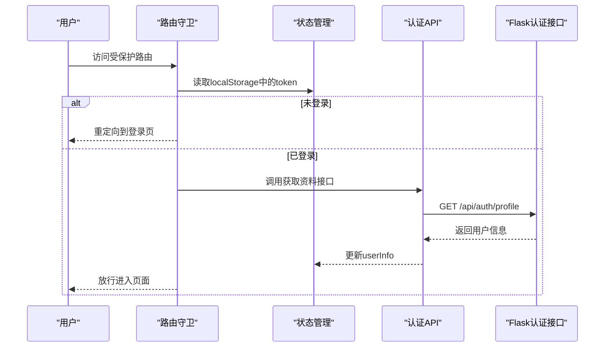
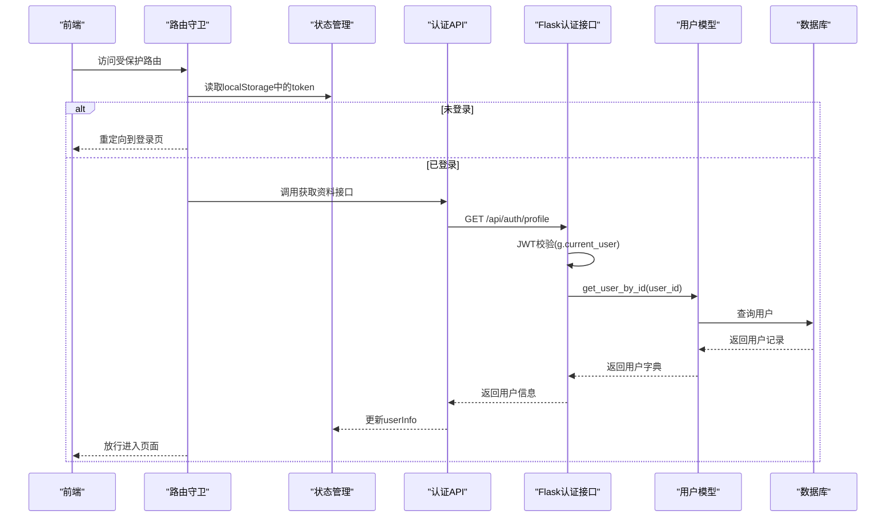
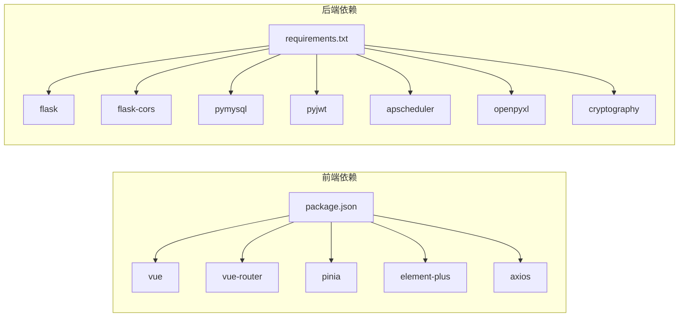

# 整体架构设计

<cite>
**本文引用的文件**
- [backend/app/__init__.py](file://backend/app/__init__.py)
- [backend/app/config.py](file://backend/app/config.py)
- [backend/app/extensions.py](file://backend/app/extensions.py)
- [backend/app/utils/auth.py](file://backend/app/utils/auth.py)
- [backend/app/utils/db.py](file://backend/app/utils/db.py)
- [backend/app/models/user.py](file://backend/app/models/user.py)
- [backend/app/api/auth.py](file://backend/app/api/auth.py)
- [backend/requirements.txt](file://backend/requirements.txt)
- [frontend/src/main.js](file://frontend/src/main.js)
- [frontend/src/router/index.js](file://frontend/src/router/index.js)
- [frontend/src/stores/user.js](file://frontend/src/stores/user.js)
- [frontend/src/api/auth.js](file://frontend/src/api/auth.js)
- [frontend/vite.config.js](file://frontend/vite.config.js)
- [frontend/package.json](file://frontend/package.json)
</cite>

## 目录
1. [引言](#引言)
2. [项目结构](#项目结构)
3. [核心组件](#核心组件)
4. [架构总览](#架构总览)
5. [详细组件分析](#详细组件分析)
6. [依赖分析](#依赖分析)
7. [性能考虑](#性能考虑)
8. [故障排查指南](#故障排查指南)
9. [结论](#结论)
10. [附录](#附录)

## 引言
本文件面向云运维平台的整体架构设计，系统采用前后端分离架构：前端使用 Vue 3 + Vite 构建现代化 SPA 应用，后端基于 Flask 提供 RESTful API，并通过 JWT 实现鉴权与跨域支持。系统遵循分层架构设计，将表现层、业务逻辑层与数据访问层清晰分离；同时在后端以 MVC 的思想组织蓝图（Blueprint）、视图函数与模型，实现职责明确、易于扩展与维护。

## 项目结构
项目采用“前后端分离 + 后端微服务化蓝图”的组织方式：
- 前端工程位于 frontend 目录，使用 Vite 作为构建工具，开发时通过代理将 /api 前缀转发至后端 Flask 服务。
- 后端工程位于 backend/app 目录，采用 Flask 工厂函数创建应用，集中注册多个蓝图以实现功能模块化。
- 数据访问层通过统一的数据库连接工具封装，模型层提供用户等实体的数据库操作方法。
- 配置层集中于 Config 类，支持环境变量注入，便于在不同运行环境中切换参数。

图表来源
- [frontend/src/main.js:1-23](file://frontend/src/main.js#L1-L23)
- [frontend/src/router/index.js:1-61](file://frontend/src/router/index.js#L1-L61)
- [frontend/src/stores/user.js:1-41](file://frontend/src/stores/user.js#L1-L41)
- [frontend/src/api/auth.js:1-14](file://frontend/src/api/auth.js#L1-L14)
- [frontend/vite.config.js:1-16](file://frontend/vite.config.js#L1-L16)
- [backend/app/__init__.py:1-53](file://backend/app/__init__.py#L1-L53)
- [backend/app/config.py:1-21](file://backend/app/config.py#L1-L21)
- [backend/app/extensions.py:1-2](file://backend/app/extensions.py#L1-L2)
- [backend/app/utils/auth.py:1-83](file://backend/app/utils/auth.py#L1-L83)
- [backend/app/utils/db.py:1-17](file://backend/app/utils/db.py#L1-L17)
- [backend/app/models/user.py:1-183](file://backend/app/models/user.py#L1-L183)
- [backend/app/api/auth.py:1-184](file://backend/app/api/auth.py#L1-L184)
- [backend/requirements.txt:1-9](file://backend/requirements.txt#L1-L9)

章节来源
- [frontend/src/main.js:1-23](file://frontend/src/main.js#L1-L23)
- [frontend/src/router/index.js:1-61](file://frontend/src/router/index.js#L1-L61)
- [frontend/src/stores/user.js:1-41](file://frontend/src/stores/user.js#L1-L41)
- [frontend/src/api/auth.js:1-14](file://frontend/src/api/auth.js#L1-L14)
- [frontend/vite.config.js:1-16](file://frontend/vite.config.js#L1-L16)
- [backend/app/__init__.py:1-53](file://backend/app/__init__.py#L1-L53)
- [backend/app/config.py:1-21](file://backend/app/config.py#L1-L21)
- [backend/app/extensions.py:1-2](file://backend/app/extensions.py#L1-L2)
- [backend/app/utils/auth.py:1-83](file://backend/app/utils/auth.py#L1-L83)
- [backend/app/utils/db.py:1-17](file://backend/app/utils/db.py#L1-L17)
- [backend/app/models/user.py:1-183](file://backend/app/models/user.py#L1-L183)
- [backend/app/api/auth.py:1-184](file://backend/app/api/auth.py#L1-L184)
- [backend/requirements.txt:1-9](file://backend/requirements.txt#L1-L9)

## 核心组件
- 前端核心
  - 应用入口与插件：在入口文件中初始化 Vue 应用、Pinia 状态管理、Element Plus 国际化与图标注册，并挂载到 DOM。
  - 路由与守卫：定义页面路由与嵌套路由，实现登录态校验、管理员权限控制与登录页防重复跳转。
  - 状态管理：使用 Pinia 管理 token、用户信息与登录态计算属性，并持久化到本地存储。
  - 接口封装：对认证相关 API 进行统一封装，供视图层调用。
  - 开发代理：Vite 将 /api 前缀请求代理到 Flask 默认端口，避免开发期跨域问题。
- 后端核心
  - 工厂函数：创建 Flask 应用实例，加载配置、启用 CORS、注册蓝图、初始化定时任务。
  - 配置中心：集中管理密钥、数据库连接、上传目录、调试与网络绑定等参数。
  - 认证工具：提供 JWT 编解码、签名过期时间与密码哈希工具。
  - 数据库连接：从应用配置读取数据库参数，返回带字典游标的连接对象。
  - 模型层：用户表的增删改查与密码更新等操作封装。
  - 认证 API：登录、获取资料、修改密码等接口，配合装饰器进行 JWT 校验。
  - 依赖管理：后端依赖通过 requirements.txt 统一声明，涵盖 Web 框架、CORS、数据库驱动、调度器与加密库等。

章节来源
- [frontend/src/main.js:1-23](file://frontend/src/main.js#L1-L23)
- [frontend/src/router/index.js:1-61](file://frontend/src/router/index.js#L1-L61)
- [frontend/src/stores/user.js:1-41](file://frontend/src/stores/user.js#L1-L41)
- [frontend/src/api/auth.js:1-14](file://frontend/src/api/auth.js#L1-L14)
- [frontend/vite.config.js:1-16](file://frontend/vite.config.js#L1-L16)
- [backend/app/__init__.py:1-53](file://backend/app/__init__.py#L1-L53)
- [backend/app/config.py:1-21](file://backend/app/config.py#L1-L21)
- [backend/app/utils/auth.py:1-83](file://backend/app/utils/auth.py#L1-L83)
- [backend/app/utils/db.py:1-17](file://backend/app/utils/db.py#L1-L17)
- [backend/app/models/user.py:1-183](file://backend/app/models/user.py#L1-L183)
- [backend/app/api/auth.py:1-184](file://backend/app/api/auth.py#L1-L184)
- [backend/requirements.txt:1-9](file://backend/requirements.txt#L1-L9)

## 架构总览
系统采用“前端 SPA + 后端 Flask API + MySQL”三层架构：
- 表现层（前端）：Vue 3 单页应用，通过路由与状态管理实现页面导航、用户态与权限控制，调用后端 REST API。
- 业务逻辑层（后端）：以蓝图为模块边界，每个 API 蓝图负责一组资源的增删改查与业务规则；认证装饰器统一处理 JWT 校验。
- 数据访问层（后端）：通过统一的数据库连接工具获取连接，模型层封装 SQL 操作，确保数据访问的一致性与可测试性。
- 配置与扩展：Config 类集中管理运行参数；extensions.py 作为扩展初始化占位，便于后续接入更多插件。

图表来源
- [frontend/vite.config.js:1-16](file://frontend/vite.config.js#L1-L16)
- [frontend/src/main.js:1-23](file://frontend/src/main.js#L1-L23)
- [frontend/src/router/index.js:1-61](file://frontend/src/router/index.js#L1-L61)
- [frontend/src/stores/user.js:1-41](file://frontend/src/stores/user.js#L1-L41)
- [backend/app/__init__.py:1-53](file://backend/app/__init__.py#L1-L53)
- [backend/app/api/auth.py:1-184](file://backend/app/api/auth.py#L1-L184)
- [backend/app/models/user.py:1-183](file://backend/app/models/user.py#L1-L183)
- [backend/app/utils/auth.py:1-83](file://backend/app/utils/auth.py#L1-L83)
- [backend/app/utils/db.py:1-17](file://backend/app/utils/db.py#L1-L17)

## 详细组件分析

### 前端组件分析
- 应用入口与插件
  - 初始化 Vue 应用、Pinia、路由与 Element Plus，并注册 Element Plus 图标组件。
  - 通过挂载到 #app 完成渲染。
- 路由与守卫
  - 定义登录页与主布局下的子路由，设置 requiresAuth 与 requiresAdmin 元信息。
  - 在前置守卫中检查 token、用户角色与登录页重定向逻辑。
- 状态管理
  - 使用 Pinia 管理 token 与 userInfo，并持久化到 localStorage。
  - 提供 fetchProfile 异步拉取用户资料与 logout 清理逻辑。
- 接口封装
  - 对 /auth/login、/auth/profile、/auth/password 等接口进行封装，供视图层调用。
- 开发代理
  - 将 /api 前缀代理到 Flask 默认端口，简化开发期跨域问题。

图表来源
- [frontend/src/router/index.js:35-58](file://frontend/src/router/index.js#L35-L58)
- [frontend/src/stores/user.js:23-30](file://frontend/src/stores/user.js#L23-L30)
- [frontend/src/api/auth.js:7-9](file://frontend/src/api/auth.js#L7-L9)
- [backend/app/api/auth.py:85-115](file://backend/app/api/auth.py#L85-L115)

章节来源
- [frontend/src/main.js:1-23](file://frontend/src/main.js#L1-L23)
- [frontend/src/router/index.js:1-61](file://frontend/src/router/index.js#L1-L61)
- [frontend/src/stores/user.js:1-41](file://frontend/src/stores/user.js#L1-L41)
- [frontend/src/api/auth.js:1-14](file://frontend/src/api/auth.js#L1-L14)
- [frontend/vite.config.js:1-16](file://frontend/vite.config.js#L1-L16)

### 后端组件分析
- 工厂函数与蓝图注册
  - 创建 Flask 应用，加载配置，启用 CORS，注册认证、用户、导出、任务、服务器、服务、账号、应用、证书、记录、仪表盘等蓝图。
- 配置中心
  - 通过环境变量注入密钥、数据库参数、调试与网络绑定等，确保生产安全与灵活部署。
- 认证工具
  - 生成与验证 JWT，设置过期时间与算法；提供密码哈希与校验工具。
- 数据库连接
  - 从应用配置读取数据库参数，返回带字典游标的连接对象，便于模型层直接使用键值访问。
- 模型层（用户）
  - 提供创建、查询、更新、删除与密码更新等方法，封装 SQL 并返回标准化结果。
- 认证 API
  - 登录：校验用户名与密码，返回 token 与用户信息。
  - 获取资料：JWT 校验后返回用户信息。
  - 修改密码：校验旧密码，更新为新密码哈希。

图表来源
- [frontend/src/router/index.js:35-58](file://frontend/src/router/index.js#L35-L58)
- [frontend/src/stores/user.js:23-30](file://frontend/src/stores/user.js#L23-L30)
- [frontend/src/api/auth.js:7-9](file://frontend/src/api/auth.js#L7-L9)
- [backend/app/api/auth.py:85-115](file://backend/app/api/auth.py#L85-L115)
- [backend/app/models/user.py:61-80](file://backend/app/models/user.py#L61-L80)
- [backend/app/utils/auth.py:38-56](file://backend/app/utils/auth.py#L38-L56)

章节来源
- [backend/app/__init__.py:1-53](file://backend/app/__init__.py#L1-L53)
- [backend/app/config.py:1-21](file://backend/app/config.py#L1-L21)
- [backend/app/utils/auth.py:1-83](file://backend/app/utils/auth.py#L1-L83)
- [backend/app/utils/db.py:1-17](file://backend/app/utils/db.py#L1-L17)
- [backend/app/models/user.py:1-183](file://backend/app/models/user.py#L1-L183)
- [backend/app/api/auth.py:1-184](file://backend/app/api/auth.py#L1-L184)

### MVC 架构模式在项目中的实现
- Model（模型层）
  - 用户模型封装数据库操作，提供创建、查询、更新、删除与密码更新等方法，屏蔽底层 SQL 细节。
- View（视图层）
  - 前端使用 Vue 组件作为视图，通过路由与状态管理呈现页面内容。
- Controller（控制器层）
  - 后端以蓝图（Blueprint）承载控制器职责，每个蓝图包含一组视图函数（路由处理），负责接收请求、调用模型、返回响应。
- 额外补充
  - 认证装饰器承担部分控制器职责，统一处理 JWT 校验与用户上下文注入。

章节来源
- [backend/app/models/user.py:1-183](file://backend/app/models/user.py#L1-L183)
- [frontend/src/router/index.js:1-61](file://frontend/src/router/index.js#L1-L61)
- [frontend/src/stores/user.js:1-41](file://frontend/src/stores/user.js#L1-L41)
- [backend/app/api/auth.py:1-184](file://backend/app/api/auth.py#L1-L184)
- [backend/app/utils/auth.py:1-83](file://backend/app/utils/auth.py#L1-L83)

### Flask 应用初始化与配置管理
- 初始化流程
  - 工厂函数创建应用实例，加载 Config 类的类属性到 app.config，启用 CORS，注册全部蓝图，初始化定时任务。
- 配置管理
  - Config 类集中管理密钥、数据库、调试与网络绑定等参数，支持通过环境变量覆盖默认值。
- 依赖管理
  - requirements.txt 统一声明 Flask、CORS、数据库驱动、调度器与加密库等依赖。

章节来源
- [backend/app/__init__.py:1-53](file://backend/app/__init__.py#L1-L53)
- [backend/app/config.py:1-21](file://backend/app/config.py#L1-L21)
- [backend/requirements.txt:1-9](file://backend/requirements.txt#L1-L9)

### 前后端分离架构的优势与结合方式
- 优势
  - 前端专注用户体验与交互，后端专注业务与数据，职责清晰；前后端可独立演进与部署。
  - 前端 SPA 提供流畅的单页体验，路由守卫与状态管理保障登录态与权限控制。
- 结合方式
  - 前端通过 Axios 调用后端 /api 前缀接口；开发阶段通过 Vite 代理解决跨域；生产阶段由反向代理或静态资源服务器提供前端产物与 API 路由转发。

章节来源
- [frontend/src/api/auth.js:1-14](file://frontend/src/api/auth.js#L1-L14)
- [frontend/vite.config.js:1-16](file://frontend/vite.config.js#L1-L16)
- [frontend/src/router/index.js:1-61](file://frontend/src/router/index.js#L1-L61)

## 依赖分析
- 前端依赖
  - Vue 3、Vue Router、Pinia、Element Plus、Axios 等，支撑 SPA 构建与状态管理、UI 组件与 HTTP 请求。
- 后端依赖
  - Flask、Flask-CORS、PyMySQL、PyJWT、APScheduler、OpenPyXL、Cryptography 等，支撑 Web 服务、跨域、数据库访问、认证、定时任务与加密。
- 关系图

图表来源
- [frontend/package.json:1-24](file://frontend/package.json#L1-L24)
- [backend/requirements.txt:1-9](file://backend/requirements.txt#L1-L9)

章节来源
- [frontend/package.json:1-24](file://frontend/package.json#L1-L24)
- [backend/requirements.txt:1-9](file://backend/requirements.txt#L1-L9)

## 性能考虑
- 前端
  - 使用路由懒加载与按需注册图标，减少首屏体积；Pinia 状态持久化于本地存储，降低重复请求。
- 后端
  - 数据库连接通过统一工具获取，避免重复连接与配置遗漏；蓝图拆分降低单文件复杂度，提升可维护性。
- 通用
  - 生产环境建议开启 Gunicorn/uWSGI 与 Nginx 反向代理，前端产物交由 Nginx 提供，后端通过上游代理转发 /api 请求。

## 故障排查指南
- 登录失败
  - 检查用户名是否存在、密码是否正确、用户是否激活；确认后端 JWT 密钥与前端存储的 token 一致。
- 获取资料失败
  - 检查 token 是否存在且未过期；确认后端 JWT 验证逻辑与用户 ID 是否正确注入到 g.current_user。
- 数据库连接异常
  - 检查 DB_HOST、DB_PORT、DB_USER、DB_PASSWORD、DB_NAME 等环境变量是否正确；确认数据库可达与字符集设置。
- 跨域问题
  - 确认 CORS 配置允许 /api 前缀；开发阶段检查 Vite 代理是否生效。

章节来源
- [backend/app/api/auth.py:14-82](file://backend/app/api/auth.py#L14-L82)
- [backend/app/utils/auth.py:38-56](file://backend/app/utils/auth.py#L38-L56)
- [backend/app/config.py:9-13](file://backend/app/config.py#L9-L13)
- [backend/app/utils/db.py:5-16](file://backend/app/utils/db.py#L5-L16)
- [frontend/vite.config.js:8-13](file://frontend/vite.config.js#L8-L13)

## 结论
该云运维平台通过前后端分离与分层架构实现了清晰的职责划分与良好的扩展性：前端以 SPA 形式提供现代化交互体验，后端以 Flask 蓝图承载业务能力并以 JWT 实现鉴权，数据访问层通过统一工具与模型封装保证一致性与可维护性。结合环境变量配置与代理机制，系统具备较强的可移植性与安全性，适合在多环境部署与持续迭代。

## 附录
- 技术选型理由
  - 前端：Vue 3 生态成熟、组件化与组合式 API 易于维护；Vite 构建快速、开发体验佳；Element Plus 提供丰富的 UI 组件。
  - 后端：Flask 轻量灵活、蓝图天然适配模块化；PyJWT 提供标准 JWT 支持；PyMySQL 与 APScheduler 满足数据库与定时任务需求。
- 架构决策权衡
  - 采用 JWT 无状态鉴权，简化服务端会话管理，但需注意密钥安全与令牌撤销策略；生产环境建议引入刷新令牌与黑名单机制。
  - 前后端分离提升开发效率，但需重视跨域与 HTTPS 部署；建议在网关层统一处理 TLS 与路由转发。
- 扩展性设计原则
  - 蓝图按领域拆分，新增功能优先新增蓝图；模型层保持纯数据访问，避免业务逻辑上移；配置集中化，便于环境切换与密钥管理。