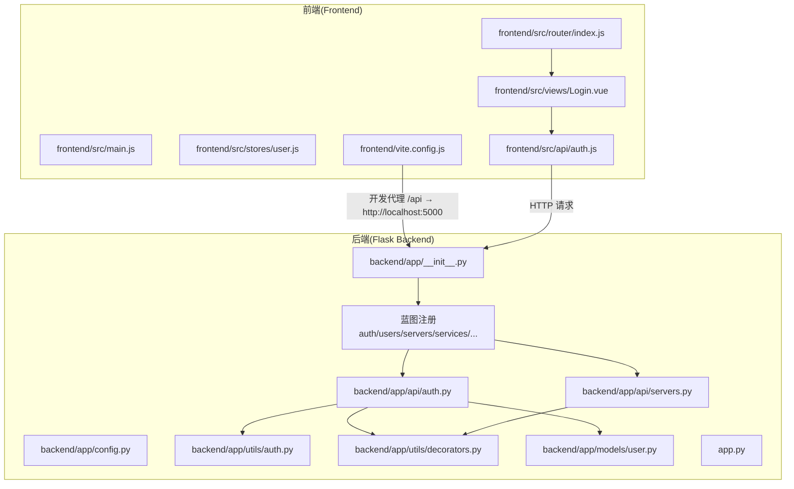
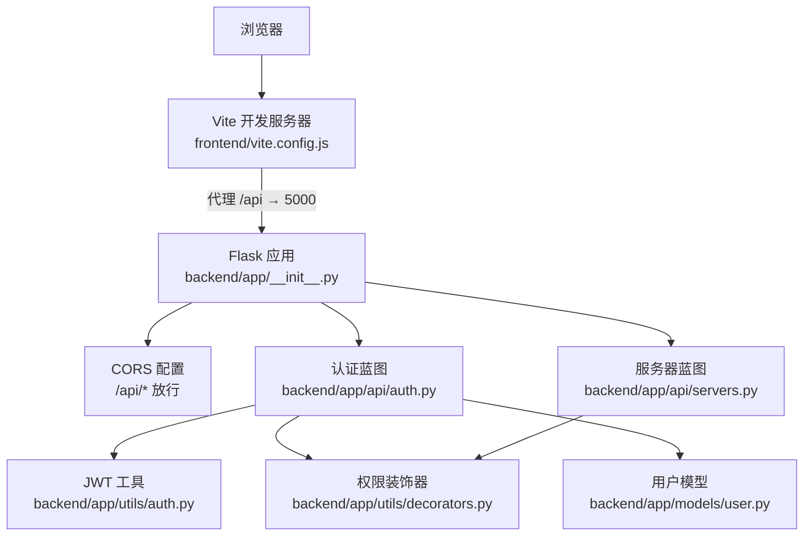
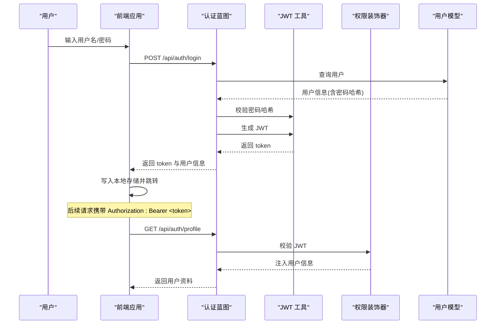
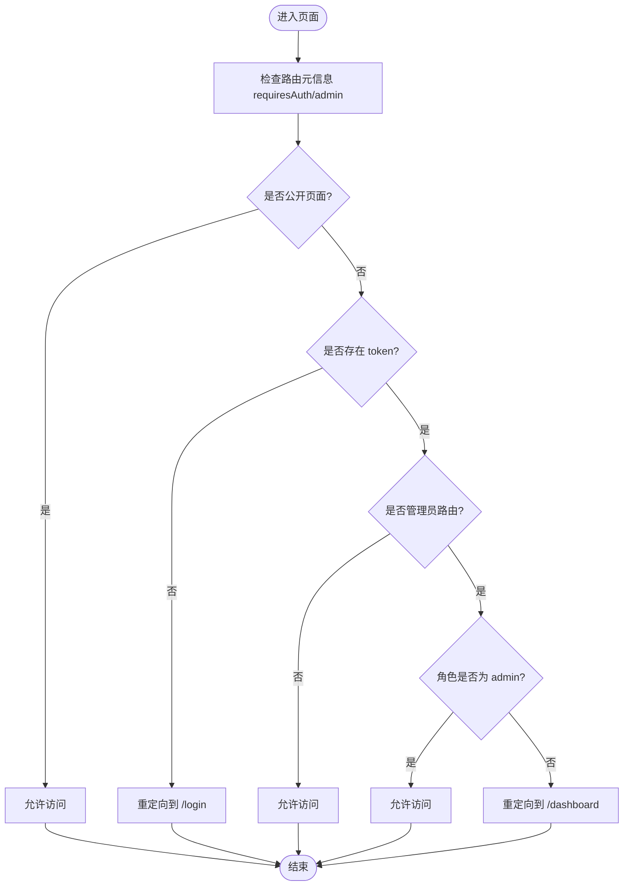
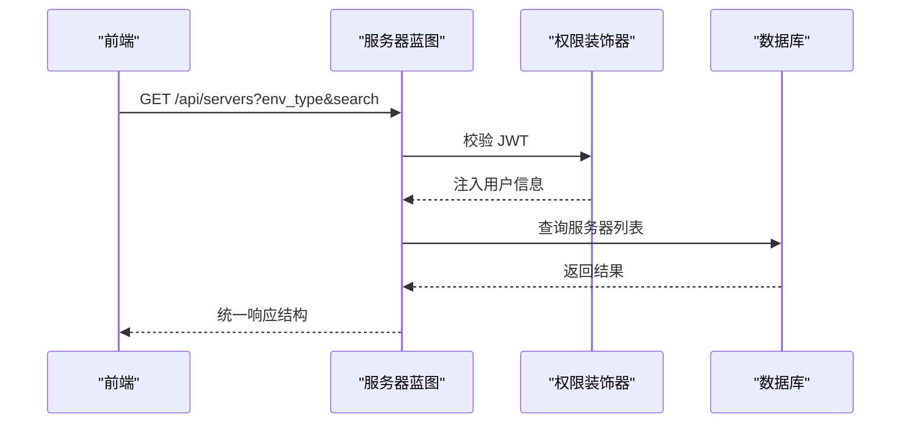
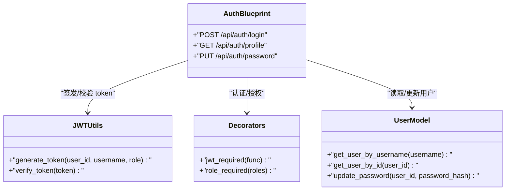
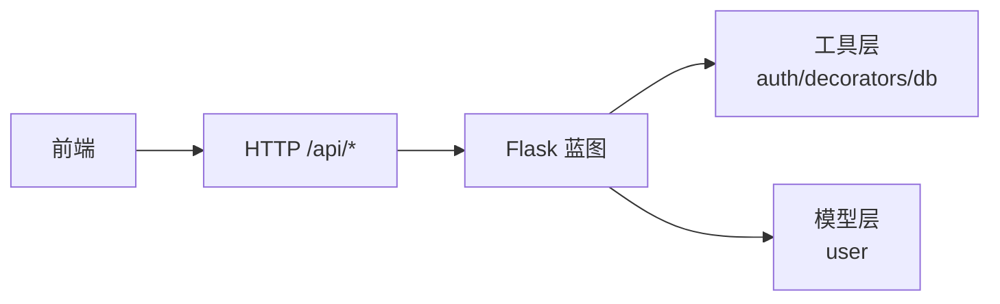

# 系统架构

<cite>
**本文引用的文件**
- [app.py](file://app.py)
- [backend/app/__init__.py](file://backend/app/__init__.py)
- [backend/app/config.py](file://backend/app/config.py)
- [backend/app/api/auth.py](file://backend/app/api/auth.py)
- [backend/app/utils/auth.py](file://backend/app/utils/auth.py)
- [backend/app/utils/decorators.py](file://backend/app/utils/decorators.py)
- [backend/app/api/servers.py](file://backend/app/api/servers.py)
- [backend/app/models/user.py](file://backend/app/models/user.py)
- [frontend/src/main.js](file://frontend/src/main.js)
- [frontend/vite.config.js](file://frontend/vite.config.js)
- [frontend/src/router/index.js](file://frontend/src/router/index.js)
- [frontend/src/stores/user.js](file://frontend/src/stores/user.js)
- [frontend/src/api/auth.js](file://frontend/src/api/auth.js)
- [frontend/src/views/Login.vue](file://frontend/src/views/Login.vue)
- [config.py](file://config.py)
</cite>

## 目录
1. [引言](#引言)
2. [项目结构](#项目结构)
3. [核心组件](#核心组件)
4. [架构总览](#架构总览)
5. [详细组件分析](#详细组件分析)
6. [依赖分析](#依赖分析)
7. [性能考虑](#性能考虑)
8. [故障排查指南](#故障排查指南)
9. [结论](#结论)
10. [附录](#附录)

## 引言
本系统为一个云运维平台，采用前后端分离架构：后端基于 Flask 构建，使用蓝图组织 API；前端基于 Vue.js 与 Pinia、Element Plus、Vue Router 组织应用结构。系统通过 CORS 实现跨域支持，采用 JWT 进行认证授权，并通过 Vite 开发服务器代理实现本地联调。本文档从系统架构、组件关系、数据流、安全与性能等方面进行深入说明，并给出系统拓扑图与组件关系图。

## 项目结构
- 后端
  - 应用入口与蓝图注册：在后端应用工厂中注册认证、用户、导出、任务、服务器、服务、账号、应用、证书、变更记录、仪表盘等蓝图。
  - 配置：集中管理数据库连接、JWT 密钥、CORS、上传目录与大小限制等。
  - 工具与模型：认证工具、权限装饰器、数据库连接封装、用户模型等。
- 前端
  - 应用入口：初始化 Vue、Pinia、路由、Element Plus 并挂载。
  - 路由与权限：定义页面路由与导航守卫，结合本地存储 token 控制访问。
  - 状态管理：Pinia Store 管理用户 token、用户信息与登录状态。
  - API 层：统一的请求封装与各业务模块 API。
  - 开发代理：Vite 代理将 /api 请求转发至后端 Flask。

图表来源
- [backend/app/__init__.py:6-25](file://backend/app/__init__.py#L6-L25)
- [backend/app/__init__.py:28-53](file://backend/app/__init__.py#L28-L53)
- [backend/app/api/auth.py:11-11](file://backend/app/api/auth.py#L11-L11)
- [backend/app/api/servers.py:8-8](file://backend/app/api/servers.py#L8-L8)
- [backend/app/utils/auth.py:11-35](file://backend/app/utils/auth.py#L11-L35)
- [backend/app/utils/decorators.py:9-56](file://backend/app/utils/decorators.py#L9-L56)
- [backend/app/models/user.py:39-58](file://backend/app/models/user.py#L39-L58)
- [frontend/src/main.js:10-22](file://frontend/src/main.js#L10-L22)
- [frontend/src/router/index.js:35-58](file://frontend/src/router/index.js#L35-L58)
- [frontend/src/stores/user.js:5-40](file://frontend/src/stores/user.js#L5-L40)
- [frontend/src/api/auth.js:1-14](file://frontend/src/api/auth.js#L1-L14)
- [frontend/src/views/Login.vue:50-66](file://frontend/src/views/Login.vue#L50-L66)
- [frontend/vite.config.js:8-13](file://frontend/vite.config.js#L8-L13)
- [app.py:26-78](file://app.py#L26-L78)

章节来源
- [backend/app/__init__.py:6-25](file://backend/app/__init__.py#L6-L25)
- [backend/app/__init__.py:28-53](file://backend/app/__init__.py#L28-L53)
- [backend/app/config.py:4-21](file://backend/app/config.py#L4-L21)
- [frontend/src/main.js:10-22](file://frontend/src/main.js#L10-L22)
- [frontend/vite.config.js:8-13](file://frontend/vite.config.js#L8-L13)

## 核心组件
- 后端应用工厂与蓝图注册
  - 在应用工厂中完成配置注入、CORS 初始化、定时任务调度器初始化，并集中注册所有业务蓝图。
- 认证与权限
  - 认证 API 提供登录、获取用户资料、修改密码接口；JWT 工具负责签发与校验；装饰器提供 JWT 校验与角色校验。
- 数据访问与模型
  - 用户模型封装数据库操作；数据库工具提供连接获取；各业务蓝图通过工具层访问数据库。
- 前端应用结构
  - 应用入口初始化框架与插件；路由定义页面与守卫；Pinia Store 管理用户状态；API 层封装请求；开发代理将 /api 请求转发至后端。

章节来源
- [backend/app/__init__.py:6-25](file://backend/app/__init__.py#L6-L25)
- [backend/app/api/auth.py:14-82](file://backend/app/api/auth.py#L14-L82)
- [backend/app/utils/auth.py:11-35](file://backend/app/utils/auth.py#L11-L35)
- [backend/app/utils/decorators.py:9-56](file://backend/app/utils/decorators.py#L9-L56)
- [backend/app/models/user.py:39-58](file://backend/app/models/user.py#L39-L58)
- [frontend/src/main.js:10-22](file://frontend/src/main.js#L10-L22)
- [frontend/src/router/index.js:35-58](file://frontend/src/router/index.js#L35-L58)
- [frontend/src/stores/user.js:5-40](file://frontend/src/stores/user.js#L5-L40)
- [frontend/src/api/auth.js:1-14](file://frontend/src/api/auth.js#L1-L14)

## 架构总览
系统采用前后端分离架构，前端通过浏览器发起 HTTP 请求，开发阶段由 Vite 代理将 /api 前缀请求转发到后端 Flask。后端以蓝图划分功能域，统一通过装饰器进行认证与权限控制，使用 JWT 作为无状态认证方案。CORS 在后端对 /api/* 路径开放跨域并支持凭证传递。

图表来源
- [frontend/vite.config.js:8-13](file://frontend/vite.config.js#L8-L13)
- [backend/app/__init__.py:15-16](file://backend/app/__init__.py#L15-L16)
- [backend/app/api/auth.py:11-11](file://backend/app/api/auth.py#L11-L11)
- [backend/app/api/servers.py:8-8](file://backend/app/api/servers.py#L8-L8)
- [backend/app/utils/decorators.py:9-56](file://backend/app/utils/decorators.py#L9-L56)
- [backend/app/utils/auth.py:11-35](file://backend/app/utils/auth.py#L11-L35)
- [backend/app/models/user.py:39-58](file://backend/app/models/user.py#L39-L58)

## 详细组件分析

### 认证与授权流程
- 登录流程
  - 前端提交用户名与密码到后端认证接口，后端验证用户是否存在且激活，校验密码哈希，生成 JWT 并返回给前端。
  - 前端将 token 与用户信息写入本地存储，并跳转到仪表盘。
- 权限控制
  - 所有受保护接口均需携带 Bearer Token；装饰器解析 Authorization 头，校验签名与有效期，将用户信息注入上下文。
  - 角色装饰器在 JWT 校验后进一步判断用户角色是否满足要求。
- 密码修改
  - 需要提供旧密码与新密码，后端验证旧密码正确后更新为新密码哈希。

图表来源
- [frontend/src/views/Login.vue:50-66](file://frontend/src/views/Login.vue#L50-L66)
- [frontend/src/api/auth.js:3-9](file://frontend/src/api/auth.js#L3-L9)
- [backend/app/api/auth.py:14-82](file://backend/app/api/auth.py#L14-L82)
- [backend/app/utils/auth.py:11-35](file://backend/app/utils/auth.py#L11-L35)
- [backend/app/utils/decorators.py:9-56](file://backend/app/utils/decorators.py#L9-L56)
- [backend/app/models/user.py:39-58](file://backend/app/models/user.py#L39-L58)

章节来源
- [frontend/src/views/Login.vue:50-66](file://frontend/src/views/Login.vue#L50-L66)
- [frontend/src/api/auth.js:3-9](file://frontend/src/api/auth.js#L3-L9)
- [backend/app/api/auth.py:14-82](file://backend/app/api/auth.py#L14-L82)
- [backend/app/utils/auth.py:11-35](file://backend/app/utils/auth.py#L11-L35)
- [backend/app/utils/decorators.py:9-56](file://backend/app/utils/decorators.py#L9-L56)
- [backend/app/models/user.py:39-58](file://backend/app/models/user.py#L39-L58)

### 前端路由与状态管理
- 路由守卫
  - 未登录访问受保护页面将重定向至登录页；管理员专属页面需校验角色；登录页若已登录则重定向至仪表盘。
- 状态管理
  - Store 维护 token、用户信息、登录态与管理员态；提供获取资料与退出登录方法；与本地存储保持同步。
- 开发代理
  - Vite 将 /api 前缀请求代理到后端 Flask，默认目标为本地 5000 端口。

图表来源
- [frontend/src/router/index.js:35-58](file://frontend/src/router/index.js#L35-L58)
- [frontend/src/stores/user.js:5-40](file://frontend/src/stores/user.js#L5-L40)

章节来源
- [frontend/src/router/index.js:35-58](file://frontend/src/router/index.js#L35-L58)
- [frontend/src/stores/user.js:5-40](file://frontend/src/stores/user.js#L5-L40)
- [frontend/vite.config.js:8-13](file://frontend/vite.config.js#L8-L13)

### 服务器管理 API（示例）
- 接口覆盖
  - 列表查询、详情查询、下拉列表、创建、更新、删除等。
- 权限控制
  - 所有接口需 JWT 认证；部分接口需特定角色（如 admin/operator）。
- 数据访问
  - 通过数据库工具获取连接，执行 SQL 并返回统一结构的响应。

图表来源
- [backend/app/api/servers.py:11-43](file://backend/app/api/servers.py#L11-L43)
- [backend/app/utils/decorators.py:9-56](file://backend/app/utils/decorators.py#L9-L56)

章节来源
- [backend/app/api/servers.py:11-43](file://backend/app/api/servers.py#L11-L43)
- [backend/app/utils/decorators.py:9-56](file://backend/app/utils/decorators.py#L9-L56)

### 类关系图（认证相关）

图表来源
- [backend/app/api/auth.py:11-11](file://backend/app/api/auth.py#L11-L11)
- [backend/app/utils/auth.py:11-35](file://backend/app/utils/auth.py#L11-L35)
- [backend/app/utils/decorators.py:9-56](file://backend/app/utils/decorators.py#L9-L56)
- [backend/app/models/user.py:39-58](file://backend/app/models/user.py#L39-L58)

## 依赖分析
- 组件耦合
  - 前端仅依赖后端提供的 /api 接口，通过统一的请求封装与路由守卫实现解耦。
  - 后端通过蓝图将不同业务域隔离，装饰器提供横切的认证与授权能力。
- 外部依赖
  - 前端：Vue、Pinia、Element Plus、Vue Router、Vite。
  - 后端：Flask、Flask-CORS、PyMySQL、PyJWT、Werkzeug。
- 可能的循环依赖
  - 当前结构以蓝图与工具层解耦，未见直接循环导入迹象。

图表来源
- [frontend/src/api/auth.js:1-14](file://frontend/src/api/auth.js#L1-L14)
- [backend/app/__init__.py:28-53](file://backend/app/__init__.py#L28-L53)
- [backend/app/utils/auth.py:11-35](file://backend/app/utils/auth.py#L11-L35)
- [backend/app/utils/decorators.py:9-56](file://backend/app/utils/decorators.py#L9-L56)
- [backend/app/models/user.py:39-58](file://backend/app/models/user.py#L39-L58)

章节来源
- [frontend/src/api/auth.js:1-14](file://frontend/src/api/auth.js#L1-L14)
- [backend/app/__init__.py:28-53](file://backend/app/__init__.py#L28-L53)
- [backend/app/utils/auth.py:11-35](file://backend/app/utils/auth.py#L11-L35)
- [backend/app/utils/decorators.py:9-56](file://backend/app/utils/decorators.py#L9-L56)
- [backend/app/models/user.py:39-58](file://backend/app/models/user.py#L39-L58)

## 性能考虑
- 响应格式统一化
  - 后端接口统一返回包含状态码与数据的结构，便于前端一致处理，减少额外解析成本。
- 路由与查询
  - 服务器列表接口支持按环境类型与关键词过滤，建议在数据库层面建立索引以提升查询效率。
- 缓存策略
  - 可在应用层引入轻量缓存（如 Redis）用于热点数据（如服务器下拉列表），降低数据库压力。
- 负载均衡
  - 前端通过代理联调，生产部署可将前端静态资源置于 CDN，后端多实例横向扩展并通过反向代理分发请求。
- 安全加固
  - 生产环境应设置严格的 CORS 白名单、HTTPS、JWT 密钥轮换与日志审计。

## 故障排查指南
- 登录失败
  - 检查用户名是否存在且被激活；确认密码哈希匹配；查看后端返回的错误码与消息。
- 401/403 未认证或权限不足
  - 确认请求头中携带正确的 Bearer Token；检查 token 是否过期；确认用户角色是否满足接口要求。
- 开发联调失败
  - 确认 Vite 代理配置指向后端地址；检查后端 CORS 是否放行 /api/*；确认 Flask 服务已启动。
- 数据库连接问题
  - 检查数据库主机、端口、账号与密码配置；确认网络连通性与防火墙策略。

章节来源
- [backend/app/api/auth.py:40-61](file://backend/app/api/auth.py#L40-L61)
- [backend/app/utils/decorators.py:22-45](file://backend/app/utils/decorators.py#L22-L45)
- [frontend/vite.config.js:8-13](file://frontend/vite.config.js#L8-L13)
- [backend/app/config.py:9-13](file://backend/app/config.py#L9-L13)

## 结论
该云运维平台通过清晰的前后端分离架构实现了高内聚低耦合的设计：后端以蓝图划分职责、以装饰器实现认证与授权、以统一响应结构提升一致性；前端以路由与状态管理实现良好的用户体验与权限控制。配合 CORS 与 JWT，系统具备良好的可扩展性与安全性。建议在生产环境中完善 CORS 白名单、引入缓存与 CDN、加强密钥与日志管理，并持续优化数据库查询与索引策略。

## 附录
- 关键配置项
  - 后端配置：数据库连接、JWT 密钥与过期时间、CORS 放行规则、上传目录与大小限制。
  - 前端配置：Vite 代理目标、Element Plus 国际化、路由元信息与守卫逻辑。
- 数据库连接
  - 后端通过工具层获取连接，建议在生产环境使用连接池与超时控制。

章节来源
- [backend/app/config.py:4-21](file://backend/app/config.py#L4-L21)
- [config.py:3-16](file://config.py#L3-L16)
- [frontend/vite.config.js:8-13](file://frontend/vite.config.js#L8-L13)
- [frontend/src/router/index.js:35-58](file://frontend/src/router/index.js#L35-L58)