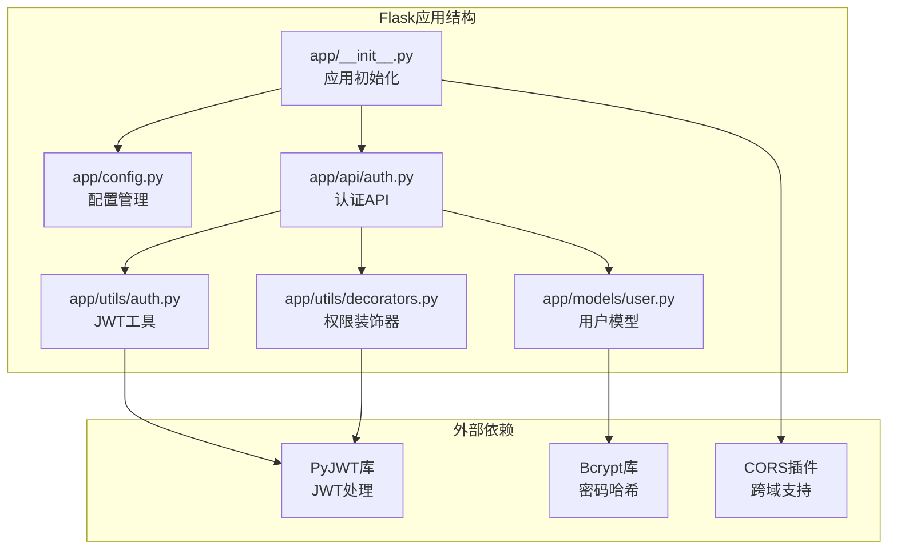
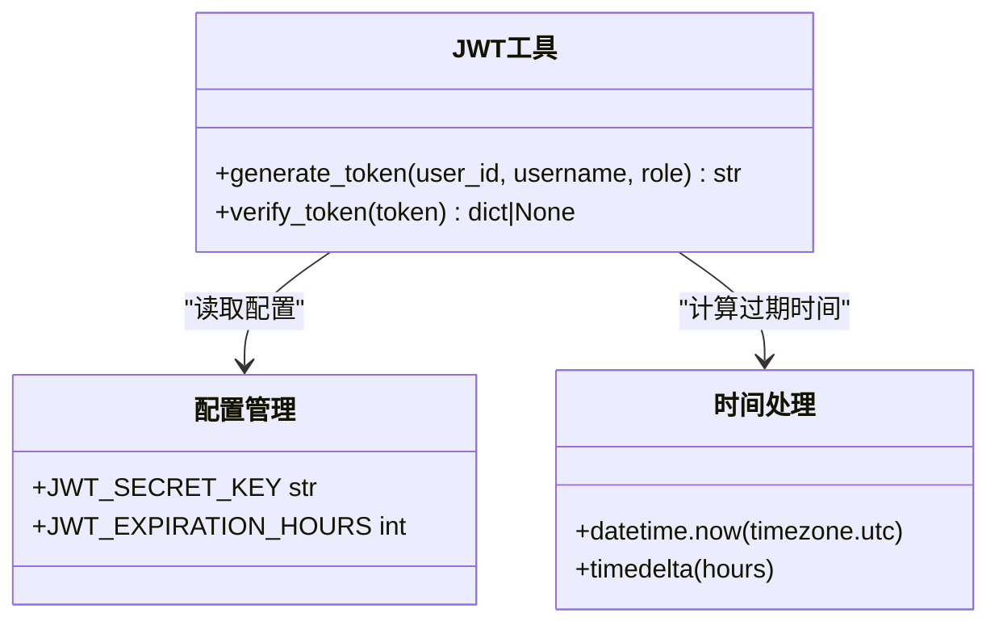
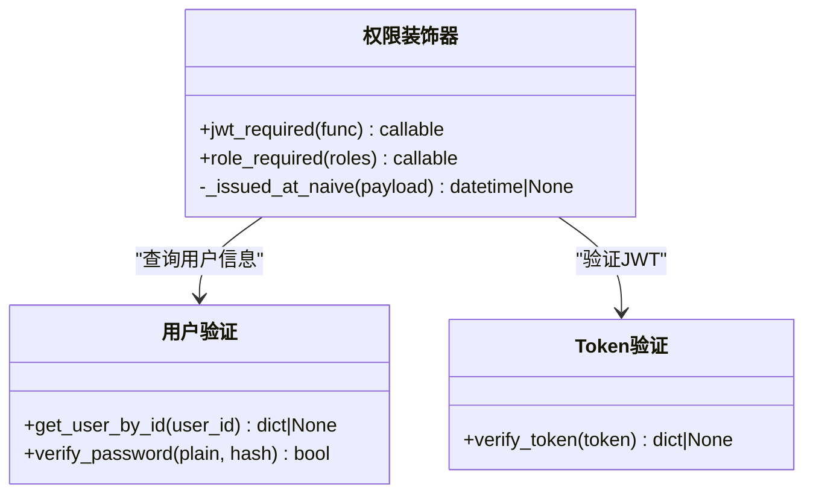
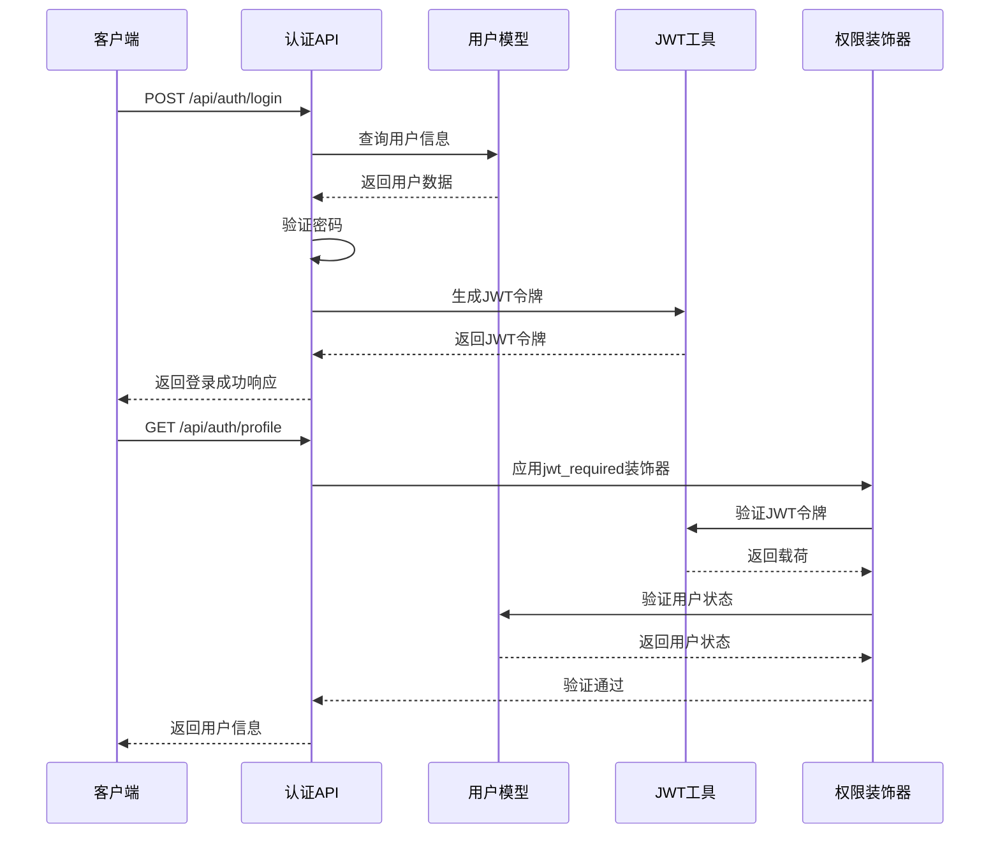
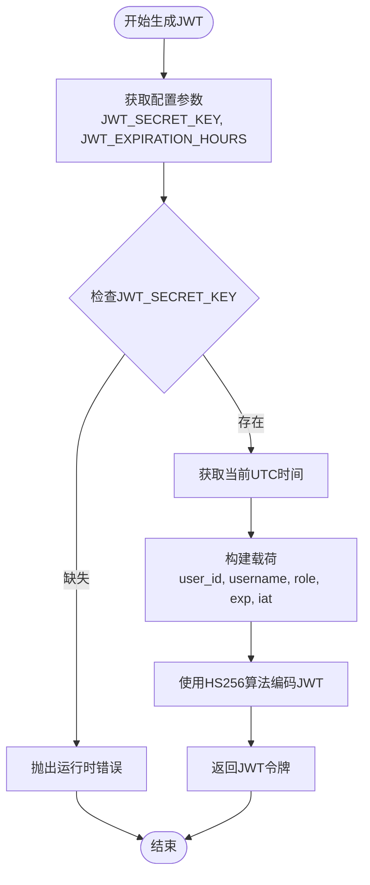
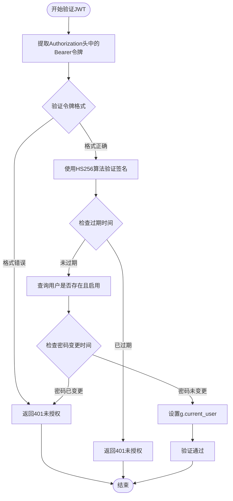
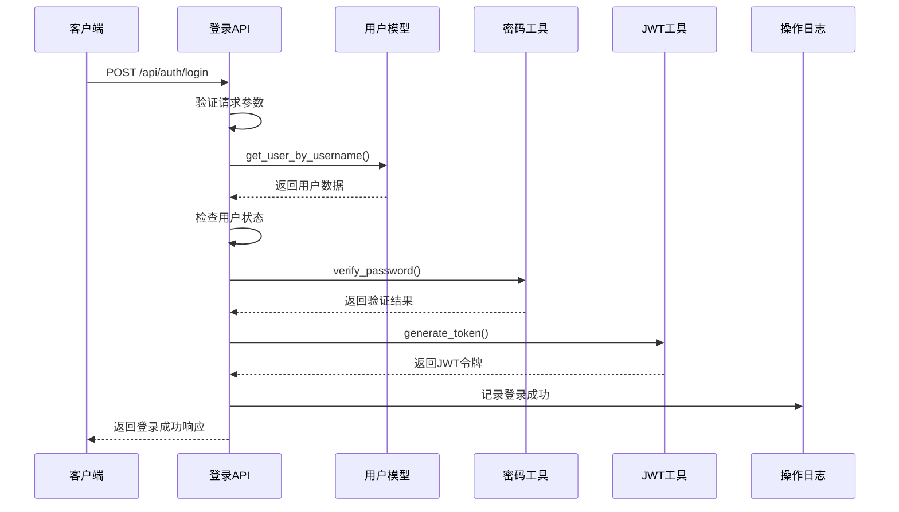
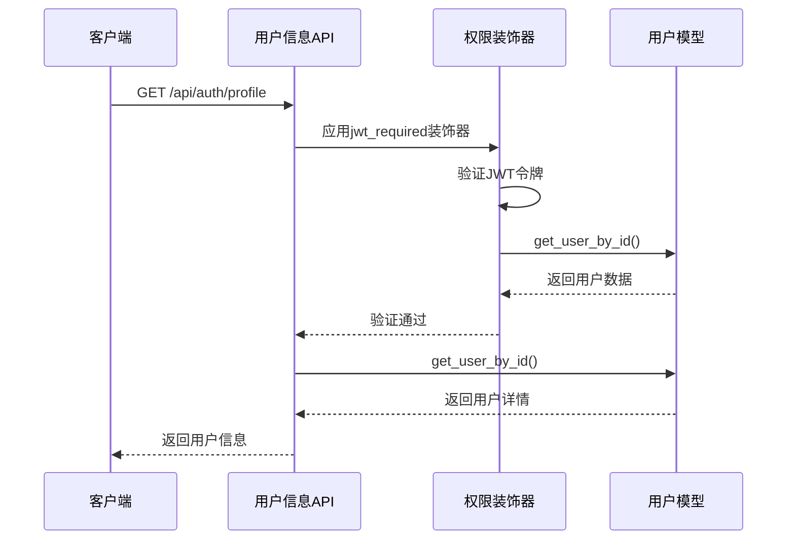
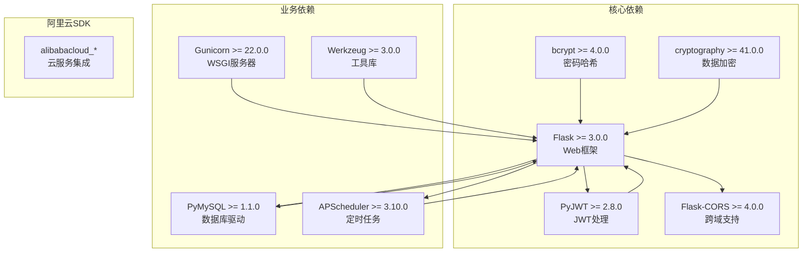
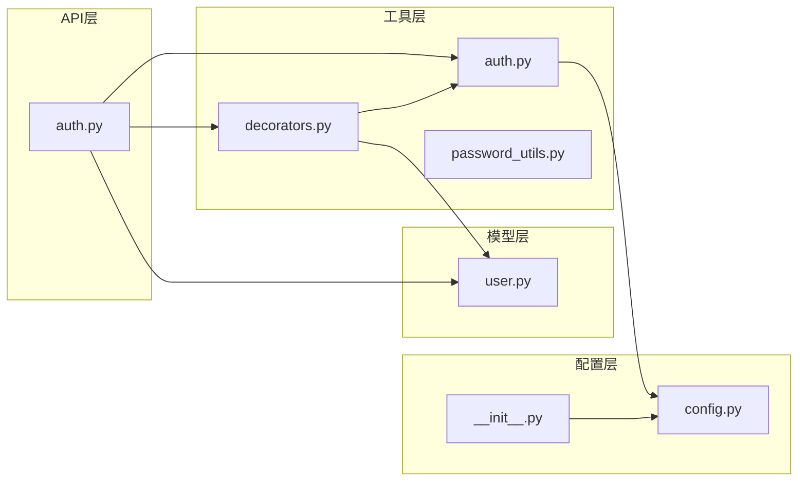

# JWT认证机制

<cite>
**本文档引用的文件**
- [backend/app/utils/auth.py](file://backend/app/utils/auth.py)
- [backend/app/api/auth.py](file://backend/app/api/auth.py)
- [backend/app/utils/decorators.py](file://backend/app/utils/decorators.py)
- [backend/app/models/user.py](file://backend/app/models/user.py)
- [backend/app/config.py](file://backend/app/config.py)
- [backend/app/__init__.py](file://backend/app/__init__.py)
- [backend/requirements.txt](file://backend/requirements.txt)
</cite>

## 目录
1. [简介](#简介)
2. [项目结构](#项目结构)
3. [核心组件](#核心组件)
4. [架构概览](#架构概览)
5. [详细组件分析](#详细组件分析)
6. [依赖分析](#依赖分析)
7. [性能考虑](#性能考虑)
8. [故障排除指南](#故障排除指南)
9. [结论](#结论)
10. [附录](#附录)

## 简介

本文件详细阐述了Flask应用中的JWT（JSON Web Token）认证机制。JWT是一种开放标准（RFC 7519），用于在网络应用间安全地传输声明信息。该系统实现了完整的用户认证流程，包括Token生成、验证、权限控制等功能。

JWT由三个部分组成：
- **Header（头部）**：包含令牌类型和签名算法信息
- **Payload（载荷）**：包含声明信息，如用户身份、角色等
- **Signature（签名）**：用于验证令牌完整性和真实性

## 项目结构

该项目采用Flask框架构建，JWT认证功能分布在以下关键模块中：

**图表来源**
- [backend/app/__init__.py:28-114](file://backend/app/__init__.py#L28-L114)
- [backend/app/config.py:10-58](file://backend/app/config.py#L10-L58)

**章节来源**
- [backend/app/__init__.py:28-149](file://backend/app/__init__.py#L28-L149)
- [backend/app/config.py:10-58](file://backend/app/config.py#L10-L58)

## 核心组件

### JWT工具模块

JWT工具模块提供了令牌生成和验证的核心功能：

**图表来源**
- [backend/app/utils/auth.py:9-45](file://backend/app/utils/auth.py#L9-L45)
- [backend/app/config.py:13-14](file://backend/app/config.py#L13-L14)

### 权限装饰器

权限装饰器实现了基于JWT的访问控制：

**图表来源**
- [backend/app/utils/decorators.py:26-163](file://backend/app/utils/decorators.py#L26-L163)

**章节来源**
- [backend/app/utils/auth.py:9-45](file://backend/app/utils/auth.py#L9-L45)
- [backend/app/utils/decorators.py:26-163](file://backend/app/utils/decorators.py#L26-L163)

## 架构概览

JWT认证系统的整体架构如下：

**图表来源**
- [backend/app/api/auth.py:15-96](file://backend/app/api/auth.py#L15-L96)
- [backend/app/utils/auth.py:9-45](file://backend/app/utils/auth.py#L9-L45)
- [backend/app/utils/decorators.py:26-123](file://backend/app/utils/decorators.py#L26-L123)

## 详细组件分析

### JWT生成流程

JWT生成过程包含以下关键步骤：

**图表来源**
- [backend/app/utils/auth.py:9-28](file://backend/app/utils/auth.py#L9-L28)

#### 载荷结构分析

JWT载荷包含以下标准化声明：

| 声明 | 类型 | 描述 | 示例值 |
|------|------|------|--------|
| `user_id` | String/Number | 用户唯一标识符 | `"123"` |
| `username` | String | 用户名 | `"john_doe"` |
| `role` | String | 用户角色 | `"admin"` |
| `exp` | Number | 过期时间戳 | `1700000000` |
| `iat` | Number | 签发时间戳 | `1699996400` |

**章节来源**
- [backend/app/utils/auth.py:16-22](file://backend/app/utils/auth.py#L16-L22)

### Token验证流程

Token验证过程确保令牌的有效性和安全性：

**图表来源**
- [backend/app/utils/decorators.py:33-121](file://backend/app/utils/decorators.py#L33-L121)

**章节来源**
- [backend/app/utils/decorators.py:33-121](file://backend/app/utils/decorators.py#L33-L121)

### 登录API实现

登录API处理用户认证请求：

**图表来源**
- [backend/app/api/auth.py:15-96](file://backend/app/api/auth.py#L15-L96)

**章节来源**
- [backend/app/api/auth.py:15-96](file://backend/app/api/auth.py#L15-L96)

### 用户信息获取

受保护的用户信息获取接口：

**图表来源**
- [backend/app/api/auth.py:98-128](file://backend/app/api/auth.py#L98-L128)
- [backend/app/utils/decorators.py:26-123](file://backend/app/utils/decorators.py#L26-L123)

**章节来源**
- [backend/app/api/auth.py:98-128](file://backend/app/api/auth.py#L98-L128)

## 依赖分析

### 外部依赖关系

项目依赖的关键库及其用途：

**图表来源**
- [backend/requirements.txt:1-17](file://backend/requirements.txt#L1-L17)

### 内部模块依赖

**图表来源**
- [backend/app/api/auth.py:7-9](file://backend/app/api/auth.py#L7-L9)
- [backend/app/utils/decorators.py:7](file://backend/app/utils/decorators.py#L7)

**章节来源**
- [backend/requirements.txt:1-17](file://backend/requirements.txt#L1-L17)

## 性能考虑

### JWT性能特性

JWT认证机制具有以下性能特点：

1. **无状态性**：服务器不需要存储会话信息，减少数据库查询
2. **轻量级**：令牌大小通常较小，传输开销低
3. **客户端验证**：签名验证在客户端完成，减轻服务器负担

### 性能优化建议

1. **合理设置过期时间**：根据业务需求平衡安全性与用户体验
2. **缓存用户信息**：对频繁访问的用户信息进行缓存
3. **批量验证**：对于高并发场景，考虑令牌批量验证策略

## 故障排除指南

### 常见问题及解决方案

#### 1. JWT_SECRET_KEY未配置

**问题症状**：令牌签发时报错"未配置 JWT_SECRET_KEY，无法签发令牌"

**解决方案**：
- 生产环境必须设置环境变量 `JWT_SECRET_KEY`
- 开发环境可使用 `SECRET_KEY` 作为默认值

#### 2. Token验证失败

**问题症状**：返回401未授权，消息为"Token 无效或已过期"

**可能原因**：
- 令牌格式错误（非Bearer格式）
- 令牌签名验证失败
- 令牌已过期
- 用户密码已变更

**解决方法**：
- 确保Authorization头格式为 `Bearer <token>`
- 检查服务器时间同步
- 重新登录获取新令牌

#### 3. 用户状态验证失败

**问题症状**：返回401未授权，消息为"用户不存在"或"用户已被禁用"

**解决方案**：
- 检查用户表中用户状态
- 确认用户ID与令牌中的user_id一致

**章节来源**
- [backend/app/utils/auth.py:24-26](file://backend/app/utils/auth.py#L24-L26)
- [backend/app/utils/decorators.py:35-44](file://backend/app/utils/decorators.py#L35-L44)
- [backend/app/utils/decorators.py:61-96](file://backend/app/utils/decorators.py#L61-L96)

## 结论

该JWT认证机制提供了完整的用户身份验证和授权功能。系统设计遵循了JWT标准，实现了安全的令牌生成、验证和权限控制。通过合理的配置管理和错误处理，确保了系统的稳定性和安全性。

主要优势包括：
- 符合JWT标准的安全实现
- 灵活的权限控制机制
- 完善的错误处理和日志记录
- 良好的扩展性设计

## 附录

### 配置参数说明

| 参数名 | 类型 | 默认值 | 说明 |
|--------|------|--------|------|
| `JWT_SECRET_KEY` | String | 环境变量 | JWT签名密钥 |
| `JWT_EXPIRATION_HOURS` | Integer | 2小时 | 令牌过期时间（小时） |
| `SECRET_KEY` | String | 环境变量 | Flask应用密钥 |
| `CORS_ORIGINS` | String | `http://localhost:3000,http://127.0.0.1:3000` | 允许的跨域源 |
| `CORS_ALLOW_ALL` | Boolean | false | 是否允许所有源 |

### 安全最佳实践

1. **密钥管理**：生产环境必须使用强随机密钥，定期轮换
2. **过期时间**：根据业务需求设置合理的过期时间
3. **传输安全**：使用HTTPS确保令牌传输安全
4. **日志记录**：记录认证相关操作，便于审计
5. **权限控制**：实施最小权限原则，定期审查用户权限