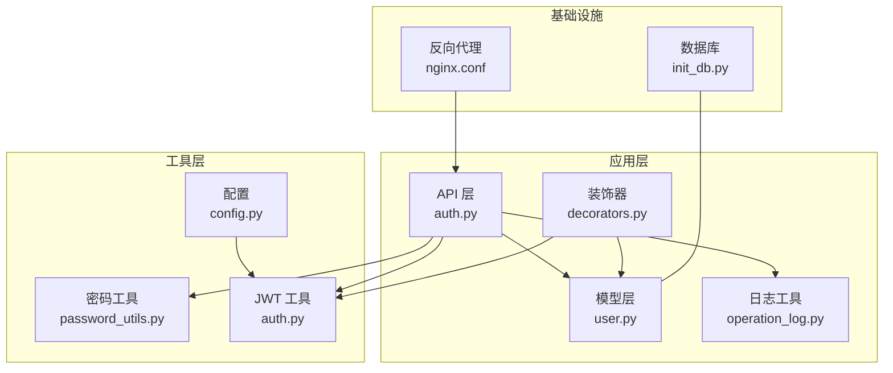
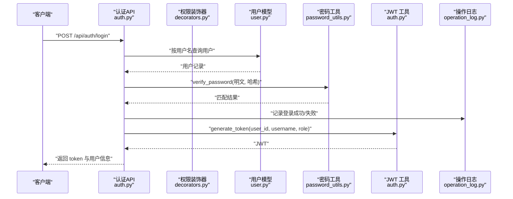
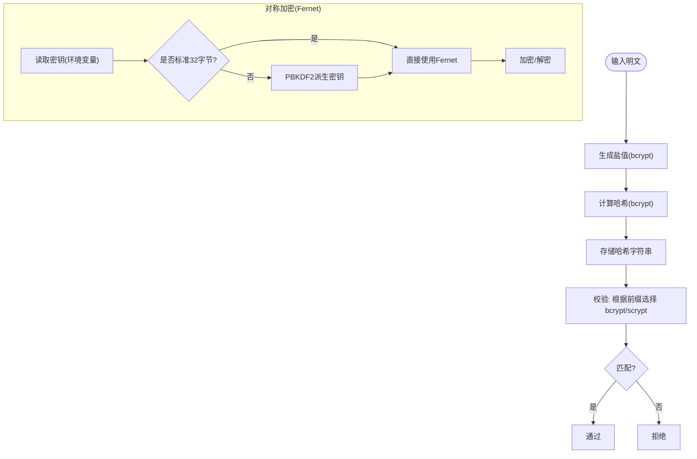
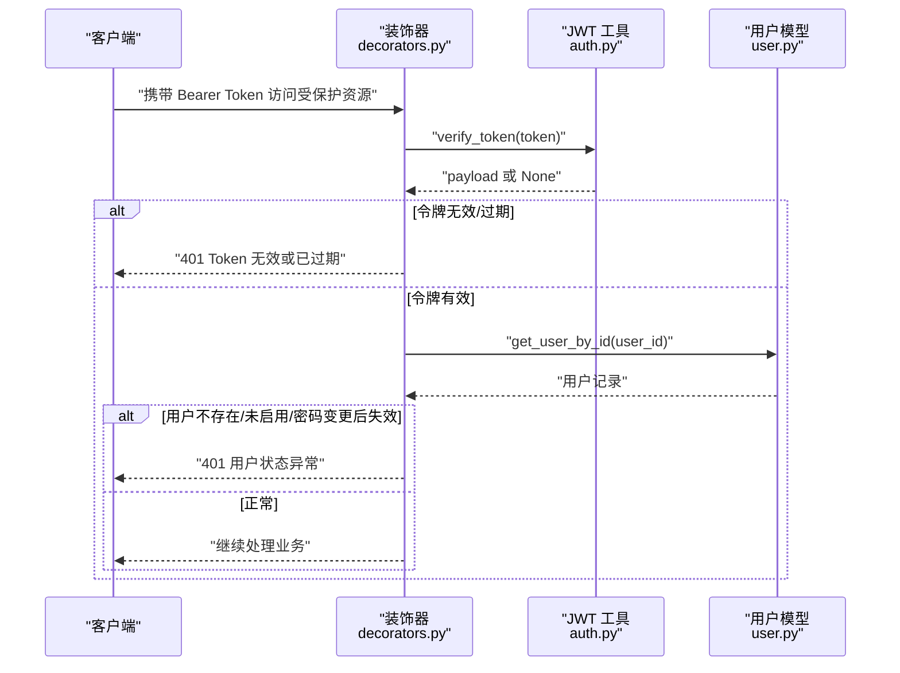
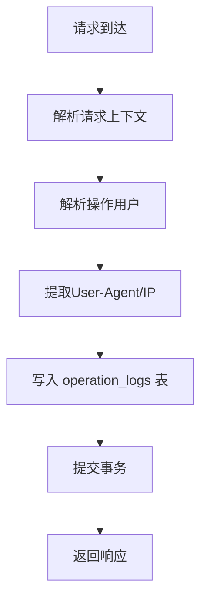
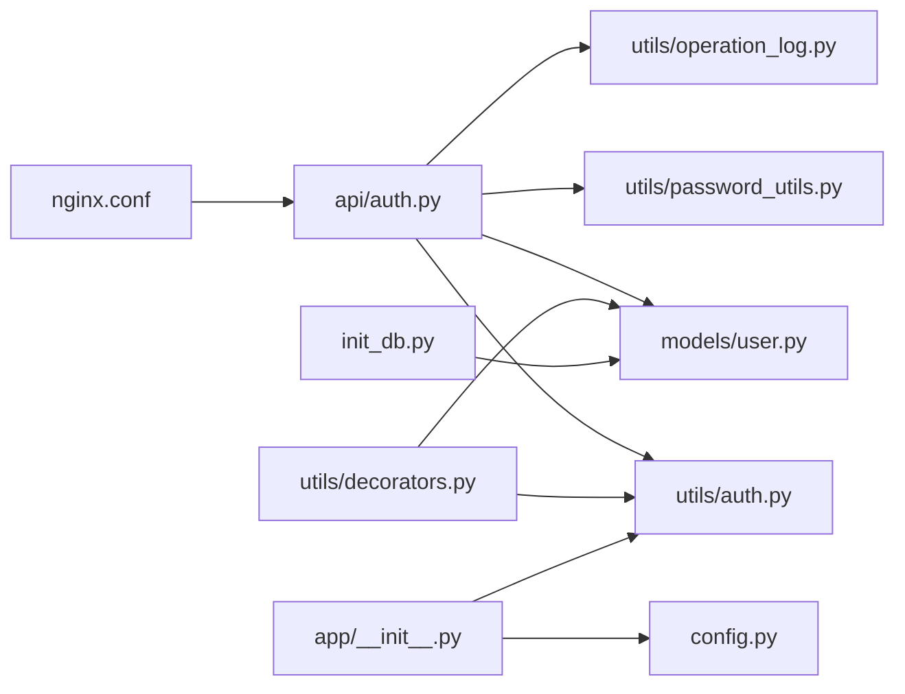

# 安全策略实施

<cite>
**本文引用的文件**   
- [backend/app/utils/password_utils.py](file://backend/app/utils/password_utils.py)
- [backend/app/utils/auth.py](file://backend/app/utils/auth.py)
- [backend/app/api/auth.py](file://backend/app/api/auth.py)
- [backend/app/models/user.py](file://backend/app/models/user.py)
- [backend/app/utils/operation_log.py](file://backend/app/utils/operation_log.py)
- [backend/app/utils/decorators.py](file://backend/app/utils/decorators.py)
- [backend/app/config.py](file://backend/app/config.py)
- [backend/app/__init__.py](file://backend/app/__init__.py)
- [backend/init_db.py](file://backend/init_db.py)
- [backend/app/utils/validators.py](file://backend/app/utils/validators.py)
- [nginx.conf](file://nginx.conf)
</cite>

## 目录
1. [引言](#引言)
2. [项目结构](#项目结构)
3. [核心组件](#核心组件)
4. [架构总览](#架构总览)
5. [详细组件分析](#详细组件分析)
6. [依赖分析](#依赖分析)
7. [性能考虑](#性能考虑)
8. [故障排查指南](#故障排查指南)
9. [结论](#结论)
10. [附录](#附录)

## 引言
本实施文档面向认证授权系统的安全策略落地，围绕密码加密策略（bcrypt）、会话与令牌管理（JWT）、安全防护（防暴力破解、防重放、防XSS）、操作日志与审计、安全配置与风险评估、最佳实践与应急响应等方面展开。文档基于仓库现有实现进行梳理与补充建议，帮助工程团队在开发与运维过程中统一安全基线，降低风险。

## 项目结构
后端采用 Flask 应用，按“蓝图/API 层、工具层、模型层、配置层”组织。认证相关的关键文件分布如下：
- 密码与对称加密：backend/app/utils/password_utils.py
- JWT 令牌生成与校验：backend/app/utils/auth.py
- 认证 API：backend/app/api/auth.py
- 用户模型与密码更新：backend/app/models/user.py
- 操作日志与审计：backend/app/utils/operation_log.py
- 权限与令牌校验装饰器：backend/app/utils/decorators.py
- 配置与 CORS/密钥：backend/app/config.py、backend/app/__init__.py
- 数据库初始化与表结构：backend/init_db.py
- 输入校验：backend/app/utils/validators.py
- 反向代理与头部透传：nginx.conf

图表来源
- [backend/app/api/auth.py:1-197](file://backend/app/api/auth.py#L1-L197)
- [backend/app/utils/auth.py:1-45](file://backend/app/utils/auth.py#L1-L45)
- [backend/app/utils/password_utils.py:1-130](file://backend/app/utils/password_utils.py#L1-L130)
- [backend/app/models/user.py:1-162](file://backend/app/models/user.py#L1-L162)
- [backend/app/utils/operation_log.py:1-172](file://backend/app/utils/operation_log.py#L1-L172)
- [backend/app/utils/decorators.py:1-163](file://backend/app/utils/decorators.py#L1-L163)
- [backend/app/config.py:1-58](file://backend/app/config.py#L1-L58)
- [backend/init_db.py:1-395](file://backend/init_db.py#L1-L395)
- [nginx.conf:43-69](file://nginx.conf#L43-L69)

章节来源
- [backend/app/api/auth.py:1-197](file://backend/app/api/auth.py#L1-L197)
- [backend/app/utils/auth.py:1-45](file://backend/app/utils/auth.py#L1-L45)
- [backend/app/utils/password_utils.py:1-130](file://backend/app/utils/password_utils.py#L1-L130)
- [backend/app/models/user.py:1-162](file://backend/app/models/user.py#L1-L162)
- [backend/app/utils/operation_log.py:1-172](file://backend/app/utils/operation_log.py#L1-L172)
- [backend/app/utils/decorators.py:1-163](file://backend/app/utils/decorators.py#L1-L163)
- [backend/app/config.py:1-58](file://backend/app/config.py#L1-L58)
- [backend/init_db.py:1-395](file://backend/init_db.py#L1-L395)
- [nginx.conf:43-69](file://nginx.conf#L43-L69)

## 核心组件
- 密码加密与校验：使用 bcrypt 生成盐值与哈希，兼容 Werkzeug scrypt 格式，确保不可逆与抗彩虹表。
- 对称加密：基于 Fernet（或 PBKDF2 派生密钥）对敏感数据（如服务器密码、AccessKey）进行可逆加密，密钥通过环境变量注入。
- JWT 令牌：HS256 签名，支持过期时间控制，结合密码变更时间戳实现“作废旧令牌”机制。
- 权限与会话：Bearer Token 校验装饰器，校验用户存在、启用状态、密码变更后令牌失效。
- 操作日志与审计：统一记录模块、动作、目标、IP、UA、时间等，支持登录/登出/失败等关键事件。
- 输入校验：对用户名、密码、域名、主机名、URL、端口、字符串长度等进行严格校验。
- 反向代理：Nginx 透传真实客户端 IP 与协议，便于日志与风控。

章节来源
- [backend/app/utils/password_utils.py:52-130](file://backend/app/utils/password_utils.py#L52-L130)
- [backend/app/utils/auth.py:9-45](file://backend/app/utils/auth.py#L9-L45)
- [backend/app/utils/decorators.py:26-163](file://backend/app/utils/decorators.py#L26-L163)
- [backend/app/utils/operation_log.py:49-172](file://backend/app/utils/operation_log.py#L49-L172)
- [backend/app/utils/validators.py:1-151](file://backend/app/utils/validators.py#L1-L151)
- [nginx.conf:43-69](file://nginx.conf#L43-L69)

## 架构总览
认证流程从 API 入口开始，经由装饰器校验 Token，调用模型层查询用户，使用密码工具校验哈希，成功后生成 JWT 并记录操作日志。

图表来源
- [backend/app/api/auth.py:15-95](file://backend/app/api/auth.py#L15-L95)
- [backend/app/utils/decorators.py:26-123](file://backend/app/utils/decorators.py#L26-L123)
- [backend/app/models/user.py:36-52](file://backend/app/models/user.py#L36-L52)
- [backend/app/utils/password_utils.py:64-91](file://backend/app/utils/password_utils.py#L64-L91)
- [backend/app/utils/auth.py:9-28](file://backend/app/utils/auth.py#L9-L28)
- [backend/app/utils/operation_log.py:121-131](file://backend/app/utils/operation_log.py#L121-L131)

## 详细组件分析

### 密码加密策略（bcrypt 与对称加密）
- bcrypt 使用
  - 生成随机盐值并计算哈希，返回可存储字符串；验证时根据前缀判断格式并调用对应校验函数。
  - 支持历史 scrypt 格式兼容，保证迁移平滑。
- 对称加密
  - 优先使用环境变量提供的 Fernet 密钥；若非标准 32 字节，则通过 PBKDF2 从任意字符串派生固定长度密钥。
  - 提供加密/解密接口，用于存储服务器密码、AccessKey 等敏感信息。
- 存储与合规
  - 用户表 password_hash 字段存储 bcrypt 哈希；敏感信息加密后入库。
  - 初始化脚本插入默认管理员账户时使用 bcrypt 哈希。

图表来源
- [backend/app/utils/password_utils.py:52-91](file://backend/app/utils/password_utils.py#L52-L91)
- [backend/app/utils/password_utils.py:18-49](file://backend/app/utils/password_utils.py#L18-L49)
- [backend/init_db.py:34-47](file://backend/init_db.py#L34-L47)

章节来源
- [backend/app/utils/password_utils.py:52-130](file://backend/app/utils/password_utils.py#L52-L130)
- [backend/init_db.py:259-264](file://backend/init_db.py#L259-L264)

### 会话与令牌管理（JWT）
- 令牌生成
  - 从配置读取过期小时数，默认 UTC 时间，HS256 签名；签名密钥来自环境变量。
  - 若未配置密钥，抛出运行时错误，避免生产环境缺省。
- 令牌校验
  - 装饰器解析 Authorization 头，校验 Bearer 格式；解码失败或过期返回 401。
  - 校验用户存在、启用状态；比较用户密码变更时间与令牌签发时间，若密码变更在签发之后则视为失效。
- 自动续期与强制登出
  - 当前实现未提供自动续期；可通过前端轮询刷新或引导重新登录。
  - 密码变更即刻使旧令牌失效，达到强制登出效果。

图表来源
- [backend/app/utils/decorators.py:26-123](file://backend/app/utils/decorators.py#L26-L123)
- [backend/app/utils/auth.py:31-45](file://backend/app/utils/auth.py#L31-L45)
- [backend/app/models/user.py:55-71](file://backend/app/models/user.py#L55-L71)

章节来源
- [backend/app/utils/auth.py:9-45](file://backend/app/utils/auth.py#L9-L45)
- [backend/app/utils/decorators.py:26-123](file://backend/app/utils/decorators.py#L26-L123)
- [backend/app/__init__.py:41-45](file://backend/app/__init__.py#L41-L45)

### 安全防护措施
- 防暴力破解
  - 登录失败与成功均记录操作日志，便于后续接入限流/封禁策略（例如基于 IP/用户名维度的速率限制）。
- 防重放攻击
  - JWT 包含 iat（签发时间），装饰器将其转换为无时区时间并与用户密码变更时间比较，若密码在签发后变更则拒绝，降低令牌复用风险。
- 防 XSS 攻击
  - 前端渲染与数据展示不在后端进行，后端仅返回 JSON；建议在前端侧对输出进行转义与 CSP 策略配置。
  - 后端响应已关闭 Unicode 转义，避免潜在字符编码混淆问题。
- 输入校验
  - 统一的校验器对用户名、密码、域名、主机名、URL、端口、字符串长度等进行严格约束，减少注入与异常输入风险。

章节来源
- [backend/app/utils/operation_log.py:121-131](file://backend/app/utils/operation_log.py#L121-L131)
- [backend/app/utils/decorators.py:98-113](file://backend/app/utils/decorators.py#L98-L113)
- [backend/app/utils/validators.py:88-151](file://backend/app/utils/validators.py#L88-L151)
- [backend/app/config.py:29-30](file://backend/app/config.py#L29-L30)

### 操作日志与审计
- 日志字段
  - 操作用户（user_id/username）、模块、动作、目标（id/name）、详情（JSON）、客户端 IP（透传 X-Forwarded-For/X-Real-IP）、User-Agent、UTC 时间。
- 关键事件
  - 登录成功/失败、登出、用户增删改、证书/域名/服务等关键操作均有模块化记录。
- 存储与索引
  - operation_logs 表具备多维索引，便于审计检索。

图表来源
- [backend/app/utils/operation_log.py:49-119](file://backend/app/utils/operation_log.py#L49-L119)
- [backend/init_db.py:238-257](file://backend/init_db.py#L238-L257)

章节来源
- [backend/app/utils/operation_log.py:1-172](file://backend/app/utils/operation_log.py#L1-L172)
- [backend/init_db.py:238-257](file://backend/init_db.py#L238-L257)

### 安全配置指南
- 必填环境变量
  - JWT_SECRET_KEY：生产环境必须设置，开发模式可回退至 SECRET_KEY。
  - JWT_EXPIRATION_HOURS：令牌有效期（小时）。
  - DATA_ENCRYPTION_KEY：对称加密密钥（Fernet 标准 32 字节或可派生字符串）。
- CORS 配置
  - CORS_ORIGINS/CORS_ALLOW_ALL 控制跨域与凭据支持，生产环境避免使用通配符。
- 反向代理
  - Nginx 透传 X-Real-IP、X-Forwarded-For、X-Forwarded-Proto，确保日志与风控准确识别真实来源。

章节来源
- [backend/app/__init__.py:41-79](file://backend/app/__init__.py#L41-L79)
- [backend/app/config.py:10-58](file://backend/app/config.py#L10-L58)
- [nginx.conf:43-69](file://nginx.conf#L43-L69)

## 依赖分析
- 组件耦合
  - API 层依赖密码工具、JWT 工具、模型层与日志工具；装饰器依赖 JWT 工具与模型层。
  - 配置通过 Flask 应用注入，JWT 密钥与 CORS 等在应用初始化阶段生效。
- 外部依赖
  - bcrypt、cryptography.Fernet、PyMySQL、Flask、PyJWT 等。
- 循环依赖
  - 未见循环导入；各模块职责清晰。

图表来源
- [backend/app/api/auth.py:1-12](file://backend/app/api/auth.py#L1-L12)
- [backend/app/utils/password_utils.py:1-12](file://backend/app/utils/password_utils.py#L1-L12)
- [backend/app/utils/auth.py:1-7](file://backend/app/utils/auth.py#L1-L7)
- [backend/app/models/user.py:1-6](file://backend/app/models/user.py#L1-L6)
- [backend/app/utils/operation_log.py:1-8](file://backend/app/utils/operation_log.py#L1-L8)
- [backend/app/utils/decorators.py:1-7](file://backend/app/utils/decorators.py#L1-L7)
- [backend/app/__init__.py:41-79](file://backend/app/__init__.py#L41-L79)
- [backend/app/config.py:1-58](file://backend/app/config.py#L1-L58)
- [nginx.conf:43-69](file://nginx.conf#L43-L69)
- [backend/init_db.py:1-395](file://backend/init_db.py#L1-L395)

章节来源
- [backend/app/api/auth.py:1-12](file://backend/app/api/auth.py#L1-L12)
- [backend/app/utils/decorators.py:1-7](file://backend/app/utils/decorators.py#L1-L7)
- [backend/app/__init__.py:41-79](file://backend/app/__init__.py#L41-L79)

## 性能考虑
- 密码哈希成本
  - bcrypt 默认成本适中，建议在高并发场景下结合缓存与异步处理优化登录峰值。
- JWT 校验
  - HS256 为对称签名，解码开销低；装饰器每次请求都会校验用户状态与密码变更时间，建议在上游增加速率限制与缓存。
- 日志写入
  - 每次操作均写入数据库，建议在高吞吐场景引入异步日志或批量写入策略。

## 故障排查指南
- 令牌相关
  - 缺少或错误的 Authorization 头：确认 Bearer 格式；检查前端是否正确携带。
  - Token 无效或过期：检查 JWT_SECRET_KEY 是否配置；核对系统时间与时区。
  - 密码变更后 Token 失效：属预期行为，需引导用户重新登录。
- 登录失败
  - 用户不存在/未启用：检查用户状态与激活标志。
  - 密码错误：确认 bcrypt/scrypt 格式兼容性与哈希存储正确性。
- 日志缺失
  - 检查 operation_logs 表是否存在、索引是否合理；确认请求头中 X-Real-IP/X-Forwarded-For 是否透传。
- CORS 与跨域
  - 校验 CORS_ORIGINS/CORS_ALLOW_ALL 配置；避免通配符与凭据同时使用。

章节来源
- [backend/app/utils/decorators.py:35-70](file://backend/app/utils/decorators.py#L35-L70)
- [backend/app/utils/auth.py:35-44](file://backend/app/utils/auth.py#L35-L44)
- [backend/app/utils/operation_log.py:13-20](file://backend/app/utils/operation_log.py#L13-L20)
- [backend/app/config.py:33-38](file://backend/app/config.py#L33-L38)

## 结论
本系统在密码存储、令牌签发与校验、操作审计方面具备良好基础。建议在现有基础上完善：
- 引入登录失败速率限制与账户锁定策略；
- 增加 Token 黑名单与主动注销能力；
- 强化前端 XSS 防护与 CSP；
- 对日志写入进行异步化与容量治理；
- 定期轮换 JWT 与数据加密密钥，建立密钥生命周期管理。

## 附录

### 安全最佳实践清单
- 密码与密钥
  - 使用 bcrypt 存储密码；对称密钥使用环境变量注入；定期轮换。
- 传输与存储
  - 强制 HTTPS；TLS 版本与套件符合安全基线；敏感字段加密存储。
- 访问控制
  - 最小权限原则；角色权限装饰器配合使用；定期审计权限分配。
- 日志与监控
  - 审计日志完整、可追溯；异常告警与入侵检测联动。
- 配置与发布
  - 生产环境禁止默认配置；CI/CD 中密钥与配置分离；镜像最小化与只读根文件系统。

### 风险评估方法
- 身份冒用
  - 评估令牌泄露影响面；建议引入短期令牌与二次验证。
- 数据泄露
  - 评估敏感字段暴露范围；对所有外部接口进行数据脱敏。
- 拒绝服务
  - 评估登录/写入接口的限流阈值；准备熔断与降级策略。
- 内部威胁
  - 严格的角色分离与最小权限；操作日志全程留痕。

### 应急响应方案
- 密钥泄漏
  - 立即轮换密钥；撤销旧令牌；通知受影响用户重新登录。
- 账户被滥用
  - 冻结账户；检查登录日志；恢复与加固后解冻。
- 系统异常
  - 快速回滚；隔离问题模块；恢复日志与备份。