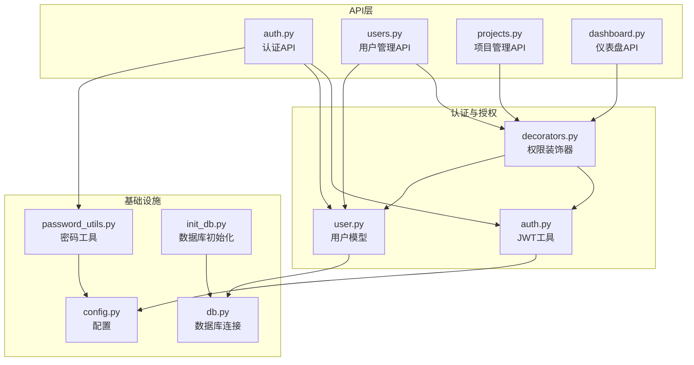
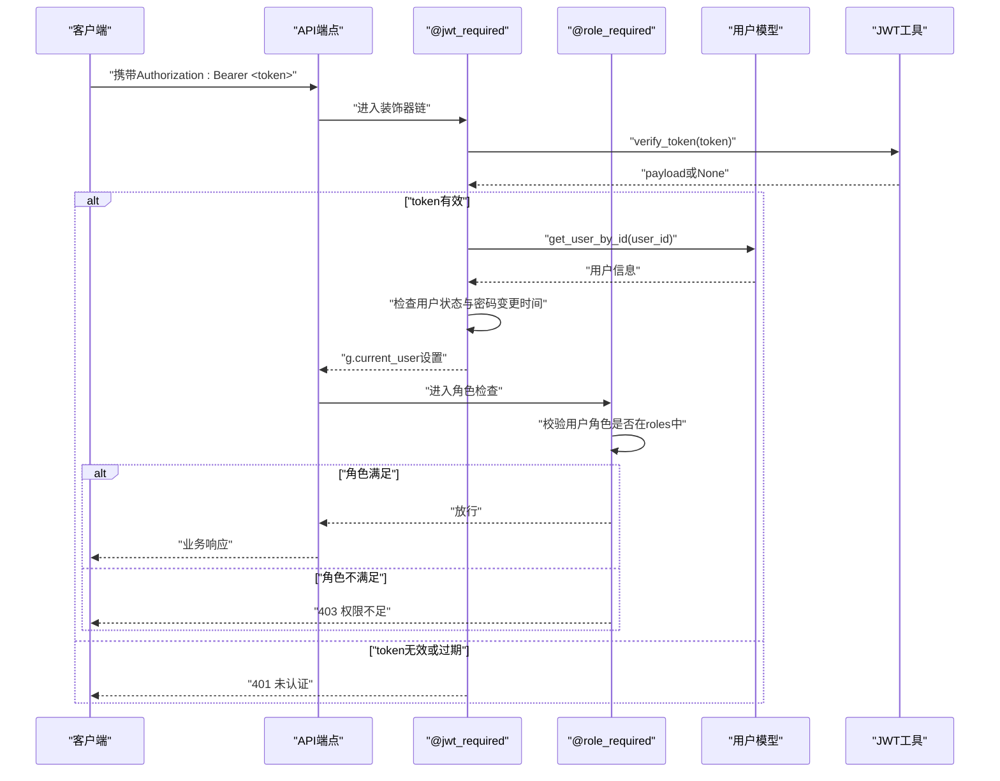
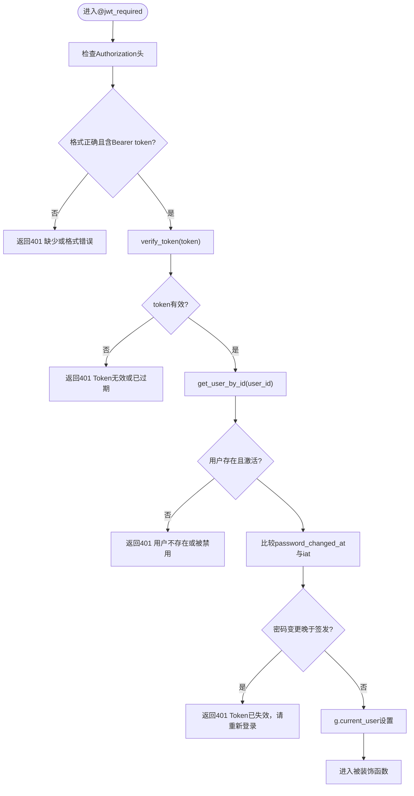
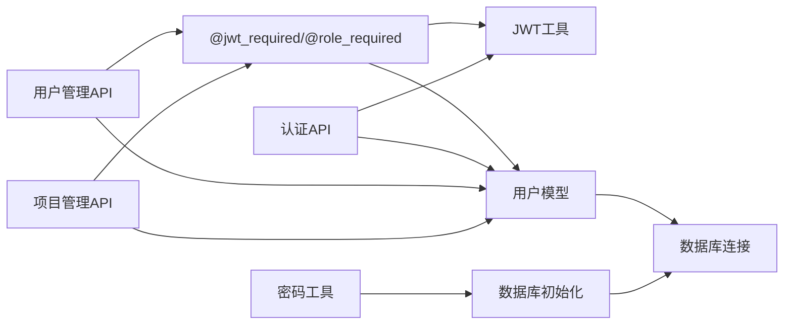

# 权限控制设计

<cite>
**本文档引用的文件**
- [backend/app/utils/auth.py](file://backend/app/utils/auth.py)
- [backend/app/utils/decorators.py](file://backend/app/utils/decorators.py)
- [backend/app/models/user.py](file://backend/app/models/user.py)
- [backend/app/api/auth.py](file://backend/app/api/auth.py)
- [backend/app/api/users.py](file://backend/app/api/users.py)
- [backend/app/api/projects.py](file://backend/app/api/projects.py)
- [backend/app/api/dashboard.py](file://backend/app/api/dashboard.py)
- [backend/app/utils/password_utils.py](file://backend/app/utils/password_utils.py)
- [backend/app/utils/db.py](file://backend/app/utils/db.py)
- [backend/app/config.py](file://backend/app/config.py)
- [backend/init_db.py](file://backend/init_db.py)
</cite>

## 目录
1. [简介](#简介)
2. [项目结构](#项目结构)
3. [核心组件](#核心组件)
4. [架构总览](#架构总览)
5. [详细组件分析](#详细组件分析)
6. [依赖关系分析](#依赖关系分析)
7. [性能考量](#性能考量)
8. [故障排除指南](#故障排除指南)
9. [结论](#结论)

## 简介
本设计文档围绕基于角色的访问控制（RBAC）模型，系统性阐述权限控制体系的实现与使用。文档涵盖用户角色定义、权限级别划分、访问控制策略、装饰器@jwt_required与@role_required的实现原理与使用方法、权限验证流程（身份验证、角色权限检查、资源访问控制）、不同角色的权限范围与访问限制，并提供代码示例路径与最佳实践，以及安全考虑与故障排除指南。

## 项目结构
权限控制相关的核心代码分布在以下模块：
- 认证与授权：JWT工具、权限装饰器、用户模型
- API层：认证API、用户管理API、项目管理API、仪表盘API
- 数据库与配置：数据库连接、配置项、数据库初始化脚本

图表来源
- [backend/app/utils/auth.py:1-45](file://backend/app/utils/auth.py#L1-L45)
- [backend/app/utils/decorators.py:1-163](file://backend/app/utils/decorators.py#L1-L163)
- [backend/app/models/user.py:1-162](file://backend/app/models/user.py#L1-L162)
- [backend/app/api/auth.py:1-197](file://backend/app/api/auth.py#L1-L197)
- [backend/app/api/users.py:1-290](file://backend/app/api/users.py#L1-L290)
- [backend/app/api/projects.py:1-521](file://backend/app/api/projects.py#L1-L521)
- [backend/app/api/dashboard.py:1-129](file://backend/app/api/dashboard.py#L1-L129)
- [backend/app/utils/password_utils.py:1-130](file://backend/app/utils/password_utils.py#L1-L130)
- [backend/app/utils/db.py:1-80](file://backend/app/utils/db.py#L1-L80)
- [backend/app/config.py:1-58](file://backend/app/config.py#L1-L58)
- [backend/init_db.py:1-395](file://backend/init_db.py#L1-L395)

章节来源
- [backend/app/utils/auth.py:1-45](file://backend/app/utils/auth.py#L1-L45)
- [backend/app/utils/decorators.py:1-163](file://backend/app/utils/decorators.py#L1-L163)
- [backend/app/models/user.py:1-162](file://backend/app/models/user.py#L1-L162)
- [backend/app/api/auth.py:1-197](file://backend/app/api/auth.py#L1-L197)
- [backend/app/api/users.py:1-290](file://backend/app/api/users.py#L1-L290)
- [backend/app/api/projects.py:1-521](file://backend/app/api/projects.py#L1-L521)
- [backend/app/api/dashboard.py:1-129](file://backend/app/api/dashboard.py#L1-L129)
- [backend/app/utils/password_utils.py:1-130](file://backend/app/utils/password_utils.py#L1-L130)
- [backend/app/utils/db.py:1-80](file://backend/app/utils/db.py#L1-L80)
- [backend/app/config.py:1-58](file://backend/app/config.py#L1-L58)
- [backend/init_db.py:1-395](file://backend/init_db.py#L1-L395)

## 核心组件
- JWT认证工具：负责生成与验证JWT令牌，包含过期时间与签名算法配置。
- 权限装饰器：提供@jwt_required与@role_required，分别负责身份认证与角色权限检查。
- 用户模型：封装用户相关的数据库操作，包括创建、查询、更新、删除与密码更新。
- API层：认证API、用户管理API、项目管理API、仪表盘API均集成权限装饰器。
- 配置与数据库：通过配置文件管理JWT密钥、过期时间等，数据库初始化脚本定义用户表结构与索引。

章节来源
- [backend/app/utils/auth.py:9-28](file://backend/app/utils/auth.py#L9-L28)
- [backend/app/utils/decorators.py:26-123](file://backend/app/utils/decorators.py#L26-L123)
- [backend/app/models/user.py:8-33](file://backend/app/models/user.py#L8-L33)
- [backend/app/api/auth.py:15-95](file://backend/app/api/auth.py#L15-L95)
- [backend/app/api/users.py:19-32](file://backend/app/api/users.py#L19-L32)
- [backend/app/api/projects.py:13-148](file://backend/app/api/projects.py#L13-L148)
- [backend/app/api/dashboard.py:22-129](file://backend/app/api/dashboard.py#L22-L129)
- [backend/app/config.py:10-14](file://backend/app/config.py#L10-L14)
- [backend/init_db.py:34-48](file://backend/init_db.py#L34-L48)

## 架构总览
RBAC模型通过“用户-角色-权限”三层关系实现访问控制。JWT作为认证载体，装饰器负责在进入业务逻辑前完成身份与权限校验，数据库存储用户与角色信息，API层统一接入权限控制。

图表来源
- [backend/app/utils/decorators.py:26-123](file://backend/app/utils/decorators.py#L26-L123)
- [backend/app/utils/auth.py:31-45](file://backend/app/utils/auth.py#L31-L45)
- [backend/app/models/user.py:55-71](file://backend/app/models/user.py#L55-L71)

## 详细组件分析

### JWT认证工具（auth.py）
- 功能要点
  - 生成JWT：包含用户ID、用户名、角色、签发时间与过期时间，使用配置的密钥与HS256算法。
  - 验证JWT：解码并校验签名，捕获过期与无效令牌异常，返回payload或None。
- 关键配置
  - JWT_SECRET_KEY：JWT签名密钥，必须通过环境变量配置。
  - JWT_EXPIRATION_HOURS：令牌过期小时数，默认2小时。
- 安全注意
  - 密钥必须保密，生产环境严禁硬编码。
  - 过期时间需结合业务场景权衡，避免频繁登录影响体验。

章节来源
- [backend/app/utils/auth.py:9-28](file://backend/app/utils/auth.py#L9-L28)
- [backend/app/utils/auth.py:31-45](file://backend/app/utils/auth.py#L31-L45)
- [backend/app/config.py:12-14](file://backend/app/config.py#L12-L14)

### 权限装饰器（decorators.py）
- @jwt_required
  - 校验Authorization头格式与Bearer令牌。
  - 使用verify_token验证令牌有效性。
  - 通过用户ID查询用户，检查用户是否存在、是否激活。
  - 比较令牌签发时间与用户密码变更时间，防止密码修改导致的令牌作废。
  - 将用户信息注入g对象，供后续中间件与业务逻辑使用。
- @role_required(roles)
  - 依赖@jwt_required先执行，检查g.current_user中的角色是否在roles列表中。
  - 不满足时返回403与明确提示。
- 时间与一致性
  - _issued_at_naive将iat转换为naive UTC时间，便于与MySQL DATETIME比较。
  - 通过password_changed_at与iat对比，确保密码修改后旧令牌立即失效。

图表来源
- [backend/app/utils/decorators.py:26-123](file://backend/app/utils/decorators.py#L26-L123)

章节来源
- [backend/app/utils/decorators.py:26-123](file://backend/app/utils/decorators.py#L26-L123)
- [backend/app/utils/decorators.py:126-163](file://backend/app/utils/decorators.py#L126-L163)

### 用户模型（user.py）
- 用户操作
  - create_user：创建用户，生成密码哈希，写入数据库。
  - get_user_by_username/get_user_by_id：查询用户信息。
  - get_all_users：获取所有用户列表。
  - update_user：更新用户字段（display_name、role、is_active）。
  - delete_user：删除用户。
  - update_password：更新密码并记录password_changed_at，触发令牌作废。
- 角色字段
  - role默认为operator，支持admin、operator、viewer三种角色。

章节来源
- [backend/app/models/user.py:8-33](file://backend/app/models/user.py#L8-L33)
- [backend/app/models/user.py:55-71](file://backend/app/models/user.py#L55-L71)
- [backend/app/models/user.py:93-121](file://backend/app/models/user.py#L93-L121)
- [backend/app/models/user.py:123-141](file://backend/app/models/user.py#L123-L141)
- [backend/app/models/user.py:143-162](file://backend/app/models/user.py#L143-L162)

### 认证API（auth.py）
- 登录流程
  - 校验请求体与必填字段。
  - 查询用户并检查是否激活。
  - 验证密码，记录登录日志。
  - 生成JWT并返回用户信息。
- 个人资料与密码修改
  - 通过@jwt_required保护，读取g.current_user中的用户ID。
  - 密码修改前验证旧密码，更新后触发令牌作废。

章节来源
- [backend/app/api/auth.py:15-95](file://backend/app/api/auth.py#L15-L95)
- [backend/app/api/auth.py:98-128](file://backend/app/api/auth.py#L98-L128)
- [backend/app/api/auth.py:131-197](file://backend/app/api/auth.py#L131-L197)

### 用户管理API（users.py）
- 权限策略
  - 所有接口均要求admin角色，通过@role_required(['admin'])实现。
- 功能范围
  - 获取用户列表、创建用户、更新用户信息、删除用户、重置密码。
  - 创建与更新时对用户名格式、角色合法性、密码长度进行校验。
  - 删除用户时禁止删除当前登录用户。

章节来源
- [backend/app/api/users.py:19-32](file://backend/app/api/users.py#L19-L32)
- [backend/app/api/users.py:35-110](file://backend/app/api/users.py#L35-L110)
- [backend/app/api/users.py:112-180](file://backend/app/api/users.py#L112-L180)
- [backend/app/api/users.py:182-227](file://backend/app/api/users.py#L182-L227)
- [backend/app/api/users.py:229-290](file://backend/app/api/users.py#L229-L290)

### 项目管理API（projects.py）
- 权限策略
  - 创建、更新、删除项目及关联服务器等操作要求admin或operator角色。
- 功能范围
  - 项目列表查询、详情聚合、创建、更新、删除、关联/取消关联服务器。
  - 支持分页、搜索、状态过滤等查询参数。
  - 涉及敏感字段解密（如账号密码）。

章节来源
- [backend/app/api/projects.py:13-86](file://backend/app/api/projects.py#L13-L86)
- [backend/app/api/projects.py:89-150](file://backend/app/api/projects.py#L89-L150)
- [backend/app/api/projects.py:153-258](file://backend/app/api/projects.py#L153-L258)
- [backend/app/api/projects.py:261-382](file://backend/app/api/projects.py#L261-L382)
- [backend/app/api/projects.py:385-521](file://backend/app/api/projects.py#L385-L521)

### 仪表盘API（dashboard.py）
- 权限策略
  - 仅需@jwt_required，无需角色限制，适合所有已认证用户查看统计信息。
- 功能范围
  - 统计各实体数量、环境分布、服务分类分布、账号分布、项目分布、近期到期证书等。

章节来源
- [backend/app/api/dashboard.py:22-129](file://backend/app/api/dashboard.py#L22-L129)

### 密码工具（password_utils.py）
- 功能要点
  - hash_password：使用bcrypt生成密码哈希。
  - verify_password：兼容bcrypt与Werkzeug scrypt格式。
  - encrypt_data/decrypt_data：使用Fernet对称加密存储敏感信息（如服务器密码、阿里云AccessKey）。
- 安全注意
  - DATA_ENCRYPTION_KEY必须通过环境变量配置，生产环境不得使用开发回退密钥。

章节来源
- [backend/app/utils/password_utils.py:52-91](file://backend/app/utils/password_utils.py#L52-L91)
- [backend/app/utils/password_utils.py:93-130](file://backend/app/utils/password_utils.py#L93-L130)
- [backend/app/config.py:12-14](file://backend/app/config.py#L12-L14)

### 数据库连接（db.py）
- 功能要点
  - get_db：使用Flask g对象缓存数据库连接，避免重复连接。
  - close_db：在请求结束时关闭连接。
  - 日志打印数据库连接参数（密码脱敏），便于核对配置。
- 性能与稳定性
  - 连接超时设置为10秒，异常时记录详细日志并抛出。

章节来源
- [backend/app/utils/db.py:43-80](file://backend/app/utils/db.py#L43-L80)

### 配置（config.py）
- 关键配置项
  - JWT_SECRET_KEY：JWT签名密钥。
  - JWT_EXPIRATION_HOURS：令牌过期小时数。
  - DB_HOST/PORT/USER/PASSWORD/NAME：数据库连接参数。
  - CORS_ORIGINS/CORS_ALLOW_ALL：跨域配置。
- 环境变量优先：生产环境必须通过环境变量设置，避免硬编码。

章节来源
- [backend/app/config.py:10-58](file://backend/app/config.py#L10-L58)

### 数据库初始化（init_db.py）
- 用户表结构
  - 包含username、password_hash、display_name、role、is_active、password_changed_at等字段。
  - role默认为operator，支持admin、operator、viewer。
  - 为username与role建立索引，提升查询效率。
- 默认管理员
  - 初始化时插入默认管理员账户admin/admin123，便于首次部署。

章节来源
- [backend/init_db.py:34-48](file://backend/init_db.py#L34-L48)
- [backend/init_db.py:259-265](file://backend/init_db.py#L259-L265)

## 依赖关系分析
- 装饰器依赖
  - @jwt_required依赖verify_token与用户模型的get_user_by_id。
  - @role_required依赖@jwt_required设置的g.current_user。
- API依赖
  - 认证API依赖JWT工具与用户模型。
  - 用户管理与项目管理API依赖装饰器与用户模型。
- 数据库依赖
  - 用户模型依赖数据库连接工具。
  - 数据库初始化脚本依赖密码工具与配置。

图表来源
- [backend/app/utils/decorators.py:26-163](file://backend/app/utils/decorators.py#L26-L163)
- [backend/app/utils/auth.py:9-28](file://backend/app/utils/auth.py#L9-L28)
- [backend/app/models/user.py:8-33](file://backend/app/models/user.py#L8-L33)
- [backend/app/api/auth.py:15-95](file://backend/app/api/auth.py#L15-L95)
- [backend/app/api/users.py:19-32](file://backend/app/api/users.py#L19-L32)
- [backend/app/api/projects.py:13-148](file://backend/app/api/projects.py#L13-L148)
- [backend/app/utils/db.py:43-80](file://backend/app/utils/db.py#L43-L80)
- [backend/init_db.py:34-48](file://backend/init_db.py#L34-L48)
- [backend/app/utils/password_utils.py:52-91](file://backend/app/utils/password_utils.py#L52-L91)

## 性能考量
- JWT令牌缓存：装饰器在进入业务逻辑前完成认证与权限检查，避免重复校验。
- 数据库连接复用：通过Flask g对象缓存连接，减少连接开销。
- 索引优化：用户表对username与role建立索引，提升查询效率。
- 密码哈希成本：bcrypt默认成本较高，建议在高并发场景下评估CPU占用与响应时间。

## 故障排除指南
- 401 未认证
  - 检查Authorization头格式是否为Bearer token。
  - 确认JWT_SECRET_KEY已正确配置。
  - 核对令牌是否过期。
- 401 用户不存在或被禁用
  - 确认用户ID对应用户是否存在且is_active为真。
- 401 Token已失效，请重新登录
  - 用户密码修改后会更新password_changed_at，旧令牌将被作废。
- 403 权限不足
  - 确认当前用户角色是否在@role_required指定的角色列表中。
- 数据库连接失败
  - 检查DB_HOST/PORT/USER/PASSWORD/NAME配置，确认网络可达。
  - 查看日志中脱敏后的连接参数，核对配置是否生效。

章节来源
- [backend/app/utils/decorators.py:35-113](file://backend/app/utils/decorators.py#L35-L113)
- [backend/app/utils/decorators.py:134-158](file://backend/app/utils/decorators.py#L134-L158)
- [backend/app/utils/db.py:48-69](file://backend/app/utils/db.py#L48-L69)

## 结论
本权限控制系统采用RBAC模型，结合JWT认证与装饰器链实现细粒度的访问控制。通过@jwt_required与@role_required的组合，实现了“身份认证+角色权限”的双重保障。用户模型与API层严格分离职责，数据库初始化脚本明确了角色与表结构。建议在生产环境中强化密钥管理、合理设置令牌过期时间、持续监控日志与性能指标，以确保系统的安全性与稳定性。