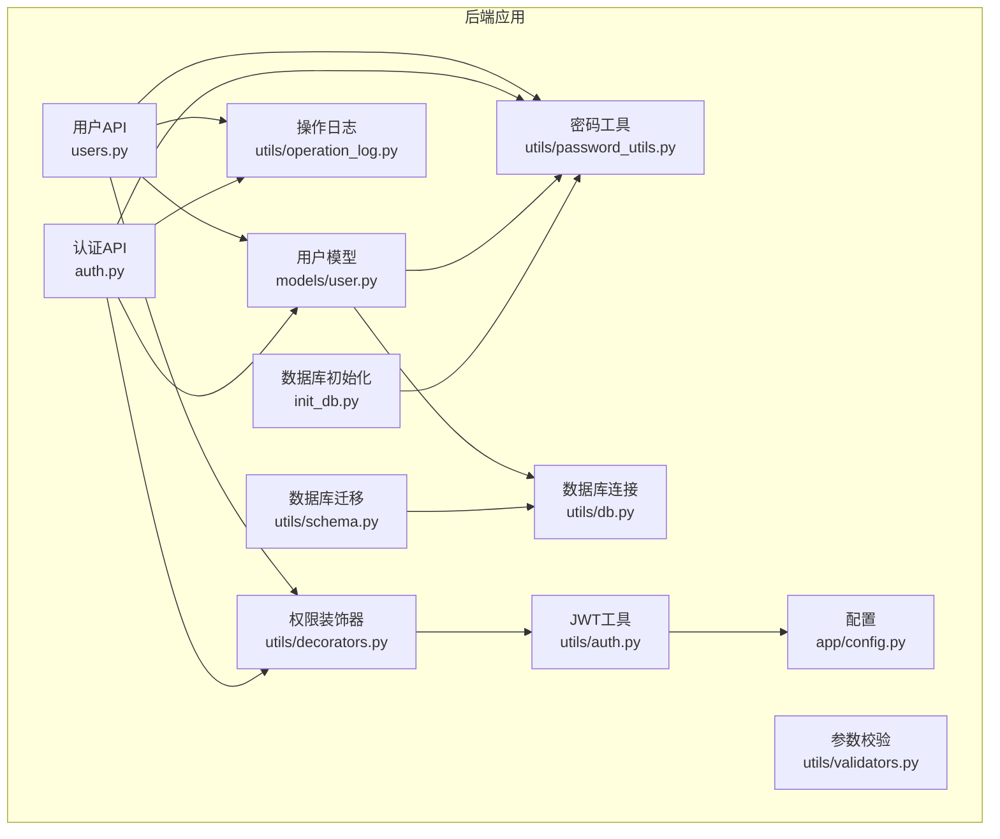
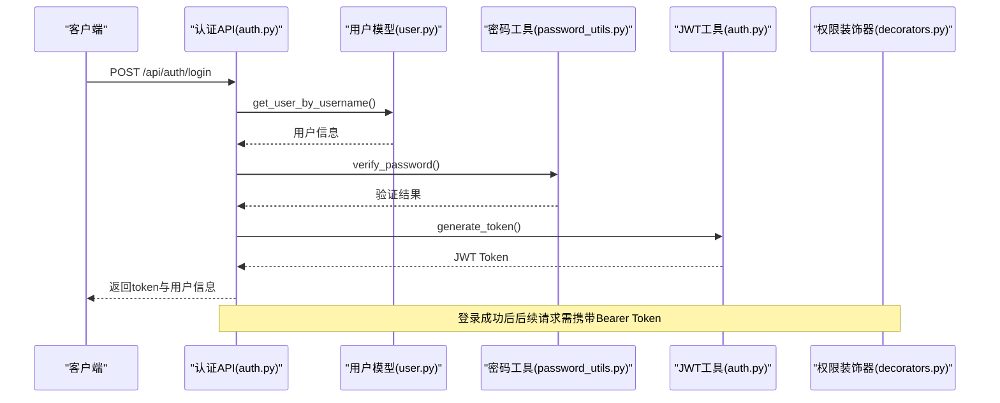
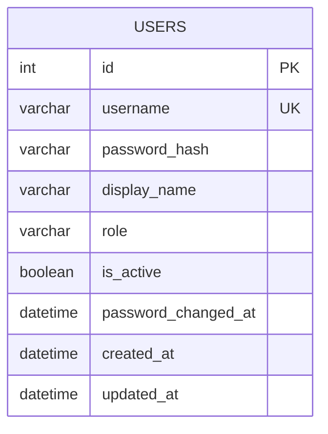
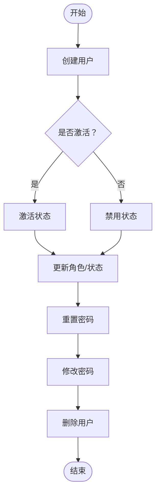
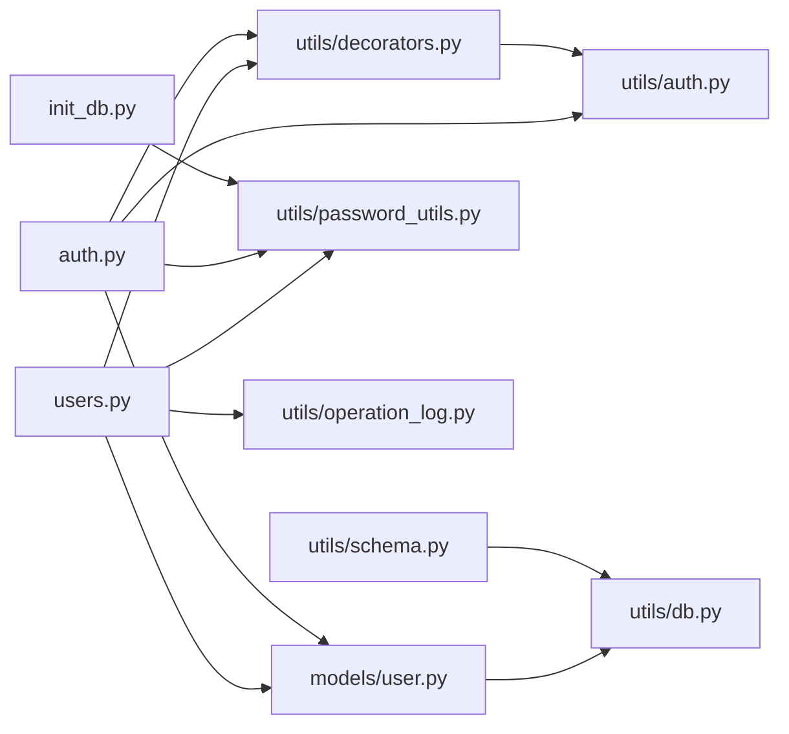

# 用户角色管理

<cite>
**本文档引用的文件**
- [backend/app/models/user.py](file://backend/app/models/user.py)
- [backend/app/api/users.py](file://backend/app/api/users.py)
- [backend/app/api/auth.py](file://backend/app/api/auth.py)
- [backend/app/utils/auth.py](file://backend/app/utils/auth.py)
- [backend/app/utils/password_utils.py](file://backend/app/utils/password_utils.py)
- [backend/app/utils/decorators.py](file://backend/app/utils/decorators.py)
- [backend/app/utils/db.py](file://backend/app/utils/db.py)
- [backend/app/utils/validators.py](file://backend/app/utils/validators.py)
- [backend/app/utils/operation_log.py](file://backend/app/utils/operation_log.py)
- [backend/app/config.py](file://backend/app/config.py)
- [backend/init_db.py](file://backend/init_db.py)
- [backend/app/utils/schema.py](file://backend/app/utils/schema.py)
- [backend/run.py](file://backend/run.py)
</cite>

## 目录
1. [简介](#简介)
2. [项目结构](#项目结构)
3. [核心组件](#核心组件)
4. [架构总览](#架构总览)
5. [详细组件分析](#详细组件分析)
6. [依赖关系分析](#依赖关系分析)
7. [性能考虑](#性能考虑)
8. [故障排查指南](#故障排查指南)
9. [结论](#结论)
10. [附录](#附录)

## 简介
本文件面向用户角色管理系统，围绕用户模型设计、角色定义与权限范围、用户生命周期管理、安全存储与隐私保护、API 接口说明与使用示例、数据模型与权限映射关系以及管理最佳实践进行系统化梳理。系统采用 Flask 微服务框架，基于 MySQL 数据库存储用户信息，使用 JWT 进行认证与授权，结合 bcrypt 进行密码哈希，使用 Fernet 对敏感信息进行对称加密存储。

## 项目结构
系统采用按功能模块划分的目录结构：
- backend/app/api：对外暴露的 REST API，包含用户管理与认证相关接口
- backend/app/models：用户相关数据库操作封装
- backend/app/utils：通用工具模块，包括认证、密码处理、数据库连接、装饰器、参数校验、操作日志、配置等
- backend/init_db.py：数据库初始化脚本，负责创建用户表及索引、默认管理员账户等
- backend/app/utils/schema.py：轻量级数据库迁移脚本，确保新增列存在（如 password_changed_at）

图表来源
- [backend/app/api/users.py:1-290](file://backend/app/api/users.py#L1-L290)
- [backend/app/api/auth.py:1-197](file://backend/app/api/auth.py#L1-L197)
- [backend/app/models/user.py:1-162](file://backend/app/models/user.py#L1-L162)
- [backend/app/utils/auth.py:1-45](file://backend/app/utils/auth.py#L1-L45)
- [backend/app/utils/password_utils.py:1-130](file://backend/app/utils/password_utils.py#L1-L130)
- [backend/app/utils/decorators.py:1-163](file://backend/app/utils/decorators.py#L1-L163)
- [backend/app/utils/db.py:1-80](file://backend/app/utils/db.py#L1-L80)
- [backend/app/utils/validators.py:1-151](file://backend/app/utils/validators.py#L1-L151)
- [backend/app/utils/operation_log.py:1-172](file://backend/app/utils/operation_log.py#L1-L172)
- [backend/app/config.py:1-58](file://backend/app/config.py#L1-L58)
- [backend/init_db.py:1-395](file://backend/init_db.py#L1-L395)
- [backend/app/utils/schema.py:1-41](file://backend/app/utils/schema.py#L1-L41)

章节来源
- [backend/app/api/users.py:1-290](file://backend/app/api/users.py#L1-L290)
- [backend/app/api/auth.py:1-197](file://backend/app/api/auth.py#L1-L197)
- [backend/app/models/user.py:1-162](file://backend/app/models/user.py#L1-L162)
- [backend/app/utils/auth.py:1-45](file://backend/app/utils/auth.py#L1-L45)
- [backend/app/utils/password_utils.py:1-130](file://backend/app/utils/password_utils.py#L1-L130)
- [backend/app/utils/decorators.py:1-163](file://backend/app/utils/decorators.py#L1-L163)
- [backend/app/utils/db.py:1-80](file://backend/app/utils/db.py#L1-L80)
- [backend/app/utils/validators.py:1-151](file://backend/app/utils/validators.py#L1-L151)
- [backend/app/utils/operation_log.py:1-172](file://backend/app/utils/operation_log.py#L1-L172)
- [backend/app/config.py:1-58](file://backend/app/config.py#L1-L58)
- [backend/init_db.py:1-395](file://backend/init_db.py#L1-L395)
- [backend/app/utils/schema.py:1-41](file://backend/app/utils/schema.py#L1-L41)

## 核心组件
- 用户模型：封装用户创建、查询、更新、删除、密码更新等数据库操作，统一使用 bcrypt 哈希与 Fernet 对称加密处理敏感信息。
- 认证与授权：基于 JWT 的认证流程，结合装饰器实现权限控制；密码验证支持 bcrypt 与 Werkzeug scrypt 格式。
- API 层：提供用户管理与认证相关接口，统一返回结构与状态码；集成操作日志记录。
- 数据库层：MySQL 用户表包含用户名、密码哈希、显示名称、角色、激活状态、密码修改时间戳等字段；提供索引优化。
- 工具层：密码工具、JWT 工具、参数校验、数据库连接、权限装饰器、操作日志、配置加载等。

章节来源
- [backend/app/models/user.py:8-162](file://backend/app/models/user.py#L8-L162)
- [backend/app/api/users.py:19-290](file://backend/app/api/users.py#L19-L290)
- [backend/app/api/auth.py:15-197](file://backend/app/api/auth.py#L15-L197)
- [backend/app/utils/auth.py:9-45](file://backend/app/utils/auth.py#L9-L45)
- [backend/app/utils/password_utils.py:52-130](file://backend/app/utils/password_utils.py#L52-L130)
- [backend/app/utils/decorators.py:26-163](file://backend/app/utils/decorators.py#L26-L163)
- [backend/app/utils/db.py:43-80](file://backend/app/utils/db.py#L43-L80)
- [backend/init_db.py:33-48](file://backend/init_db.py#L33-L48)

## 架构总览
系统采用“API 层—业务模型层—工具层—数据库层”的分层架构。认证与授权通过 JWT 与装饰器实现，用户生命周期由 API 统一编排，数据库层提供稳定的持久化能力。

图表来源
- [backend/app/api/auth.py:15-96](file://backend/app/api/auth.py#L15-L96)
- [backend/app/models/user.py:36-52](file://backend/app/models/user.py#L36-L52)
- [backend/app/utils/password_utils.py:64-91](file://backend/app/utils/password_utils.py#L64-L91)
- [backend/app/utils/auth.py:9-28](file://backend/app/utils/auth.py#L9-L28)
- [backend/app/utils/decorators.py:26-124](file://backend/app/utils/decorators.py#L26-L124)

## 详细组件分析

### 用户模型与数据模型
- 用户表结构包含：id、username、password_hash、display_name、role、is_active、password_changed_at、created_at、updated_at；并建立 username 与 role 的索引。
- 用户模型提供以下核心方法：
  - create_user：创建用户，密码经 bcrypt 哈希后存储，初始激活状态为 True。
  - get_user_by_username/get_user_by_id：按用户名或ID查询用户。
  - get_all_users：查询所有用户并按创建时间倒序排列。
  - update_user：允许更新 display_name、role、is_active 字段。
  - delete_user：删除用户。
  - update_password：更新密码哈希并记录 password_changed_at，用于 JWT 作废机制。

图表来源
- [backend/init_db.py:33-48](file://backend/init_db.py#L33-L48)
- [backend/app/models/user.py:8-162](file://backend/app/models/user.py#L8-L162)

章节来源
- [backend/init_db.py:33-48](file://backend/init_db.py#L33-L48)
- [backend/app/models/user.py:8-162](file://backend/app/models/user.py#L8-L162)

### 角色定义与权限范围
- 角色枚举：admin（系统管理员）、operator（运维工程师）、viewer（观察者/审计员）。
- 权限控制：
  - 用户管理 API 需要 admin 角色。
  - 认证与授权 API 需要 JWT 认证，且用户必须处于激活状态。
  - JWT 装饰器会在用户密码变更后使旧令牌失效，提升安全性。

章节来源
- [backend/app/api/users.py:19-32](file://backend/app/api/users.py#L19-L32)
- [backend/app/api/users.py:112-120](file://backend/app/api/users.py#L112-L120)
- [backend/app/api/users.py:182-190](file://backend/app/api/users.py#L182-L190)
- [backend/app/utils/decorators.py:26-124](file://backend/app/utils/decorators.py#L26-L124)
- [backend/app/utils/decorators.py:126-163](file://backend/app/utils/decorators.py#L126-L163)

### 用户生命周期管理
- 创建：管理员通过用户管理接口创建用户，系统校验用户名唯一性、格式与角色合法性，并生成初始激活状态。
- 激活/禁用：通过更新用户状态字段实现；禁用用户将无法登录。
- 删除：管理员删除用户，但不允许删除当前登录用户。
- 密码重置：管理员重置指定用户的密码，系统生成新的哈希并记录变更时间。
- 密码修改：普通用户通过认证接口修改自己的密码，需提供旧密码验证。

图表来源
- [backend/app/api/users.py:35-110](file://backend/app/api/users.py#L35-L110)
- [backend/app/api/users.py:112-180](file://backend/app/api/users.py#L112-L180)
- [backend/app/api/users.py:182-227](file://backend/app/api/users.py#L182-L227)
- [backend/app/api/users.py:229-290](file://backend/app/api/users.py#L229-L290)
- [backend/app/api/auth.py:131-197](file://backend/app/api/auth.py#L131-L197)

章节来源
- [backend/app/api/users.py:35-110](file://backend/app/api/users.py#L35-L110)
- [backend/app/api/users.py:112-180](file://backend/app/api/users.py#L112-L180)
- [backend/app/api/users.py:182-227](file://backend/app/api/users.py#L182-L227)
- [backend/app/api/users.py:229-290](file://backend/app/api/users.py#L229-L290)
- [backend/app/api/auth.py:131-197](file://backend/app/api/auth.py#L131-L197)

### 安全存储与隐私保护
- 密码安全：
  - 存储：bcrypt 哈希，不可逆。
  - 验证：兼容 bcrypt 与 Werkzeug scrypt 格式。
- 敏感信息加密：
  - 对称加密：Fernet，支持从环境变量派生密钥或直接使用标准密钥。
  - 开发环境可使用回退密钥，生产环境必须配置 DATA_ENCRYPTION_KEY。
- JWT 安全：
  - 密钥来自配置，支持自定义过期时间。
  - 密码变更后旧令牌作废，防止会话劫持。
- 操作日志：
  - 记录模块、动作、目标、详情、IP、UA 等，便于审计与追踪。

章节来源
- [backend/app/utils/password_utils.py:52-130](file://backend/app/utils/password_utils.py#L52-L130)
- [backend/app/utils/auth.py:9-45](file://backend/app/utils/auth.py#L9-L45)
- [backend/app/utils/decorators.py:26-124](file://backend/app/utils/decorators.py#L26-L124)
- [backend/app/utils/operation_log.py:49-119](file://backend/app/utils/operation_log.py#L49-L119)
- [backend/app/config.py:10-58](file://backend/app/config.py#L10-L58)

### API 接口说明与使用示例
- 用户管理接口（admin 权限）
  - GET /api/users：获取用户列表
  - POST /api/users：创建用户（请求体包含 username、password、display_name、role）
  - PUT /api/users/<int:user_id>：更新用户信息（可更新 display_name、role、is_active）
  - DELETE /api/users/<int:user_id>：删除用户（不可删除当前登录用户）
  - PUT /api/users/<int:user_id>/reset-password：重置用户密码（请求体包含 new_password）
- 认证接口
  - POST /api/auth/login：登录（请求体包含 username、password）
  - GET /api/auth/profile：获取当前用户信息（需 JWT）
  - PUT /api/auth/password：修改密码（需 JWT，请求体包含 old_password、new_password）

章节来源
- [backend/app/api/users.py:19-290](file://backend/app/api/users.py#L19-L290)
- [backend/app/api/auth.py:15-197](file://backend/app/api/auth.py#L15-L197)

## 依赖关系分析
- API 层依赖模型层与工具层，模型层依赖数据库连接与密码工具，装饰器依赖 JWT 工具与模型层。
- 数据库层通过连接池与索引优化提升查询性能。
- 配置层集中管理密钥与数据库连接参数，避免硬编码。

图表来源
- [backend/app/api/users.py:9-14](file://backend/app/api/users.py#L9-L14)
- [backend/app/api/auth.py:7-10](file://backend/app/api/auth.py#L7-L10)
- [backend/app/models/user.py:4-5](file://backend/app/models/user.py#L4-L5)
- [backend/app/utils/decorators.py](file://backend/app/utils/decorators.py#L7)
- [backend/app/utils/password_utils.py:6-11](file://backend/app/utils/password_utils.py#L6-L11)
- [backend/app/utils/auth.py:4-6](file://backend/app/utils/auth.py#L4-L6)
- [backend/app/utils/db.py:4-6](file://backend/app/utils/db.py#L4-L6)
- [backend/init_db.py](file://backend/init_db.py#L5)
- [backend/app/utils/schema.py](file://backend/app/utils/schema.py#L12)

章节来源
- [backend/app/api/users.py:9-14](file://backend/app/api/users.py#L9-L14)
- [backend/app/api/auth.py:7-10](file://backend/app/api/auth.py#L7-L10)
- [backend/app/models/user.py:4-5](file://backend/app/models/user.py#L4-L5)
- [backend/app/utils/decorators.py](file://backend/app/utils/decorators.py#L7)
- [backend/app/utils/password_utils.py:6-11](file://backend/app/utils/password_utils.py#L6-L11)
- [backend/app/utils/auth.py:4-6](file://backend/app/utils/auth.py#L4-L6)
- [backend/app/utils/db.py:4-6](file://backend/app/utils/db.py#L4-L6)
- [backend/init_db.py](file://backend/init_db.py#L5)
- [backend/app/utils/schema.py](file://backend/app/utils/schema.py#L12)

## 性能考虑
- 数据库索引：对 username 与 role 建立索引，提高查询效率。
- 连接池：Flask 应用上下文缓存数据库连接，减少连接开销。
- JWT 过期：合理设置过期时间，平衡安全与用户体验。
- 日志异步：操作日志写入采用同步方式，建议在高并发场景引入异步队列。

## 故障排查指南
- 认证失败
  - 检查 Authorization 头格式是否为 Bearer token。
  - 确认 JWT_SECRET_KEY 已正确配置。
  - 若用户被禁用或密码已变更，旧令牌将失效。
- 用户不存在或状态异常
  - 确认用户名拼写与大小写。
  - 检查 is_active 字段状态。
- 密码问题
  - 确认密码长度符合要求（至少6位）。
  - 验证密码格式兼容 bcrypt 与 Werkzeug scrypt。
- 数据库连接
  - 检查 DB_HOST、DB_PORT、DB_USER、DB_PASSWORD、DB_NAME 等配置项。
  - 查看日志中数据库连接失败的具体错误信息。
- 操作日志
  - 检查 operation_logs 表是否正常写入，确认模块与动作映射。

章节来源
- [backend/app/utils/decorators.py:33-124](file://backend/app/utils/decorators.py#L33-L124)
- [backend/app/utils/auth.py:31-45](file://backend/app/utils/auth.py#L31-L45)
- [backend/app/utils/validators.py:88-109](file://backend/app/utils/validators.py#L88-L109)
- [backend/app/utils/db.py:43-80](file://backend/app/utils/db.py#L43-L80)
- [backend/app/utils/operation_log.py:49-119](file://backend/app/utils/operation_log.py#L49-L119)

## 结论
本系统通过清晰的分层架构、严格的认证授权机制、完善的用户生命周期管理与安全存储策略，构建了稳定可靠的用户角色管理体系。建议在生产环境中严格配置密钥与数据库参数，定期审查操作日志，确保系统安全与合规。

## 附录
- 默认管理员账户：用户名 admin，初始密码 admin123（首次登录后需修改）。
- 启动方式：通过 run.py 启动应用，默认监听配置中的 HOST 与 PORT。
- 数据库初始化：执行 init_db.py 可创建用户表、默认字典数据与默认管理员账户。

章节来源
- [backend/init_db.py:259-264](file://backend/init_db.py#L259-L264)
- [backend/run.py:1-8](file://backend/run.py#L1-L8)