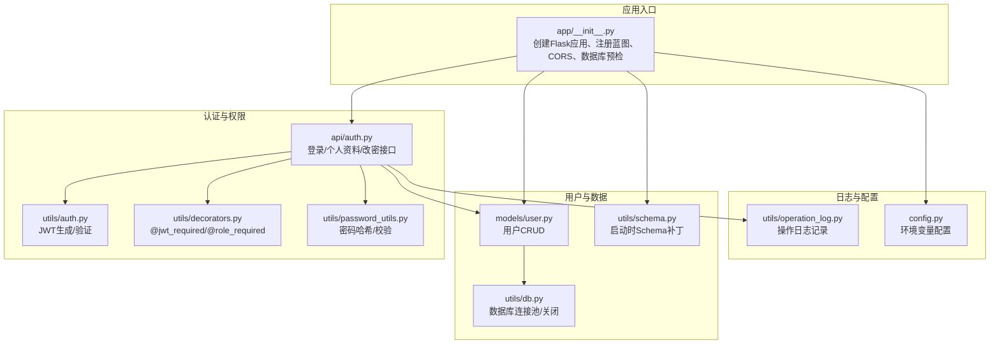
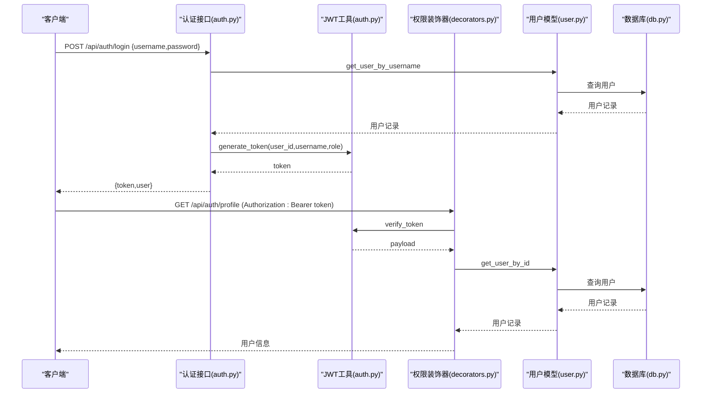
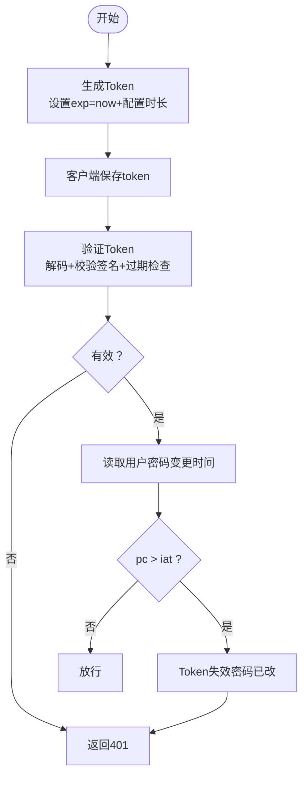
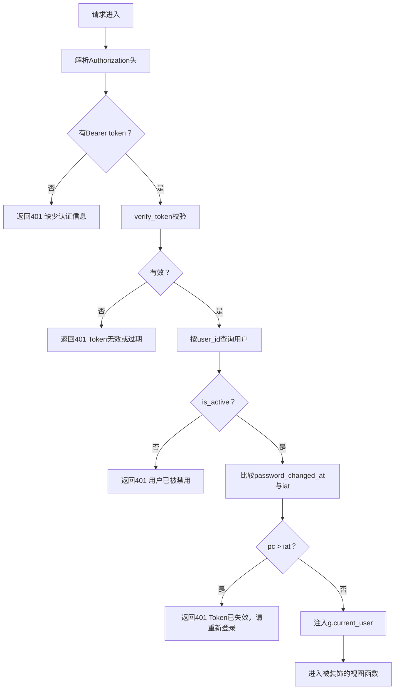
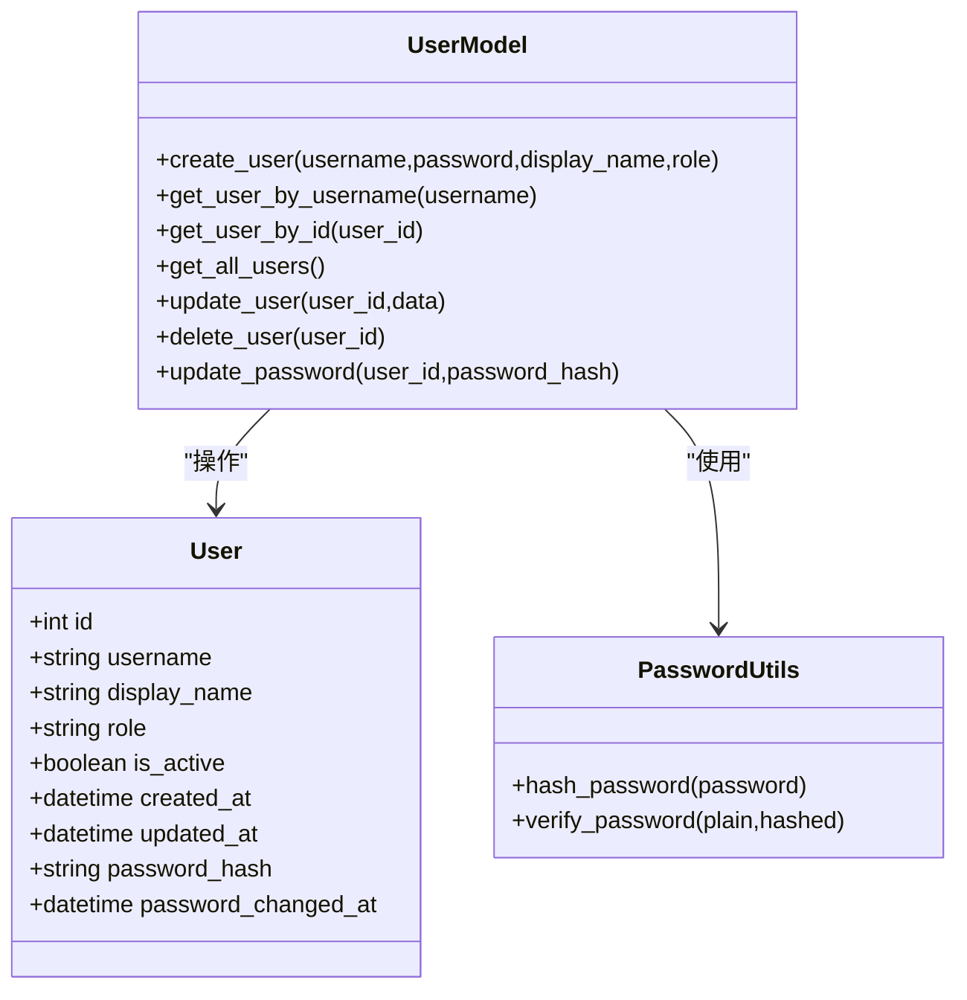
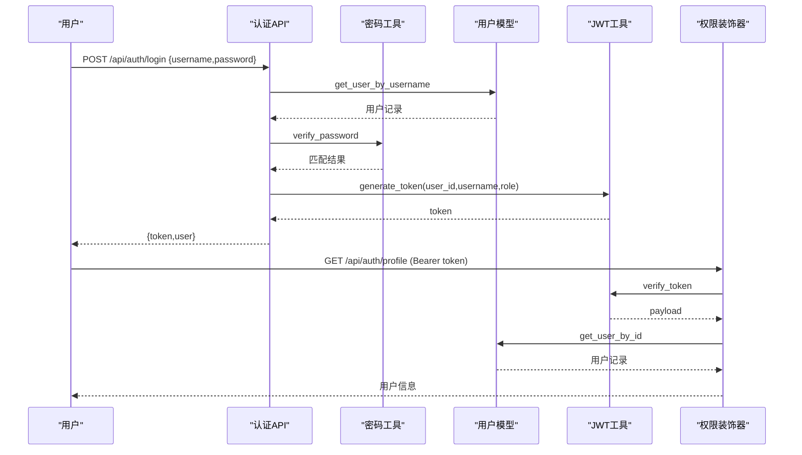
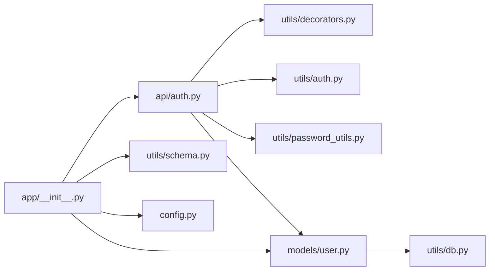

# 认证授权系统

<cite>
**本文引用的文件**
- [backend/app/api/auth.py](file://backend/app/api/auth.py)
- [backend/app/models/user.py](file://backend/app/models/user.py)
- [backend/app/utils/auth.py](file://backend/app/utils/auth.py)
- [backend/app/utils/decorators.py](file://backend/app/utils/decorators.py)
- [backend/app/config.py](file://backend/app/config.py)
- [backend/app/utils/password_utils.py](file://backend/app/utils/password_utils.py)
- [backend/app/utils/db.py](file://backend/app/utils/db.py)
- [backend/app/__init__.py](file://backend/app/__init__.py)
- [backend/app/api/users.py](file://backend/app/api/users.py)
- [backend/app/utils/operation_log.py](file://backend/app/utils/operation_log.py)
- [backend/app/utils/schema.py](file://backend/app/utils/schema.py)
</cite>

## 目录
1. [简介](#简介)
2. [项目结构](#项目结构)
3. [核心组件](#核心组件)
4. [架构总览](#架构总览)
5. [详细组件分析](#详细组件分析)
6. [依赖分析](#依赖分析)
7. [性能考虑](#性能考虑)
8. [故障排查指南](#故障排查指南)
9. [结论](#结论)
10. [附录](#附录)

## 简介
本文件面向OPS运维平台的认证授权系统，围绕以下主题展开：
- JWT认证机制：Token生成、验证、失效控制与密码变更联动
- 基于角色的权限控制：用户角色定义、权限级别、访问控制策略
- 认证装饰器设计：@jwt_required、@role_required的实现与使用
- 用户模型：用户信息存储、密码加密、角色权限关联
- 安全最佳实践与配置建议
- 提供认证流程图、权限控制示例路径、常见问题解决方案

## 项目结构
系统采用Flask微服务风格，按功能模块组织蓝图（Blueprint），核心认证与权限控制集中在以下模块：
- API层：认证、用户管理等业务接口
- 模型层：用户数据访问与CRUD
- 工具层：JWT工具、装饰器、密码工具、数据库连接、操作日志、Schema迁移
- 配置层：应用配置与环境变量注入

图表来源
- [backend/app/__init__.py:28-113](file://backend/app/__init__.py#L28-L113)
- [backend/app/api/auth.py:15-96](file://backend/app/api/auth.py#L15-L96)
- [backend/app/utils/auth.py:9-28](file://backend/app/utils/auth.py#L9-L28)
- [backend/app/utils/decorators.py:26-123](file://backend/app/utils/decorators.py#L26-L123)
- [backend/app/utils/password_utils.py:52-90](file://backend/app/utils/password_utils.py#L52-L90)
- [backend/app/models/user.py:8-33](file://backend/app/models/user.py#L8-L33)
- [backend/app/utils/db.py:43-69](file://backend/app/utils/db.py#L43-L69)
- [backend/app/utils/schema.py:10-41](file://backend/app/utils/schema.py#L10-L41)
- [backend/app/utils/operation_log.py:49-118](file://backend/app/utils/operation_log.py#L49-L118)
- [backend/app/config.py:10-57](file://backend/app/config.py#L10-L57)

章节来源
- [backend/app/__init__.py:28-113](file://backend/app/__init__.py#L28-L113)
- [backend/app/config.py:10-57](file://backend/app/config.py#L10-L57)

## 核心组件
- JWT工具：负责生成与验证JWT，包含过期时间与算法配置
- 权限装饰器：统一处理Bearer Token校验、用户存在性与启用状态、密码变更后的Token失效
- 用户模型：封装用户增删改查、密码更新、按用户名/ID查询
- 密码工具：bcrypt密码哈希与校验，兼容Werkzeug scrypt格式
- 数据库工具：Flask g上下文缓存数据库连接，统一关闭
- 操作日志：记录登录/登出/用户管理等关键动作
- Schema补丁：启动时为用户表增加密码变更时间列

章节来源
- [backend/app/utils/auth.py:9-28](file://backend/app/utils/auth.py#L9-L28)
- [backend/app/utils/decorators.py:26-123](file://backend/app/utils/decorators.py#L26-L123)
- [backend/app/models/user.py:8-33](file://backend/app/models/user.py#L8-L33)
- [backend/app/utils/password_utils.py:52-90](file://backend/app/utils/password_utils.py#L52-L90)
- [backend/app/utils/db.py:43-69](file://backend/app/utils/db.py#L43-L69)
- [backend/app/utils/operation_log.py:49-118](file://backend/app/utils/operation_log.py#L49-L118)
- [backend/app/utils/schema.py:10-41](file://backend/app/utils/schema.py#L10-L41)

## 架构总览
认证授权系统遵循“接口层-装饰器层-业务层-数据层”的分层设计，认证与权限控制通过装饰器集中实现，业务接口仅关注自身逻辑。

图表来源
- [backend/app/api/auth.py:15-96](file://backend/app/api/auth.py#L15-L96)
- [backend/app/utils/auth.py:9-28](file://backend/app/utils/auth.py#L9-L28)
- [backend/app/utils/decorators.py:26-123](file://backend/app/utils/decorators.py#L26-L123)
- [backend/app/models/user.py:36-71](file://backend/app/models/user.py#L36-L71)
- [backend/app/utils/db.py:43-69](file://backend/app/utils/db.py#L43-L69)

## 详细组件分析

### JWT认证机制
- Token生成
  - 负载包含user_id、username、role、iat、exp
  - 过期时长由配置项决定，默认小时数可配置
  - 使用HS256算法与密钥签名
- Token验证
  - 校验签名与过期时间
  - 过期或无效返回None
- 密码变更联动失效
  - 用户密码变更时间字段与Token签发时间比较
  - 若密码变更时间晚于Token签发时间，则判定Token失效

图表来源
- [backend/app/utils/auth.py:9-28](file://backend/app/utils/auth.py#L9-L28)
- [backend/app/utils/decorators.py:98-113](file://backend/app/utils/decorators.py#L98-L113)

章节来源
- [backend/app/utils/auth.py:9-28](file://backend/app/utils/auth.py#L9-L28)
- [backend/app/utils/decorators.py:98-113](file://backend/app/utils/decorators.py#L98-L113)
- [backend/app/utils/schema.py:20-38](file://backend/app/utils/schema.py#L20-L38)

### 基于角色的权限控制
- 角色定义
  - admin：管理员
  - operator：运维人员
  - viewer：观察者
- 权限策略
  - 登录后，装饰器将用户信息注入g.current_user
  - @role_required用于限定可访问的角色集合
  - 用户角色以数据库为准，避免前端篡改
- 示例路径
  - 用户管理接口均需admin角色：[backend/app/api/users.py:19-32](file://backend/app/api/users.py#L19-L32)

章节来源
- [backend/app/api/users.py:19-32](file://backend/app/api/users.py#L19-L32)
- [backend/app/utils/decorators.py:126-162](file://backend/app/utils/decorators.py#L126-L162)

### 认证装饰器设计与实现
- @jwt_required
  - 必须携带Authorization: Bearer token
  - 验证Token有效性、用户存在且启用
  - 比较密码变更时间与Token签发时间，防止密码变更后继续使用旧Token
  - 将用户信息注入g.current_user
- @role_required
  - 依赖@jwt_required前置校验
  - 检查g.current_user中的角色是否在允许集合内
  - 不满足返回403

图表来源
- [backend/app/utils/decorators.py:26-123](file://backend/app/utils/decorators.py#L26-L123)

章节来源
- [backend/app/utils/decorators.py:26-123](file://backend/app/utils/decorators.py#L26-L123)

### 用户模型设计
- 用户信息存储
  - 字段：id、username、display_name、role、is_active、created_at、updated_at、password_hash、password_changed_at
- 密码加密
  - 创建/更新密码时使用bcrypt进行哈希
  - 密码校验兼容Werkzeug scrypt格式
- 角色权限关联
  - 角色存储在数据库，装饰器读取并进行权限判断
- 关键操作
  - create_user：插入新用户并记录password_changed_at
  - get_user_by_username/get_user_by_id：按条件查询
  - update_user：允许更新display_name、role、is_active
  - update_password：更新密码哈希并刷新password_changed_at

图表来源
- [backend/app/models/user.py:8-33](file://backend/app/models/user.py#L8-L33)
- [backend/app/utils/password_utils.py:52-90](file://backend/app/utils/password_utils.py#L52-L90)

章节来源
- [backend/app/models/user.py:8-33](file://backend/app/models/user.py#L8-L33)
- [backend/app/utils/password_utils.py:52-90](file://backend/app/utils/password_utils.py#L52-L90)

### 认证流程图（登录与鉴权）

图表来源
- [backend/app/api/auth.py:15-96](file://backend/app/api/auth.py#L15-L96)
- [backend/app/utils/auth.py:9-28](file://backend/app/utils/auth.py#L9-L28)
- [backend/app/utils/decorators.py:26-123](file://backend/app/utils/decorators.py#L26-L123)
- [backend/app/utils/password_utils.py:64-90](file://backend/app/utils/password_utils.py#L64-L90)
- [backend/app/models/user.py:36-71](file://backend/app/models/user.py#L36-L71)

## 依赖分析
- 组件耦合
  - API层依赖装饰器与工具层，装饰器依赖JWT工具与用户模型
  - 用户模型依赖数据库工具
  - 应用入口负责注册蓝图与CORS、Schema初始化
- 外部依赖
  - Flask、PyMySQL、PyJWT、bcrypt、Flask-CORS
- 配置依赖
  - JWT_SECRET_KEY、JWT_EXPIRATION_HOURS、DB_* 等环境变量

图表来源
- [backend/app/api/auth.py:1-12](file://backend/app/api/auth.py#L1-L12)
- [backend/app/utils/decorators.py:1-8](file://backend/app/utils/decorators.py#L1-L8)
- [backend/app/utils/auth.py:1-7](file://backend/app/utils/auth.py#L1-L7)
- [backend/app/utils/password_utils.py:1-12](file://backend/app/utils/password_utils.py#L1-L12)
- [backend/app/models/user.py:1-6](file://backend/app/models/user.py#L1-L6)
- [backend/app/utils/db.py:1-7](file://backend/app/utils/db.py#L1-L7)
- [backend/app/__init__.py:116-149](file://backend/app/__init__.py#L116-L149)
- [backend/app/utils/schema.py:1-7](file://backend/app/utils/schema.py#L1-L7)
- [backend/app/config.py:1-7](file://backend/app/config.py#L1-L7)

章节来源
- [backend/app/__init__.py:116-149](file://backend/app/__init__.py#L116-L149)
- [backend/app/config.py:10-57](file://backend/app/config.py#L10-L57)

## 性能考虑
- 数据库连接
  - 使用Flask g上下文缓存连接，减少重复建立连接的开销
- Token签发与校验
  - HS256算法轻量，建议合理设置过期时长，平衡安全与性能
- 密码校验
  - bcrypt成本较高，建议在登录与改密等关键路径使用
- 日志记录
  - 操作日志异步化或批量写入可降低I/O压力（当前为同步写入）

## 故障排查指南
- 401 缺少认证信息
  - 检查请求头Authorization是否为Bearer token
  - 参考：[backend/app/utils/decorators.py:35-56](file://backend/app/utils/decorators.py#L35-L56)
- 401 Token无效或已过期
  - 检查JWT_SECRET_KEY是否配置正确
  - 检查JWT_EXPIRATION_HOURS是否合理
  - 参考：[backend/app/utils/auth.py:24-28](file://backend/app/utils/auth.py#L24-L28)
- 401 用户不存在或已被禁用
  - 检查用户是否存在且is_active为True
  - 参考：[backend/app/utils/decorators.py:76-96](file://backend/app/utils/decorators.py#L76-L96)
- 401 Token已失效，请重新登录
  - 密码变更后旧Token自动失效，提示重新登录
  - 参考：[backend/app/utils/decorators.py:104-113](file://backend/app/utils/decorators.py#L104-L113)
- 403 权限不足
  - 确认当前用户角色是否在@role_required允许集合内
  - 参考：[backend/app/utils/decorators.py:147-156](file://backend/app/utils/decorators.py#L147-L156)
- 数据库连接失败
  - 检查DB_HOST/DB_PORT/DB_USER/DB_PASSWORD/DB_NAME
  - 参考：[backend/app/utils/db.py:48-68](file://backend/app/utils/db.py#L48-L68)
- Schema缺失password_changed_at列
  - 启动时自动补丁，若失败检查权限与网络
  - 参考：[backend/app/utils/schema.py:20-38](file://backend/app/utils/schema.py#L20-L38)

章节来源
- [backend/app/utils/decorators.py:35-156](file://backend/app/utils/decorators.py#L35-L156)
- [backend/app/utils/auth.py:24-28](file://backend/app/utils/auth.py#L24-L28)
- [backend/app/utils/db.py:48-68](file://backend/app/utils/db.py#L48-L68)
- [backend/app/utils/schema.py:20-38](file://backend/app/utils/schema.py#L20-L38)

## 结论
本认证授权系统通过JWT与装饰器实现了统一的认证与权限控制，具备以下特点：
- Token生成与验证安全可控，支持密码变更后的即时失效
- 基于角色的权限控制清晰明确，装饰器集中处理通用逻辑
- 用户模型与密码工具职责单一，便于扩展与维护
- 配置驱动的安全参数，便于在不同环境间切换

## 附录

### 配置建议
- JWT密钥与过期时长
  - 生产环境必须设置JWT_SECRET_KEY与JWT_EXPIRATION_HOURS
  - 参考：[backend/app/config.py:13-14](file://backend/app/config.py#L13-L14)
- 数据库连接
  - 正确设置DB_HOST/DB_PORT/DB_USER/DB_PASSWORD/DB_NAME
  - 参考：[backend/app/utils/db.py:18-25](file://backend/app/utils/db.py#L18-L25)
- CORS与调试
  - CORS_ALLOW_ALL与CORS_ORIGINS按需配置
  - 参考：[backend/app/__init__.py:64-80](file://backend/app/__init__.py#L64-L80)
- 日志与健康检查
  - 启动时进行数据库预检，确保Schema补丁成功
  - 参考：[backend/app/__init__.py:88-106](file://backend/app/__init__.py#L88-L106), [backend/app/utils/schema.py:10-41](file://backend/app/utils/schema.py#L10-L41)

### 安全最佳实践
- 强制HTTPS传输，避免Token在传输中泄露
- 最小权限原则：仅授予完成工作所需的最小角色
- 定期轮换JWT_SECRET_KEY，变更密钥后及时通知客户端重新登录
- 严格限制CORS源，避免跨域风险
- 审计日志：对登录、用户管理、改密等关键操作进行记录
  - 参考：[backend/app/utils/operation_log.py:49-118](file://backend/app/utils/operation_log.py#L49-L118)