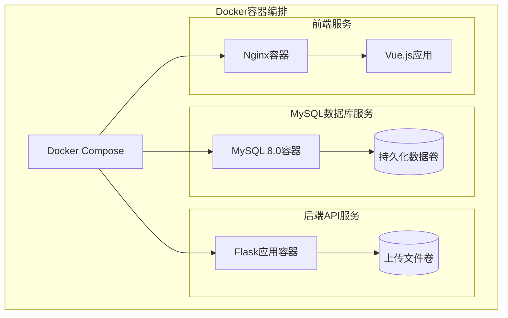
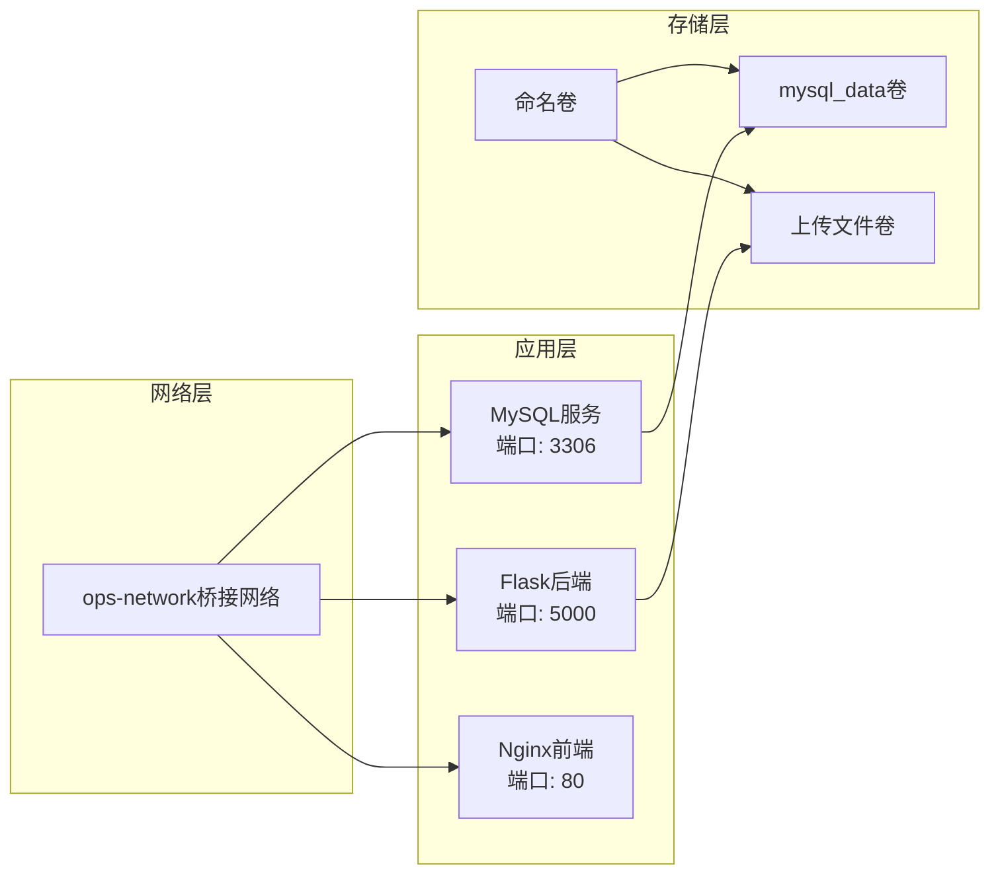
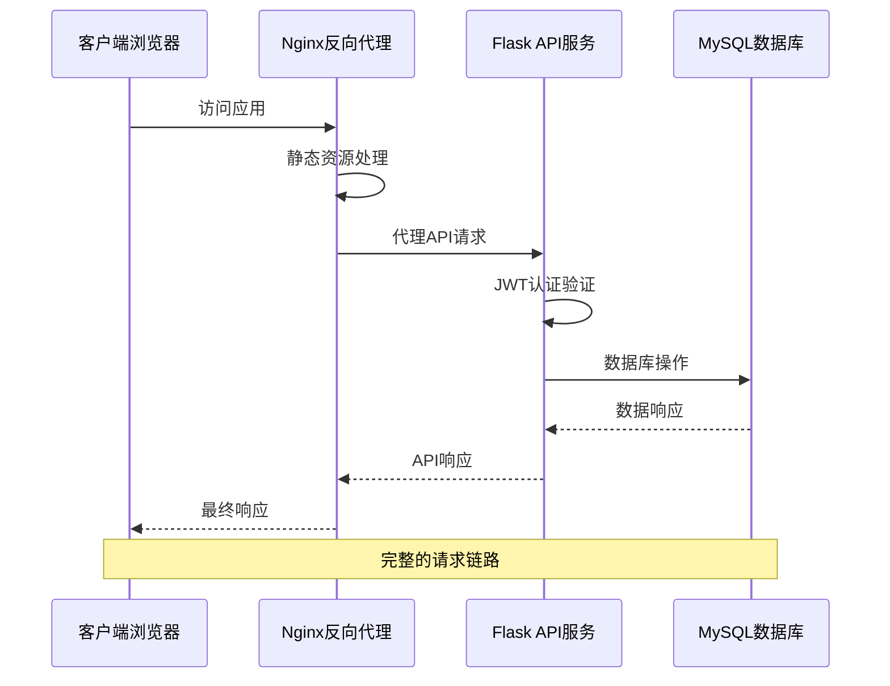
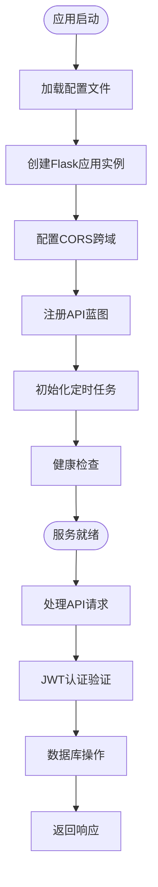
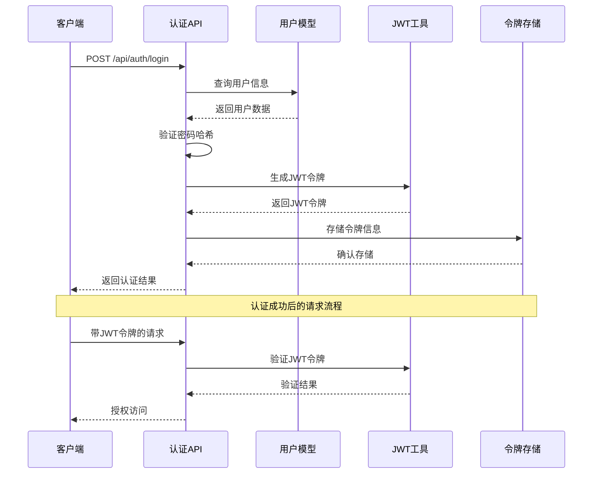
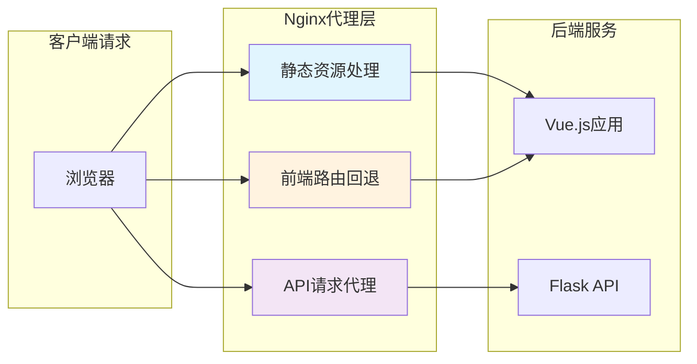
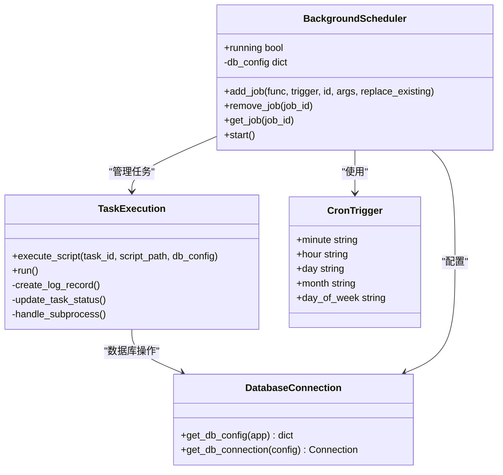
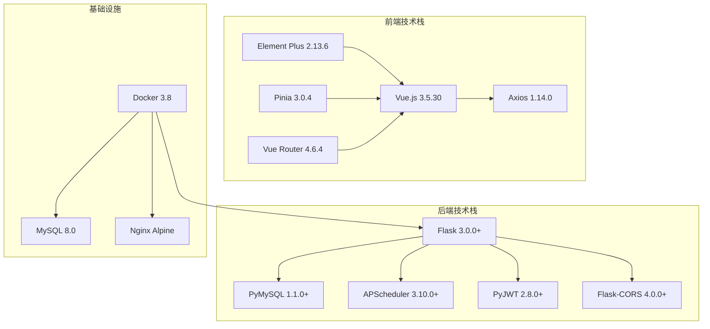
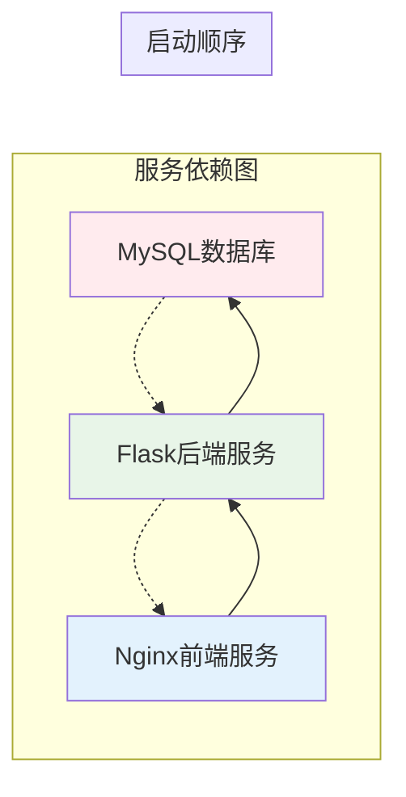

# Docker容器化部署

<cite>
**本文档引用的文件**
- [Dockerfile](file://backend/Dockerfile)
- [docker-compose.yml](file://docker-compose.yml)
- [nginx.conf](file://nginx.conf)
- [requirements.txt](file://backend/requirements.txt)
- [run.py](file://backend/run.py)
- [config.py](file://backend/app/config.py)
- [__init__.py](file://backend/app/__init__.py)
- [auth.py](file://backend/app/api/auth.py)
- [users.py](file://backend/app/api/users.py)
- [scheduler.py](file://backend/app/utils/scheduler.py)
- [package.json](file://frontend/package.json)
</cite>

## 目录
1. [简介](#简介)
2. [项目结构](#项目结构)
3. [核心组件](#核心组件)
4. [架构概览](#架构概览)
5. [详细组件分析](#详细组件分析)
6. [依赖关系分析](#依赖关系分析)
7. [性能考虑](#性能考虑)
8. [故障排除指南](#故障排除指南)
9. [结论](#结论)

## 简介

这是一个基于Flask的运维管理平台，采用Docker容器化部署方案。系统包含前后端分离架构，后端提供RESTful API服务，前端使用Vue.js构建单页应用，通过Nginx进行反向代理和静态资源服务。

该部署方案提供了完整的微服务架构，包括MySQL数据库、Flask API服务、Vue.js前端应用，并通过Docker Compose实现服务编排和容器管理。

## 项目结构

项目采用前后端分离的三层架构设计：

**图表来源**
- [docker-compose.yml:1-75](file://docker-compose.yml#L1-L75)
- [Dockerfile:1-36](file://backend/Dockerfile#L1-L36)

**章节来源**
- [docker-compose.yml:1-75](file://docker-compose.yml#L1-L75)
- [backend/requirements.txt:1-9](file://backend/requirements.txt#L1-L9)

## 核心组件

### Docker容器配置

系统采用多阶段容器化策略，每个服务运行在独立的Docker容器中：

#### 基础镜像选择
- **Python 3.11 Slim**: 轻量级基础镜像，减少镜像体积
- **MySQL 8.0**: 生产级数据库引擎
- **Nginx Alpine**: 轻量级Web服务器

#### 环境变量配置
系统通过环境变量实现配置管理：

| 组件 | 关键环境变量 | 默认值 | 用途 |
|------|-------------|--------|------|
| Flask应用 | FLASK_HOST | 0.0.0.0 | 监听地址 |
| Flask应用 | FLASK_PORT | 5000 | 服务端口 |
| Flask应用 | FLASK_DEBUG | false | 调试模式 |
| Flask应用 | SECRET_KEY | ops-platform-secret-key-change-in-prod | 应用密钥 |
| Flask应用 | JWT_SECRET_KEY | jwt-secret-key-change-in-prod | JWT密钥 |
| 数据库 | DB_HOST | mysql | 数据库主机 |
| 数据库 | DB_PORT | 3306 | 数据库端口 |
| 数据库 | DB_USER | root | 数据库用户 |
| 数据库 | DB_PASSWORD | Pass1234. | 数据库密码 |
| 数据库 | DB_NAME | ops_platform | 数据库名称 |

**章节来源**
- [Dockerfile:7-12](file://backend/Dockerfile#L7-L12)
- [docker-compose.yml:33-43](file://docker-compose.yml#L33-L43)
- [config.py:4-21](file://backend/app/config.py#L4-L21)

### 服务编排架构

**图表来源**
- [docker-compose.yml:69-75](file://docker-compose.yml#L69-L75)
- [docker-compose.yml:14-16](file://docker-compose.yml#L14-L16)
- [docker-compose.yml:44-45](file://docker-compose.yml#L44-L45)

**章节来源**
- [docker-compose.yml:1-75](file://docker-compose.yml#L1-L75)

## 架构概览

系统采用微服务架构，通过Docker Compose实现服务编排：

**图表来源**
- [nginx.conf:17-28](file://nginx.conf#L17-L28)
- [auth.py:14-82](file://backend/app/api/auth.py#L14-L82)
- [config.py:15-17](file://backend/app/config.py#L15-L17)

**章节来源**
- [nginx.conf:1-41](file://nginx.conf#L1-L41)
- [run.py:1-8](file://backend/run.py#L1-L8)

## 详细组件分析

### Flask后端服务

#### 应用初始化流程

**图表来源**
- [__init__.py:6-34](file://backend/app/__init__.py#L6-L34)
- [__init__.py:37-62](file://backend/app/__init__.py#L37-L62)
- [scheduler.py:201-244](file://backend/app/utils/scheduler.py#L201-L244)

#### API认证机制

系统采用JWT（JSON Web Token）进行用户认证：

**图表来源**
- [auth.py:14-82](file://backend/app/api/auth.py#L14-L82)
- [auth.py:85-115](file://backend/app/api/auth.py#L85-L115)

**章节来源**
- [auth.py:1-184](file://backend/app/api/auth.py#L1-L184)
- [users.py:1-200](file://backend/app/api/users.py#L1-L200)

### Nginx前端代理配置

#### 静态资源优化

Nginx配置针对Vue.js单页应用进行了专门优化：

| 配置项 | 设置 | 作用 |
|--------|------|------|
| 缓存策略 | 1年有效期 | 减少带宽消耗 |
| MIME类型 | 自动识别 | 正确处理各类文件 |
| 前端路由 | try_files回退 | 支持Vue Router历史模式 |
| API代理 | 反向代理到后端 | 统一API入口 |

#### 代理配置细节

**图表来源**
- [nginx.conf:10-15](file://nginx.conf#L10-L15)
- [nginx.conf:17-28](file://nginx.conf#L17-L28)
- [nginx.conf:30-33](file://nginx.conf#L30-L33)

**章节来源**
- [nginx.conf:1-41](file://nginx.conf#L1-L41)

### 定时任务调度系统

#### 调度器架构

**图表来源**
- [scheduler.py:10-11](file://backend/app/utils/scheduler.py#L10-L11)
- [scheduler.py:14-24](file://backend/app/utils/scheduler.py#L14-L24)
- [scheduler.py:146-185](file://backend/app/utils/scheduler.py#L146-L185)

**章节来源**
- [scheduler.py:1-249](file://backend/app/utils/scheduler.py#L1-L249)

## 依赖关系分析

### 技术栈依赖

系统采用现代化的技术栈组合：

**图表来源**
- [package.json:11-17](file://frontend/package.json#L11-L17)
- [requirements.txt:1-9](file://backend/requirements.txt#L1-L9)

### 服务间依赖关系

**图表来源**
- [docker-compose.yml:50-52](file://docker-compose.yml#L50-L52)
- [docker-compose.yml:66-67](file://docker-compose.yml#L66-L67)

**章节来源**
- [package.json:1-24](file://frontend/package.json#L1-L24)
- [requirements.txt:1-9](file://backend/requirements.txt#L1-L9)

## 性能考虑

### 容器优化策略

1. **镜像大小优化**
   - 使用Python 3.11 Slim基础镜像
   - 清理APT缓存避免额外空间占用
   - 单一功能容器设计

2. **资源利用优化**
   - 环境变量配置减少配置文件体积
   - 进程池管理避免内存泄漏
   - 连接池复用数据库连接

3. **网络性能优化**
   - Nginx静态资源缓存
   - CDN友好的缓存头设置
   - 压缩传输优化

### 部署最佳实践

| 优化项 | 实现方式 | 效果 |
|--------|----------|------|
| 启动顺序 | depends_on健康检查 | 确保服务依赖正确启动 |
| 数据持久化 | 命名卷管理 | 避免数据丢失 |
| 端口映射 | 明确端口配置 | 避免端口冲突 |
| 环境隔离 | 独立网络配置 | 提升安全性 |

## 故障排除指南

### 常见问题诊断

#### 1. 数据库连接问题
**症状**: 后端服务启动失败，出现数据库连接错误
**排查步骤**:
1. 检查MySQL容器状态
2. 验证数据库凭据配置
3. 确认网络连通性
4. 查看数据库初始化脚本执行情况

#### 2. API认证失败
**症状**: 用户登录成功但访问其他API返回401错误
**排查步骤**:
1. 验证JWT密钥配置
2. 检查Token生成和验证逻辑
3. 确认CORS跨域配置
4. 查看认证中间件执行情况

#### 3. 前端页面无法访问
**症状**: 浏览器显示404或空白页面
**排查步骤**:
1. 检查Nginx配置文件语法
2. 验证静态资源文件完整性
3. 确认API代理配置正确
4. 查看Vue Router路由配置

### 日志监控

系统各组件的日志位置:

| 组件 | 日志位置 | 查看命令 |
|------|----------|----------|
| MySQL | 容器内部日志 | `docker logs ops-mysql` |
| Flask | 标准输出 | `docker logs ops-backend` |
| Nginx | `/var/log/nginx/` | `docker exec ops-frontend tail -f /var/log/nginx/access.log` |

**章节来源**
- [docker-compose.yml:21-24](file://docker-compose.yml#L21-L24)
- [scheduler.py:99-133](file://backend/app/utils/scheduler.py#L99-L133)

## 结论

该Docker容器化部署方案提供了完整、可扩展的运维管理平台解决方案。通过合理的架构设计和技术选型，实现了：

1. **高可用性**: 多容器服务架构，支持服务自动重启和健康检查
2. **可扩展性**: 微服务架构设计，便于功能模块独立扩展
3. **易维护性**: 容器化部署简化了环境管理和版本控制
4. **性能优化**: 前端静态资源优化和后端API性能调优

建议在生产环境中进一步完善：
- 增强安全配置（HTTPS、防火墙规则）
- 实施监控和告警系统
- 配置负载均衡和高可用集群
- 建立完善的备份和恢复策略