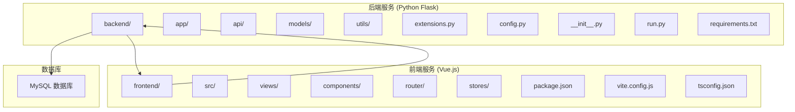
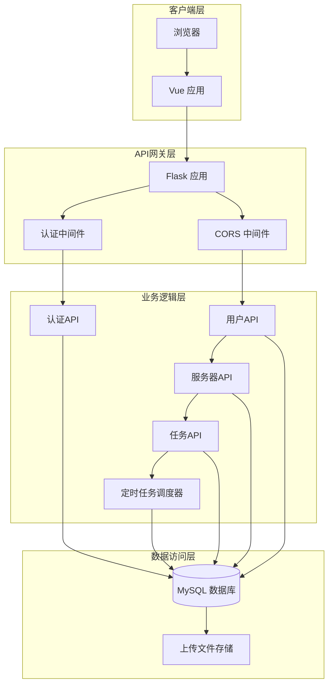
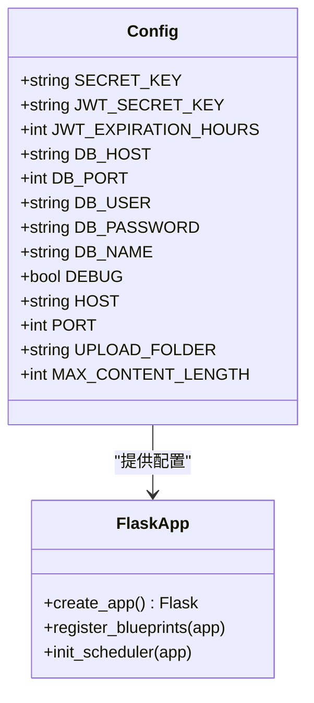
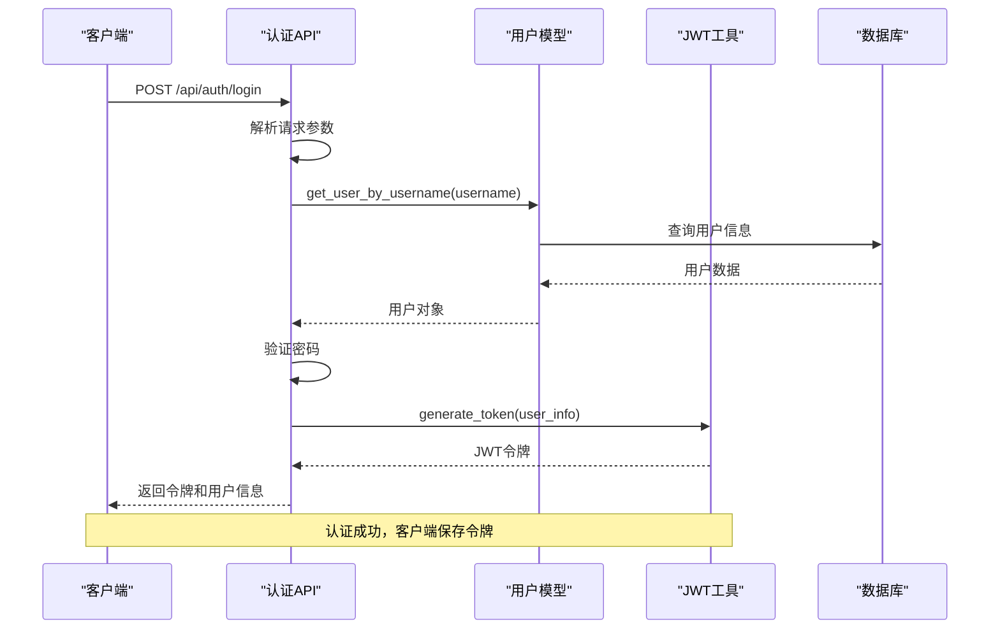
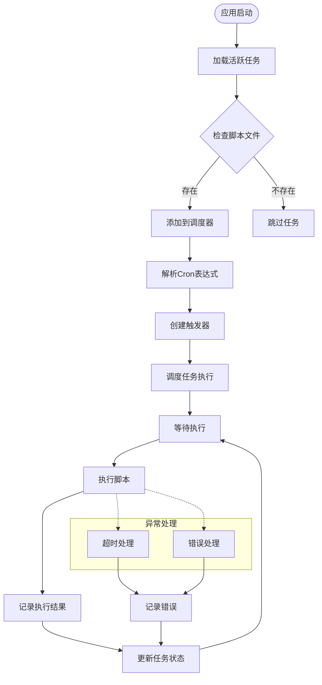
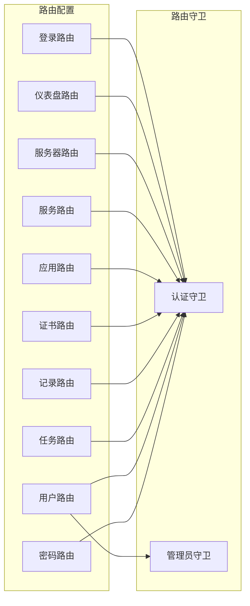
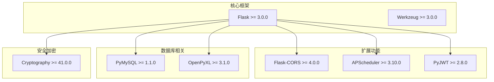

# 开发环境部署

<cite>
**本文档引用的文件**
- [backend/requirements.txt](file://backend/requirements.txt)
- [backend/run.py](file://backend/run.py)
- [backend/app/config.py](file://backend/app/config.py)
- [backend/app/__init__.py](file://backend/app/__init__.py)
- [backend/app/utils/db.py](file://backend/app/utils/db.py)
- [backend/app/utils/scheduler.py](file://backend/app/utils/scheduler.py)
- [backend/app/api/auth.py](file://backend/app/api/auth.py)
- [frontend/package.json](file://frontend/package.json)
- [frontend/vite.config.js](file://frontend/vite.config.js)
- [frontend/tsconfig.json](file://frontend/tsconfig.json)
- [frontend/src/main.js](file://frontend/src/main.js)
- [frontend/src/router/index.js](file://frontend/src/router/index.js)
</cite>

## 目录
1. [简介](#简介)
2. [项目结构](#项目结构)
3. [核心组件](#核心组件)
4. [架构概览](#架构概览)
5. [详细组件分析](#详细组件分析)
6. [依赖分析](#依赖分析)
7. [性能考虑](#性能考虑)
8. [故障排除指南](#故障排除指南)
9. [结论](#结论)
10. [附录](#附录)

## 简介

这是一个基于Python Flask后端和Vue.js前端的云运维平台项目。项目采用前后端分离架构，后端提供RESTful API服务，前端使用Vue 3 + Vite构建现代化的单页应用。系统支持定时任务调度、用户认证、服务器管理、应用系统监控等功能。

## 项目结构

项目采用标准的前后端分离架构，具有清晰的模块化组织：



**图表来源**
- [backend/app/__init__.py:1-62](file://backend/app/__init__.py#L1-L62)
- [frontend/package.json:1-24](file://frontend/package.json#L1-L24)

**章节来源**
- [backend/requirements.txt:1-9](file://backend/requirements.txt#L1-L9)
- [frontend/package.json:1-24](file://frontend/package.json#L1-L24)

## 核心组件

### 后端核心组件

后端采用Flask框架，主要组件包括：

- **应用工厂模式**: 使用`create_app()`函数创建Flask应用实例
- **配置管理**: 通过Config类集中管理所有配置参数
- **蓝图系统**: 按功能模块划分API接口
- **数据库连接**: 使用PyMySQL进行数据库操作
- **定时任务**: 基于APScheduler实现任务调度

### 前端核心组件

前端采用Vue 3 + Vite技术栈：

- **响应式状态管理**: 使用Pinia进行状态管理
- **路由系统**: Vue Router实现前端路由
- **UI组件库**: Element Plus提供丰富的UI组件
- **TypeScript支持**: 完整的TypeScript配置
- **开发服务器**: Vite提供快速开发体验

**章节来源**
- [backend/app/__init__.py:6-34](file://backend/app/__init__.py#L6-L34)
- [frontend/src/main.js:1-23](file://frontend/src/main.js#L1-L23)

## 架构概览

系统采用典型的MVC架构模式，前后端完全分离：



**图表来源**
- [backend/app/__init__.py:37-62](file://backend/app/__init__.py#L37-L62)
- [backend/app/utils/scheduler.py:201-244](file://backend/app/utils/scheduler.py#L201-L244)

## 详细组件分析

### Flask应用配置

Flask应用通过Config类集中管理所有配置参数，支持环境变量覆盖：



**图表来源**
- [backend/app/config.py:4-21](file://backend/app/config.py#L4-L21)
- [backend/app/__init__.py:6-34](file://backend/app/__init__.py#L6-L34)

**章节来源**
- [backend/app/config.py:1-21](file://backend/app/config.py#L1-L21)
- [backend/app/__init__.py:19-32](file://backend/app/__init__.py#L19-L32)

### 认证API流程

用户认证是系统的核心功能之一，采用JWT令牌机制：



**图表来源**
- [backend/app/api/auth.py:14-82](file://backend/app/api/auth.py#L14-L82)
- [backend/app/models/user.py:1-50](file://backend/app/models/user.py#L1-L50)

**章节来源**
- [backend/app/api/auth.py:14-82](file://backend/app/api/auth.py#L14-L82)

### 定时任务调度系统

系统内置强大的定时任务调度功能：



**图表来源**
- [backend/app/utils/scheduler.py:201-244](file://backend/app/utils/scheduler.py#L201-L244)
- [backend/app/utils/scheduler.py:32-144](file://backend/app/utils/scheduler.py#L32-L144)

**章节来源**
- [backend/app/utils/scheduler.py:14-249](file://backend/app/utils/scheduler.py#L14-L249)

### 前端路由系统

Vue Router提供灵活的路由管理：



**图表来源**
- [frontend/src/router/index.js:3-28](file://frontend/src/router/index.js#L3-L28)
- [frontend/src/router/index.js:36-58](file://frontend/src/router/index.js#L36-L58)

**章节来源**
- [frontend/src/router/index.js:1-61](file://frontend/src/router/index.js#L1-L61)

## 依赖分析

### 后端依赖关系

后端项目使用Flask生态系统，主要依赖包括：



**图表来源**
- [backend/requirements.txt:1-9](file://backend/requirements.txt#L1-L9)

**章节来源**
- [backend/requirements.txt:1-9](file://backend/requirements.txt#L1-L9)

### 前端依赖关系

前端项目采用现代化的Vue 3技术栈：

```mermaid
graph TB
subgraph "核心框架"
Vue[Vue 3.5.30]
VueRouter[Vue Router 4.6.4]
Pinia[Pinia 3.0.4]
end
subgraph "UI组件"
ElementPlus[Element Plus 2.13.6]
Icons[Element Plus Icons 2.3.2]
end
subgraph "开发工具"
Vite[Vite 8.0.1]
VuePlugin[@vitejs/plugin-vue]
end
subgraph "HTTP客户端"
Axios[Axios 1.14.0]
end
Vue --> VueRouter
Vue --> Pinia
Vue --> ElementPlus
ElementPlus --> Icons
Vue --> Axios
Vite --> VuePlugin
```

**图表来源**
- [frontend/package.json:11-22](file://frontend/package.json#L11-L22)

**章节来源**
- [frontend/package.json:1-24](file://frontend/package.json#L1-L24)

## 性能考虑

### 后端性能优化

1. **数据库连接池**: 使用PyMySQL的连接池机制减少连接开销
2. **定时任务并发**: 任务在独立线程中执行，避免阻塞主进程
3. **CORS配置**: 精确控制跨域访问，提高安全性
4. **文件上传限制**: 16MB大小限制防止资源滥用

### 前端性能优化

1. **按需加载**: Vue Router支持异步组件加载
2. **TypeScript编译**: 编译时类型检查提升性能
3. **Vite开发服务器**: 快速热重载和模块预构建
4. **Element Plus组件**: 按需引入减少打包体积

## 故障排除指南

### 环境变量配置问题

**问题**: 应用无法启动，提示配置错误
**解决方案**: 
1. 检查环境变量是否正确设置
2. 确认数据库连接参数
3. 验证JWT密钥配置

**章节来源**
- [backend/app/config.py:4-21](file://backend/app/config.py#L4-L21)

### 数据库连接问题

**问题**: 数据库连接失败
**解决方案**:
1. 检查数据库服务是否运行
2. 验证连接参数（主机、端口、用户名、密码）
3. 确认数据库名称正确
4. 检查防火墙设置

**章节来源**
- [backend/app/utils/db.py:5-17](file://backend/app/utils/db.py#L5-L17)

### 端口冲突问题

**问题**: 开发服务器启动失败，提示端口被占用
**解决方案**:
1. 修改Flask后端端口配置
2. 修改Vite前端端口配置
3. 使用netstat命令查找占用进程

**章节来源**
- [backend/app/config.py:16-17](file://backend/app/config.py#L16-L17)
- [frontend/vite.config.js:6-8](file://frontend/vite.config.js#L6-L8)

### 依赖版本冲突

**问题**: npm install或pip install失败
**解决方案**:
1. 清理缓存重新安装
2. 使用兼容的Node.js和Python版本
3. 检查package-lock.json和requirements.txt

**章节来源**
- [frontend/package.json:1-24](file://frontend/package.json#L1-L24)
- [backend/requirements.txt:1-9](file://backend/requirements.txt#L1-L9)

### 热重载配置问题

**问题**: 前端修改后不自动刷新
**解决方案**:
1. 检查Vite配置中的host和port设置
2. 确认代理配置正确指向后端API
3. 验证文件监听权限

**章节来源**
- [frontend/vite.config.js:4-16](file://frontend/vite.config.js#L4-L16)

### 开发工具推荐

**IDE配置建议**:
1. **VS Code**: 安装Vue、TypeScript、Python扩展
2. **PyCharm**: 专业Python IDE，支持Flask开发
3. **WebStorm**: Vue.js开发首选IDE

**开发工具**:
1. Postman: API测试工具
2. MySQL Workbench: 数据库管理
3. Git: 版本控制
4. Docker: 容器化部署

## 结论

本云运维平台项目采用现代化的技术栈，具有良好的可维护性和扩展性。后端使用Flask提供稳定的API服务，前端使用Vue 3构建用户体验优秀的界面。项目配置清晰，模块化程度高，适合团队协作开发。

开发环境部署相对简单，主要关注点包括：
- 正确配置环境变量
- 确保数据库服务可用
- 配置正确的端口映射
- 设置合适的代理规则

通过遵循本文档的指导，开发者可以快速搭建完整的开发环境并开始项目开发。

## 附录

### 开发环境要求

**后端环境**:
- Python 3.8+
- MySQL 5.7+

**前端环境**:
- Node.js 16+
- npm 8+

### 环境变量参考

| 变量名 | 默认值 | 用途 |
|--------|--------|------|
| FLASK_DEBUG | True | 调试模式开关 |
| FLASK_HOST | 0.0.0.0 | 绑定地址 |
| FLASK_PORT | 5000 | 后端端口 |
| DB_HOST | 192.168.1.124 | 数据库主机 |
| DB_PORT | 3306 | 数据库端口 |
| DB_USER | root | 数据库用户名 |
| DB_PASSWORD | Pass1234. | 数据库密码 |
| DB_NAME | ops_platform | 数据库名称 |
| SECRET_KEY | ops-platform-secret-key-change-in-prod | Flask密钥 |
| JWT_SECRET_KEY | jwt-secret-key-change-in-prod | JWT密钥 |

### 常用命令

**后端开发**:
```bash
# 创建虚拟环境
python -m venv venv

# 激活虚拟环境
# Windows: venv\Scripts\activate
# macOS/Linux: source venv/bin/activate

# 安装依赖
pip install -r requirements.txt

# 启动后端
python run.py
```

**前端开发**:
```bash
# 安装依赖
npm install

# 启动开发服务器
npm run dev

# 构建生产版本
npm run build
```