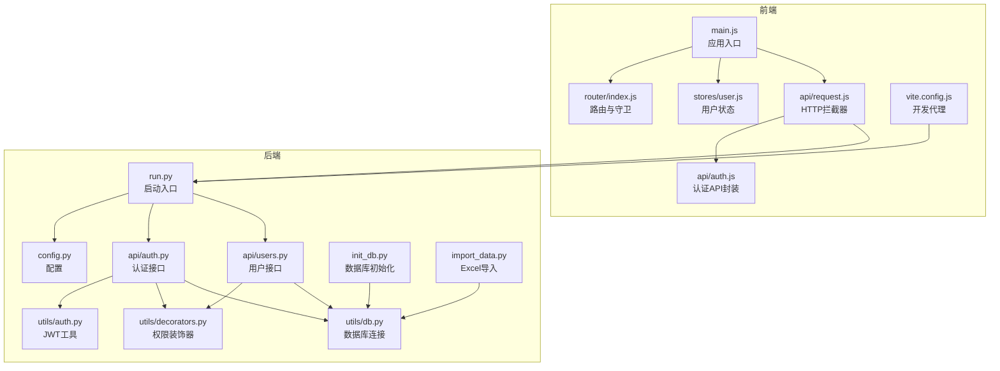
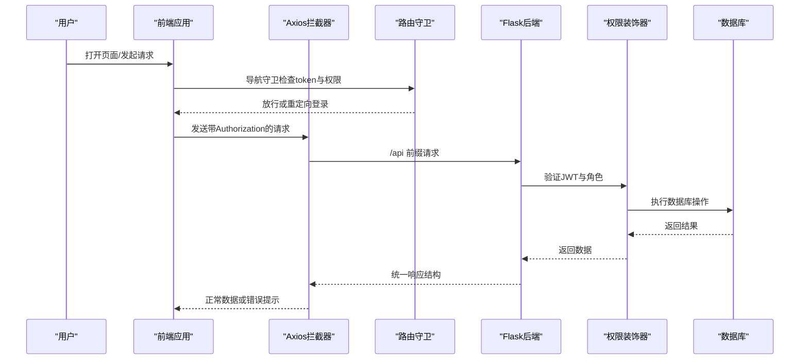
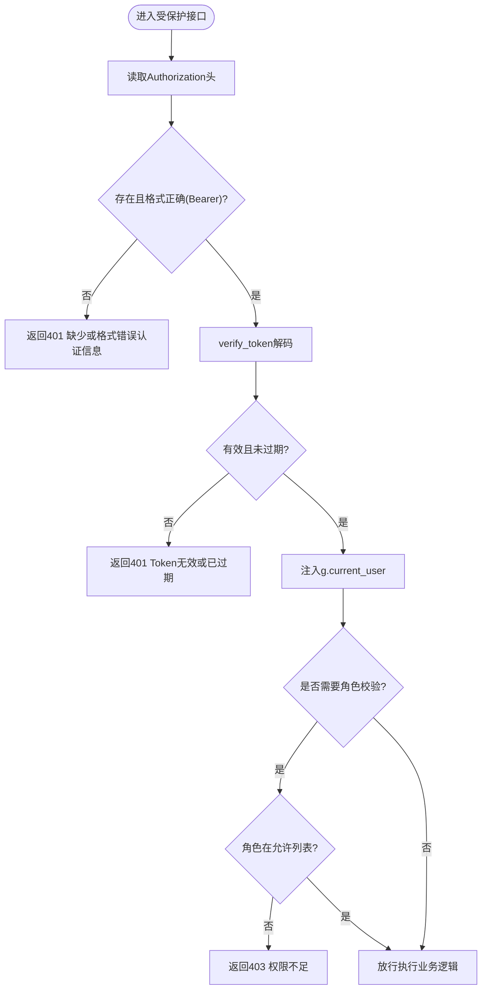
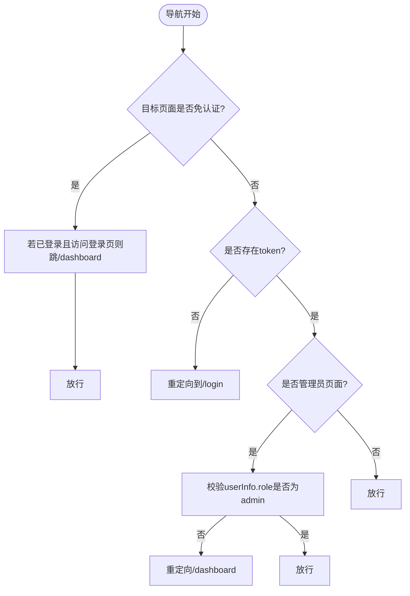
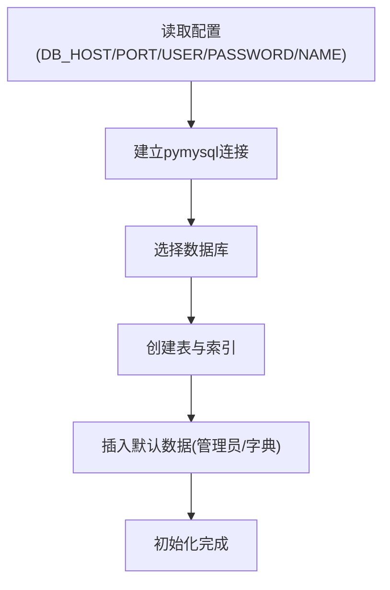
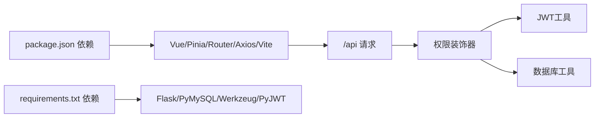

# 故障排除与维护

<cite>
**本文引用的文件**
- [backend/app/config.py](file://backend/app/config.py)
- [backend/app/utils/db.py](file://backend/app/utils/db.py)
- [backend/app/utils/auth.py](file://backend/app/utils/auth.py)
- [backend/app/utils/decorators.py](file://backend/app/utils/decorators.py)
- [backend/app/api/auth.py](file://backend/app/api/auth.py)
- [backend/app/api/users.py](file://backend/app/api/users.py)
- [backend/init_db.py](file://backend/init_db.py)
- [backend/import_data.py](file://backend/import_data.py)
- [backend/run.py](file://backend/run.py)
- [frontend/src/main.js](file://frontend/src/main.js)
- [frontend/src/router/index.js](file://frontend/src/router/index.js)
- [frontend/src/stores/user.js](file://frontend/src/stores/user.js)
- [frontend/src/api/request.js](file://frontend/src/api/request.js)
- [frontend/src/api/auth.js](file://frontend/src/api/auth.js)
- [frontend/vite.config.js](file://frontend/vite.config.js)
- [frontend/package.json](file://frontend/package.json)
</cite>

## 目录
1. [简介](#简介)
2. [项目结构](#项目结构)
3. [核心组件](#核心组件)
4. [架构总览](#架构总览)
5. [详细组件分析](#详细组件分析)
6. [依赖分析](#依赖分析)
7. [性能考虑](#性能考虑)
8. [故障排除指南](#故障排除指南)
9. [维护流程](#维护流程)
10. [调试技巧与工具](#调试技巧与工具)
11. [结论](#结论)

## 简介
本指南面向云运维平台的运维与开发人员，覆盖认证失败、数据库连接异常、前端路由错误、API 接口调用失败等常见问题的诊断与修复；提供系统维护流程（定期备份、数据迁移、版本升级、紧急故障处理）；给出调试技巧与工具使用建议；并总结性能问题的识别与优化方法。

## 项目结构
- 后端采用 Flask 蓝图组织 API，统一通过装饰器进行 JWT 认证与角色校验，数据库连接通过工具函数集中管理。
- 前端基于 Vue 3 + Pinia + Vue Router，Axios 统一请求封装，Vite 开发代理指向后端服务。
- 初始化脚本负责数据库与字典表的创建及默认数据插入；导入脚本支持从 Excel 导入多类业务数据。

图表来源
- [frontend/src/main.js:1-23](file://frontend/src/main.js#L1-L23)
- [frontend/src/router/index.js:1-61](file://frontend/src/router/index.js#L1-L61)
- [frontend/src/stores/user.js:1-41](file://frontend/src/stores/user.js#L1-L41)
- [frontend/src/api/request.js:1-54](file://frontend/src/api/request.js#L1-L54)
- [frontend/src/api/auth.js:1-14](file://frontend/src/api/auth.js#L1-L14)
- [frontend/vite.config.js:1-17](file://frontend/vite.config.js#L1-L17)
- [backend/run.py:1-8](file://backend/run.py#L1-L8)
- [backend/app/config.py:1-21](file://backend/app/config.py#L1-L21)
- [backend/app/utils/db.py:1-17](file://backend/app/utils/db.py#L1-L17)
- [backend/app/utils/auth.py:1-83](file://backend/app/utils/auth.py#L1-L83)
- [backend/app/utils/decorators.py:1-95](file://backend/app/utils/decorators.py#L1-L95)
- [backend/app/api/auth.py:1-184](file://backend/app/api/auth.py#L1-L184)
- [backend/app/api/users.py:1-268](file://backend/app/api/users.py#L1-L268)
- [backend/init_db.py:1-263](file://backend/init_db.py#L1-L263)
- [backend/import_data.py:1-431](file://backend/import_data.py#L1-L431)

章节来源
- [backend/app/config.py:1-21](file://backend/app/config.py#L1-L21)
- [frontend/src/main.js:1-23](file://frontend/src/main.js#L1-L23)
- [frontend/vite.config.js:1-17](file://frontend/vite.config.js#L1-L17)

## 核心组件
- 配置中心：集中管理数据库、JWT、Flask 主机与端口、上传目录与大小限制等。
- 数据库工具：统一获取连接参数并建立连接，便于集中排查连接问题。
- JWT 工具：生成与验证令牌，支持过期与非法令牌处理。
- 权限装饰器：统一从请求头解析 Bearer Token，注入用户上下文并做角色校验。
- 认证与用户 API：登录、获取资料、改密、用户管理（仅管理员），返回统一结构。
- 前端请求封装：统一 baseURL、超时、请求头携带 token、响应错误统一处理与路由跳转。
- 路由守卫：基于本地存储 token 与 userInfo 的鉴权与管理员权限控制。
- 初始化与导入：自动创建数据库与表结构、插入默认数据；从 Excel 导入多类业务数据。

章节来源
- [backend/app/config.py:1-21](file://backend/app/config.py#L1-L21)
- [backend/app/utils/db.py:1-17](file://backend/app/utils/db.py#L1-L17)
- [backend/app/utils/auth.py:1-83](file://backend/app/utils/auth.py#L1-L83)
- [backend/app/utils/decorators.py:1-95](file://backend/app/utils/decorators.py#L1-L95)
- [backend/app/api/auth.py:1-184](file://backend/app/api/auth.py#L1-L184)
- [backend/app/api/users.py:1-268](file://backend/app/api/users.py#L1-L268)
- [frontend/src/api/request.js:1-54](file://frontend/src/api/request.js#L1-L54)
- [frontend/src/router/index.js:1-61](file://frontend/src/router/index.js#L1-L61)

## 架构总览
前后端分离，前端通过 Axios 发起 /api 前缀请求，开发模式下由 Vite 代理转发至后端 Flask。后端以蓝图划分功能模块，统一经装饰器进行认证与权限控制，数据库连接通过工具函数集中管理。

图表来源
- [frontend/src/router/index.js:36-58](file://frontend/src/router/index.js#L36-L58)
- [frontend/src/api/request.js:13-51](file://frontend/src/api/request.js#L13-L51)
- [backend/app/utils/decorators.py:9-56](file://backend/app/utils/decorators.py#L9-L56)
- [backend/app/utils/db.py:5-17](file://backend/app/utils/db.py#L5-L17)

## 详细组件分析

### 认证与权限组件
- JWT 生成与验证：使用配置中的密钥与过期时间，异常捕获过期与非法令牌。
- 权限装饰器：从 Authorization 头提取 Bearer Token，验证失败返回 401；成功后将用户信息写入 g，供后续接口使用。
- 角色装饰器：要求先通过 JWT 装饰器，再校验角色是否在允许列表中，否则返回 403。

图表来源
- [backend/app/utils/decorators.py:9-95](file://backend/app/utils/decorators.py#L9-L95)
- [backend/app/utils/auth.py:38-56](file://backend/app/utils/auth.py#L38-L56)

章节来源
- [backend/app/utils/auth.py:1-83](file://backend/app/utils/auth.py#L1-L83)
- [backend/app/utils/decorators.py:1-95](file://backend/app/utils/decorators.py#L1-L95)

### 前端路由与状态
- 路由守卫：根据 meta.requiresAuth 与 requiresAdmin 控制放行；登录页与已登录用户互斥；管理员专用页面需校验角色。
- 用户状态：Pinia 存储 token 与 userInfo，持久化到 localStorage；登出清理本地存储并刷新状态。
- 请求拦截：统一添加 Bearer token；响应错误统一提示并按 401 自动跳转登录。

图表来源
- [frontend/src/router/index.js:36-58](file://frontend/src/router/index.js#L36-L58)
- [frontend/src/stores/user.js:1-41](file://frontend/src/stores/user.js#L1-L41)
- [frontend/src/api/request.js:13-51](file://frontend/src/api/request.js#L13-L51)

章节来源
- [frontend/src/router/index.js:1-61](file://frontend/src/router/index.js#L1-L61)
- [frontend/src/stores/user.js:1-41](file://frontend/src/stores/user.js#L1-L41)
- [frontend/src/api/request.js:1-54](file://frontend/src/api/request.js#L1-L54)

### 数据库连接与初始化
- 连接参数来自配置，字符集与游标类型固定；异常通常表现为连接超时、凭据错误或数据库不可达。
- 初始化脚本创建数据库与多张业务表，插入默认管理员与字典项；导入脚本支持多种工作表的数据清洗与入库。

图表来源
- [backend/app/utils/db.py:5-17](file://backend/app/utils/db.py#L5-L17)
- [backend/init_db.py:22-258](file://backend/init_db.py#L22-L258)

章节来源
- [backend/app/utils/db.py:1-17](file://backend/app/utils/db.py#L1-L17)
- [backend/init_db.py:1-263](file://backend/init_db.py#L1-L263)
- [backend/import_data.py:1-431](file://backend/import_data.py#L1-L431)

## 依赖分析
- 前端依赖：Vue 3、Pinia、Vue Router、Element Plus、Axios、Vite。
- 后端依赖：Flask、PyMySQL、Werkzeug 密码工具、PyJWT。
- 关键耦合点：前端 Axios 与后端 /api 前缀；后端装饰器与 JWT 工具；API 与数据库工具。

图表来源
- [frontend/package.json:1-24](file://frontend/package.json#L1-L24)
- [backend/app/utils/decorators.py:1-95](file://backend/app/utils/decorators.py#L1-L95)
- [backend/app/utils/auth.py:1-83](file://backend/app/utils/auth.py#L1-L83)
- [backend/app/utils/db.py:1-17](file://backend/app/utils/db.py#L1-L17)

章节来源
- [frontend/package.json:1-24](file://frontend/package.json#L1-L24)

## 性能考虑
- 响应缓慢
  - 检查数据库索引与查询计划，确认必要索引是否存在（如用户表、服务器表、服务表等）。
  - 评估 API 是否存在 N+1 查询，合并批量查询。
  - 前端请求超时设置合理，避免长时间阻塞。
- 内存泄漏
  - 前端注意组件卸载时取消未完成请求、清理定时器与事件监听。
  - 后端确保数据库连接及时关闭，避免长连接泄漏。
- 并发连接数限制
  - 调整数据库最大连接数与连接池参数，监控慢查询。
  - 后端蓝图接口尽量无状态，减少全局共享资源争用。

## 故障排除指南

### 认证失败
- 现象
  - 登录成功但接口返回 401；或页面频繁跳回登录页。
- 诊断步骤
  - 检查浏览器本地存储 token 与 userInfo 是否存在且未过期。
  - 确认请求头 Authorization 是否携带 Bearer token。
  - 核对后端 JWT_SECRET_KEY 与 JWT_EXPIRATION_HOURS 配置是否一致。
  - 查看后端装饰器是否正确解析 Authorization 头并验证签名。
- 修复建议
  - 清理本地存储后重新登录；确认跨域与代理配置正确。
  - 如更换密钥，需统一前后端配置并清理历史 token。
  - 调整过期时间或刷新策略，避免频繁过期。

章节来源
- [frontend/src/api/request.js:13-23](file://frontend/src/api/request.js#L13-L23)
- [frontend/src/stores/user.js:13-21](file://frontend/src/stores/user.js#L13-L21)
- [backend/app/utils/decorators.py:20-56](file://backend/app/utils/decorators.py#L20-L56)
- [backend/app/utils/auth.py:38-56](file://backend/app/utils/auth.py#L38-L56)
- [backend/app/config.py:4-7](file://backend/app/config.py#L4-L7)

### 数据库连接异常
- 现象
  - 后端报连接超时、拒绝连接、凭证错误或数据库不存在。
- 诊断步骤
  - 核对 DB_HOST、DB_PORT、DB_USER、DB_PASSWORD、DB_NAME 环境变量。
  - 使用 get_db() 建立连接，逐步缩小范围（网络连通性、端口可达性、账号权限）。
  - 检查初始化脚本是否成功创建数据库与表。
- 修复建议
  - 在 init_db 中确认数据库创建与 USE 成功，再执行建表。
  - 为不同环境准备独立的 .env 或容器环境变量。
  - 限制上传文件大小与类型，避免异常请求导致资源占用。

章节来源
- [backend/app/config.py:9-13](file://backend/app/config.py#L9-L13)
- [backend/app/utils/db.py:5-17](file://backend/app/utils/db.py#L5-L17)
- [backend/init_db.py:22-31](file://backend/init_db.py#L22-L31)

### 前端路由错误
- 现象
  - 登录后无法进入主页面；或访问管理员页面被重定向。
- 诊断步骤
  - 检查路由守卫逻辑：是否正确读取 localStorage 的 token 与 userInfo。
  - 确认目标路由 meta.requiresAuth 与 requiresAdmin 标记。
  - 核对开发代理 /api 是否正确转发到后端。
- 修复建议
  - 若本地存储被篡改，清理后重新登录。
  - 确保登录页与已登录用户互斥逻辑生效。
  - 检查 vite 代理 target 与 changeOrigin 设置。

章节来源
- [frontend/src/router/index.js:36-58](file://frontend/src/router/index.js#L36-L58)
- [frontend/vite.config.js:9-14](file://frontend/vite.config.js#L9-L14)

### API 接口调用失败
- 现象
  - 前端收到统一错误结构，如 code 非 200；或网络错误。
- 诊断步骤
  - 查看响应拦截器对 code 的处理与错误提示。
  - 检查后端接口是否正确使用 @jwt_required 与 @role_required。
  - 核对请求体格式与必填字段校验。
- 修复建议
  - 按接口文档补齐请求体字段，满足长度与枚举约束。
  - 确保携带正确的 Authorization 头；必要时刷新 token。

章节来源
- [frontend/src/api/request.js:25-51](file://frontend/src/api/request.js#L25-L51)
- [backend/app/api/auth.py:14-82](file://backend/app/api/auth.py#L14-L82)
- [backend/app/api/users.py:33-96](file://backend/app/api/users.py#L33-L96)
- [backend/app/utils/decorators.py:9-95](file://backend/app/utils/decorators.py#L9-L95)

## 维护流程

### 定期备份策略
- 数据库备份
  - 使用数据库自带工具进行全量/增量备份，保留至少 7 天滚动备份。
  - 备份文件加密并异地存放，定期验证恢复流程。
- 配置与代码备份
  - 版本化管理配置文件与环境变量，变更走审批与回滚预案。
- 日志归档
  - 前后端日志按天切割与压缩，保留 30 天以上以便审计。

### 数据迁移方案
- 初始化与导入
  - 使用初始化脚本创建数据库与表结构，插入默认数据。
  - 使用导入脚本从 Excel 导入多类业务数据，注意清洗与去重。
- 迁移验证
  - 对比导入前后记录数与关键字段一致性，关注索引与外键约束。
- 回滚策略
  - 导入失败时回滚事务并清理异常数据，必要时恢复备份。

章节来源
- [backend/init_db.py:22-258](file://backend/init_db.py#L22-L258)
- [backend/import_data.py:11-34](file://backend/import_data.py#L11-L34)

### 版本升级步骤
- 前端
  - 更新 package.json 依赖版本，构建并预览，修复兼容性问题。
- 后端
  - 升级 Python 包依赖，运行初始化脚本确保数据库结构一致。
- 联调与回归
  - 通过冒烟测试与关键路径回归，确认认证、路由、API 与数据库交互正常。

### 紧急故障处理程序
- 立即响应
  - 识别故障范围（认证、数据库、网络、前端代理）。
  - 启用降级策略（只读接口、静态资源缓存）。
- 临时处置
  - 清理本地存储 token 引发的认证异常；检查代理与端口连通性。
  - 重启后端进程，核对配置与环境变量。
- 根因分析
  - 查看日志与错误码，定位装饰器、数据库连接或导入脚本的问题。
- 复盘与改进
  - 输出故障报告，完善监控告警与自动化巡检。

## 调试技巧与工具

- 浏览器开发者工具
  - Network 面板：观察 /api 请求的 Header（Authorization）、Payload、Response 与状态码。
  - Application 面板：查看 localStorage 中 token 与 userInfo 是否正确。
  - Console 面板：关注响应拦截器抛出的错误提示与路由守卫日志。
- 网络请求调试
  - 使用浏览器插件或 curl/postman 直接调用 /api 接口，模拟请求头与请求体。
  - 检查后端装饰器对 Authorization 头的解析与错误返回。
- 数据库查询优化
  - 使用 EXPLAIN 分析慢查询，补充缺失索引（如用户角色、服务器内网 IP、服务名等）。
  - 限制单次查询返回条目，分页加载大数据集。
- 前端调试
  - 在路由守卫中打印 token 与 userInfo，确认鉴权逻辑。
  - 在请求拦截器中打印 baseURL、timeout 与错误分支，快速定位网络层问题。

章节来源
- [frontend/src/api/request.js:13-51](file://frontend/src/api/request.js#L13-L51)
- [frontend/src/router/index.js:36-58](file://frontend/src/router/index.js#L36-L58)
- [backend/app/utils/decorators.py:20-56](file://backend/app/utils/decorators.py#L20-L56)

## 结论
本指南提供了从认证、数据库、前端路由到 API 调用的完整故障排除路径，并配套维护流程与调试工具建议。建议在生产环境中持续完善监控与告警，定期演练备份与回滚，确保系统稳定与可恢复性。