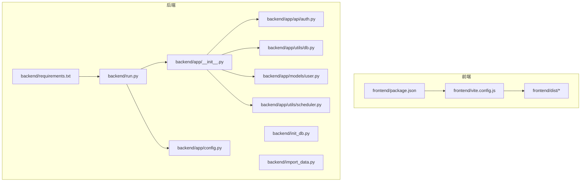
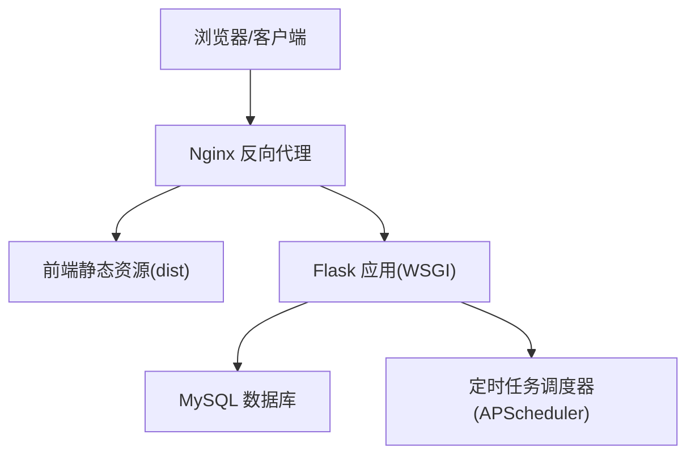
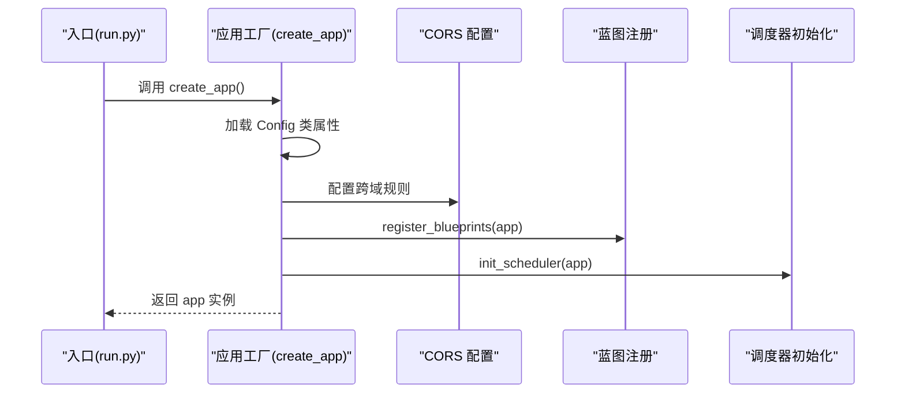
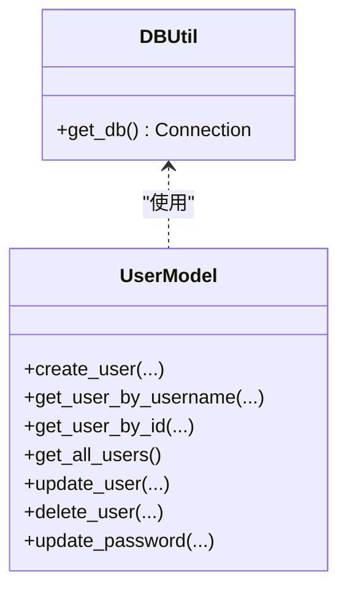
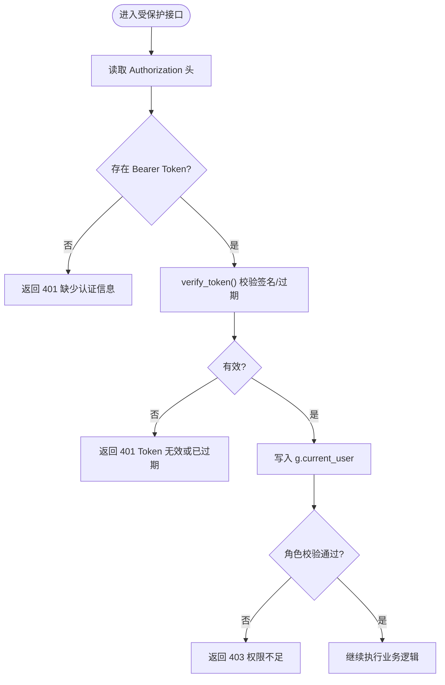
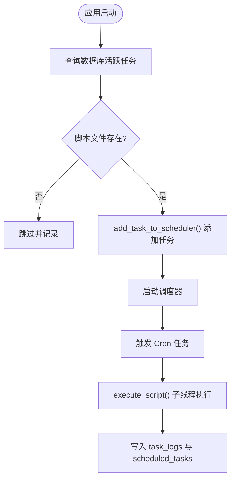
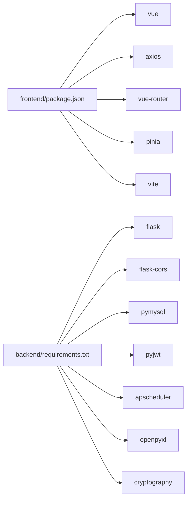

# 生产环境部署

<cite>
**本文引用的文件**
- [backend/app/__init__.py](file://backend/app/__init__.py)
- [backend/app/config.py](file://backend/app/config.py)
- [backend/run.py](file://backend/run.py)
- [backend/requirements.txt](file://backend/requirements.txt)
- [backend/app/utils/db.py](file://backend/app/utils/db.py)
- [backend/app/utils/auth.py](file://backend/app/utils/auth.py)
- [backend/app/utils/decorators.py](file://backend/app/utils/decorators.py)
- [backend/app/utils/scheduler.py](file://backend/app/utils/scheduler.py)
- [backend/app/models/user.py](file://backend/app/models/user.py)
- [backend/app/api/auth.py](file://backend/app/api/auth.py)
- [backend/init_db.py](file://backend/init_db.py)
- [backend/import_data.py](file://backend/import_data.py)
- [frontend/package.json](file://frontend/package.json)
- [frontend/vite.config.js](file://frontend/vite.config.js)
</cite>

## 目录
1. [简介](#简介)
2. [项目结构](#项目结构)
3. [核心组件](#核心组件)
4. [架构总览](#架构总览)
5. [详细组件分析](#详细组件分析)
6. [依赖分析](#依赖分析)
7. [性能考虑](#性能考虑)
8. [故障排查指南](#故障排查指南)
9. [结论](#结论)
10. [附录](#附录)

## 简介
本文件面向云运维平台的生产环境部署，提供一套完整的前后端分离部署策略与最佳实践，涵盖：
- 前端静态资源构建与发布
- 后端 Flask 应用部署与运行
- Nginx 反向代理与静态资源托管
- 生产环境环境变量与数据库连接配置
- 应用服务器（Gunicorn/uWSGI）选型与配置要点
- Docker 容器化与 docker-compose 编排思路
- HTTPS 证书、负载均衡与 SSL/TLS 安全配置建议
- 自动化部署脚本与流程设计

## 项目结构
该仓库采用前后端分离架构：
- 前端基于 Vue 3 + Vite，提供开发代理与构建产物
- 后端基于 Flask，提供 REST API 与定时任务调度
- 数据库初始化与数据导入脚本位于后端目录

**图表来源**
- [frontend/package.json:1-24](file://frontend/package.json#L1-L24)
- [frontend/vite.config.js:1-17](file://frontend/vite.config.js#L1-L17)
- [backend/run.py:1-8](file://backend/run.py#L1-L8)
- [backend/app/__init__.py:1-62](file://backend/app/__init__.py#L1-L62)
- [backend/app/config.py:1-21](file://backend/app/config.py#L1-L21)
- [backend/requirements.txt:1-9](file://backend/requirements.txt#L1-L9)
- [backend/app/utils/db.py:1-17](file://backend/app/utils/db.py#L1-L17)
- [backend/app/models/user.py:1-183](file://backend/app/models/user.py#L1-L183)
- [backend/app/api/auth.py:1-184](file://backend/app/api/auth.py#L1-L184)
- [backend/app/utils/scheduler.py:1-249](file://backend/app/utils/scheduler.py#L1-L249)
- [backend/init_db.py:1-263](file://backend/init_db.py#L1-L263)
- [backend/import_data.py:1-431](file://backend/import_data.py#L1-L431)

**章节来源**
- [frontend/package.json:1-24](file://frontend/package.json#L1-L24)
- [frontend/vite.config.js:1-17](file://frontend/vite.config.js#L1-L17)
- [backend/run.py:1-8](file://backend/run.py#L1-L8)
- [backend/app/__init__.py:1-62](file://backend/app/__init__.py#L1-L62)
- [backend/app/config.py:1-21](file://backend/app/config.py#L1-L21)
- [backend/requirements.txt:1-9](file://backend/requirements.txt#L1-L9)
- [backend/app/utils/db.py:1-17](file://backend/app/utils/db.py#L1-L17)
- [backend/app/models/user.py:1-183](file://backend/app/models/user.py#L1-L183)
- [backend/app/api/auth.py:1-184](file://backend/app/api/auth.py#L1-L184)
- [backend/app/utils/scheduler.py:1-249](file://backend/app/utils/scheduler.py#L1-L249)
- [backend/init_db.py:1-263](file://backend/init_db.py#L1-L263)
- [backend/import_data.py:1-431](file://backend/import_data.py#L1-L431)

## 核心组件
- Flask 应用工厂与蓝图注册：负责应用初始化、CORS 配置、定时任务调度器初始化以及各 API 蓝图注册。
- 配置管理：集中定义生产环境所需的密钥、数据库连接参数、服务监听地址与端口等。
- 数据库连接工具：封装 PyMySQL 连接参数，便于在应用与调度器中复用。
- 认证与权限：JWT 工具、装饰器实现 Bearer Token 认证与角色校验。
- 定时任务调度器：基于 APScheduler 的后台调度器，支持 Cron 表达式与任务日志持久化。
- 前端构建与代理：Vite 开发服务器与代理配置，生产构建产物输出至 dist。

**章节来源**
- [backend/app/__init__.py:6-34](file://backend/app/__init__.py#L6-L34)
- [backend/app/config.py:4-21](file://backend/app/config.py#L4-L21)
- [backend/app/utils/db.py:5-17](file://backend/app/utils/db.py#L5-L17)
- [backend/app/utils/auth.py:11-35](file://backend/app/utils/auth.py#L11-L35)
- [backend/app/utils/decorators.py:9-56](file://backend/app/utils/decorators.py#L9-L56)
- [backend/app/utils/scheduler.py:201-249](file://backend/app/utils/scheduler.py#L201-L249)
- [frontend/vite.config.js:4-16](file://frontend/vite.config.js#L4-L16)

## 架构总览
生产环境典型拓扑：
- 前端静态资源由 Nginx 提供；后端 Flask 应用通过反向代理暴露 API。
- 数据库独立部署，应用通过环境变量配置连接信息。
- 可选：使用 Gunicorn/uWSGI 作为 WSGI 服务器承载 Flask 应用。
- 可选：多实例部署 + 负载均衡 + SSL 终止。

[此图为概念性架构示意，不对应具体源码文件，故无“图表来源”]

## 详细组件分析

### Flask 应用工厂与蓝图注册
- 应用工厂负责：
  - 加载配置（含环境变量）
  - 注册 CORS（允许跨域）
  - 注册多个 API 蓝图（认证、用户、导出、任务、服务器、服务、应用、证书、记录、仪表盘、字典）
  - 初始化定时任务调度器
- 蓝图注册集中在统一函数中，便于扩展与维护。

**图表来源**
- [backend/run.py:1-8](file://backend/run.py#L1-L8)
- [backend/app/__init__.py:6-34](file://backend/app/__init__.py#L6-L34)
- [backend/app/__init__.py:37-62](file://backend/app/__init__.py#L37-L62)

**章节来源**
- [backend/run.py:1-8](file://backend/run.py#L1-L8)
- [backend/app/__init__.py:6-34](file://backend/app/__init__.py#L6-L34)
- [backend/app/__init__.py:37-62](file://backend/app/__init__.py#L37-L62)

### 配置管理（生产环境变量）
- 关键配置项（均来自环境变量）：
  - 密钥与 JWT 过期时间
  - 数据库连接参数（主机、端口、用户、密码、库名）
  - Flask 服务监听地址与端口
  - 上传目录与最大内容长度
- 建议在生产环境以环境变量注入，避免硬编码。

**章节来源**
- [backend/app/config.py:4-21](file://backend/app/config.py#L4-L21)

### 数据库连接与模型
- 数据库连接工具封装了 PyMySQL 连接参数，便于在应用与调度器中复用。
- 用户模型提供基础 CRUD 操作，配合认证与权限控制使用。

**图表来源**
- [backend/app/utils/db.py:5-17](file://backend/app/utils/db.py#L5-L17)
- [backend/app/models/user.py:8-183](file://backend/app/models/user.py#L8-L183)

**章节来源**
- [backend/app/utils/db.py:1-17](file://backend/app/utils/db.py#L1-L17)
- [backend/app/models/user.py:1-183](file://backend/app/models/user.py#L1-L183)

### 认证与权限控制
- JWT 工具：生成与验证 Token，支持过期时间与算法配置。
- 权限装饰器：从 Authorization 头解析 Bearer Token，校验后将用户信息写入 g 对象；支持角色白名单校验。

**图表来源**
- [backend/app/utils/decorators.py:9-56](file://backend/app/utils/decorators.py#L9-L56)
- [backend/app/utils/auth.py:38-56](file://backend/app/utils/auth.py#L38-L56)

**章节来源**
- [backend/app/utils/auth.py:11-35](file://backend/app/utils/auth.py#L11-L35)
- [backend/app/utils/auth.py:38-56](file://backend/app/utils/auth.py#L38-L56)
- [backend/app/utils/decorators.py:59-95](file://backend/app/utils/decorators.py#L59-L95)

### 定时任务调度器
- 从数据库加载活跃任务，解析 Cron 表达式，按需添加到调度器。
- 执行脚本时在独立线程中运行，记录任务日志与最终状态。
- 提供任务增删与配置提取辅助函数。

**图表来源**
- [backend/app/utils/scheduler.py:201-249](file://backend/app/utils/scheduler.py#L201-L249)
- [backend/app/utils/scheduler.py:146-185](file://backend/app/utils/scheduler.py#L146-L185)
- [backend/app/utils/scheduler.py:32-144](file://backend/app/utils/scheduler.py#L32-L144)

**章节来源**
- [backend/app/utils/scheduler.py:1-249](file://backend/app/utils/scheduler.py#L1-L249)

### 前端构建与代理
- Vite 开发服务器默认监听 0.0.0.0:3000，并配置 /api 代理到后端 Flask。
- 生产构建产物输出至 dist，可由 Nginx 直接托管。

**章节来源**
- [frontend/vite.config.js:4-16](file://frontend/vite.config.js#L4-L16)
- [frontend/package.json:6-10](file://frontend/package.json#L6-L10)

### 数据库初始化与数据导入
- 初始化脚本创建数据库与表结构，插入默认字典数据与管理员账户。
- 导入脚本从 Excel 文件解析并批量导入各类台账与账户信息。

**章节来源**
- [backend/init_db.py:22-258](file://backend/init_db.py#L22-L258)
- [backend/import_data.py:11-33](file://backend/import_data.py#L11-L33)

## 依赖分析
- 后端依赖：Flask、CORS、PyMySQL、JWT、APScheduler、OpenPyxl、Cryptography 等。
- 前端依赖：Vue 3、Element Plus、Axios、Pinia、Vue Router、Vite 等。
- 前端开发代理将 /api 请求转发至后端 Flask，默认地址见 Vite 配置。

**图表来源**
- [frontend/package.json:11-22](file://frontend/package.json#L11-L22)
- [backend/requirements.txt:1-9](file://backend/requirements.txt#L1-L9)

**章节来源**
- [frontend/package.json:1-24](file://frontend/package.json#L1-L24)
- [backend/requirements.txt:1-9](file://backend/requirements.txt#L1-L9)

## 性能考虑
- 数据库连接
  - 建议在生产环境使用连接池（如 PyMySQL 的连接池参数或 SQLAlchemy 池），避免频繁创建/销毁连接。
  - 控制并发与超时，结合慢查询日志优化。
- 应用服务器
  - 推荐使用 Gunicorn（gevent/eventlet 模式）或 uWSGI，合理设置 worker 数量与进程/线程模型。
  - 启用 keep-alive 与合适的超时配置。
- 前端静态资源
  - 启用 gzip/br 压缩与缓存头；CDN 加速与预加载策略提升首屏性能。
- 定时任务
  - Cron 表达式应避免高并发冲突；任务执行设置超时与重试策略；日志落库便于追踪。

[本节为通用性能建议，不直接分析具体源码文件，故无“章节来源”]

## 故障排查指南
- 认证失败
  - 检查 Authorization 头格式是否为 Bearer Token；确认 JWT Secret 与过期时间配置一致。
- 数据库连接异常
  - 核对 DB_HOST/PORT/USER/PASSWORD/DB_NAME 环境变量；确认网络连通与防火墙策略。
- 定时任务未执行
  - 检查调度器初始化日志；确认 Cron 表达式格式正确；脚本路径是否存在且可执行。
- 前端代理无效
  - 确认 Vite 代理配置指向正确的后端地址；浏览器控制台查看跨域与网络错误。

**章节来源**
- [backend/app/utils/decorators.py:20-46](file://backend/app/utils/decorators.py#L20-L46)
- [backend/app/utils/auth.py:38-56](file://backend/app/utils/auth.py#L38-L56)
- [backend/app/utils/db.py:8-16](file://backend/app/utils/db.py#L8-L16)
- [backend/app/utils/scheduler.py:201-249](file://backend/app/utils/scheduler.py#L201-L249)
- [frontend/vite.config.js:9-14](file://frontend/vite.config.js#L9-L14)

## 结论
本部署文档围绕前后端分离架构，给出了生产环境的关键配置点、运行模式与安全加固建议。建议在实际部署中结合企业级监控、日志聚合与自动扩缩容能力，持续优化可用性与安全性。

[本节为总结性内容，不直接分析具体源码文件，故无“章节来源”]

## 附录

### A. 生产环境环境变量清单
- Flask 服务
  - FLASK_HOST、FLASK_PORT、FLASK_DEBUG
- 安全与认证
  - SECRET_KEY、JWT_SECRET_KEY、JWT_EXPIRATION_HOURS
- 数据库
  - DB_HOST、DB_PORT、DB_USER、DB_PASSWORD、DB_NAME
- 其他
  - UPLOAD_FOLDER、MAX_CONTENT_LENGTH

**章节来源**
- [backend/app/config.py:4-21](file://backend/app/config.py#L4-L21)

### B. 前端静态资源构建与发布
- 构建命令：参考前端 package.json 中的构建脚本。
- 构建产物：dist 目录，由 Nginx 托管。
- 开发代理：Vite 默认代理 /api 到后端 Flask。

**章节来源**
- [frontend/package.json:6-10](file://frontend/package.json#L6-L10)
- [frontend/vite.config.js:4-16](file://frontend/vite.config.js#L4-L16)

### C. 后端 Flask 应用部署要点
- 应用启动：通过 run.py 启动，读取配置并运行。
- 蓝图注册：集中于应用工厂中的注册函数。
- 定时任务：应用启动时初始化调度器并加载活跃任务。

**章节来源**
- [backend/run.py:1-8](file://backend/run.py#L1-L8)
- [backend/app/__init__.py:37-62](file://backend/app/__init__.py#L37-L62)
- [backend/app/utils/scheduler.py:201-249](file://backend/app/utils/scheduler.py#L201-L249)

### D. Nginx 反向代理与静态资源托管
- 静态资源：将 dist 目录映射为静态站点根。
- 反向代理：将 /api 前缀转发至后端 Flask。
- 建议：开启 gzip/br 压缩、设置合理的缓存头与超时。

[本节为通用配置建议，不直接分析具体源码文件，故无“章节来源”]

### E. 应用服务器（Gunicorn/uWSGI）配置要点
- Gunicorn
  - workers 数量建议：CPU 核数 × 2 + 1
  - 启动命令：gunicorn --bind 0.0.0.0:8000 --workers N wsgi:app
- uWSGI
  - 配置文件中指定 socket/http、进程/线程、日志与缓冲区大小
- 建议：结合健康检查与自动重启策略

[本节为通用配置建议，不直接分析具体源码文件，故无“章节来源”]

### F. HTTPS 证书、负载均衡与 SSL/TLS
- 证书：使用 Let’s Encrypt 或企业 CA，配置 Nginx/TLS 终止。
- 负载均衡：Nginx/HAProxy/LBaaS 前置，启用健康检查与会话保持（如需）。
- TLS：启用现代协议与加密套件，禁用弱算法与过时协议。

[本节为通用配置建议，不直接分析具体源码文件，故无“章节来源”]

### G. 数据库初始化与数据导入
- 初始化：执行数据库初始化脚本，创建表结构与默认字典数据。
- 导入：准备 Excel 数据源，执行导入脚本完成批量数据入库。

**章节来源**
- [backend/init_db.py:22-258](file://backend/init_db.py#L22-L258)
- [backend/import_data.py:11-33](file://backend/import_data.py#L11-L33)

### H. 自动化部署流程（建议）
- 前端
  - 构建 dist → 上传至静态存储或 Nginx
- 后端
  - 安装依赖 → 应用数据库迁移/初始化 → 启动应用服务器 → 健康检查
- 运维
  - 配置监控告警、日志采集、备份策略与回滚预案

[本节为通用流程建议，不直接分析具体源码文件，故无“章节来源”]