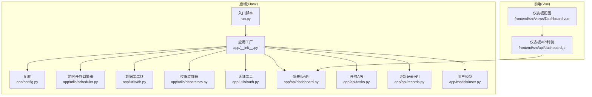
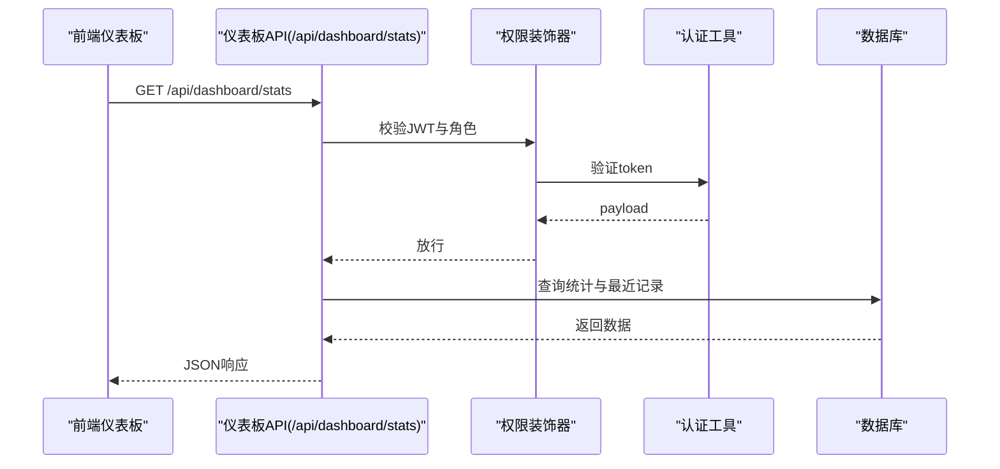
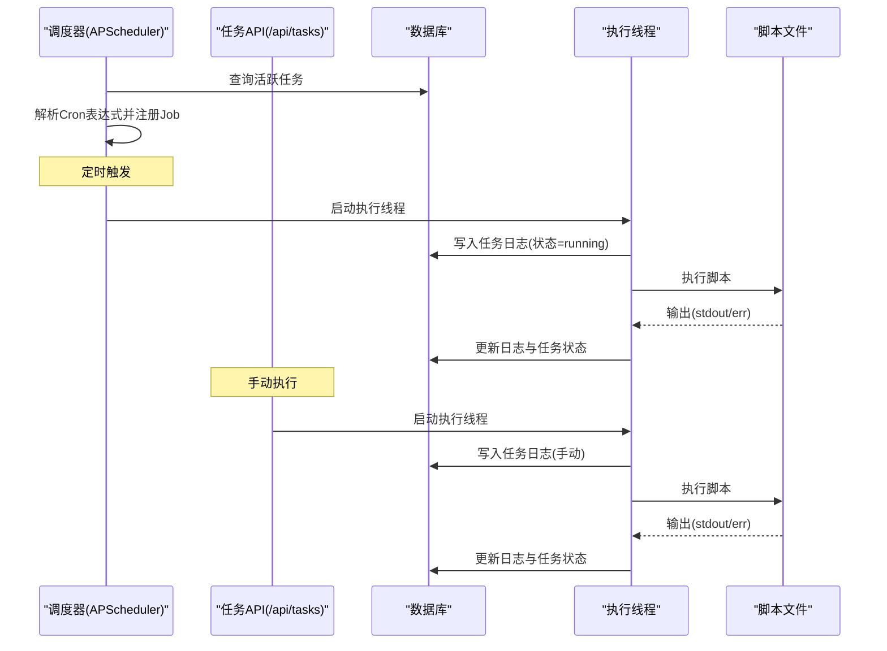
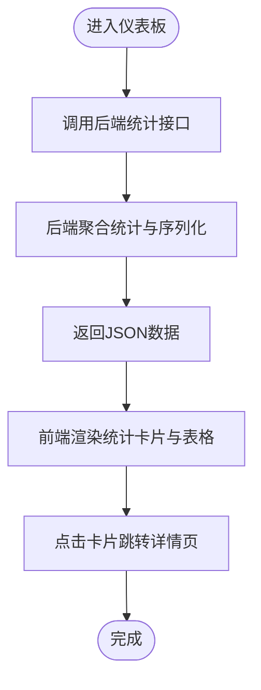
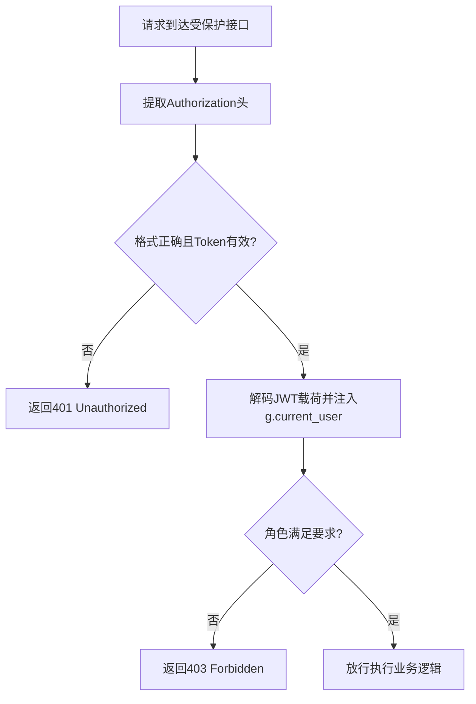
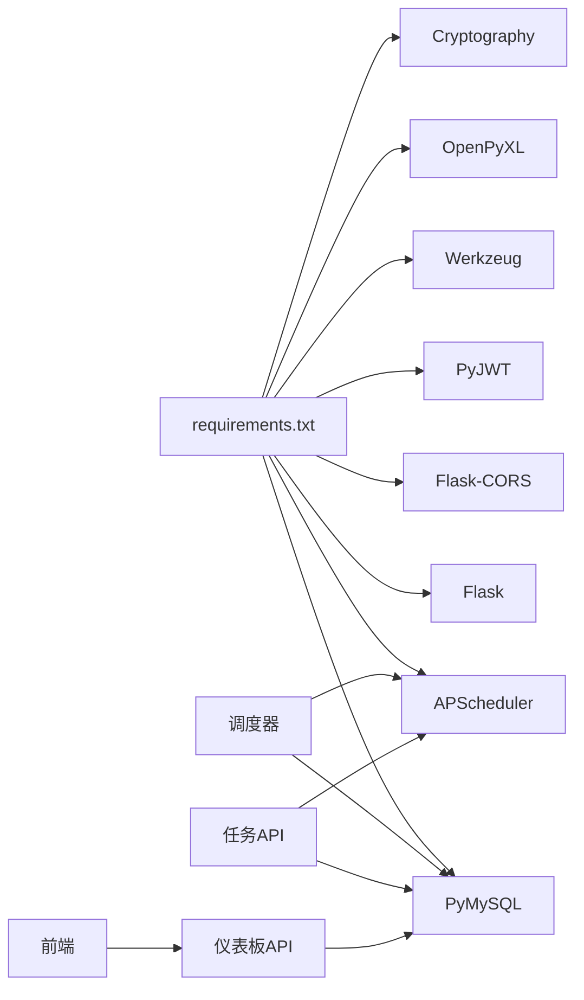

# 监控与运维

<cite>
**本文引用的文件**
- [backend/app/__init__.py](file://backend/app/__init__.py)
- [backend/app/config.py](file://backend/app/config.py)
- [backend/run.py](file://backend/run.py)
- [backend/app/utils/scheduler.py](file://backend/app/utils/scheduler.py)
- [backend/app/utils/db.py](file://backend/app/utils/db.py)
- [backend/app/utils/decorators.py](file://backend/app/utils/decorators.py)
- [backend/app/utils/auth.py](file://backend/app/utils/auth.py)
- [backend/app/api/dashboard.py](file://backend/app/api/dashboard.py)
- [backend/app/api/tasks.py](file://backend/app/api/tasks.py)
- [backend/app/api/records.py](file://backend/app/api/records.py)
- [backend/app/models/user.py](file://backend/app/models/user.py)
- [frontend/src/views/Dashboard.vue](file://frontend/src/views/Dashboard.vue)
- [frontend/src/api/dashboard.js](file://frontend/src/api/dashboard.js)
- [backend/requirements.txt](file://backend/requirements.txt)
</cite>

## 目录
1. [简介](#简介)
2. [项目结构](#项目结构)
3. [核心组件](#核心组件)
4. [架构总览](#架构总览)
5. [详细组件分析](#详细组件分析)
6. [依赖分析](#依赖分析)
7. [性能考虑](#性能考虑)
8. [故障排查指南](#故障排查指南)
9. [结论](#结论)
10. [附录](#附录)

## 简介
本文件面向云运维平台的监控与运维场景，围绕以下目标展开：
- 应用监控指标的采集与展示：系统资源监控、应用性能监控、数据库连接监控
- 日志收集与分析：前端错误日志、后端访问日志、业务日志的采集与存储
- 定时任务监控与管理：基于 APScheduler 的任务调度监控、任务执行状态跟踪
- 告警机制配置：邮件告警、微信告警、钉钉告警等通知方式
- 运维仪表板设计与实现：实时展示系统运行状态

当前代码库已具备基础的仪表板统计接口、定时任务调度与日志记录能力，以及前端仪表板页面。告警通知与日志采集方案可在现有基础上扩展。

## 项目结构
后端采用 Flask 微服务架构，通过蓝图组织 API；前端使用 Vue + Element Plus 构建仪表板界面。定时任务由 APScheduler 实现，数据库连接通过 PyMySQL 管理。

图表来源
- [backend/app/__init__.py:1-62](file://backend/app/__init__.py#L1-L62)
- [backend/app/config.py:1-21](file://backend/app/config.py#L1-L21)
- [backend/app/utils/scheduler.py:1-249](file://backend/app/utils/scheduler.py#L1-L249)
- [backend/app/utils/db.py:1-17](file://backend/app/utils/db.py#L1-L17)
- [backend/app/utils/decorators.py:1-95](file://backend/app/utils/decorators.py#L1-L95)
- [backend/app/utils/auth.py:1-83](file://backend/app/utils/auth.py#L1-L83)
- [backend/app/api/dashboard.py:1-91](file://backend/app/api/dashboard.py#L1-L91)
- [backend/app/api/tasks.py:1-458](file://backend/app/api/tasks.py#L1-L458)
- [backend/app/api/records.py:1-114](file://backend/app/api/records.py#L1-L114)
- [backend/app/models/user.py:1-183](file://backend/app/models/user.py#L1-L183)
- [frontend/src/views/Dashboard.vue:1-312](file://frontend/src/views/Dashboard.vue#L1-L312)
- [frontend/src/api/dashboard.js:1-6](file://frontend/src/api/dashboard.js#L1-L6)
- [backend/run.py:1-8](file://backend/run.py#L1-L8)

章节来源
- [backend/app/__init__.py:1-62](file://backend/app/__init__.py#L1-L62)
- [backend/app/config.py:1-21](file://backend/app/config.py#L1-L21)
- [backend/run.py:1-8](file://backend/run.py#L1-L8)
- [frontend/src/views/Dashboard.vue:1-312](file://frontend/src/views/Dashboard.vue#L1-L312)
- [frontend/src/api/dashboard.js:1-6](file://frontend/src/api/dashboard.js#L1-L6)

## 核心组件
- 应用工厂与蓝图注册：负责初始化 Flask 应用、CORS、注册各模块蓝图，并启动定时任务调度器。
- 定时任务调度器：基于 APScheduler，支持 Cron 表达式触发，执行脚本并将结果写入数据库。
- 数据库工具：统一获取数据库连接，供各模块使用。
- 权限与认证：JWT 认证与角色校验装饰器，保障 API 安全。
- 仪表板统计：聚合服务器、服务、应用、证书、更新记录等统计信息。
- 任务管理：创建、更新、删除、启用/禁用、手动执行定时任务，查看任务日志。
- 更新记录：增删改查变更记录，支持搜索与排序。
- 前端仪表板：调用后端统计接口，展示各类统计卡片与表格。

章节来源
- [backend/app/__init__.py:1-62](file://backend/app/__init__.py#L1-L62)
- [backend/app/utils/scheduler.py:1-249](file://backend/app/utils/scheduler.py#L1-L249)
- [backend/app/utils/db.py:1-17](file://backend/app/utils/db.py#L1-L17)
- [backend/app/utils/decorators.py:1-95](file://backend/app/utils/decorators.py#L1-L95)
- [backend/app/utils/auth.py:1-83](file://backend/app/utils/auth.py#L1-L83)
- [backend/app/api/dashboard.py:1-91](file://backend/app/api/dashboard.py#L1-L91)
- [backend/app/api/tasks.py:1-458](file://backend/app/api/tasks.py#L1-L458)
- [backend/app/api/records.py:1-114](file://backend/app/api/records.py#L1-L114)
- [frontend/src/views/Dashboard.vue:1-312](file://frontend/src/views/Dashboard.vue#L1-L312)
- [frontend/src/api/dashboard.js:1-6](file://frontend/src/api/dashboard.js#L1-L6)

## 架构总览
后端通过应用工厂集中初始化，定时任务在应用启动时从数据库加载并启动；前端通过 API 封装调用仪表板统计接口，渲染可视化卡片与表格。

图表来源
- [backend/app/api/dashboard.py:20-91](file://backend/app/api/dashboard.py#L20-L91)
- [backend/app/utils/decorators.py:9-57](file://backend/app/utils/decorators.py#L9-L57)
- [backend/app/utils/auth.py:38-56](file://backend/app/utils/auth.py#L38-L56)

章节来源
- [backend/app/api/dashboard.py:1-91](file://backend/app/api/dashboard.py#L1-L91)
- [backend/app/utils/decorators.py:1-95](file://backend/app/utils/decorators.py#L1-L95)
- [backend/app/utils/auth.py:1-83](file://backend/app/utils/auth.py#L1-L83)

## 详细组件分析

### 定时任务调度与监控
- 任务生命周期：从数据库加载活跃任务，解析 Cron 表达式，添加至 APScheduler；支持启用/禁用、更新、删除与手动执行。
- 执行流程：每次触发或手动执行时，创建任务日志记录，执行脚本（Python/Shell/SQL），捕获输出与错误，更新任务状态与最后运行时间。
- 并发与隔离：每个执行在独立线程中进行，避免阻塞调度器；数据库连接在执行线程内创建与释放。
- 超时与异常：设置脚本执行超时（默认 300 秒），捕获异常并记录错误信息。

图表来源
- [backend/app/utils/scheduler.py:146-249](file://backend/app/utils/scheduler.py#L146-L249)
- [backend/app/api/tasks.py:309-421](file://backend/app/api/tasks.py#L309-L421)

章节来源
- [backend/app/utils/scheduler.py:1-249](file://backend/app/utils/scheduler.py#L1-L249)
- [backend/app/api/tasks.py:1-458](file://backend/app/api/tasks.py#L1-L458)

### 仪表板统计与展示
- 统计维度：服务器、服务、应用系统、证书、更新记录数量；按环境类型统计服务器分布；证书到期提醒（剩余天数）；最近更新记录。
- 数据序列化：将日期类型转换为字符串，便于前端渲染。
- 前端交互：Dashboard.vue 组件通过 API 封装发起请求，渲染统计卡片与表格，并根据环境类型与剩余天数设置标签样式。

图表来源
- [frontend/src/views/Dashboard.vue:146-158](file://frontend/src/views/Dashboard.vue#L146-L158)
- [frontend/src/api/dashboard.js:3-5](file://frontend/src/api/dashboard.js#L3-L5)
- [backend/app/api/dashboard.py:20-91](file://backend/app/api/dashboard.py#L20-L91)

章节来源
- [frontend/src/views/Dashboard.vue:1-312](file://frontend/src/views/Dashboard.vue#L1-L312)
- [frontend/src/api/dashboard.js:1-6](file://frontend/src/api/dashboard.js#L1-L6)
- [backend/app/api/dashboard.py:1-91](file://backend/app/api/dashboard.py#L1-L91)

### 权限与认证
- JWT 认证：从 Authorization 头提取 Bearer Token，验证通过后将用户信息注入 g 对象。
- 角色校验：在需要管理员或运维人员权限的接口上使用角色装饰器进行二次校验。
- 密码处理：使用 Werkzeug 生成密码哈希，提供密码校验功能。

图表来源
- [backend/app/utils/decorators.py:9-57](file://backend/app/utils/decorators.py#L9-L57)
- [backend/app/utils/auth.py:38-56](file://backend/app/utils/auth.py#L38-L56)

章节来源
- [backend/app/utils/decorators.py:1-95](file://backend/app/utils/decorators.py#L1-L95)
- [backend/app/utils/auth.py:1-83](file://backend/app/utils/auth.py#L1-L83)
- [backend/app/models/user.py:1-183](file://backend/app/models/user.py#L1-L183)

### 日志收集与分析（建议方案）
当前系统已具备任务执行日志记录能力，建议扩展如下：
- 前端错误日志：在前端应用中拦截全局错误与 Promise 拒绝，将错误堆栈、用户信息、页面路径、时间戳等打包上报至后端日志接口。
- 后端访问日志：在应用工厂或中间件中统一记录请求方法、URL、客户端IP、响应状态码、耗时等信息。
- 业务日志：在关键业务流程处记录操作人、操作类型、对象标识、变更前后值等审计日志。
- 存储与检索：建议引入集中式日志系统（如 ELK/EFK 或 Loki+Grafana），对三类日志进行分类存储与可视化检索。

[本节为概念性方案说明，不直接分析具体文件，故无“章节来源”]

### 告警机制配置（建议方案）
- 邮件告警：集成 SMTP 发送器，当任务执行失败、数据库连接异常或仪表板关键指标异常时发送告警邮件。
- 微信/钉钉告警：对接企业微信或钉钉机器人 Webhook，将告警消息以卡片或文本形式推送至群聊。
- 告警示例：任务超时、连续失败、数据库连接断开、证书即将到期等。
- 告警策略：支持分级阈值、去重合并、静默窗口、恢复通知等。

[本节为概念性方案说明，不直接分析具体文件，故无“章节来源”]

## 依赖分析
- 外部依赖：Flask、Flask-CORS、PyMySQL、PyJWT、Werkzeug、APScheduler、OpenPyXL、Cryptography。
- 组件耦合：调度器与任务 API 强耦合（共享数据库配置与执行逻辑）；仪表板 API 与数据库强耦合；前端与后端 API 通过 REST 接口耦合。

图表来源
- [backend/requirements.txt:1-9](file://backend/requirements.txt#L1-L9)
- [backend/app/utils/scheduler.py:1-249](file://backend/app/utils/scheduler.py#L1-L249)
- [backend/app/api/tasks.py:1-458](file://backend/app/api/tasks.py#L1-L458)
- [backend/app/api/dashboard.py:1-91](file://backend/app/api/dashboard.py#L1-L91)

章节来源
- [backend/requirements.txt:1-9](file://backend/requirements.txt#L1-L9)

## 性能考虑
- 数据库连接：统一通过工具函数获取连接，避免重复创建；执行线程内创建与释放连接，降低连接池压力。
- 定时任务并发：任务执行在独立线程中进行，避免阻塞调度器；建议限制并发度或引入队列控制。
- 前端渲染：仪表板数据量较大时，建议分页或懒加载；对日期字段进行本地化格式化。
- 超时与异常：脚本执行设置超时，异常捕获与回滚，减少长时间占用。

[本节提供通用指导，不直接分析具体文件，故无“章节来源”]

## 故障排查指南
- 定时任务未执行
  - 检查任务是否处于启用状态且脚本路径存在
  - 查看任务日志表中最近执行记录与错误信息
  - 确认调度器已启动且 Cron 表达式正确
- 任务执行失败
  - 查看任务日志中的错误信息与输出
  - 检查脚本权限与依赖
  - 关注超时与数据库连接异常
- 仪表板数据为空
  - 确认数据库连接配置正确
  - 检查统计查询 SQL 与表结构
- 前端无法访问
  - 检查 CORS 配置与跨域策略
  - 确认后端服务监听地址与端口

章节来源
- [backend/app/utils/scheduler.py:201-249](file://backend/app/utils/scheduler.py#L201-L249)
- [backend/app/api/tasks.py:423-458](file://backend/app/api/tasks.py#L423-L458)
- [backend/app/api/dashboard.py:20-91](file://backend/app/api/dashboard.py#L20-L91)
- [backend/app/__init__.py:24-25](file://backend/app/__init__.py#L24-L25)

## 结论
该云运维平台已具备基础的仪表板统计、定时任务调度与日志记录能力。建议在现有基础上扩展：
- 日志采集：统一收集前端错误、后端访问与业务日志，并接入集中式日志系统
- 告警机制：完善邮件、微信、钉钉等多渠道告警
- 监控指标：补充系统资源、应用性能与数据库连接监控面板
- 运维仪表板：增加实时状态卡片、趋势图表与告警看板

[本节为总结性内容，不直接分析具体文件，故无“章节来源”]

## 附录
- 启动方式：通过入口脚本启动 Flask 应用，默认读取配置文件中的主机、端口与调试模式。
- 配置项：数据库连接、JWT 密钥、上传目录、最大内容长度等。

章节来源
- [backend/run.py:1-8](file://backend/run.py#L1-L8)
- [backend/app/config.py:1-21](file://backend/app/config.py#L1-L21)