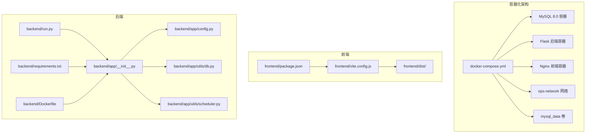
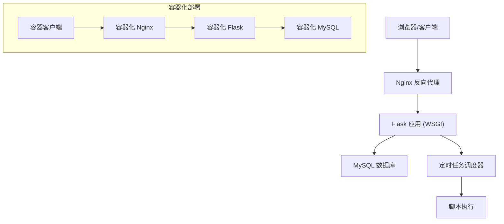
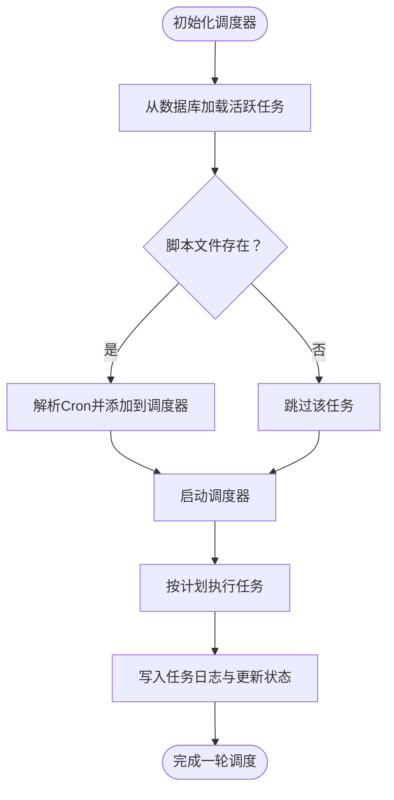
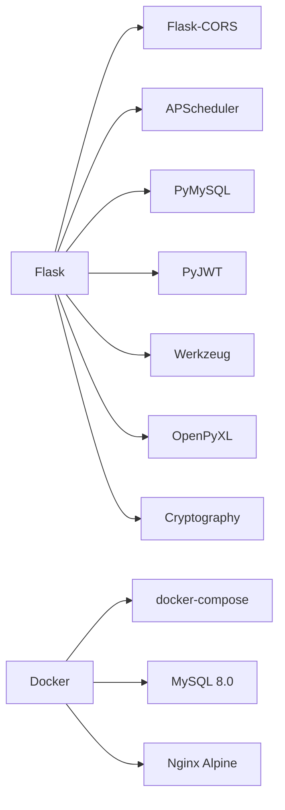

# 部署与运维

<cite>
**本文引用的文件**
- [backend/app/config.py](file://backend/app/config.py)
- [backend/run.py](file://backend/run.py)
- [backend/app/__init__.py](file://backend/app/__init__.py)
- [backend/app/utils/db.py](file://backend/app/utils/db.py)
- [backend/app/utils/scheduler.py](file://backend/app/utils/scheduler.py)
- [backend/requirements.txt](file://backend/requirements.txt)
- [frontend/vite.config.js](file://frontend/vite.config.js)
- [frontend/package.json](file://frontend/package.json)
- [docker-compose.yml](file://docker-compose.yml)
- [backend/Dockerfile](file://backend/Dockerfile)
- [nginx.conf](file://nginx.conf)
- [ssl_cert_monitor/ssl_cert_monitor.py](file://ssl_cert_monitor/ssl_cert_monitor.py)
</cite>

## 目录
1. [简介](#简介)
2. [项目结构](#项目结构)
3. [核心组件](#核心组件)
4. [架构总览](#架构总览)
5. [详细组件分析](#详细组件分析)
6. [依赖分析](#依赖分析)
7. [性能考虑](#性能考虑)
8. [故障排除指南](#故障排除指南)
9. [结论](#结论)
10. [附录](#附录)

## 简介
本文件面向云运维平台的部署与运维团队，提供开发与生产环境的部署配置说明、前后端分离部署策略、Nginx反向代理与HTTPS配置建议、负载均衡方案、**Docker容器化与服务编排**、CI/CD流水线思路、监控告警与日志分析、性能优化策略、故障排除、备份恢复、版本升级流程及运维最佳实践。内容基于仓库中的后端Flask应用与前端Vite工程的实际实现进行梳理，并给出可落地的运维建议。

## 项目结构
- 后端采用Python Flask框架，通过配置类集中管理环境变量与数据库连接参数，支持在不同环境中通过环境变量覆盖默认值。
- 前端采用Vue 3 + Vite，开发服务器内置代理指向后端API地址，构建产物位于dist目录，可由Web服务器或Nginx提供静态资源服务。
- 定时任务模块基于APScheduler，支持从数据库加载计划任务并在应用启动时初始化调度器。
- **新增Docker容器化部署**：提供完整的容器化微服务架构，包括数据库、后端API、前端Nginx服务的编排配置。



**图表来源**
- [docker-compose.yml:1-75](file://docker-compose.yml#L1-L75)
- [backend/Dockerfile:1-36](file://backend/Dockerfile#L1-L36)
- [frontend/package.json:1-24](file://frontend/package.json#L1-L24)
- [frontend/vite.config.js:1-17](file://frontend/vite.config.js#L1-L17)
- [backend/app/config.py:1-21](file://backend/app/config.py#L1-L21)
- [backend/app/__init__.py:1-62](file://backend/app/__init__.py#L1-L62)
- [backend/run.py:1-8](file://backend/run.py#L1-L8)
- [backend/app/utils/db.py:1-17](file://backend/app/utils/db.py#L1-L17)
- [backend/app/utils/scheduler.py:1-249](file://backend/app/utils/scheduler.py#L1-L249)
- [backend/requirements.txt:1-9](file://backend/requirements.txt#L1-L9)

**章节来源**
- [docker-compose.yml:1-75](file://docker-compose.yml#L1-L75)
- [backend/Dockerfile:1-36](file://backend/Dockerfile#L1-L36)
- [backend/app/config.py:1-21](file://backend/app/config.py#L1-L21)
- [backend/app/__init__.py:1-62](file://backend/app/__init__.py#L1-L62)
- [frontend/vite.config.js:1-17](file://frontend/vite.config.js#L1-L17)
- [frontend/package.json:1-24](file://frontend/package.json#L1-L24)
- [backend/requirements.txt:1-9](file://backend/requirements.txt#L1-L9)

## 核心组件
- 配置中心：集中定义密钥、JWT、数据库连接、服务监听地址与端口、上传目录与最大文件大小等。
- 应用工厂：创建Flask应用，注册CORS、蓝图、定时任务调度器。
- 数据库工具：封装pymysql连接参数，统一获取连接。
- 定时任务调度器：从数据库加载活跃任务，解析Cron表达式，执行脚本并记录日志。
- 运行入口：本地开发时直接启动Flask应用；生产环境建议通过WSGI服务器与Nginx配合部署。
- **Docker容器化**：提供完整的容器化微服务架构，支持服务编排、健康检查、环境变量管理等生产级特性。

**章节来源**
- [backend/app/config.py:1-21](file://backend/app/config.py#L1-L21)
- [backend/app/__init__.py:1-62](file://backend/app/__init__.py#L1-L62)
- [backend/app/utils/db.py:1-17](file://backend/app/utils/db.py#L1-L17)
- [backend/app/utils/scheduler.py:1-249](file://backend/app/utils/scheduler.py#L1-L249)
- [backend/run.py:1-8](file://backend/run.py#L1-L8)
- [docker-compose.yml:1-75](file://docker-compose.yml#L1-L75)
- [backend/Dockerfile:1-36](file://backend/Dockerfile#L1-L36)

## 架构总览
下图展示前后端分离部署的典型拓扑：前端构建产物由Nginx提供静态服务，请求通过反向代理转发至后端WSGI进程；数据库由独立实例提供服务；定时任务在后端进程中按计划执行。**新增容器化部署架构**：所有服务通过Docker容器运行，使用docker-compose进行编排管理。



[此图为概念性架构示意，不对应具体源码文件，故不提供图表来源]

## 详细组件分析

### 配置与环境变量
- 关键配置项包括密钥、JWT密钥与过期时间、数据库主机/端口/用户/密码/库名、调试模式、监听地址与端口、上传目录与最大文件大小。
- 生产环境必须通过环境变量覆盖默认值，避免硬编码敏感信息。
- 建议将配置拆分为开发、测试、生产三套，分别注入不同环境变量集。
- **Docker环境变量**：通过docker-compose的environment字段管理，支持默认值覆盖。

**章节来源**
- [backend/app/config.py:1-21](file://backend/app/config.py#L1-L21)
- [docker-compose.yml:33-43](file://docker-compose.yml#L33-L43)

### 应用工厂与蓝图注册
- 应用工厂负责创建Flask实例、加载配置、启用CORS、注册全部蓝图。
- 根路径返回服务状态信息，便于健康检查。
- 建议在生产环境开启更严格的CORS白名单，仅允许受信域名访问。

**章节来源**
- [backend/app/__init__.py:1-62](file://backend/app/__init__.py#L1-L62)

### 数据库连接工具
- 统一封装pymysql连接参数，从当前应用配置读取数据库参数。
- 建议在生产环境使用连接池与只读副本，提升并发与可用性。

**章节来源**
- [backend/app/utils/db.py:1-17](file://backend/app/utils/db.py#L1-L17)

### 定时任务调度器
- 从数据库查询活跃任务，解析Cron表达式，添加到调度器。
- 执行脚本时在独立线程中运行，记录开始/结束时间、状态、输出与错误信息。
- 支持超时控制与异常捕获，确保调度器稳定运行。



**图表来源**
- [backend/app/utils/scheduler.py:201-249](file://backend/app/utils/scheduler.py#L201-L249)

**章节来源**
- [backend/app/utils/scheduler.py:1-249](file://backend/app/utils/scheduler.py#L1-L249)

### 前端构建与开发代理
- 开发服务器默认监听0.0.0.0:3000，并通过代理将/api前缀请求转发至后端地址。
- 构建产物位于dist目录，需由Nginx或静态Web服务器提供服务。
- 建议生产构建时配置基础路径与资源路径，确保CDN与缓存生效。

**章节来源**
- [frontend/vite.config.js:1-17](file://frontend/vite.config.js#L1-L17)
- [frontend/package.json:1-24](file://frontend/package.json#L1-L24)

### 运行入口与本地开发
- 本地运行时根据配置类的HOST/PORT/DEBUG启动Flask开发服务器。
- 生产环境建议使用Gunicorn/uWSGI等WSGI服务器，并结合Nginx进行反向代理与静态资源服务。

**章节来源**
- [backend/run.py:1-8](file://backend/run.py#L1-L8)

### Docker容器化部署

#### 容器化架构概述
项目提供了完整的Docker容器化部署方案，采用docker-compose进行多服务编排，包含以下核心组件：
- **MySQL 8.0容器**：提供数据库服务，支持健康检查与数据持久化
- **Flask后端容器**：运行Python Flask应用，支持环境变量注入与文件上传目录映射
- **Nginx前端容器**：提供静态资源服务与反向代理，支持Vue Router历史模式

#### 服务编排配置
docker-compose文件定义了完整的微服务架构，包括：
- **网络隔离**：创建专用的ops-network网络，确保服务间通信安全
- **数据持久化**：使用mysql_data卷保存数据库数据，防止容器重启丢失数据
- **服务依赖**：后端服务依赖MySQL健康检查，前端服务依赖后端服务
- **端口映射**：MySQL映射3306端口，后端映射5000端口，前端映射80端口

#### 健康检查机制
- **MySQL健康检查**：通过mysqladmin ping命令检测数据库可用性
- **服务依赖**：后端容器等待MySQL服务变为健康状态后再启动
- **自动重启**：配置unless-stopped策略，确保服务异常退出后自动恢复

#### 环境变量管理
- **数据库配置**：通过环境变量配置MySQL连接参数
- **应用配置**：设置Flask应用的主机、端口、调试模式等参数
- **密钥管理**：支持通过环境变量注入SECRET_KEY和JWT_SECRET_KEY
- **默认值保护**：使用${VARIABLE:-default_value}语法提供默认值

#### 文件系统与卷管理
- **上传目录映射**：将后端上传目录映射到宿主机，支持文件持久化
- **静态资源共享**：前端Nginx容器挂载构建产物目录
- **初始化脚本**：支持数据库初始化脚本的自动执行

#### Dockerfile构建配置
- **基础镜像**：使用python:3.11-slim官方镜像，减少镜像体积
- **系统依赖**：安装gcc、default-libmysqlclient-dev等编译依赖
- **Python依赖**：使用requirements.txt安装完整依赖栈
- **工作目录**：设置/app为工作目录，支持应用代码复制
- **端口暴露**：暴露5000端口供外部访问

#### Nginx反向代理配置
- **静态资源缓存**：对JS、CSS、图片等静态资源设置1年缓存
- **API代理**：将/api前缀请求转发至后端Flask服务
- **Vue Router支持**：配置history模式下的路由回退机制
- **头部传递**：正确传递Host、X-Real-IP、X-Forwarded-For等头部信息

**章节来源**
- [docker-compose.yml:1-75](file://docker-compose.yml#L1-L75)
- [backend/Dockerfile:1-36](file://backend/Dockerfile#L1-L36)
- [nginx.conf:1-41](file://nginx.conf#L1-L41)

## 依赖分析
- 后端依赖包括Flask、Flask-CORS、PyMySQL、PyJWT、Werkzeug、APScheduler、OpenPyXL、Cryptography等。
- 建议锁定依赖版本，定期扫描安全漏洞并升级。
- **Docker环境依赖**：容器化部署需要Docker和docker-compose环境支持。



**图表来源**
- [backend/requirements.txt:1-9](file://backend/requirements.txt#L1-L9)
- [docker-compose.yml:1-75](file://docker-compose.yml#L1-L75)

**章节来源**
- [backend/requirements.txt:1-9](file://backend/requirements.txt#L1-L9)
- [docker-compose.yml:1-75](file://docker-compose.yml#L1-L75)

## 性能考虑
- 数据库层
  - 使用连接池减少连接开销；对高频查询建立索引；限制单表数据规模与分区策略。
  - 主从复制与只读副本分流读流量。
- 应用层
  - 合理设置并发与超时；对大文件上传增加限速与校验；启用GZip压缩。
  - 对定时任务执行时间进行削峰填谷，避免高峰期集中触发。
- 前端层
  - 构建产物启用长期缓存与CDN；按需加载与懒加载；减少第三方依赖体积。
- 网络层
  - Nginx启用gzip、keepalive、缓存静态资源；合理设置超时与队列长度。
- **容器化性能**
  - 使用轻量级基础镜像（python:3.11-slim）减少资源占用
  - 合理配置容器资源限制，避免资源争用
  - 使用只读文件系统增强安全性

[本节为通用性能建议，不直接分析具体文件，故不提供章节来源]

## 故障排除指南
- 启动失败
  - 检查环境变量是否正确注入；确认数据库连通性与凭据；核对端口占用情况。
  - **容器化故障**：使用docker-compose logs查看各服务日志，检查依赖关系
- CORS问题
  - 生产环境应限制允许的源，避免使用通配符；检查凭证跨域配置。
- 定时任务异常
  - 查看任务日志与错误信息；确认脚本路径存在且可执行；检查超时与权限。
- 文件上传失败
  - 检查上传目录权限与磁盘空间；确认MAX_CONTENT_LENGTH与Nginx上传限制。
- 健康检查
  - 访问根路径返回的服务状态信息，确认服务正常运行。
- **容器化故障**
  - 使用docker ps查看容器状态，docker inspect检查容器配置
  - 检查网络连接和端口映射是否正确
  - 验证卷挂载和数据持久化配置

**章节来源**
- [backend/app/__init__.py:10-17](file://backend/app/__init__.py#L10-L17)
- [backend/app/config.py:19-21](file://backend/app/config.py#L19-L21)
- [backend/app/utils/scheduler.py:99-133](file://backend/app/utils/scheduler.py#L99-L133)
- [docker-compose.yml:21-24](file://docker-compose.yml#L21-L24)

## 结论
本项目采用前后端分离架构，后端以Flask为核心，具备清晰的配置体系、统一的数据库连接与可扩展的定时任务机制。**新增的Docker容器化部署方案**提供了完整的微服务架构，支持服务编排、健康检查、环境变量管理等生产级特性。生产部署建议结合Nginx反向代理、WSGI服务器、数据库高可用与CDN缓存，配套完善的监控告警与日志分析体系，确保系统稳定、可扩展与可维护。

[本节为总结性内容，不直接分析具体文件，故不提供章节来源]

## 附录

### 开发环境部署配置
- 环境变量示例（开发）
  - FLASK_DEBUG=true
  - FLASK_HOST=0.0.0.0
  - FLASK_PORT=5000
  - DB_HOST=localhost
  - DB_PORT=3306
  - DB_USER=ops_user
  - DB_PASSWORD=ops_password
  - DB_NAME=ops_platform
  - SECRET_KEY=your-secret-key
  - JWT_SECRET_KEY=your-jwt-secret
- 前端开发代理
  - Vite开发服务器监听0.0.0.0:3000，代理/api到后端地址。
- 本地启动
  - 后端：直接运行入口文件启动开发服务器。
  - 前端：执行构建脚本生成dist目录。

**章节来源**
- [backend/app/config.py:15-17](file://backend/app/config.py#L15-L17)
- [backend/app/config.py:9-13](file://backend/app/config.py#L9-L13)
- [backend/app/config.py:4-7](file://backend/app/config.py#L4-L7)
- [frontend/vite.config.js:6-15](file://frontend/vite.config.js#L6-L15)
- [backend/run.py:6-7](file://backend/run.py#L6-L7)
- [frontend/package.json:6-10](file://frontend/package.json#L6-L10)

### 生产环境部署配置
- 环境变量示例（生产）
  - FLASK_DEBUG=false
  - FLASK_HOST=0.0.0.0
  - FLASK_PORT=5000
  - DB_HOST=mysql.ops.internal
  - DB_PORT=3306
  - DB_USER=ops_prod_user
  - DB_PASSWORD=prod_db_password
  - DB_NAME=ops_platform
  - SECRET_KEY=change-me-in-prod
  - JWT_SECRET_KEY=change-me-in-prod
- Web服务器与反向代理
  - Nginx监听80/443，静态资源走Nginx，/api前缀转发至后端WSGI。
  - 启用Gzip、缓存、限流与健康检查。
- WSGI服务器
  - 使用Gunicorn/uWSGI承载Flask应用，多进程/多线程配置依据CPU与内存调优。
- 数据库
  - 使用主从复制与只读副本；开启慢查询日志与性能分析。
- 定时任务
  - 单实例部署，确保任务幂等与超时控制；记录详细日志以便审计。

**章节来源**
- [backend/app/config.py:15-17](file://backend/app/config.py#L15-L17)
- [backend/app/config.py:9-13](file://backend/app/config.py#L9-L13)
- [backend/app/config.py:4-7](file://backend/app/config.py#L4-L7)
- [backend/app/__init__.py:24-25](file://backend/app/__init__.py#L24-L25)

### Docker容器化部署配置

#### 基础环境准备
- Docker环境要求：Docker Engine 20.10+，Docker Compose 3.8+
- 系统资源：至少4GB内存，推荐8GB以上
- 端口占用：确保3306、5000、80端口未被占用

#### 本地开发部署
1. **环境准备**
   ```bash
   # 克隆项目并进入目录
   git clone <repository-url>
   cd yunweipingtai
   
   # 设置环境变量（可选）
   export SECRET_KEY=your-secret-key
   export JWT_SECRET_KEY=your-jwt-secret
   ```

2. **启动服务**
   ```bash
   # 启动所有服务
   docker-compose up -d
   
   # 查看服务状态
   docker-compose ps
   
   # 查看日志
   docker-compose logs -f
   ```

3. **服务访问**
   - 前端：http://localhost
   - 后端API：http://localhost/api/
   - 数据库：localhost:3306

#### 生产环境部署
1. **环境变量配置**
   ```bash
   # 创建.env文件
   cat > .env << EOF
   SECRET_KEY=your-production-secret-key-here
   JWT_SECRET_KEY=your-production-jwt-key-here
   MYSQL_ROOT_PASSWORD=your-mysql-root-password
   EOF
   ```

2. **数据库初始化**
   - 首次启动会自动执行init_db.py脚本
   - 支持自定义初始化SQL文件
   - 数据持久化到mysql_data卷

3. **服务编排**
   ```bash
   # 启动服务
   docker-compose up -d
   
   # 健康检查
   docker-compose ps
   
   # 监控日志
   docker-compose logs -f backend
   ```

#### 容器管理命令
- **查看服务状态**：`docker-compose ps`
- **查看日志**：`docker-compose logs -f service-name`
- **停止服务**：`docker-compose down`
- **重启服务**：`docker-compose restart service-name`
- **进入容器**：`docker-compose exec service-name bash`

#### 数据备份与恢复
1. **数据库备份**
   ```bash
   # 备份数据卷
   docker run --rm \
     -v mysql_data:/data \
     -v $(pwd):/backup \
     alpine tar czf /backup/mysql_backup.tar.gz -C /data .
   ```

2. **数据恢复**
   ```bash
   # 恢复数据卷
   docker run --rm \
     -v mysql_data:/data \
     -v $(pwd):/backup \
     alpine tar xzf /backup/mysql_backup.tar.gz -C /data
   ```

#### 环境变量参考
- **数据库相关**
  - DB_HOST: 数据库主机地址（默认：mysql）
  - DB_PORT: 数据库端口（默认：3306）
  - DB_USER: 数据库用户名（默认：root）
  - DB_PASSWORD: 数据库密码（默认：Pass1234.）
  - DB_NAME: 数据库名称（默认：ops_platform）

- **应用相关**
  - FLASK_HOST: Flask监听地址（默认：0.0.0.0）
  - FLASK_PORT: Flask端口（默认：5000）
  - FLASK_DEBUG: 调试模式（默认：false）
  - SECRET_KEY: 应用密钥（默认：ops-platform-secret-key-change-in-prod）
  - JWT_SECRET_KEY: JWT密钥（默认：jwt-secret-key-change-in-prod）

**章节来源**
- [docker-compose.yml:1-75](file://docker-compose.yml#L1-L75)
- [backend/Dockerfile:1-36](file://backend/Dockerfile#L1-L36)
- [backend/app/config.py:4-21](file://backend/app/config.py#L4-L21)

### HTTPS与证书配置
- 建议使用Let's Encrypt自动签发与续期证书。
- Nginx配置SSL监听与证书路径，启用TLS1.2+与强密码套件。
- 强制HTTP重定向至HTTPS，配置HSTS头。

**章节来源**
- [backend/app/__init__.py:24-25](file://backend/app/__init__.py#L24-L25)

### 负载均衡方案
- 多实例后端：使用Nginx作为四层/七层负载均衡，健康检查后端存活。
- 会话保持：若业务需要，可配置基于Cookie的会话亲和。
- 前端静态资源：CDN分发，缩短边缘延迟。

**章节来源**
- [backend/app/__init__.py:24-25](file://backend/app/__init__.py#L24-L25)

### CI/CD流水线（建议）
- 触发条件：push到主分支或打标签。
- 步骤建议：代码检查、单元测试、构建前端产物、构建后端镜像、推送镜像、部署到预生产、自动化验收测试、发布到生产。
- 安全扫描：镜像漏洞扫描与依赖安全检查。
- 回滚策略：支持一键回滚至上一版本。

**章节来源**
- [frontend/package.json:6-10](file://frontend/package.json#L6-L10)
- [backend/requirements.txt:1-9](file://backend/requirements.txt#L1-L9)

### 监控告警与日志
- 指标采集：应用性能、数据库QPS、连接数、错误率、响应时间、任务执行时长与成功率。
- 日志：后端应用日志、Nginx访问/错误日志、定时任务执行日志；集中存储与检索。
- 告警：阈值告警、异常检测、SLA告警；分级通知与自愈机制。
- **容器化监控**：使用Docker内置监控或第三方监控工具，监控容器资源使用情况。

**章节来源**
- [backend/app/utils/scheduler.py:32-97](file://backend/app/utils/scheduler.py#L32-L97)

### 备份与恢复
- 数据库备份：全量+增量备份，周期性校验与异地容灾。
- 配置备份：环境变量与密钥通过安全渠道备份与轮换。
- 恢复演练：定期进行RTO/RPO验证，完善应急预案。
- **容器化备份**：使用Docker卷快照或数据导出方式进行备份。

**章节来源**
- [backend/app/utils/db.py:8-16](file://backend/app/utils/db.py#L8-L16)

### 版本升级流程
- 前端：构建新版本，灰度发布，验证功能与兼容性。
- 后端：蓝绿/滚动发布，数据库迁移脚本先行，回滚策略就绪。
- 回滚：快速回滚至上一稳定版本，修复后再发布。
- **容器化升级**：使用docker-compose pull拉取新镜像，重新部署服务。

**章节来源**
- [frontend/package.json:6-10](file://frontend/package.json#L6-L10)
- [backend/app/utils/scheduler.py:201-249](file://backend/app/utils/scheduler.py#L201-L249)

### 运维最佳实践
- 最小权限原则：数据库与文件系统权限最小化。
- 密钥管理：使用密钥管理服务或安全配置中心。
- 审计与合规：操作审计、日志留存、合规检查。
- 文档与培训：完善部署与运维手册，定期演练。
- **容器化最佳实践**：
  - 使用只读文件系统增强安全性
  - 合理配置资源限制，避免资源争用
  - 使用健康检查确保服务可用性
  - 定期更新基础镜像，修补安全漏洞

**章节来源**
- [backend/app/config.py:4-7](file://backend/app/config.py#L4-L7)
- [backend/app/config.py:9-13](file://backend/app/config.py#L9-L13)
- [docker-compose.yml:21-24](file://docker-compose.yml#L21-L24)