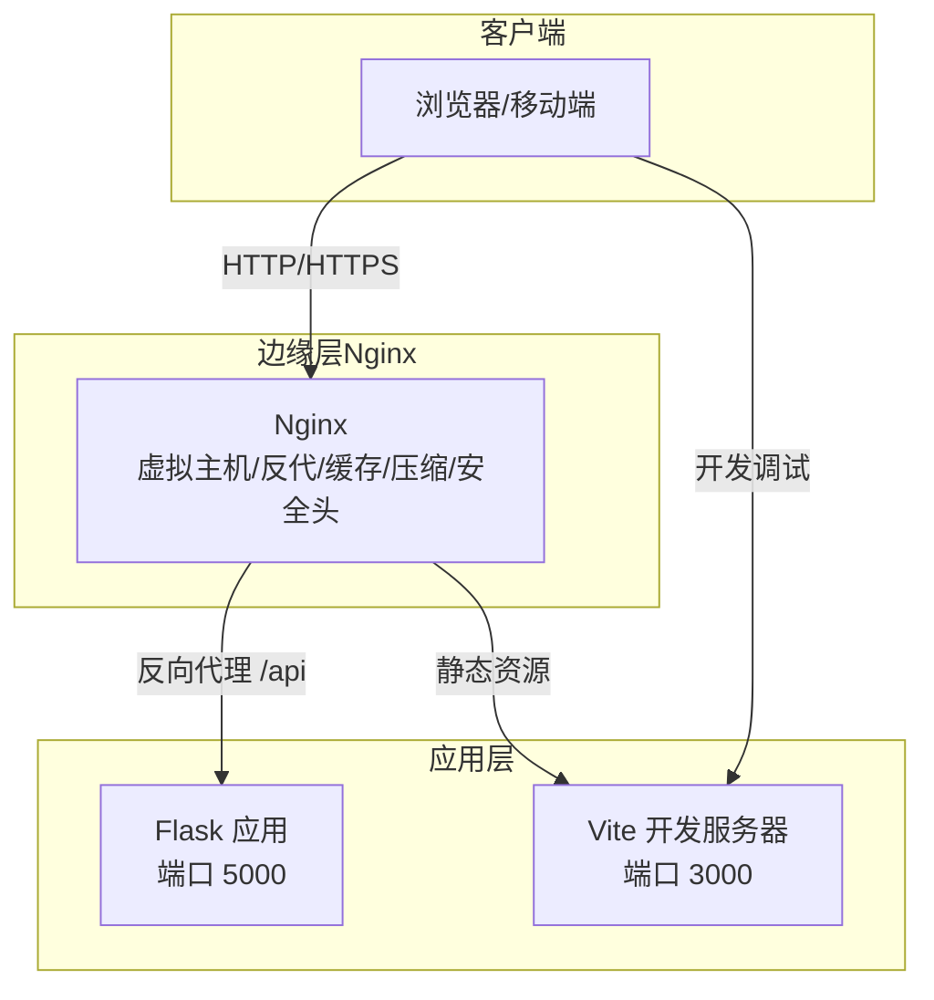
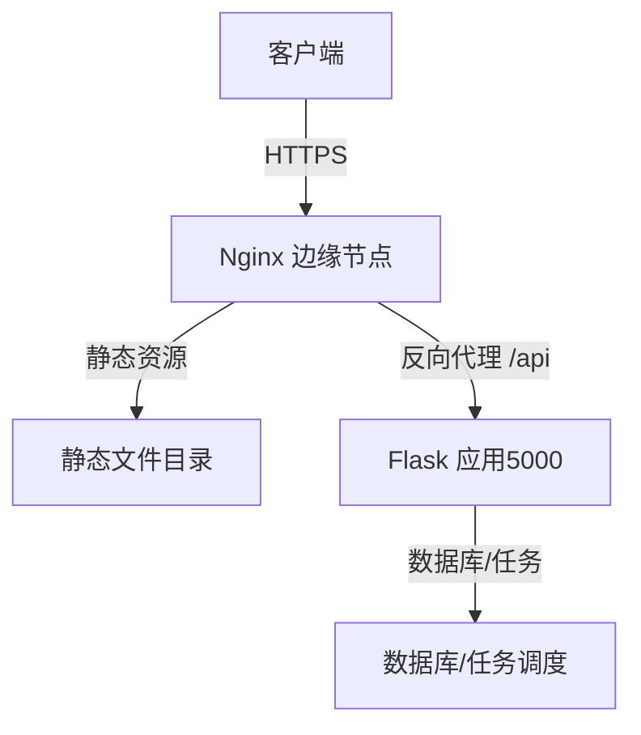
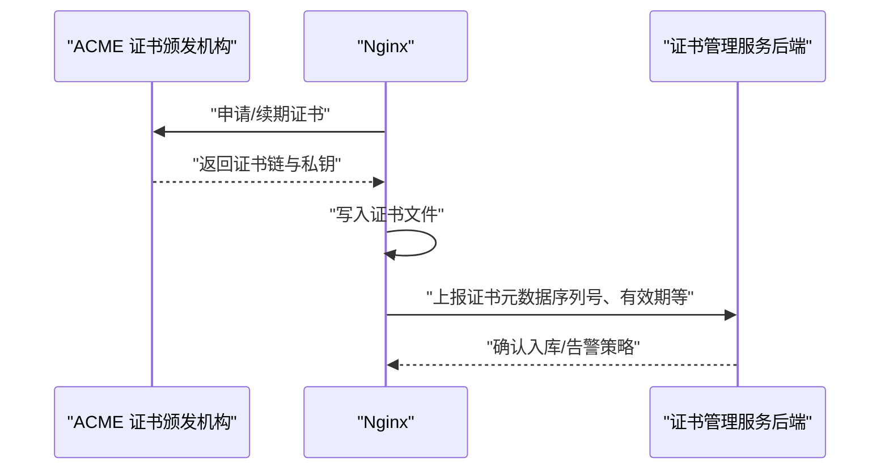
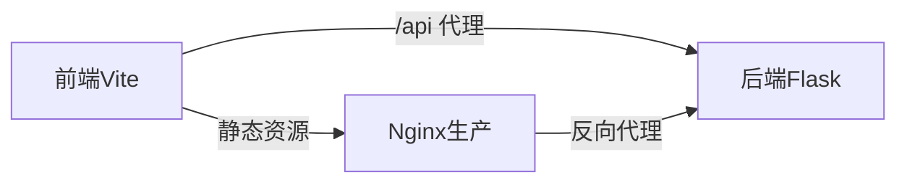

# Web服务器配置

<cite>
**本文引用的文件**
- [后端配置文件](file://backend/app/config.py)
- [Flask 应用工厂与蓝图注册](file://backend/app/__init__.py)
- [运行入口（开发模式）](file://backend/run.py)
- [前端 Vite 开发服务器配置](file://frontend/vite.config.js)
- [前端包管理与脚本](file://frontend/package.json)
- [前端构建产物入口页](file://frontend/dist/index.html)
- [证书管理 API（后端）](file://backend/app/api/certs.py)
- [定时任务调度器](file://backend/app/utils/scheduler.py)
- [后端依赖清单](file://backend/requirements.txt)
</cite>

## 目录
1. [简介](#简介)
2. [项目结构](#项目结构)
3. [核心组件](#核心组件)
4. [架构总览](#架构总览)
5. [详细组件分析](#详细组件分析)
6. [依赖分析](#依赖分析)
7. [性能考虑](#性能考虑)
8. [故障排查指南](#故障排查指南)
9. [结论](#结论)
10. [附录](#附录)

## 简介
本文件面向运维与开发人员，提供一套完整的Web服务器配置指南，涵盖以下主题：
- Nginx 反向代理与虚拟主机配置
- 静态文件服务与反向代理规则
- SSL/TLS 证书申请、安装与自动续期
- 负载均衡、缓存策略与压缩优化
- HTTPS 强制跳转、安全响应头与访问控制
- WebSocket 代理与长连接处理
- 性能调优、并发连接与超时配置

说明：本仓库未包含实际的 Nginx 配置文件，因此本文以“最佳实践”和“可落地的实施步骤”为主，结合后端与前端配置文件中的关键信息进行说明。

## 项目结构
该工程由前后端分离构成：
- 前端：基于 Vue 3 + Vite，开发服务器默认监听 3000 端口，并通过代理将 /api 请求转发至后端 Flask 应用。
- 后端：基于 Flask，提供 REST API 服务，默认监听 5000 端口（可通过环境变量调整），并启用跨域支持。
- 部署建议：生产环境通过 Nginx 暴露静态资源与 API，实现 HTTPS 终端、反向代理、缓存与压缩等能力。

**章节来源**
- [后端配置文件:15-17](file://backend/app/config.py#L15-L17)
- [运行入口（开发模式）:6-7](file://backend/run.py#L6-L7)
- [前端 Vite 开发服务器配置:6-14](file://frontend/vite.config.js#L6-L14)

## 核心组件
- Flask 应用工厂与蓝图注册：负责创建应用实例、加载配置、注册蓝图与定时任务。
- CORS 配置：允许跨域请求，便于前端与后端联调。
- 前端开发服务器：本地开发时通过代理将 /api 请求转发至后端。
- 证书管理 API：后端提供证书相关接口，可用于证书生命周期管理（为 SSL/TLS 自动化打基础）。

**章节来源**
- [Flask 应用工厂与蓝图注册:6-34](file://backend/app/__init__.py#L6-L34)
- [后端配置文件:15-17](file://backend/app/config.py#L15-L17)
- [前端 Vite 开发服务器配置:9-14](file://frontend/vite.config.js#L9-L14)
- [证书管理 API（后端）:11-44](file://backend/app/api/certs.py#L11-L44)

## 架构总览
下图展示生产环境典型部署形态：Nginx 作为统一入口，负责 TLS 终端、静态资源分发、反向代理与安全加固；后端 Flask 提供 API 服务；前端构建产物由 Nginx 提供静态访问。

[此图为概念性架构示意，不直接对应具体源码文件]

## 详细组件分析

### Nginx 虚拟主机与反向代理
- 虚拟主机：按域名划分站点，建议为每个站点配置独立的 server 块。
- 反向代理：将 /api 前缀转发至后端 Flask 应用（默认 5000 端口）。可结合上游健康检查与权重实现简单负载均衡。
- 静态资源：将前端构建产物目录（dist）交由 Nginx 提供，减少后端压力。
- 安全与性能：开启 gzip/br 压缩、设置安全响应头、限制上传大小、超时与连接数。

[本节为通用配置建议，不直接对应具体源码文件]

### SSL/TLS 证书申请、安装与自动续期
- 证书申请：推荐使用 ACME 协议（如 certbot）自动化申请与续期。
- 安装：将证书与私钥放置在 Nginx 可读目录，确保权限最小化。
- 自动续期：配置定时任务（如 systemd timer 或 cron），在到期前自动续期并平滑重载 Nginx。
- 后端联动：后端可提供证书管理 API，用于记录证书元数据、到期提醒与自动化触发续期流程。

**章节来源**
- [证书管理 API（后端）:11-44](file://backend/app/api/certs.py#L11-L44)

### 负载均衡、缓存与压缩
- 负载均衡：在 Nginx 中配置 upstream，多台后端实例轮询或加权轮询；结合健康检查与熔断策略。
- 缓存策略：对静态资源设置强缓存（Etag/Last-Modified），对动态接口设置合理 Cache-Control；对敏感接口禁用缓存。
- 压缩优化：开启 gzip/br 压缩，优先 brotli；对文本类资源（HTML/CSS/JS）启用压缩。

[本节为通用配置建议，不直接对应具体源码文件]

### HTTPS 强制跳转、安全头与访问控制
- HTTPS 强制跳转：非 443 端口请求重定向至 HTTPS。
- 安全头：Strict-Transport-Security、Content-Security-Policy、X-Frame-Options、X-Content-Type-Options、Referrer-Policy 等。
- 访问控制：IP 白名单、速率限制（limit_req）、WAF 规则、API 认证与授权。

[本节为通用配置建议，不直接对应具体源码文件]

### WebSocket 代理与长连接
- WebSocket 代理：升级协议时保持长连接，设置合适的超时与缓冲区。
- 长连接：对 /api/ws 或特定路径启用 keepalive 与心跳检测，避免中间设备断开连接。

[本节为通用配置建议，不直接对应具体源码文件]

### 性能调优、并发与超时
- 并发连接：worker_processes、worker_connections、multi_accept；根据 CPU 核心数与内存设定。
- 超时配置：proxy_connect_timeout、proxy_send_timeout、proxy_read_timeout；根据业务场景调整。
- 资源限制：限制上传大小（client_max_body_size）、请求头大小（large_client_header_buffers）。

[本节为通用配置建议，不直接对应具体源码文件]

## 依赖分析
- 前端开发依赖：Vue 3、Vite、Element Plus、Vue Router、Axios。
- 后端运行依赖：Flask、Flask-CORS、PyMySQL、APScheduler、OpenPyXL、Cryptography 等。
- 前端开发服务器通过代理将 /api 请求转发至后端 Flask（默认 5000 端口）。

**图表来源**
- [前端 Vite 开发服务器配置:9-14](file://frontend/vite.config.js#L9-L14)
- [后端配置文件:15-17](file://backend/app/config.py#L15-L17)

**章节来源**
- [前端包管理与脚本:1-24](file://frontend/package.json#L1-L24)
- [前端 Vite 开发服务器配置:6-16](file://frontend/vite.config.js#L6-L16)
- [后端依赖清单:1-9](file://backend/requirements.txt#L1-L9)

## 性能考虑
- Nginx 层面：启用 gzip/br、静态资源强缓存、合理超时与连接数；对 /api 使用 keepalive 与健康检查。
- 后端层面：Flask 默认开发服务器不适合生产；建议使用 Gunicorn/Gevent/uWSGI 等 WSGI 服务器，并配合 Nginx 反代。
- 数据库与任务：后端已集成 APScheduler，建议将耗时任务异步化，避免阻塞请求。

[本节提供通用指导，不直接对应具体源码文件]

## 故障排查指南
- 前端无法访问后端接口
  - 检查前端代理是否正确指向后端地址与端口。
  - 确认后端 CORS 是否允许前端域名与凭证。
- Nginx 404 或 502
  - 检查静态资源路径与反向代理目标是否正确。
  - 查看后端进程状态与端口占用情况。
- 证书问题
  - 确认证书链完整、私钥权限正确、续期任务正常执行。
  - 后端证书管理 API 可辅助记录与监控证书状态。
- 性能瓶颈
  - 分别在 Nginx 与后端查看慢请求与超时日志，定位瓶颈环节。

**章节来源**
- [前端 Vite 开发服务器配置:9-14](file://frontend/vite.config.js#L9-L14)
- [Flask 应用工厂与蓝图注册:24-25](file://backend/app/__init__.py#L24-L25)
- [证书管理 API（后端）:11-44](file://backend/app/api/certs.py#L11-L44)

## 结论
本指南提供了从 Nginx 到后端 Flask 的完整配置思路与最佳实践。结合前端构建产物与后端 API，可在生产环境中实现高可用、高性能且安全的 Web 服务。建议将证书自动化、健康检查与灰度发布纳入运维流程，持续优化性能与稳定性。

[本节为总结性内容，不直接对应具体源码文件]

## 附录

### A. Nginx 常用模块与指令参考
- 虚拟主机：listen、server_name、ssl_certificate、ssl_certificate_key
- 反向代理：location /api、proxy_pass、proxy_set_header、proxy_connect_timeout
- 静态资源：root、location ~* \.(css|js|png|jpg|jpeg|gif|ico|svg)$
- 压缩：gzip on、gzip_types、brotli on、brotli_types
- 安全头：add_header（HSTS、CSP、X-Frame-Options 等）

[本节为通用参考，不直接对应具体源码文件]

### B. 后端端口与环境变量
- Flask 默认监听地址与端口可通过环境变量配置，便于容器化与多环境部署。
- 建议在 Nginx 中将 80/443 映射到后端 5000 端口，或通过 Docker Compose 统一编排。

**章节来源**
- [后端配置文件:15-17](file://backend/app/config.py#L15-L17)
- [运行入口（开发模式）:6-7](file://backend/run.py#L6-L7)

### C. 前端构建与静态资源
- 前端构建产物位于 dist 目录，生产环境可直接由 Nginx 提供静态访问。
- 开发阶段通过 Vite 本地服务器提供热更新与代理能力。

**章节来源**
- [前端构建产物入口页:1-16](file://frontend/dist/index.html#L1-L16)
- [前端 Vite 开发服务器配置:6-16](file://frontend/vite.config.js#L6-L16)