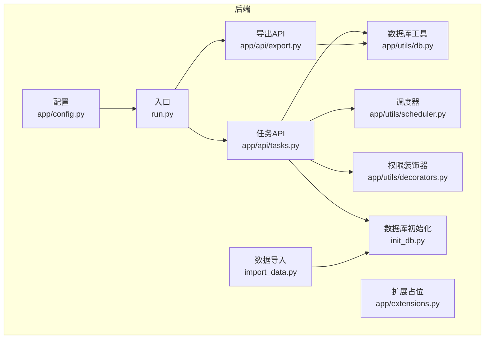
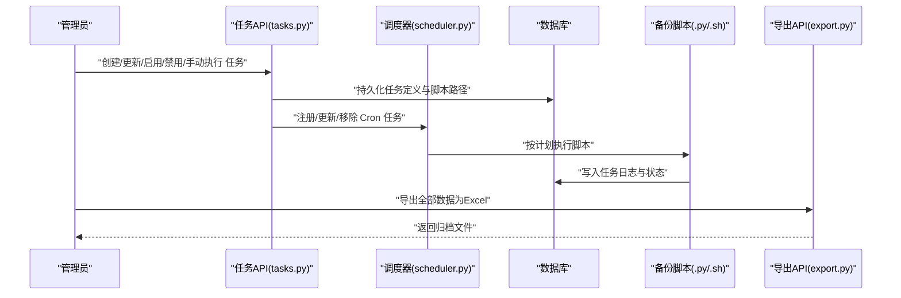
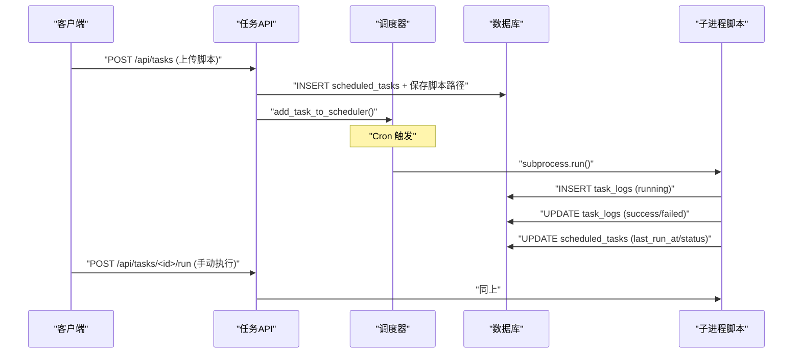
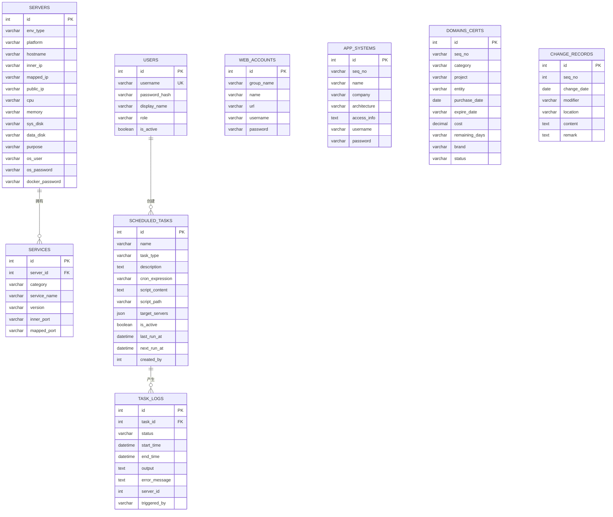
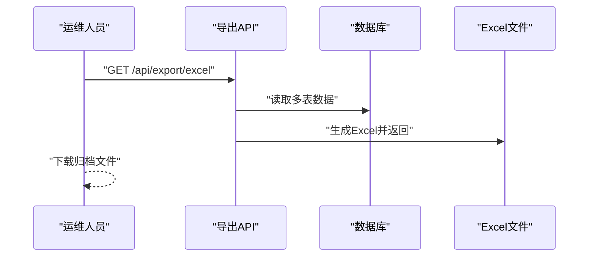
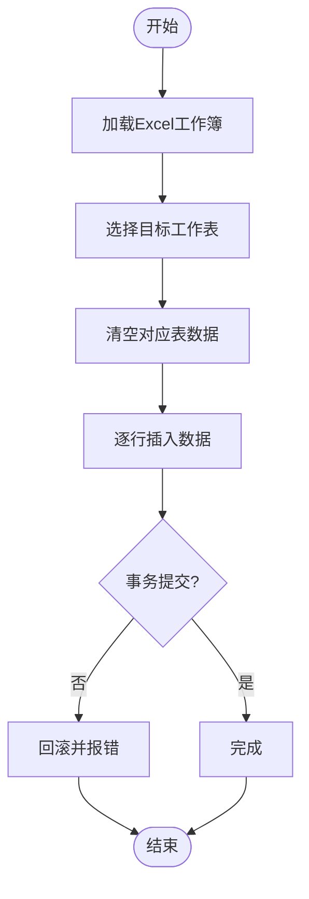
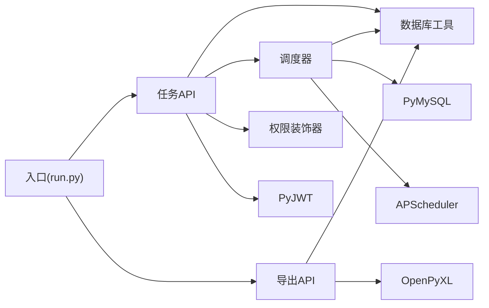

# 备份恢复

<cite>
**本文引用的文件**   
- [backend/app/utils/db.py](file://backend/app/utils/db.py)
- [backend/app/utils/scheduler.py](file://backend/app/utils/scheduler.py)
- [backend/app/utils/decorators.py](file://backend/app/utils/decorators.py)
- [backend/app/api/tasks.py](file://backend/app/api/tasks.py)
- [backend/app/api/export.py](file://backend/app/api/export.py)
- [backend/init_db.py](file://backend/init_db.py)
- [backend/import_data.py](file://backend/import_data.py)
- [backend/app/config.py](file://backend/app/config.py)
- [backend/run.py](file://backend/run.py)
- [backend/requirements.txt](file://backend/requirements.txt)
</cite>

## 目录
1. [简介](#简介)
2. [项目结构](#项目结构)
3. [核心组件](#核心组件)
4. [架构总览](#架构总览)
5. [详细组件分析](#详细组件分析)
6. [依赖分析](#依赖分析)
7. [性能考虑](#性能考虑)
8. [故障排查指南](#故障排查指南)
9. [结论](#结论)
10. [附录](#附录)

## 简介
本文件面向云运维平台的备份与灾难恢复（DR）策略，结合现有代码库能力，给出可落地的备份方案、验证与恢复测试流程、RTO/RPO目标设定建议、配置文件与代码版本管理、自动化脚本、监控与告警、数据与系统迁移、跨环境同步、安全性与访问控制，以及故障恢复流程与应急预案。

## 项目结构
后端采用 Flask 微服务风格，核心围绕数据库初始化、定时任务调度、权限控制与数据导出等功能组织。前端通过静态资源与后端 API 协作。整体结构如下：

图表来源
- [backend/app/config.py:1-21](file://backend/app/config.py#L1-L21)
- [backend/run.py:1-8](file://backend/run.py#L1-L8)
- [backend/app/api/tasks.py:1-458](file://backend/app/api/tasks.py#L1-L458)
- [backend/app/api/export.py:1-298](file://backend/app/api/export.py#L1-L298)
- [backend/app/utils/db.py:1-17](file://backend/app/utils/db.py#L1-L17)
- [backend/app/utils/scheduler.py:1-249](file://backend/app/utils/scheduler.py#L1-L249)
- [backend/app/utils/decorators.py:1-95](file://backend/app/utils/decorators.py#L1-L95)
- [backend/init_db.py:1-230](file://backend/init_db.py#L1-L230)
- [backend/import_data.py:1-371](file://backend/import_data.py#L1-L371)

章节来源
- [backend/app/config.py:1-21](file://backend/app/config.py#L1-L21)
- [backend/run.py:1-8](file://backend/run.py#L1-L8)
- [backend/app/api/tasks.py:1-458](file://backend/app/api/tasks.py#L1-L458)
- [backend/app/api/export.py:1-298](file://backend/app/api/export.py#L1-L298)
- [backend/app/utils/db.py:1-17](file://backend/app/utils/db.py#L1-L17)
- [backend/app/utils/scheduler.py:1-249](file://backend/app/utils/scheduler.py#L1-L249)
- [backend/app/utils/decorators.py:1-95](file://backend/app/utils/decorators.py#L1-L95)
- [backend/init_db.py:1-230](file://backend/init_db.py#L1-L230)
- [backend/import_data.py:1-371](file://backend/import_data.py#L1-L371)

## 核心组件
- 数据库连接与配置：集中于配置类与数据库工具，提供统一的连接参数与连接获取。
- 定时任务调度：基于 APScheduler，支持 Cron 触发、任务启停、手动执行与日志记录。
- 权限控制：JWT 认证与角色校验装饰器，限制任务管理操作的访问范围。
- 数据导出：将多表数据导出为 Excel，便于离线归档与审计。
- 数据库初始化：创建表结构与默认管理员账户，支撑系统初始状态。
- 数据导入：从 Excel 批量导入各业务表数据，辅助数据迁移与恢复验证。

章节来源
- [backend/app/config.py:1-21](file://backend/app/config.py#L1-L21)
- [backend/app/utils/db.py:1-17](file://backend/app/utils/db.py#L1-L17)
- [backend/app/utils/scheduler.py:1-249](file://backend/app/utils/scheduler.py#L1-L249)
- [backend/app/utils/decorators.py:1-95](file://backend/app/utils/decorators.py#L1-L95)
- [backend/app/api/export.py:1-298](file://backend/app/api/export.py#L1-L298)
- [backend/init_db.py:1-230](file://backend/init_db.py#L1-L230)
- [backend/import_data.py:1-371](file://backend/import_data.py#L1-L371)

## 架构总览
下图展示备份与恢复相关的关键交互：任务API负责接收备份任务定义与脚本上传；调度器按计划执行脚本，并将执行日志写入数据库；导出API用于离线归档；数据库初始化与导入用于恢复验证与跨环境同步。

图表来源
- [backend/app/api/tasks.py:63-137](file://backend/app/api/tasks.py#L63-L137)
- [backend/app/utils/scheduler.py:146-186](file://backend/app/utils/scheduler.py#L146-L186)
- [backend/app/utils/scheduler.py:32-144](file://backend/app/utils/scheduler.py#L32-L144)
- [backend/app/api/export.py:64-298](file://backend/app/api/export.py#L64-L298)

## 详细组件分析

### 组件A：定时任务与备份脚本执行
- 任务生命周期：创建任务（上传脚本、写入任务表、注册调度器）、启用/禁用、手动执行、删除清理。
- 调度执行：解析 Cron 表达式，按计划在子线程中执行脚本，捕获输出与异常，写入任务日志表。
- 日志与状态：记录开始/结束时间、状态、输出与错误信息，维护任务最后运行时间与状态。
- 安全与权限：任务管理接口受 JWT 与角色装饰器保护，仅允许管理员与操作员执行。

图表来源
- [backend/app/api/tasks.py:63-137](file://backend/app/api/tasks.py#L63-L137)
- [backend/app/api/tasks.py:309-421](file://backend/app/api/tasks.py#L309-L421)
- [backend/app/utils/scheduler.py:146-186](file://backend/app/utils/scheduler.py#L146-L186)
- [backend/app/utils/scheduler.py:32-144](file://backend/app/utils/scheduler.py#L32-L144)

章节来源
- [backend/app/api/tasks.py:1-458](file://backend/app/api/tasks.py#L1-L458)
- [backend/app/utils/scheduler.py:1-249](file://backend/app/utils/scheduler.py#L1-L249)
- [backend/app/utils/decorators.py:1-95](file://backend/app/utils/decorators.py#L1-L95)

### 组件B：数据库初始化与表结构
- 初始化脚本创建用户、服务器、服务、Web账户、应用系统、域名证书、变更记录、定时任务与任务日志等表。
- 为备份与恢复提供基础数据模型，确保恢复后具备一致的表结构与索引。

图表来源
- [backend/init_db.py:33-211](file://backend/init_db.py#L33-L211)

章节来源
- [backend/init_db.py:1-230](file://backend/init_db.py#L1-L230)

### 组件C：数据导出与归档
- 导出功能将多张业务表导出为 Excel，便于离线归档与审计。
- 可作为备份验证的一部分，定期导出并与备份介质比对一致性。

图表来源
- [backend/app/api/export.py:64-298](file://backend/app/api/export.py#L64-L298)

章节来源
- [backend/app/api/export.py:1-298](file://backend/app/api/export.py#L1-L298)

### 组件D：数据导入与恢复验证
- 导入脚本从 Excel 批量导入各业务表数据，可用于恢复验证与跨环境同步。
- 建议在恢复演练中先在隔离环境导入，核对数据完整性与业务可用性。

图表来源
- [backend/import_data.py:11-34](file://backend/import_data.py#L11-L34)
- [backend/import_data.py:44-81](file://backend/import_data.py#L44-L81)
- [backend/import_data.py:114-182](file://backend/import_data.py#L114-L182)

章节来源
- [backend/import_data.py:1-371](file://backend/import_data.py#L1-L371)

## 依赖分析
- 外部依赖：Flask、PyMySQL、APScheduler、OpenPyXL、PyJWT、Cryptography 等。
- 组件耦合：任务API依赖数据库工具与调度器；导出API依赖数据库工具；调度器依赖数据库配置与 PyMySQL；权限装饰器被任务API使用。

图表来源
- [backend/requirements.txt:1-9](file://backend/requirements.txt#L1-L9)
- [backend/app/api/tasks.py:1-15](file://backend/app/api/tasks.py#L1-L15)
- [backend/app/api/export.py:1-10](file://backend/app/api/export.py#L1-L10)
- [backend/app/utils/scheduler.py:1-11](file://backend/app/utils/scheduler.py#L1-L11)
- [backend/app/utils/db.py:1-17](file://backend/app/utils/db.py#L1-L17)
- [backend/app/utils/decorators.py:1-95](file://backend/app/utils/decorators.py#L1-L95)
- [backend/run.py:1-8](file://backend/run.py#L1-L8)

章节来源
- [backend/requirements.txt:1-9](file://backend/requirements.txt#L1-L9)
- [backend/app/api/tasks.py:1-15](file://backend/app/api/tasks.py#L1-L15)
- [backend/app/api/export.py:1-10](file://backend/app/api/export.py#L1-L10)
- [backend/app/utils/scheduler.py:1-11](file://backend/app/utils/scheduler.py#L1-L11)
- [backend/app/utils/db.py:1-17](file://backend/app/utils/db.py#L1-L17)
- [backend/app/utils/decorators.py:1-95](file://backend/app/utils/decorators.py#L1-L95)
- [backend/run.py:1-8](file://backend/run.py#L1-L8)

## 性能考虑
- 调度器并发：每个任务在独立线程中执行，避免阻塞主循环；建议限制并发数量以避免资源争用。
- 数据库连接：调度器回调使用独立连接，减少与Web请求的连接竞争。
- 导出性能：导出涉及多表读取与样式处理，建议在低峰期执行或拆分导出批次。
- 脚本执行超时：统一设置超时阈值，防止长时间占用资源。

## 故障排查指南
- 任务未执行：检查 Cron 表达式格式、脚本路径存在性、调度器是否启动、任务是否启用。
- 手动执行失败：查看任务日志表中的错误信息，确认脚本可执行权限与依赖。
- 导出异常：确认数据库连接正常、表结构完整、内存充足。
- 权限错误：确认 JWT Token 有效且角色满足要求。

章节来源
- [backend/app/utils/scheduler.py:146-186](file://backend/app/utils/scheduler.py#L146-L186)
- [backend/app/api/tasks.py:309-421](file://backend/app/api/tasks.py#L309-L421)
- [backend/app/api/export.py:293-298](file://backend/app/api/export.py#L293-L298)
- [backend/app/utils/decorators.py:20-56](file://backend/app/utils/decorators.py#L20-L56)

## 结论
通过现有的任务调度、权限控制、数据导出与数据库初始化能力，可以构建一套可操作的备份与恢复体系。建议在此基础上补充专用的数据库备份脚本、备份存储与保留策略、备份验证与恢复测试流程、监控与告警、跨环境同步与安全加固，以达成明确的 RTO/RPO 目标并保障业务连续性。

## 附录

### 备份与恢复策略（基于现有能力的实施建议）
- 数据库备份方案
  - 全量备份：每日凌晨执行数据库全量导出（可结合 mysqldump 或逻辑备份），并将导出文件归档至安全存储。
  - 增量备份：结合数据库二进制日志（binlog）进行增量备份，缩短 RPO。
  - 备份存储与保留：采用本地+异地（或对象存储）双副本，保留周期按法规与业务需求设定（如90/180/365天）。
- 备份验证与恢复测试
  - 定期执行“离线归档导出”（参考导出API）并与备份介质比对一致性。
  - 每季度进行恢复演练：在隔离环境导入数据（参考导入脚本），验证业务可用性。
- RTO/RPO 目标
  - RPO：通过 binlog 增量备份与自动化恢复脚本，目标≤15分钟。
  - RTO：通过自动化恢复脚本与预置恢复流程，目标≤2小时。
- 配置文件与代码版本管理
  - 配置文件纳入版本库，敏感配置通过环境变量注入（参考配置类）。
  - 代码版本与发布流程与备份策略协同，确保可回滚版本与备份介质一致。
- 自动化备份脚本与监控告警
  - 使用任务API上传并调度备份脚本（参考任务API），记录执行日志（参考调度器）。
  - 基于任务日志表建立监控与告警（成功/失败、超时、输出异常）。
- 数据迁移与跨环境同步
  - 使用导入/导出能力实现跨环境同步与迁移，先在测试环境验证再推广。
- 安全性、加密与访问控制
  - 对备份介质进行加密存储；访问控制采用最小权限原则与角色分离（参考权限装饰器）。
- 故障恢复流程与应急预案
  - 明确故障分级与处置流程，固化恢复步骤与责任人；定期演练与优化。