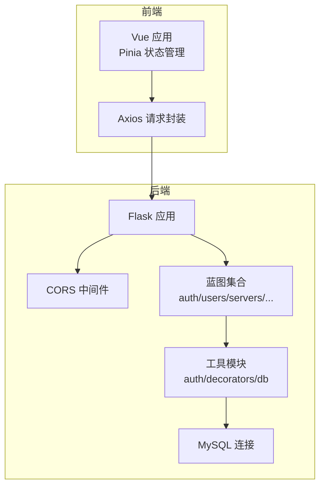
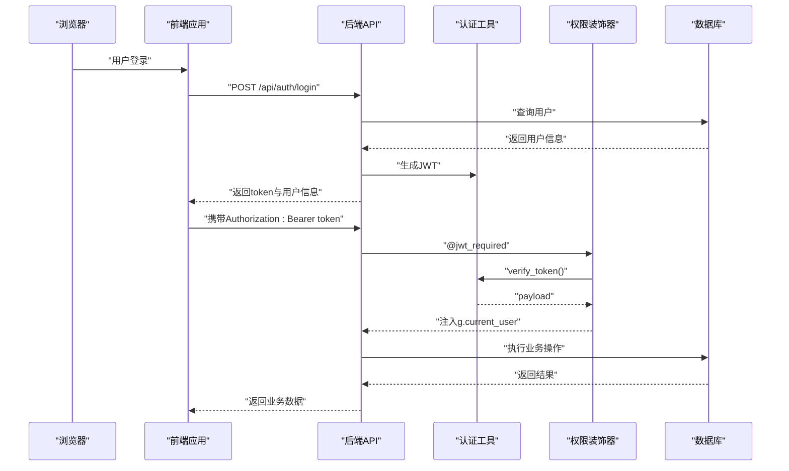
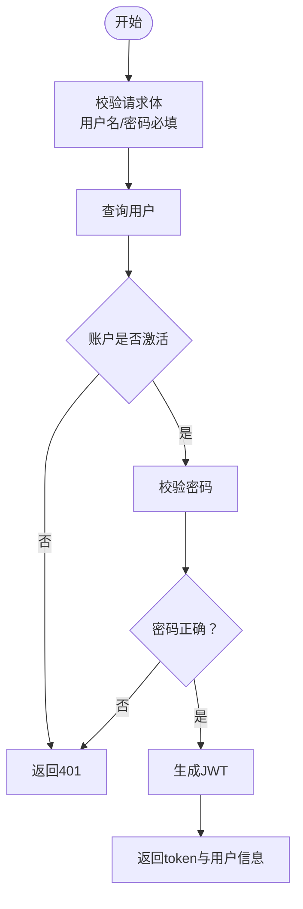
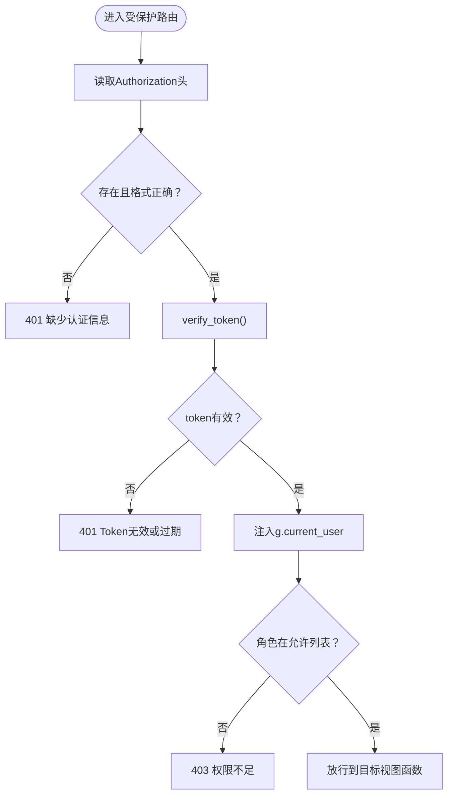
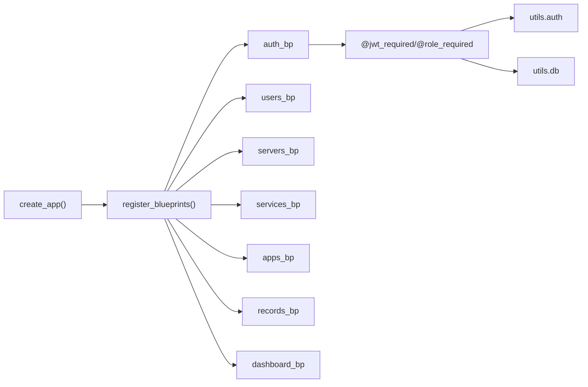

# 安全加固

<cite>
**本文引用的文件**
- [backend/app/config.py](file://backend/app/config.py)
- [backend/app/__init__.py](file://backend/app/__init__.py)
- [backend/app/utils/auth.py](file://backend/app/utils/auth.py)
- [backend/app/utils/decorators.py](file://backend/app/utils/decorators.py)
- [backend/app/api/auth.py](file://backend/app/api/auth.py)
- [backend/app/models/user.py](file://backend/app/models/user.py)
- [backend/app/utils/db.py](file://backend/app/utils/db.py)
- [backend/run.py](file://backend/run.py)
- [frontend/src/stores/user.js](file://frontend/src/stores/user.js)
- [frontend/src/api/auth.js](file://frontend/src/api/auth.js)
- [frontend/package.json](file://frontend/package.json)
</cite>

## 目录
1. [简介](#简介)
2. [项目结构](#项目结构)
3. [核心组件](#核心组件)
4. [架构总览](#架构总览)
5. [详细组件分析](#详细组件分析)
6. [依赖分析](#依赖分析)
7. [性能考虑](#性能考虑)
8. [故障排查指南](#故障排查指南)
9. [结论](#结论)
10. [附录](#附录)

## 简介
本文件面向云运维平台的安全加固，基于现有代码实现，系统梳理身份认证与会话管理、密码策略、API安全防护、CORS与前端安全、数据库安全与访问控制、上传与文件限制、防火墙与端口管理建议、安全审计与日志、合规与漏洞修复流程、安全事件响应与威胁情报、以及安全培训要点。文档同时指出当前实现中的薄弱点，并给出可落地的加固建议。

## 项目结构
后端采用Flask应用，按功能模块组织蓝图；前端使用Vue 3 + Pinia + Vue Router，通过Axios封装HTTP请求。应用通过环境变量读取配置，生产部署需确保密钥与数据库凭据安全。

图表来源
- [backend/app/__init__.py:1-60](file://backend/app/__init__.py#L1-L60)
- [backend/app/utils/db.py:1-17](file://backend/app/utils/db.py#L1-L17)
- [frontend/src/api/auth.js:1-14](file://frontend/src/api/auth.js#L1-L14)

章节来源
- [backend/app/__init__.py:1-60](file://backend/app/__init__.py#L1-L60)
- [backend/app/config.py:1-21](file://backend/app/config.py#L1-L21)
- [frontend/package.json:1-24](file://frontend/package.json#L1-L24)

## 核心组件
- 身份认证与会话：后端使用JWT生成与校验，前端通过本地存储保存令牌并在请求头携带；装饰器统一处理认证与权限。
- 密码策略：后端对密码进行哈希存储，前端密码修改接口对新密码长度进行约束。
- API安全：蓝图路由受装饰器保护，支持角色级权限控制。
- CORS与前端：后端对API路径启用跨域并允许凭证；前端Axios默认不携带Cookie，需按需配置。
- 数据库与访问控制：通过装饰器与蓝图限制访问，数据库连接参数来自配置。
- 上传与大小限制：后端设置最大内容长度，前端上传组件需配合后端限制。

章节来源
- [backend/app/utils/auth.py:1-83](file://backend/app/utils/auth.py#L1-L83)
- [backend/app/utils/decorators.py:1-95](file://backend/app/utils/decorators.py#L1-L95)
- [backend/app/api/auth.py:1-184](file://backend/app/api/auth.py#L1-L184)
- [backend/app/models/user.py:1-183](file://backend/app/models/user.py#L1-L183)
- [backend/app/utils/db.py:1-17](file://backend/app/utils/db.py#L1-L17)
- [backend/app/config.py:1-21](file://backend/app/config.py#L1-L21)
- [frontend/src/stores/user.js:1-41](file://frontend/src/stores/user.js#L1-L41)
- [frontend/src/api/auth.js:1-14](file://frontend/src/api/auth.js#L1-L14)

## 架构总览
下图展示从浏览器到后端API再到数据库的整体调用链，以及认证与权限控制的关键节点。

图表来源
- [backend/app/api/auth.py:14-82](file://backend/app/api/auth.py#L14-L82)
- [backend/app/utils/auth.py:38-56](file://backend/app/utils/auth.py#L38-L56)
- [backend/app/utils/decorators.py:9-56](file://backend/app/utils/decorators.py#L9-L56)
- [backend/app/utils/db.py:5-17](file://backend/app/utils/db.py#L5-L17)

## 详细组件分析

### 身份认证与会话管理
- 后端JWT
  - 生成：包含用户ID、用户名、角色、签发时间与过期时间，算法为HS256。
  - 校验：捕获过期与无效令牌异常，返回空表示验证失败。
  - 密钥：从配置读取，生产环境必须使用强随机密钥。
- 前端会话
  - 令牌持久化：使用localStorage保存token与用户信息。
  - 请求头：Axios未自动携带Cookie，需在请求拦截器中显式设置凭证或遵循同源策略。
- 登录流程
  - 校验用户名与密码，检查账户激活状态，生成JWT并返回。
- 密码修改
  - 需要旧密码校验，新密码长度不得少于6位，成功后更新数据库。

图表来源
- [backend/app/api/auth.py:14-82](file://backend/app/api/auth.py#L14-L82)

章节来源
- [backend/app/utils/auth.py:11-35](file://backend/app/utils/auth.py#L11-L35)
- [backend/app/utils/auth.py:38-56](file://backend/app/utils/auth.py#L38-L56)
- [backend/app/api/auth.py:14-82](file://backend/app/api/auth.py#L14-L82)
- [frontend/src/stores/user.js:13-21](file://frontend/src/stores/user.js#L13-L21)

### 权限与角色控制
- 装饰器
  - @jwt_required：从Authorization头提取Bearer token，校验失败返回401；通过后写入g.current_user。
  - @role_required：在@jwt_required之后使用，检查用户角色是否在允许列表内，否则返回403。
- 使用方式：先@jwt_required，再@role_required指定角色列表。

图表来源
- [backend/app/utils/decorators.py:9-56](file://backend/app/utils/decorators.py#L9-L56)
- [backend/app/utils/decorators.py:59-95](file://backend/app/utils/decorators.py#L59-L95)

章节来源
- [backend/app/utils/decorators.py:9-95](file://backend/app/utils/decorators.py#L9-L95)

### 密码策略与强度
- 存储：使用安全哈希算法对密码进行不可逆存储。
- 修改：新密码长度不得少于6位，旧密码必须校验通过。
- 建议：引入更严格的密码复杂度规则（含数字、大小写字母、特殊字符），并增加密码历史与重用限制。

章节来源
- [backend/app/models/user.py:8-36](file://backend/app/models/user.py#L8-L36)
- [backend/app/api/auth.py:145-149](file://backend/app/api/auth.py#L145-L149)
- [backend/app/api/auth.py:164-168](file://backend/app/api/auth.py#L164-L168)

### API安全防护
- 路由保护：所有需要认证的路由均使用@jwt_required装饰器。
- 角色控制：通过@role_required限定管理员等敏感操作。
- 统一响应：接口返回统一结构（code/message/data），便于前端与网关层统一处理。
- 建议：对高频接口增加速率限制与IP白名单；对敏感操作增加二次确认与审计日志。

章节来源
- [backend/app/api/auth.py:85-115](file://backend/app/api/auth.py#L85-L115)
- [backend/app/api/auth.py:118-184](file://backend/app/api/auth.py#L118-L184)
- [backend/app/utils/decorators.py:59-95](file://backend/app/utils/decorators.py#L59-L95)

### CORS与前端安全
- 后端CORS：对/r/api/*开放跨域并允许凭证。
- 前端Axios：默认不携带Cookie，若需跨域携带凭证，应在请求拦截器中设置相应选项。
- XSS/CSRF：当前未见专门的CSRF令牌机制与XSS防护中间件，建议补充：
  - CSRF：为表单与有状态请求引入一次性令牌。
  - XSS：后端模板渲染与前端数据绑定需严格转义；设置Content-Security-Policy响应头。
  - HSTS/安全Cookie：生产环境启用HTTPS与安全Cookie标志。

章节来源
- [backend/app/__init__.py:24-25](file://backend/app/__init__.py#L24-L25)
- [frontend/src/api/auth.js:1-14](file://frontend/src/api/auth.js#L1-L14)
- [frontend/src/stores/user.js:6-7](file://frontend/src/stores/user.js#L6-L7)

### 数据库安全与访问控制
- 连接参数：从配置读取主机、端口、用户、密码与数据库名，避免硬编码。
- SQL安全：用户模型使用参数化查询，降低SQL注入风险。
- 访问控制：通过装饰器与蓝图限制访问，数据库层面建议：
  - 为应用账号授予最小必要权限；
  - 对敏感表建立单独库或只读账号；
  - 开启审计日志与慢查询监控。

章节来源
- [backend/app/utils/db.py:5-17](file://backend/app/utils/db.py#L5-L17)
- [backend/app/models/user.py:49-58](file://backend/app/models/user.py#L49-L58)
- [backend/app/models/user.py:71-80](file://backend/app/models/user.py#L71-L80)
- [backend/app/models/user.py:172-182](file://backend/app/models/user.py#L172-L182)

### 上传与文件限制
- 后端：设置最大内容长度为16MB，防止滥用。
- 建议：结合文件类型白名单、病毒扫描、上传目录权限与不可执行标记进一步加固。

章节来源
- [backend/app/config.py:19-21](file://backend/app/config.py#L19-L21)

### 配置与密钥管理
- 关键密钥：SECRET_KEY、JWT_SECRET_KEY需在环境变量中配置，且定期轮换。
- 生产部署：禁止DEBUG模式；仅监听内网或受控地址；限制暴露端口。

章节来源
- [backend/app/config.py:4-17](file://backend/app/config.py#L4-L17)
- [backend/run.py:6-8](file://backend/run.py#L6-L8)

## 依赖分析
后端应用通过蓝图聚合各模块API，认证与权限装饰器贯穿所有受保护路由；数据库连接通过工具模块统一分配。

图表来源
- [backend/app/__init__.py:37-60](file://backend/app/__init__.py#L37-L60)
- [backend/app/utils/decorators.py:9-95](file://backend/app/utils/decorators.py#L9-L95)
- [backend/app/utils/auth.py:1-83](file://backend/app/utils/auth.py#L1-L83)
- [backend/app/utils/db.py:1-17](file://backend/app/utils/db.py#L1-L17)

章节来源
- [backend/app/__init__.py:37-60](file://backend/app/__init__.py#L37-L60)
- [backend/app/utils/decorators.py:9-95](file://backend/app/utils/decorators.py#L9-L95)

## 性能考虑
- JWT负载较小，验证开销低；建议缓存热点用户信息以减少数据库查询。
- 对高频接口增加限流与熔断，避免突发流量导致资源耗尽。
- 数据库连接池与超时设置需结合实际负载调整。

## 故障排查指南
- 认证失败
  - 检查Authorization头格式是否为Bearer token。
  - 确认JWT_SECRET_KEY一致且未泄露。
  - 核对token是否过期。
- 权限不足
  - 确认用户角色已在payload中正确注入。
  - 检查@role_required传入的角色列表是否包含当前用户角色。
- 登录失败
  - 核对用户名是否存在且账户已激活。
  - 确认密码哈希匹配。
- CORS问题
  - 确认后端CORS对目标路径生效且允许凭证。
  - 前端请求是否正确设置凭证选项。

章节来源
- [backend/app/utils/decorators.py:20-56](file://backend/app/utils/decorators.py#L20-L56)
- [backend/app/utils/auth.py:38-56](file://backend/app/utils/auth.py#L38-L56)
- [backend/app/api/auth.py:40-61](file://backend/app/api/auth.py#L40-L61)
- [backend/app/__init__.py:24-25](file://backend/app/__init__.py#L24-L25)

## 结论
当前实现提供了基础的JWT认证、密码哈希与蓝图权限控制，满足基本安全需求。为进一步提升安全性，建议补充CSRF防护、XSS防护、速率限制、审计日志、入侵检测、合规扫描与漏洞修复流程，并完善密钥轮换与最小权限原则下的数据库访问控制。

## 附录

### 安全配置清单（建议）
- 密钥与机密
  - 设置强随机JWT_SECRET_KEY与SECRET_KEY，定期轮换。
  - 使用环境变量或密钥管理服务注入。
- 认证与会话
  - 引入强密码策略与密码历史。
  - 为敏感操作增加二次确认与审计日志。
- API与CORS
  - 为表单与有状态请求引入CSRF令牌。
  - 前端Axios按需开启凭证；后端CORS限制到可信域名。
- 数据库
  - 最小权限账号；参数化查询；审计与慢查询监控。
- 传输与存储
  - 强制HTTPS；安全Cookie标志；上传文件病毒扫描。
- 运维
  - 速率限制与IP白名单；防火墙仅开放必要端口；集中日志与告警。
- 合规与修复
  - 定期安全扫描与渗透测试；漏洞修复闭环；事件响应预案。
- 培训
  - 对开发与运维团队开展安全意识与最佳实践培训。