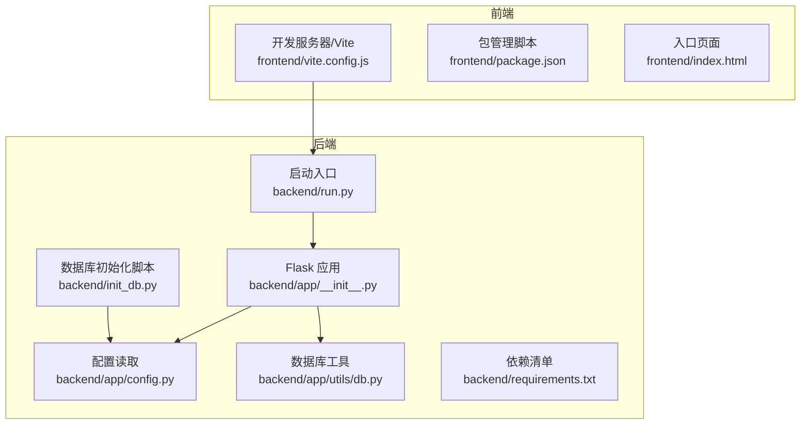
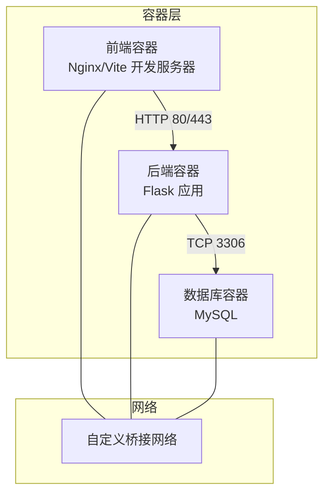
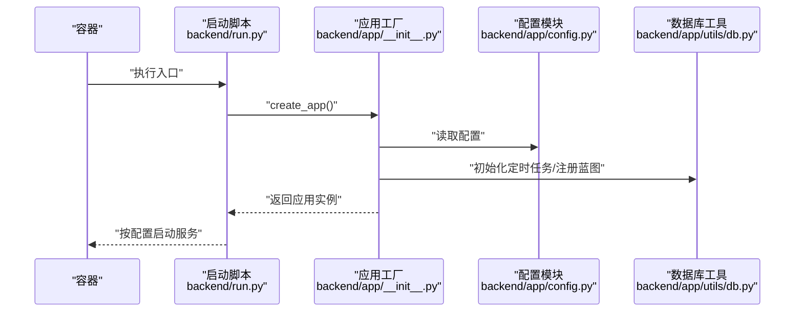
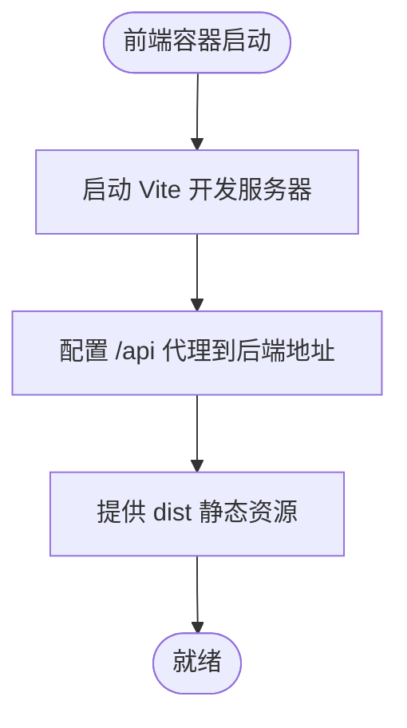
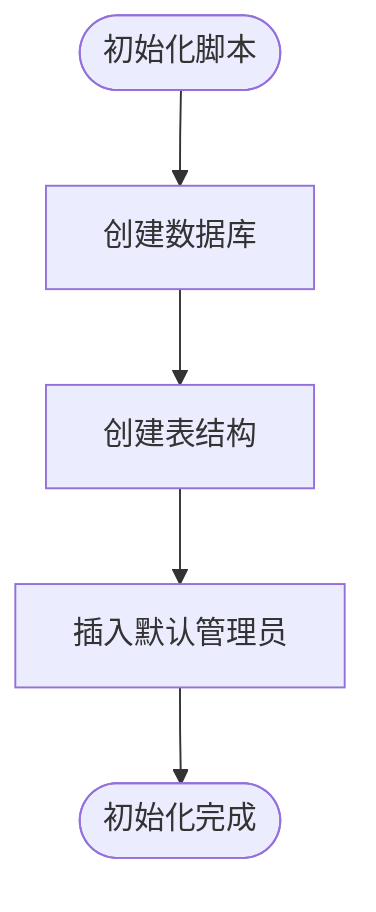
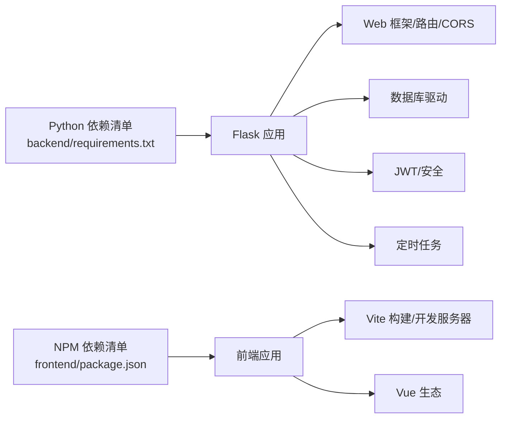

# 容器化部署

<cite>
**本文引用的文件**
- [backend/app/__init__.py](file://backend/app/__init__.py)
- [backend/run.py](file://backend/run.py)
- [backend/app/config.py](file://backend/app/config.py)
- [backend/app/utils/db.py](file://backend/app/utils/db.py)
- [backend/init_db.py](file://backend/init_db.py)
- [backend/requirements.txt](file://backend/requirements.txt)
- [frontend/package.json](file://frontend/package.json)
- [frontend/vite.config.js](file://frontend/vite.config.js)
- [frontend/index.html](file://frontend/index.html)
</cite>

## 目录
1. [简介](#简介)
2. [项目结构](#项目结构)
3. [核心组件](#核心组件)
4. [架构总览](#架构总览)
5. [详细组件分析](#详细组件分析)
6. [依赖分析](#依赖分析)
7. [性能考虑](#性能考虑)
8. [故障排查指南](#故障排查指南)
9. [结论](#结论)
10. [附录](#附录)

## 简介
本文件面向云运维平台的容器化部署，提供从 Dockerfile 编写、镜像构建与多阶段优化，到 Docker Compose 编排（后端、前端、数据库），再到 Kubernetes 资源定义（Deployment、Service、Ingress）的完整实践指南。同时涵盖容器网络、卷挂载、环境变量传递、健康检查、资源限制与自动重启策略，以及日志收集与监控集成建议。

## 项目结构
该仓库包含后端 Flask 应用、前端 Vue 应用与数据库初始化脚本。后端通过配置读取环境变量控制数据库连接、Flask 运行参数；前端通过 Vite 开发服务器与代理访问后端 API；数据库初始化脚本负责创建数据库与表结构。

**图表来源**
- [backend/app/__init__.py:1-62](file://backend/app/__init__.py#L1-L62)
- [backend/run.py:1-8](file://backend/run.py#L1-L8)
- [backend/app/config.py:1-21](file://backend/app/config.py#L1-L21)
- [backend/app/utils/db.py:1-17](file://backend/app/utils/db.py#L1-L17)
- [backend/init_db.py:1-230](file://backend/init_db.py#L1-L230)
- [backend/requirements.txt:1-9](file://backend/requirements.txt#L1-L9)
- [frontend/vite.config.js:1-16](file://frontend/vite.config.js#L1-L16)
- [frontend/package.json:1-24](file://frontend/package.json#L1-L24)
- [frontend/index.html:1-14](file://frontend/index.html#L1-L14)

**章节来源**
- [backend/app/__init__.py:1-62](file://backend/app/__init__.py#L1-L62)
- [backend/run.py:1-8](file://backend/run.py#L1-L8)
- [backend/app/config.py:1-21](file://backend/app/config.py#L1-L21)
- [backend/app/utils/db.py:1-17](file://backend/app/utils/db.py#L1-L17)
- [backend/init_db.py:1-230](file://backend/init_db.py#L1-L230)
- [backend/requirements.txt:1-9](file://backend/requirements.txt#L1-L9)
- [frontend/vite.config.js:1-16](file://frontend/vite.config.js#L1-L16)
- [frontend/package.json:1-24](file://frontend/package.json#L1-L24)
- [frontend/index.html:1-14](file://frontend/index.html#L1-L14)

## 核心组件
- 后端 Flask 应用：提供 REST API，注册多个蓝图，支持跨域，内置定时任务调度器。
- 数据库工具：基于配置动态建立数据库连接。
- 配置模块：集中管理密钥、数据库连接参数、Flask 运行参数等。
- 前端 Vite 应用：开发服务器默认端口与代理配置，指向后端服务。
- 数据库初始化脚本：创建数据库与表结构，并插入默认管理员账户。

**章节来源**
- [backend/app/__init__.py:1-62](file://backend/app/__init__.py#L1-L62)
- [backend/app/utils/db.py:1-17](file://backend/app/utils/db.py#L1-L17)
- [backend/app/config.py:1-21](file://backend/app/config.py#L1-L21)
- [frontend/vite.config.js:1-16](file://frontend/vite.config.js#L1-L16)
- [backend/init_db.py:1-230](file://backend/init_db.py#L1-L230)

## 架构总览
下图展示容器化部署的整体架构：前端容器对外提供静态资源与反向代理，后端容器承载 API 服务，数据库容器持久化存储。容器间通过自定义网络通信，使用卷挂载实现静态资源与上传目录的持久化。

[此图为概念性架构示意，不直接映射具体源码文件，故不提供图表来源]

## 详细组件分析

### 后端服务容器化要点
- 入口与运行方式：后端通过启动脚本创建应用实例并按配置监听端口。
- 配置注入：数据库与 Flask 参数均来自环境变量，便于在容器中灵活替换。
- 数据库连接：根据配置动态建立连接，确保容器内网络可达数据库。
- 蓝图注册：统一注册各业务模块的蓝图，便于 API 路由组织。

**图表来源**
- [backend/run.py:1-8](file://backend/run.py#L1-L8)
- [backend/app/__init__.py:1-62](file://backend/app/__init__.py#L1-L62)
- [backend/app/config.py:1-21](file://backend/app/config.py#L1-L21)
- [backend/app/utils/db.py:1-17](file://backend/app/utils/db.py#L1-L17)

**章节来源**
- [backend/run.py:1-8](file://backend/run.py#L1-L8)
- [backend/app/__init__.py:1-62](file://backend/app/__init__.py#L1-L62)
- [backend/app/config.py:1-21](file://backend/app/config.py#L1-L21)
- [backend/app/utils/db.py:1-17](file://backend/app/utils/db.py#L1-L17)

### 前端服务容器化要点
- 开发服务器：Vite 默认监听本地端口，需在容器中暴露对应端口并配置反向代理。
- 代理配置：开发服务器通过代理将 /api 前缀转发至后端服务地址。
- 静态资源：构建产物位于 dist 目录，可由 Nginx 提供静态服务。

**图表来源**
- [frontend/vite.config.js:1-16](file://frontend/vite.config.js#L1-L16)
- [frontend/package.json:1-24](file://frontend/package.json#L1-L24)
- [frontend/index.html:1-14](file://frontend/index.html#L1-L14)

**章节来源**
- [frontend/vite.config.js:1-16](file://frontend/vite.config.js#L1-L16)
- [frontend/package.json:1-24](file://frontend/package.json#L1-L24)
- [frontend/index.html:1-14](file://frontend/index.html#L1-L14)

### 数据库服务容器化要点
- 初始化脚本：创建数据库与表结构，插入默认管理员账户，便于首次部署快速可用。
- 连接参数：后端通过配置读取数据库主机、端口、用户、密码与数据库名。
- 卷挂载：建议将数据目录持久化，避免容器重建导致数据丢失。

**图表来源**
- [backend/init_db.py:1-230](file://backend/init_db.py#L1-L230)
- [backend/app/config.py:1-21](file://backend/app/config.py#L1-L21)

**章节来源**
- [backend/init_db.py:1-230](file://backend/init_db.py#L1-L230)
- [backend/app/config.py:1-21](file://backend/app/config.py#L1-L21)

## 依赖分析
后端依赖以 pip 清单形式声明，包含 Web 框架、CORS、数据库驱动、JWT、调度器等。前端依赖以 npm 包管理，包含 Vue 生态与构建工具。

**图表来源**
- [backend/requirements.txt:1-9](file://backend/requirements.txt#L1-L9)
- [frontend/package.json:1-24](file://frontend/package.json#L1-L24)

**章节来源**
- [backend/requirements.txt:1-9](file://backend/requirements.txt#L1-L9)
- [frontend/package.json:1-24](file://frontend/package.json#L1-L24)

## 性能考虑
- 运行模式：生产环境建议关闭调试模式，启用更严格的日志级别与资源限制。
- 连接池：数据库连接应复用与限制最大连接数，避免频繁创建销毁连接。
- 静态资源：前端构建产物交由 Nginx 提供，减少应用服务器负担。
- 并发与超时：合理设置后端进程并发与请求超时，避免慢查询拖垮整体性能。
- 缓存：对热点数据与接口结果进行缓存，降低数据库压力。

[本节为通用性能建议，不直接分析具体文件，故不提供章节来源]

## 故障排查指南
- 后端无法连接数据库：检查数据库主机、端口、用户、密码与数据库名是否正确，确认容器网络连通性。
- CORS 问题：确认后端已允许前端来源，或在反向代理层统一处理跨域。
- 代理不通：核对前端代理配置的目标地址与端口，确保后端容器已就绪。
- 权限与卷：确认上传目录与数据库数据目录的权限与挂载路径正确。
- 日志定位：查看后端与数据库容器日志，结合错误码与堆栈信息定位问题。

[本节为通用故障排查建议，不直接分析具体文件，故不提供章节来源]

## 结论
通过将后端、前端与数据库分别容器化，并利用环境变量与卷挂载实现灵活配置与持久化，可快速搭建稳定可靠的云运维平台。配合健康检查、资源限制与自动重启策略，可进一步提升系统的可用性与可观测性。

[本节为总结性内容，不直接分析具体文件，故不提供章节来源]

## 附录

### Dockerfile 编写与多阶段构建建议
- 基础镜像选择：后端使用 Python 官方镜像，前端使用 Nginx 或官方 Node 镜像作为构建环境。
- 多阶段构建：
  - 第一阶段：安装构建依赖，执行前端构建，产出静态资源。
  - 第二阶段：复制静态资源与后端依赖，安装生产依赖，设置非 root 用户运行。
- 最小化镜像：仅保留运行所需文件，减少攻击面与体积。
- 层缓存优化：将变更频率低的指令（如安装依赖）置于前层，变更频繁的指令置于后层。

[本节为通用实践建议，不直接分析具体文件，故不提供章节来源]

### Docker Compose 编排配置要点
- 服务定义：
  - 后端服务：映射端口，注入环境变量，挂载上传目录与日志目录。
  - 前端服务：映射端口，配置反向代理，挂载静态资源目录。
  - 数据库服务：持久化数据卷，设置 root 密码与初始数据库。
- 网络与卷：
  - 自定义桥接网络，便于服务间解析与隔离。
  - 使用命名卷或绑定挂载，确保数据持久化。
- 健康检查与重启策略：为数据库与后端配置健康检查，设置合理的重启策略。

[本节为通用编排建议，不直接分析具体文件，故不提供章节来源]

### Kubernetes 部署配置示例
- Deployment：
  - 后端与前端分别定义副本数、容器镜像、端口、环境变量与资源请求/限制。
  - 使用 ConfigMap 管理配置，使用 Secret 管理敏感信息。
- Service：
  - 后端使用 ClusterIP 暴露内部 API；前端使用 LoadBalancer 或 Ingress 暴露外部访问。
- Ingress：
  - 配置域名与路径规则，将 /api 前缀转发至后端 Service。
- Pod 策略：
  - 设置 readinessProbe/livenessProbe，启用自动重启与优雅退出。
  - 为数据库单独部署 StatefulSet 并配置持久化存储。

[本节为通用 K8s 建议，不直接分析具体文件，故不提供章节来源]

### 容器网络、卷挂载与环境变量
- 网络：使用自定义桥接网络，后端与数据库在同一网络内，通过服务名或容器名互相访问。
- 卷：数据库数据目录与后端上传目录使用持久化卷，避免容器重建导致数据丢失。
- 环境变量：通过 ConfigMap/Secret 注入，覆盖默认配置，满足不同环境需求。

[本节为通用网络与配置建议，不直接分析具体文件，故不提供章节来源]

### 健康检查、资源限制与自动重启
- 健康检查：后端与数据库分别配置 livenessProbe/readinessProbe，探测端口与路径。
- 资源限制：为后端与前端设置 CPU/内存请求与限制，避免资源争抢。
- 重启策略：数据库使用 RestartPolicy=Always，后端使用 RestartPolicy=Always 或 OnFailure，视场景而定。

[本节为通用运维建议，不直接分析具体文件，故不提供章节来源]

### 日志收集与监控集成
- 日志：后端容器标准输出与错误输出统一收集，结合日志聚合系统进行检索与告警。
- 监控：采集容器 CPU/内存/磁盘/网络指标，结合后端应用指标（如请求耗时、错误率）进行综合监控。
- 告警：针对健康检查失败、资源使用率阈值、数据库连接异常等事件设置告警。

[本节为通用监控建议，不直接分析具体文件，故不提供章节来源]