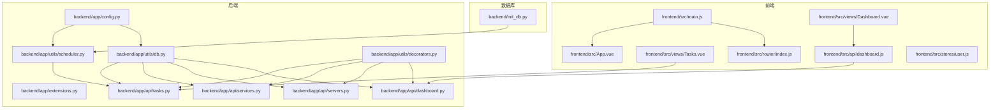
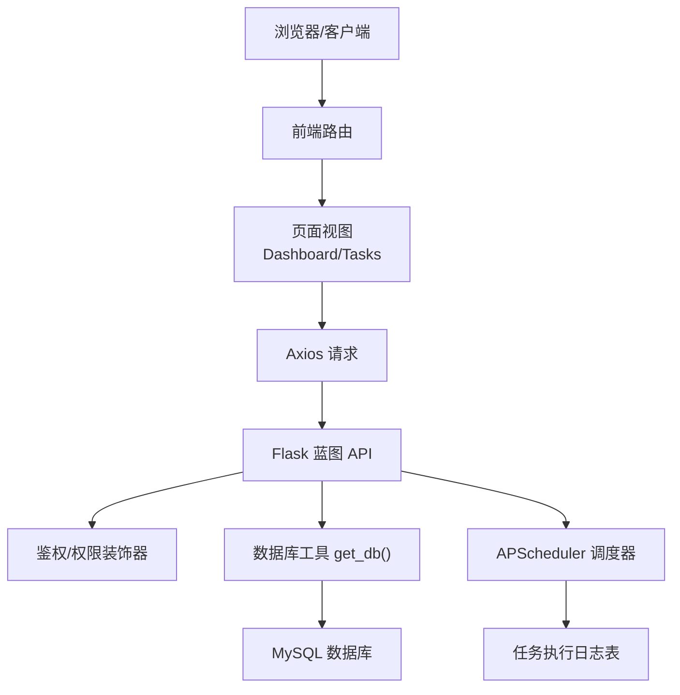
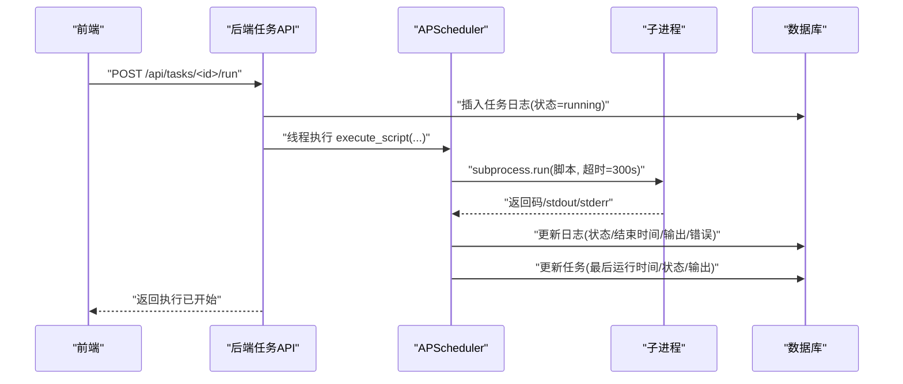
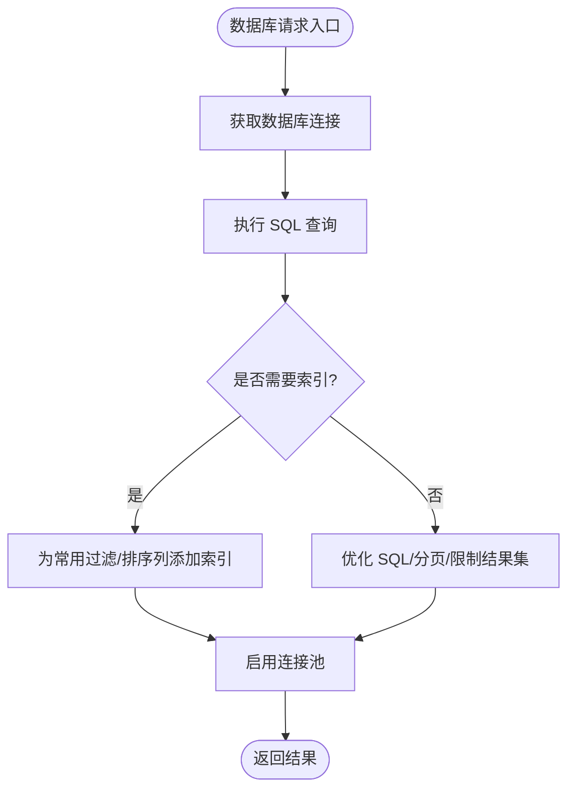
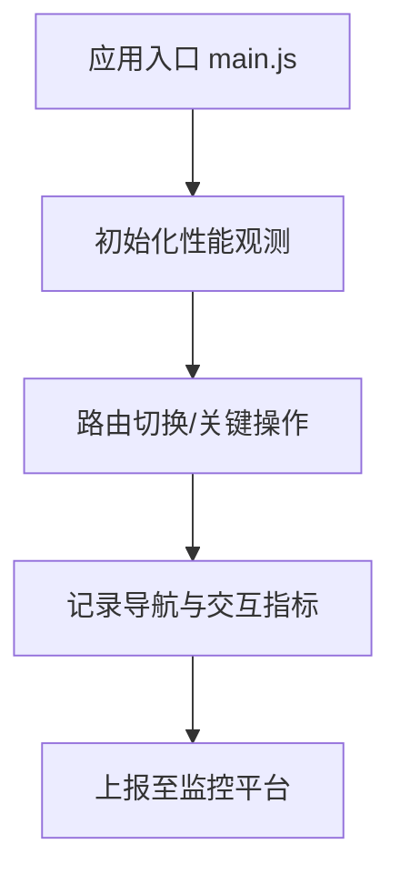
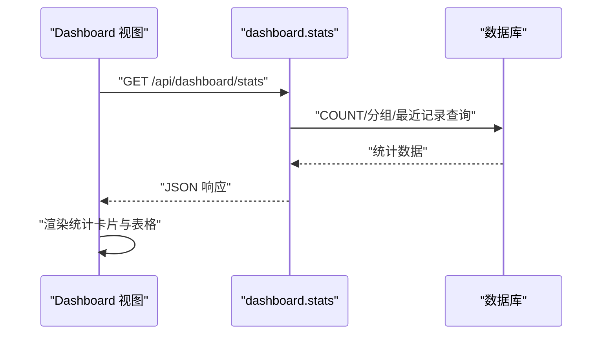
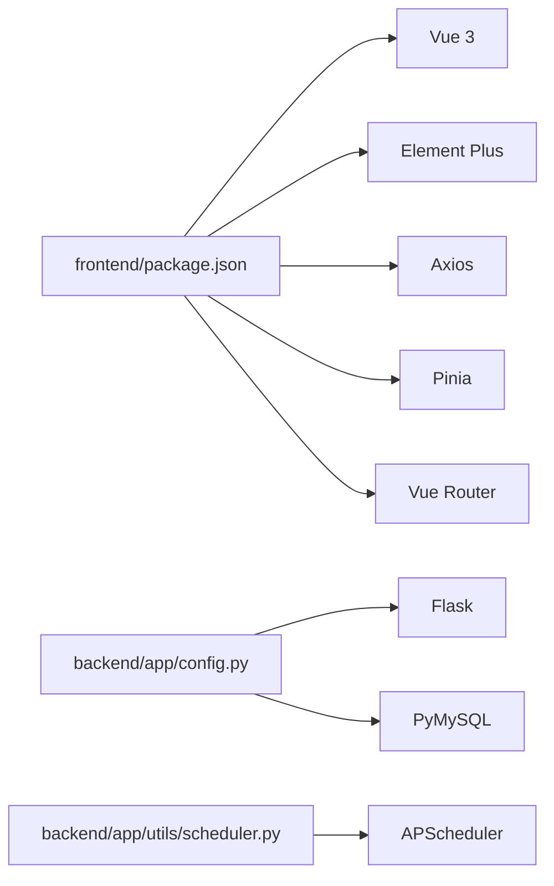

# 性能监控

<cite>
**本文引用的文件**
- [backend/app/config.py](file://backend/app/config.py)
- [backend/app/extensions.py](file://backend/app/extensions.py)
- [backend/app/utils/db.py](file://backend/app/utils/db.py)
- [backend/app/utils/scheduler.py](file://backend/app/utils/scheduler.py)
- [backend/app/utils/decorators.py](file://backend/app/utils/decorators.py)
- [backend/app/api/dashboard.py](file://backend/app/api/dashboard.py)
- [backend/app/api/servers.py](file://backend/app/api/servers.py)
- [backend/app/api/services.py](file://backend/app/api/services.py)
- [backend/app/api/tasks.py](file://backend/app/api/tasks.py)
- [frontend/src/main.js](file://frontend/src/main.js)
- [frontend/src/App.vue](file://frontend/src/App.vue)
- [frontend/package.json](file://frontend/package.json)
- [frontend/src/views/Dashboard.vue](file://frontend/src/views/Dashboard.vue)
- [frontend/src/views/Tasks.vue](file://frontend/src/views/Tasks.vue)
- [frontend/src/api/dashboard.js](file://frontend/src/api/dashboard.js)
- [frontend/src/router/index.js](file://frontend/src/router/index.js)
- [frontend/src/stores/user.js](file://frontend/src/stores/user.js)
- [frontend/src/components/HelloWorld.vue](file://frontend/src/components/HelloWorld.vue)
- [frontend/src/components/PasswordDisplay.vue](file://frontend/src/components/PasswordDisplay.vue)
- [frontend/src/layouts/MainLayout.vue](file://frontend/src/layouts/MainLayout.vue)
- [frontend/src/assets/](file://frontend/src/assets/)
- [frontend/src/style.css](file://frontend/src/style.css)
- [frontend/public/](file://frontend/public/)
- [frontend/vite.config.js](file://frontend/vite.config.js)
- [frontend/tsconfig.json](file://frontend/tsconfig.json)
- [backend/init_db.py](file://backend/init_db.py)
</cite>

## 目录
1. [简介](#简介)
2. [项目结构](#项目结构)
3. [核心组件](#核心组件)
4. [架构总览](#架构总览)
5. [详细组件分析](#详细组件分析)
6. [依赖分析](#依赖分析)
7. [性能考虑](#性能考虑)
8. [故障排查指南](#故障排查指南)
9. [结论](#结论)
10. [附录](#附录)

## 简介
本文件面向云运维平台的性能监控与优化，覆盖系统资源监控（CPU、内存、磁盘、网络）、应用性能指标、数据库性能监控与慢查询分析、连接池优化、前端性能监控（页面加载时间与用户体验指标）、APScheduler 定时任务监控与异常处理、日志分析与错误率统计、告警阈值设置、性能瓶颈识别与优化建议、以及监控仪表板配置。文档以仓库现有实现为基础，结合可扩展的最佳实践，帮助读者建立完善的性能监控体系。

## 项目结构
后端采用 Flask 微服务风格，按蓝图划分功能模块；前端基于 Vue 3 + Vite 构建，通过 Axios 发起 API 请求。数据库初始化脚本定义了任务执行日志等关键表结构，支持定时任务的运行状态与日志追踪。

**图表来源**
- [frontend/src/main.js:1-23](file://frontend/src/main.js#L1-L23)
- [frontend/src/App.vue:1-18](file://frontend/src/App.vue#L1-L18)
- [frontend/src/views/Dashboard.vue:118-214](file://frontend/src/views/Dashboard.vue#L118-L214)
- [frontend/src/views/Tasks.vue:32-56](file://frontend/src/views/Tasks.vue#L32-L56)
- [frontend/src/api/dashboard.js:1-5](file://frontend/src/api/dashboard.js#L1-L5)
- [backend/app/config.py:1-21](file://backend/app/config.py#L1-L21)
- [backend/app/extensions.py:1-2](file://backend/app/extensions.py#L1-L2)
- [backend/app/utils/db.py:1-17](file://backend/app/utils/db.py#L1-L17)
- [backend/app/utils/scheduler.py:1-249](file://backend/app/utils/scheduler.py#L1-L249)
- [backend/app/utils/decorators.py:1-95](file://backend/app/utils/decorators.py#L1-L95)
- [backend/app/api/dashboard.py:1-86](file://backend/app/api/dashboard.py#L1-L86)
- [backend/app/api/servers.py:1-203](file://backend/app/api/servers.py#L1-L203)
- [backend/app/api/services.py:1-144](file://backend/app/api/services.py#L1-L144)
- [backend/app/api/tasks.py:1-458](file://backend/app/api/tasks.py#L1-L458)
- [backend/init_db.py:200-229](file://backend/init_db.py#L200-L229)

**章节来源**
- [backend/app/config.py:1-21](file://backend/app/config.py#L1-L21)
- [backend/app/utils/db.py:1-17](file://backend/app/utils/db.py#L1-L17)
- [backend/app/utils/scheduler.py:1-249](file://backend/app/utils/scheduler.py#L1-L249)
- [backend/app/api/dashboard.py:1-86](file://backend/app/api/dashboard.py#L1-L86)
- [backend/app/api/tasks.py:1-458](file://backend/app/api/tasks.py#L1-L458)
- [frontend/src/main.js:1-23](file://frontend/src/main.js#L1-L23)
- [frontend/src/views/Dashboard.vue:118-214](file://frontend/src/views/Dashboard.vue#L118-L214)
- [frontend/src/views/Tasks.vue:32-56](file://frontend/src/views/Tasks.vue#L32-L56)
- [frontend/src/api/dashboard.js:1-5](file://frontend/src/api/dashboard.js#L1-L5)
- [backend/init_db.py:200-229](file://backend/init_db.py#L200-L229)

## 核心组件
- 配置中心：集中管理数据库、主机、端口、调试模式与上传目录等配置项，便于统一调整与部署。
- 数据访问层：封装数据库连接获取逻辑，支持多处复用与集中管理。
- 定时任务调度器：基于 APScheduler 实现 Cron 触发，支持任务启停、手动执行、日志记录与异常处理。
- API 层：提供仪表盘统计、服务器与服务管理、定时任务管理等接口，并集成鉴权与权限控制。
- 前端应用：通过路由与 Pinia 状态管理，调用后端 API 并渲染仪表板与任务视图。

**章节来源**
- [backend/app/config.py:1-21](file://backend/app/config.py#L1-L21)
- [backend/app/utils/db.py:1-17](file://backend/app/utils/db.py#L1-L17)
- [backend/app/utils/scheduler.py:1-249](file://backend/app/utils/scheduler.py#L1-L249)
- [backend/app/api/dashboard.py:1-86](file://backend/app/api/dashboard.py#L1-L86)
- [backend/app/api/tasks.py:1-458](file://backend/app/api/tasks.py#L1-L458)
- [frontend/src/main.js:1-23](file://frontend/src/main.js#L1-L23)

## 架构总览
后端通过蓝图组织 API，数据库连接由工具函数统一获取；定时任务通过调度器管理，执行过程写入日志表；前端通过 Axios 请求后端接口，使用 Element Plus 组件展示数据。

**图表来源**
- [frontend/src/views/Dashboard.vue:118-214](file://frontend/src/views/Dashboard.vue#L118-L214)
- [frontend/src/views/Tasks.vue:32-56](file://frontend/src/views/Tasks.vue#L32-L56)
- [frontend/src/api/dashboard.js:1-5](file://frontend/src/api/dashboard.js#L1-L5)
- [backend/app/api/dashboard.py:1-86](file://backend/app/api/dashboard.py#L1-L86)
- [backend/app/api/tasks.py:1-458](file://backend/app/api/tasks.py#L1-L458)
- [backend/app/utils/decorators.py:1-95](file://backend/app/utils/decorators.py#L1-L95)
- [backend/app/utils/db.py:1-17](file://backend/app/utils/db.py#L1-L17)
- [backend/app/utils/scheduler.py:1-249](file://backend/app/utils/scheduler.py#L1-L249)
- [backend/init_db.py:200-229](file://backend/init_db.py#L200-L229)

## 详细组件分析

### 定时任务调度与监控
- 任务生命周期：创建任务时保存脚本文件与 Cron 表达式，插入数据库并加入调度器；支持启用/禁用、更新、删除与手动执行。
- 执行流程：每次触发或手动执行时，创建执行日志记录，执行外部脚本（带超时保护），并将结果回写数据库。
- 异常处理：捕获子进程超时、脚本执行失败与数据库异常，确保日志与状态一致。
- 监控点：任务状态、最近一次执行时间与输出、日志表索引支持快速检索。

**图表来源**
- [backend/app/api/tasks.py:309-420](file://backend/app/api/tasks.py#L309-L420)
- [backend/app/utils/scheduler.py:32-144](file://backend/app/utils/scheduler.py#L32-L144)
- [backend/init_db.py:200-210](file://backend/init_db.py#L200-L210)

**章节来源**
- [backend/app/api/tasks.py:1-458](file://backend/app/api/tasks.py#L1-L458)
- [backend/app/utils/scheduler.py:1-249](file://backend/app/utils/scheduler.py#L1-L249)
- [backend/init_db.py:200-229](file://backend/init_db.py#L200-L229)

### 数据库性能监控与慢查询分析
- 连接管理：统一通过工具函数获取连接，便于集中配置字符集与游标类型。
- 表结构支撑：任务日志表包含任务 ID、状态、开始/结束时间、输出与错误信息，便于统计执行耗时与失败率。
- 慢查询建议：对高频查询（如仪表盘统计、任务日志查询）建立合适索引；对大结果集分页或限制数量；避免 N+1 查询。
- 连接池优化：建议引入连接池（如 PyMySQL 的连接池或 SQLAlchemy 池化），减少连接开销；设置最大连接数、空闲回收与超时时间。

**图表来源**
- [backend/app/utils/db.py:1-17](file://backend/app/utils/db.py#L1-L17)
- [backend/init_db.py:200-210](file://backend/init_db.py#L200-L210)

**章节来源**
- [backend/app/utils/db.py:1-17](file://backend/app/utils/db.py#L1-L17)
- [backend/init_db.py:200-229](file://backend/init_db.py#L200-L229)

### 应用性能指标监控
- 接口响应时间：在 API 层记录请求进入与返回时间，计算耗时并统计 P50/P95/P99。
- 错误率与状态码分布：统计 4xx/5xx 比例，结合日志定位问题。
- 资源占用：结合系统监控采集 CPU、内存、磁盘 IO、网络吞吐等指标，与业务峰值对应分析。
- 建议：在网关或中间件层埋点，统一采集与上报；对热点接口增加缓存与限流。

[本节为通用指导，无需特定文件来源]

### 前端性能监控
- 页面加载时间：测量 Navigation Timing（DNS、TCP、TLS、TTTF、DOMContentLoaded、Load）与首屏渲染时间。
- 用户体验指标：CLS（布局偏移）、INP（交互延迟）、FCP/FID/LCP 等。
- 前端实现建议：在入口文件初始化性能观测，在路由切换与关键操作处打点；通过 Element Plus 组件与 Axios 拦截器记录请求耗时。

**图表来源**
- [frontend/src/main.js:1-23](file://frontend/src/main.js#L1-L23)
- [frontend/src/App.vue:1-18](file://frontend/src/App.vue#L1-L18)

**章节来源**
- [frontend/src/main.js:1-23](file://frontend/src/main.js#L1-L23)
- [frontend/src/App.vue:1-18](file://frontend/src/App.vue#L1-L18)
- [frontend/package.json:1-24](file://frontend/package.json#L1-L24)

### 仪表盘与统计
- 仪表盘 API：聚合各表数量、按环境类型统计服务器分布、最近更新记录与证书状态。
- 前端展示：Dashboard 视图通过 API 获取数据并渲染卡片与表格，支持加载态与空状态提示。

**图表来源**
- [frontend/src/views/Dashboard.vue:118-214](file://frontend/src/views/Dashboard.vue#L118-L214)
- [frontend/src/api/dashboard.js:1-5](file://frontend/src/api/dashboard.js#L1-L5)
- [backend/app/api/dashboard.py:1-86](file://backend/app/api/dashboard.py#L1-L86)

**章节来源**
- [backend/app/api/dashboard.py:1-86](file://backend/app/api/dashboard.py#L1-L86)
- [frontend/src/views/Dashboard.vue:118-214](file://frontend/src/views/Dashboard.vue#L118-L214)
- [frontend/src/api/dashboard.js:1-5](file://frontend/src/api/dashboard.js#L1-L5)

### 系统资源监控与告警阈值
- 建议采集：CPU 使用率、负载、内存使用与交换、磁盘空间与 IO、网络收发速率。
- 告警阈值：根据业务峰值设定基线与阈值，区分预警与严重级别；对抖动场景引入滑动窗口与去噪。
- 可视化：在仪表板中展示趋势图与实时指标，支持按环境/主机筛选。

[本节为通用指导，无需特定文件来源]

## 依赖分析
- 前端依赖：Vue 3、Element Plus、Axios、Pinia、Vue Router。
- 后端依赖：Flask、PyMySQL、APScheduler、Cron 表达式解析。
- 外部集成：定时任务通过子进程执行外部脚本，需注意安全与隔离。

**图表来源**
- [frontend/package.json:1-24](file://frontend/package.json#L1-L24)
- [backend/app/config.py:1-21](file://backend/app/config.py#L1-L21)
- [backend/app/utils/scheduler.py:1-249](file://backend/app/utils/scheduler.py#L1-L249)

**章节来源**
- [frontend/package.json:1-24](file://frontend/package.json#L1-L24)
- [backend/app/config.py:1-21](file://backend/app/config.py#L1-L21)
- [backend/app/utils/scheduler.py:1-249](file://backend/app/utils/scheduler.py#L1-L249)

## 性能考虑
- 数据库层
  - 为高频查询列建立索引，避免全表扫描；对分页查询使用覆盖索引。
  - 控制单次查询返回量，必要时分页或限制数量。
  - 使用连接池降低连接成本，合理设置最大连接数与空闲回收。
- 后端层
  - 对热点接口增加缓存（如 Redis）；对批量操作使用事务与批处理。
  - 控制请求体大小与上传文件路径，避免内存压力。
- 前端层
  - 图片与静态资源压缩与懒加载；组件按需引入；减少不必要的重渲染。
  - 使用路由懒加载与组件异步加载，缩短首屏时间。
- 定时任务
  - 严格设置超时时间，防止长时间阻塞；失败重试策略与幂等设计。
  - 任务日志表建立索引，定期归档历史日志，避免表膨胀。

[本节为通用指导，无需特定文件来源]

## 故障排查指南
- 定时任务异常
  - 检查任务日志表中最近记录的状态与错误信息；确认脚本文件存在且可执行。
  - 核对 Cron 表达式格式与调度器运行状态；必要时手动执行验证。
- 数据库连接问题
  - 检查数据库连通性与凭据；确认字符集与游标类型配置正确。
  - 关注连接池配置，避免连接泄漏与超时。
- 前端接口失败
  - 查看浏览器网络面板与后端日志；确认鉴权头与权限校验通过。
  - 检查路由与状态管理，确认数据加载顺序与错误处理。

**章节来源**
- [backend/app/utils/scheduler.py:99-133](file://backend/app/utils/scheduler.py#L99-L133)
- [backend/app/api/tasks.py:309-420](file://backend/app/api/tasks.py#L309-L420)
- [backend/app/utils/db.py:1-17](file://backend/app/utils/db.py#L1-L17)
- [backend/app/utils/decorators.py:1-95](file://backend/app/utils/decorators.py#L1-L95)

## 结论
本项目已具备定时任务调度与日志追踪、基础仪表盘统计与前端展示能力。建议进一步完善数据库索引与连接池、接入系统资源监控与前端性能观测、建立告警阈值与可视化仪表板，并持续优化热点接口与任务执行效率，形成闭环的性能监控与优化体系。

[本节为总结，无需特定文件来源]

## 附录
- 监控仪表板配置建议
  - 指标面板：CPU/内存/磁盘/网络、请求 QPS/错误率、响应时间分布、任务成功率与耗时。
  - 告警规则：基于阈值与趋势的多级告警；支持静默与升级策略。
  - 数据来源：后端接口、系统监控探针、前端性能观测 SDK。
- 优化清单
  - 数据库：索引、分页、连接池、只读副本。
  - 后端：缓存、限流、异步任务、日志分级。
  - 前端：懒加载、CDN、压缩、骨架屏。

[本节为通用指导，无需特定文件来源]