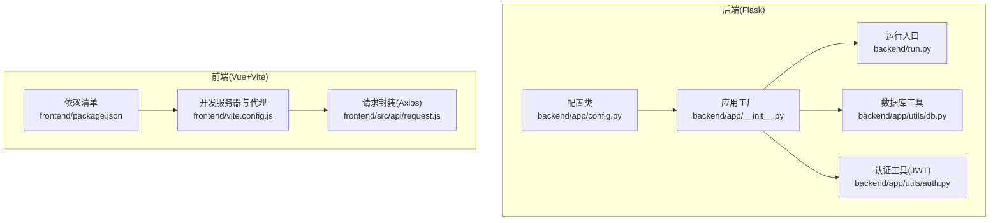
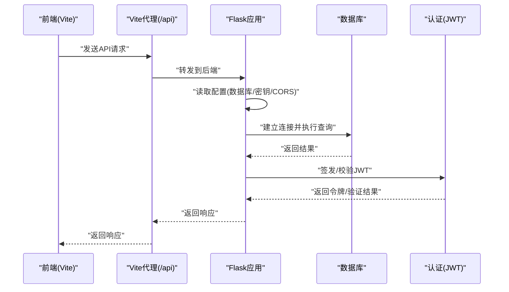
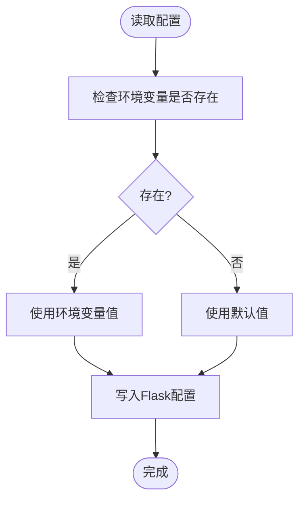
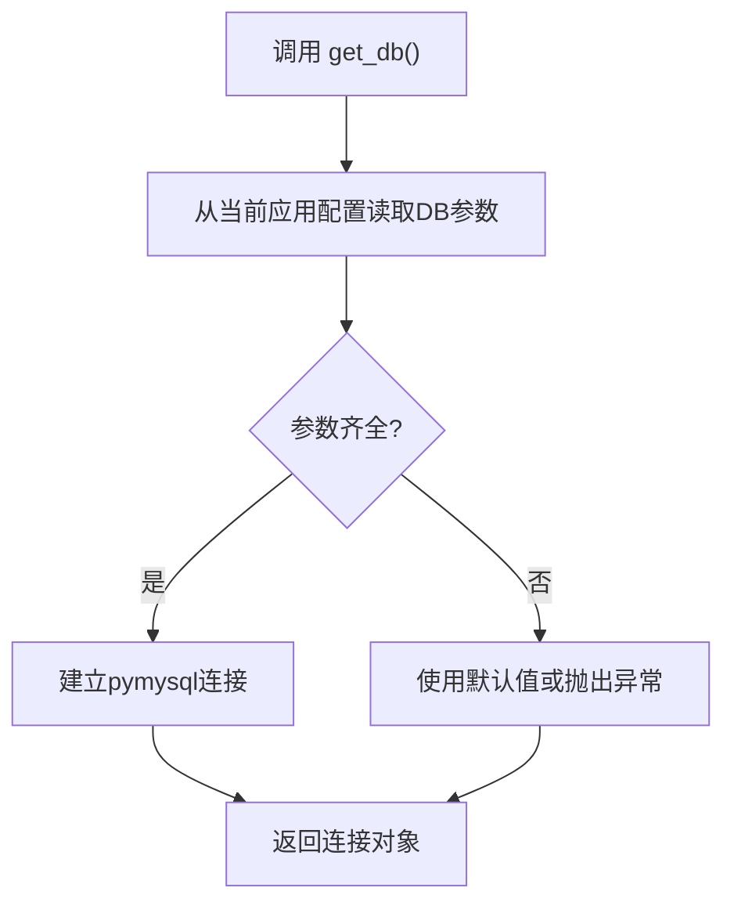
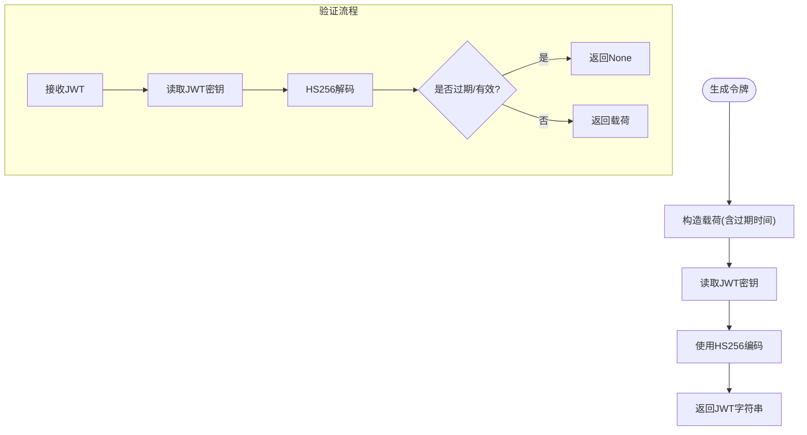
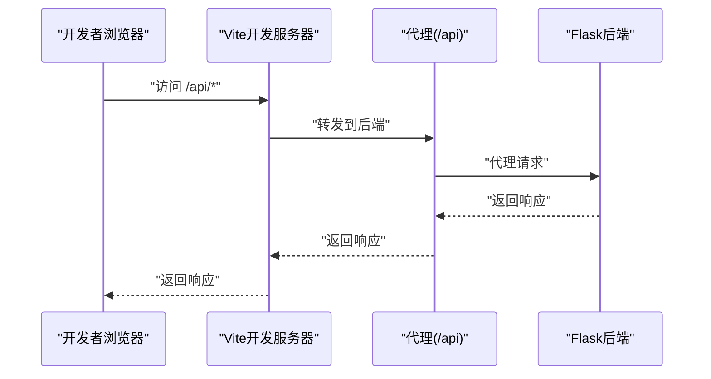
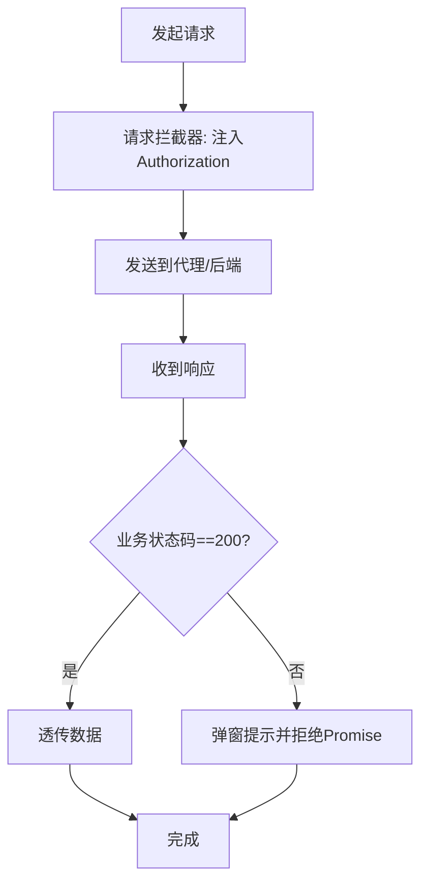
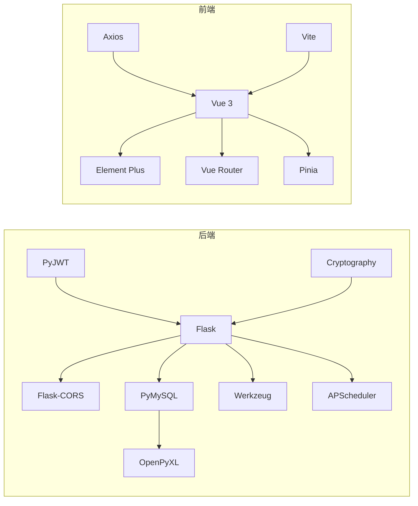

# 环境配置

<cite>
**本文引用的文件**
- [backend/app/config.py](file://backend/app/config.py)
- [backend/app/__init__.py](file://backend/app/__init__.py)
- [backend/run.py](file://backend/run.py)
- [backend/requirements.txt](file://backend/requirements.txt)
- [backend/app/utils/db.py](file://backend/app/utils/db.py)
- [backend/app/utils/auth.py](file://backend/app/utils/auth.py)
- [frontend/vite.config.js](file://frontend/vite.config.js)
- [frontend/package.json](file://frontend/package.json)
- [frontend/src/api/request.js](file://frontend/src/api/request.js)
</cite>

## 目录
1. [简介](#简介)
2. [项目结构](#项目结构)
3. [核心组件](#核心组件)
4. [架构总览](#架构总览)
5. [详细组件分析](#详细组件分析)
6. [依赖分析](#依赖分析)
7. [性能考虑](#性能考虑)
8. [故障排查指南](#故障排查指南)
9. [结论](#结论)
10. [附录](#附录)

## 简介
本文件面向云运维平台的部署与运维人员，系统性说明不同环境（开发、测试、生产）下的配置要求与设置方法，涵盖 Python 虚拟环境与后端依赖、Node.js 与前端依赖、配置文件与环境变量、数据库连接、JWT 密钥、CORS 配置等，并提供常见问题排查与最佳实践建议。

## 项目结构
- 后端采用 Flask 应用，配置集中于配置类并通过应用工厂函数加载；运行入口通过独立脚本启动。
- 前端使用 Vite 开发服务器，默认代理到后端 API；Axios 统一请求封装，自动注入 JWT。
- 数据库访问通过工具模块从 Flask 配置读取连接参数；认证模块基于 JWT 实现。

图表来源
- [backend/app/config.py:1-21](file://backend/app/config.py#L1-L21)
- [backend/app/__init__.py:1-62](file://backend/app/__init__.py#L1-L62)
- [backend/run.py:1-8](file://backend/run.py#L1-L8)
- [backend/app/utils/db.py:1-17](file://backend/app/utils/db.py#L1-L17)
- [backend/app/utils/auth.py:1-83](file://backend/app/utils/auth.py#L1-L83)
- [frontend/vite.config.js:1-16](file://frontend/vite.config.js#L1-L16)
- [frontend/package.json:1-24](file://frontend/package.json#L1-L24)
- [frontend/src/api/request.js:1-54](file://frontend/src/api/request.js#L1-L54)

章节来源
- [backend/app/config.py:1-21](file://backend/app/config.py#L1-L21)
- [backend/app/__init__.py:1-62](file://backend/app/__init__.py#L1-L62)
- [backend/run.py:1-8](file://backend/run.py#L1-L8)
- [frontend/vite.config.js:1-16](file://frontend/vite.config.js#L1-L16)
- [frontend/package.json:1-24](file://frontend/package.json#L1-L24)
- [frontend/src/api/request.js:1-54](file://frontend/src/api/request.js#L1-L54)

## 核心组件
- 配置类：集中定义密钥、数据库、Flask 运行参数、上传目录与大小限制等。
- 应用工厂：加载配置、启用 CORS、注册蓝图、初始化定时任务。
- 运行入口：从配置类读取主机、端口、调试模式启动服务。
- 数据库工具：从 Flask 配置读取连接参数，建立连接。
- 认证工具：基于 JWT 的签发与校验，支持过期时间与算法配置。
- 前端代理：Vite 本地开发代理后端 API；Axios 统一处理请求头与响应错误。

章节来源
- [backend/app/config.py:1-21](file://backend/app/config.py#L1-L21)
- [backend/app/__init__.py:1-62](file://backend/app/__init__.py#L1-L62)
- [backend/run.py:1-8](file://backend/run.py#L1-L8)
- [backend/app/utils/db.py:1-17](file://backend/app/utils/db.py#L1-L17)
- [backend/app/utils/auth.py:1-83](file://backend/app/utils/auth.py#L1-L83)
- [frontend/vite.config.js:1-16](file://frontend/vite.config.js#L1-L16)
- [frontend/src/api/request.js:1-54](file://frontend/src/api/request.js#L1-L54)

## 架构总览
下图展示前后端交互与配置驱动的关键流程：前端通过代理访问后端 API，后端从配置读取数据库与安全参数，认证模块使用 JWT 密钥进行签发与校验。

图表来源
- [frontend/vite.config.js:1-16](file://frontend/vite.config.js#L1-L16)
- [backend/app/__init__.py:1-62](file://backend/app/__init__.py#L1-L62)
- [backend/app/utils/db.py:1-17](file://backend/app/utils/db.py#L1-L17)
- [backend/app/utils/auth.py:1-83](file://backend/app/utils/auth.py#L1-L83)

## 详细组件分析

### 配置类与环境变量
- 关键参数
  - 安全密钥：用于签名与加密，需在生产环境强制覆盖。
  - JWT 密钥与过期时长：控制令牌有效期与签名校验。
  - 数据库连接：主机、端口、用户名、密码、数据库名。
  - Flask 运行参数：主机绑定、端口、调试模式。
  - 上传目录与最大内容长度：控制文件上传行为。
- 环境变量优先级：若未设置环境变量，则采用默认值；生产环境必须显式覆盖默认值。
- CORS：对 /api/* 路由开放跨域并允许凭据。

图表来源
- [backend/app/config.py:1-21](file://backend/app/config.py#L1-L21)
- [backend/app/__init__.py:24-25](file://backend/app/__init__.py#L24-L25)

章节来源
- [backend/app/config.py:1-21](file://backend/app/config.py#L1-L21)
- [backend/app/__init__.py:24-25](file://backend/app/__init__.py#L24-L25)

### 数据库连接与访问
- 连接参数来源于 Flask 配置，使用 Dict 游标返回结果。
- 建议在生产环境使用只读账号与最小权限策略，避免明文密码。

图表来源
- [backend/app/utils/db.py:1-17](file://backend/app/utils/db.py#L1-L17)
- [backend/app/config.py:9-13](file://backend/app/config.py#L9-L13)

章节来源
- [backend/app/utils/db.py:1-17](file://backend/app/utils/db.py#L1-L17)
- [backend/app/config.py:9-13](file://backend/app/config.py#L9-L13)

### JWT 认证与密钥管理
- 令牌载荷包含用户标识、用户名、角色、签发时间与过期时间。
- 使用 HS256 算法，密钥来自配置；过期时间可配置。
- 验证失败（过期或无效）统一返回空值，便于上层处理。

图表来源
- [backend/app/utils/auth.py:11-35](file://backend/app/utils/auth.py#L11-L35)
- [backend/app/utils/auth.py:38-55](file://backend/app/utils/auth.py#L38-L55)
- [backend/app/config.py:5-7](file://backend/app/config.py#L5-L7)

章节来源
- [backend/app/utils/auth.py:1-83](file://backend/app/utils/auth.py#L1-L83)
- [backend/app/config.py:5-7](file://backend/app/config.py#L5-L7)

### CORS 与前端代理
- 后端对 /api/* 开放跨域并允许凭据。
- 前端 Vite 开发服务器将 /api 前缀代理到后端地址，便于本地联调。

图表来源
- [backend/app/__init__.py:24-25](file://backend/app/__init__.py#L24-L25)
- [frontend/vite.config.js:8-13](file://frontend/vite.config.js#L8-L13)

章节来源
- [backend/app/__init__.py:24-25](file://backend/app/__init__.py#L24-L25)
- [frontend/vite.config.js:1-16](file://frontend/vite.config.js#L1-L16)

### 前端请求封装与错误处理
- Axios 创建实例，设置基础路径为 /api、超时与内容类型。
- 请求拦截器自动注入 Bearer Token（localStorage 中）。
- 响应拦截器统一处理业务错误码与 401 登录态失效场景。

图表来源
- [frontend/src/api/request.js:5-11](file://frontend/src/api/request.js#L5-L11)
- [frontend/src/api/request.js:13-23](file://frontend/src/api/request.js#L13-L23)
- [frontend/src/api/request.js:25-51](file://frontend/src/api/request.js#L25-L51)

章节来源
- [frontend/src/api/request.js:1-54](file://frontend/src/api/request.js#L1-L54)

## 依赖分析
- 后端依赖：Flask、Flask-CORS、PyMySQL、PyJWT、Werkzeug、APScheduler、OpenPyXL、Cryptography。
- 前端依赖：Vue 3、Element Plus、Vue Router、Pinia、Axios、Vite 及其 Vue 插件。

图表来源
- [backend/requirements.txt:1-9](file://backend/requirements.txt#L1-L9)
- [frontend/package.json:11-22](file://frontend/package.json#L11-L22)

章节来源
- [backend/requirements.txt:1-9](file://backend/requirements.txt#L1-L9)
- [frontend/package.json:1-24](file://frontend/package.json#L1-L24)

## 性能考虑
- 生产环境关闭调试模式，开启 Gunicorn/uWSGI 并配置进程/线程数。
- 合理设置数据库连接池大小与超时时间，避免连接泄漏。
- 前端构建产物用于生产，禁用开发服务器代理，直接走 Nginx/CDN。
- JWT 过期时间按需缩短以提升安全性，同时减少长时间有效令牌的风险。

## 故障排查指南
- 启动失败（端口占用）
  - 现象：无法绑定端口或端口被占用。
  - 排查：确认运行端口与系统占用情况，修改配置中的端口或释放占用。
  - 参考：[backend/run.py:7](file://backend/run.py#L7)、[backend/app/config.py:16-17](file://backend/app/config.py#L16-L17)
- CORS 失败（跨域报错）
  - 现象：浏览器控制台出现跨域错误。
  - 排查：确认后端 CORS 对 /api/* 已开放且允许凭据；前端代理目标地址正确。
  - 参考：[backend/app/__init__.py:24-25](file://backend/app/__init__.py#L24-L25)、[frontend/vite.config.js:8-13](file://frontend/vite.config.js#L8-L13)
- 数据库连接失败
  - 现象：应用启动时报数据库连接错误。
  - 排查：核对数据库主机、端口、账号、密码与数据库名；确保网络连通与防火墙放行。
  - 参考：[backend/app/utils/db.py:8-16](file://backend/app/utils/db.py#L8-L16)、[backend/app/config.py:9-13](file://backend/app/config.py#L9-L13)
- JWT 无效或过期
  - 现象：接口返回 401 或业务错误。
  - 排查：确认前端已正确存储与注入 Bearer Token；核对 JWT 密钥一致且未改动；检查过期时间。
  - 参考：[frontend/src/api/request.js:14-23](file://frontend/src/api/request.js#L14-L23)、[backend/app/utils/auth.py:38-55](file://backend/app/utils/auth.py#L38-L55)、[backend/app/config.py:5-7](file://backend/app/config.py#L5-L7)
- 前端 404 或代理不通
  - 现象：访问 /api/* 返回 404 或代理失败。
  - 排查：确认 Vite 代理配置指向正确的后端地址；后端已启动并监听对应主机与端口。
  - 参考：[frontend/vite.config.js:8-13](file://frontend/vite.config.js#L8-L13)、[backend/app/config.py:16-17](file://backend/app/config.py#L16-L17)

章节来源
- [backend/run.py:7](file://backend/run.py#L7)
- [backend/app/config.py:16-17](file://backend/app/config.py#L16-L17)
- [backend/app/__init__.py:24-25](file://backend/app/__init__.py#L24-L25)
- [frontend/vite.config.js:8-13](file://frontend/vite.config.js#L8-L13)
- [backend/app/utils/db.py:8-16](file://backend/app/utils/db.py#L8-L16)
- [backend/app/config.py:9-13](file://backend/app/config.py#L9-L13)
- [frontend/src/api/request.js:14-23](file://frontend/src/api/request.js#L14-L23)
- [backend/app/utils/auth.py:38-55](file://backend/app/utils/auth.py#L38-L55)
- [backend/app/config.py:5-7](file://backend/app/config.py#L5-L7)

## 结论
- 不同环境的差异主要体现在环境变量覆盖与安全密钥管理上；生产环境必须显式覆盖默认值。
- 建议采用最小权限数据库账号、严格的 CORS 策略与合理的 JWT 过期时间。
- 前后端分离部署时，务必保证代理与跨域配置一致，避免联调失败。

## 附录

### 环境变量清单与建议
- 安全与认证
  - SECRET_KEY：后端签名密钥，生产必须覆盖默认值。
  - JWT_SECRET_KEY：JWT 签名密钥，生产必须覆盖默认值。
  - JWT_EXPIRATION_HOURS：令牌过期小时数，按需调整。
- 数据库
  - DB_HOST：数据库主机。
  - DB_PORT：数据库端口。
  - DB_USER：数据库用户名。
  - DB_PASSWORD：数据库密码。
  - DB_NAME：数据库名。
- Flask 运行
  - FLASK_DEBUG：开发调试开关。
  - FLASK_HOST：绑定主机。
  - FLASK_PORT：绑定端口。
- 其他
  - MAX_CONTENT_LENGTH：上传文件大小限制（字节）。
  - UPLOAD_FOLDER：上传目录绝对路径。

章节来源
- [backend/app/config.py:5-21](file://backend/app/config.py#L5-L21)

### Python 虚拟环境与后端依赖
- 建议使用 Python 3.8+，创建虚拟环境并安装后端依赖。
- 依赖清单参见后端依赖文件。

章节来源
- [backend/requirements.txt:1-9](file://backend/requirements.txt#L1-L9)

### Node.js 与前端依赖
- 建议使用 Node.js 18+，安装前端依赖并启动开发服务器。
- 依赖清单与脚本参见前端依赖文件。

章节来源
- [frontend/package.json:1-24](file://frontend/package.json#L1-L24)

### 前端代理与开发服务器
- Vite 默认开发端口与代理规则，确保代理目标与后端一致。

章节来源
- [frontend/vite.config.js:1-16](file://frontend/vite.config.js#L1-L16)

### 最佳实践建议
- 生产环境
  - 必须覆盖所有默认密钥与敏感参数。
  - 关闭调试模式，使用反向代理与 HTTPS。
  - 严格最小权限数据库账号与网络访问控制。
- 开发/测试环境
  - 可使用默认密钥进行快速联调，但切换生产前必须替换。
  - 保持前后端代理一致，避免跨域与路径问题。