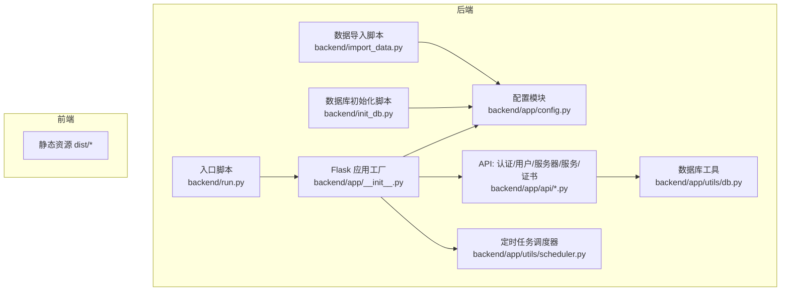
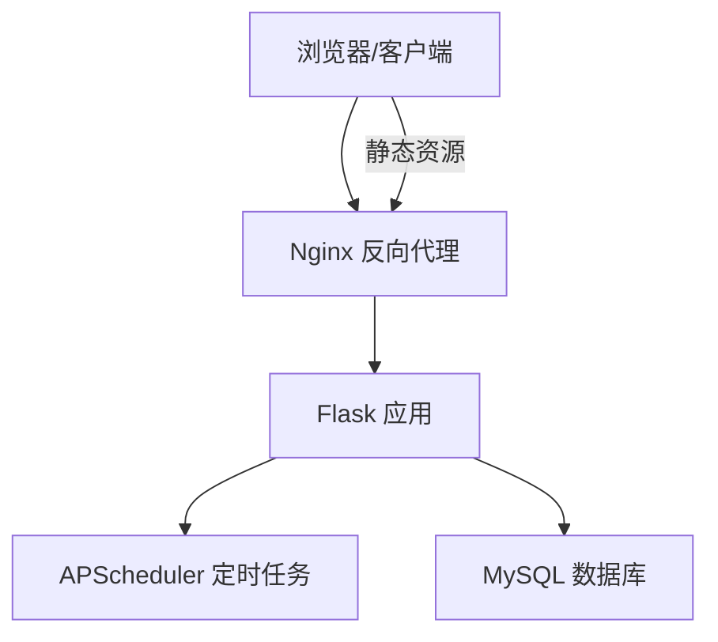
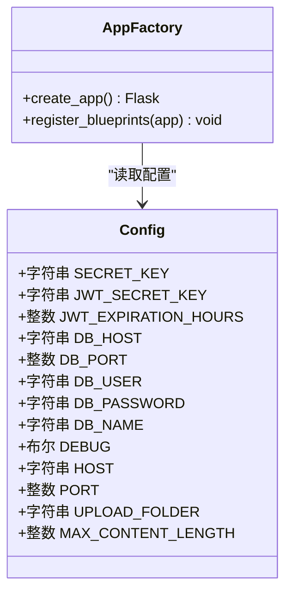
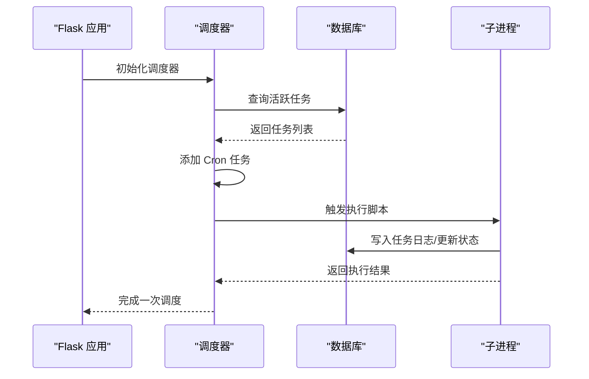
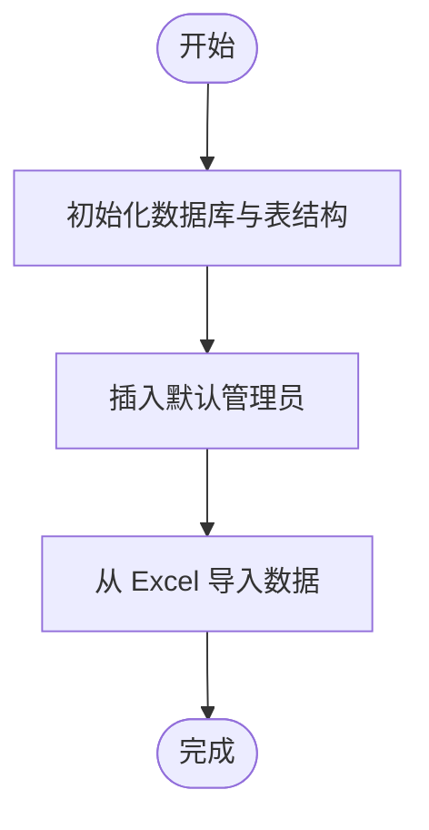
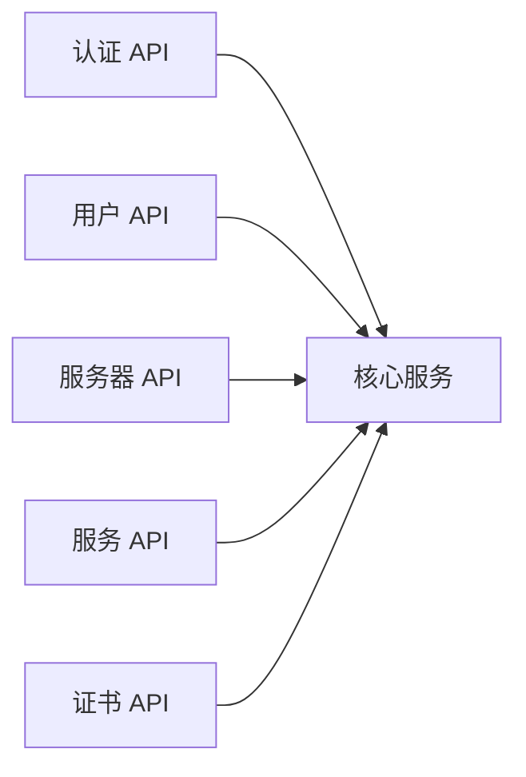
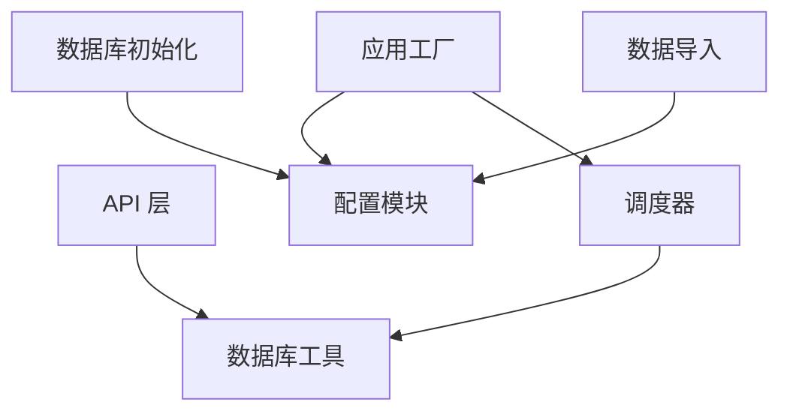

# 部署运维

<cite>
**本文引用的文件**
- [backend/app/config.py](file://backend/app/config.py)
- [backend/app/__init__.py](file://backend/app/__init__.py)
- [backend/run.py](file://backend/run.py)
- [backend/app/extensions.py](file://backend/app/extensions.py)
- [backend/app/utils/db.py](file://backend/app/utils/db.py)
- [backend/app/utils/scheduler.py](file://backend/app/utils/scheduler.py)
- [backend/init_db.py](file://backend/init_db.py)
- [backend/import_data.py](file://backend/import_data.py)
- [backend/app/api/auth.py](file://backend/app/api/auth.py)
- [backend/app/api/users.py](file://backend/app/api/users.py)
- [backend/app/api/servers.py](file://backend/app/api/servers.py)
- [backend/app/api/services.py](file://backend/app/api/services.py)
- [backend/app/api/certs.py](file://backend/app/api/certs.py)
</cite>

## 目录
1. [简介](#简介)
2. [项目结构](#项目结构)
3. [核心组件](#核心组件)
4. [架构总览](#架构总览)
5. [详细组件分析](#详细组件分析)
6. [依赖分析](#依赖分析)
7. [性能考虑](#性能考虑)
8. [故障排查指南](#故障排查指南)
9. [结论](#结论)
10. [附录](#附录)

## 简介
本文件面向云运维平台的生产环境部署与日常运维，覆盖以下主题：
- 不同部署环境的配置差异（开发、测试、生产）
- Docker 容器化部署、Nginx 反向代理与 SSL 证书管理
- 性能优化策略、监控告警与日志管理
- 数据库备份恢复、版本升级与故障处理流程
- 安全加固、访问控制与合规性要求
- CI/CD 流水线与自动化部署策略

## 项目结构
后端采用 Flask 微服务架构，通过蓝图组织 API；数据库初始化与数据导入脚本独立；定时任务调度器负责周期性脚本执行；前端静态资源位于 dist 目录。

**图示来源**
- [backend/app/__init__.py:1-53](file://backend/app/__init__.py#L1-L53)
- [backend/app/config.py:1-21](file://backend/app/config.py#L1-L21)
- [backend/run.py:1-8](file://backend/run.py#L1-L8)
- [backend/app/utils/db.py:1-17](file://backend/app/utils/db.py#L1-L17)
- [backend/app/utils/scheduler.py:1-249](file://backend/app/utils/scheduler.py#L1-L249)
- [backend/init_db.py:1-230](file://backend/init_db.py#L1-L230)
- [backend/import_data.py:1-371](file://backend/import_data.py#L1-L371)

**章节来源**
- [backend/app/__init__.py:1-53](file://backend/app/__init__.py#L1-L53)
- [backend/app/config.py:1-21](file://backend/app/config.py#L1-L21)
- [backend/run.py:1-8](file://backend/run.py#L1-L8)
- [backend/init_db.py:1-230](file://backend/init_db.py#L1-L230)
- [backend/import_data.py:1-371](file://backend/import_data.py#L1-L371)

## 核心组件
- 应用工厂与蓝图注册：集中创建 Flask 应用、加载配置、注册 CORS 与全部蓝图。
- 配置模块：统一读取环境变量，支持多环境差异化。
- 数据库工具：封装连接获取，供各 API 使用。
- 定时任务调度器：基于 APScheduler，支持 Cron 触发、超时控制与日志记录。
- 数据库初始化与数据导入：按表结构初始化并导入历史数据。
- API 层：认证、用户、服务器、服务、证书等业务接口。

**章节来源**
- [backend/app/__init__.py:1-53](file://backend/app/__init__.py#L1-L53)
- [backend/app/config.py:1-21](file://backend/app/config.py#L1-L21)
- [backend/app/utils/db.py:1-17](file://backend/app/utils/db.py#L1-L17)
- [backend/app/utils/scheduler.py:1-249](file://backend/app/utils/scheduler.py#L1-L249)
- [backend/init_db.py:1-230](file://backend/init_db.py#L1-L230)
- [backend/import_data.py:1-371](file://backend/import_data.py#L1-L371)

## 架构总览
后端以 WSGI 方式运行，前端静态资源由 Nginx 提供，API 通过反向代理转发至后端。数据库由外部 MySQL 提供，定时任务在后端进程中异步执行。

**图示来源**
- [backend/app/__init__.py:1-53](file://backend/app/__init__.py#L1-L53)
- [backend/app/utils/scheduler.py:1-249](file://backend/app/utils/scheduler.py#L1-L249)
- [backend/app/utils/db.py:1-17](file://backend/app/utils/db.py#L1-L17)

## 详细组件分析

### 组件一：应用工厂与配置加载
- 应用工厂负责：
  - 从 Config 类加载配置
  - 动态注入大写常量到 app.config
  - 注册 CORS 与所有蓝图
  - 初始化定时任务调度器
- 配置模块通过环境变量控制：
  - 密钥与 JWT
  - 数据库连接参数
  - Flask 主机、端口、调试模式
  - 上传目录与最大文件大小

**图示来源**
- [backend/app/config.py:1-21](file://backend/app/config.py#L1-L21)
- [backend/app/__init__.py:1-53](file://backend/app/__init__.py#L1-L53)

**章节来源**
- [backend/app/__init__.py:1-53](file://backend/app/__init__.py#L1-L53)
- [backend/app/config.py:1-21](file://backend/app/config.py#L1-L21)

### 组件二：数据库连接与定时任务
- 数据库连接：
  - 通过工具函数获取连接，使用配置中的主机、端口、用户、密码、数据库名
- 定时任务：
  - 从数据库加载活跃任务，解析 Cron 表达式，启动调度器
  - 执行脚本时创建任务日志、记录状态与输出
  - 支持超时控制与异常处理，保证日志一致性

**图示来源**
- [backend/app/utils/scheduler.py:1-249](file://backend/app/utils/scheduler.py#L1-L249)
- [backend/app/utils/db.py:1-17](file://backend/app/utils/db.py#L1-L17)

**章节来源**
- [backend/app/utils/scheduler.py:1-249](file://backend/app/utils/scheduler.py#L1-L249)
- [backend/app/utils/db.py:1-17](file://backend/app/utils/db.py#L1-L17)

### 组件三：数据库初始化与数据导入
- 初始化脚本：
  - 创建数据库与所有表结构（用户、服务器、服务、Web 账户、应用系统、域名证书、定时任务、任务日志）
  - 插入默认管理员账户
- 数据导入脚本：
  - 从 Excel 导入多类台账与账户信息，支持测试/生产/智慧环保/水电集团等场景

**图示来源**
- [backend/init_db.py:1-230](file://backend/init_db.py#L1-L230)
- [backend/import_data.py:1-371](file://backend/import_data.py#L1-L371)

**章节来源**
- [backend/init_db.py:1-230](file://backend/init_db.py#L1-L230)
- [backend/import_data.py:1-371](file://backend/import_data.py#L1-L371)

### 组件四：API 接口概览
- 认证 API：登录、获取用户资料、修改密码
- 用户管理 API：管理员可增删改查用户
- 服务器管理 API：按环境与关键词检索、详情、CRU
- 服务管理 API：按分类与关键词检索、CRU
- 证书管理 API：域名与证书台账的 CRU

**图示来源**
- [backend/app/api/auth.py:1-184](file://backend/app/api/auth.py#L1-L184)
- [backend/app/api/users.py:1-268](file://backend/app/api/users.py#L1-L268)
- [backend/app/api/servers.py:1-203](file://backend/app/api/servers.py#L1-L203)
- [backend/app/api/services.py:1-144](file://backend/app/api/services.py#L1-L144)
- [backend/app/api/certs.py:1-145](file://backend/app/api/certs.py#L1-L145)

**章节来源**
- [backend/app/api/auth.py:1-184](file://backend/app/api/auth.py#L1-L184)
- [backend/app/api/users.py:1-268](file://backend/app/api/users.py#L1-L268)
- [backend/app/api/servers.py:1-203](file://backend/app/api/servers.py#L1-L203)
- [backend/app/api/services.py:1-144](file://backend/app/api/services.py#L1-L144)
- [backend/app/api/certs.py:1-145](file://backend/app/api/certs.py#L1-L145)

## 依赖分析
- 组件耦合：
  - API 层依赖数据库工具获取连接
  - 应用工厂依赖配置与调度器初始化
  - 调度器依赖数据库配置与连接
- 外部依赖：
  - Flask、APScheduler、PyMySQL、openpyxl（导入脚本）

**图示来源**
- [backend/app/__init__.py:1-53](file://backend/app/__init__.py#L1-L53)
- [backend/app/config.py:1-21](file://backend/app/config.py#L1-L21)
- [backend/app/utils/db.py:1-17](file://backend/app/utils/db.py#L1-L17)
- [backend/app/utils/scheduler.py:1-249](file://backend/app/utils/scheduler.py#L1-L249)
- [backend/init_db.py:1-230](file://backend/init_db.py#L1-L230)
- [backend/import_data.py:1-371](file://backend/import_data.py#L1-L371)

**章节来源**
- [backend/app/__init__.py:1-53](file://backend/app/__init__.py#L1-L53)
- [backend/app/utils/db.py:1-17](file://backend/app/utils/db.py#L1-L17)
- [backend/app/utils/scheduler.py:1-249](file://backend/app/utils/scheduler.py#L1-L249)
- [backend/init_db.py:1-230](file://backend/init_db.py#L1-L230)
- [backend/import_data.py:1-371](file://backend/import_data.py#L1-L371)

## 性能考虑
- 数据库连接池与复用：建议在生产环境引入连接池（如 PyMySQL 的连接池参数），减少频繁建立/关闭连接的开销。
- 定时任务并发控制：调度器使用线程执行脚本，建议限制并发数量并为耗时任务增加队列与去重机制。
- API 分页与索引：对大表查询（如服务器、服务、证书）使用分页与合适索引，避免全表扫描。
- 缓存策略：对不频繁变动的数据（如枚举、配置）进行缓存，降低数据库压力。
- 前端静态资源：Nginx 启用 gzip、缓存头与长缓存策略，提升静态资源加载速度。

[本节为通用性能建议，无需具体文件来源]

## 故障排查指南
- 登录失败/权限问题：
  - 检查用户是否存在且激活
  - 核对密码哈希与 JWT 密钥
- 数据库连接异常：
  - 校验主机、端口、用户、密码、数据库名
  - 确认网络连通与防火墙放行
- 定时任务未执行：
  - 查看调度器是否启动
  - 检查 Cron 表达式与脚本路径是否存在
  - 关注任务日志表中的状态与错误信息
- API 报错 500：
  - 查看后端日志定位异常
  - 确认数据库事务提交/回滚逻辑

**章节来源**
- [backend/app/api/auth.py:14-82](file://backend/app/api/auth.py#L14-L82)
- [backend/app/utils/scheduler.py:200-243](file://backend/app/utils/scheduler.py#L200-L243)
- [backend/app/utils/db.py:5-17](file://backend/app/utils/db.py#L5-L17)

## 结论
本项目提供了清晰的后端架构与完善的数据库初始化与导入能力。生产部署应重点关注容器化、反向代理、SSL 证书、性能优化、监控告警与安全加固。建议结合 CI/CD 实现自动化构建与发布，确保变更可控与可追溯。

[本节为总结性内容，无需具体文件来源]

## 附录

### A. 不同部署环境的配置差异
- 开发环境（Dev）
  - 调试模式开启，日志级别较低
  - 使用本地或开发数据库
  - 允许跨域访问
- 测试环境（Test）
  - 关闭调试模式，启用生产日志
  - 使用测试数据库，隔离数据
- 生产环境（Prod）
  - 严格的安全密钥与只读数据库凭据
  - 关闭调试，启用生产级日志与监控
  - 仅允许受控 IP 访问

[本节为通用配置建议，无需具体文件来源]

### B. Docker 容器化部署
- 构建镜像
  - 基于 Python 运行时，安装依赖
  - 复制后端代码与前端静态资源
- 运行容器
  - 挂载上传目录与日志目录
  - 暴露应用端口
  - 通过环境变量注入配置

[本节为通用容器化建议，无需具体文件来源]

### C. Nginx 反向代理与 SSL 证书
- 反向代理
  - 将静态资源交由 Nginx 提供
  - 将 /api/* 转发至后端应用
- SSL 证书
  - 使用 Let’s Encrypt 或商业证书
  - 强制 HTTPS 重定向与安全响应头

[本节为通用 Nginx 与 SSL 建议，无需具体文件来源]

### D. 监控告警与日志管理
- 监控指标
  - CPU/内存/磁盘/连接数/请求延迟/错误率
- 日志管理
  - 分离访问日志与应用日志
  - 使用集中式日志收集与归档
- 告警策略
  - 基于阈值与趋势的告警规则
  - 通知渠道（邮件/IM/电话）

[本节为通用监控与日志建议，无需具体文件来源]

### E. 数据库备份恢复
- 备份
  - 全量备份 + 增量/二进制日志
  - 定期校验备份完整性
- 恢复
  - 指定时间点恢复（PITR）
  - 恢复前验证数据一致性

[本节为通用备份恢复建议，无需具体文件来源]

### F. 版本升级与故障处理流程
- 升级流程
  - 预发布环境验证
  - 灰度发布与回滚预案
- 故障处理
  - 快速定位与隔离
  - 修复后回归测试
  - 归档根因与改进措施

[本节为通用流程建议，无需具体文件来源]

### G. 安全加固、访问控制与合规
- 安全加固
  - 最小权限原则、密钥轮换、加密传输
- 访问控制
  - 基于角色的权限控制（RBAC）
  - 强制多因素认证（MFA）
- 合规
  - 数据最小化、可审计性、数据保留策略

[本节为通用安全与合规建议，无需具体文件来源]

### H. CI/CD 流水线与自动化部署
- 流水线阶段
  - 代码检出 → 依赖安装 → 单元测试 → 构建镜像 → 推送仓库 → 发布部署 → 回滚检查
- 自动化
  - 代码质量门禁、自动发布、蓝绿/金丝雀发布

[本节为通用 CI/CD 建议，无需具体文件来源]