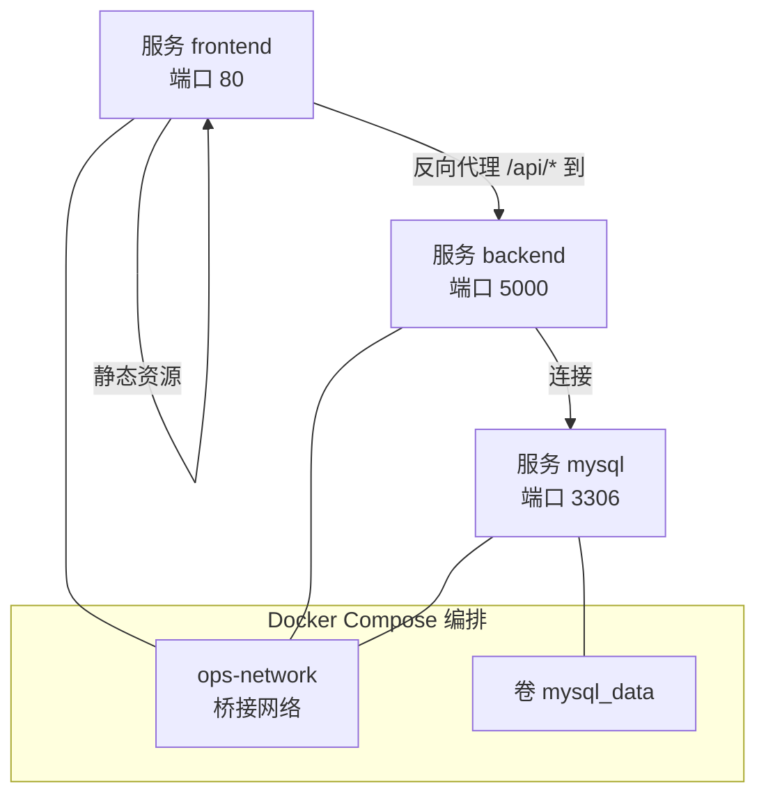
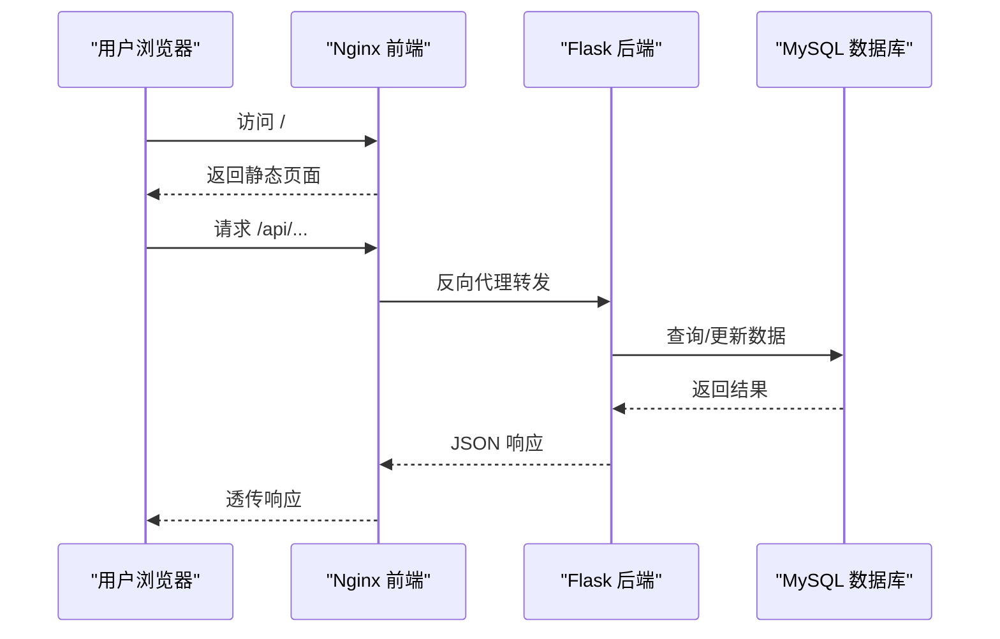
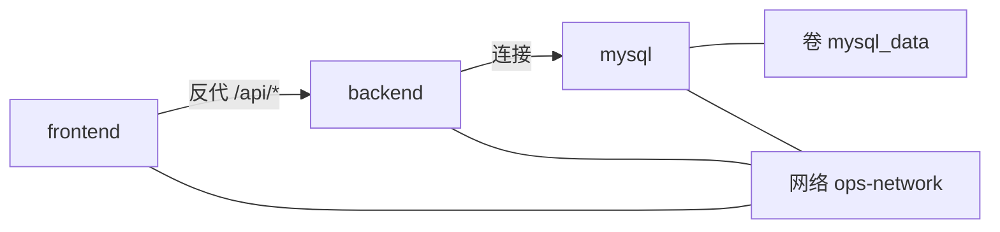

# Docker容器化部署

<cite>
**本文引用的文件**
- [docker-compose.yml](file://docker-compose.yml)
- [backend/Dockerfile](file://backend/Dockerfile)
- [nginx.conf](file://nginx.conf)
- [backend/requirements.txt](file://backend/requirements.txt)
- [backend/run.py](file://backend/run.py)
- [backend/init_db.py](file://backend/init_db.py)
- [backend/app/__init__.py](file://backend/app/__init__.py)
</cite>

## 目录
1. [简介](#简介)
2. [项目结构](#项目结构)
3. [核心组件](#核心组件)
4. [架构总览](#架构总览)
5. [详细组件分析](#详细组件分析)
6. [依赖分析](#依赖分析)
7. [性能考虑](#性能考虑)
8. [故障排查指南](#故障排查指南)
9. [结论](#结论)
10. [附录](#附录)

## 简介
本文件面向运维与开发团队，提供该系统的Docker容器化部署完整指南。内容涵盖：
- Dockerfile构建配置：基础镜像、系统与Python依赖、环境变量、工作目录、暴露端口与启动命令
- docker-compose.yml服务编排：MySQL数据库、Flask后端、Nginx前端的配置要点
- 容器间网络通信、数据卷挂载、健康检查、服务依赖关系
- 构建、启动、停止的标准命令与最佳实践
- 日志查看、调试技巧与常见问题解决方案

## 项目结构
该项目采用“后端+数据库+反向代理”的三容器架构，通过Docker Compose统一编排。核心文件与职责如下：
- docker-compose.yml：定义服务、网络、卷与健康检查
- backend/Dockerfile：后端镜像构建流程
- nginx.conf：前端Nginx反向代理与静态资源分发规则
- backend/requirements.txt：后端Python依赖清单
- backend/run.py：应用入口（Gunicorn启动）
- backend/init_db.py：数据库初始化与表结构创建
- backend/app/__init__.py：Flask应用工厂、CORS、日志与蓝图注册

图表来源
- [docker-compose.yml:9-102](file://docker-compose.yml#L9-L102)
- [nginx.conf:32-47](file://nginx.conf#L32-L47)

章节来源
- [docker-compose.yml:1-103](file://docker-compose.yml#L1-L103)
- [backend/Dockerfile:1-36](file://backend/Dockerfile#L1-L36)
- [nginx.conf:1-70](file://nginx.conf#L1-L70)

## 核心组件
- MySQL数据库服务
  - 基础镜像：mysql:8.0
  - 环境变量：root密码、数据库名、字符集与排序规则
  - 数据持久化：命名卷 mysql_data
  - 端口映射：3306
  - 健康检查：基于mysqladmin ping
- Flask后端服务
  - 构建上下文：./backend
  - 环境变量：Flask监听地址/端口、调试开关、密钥、数据库连接参数、CORS、加密与定时任务相关参数
  - 数据卷：挂载上传目录
  - 端口映射：5000
  - 健康检查：对本地5000端口进行HTTP探测
  - 依赖：MySQL健康后再启动
- Nginx前端服务
  - 基础镜像：nginx:alpine
  - 静态资源：frontend/dist
  - 配置文件：nginx.conf
  - 端口映射：80
  - 依赖：后端健康后再启动
  - 网络：同属ops-network

章节来源
- [docker-compose.yml:10-95](file://docker-compose.yml#L10-L95)
- [backend/Dockerfile:1-36](file://backend/Dockerfile#L1-L36)
- [nginx.conf:1-70](file://nginx.conf#L1-L70)

## 架构总览
容器间交互与数据流如下：
- 前端Nginx监听80端口，静态资源直接返回；/api前缀反向代理至后端5000端口
- 后端通过环境变量连接MySQL（服务名作为主机名），提供REST API
- 数据库使用命名卷持久化，确保重启后数据不丢失
- 健康检查保障服务按序启动与可用性

图表来源
- [docker-compose.yml:82-95](file://docker-compose.yml#L82-L95)
- [nginx.conf:32-47](file://nginx.conf#L32-L47)
- [backend/app/__init__.py:28-113](file://backend/app/__init__.py#L28-L113)

## 详细组件分析

### Dockerfile 构建配置
- 基础镜像：python:3.11-slim
- 工作目录：/app
- 环境变量：PYTHONDONTWRITEBYTECODE、PYTHONUNBUFFERED、FLASK_APP、FLASK_HOST、FLASK_PORT
- 系统依赖：gcc、default-libmysqlclient-dev、pkg-config（用于MySQL客户端）
- Python依赖：从requirements.txt安装
- 应用代码复制与上传目录创建
- 暴露端口：5000
- 启动命令：Gunicorn，单worker多线程，超时与日志级别配置

章节来源
- [backend/Dockerfile:1-36](file://backend/Dockerfile#L1-L36)
- [backend/requirements.txt:1-17](file://backend/requirements.txt#L1-L17)

### docker-compose.yml 服务编排
- 网络：自定义bridge网络ops-network
- 卷：mysql_data（MySQL数据持久化）
- 服务定义：
  - mysql：环境变量、卷、端口、健康检查
  - backend：构建上下文、环境变量、卷、端口、健康检查、依赖mysql健康
  - frontend：镜像、卷、端口、依赖backend健康

章节来源
- [docker-compose.yml:7-103](file://docker-compose.yml#L7-L103)

### Nginx 反向代理配置
- 监听80端口，静态资源根目录/usr/share/nginx/html
- /api/前缀反向代理到backend:5000/api/
- Grafana反向代理（解决混合内容问题）
- 缓存策略：静态资源一年缓存
- 连接超时与缓冲区配置，透传真实客户端信息头

章节来源
- [nginx.conf:1-70](file://nginx.conf#L1-L70)

### 后端应用启动与健康检查
- 启动入口：run.py导入并创建Flask应用
- 健康检查：对http://127.0.0.1:5000/进行HTTP探测
- 依赖：等待mysql服务健康后再启动

章节来源
- [backend/run.py:1-8](file://backend/run.py#L1-L8)
- [docker-compose.yml:66-80](file://docker-compose.yml#L66-L80)

### 数据库初始化与表结构
- init_db.py负责：
  - 创建数据库与utf8mb4字符集
  - 创建用户、服务器、项目、服务、字典、账号、定时任务、日志、云凭证、域名、证书等表
  - 插入默认管理员与字典数据
  - 为现有表新增project_id字段（兼容性处理）
- 建议：首次部署时确保数据库初始化脚本可被后端访问或在容器启动后手动执行

章节来源
- [backend/init_db.py:1-395](file://backend/init_db.py#L1-L395)

### Flask应用工厂与CORS
- create_app函数：
  - 加载Config类属性到app.config
  - 设置日志输出到stderr，便于容器收集
  - CORS：支持凭据与指定源列表；当CORS_ALLOW_ALL开启时允许任意源
  - 注册蓝图集合
  - 数据库连接预检与schema初始化
  - 初始化APScheduler（定时任务）

章节来源
- [backend/app/__init__.py:28-149](file://backend/app/__init__.py#L28-L149)

## 依赖分析
- 组件耦合
  - frontend依赖backend健康状态
  - backend依赖mysql健康状态
- 外部依赖
  - MySQL 8.0
  - Nginx:alpine
  - Python 3.11（后端）
- 网络与卷
  - 三容器共享ops-network
  - mysql_data卷持久化数据库数据

图表来源
- [docker-compose.yml:9-102](file://docker-compose.yml#L9-L102)
- [nginx.conf:32-47](file://nginx.conf#L32-L47)

章节来源
- [docker-compose.yml:9-102](file://docker-compose.yml#L9-L102)

## 性能考虑
- 后端并发模型：Gunicorn单worker多线程，避免APScheduler多进程重复注册
- 端口与超时：Nginx代理缓冲与超时参数合理配置，减少上游阻塞
- 日志：容器标准输出重定向到stderr，利于集中采集与分析
- 数据持久化：MySQL使用命名卷，避免数据丢失与I/O抖动

## 故障排查指南
- 健康检查失败
  - 查看服务日志：docker compose logs mysql/backend/frontend
  - 核查端口占用与防火墙策略
- 数据库连接失败
  - 确认DB_HOST为服务名（mysql）、DB_PORT为3306、DB_USER/DB_PASSWORD正确
  - 检查mysql服务是否健康
- CORS跨域问题
  - 核查CORS_ORIGINS与CORS_ALLOW_ALL配置
- 静态资源无法加载
  - 确认frontend/dist目录已构建并挂载
  - 检查Nginx配置中的root与index
- 定时任务异常
  - 关注后端日志中APScheduler初始化与执行记录

章节来源
- [docker-compose.yml:25-28](file://docker-compose.yml#L25-L28)
- [docker-compose.yml:69-80](file://docker-compose.yml#L69-L80)
- [backend/app/__init__.py:64-80](file://backend/app/__init__.py#L64-L80)
- [nginx.conf:8-14](file://nginx.conf#L8-L14)

## 结论
该部署方案以简洁稳定的三容器架构实现前后端分离与数据库持久化。通过Compose编排、健康检查与合理的Nginx反代，可满足生产级可用性与可观测性要求。建议在生产环境中替换默认密钥与口令，并结合外部监控与日志平台进行统一治理。

## 附录

### 标准命令与最佳实践
- 构建与启动
  - docker compose up -d
- 停止与清理
  - docker compose down
  - 如需移除卷：docker compose down -v
- 查看日志
  - docker compose logs -f mysql/backend/frontend
- 进入容器调试
  - docker compose exec backend bash
  - docker compose exec mysql bash
- 重建镜像
  - docker compose build --no-cache backend
- 端口与网络
  - 默认映射：MySQL 3306、后端 5000、前端 80
  - 自定义网络：ops-network

章节来源
- [docker-compose.yml:10-95](file://docker-compose.yml#L10-L95)

### 关键配置项速查
- MySQL
  - 环境变量：MYSQL_ROOT_PASSWORD、MYSQL_DATABASE、MYSQL_CHARSET、MYSQL_COLLATION
  - 健康检查：test为mysqladmin ping
- Backend
  - 环境变量：FLASK_HOST、FLASK_PORT、SECRET_KEY、JWT_SECRET_KEY、DB_*、CORS_*、DATA_ENCRYPTION_KEY、SSL_*、CERT_AUTO_CHECK_CRON、GRAFANA_URL等
  - 健康检查：HTTP探测本地5000端口
- Frontend
  - 静态目录：/usr/share/nginx/html
  - 反代：/api/ -> backend:5000/api/
  - 配置文件：/etc/nginx/conf.d/default.conf

章节来源
- [docker-compose.yml:14-59](file://docker-compose.yml#L14-L59)
- [docker-compose.yml:69-80](file://docker-compose.yml#L69-L80)
- [nginx.conf:4-63](file://nginx.conf#L4-L63)