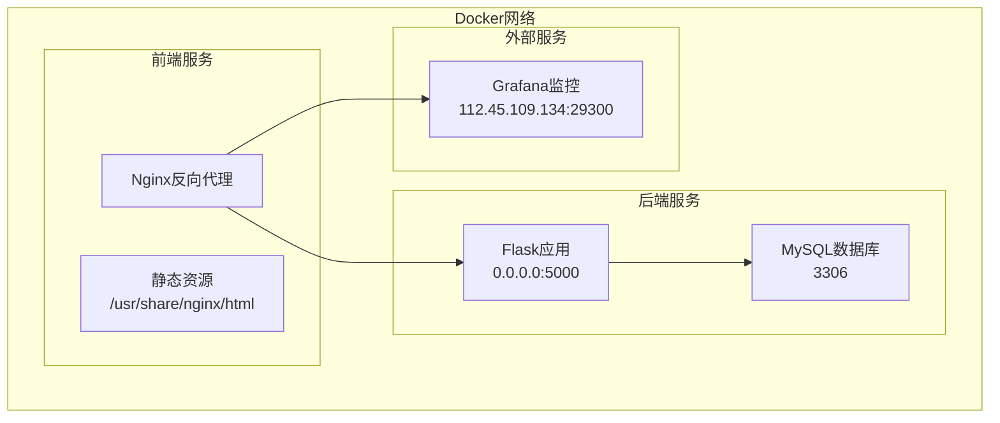
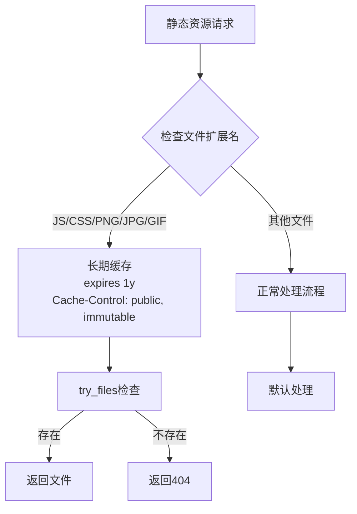
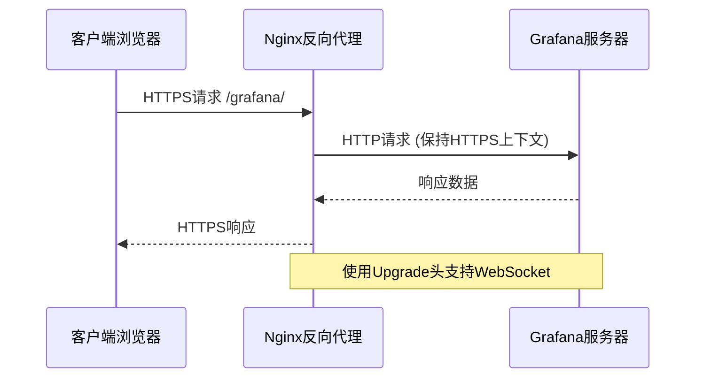
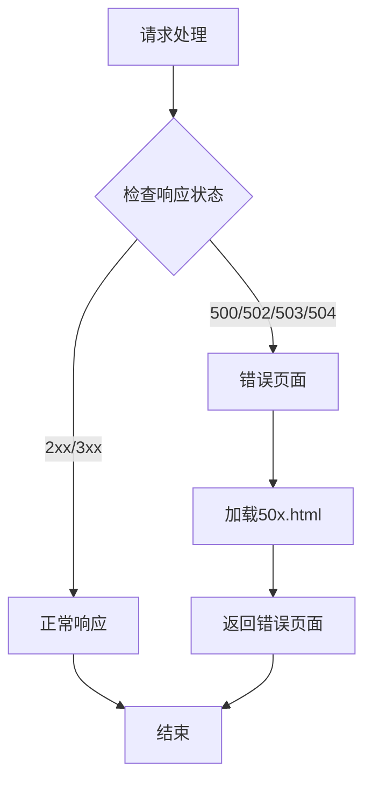
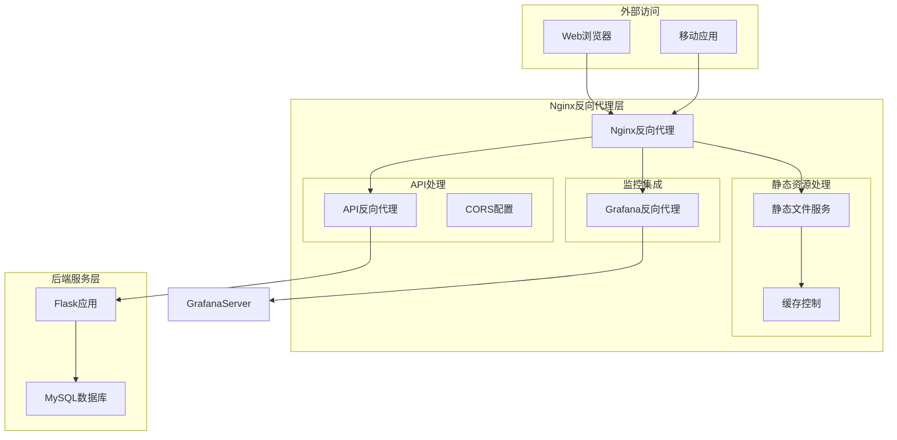
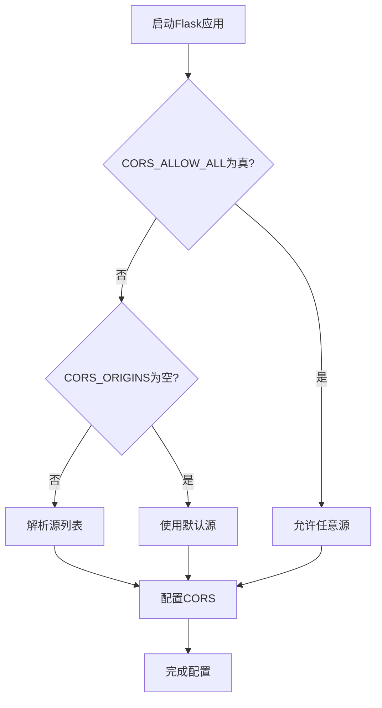
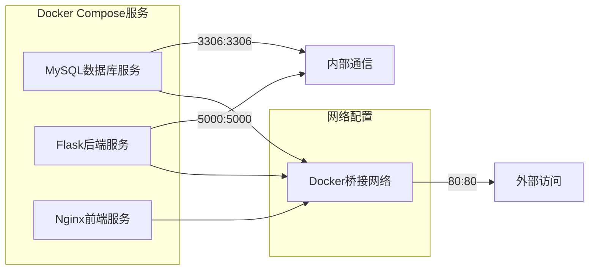
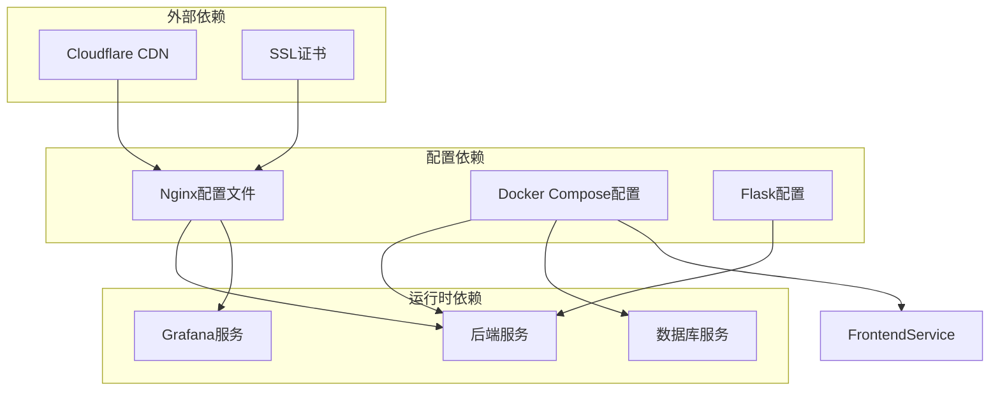

# Nginx反向代理配置

<cite>
**本文档引用的文件**
- [nginx.conf](file://nginx.conf)
- [docker-compose.yml](file://docker-compose.yml)
- [config.py](file://backend/app/config.py)
- [Dockerfile](file://backend/Dockerfile)
- [monitoring.py](file://backend/app/api/monitoring.py)
</cite>

## 目录
1. [简介](#简介)
2. [项目结构](#项目结构)
3. [核心组件](#核心组件)
4. [架构概览](#架构概览)
5. [详细组件分析](#详细组件分析)
6. [依赖关系分析](#依赖关系分析)
7. [性能考虑](#性能考虑)
8. [故障排除指南](#故障排除指南)
9. [结论](#结论)

## 简介

这是一个基于Docker Compose的Nginx反向代理配置项目，用于为运维管理平台提供静态资源服务和API反向代理功能。该配置实现了以下核心功能：

- **静态资源服务**：为前端应用提供HTML、CSS、JavaScript等静态文件的高效缓存和压缩
- **API反向代理**：将/api/路径的请求转发到后端Flask应用
- **Grafana集成**：为监控仪表板提供反向代理支持
- **CORS跨域处理**：配置后端API的跨域访问策略
- **错误页面处理**：提供统一的错误页面显示

## 项目结构

该项目采用微服务架构，包含三个主要服务：



**图表来源**
- [docker-compose.yml:82-103](file://docker-compose.yml#L82-L103)
- [nginx.conf:4-69](file://nginx.conf#L4-L69)

**章节来源**
- [docker-compose.yml:1-103](file://docker-compose.yml#L1-L103)
- [nginx.conf:1-70](file://nginx.conf#L1-L70)

## 核心组件

### Nginx反向代理配置

Nginx配置文件定义了完整的反向代理服务，包含以下关键组件：

#### 服务器配置
- **监听端口**：80端口
- **服务器名称**：localhost、opm.pepsikey.online
- **根目录**：/usr/share/nginx/html
- **默认索引**：index.html

#### MIME类型配置
- 包含标准MIME类型定义
- 默认类型：application/octet-stream
- JavaScript文件类型：application/javascript
- CSS文件类型：text/css

#### 请求大小限制
- **client_max_body_size**：16MB
- 适用于文件上传和大请求体

**章节来源**
- [nginx.conf:4-15](file://nginx.conf#L4-L15)

### 静态资源缓存策略

系统实现了智能的静态资源缓存机制：



**图表来源**
- [nginx.conf:26-30](file://nginx.conf#L26-L30)

#### 缓存策略详情
- **缓存期限**：1年（1y）
- **缓存控制**：public, immutable
- **文件检查**：使用try_files指令验证文件存在性

**章节来源**
- [nginx.conf:26-30](file://nginx.conf#L26-L30)

### API反向代理配置

#### 代理设置
- **上游服务器**：backend:5000
- **HTTP版本**：1.1
- **连接保持**：空连接头
- **超时设置**：
  - 连接超时：60秒
  - 发送超时：120秒
  - 读取超时：120秒

#### 请求头传递
系统传递关键的请求头信息以保持客户端信息的完整性：
- **X-Real-IP**：客户端真实IP地址
- **X-Forwarded-For**：代理链路信息
- **X-Forwarded-Proto**：协议信息（http/https）
- **X-Forwarded-Host**：原始主机名

**章节来源**
- [nginx.conf:32-47](file://nginx.conf#L32-L47)

### Grafana反向代理

为了解决HTTPS页面嵌入HTTP iframe的Mixed Content问题，配置了专门的Grafana反向代理：



**图表来源**
- [nginx.conf:49-59](file://nginx.conf#L49-L59)

**章节来源**
- [nginx.conf:49-59](file://nginx.conf#L49-L59)

### 错误页面处理

系统配置了统一的错误页面处理机制：



**图表来源**
- [nginx.conf:65-68](file://nginx.conf#L65-L68)

**章节来源**
- [nginx.conf:65-68](file://nginx.conf#L65-L68)

## 架构概览

整个系统的架构采用反向代理模式，所有外部请求都通过Nginx进入，然后根据URL路径分发到相应的服务：



**图表来源**
- [docker-compose.yml:9-103](file://docker-compose.yml#L9-L103)
- [nginx.conf:4-69](file://nginx.conf#L4-L69)

## 详细组件分析

### CORS跨域配置

后端Flask应用通过环境变量配置CORS策略：

#### CORS配置参数
- **CORS_ORIGINS**：允许访问的源列表
- **CORS_ALLOW_ALL**：是否允许任意源访问
- **supports_credentials**：支持携带凭据的请求
- **allow_headers**：允许的自定义头部

#### 动态CORS配置逻辑



**图表来源**
- [backend/app/__init__.py:64-79](file://backend/app/__init__.py#L64-L79)

**章节来源**
- [config.py:32-38](file://backend/app/config.py#L32-L38)
- [docker-compose.yml:48](file://docker-compose.yml#L48)

### 监控集成配置

系统集成了Grafana监控功能，通过API提供监控配置：

#### 监控配置API
- **端点**：/api/monitoring/config
- **方法**：GET
- **认证**：需要JWT令牌
- **响应**：包含Grafana URL和仪表板配置

#### Grafana配置参数
- **GRAFANA_URL**：Grafana服务器地址
- **GRAFANA_DASHBOARDS**：仪表板配置数组
- **自动检查**：支持证书和域名自动检查

**章节来源**
- [monitoring.py:11-41](file://backend/app/api/monitoring.py#L11-L41)
- [docker-compose.yml:58-59](file://docker-compose.yml#L58-L59)

### Docker容器化部署

#### 服务编排
系统使用Docker Compose进行多服务编排，包含以下服务：



**图表来源**
- [docker-compose.yml:9-103](file://docker-compose.yml#L9-L103)

**章节来源**
- [docker-compose.yml:1-103](file://docker-compose.yml#L1-L103)

## 依赖关系分析

### 组件间依赖关系



**图表来源**
- [nginx.conf:1](file://nginx.conf#L1)
- [docker-compose.yml:4](file://docker-compose.yml#L4)

### 环境变量依赖

系统通过环境变量实现配置管理：

| 环境变量 | 用途 | 默认值 |
|---------|------|--------|
| SECRET_KEY | 应用密钥 | 必需 |
| JWT_SECRET_KEY | JWT密钥 | 必需 |
| FLASK_HOST | Flask绑定地址 | 0.0.0.0 |
| FLASK_PORT | Flask端口 | 5000 |
| DB_HOST | 数据库主机 | 127.0.0.1 |
| DB_PORT | 数据库端口 | 3306 |
| CORS_ORIGINS | CORS源列表 | 空 |
| CORS_ALLOW_ALL | 允许任意源 | false |
| GRAFANA_URL | Grafana地址 | 空 |

**章节来源**
- [config.py:10-58](file://backend/app/config.py#L10-L58)
- [docker-compose.yml:36-59](file://docker-compose.yml#L36-L59)

## 性能考虑

### 缓存优化策略

#### 静态资源缓存
- **长期缓存**：1年有效期
- **immutable标志**：确保浏览器不会重新验证
- **CDN友好**：支持CDN缓存策略

#### 代理性能优化
- **缓冲区配置**：合理设置代理缓冲区大小
- **超时设置**：平衡响应时间和资源占用
- **连接复用**：保持HTTP/1.1连接

### 内存和CPU优化

#### Nginx配置优化
- **worker_processes**：根据CPU核心数配置
- **worker_connections**：最大连接数设置
- **keepalive_timeout**：连接保持时间

#### Flask应用优化
- **Gunicorn配置**：1个worker，8个线程
- **单进程多线程**：避免定时任务重复注册
- **超时设置**：120秒请求超时

**章节来源**
- [Dockerfile:34-36](file://backend/Dockerfile#L34-L36)

## 故障排除指南

### 常见问题诊断

#### 502 Bad Gateway错误
可能原因：
- 后端服务未启动或崩溃
- 网络连接问题
- 超时设置过短

解决方案：
- 检查后端服务健康状态
- 增加代理超时时间
- 验证网络连通性

#### CORS跨域问题
可能原因：
- 源列表配置错误
- 凭据设置不匹配
- 头部传递问题

解决方案：
- 验证CORS_ORIGINS配置
- 检查supports_credentials设置
- 确认预检请求处理

#### 静态资源缓存问题
可能原因：
- 缓存头配置错误
- 文件权限问题
- 路径映射错误

解决方案：
- 检查expires和Cache-Control头
- 验证文件权限
- 确认路径映射正确

### 日志和监控

#### 访问日志格式
```nginx
# 标准访问日志格式
log_format main '$remote_addr - $remote_user [$time_local] "$request" '
              '$status $body_bytes_sent "$http_referer" '
              '"$http_user_agent" "$http_x_forwarded_for"';
```

#### 错误日志级别
- **info**：一般信息
- **warn**：警告信息
- **error**：错误信息
- **debug**：调试信息

**章节来源**
- [Dockerfile:34-36](file://backend/Dockerfile#L34-L36)

## 结论

这个Nginx反向代理配置项目提供了完整的微服务架构基础设施，具有以下特点：

### 主要优势
- **模块化设计**：清晰的服务分离和职责划分
- **高性能配置**：合理的缓存策略和代理设置
- **安全配置**：完善的CORS和请求头传递机制
- **可维护性**：通过环境变量实现配置管理

### 最佳实践建议
1. **生产环境配置**：确保所有敏感配置通过环境变量设置
2. **监控完善**：添加详细的访问日志和错误日志
3. **安全加固**：考虑添加SSL证书和HTTPS重定向
4. **性能调优**：根据实际流量调整缓存和超时参数

### 扩展方向
- 添加负载均衡配置
- 实现HTTPS和SSL证书管理
- 集成更详细的监控指标
- 添加API限流和防护机制

这个配置为运维管理平台提供了稳定、高效的反向代理服务，支持现代Web应用的各种需求。