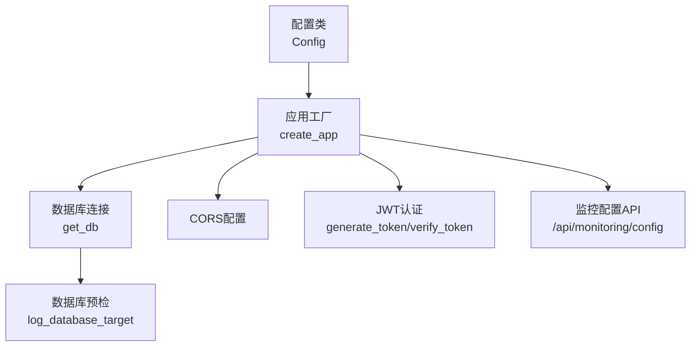
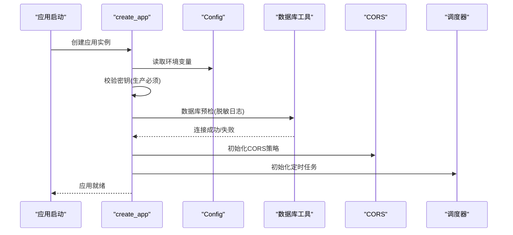
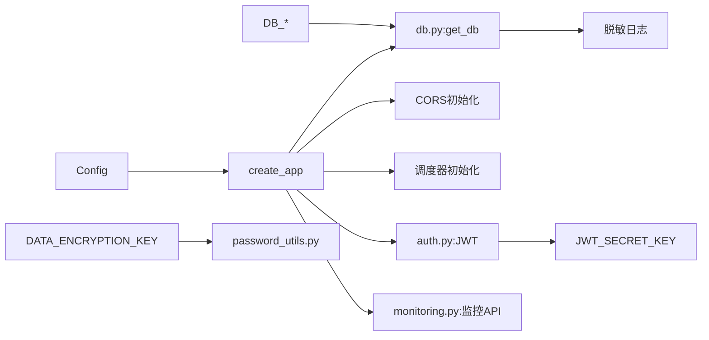

# 环境变量配置

<cite>
**本文档引用的文件**
- [backend/app/config.py](file://backend/app/config.py)
- [backend/app/__init__.py](file://backend/app/__init__.py)
- [backend/docker-compose.yml](file://backend/docker-compose.yml)
- [backend/app/utils/db.py](file://backend/app/utils/db.py)
- [backend/app/utils/password_utils.py](file://backend/app/utils/password_utils.py)
- [backend/app/utils/auth.py](file://backend/app/utils/auth.py)
- [backend/app/api/monitoring.py](file://backend/app/api/monitoring.py)
- [backend/run.py](file://backend/run.py)
</cite>

## 目录
1. [简介](#简介)
2. [项目结构](#项目结构)
3. [核心组件](#核心组件)
4. [架构总览](#架构总览)
5. [详细组件分析](#详细组件分析)
6. [依赖关系分析](#依赖关系分析)
7. [性能考量](#性能考量)
8. [故障排查指南](#故障排查指南)
9. [结论](#结论)
10. [附录](#附录)

## 简介
本文件系统性梳理了运维管理平台的环境变量配置，覆盖数据库连接、认证与JWT、数据加密、CORS跨域、监控集成等关键配置项，并提供生产与开发环境的差异化配置示例、敏感信息安全处理建议以及配置验证方法，帮助读者快速、安全地部署与维护系统。

## 项目结构
- 配置集中于配置类，由应用工厂函数加载，供各模块按需读取。
- 数据库连接参数通过配置类注入，启动时进行预检并脱敏输出。
- 加密密钥支持标准Fernet密钥或从任意字符串派生，开发模式可使用内置密钥（不适用于生产）。
- CORS策略支持白名单+credentials或全局放行（不带credentials）。
- 监控配置通过API对外暴露，便于前端动态展示。

图表来源
- [backend/app/config.py:10-57](file://backend/app/config.py#L10-L57)
- [backend/app/__init__.py:28-113](file://backend/app/__init__.py#L28-L113)
- [backend/app/utils/db.py:43-69](file://backend/app/utils/db.py#L43-L69)
- [backend/app/utils/auth.py:9-44](file://backend/app/utils/auth.py#L9-L44)
- [backend/app/api/monitoring.py:11-41](file://backend/app/api/monitoring.py#L11-L41)

章节来源
- [backend/app/config.py:10-57](file://backend/app/config.py#L10-L57)
- [backend/app/__init__.py:28-113](file://backend/app/__init__.py#L28-L113)

## 核心组件
- 配置类：集中定义所有环境变量键名与默认值，提供CORS解析辅助方法。
- 应用工厂：加载配置、校验关键密钥、初始化CORS、数据库预检、注册蓝图与定时任务。
- 数据库工具：封装连接参数、日志脱敏输出、连接获取与关闭。
- 加密工具：支持标准Fernet密钥或PBKDF2派生密钥，开发/生产差异化处理。
- 认证工具：基于JWT的签发与校验，依赖JWT密钥与过期时长。
- 监控API：对外提供Grafana配置信息。

章节来源
- [backend/app/config.py:10-57](file://backend/app/config.py#L10-L57)
- [backend/app/__init__.py:28-113](file://backend/app/__init__.py#L28-L113)
- [backend/app/utils/db.py:18-69](file://backend/app/utils/db.py#L18-L69)
- [backend/app/utils/password_utils.py:18-49](file://backend/app/utils/password_utils.py#L18-L49)
- [backend/app/utils/auth.py:9-44](file://backend/app/utils/auth.py#L9-L44)
- [backend/app/api/monitoring.py:11-41](file://backend/app/api/monitoring.py#L11-L41)

## 架构总览
环境变量贯穿应用启动与运行期，形成“配置驱动”的架构模式：
- 启动阶段：应用工厂读取配置，校验密钥，预检数据库，初始化CORS与定时任务。
- 运行阶段：各模块按需读取配置，如认证模块读取JWT密钥与过期时长，加密模块读取DATA_ENCRYPTION_KEY，监控模块读取GRAFANA_URL与仪表板配置。

图表来源
- [backend/app/__init__.py:28-113](file://backend/app/__init__.py#L28-L113)
- [backend/app/utils/db.py:28-69](file://backend/app/utils/db.py#L28-L69)

## 详细组件分析

### 数据库连接参数
- DB_HOST：数据库主机，默认本地回环；生产环境务必指向实际MySQL服务。
- DB_PORT：数据库端口，默认3306。
- DB_USER：数据库用户，默认root。
- DB_PASSWORD：数据库密码，生产环境必须设置。
- DB_NAME：数据库名，默认ops_platform。
- 预检机制：启动时打印脱敏后的连接参数，失败时输出完整异常栈，便于定位DB_HOST、DB_PORT、DB_USER、DB_PASSWORD、DB_NAME及网络连通性问题。

章节来源
- [backend/app/config.py:16-20](file://backend/app/config.py#L16-L20)
- [backend/app/utils/db.py:18-40](file://backend/app/utils/db.py#L18-L40)
- [backend/app/utils/db.py:43-69](file://backend/app/utils/db.py#L43-L69)
- [backend/app/__init__.py:88-104](file://backend/app/__init__.py#L88-L104)

### 认证相关配置
- SECRET_KEY：应用密钥，生产环境必须设置；开发模式可使用内置值但不应用于生产。
- JWT_SECRET_KEY：JWT签名密钥，生产环境必须设置；开发模式可复用SECRET_KEY。
- JWT_EXPIRATION_HOURS：JWT过期时长（小时），默认2小时。

章节来源
- [backend/app/config.py:12-14](file://backend/app/config.py#L12-L14)
- [backend/app/__init__.py:36-45](file://backend/app/__init__.py#L36-L45)
- [backend/app/utils/auth.py:13-28](file://backend/app/utils/auth.py#L13-L28)

### 数据加密配置
- DATA_ENCRYPTION_KEY：Fernet对称密钥（URL安全Base64 32字节），生产环境必须设置。
- OPS_DEV_ENCRYPTION_FALLBACK：开发模式开关，开启后可使用内置密钥（不安全，严禁生产）。
- 加密实现：支持标准Fernet密钥或通过PBKDF2从任意字符串派生；提供加密/解密接口，用于存储服务器密码等敏感信息。

章节来源
- [backend/app/utils/password_utils.py:18-49](file://backend/app/utils/password_utils.py#L18-L49)
- [backend/docker-compose.yml:50-51](file://backend/docker-compose.yml#L50-L51)

### CORS配置
- CORS_ORIGINS：逗号分隔的允许源列表；与credentials同时使用时不可为*。
- CORS_ALLOW_ALL：设为true时允许任意源（不启用credentials）。
- 默认策略：显式源列表+credentials；若未配置或为空，回退到本地开发常用源。

章节来源
- [backend/app/config.py:33-38](file://backend/app/config.py#L33-L38)
- [backend/app/__init__.py:64-80](file://backend/app/__init__.py#L64-L80)

### 监控配置
- GRAFANA_URL：Grafana访问地址，未配置时API返回提示。
- GRAFANA_DASHBOARDS：仪表板配置JSON数组，默认包含主机监控与容器监控。
- 监控API：/api/monitoring/config返回当前配置，便于前端展示。

章节来源
- [backend/app/config.py:52-53](file://backend/app/config.py#L52-L53)
- [backend/app/api/monitoring.py:17-41](file://backend/app/api/monitoring.py#L17-L41)

### 其他通用配置
- FLASK_DEBUG：调试模式，影响密钥校验与加密降级策略。
- FLASK_HOST/FLASK_PORT：服务监听地址与端口。
- WECHAT_WEBHOOK_URL：企业微信Webhook通知地址（用于证书与域名到期预警）。
- SSL_CHECK_TIMEOUT/SSL_WARNING_DAYS：SSL检测超时与预警阈值。
- DOMAIN_WARNING_DAYS/CERT_AUTO_CHECK_CRON/DOMAIN_AUTO_NOTIFY_CRON：域名与证书自动检测与通知策略。
- 上传与内容长度：上传目录与最大请求体大小限制。

章节来源
- [backend/app/config.py:22-24](file://backend/app/config.py#L22-L24)
- [backend/app/config.py:40-48](file://backend/app/config.py#L40-L48)
- [backend/app/config.py:26-27](file://backend/app/config.py#L26-L27)
- [backend/app/__init__.py:36-48](file://backend/app/__init__.py#L36-L48)

## 依赖关系分析
- 配置类被应用工厂读取，后者负责密钥校验、CORS初始化、数据库预检与定时任务初始化。
- 数据库工具依赖配置类提供的连接参数，启动时进行预检并记录脱敏日志。
- 加密工具依赖DATA_ENCRYPTION_KEY或开发降级策略，为敏感信息提供对称加解密能力。
- 认证工具依赖JWT_SECRET_KEY与JWT_EXPIRATION_HOURS，为API提供鉴权保障。
- 监控API依赖GRAFANA_URL与GRAFANA_DASHBOARDS，向客户端暴露监控配置。

图表来源
- [backend/app/config.py:10-57](file://backend/app/config.py#L10-L57)
- [backend/app/__init__.py:28-113](file://backend/app/__init__.py#L28-L113)
- [backend/app/utils/db.py:18-69](file://backend/app/utils/db.py#L18-L69)
- [backend/app/utils/auth.py:9-44](file://backend/app/utils/auth.py#L9-L44)
- [backend/app/api/monitoring.py:11-41](file://backend/app/api/monitoring.py#L11-L41)
- [backend/app/utils/password_utils.py:18-49](file://backend/app/utils/password_utils.py#L18-L49)

## 性能考量
- 数据库连接超时：连接建立设置超时，避免长时间阻塞。
- CORS策略：明确白名单+credentials可减少跨域复杂度，提升安全性与性能。
- 定时任务：调度器独立连接，失败仅记录日志，不影响应用启动。
- 日志输出：统一输出到stderr，便于容器化日志收集。

章节来源
- [backend/app/utils/db.py:57-58](file://backend/app/utils/db.py#L57-L58)
- [backend/app/__init__.py:108-111](file://backend/app/__init__.py#L108-L111)

## 故障排查指南
- 数据库连接失败
  - 现象：启动时报错并输出完整异常栈。
  - 排查要点：核对DB_HOST、DB_PORT、DB_USER、DB_PASSWORD、DB_NAME；确认MySQL已启动、网络互通（Docker内DB_HOST通常为服务名）。
  - 参考路径：[backend/app/__init__.py:88-104](file://backend/app/__init__.py#L88-L104)、[backend/app/utils/db.py:28-69](file://backend/app/utils/db.py#L28-L69)

- JWT密钥缺失
  - 现象：生产环境未设置JWT_SECRET_KEY时抛出运行时错误。
  - 处理：生产环境必须设置JWT_SECRET_KEY；开发环境可复用SECRET_KEY。
  - 参考路径：[backend/app/__init__.py:36-45](file://backend/app/__init__.py#L36-L45)、[backend/app/utils/auth.py:24-28](file://backend/app/utils/auth.py#L24-L28)

- 加密密钥缺失或无效
  - 现象：未设置DATA_ENCRYPTION_KEY且未开启开发降级时抛出错误。
  - 处理：生产环境配置标准Fernet密钥；本地开发可开启FLASK_DEBUG或OPS_DEV_ENCRYPTION_FALLBACK（不安全）。
  - 参考路径：[backend/app/utils/password_utils.py:18-29](file://backend/app/utils/password_utils.py#L18-L29)

- CORS跨域问题
  - 现象：浏览器跨域报错或凭证丢失。
  - 处理：确保CORS_ORIGINS为明确白名单且与supports_credentials配合使用；CORS_ALLOW_ALL=true时将放行任意源（不启用credentials）。
  - 参考路径：[backend/app/config.py:33-38](file://backend/app/config.py#L33-L38)、[backend/app/__init__.py:64-80](file://backend/app/__init__.py#L64-L80)

- 监控配置未生效
  - 现象：前端无法显示监控仪表板。
  - 处理：确认GRAFANA_URL与GRAFANA_DASHBOARDS配置正确；通过/api/monitoring/config验证返回。
  - 参考路径：[backend/app/api/monitoring.py:17-41](file://backend/app/api/monitoring.py#L17-L41)

## 结论
本项目采用“配置驱动”的设计，将数据库、认证、加密、CORS与监控等关键配置集中于环境变量，结合应用启动时的严格校验与预检，确保生产环境的安全与稳定。建议在生产环境中严格遵循密钥与敏感信息的安全策略，并通过健康检查与日志输出持续验证配置有效性。

## 附录

### 生产环境配置示例
- 必填项
  - SECRET_KEY：应用密钥（生产）
  - JWT_SECRET_KEY：JWT签名密钥（生产）
  - DATA_ENCRYPTION_KEY：Fernet对称密钥（生产）
  - DB_HOST/DB_PORT/DB_USER/DB_PASSWORD/DB_NAME：数据库连接参数
  - CORS_ORIGINS：明确的前端域名白名单
  - GRAFANA_URL/GRAFANA_DASHBOARDS：监控平台配置
- 可选项
  - WECHAT_WEBHOOK_URL：企业微信通知地址
  - SSL_CHECK_TIMEOUT/SSL_WARNING_DAYS/DOMAIN_WARNING_DAYS：SSL与域名预警策略
  - CERT_AUTO_CHECK_CRON/DOMAIN_AUTO_NOTIFY_CRON：定时任务表达式

章节来源
- [backend/docker-compose.yml:36-59](file://backend/docker-compose.yml#L36-L59)

### 开发环境配置示例
- 必填项
  - FLASK_DEBUG=true：启用开发模式
  - SECRET_KEY：应用密钥（开发可用默认值，但不推荐）
  - JWT_SECRET_KEY：JWT签名密钥（开发可用默认值，但不推荐）
  - DATA_ENCRYPTION_KEY：可使用内置开发密钥（不安全，仅限开发）
- 可选项
  - CORS_ALLOW_ALL=false：保持白名单+credentials策略
  - CORS_ORIGINS：本地开发常用源
  - 其他监控与SSL配置按需设置

章节来源
- [backend/docker-compose.yml:36-59](file://backend/docker-compose.yml#L36-L59)
- [backend/app/utils/password_utils.py:18-29](file://backend/app/utils/password_utils.py#L18-L29)

### 敏感信息安全处理建议
- 生产环境
  - 使用强随机密钥（SECRET_KEY、JWT_SECRET_KEY、DATA_ENCRYPTION_KEY）。
  - 通过安全渠道（如密钥管理服务）注入环境变量，避免硬编码。
  - 定期轮换密钥，更新后滚动重启服务。
- 开发环境
  - 仅在本地开发使用内置密钥或降级开关，严禁用于生产。
  - 通过本地环境隔离与最小权限原则控制访问。

章节来源
- [backend/app/utils/password_utils.py:13-15](file://backend/app/utils/password_utils.py#L13-L15)
- [backend/docker-compose.yml:2-5](file://backend/docker-compose.yml#L2-L5)

### 配置验证方法
- 启动日志
  - 数据库预检：启动时输出脱敏连接参数，失败时输出异常栈。
  - CORS策略：根据CORS_ALLOW_ALL与CORS_ORIGINS输出对应配置。
- 健康检查
  - 后端服务健康检查：通过HTTP探测端点验证服务可用性。
- API验证
  - /api/monitoring/config：验证GRAFANA_URL与仪表板配置是否正确返回。

章节来源
- [backend/app/utils/db.py:28-40](file://backend/app/utils/db.py#L28-L40)
- [backend/app/__init__.py:64-80](file://backend/app/__init__.py#L64-L80)
- [backend/docker-compose.yml:69-80](file://backend/docker-compose.yml#L69-L80)
- [backend/app/api/monitoring.py:17-41](file://backend/app/api/monitoring.py#L17-L41)