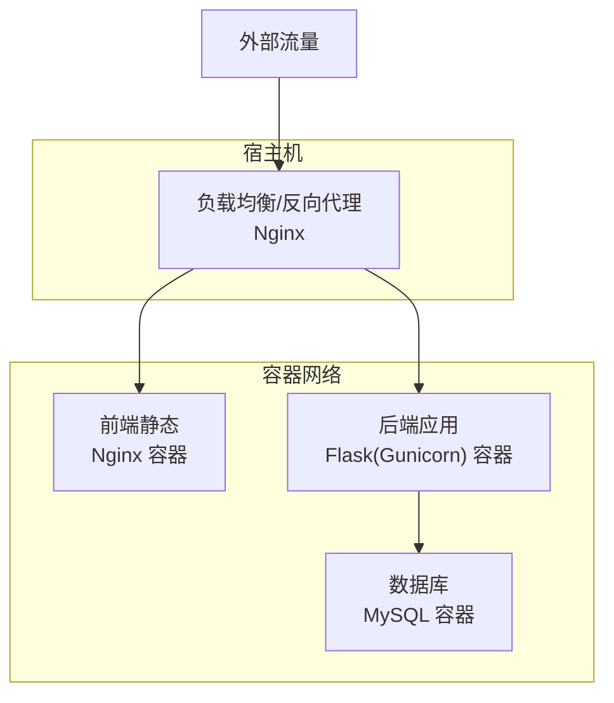
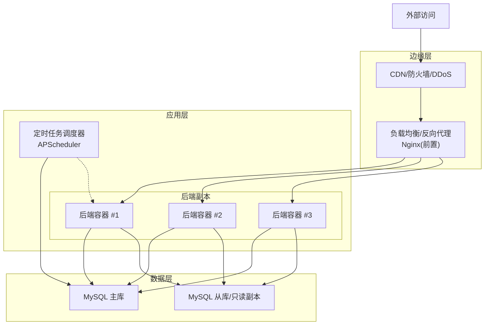
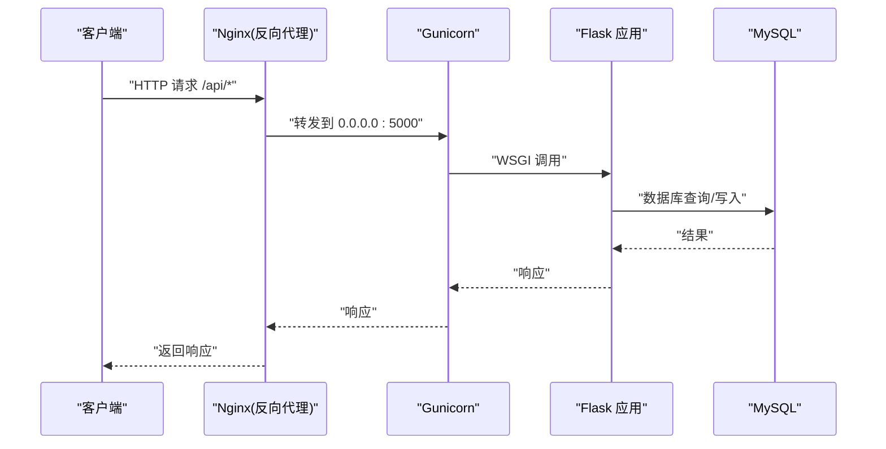
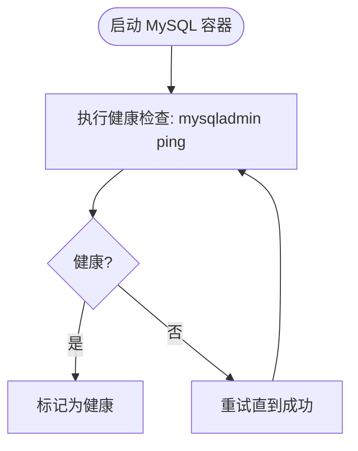
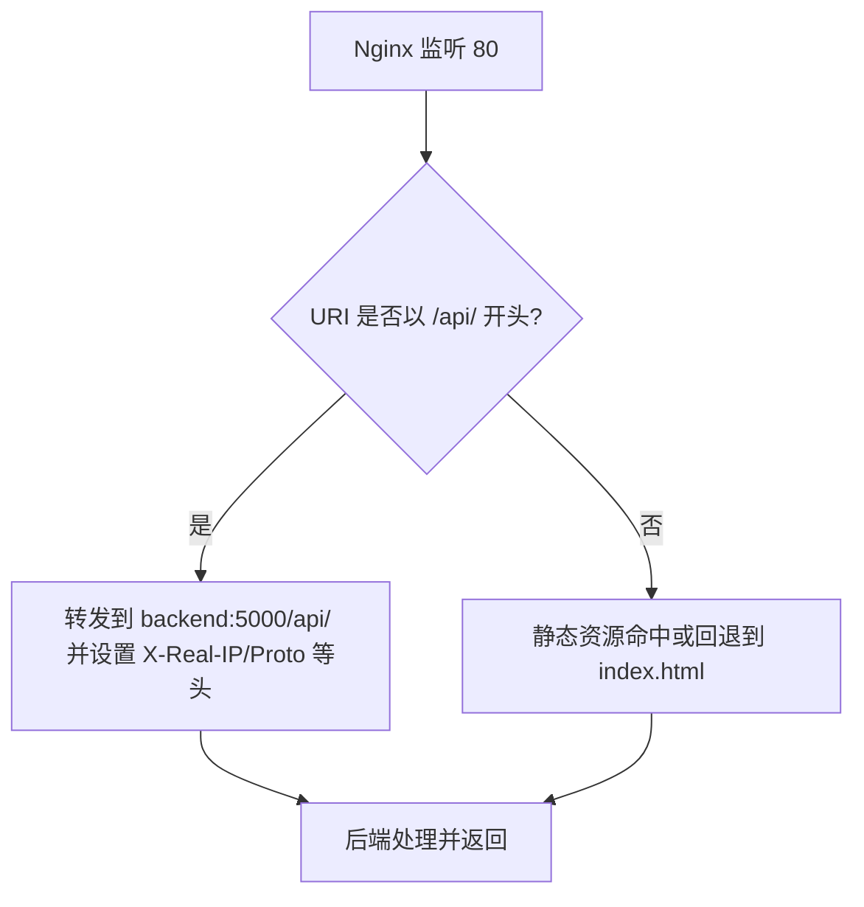
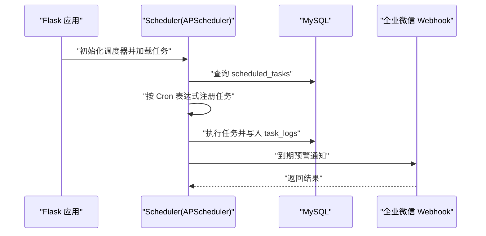
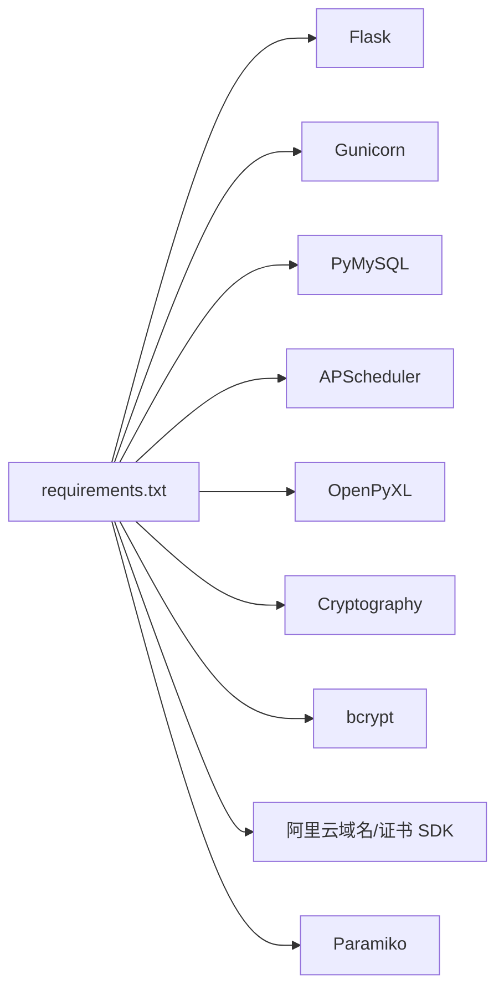

# 生产环境部署

<cite>
**本文引用的文件**
- [Dockerfile](file://backend/Dockerfile)
- [docker-compose.yml](file://docker-compose.yml)
- [nginx.conf](file://nginx.conf)
- [run.py](file://backend/run.py)
- [requirements.txt](file://backend/requirements.txt)
- [config.py](file://backend/app/config.py)
- [extensions.py](file://backend/app/extensions.py)
- [init_db.py](file://backend/init_db.py)
- [monitoring.py](file://backend/app/api/monitoring.py)
- [scheduler.py](file://backend/app/utils/scheduler.py)
- [ssl_checker.py](file://backend/app/utils/ssl_checker.py)
</cite>

## 目录
1. [简介](#简介)
2. [项目结构](#项目结构)
3. [核心组件](#核心组件)
4. [架构总览](#架构总览)
5. [详细组件分析](#详细组件分析)
6. [依赖关系分析](#依赖关系分析)
7. [性能考虑](#性能考虑)
8. [故障排除指南](#故障排除指南)
9. [结论](#结论)
10. [附录](#附录)

## 简介
本指南面向生产环境部署，基于仓库中的容器化配置与后端服务，提供从服务器环境准备、防火墙与网络配置、SSL 证书部署、负载均衡与反向代理、容器编排与高可用策略、监控与日志、备份与安全加固、性能调优到自动化部署的完整方案。文档同时给出可直接参考的配置片段路径与图示，帮助运维人员快速落地。

## 项目结构
该仓库采用“后端容器 + MySQL + Nginx 前置代理”的三服务架构，通过 Docker Compose 编排，后端使用 Gunicorn 运行 Flask 应用，Nginx 负责静态资源与 /api 反向代理，MySQL 提供持久化存储。前端静态资源由 Nginx 提供，后端提供 /api 接口。

图表来源
- [docker-compose.yml:10-103](file://docker-compose.yml#L10-L103)
- [nginx.conf:4-69](file://nginx.conf#L4-L69)

章节来源
- [docker-compose.yml:1-103](file://docker-compose.yml#L1-L103)
- [nginx.conf:1-70](file://nginx.conf#L1-L70)

## 核心组件
- 后端应用（Flask + Gunicorn）
  - 使用 Gunicorn 以“单 worker 多线程”模式运行，避免 APScheduler 多进程重复注册定时任务。
  - 端口绑定在 0.0.0.0:5000，日志输出至标准输出以便容器日志采集。
- 数据库（MySQL）
  - 使用官方 MySQL 8.0 镜像，持久化数据卷，健康检查 ping。
- 前端静态与反向代理（Nginx）
  - 提供静态资源缓存与长期缓存头，/api 前缀反代至后端 5000 端口。
  - 支持 Grafana 反代，解决混合内容问题。
- 配置与密钥注入
  - 通过环境变量注入密钥、数据库凭据、CORS、定时任务计划等。
- 初始化脚本
  - 提供数据库初始化与默认数据插入，便于首次部署。

章节来源
- [Dockerfile:34-36](file://backend/Dockerfile#L34-L36)
- [docker-compose.yml:30-81](file://docker-compose.yml#L30-L81)
- [docker-compose.yml:82-96](file://docker-compose.yml#L82-L96)
- [nginx.conf:32-47](file://nginx.conf#L32-L47)
- [config.py:10-58](file://backend/app/config.py#L10-L58)
- [init_db.py:22-391](file://backend/init_db.py#L22-L391)

## 架构总览
生产部署推荐采用“Nginx 反向代理 + 多后端副本 + MySQL 主从/高可用 + 对象存储/共享存储”的架构，结合容器编排实现弹性扩缩容与滚动更新。

图表来源
- [docker-compose.yml:30-81](file://docker-compose.yml#L30-L81)
- [scheduler.py:244-384](file://backend/app/utils/scheduler.py#L244-L384)

## 详细组件分析

### 后端应用（Flask + Gunicorn）
- 运行模式
  - 单 worker 多线程，避免 APScheduler 在多进程场景重复注册任务。
  - 绑定 0.0.0.0:5000，便于容器间与外部访问。
- 日志
  - 访问日志与错误日志输出到标准输出，便于集中采集。
- 配置注入
  - 通过环境变量注入密钥、数据库、CORS、监控、定时任务计划等。
- 启动入口
  - 通过 run.py 创建应用实例，供 Gunicorn 调用。

图表来源
- [Dockerfile:34-36](file://backend/Dockerfile#L34-L36)
- [nginx.conf:41-47](file://nginx.conf#L41-L47)
- [run.py:1-8](file://backend/run.py#L1-L8)

章节来源
- [Dockerfile:1-36](file://backend/Dockerfile#L1-L36)
- [run.py:1-8](file://backend/run.py#L1-L8)
- [config.py:10-58](file://backend/app/config.py#L10-L58)

### 数据库（MySQL）
- 镜像与持久化
  - 使用官方 MySQL 8.0，挂载卷 mysql_data 实现持久化。
- 健康检查
  - 通过 mysqladmin ping 检测容器内 MySQL 可用性。
- 初始化
  - 提供初始化脚本，创建数据库、表结构与默认数据。

图表来源
- [docker-compose.yml:25-28](file://docker-compose.yml#L25-L28)

章节来源
- [docker-compose.yml:10-29](file://docker-compose.yml#L10-L29)
- [init_db.py:22-391](file://backend/init_db.py#L22-L391)

### 前端静态与反向代理（Nginx）
- 静态资源
  - 长缓存与 MIME 类型设置，提升性能与兼容性。
- /api 反代
  - 将 /api 前缀请求转发至后端 5000 端口，保留真实 IP、协议等头部。
- Grafana 反代
  - 支持升级头，适配 Grafana WebSocket 场景。
- 错误页
  - 预置 502/503/504 错误页。

图表来源
- [nginx.conf:32-47](file://nginx.conf#L32-L47)
- [nginx.conf:61-63](file://nginx.conf#L61-L63)

章节来源
- [nginx.conf:1-70](file://nginx.conf#L1-L70)

### 定时任务与监控集成
- 定时任务调度器
  - 基于 APScheduler，从数据库加载活跃任务，支持 Cron 触发与自定义命令。
  - 内置 SSL 证书自动检测与域名到期通知任务，支持企业微信 Webhook。
- 监控配置接口
  - 提供 Grafana 监控配置查询接口，支持动态配置仪表板。

图表来源
- [scheduler.py:244-384](file://backend/app/utils/scheduler.py#L244-L384)
- [monitoring.py:11-42](file://backend/app/api/monitoring.py#L11-L42)

章节来源
- [scheduler.py:1-580](file://backend/app/utils/scheduler.py#L1-L580)
- [monitoring.py:1-42](file://backend/app/api/monitoring.py#L1-L42)

### 配置与密钥管理
- 关键配置项
  - 密钥类：SECRET_KEY、JWT_SECRET_KEY、DATA_ENCRYPTION_KEY
  - 数据库：DB_HOST、DB_PORT、DB_USER、DB_PASSWORD、DB_NAME
  - CORS：CORS_ORIGINS、CORS_ALLOW_ALL
  - 定时任务：CERT_AUTO_CHECK_CRON、DOMAIN_AUTO_NOTIFY_CRON
  - 监控：GRAFANA_URL、GRAFANA_DASHBOARDS
  - 通知：WECHAT_WEBHOOK_URL、SSL_CHECK_TIMEOUT、SSL_WARNING_DAYS、DOMAIN_WARNING_DAYS
- 注入方式
  - 通过 docker-compose 环境变量注入，生产环境务必替换默认值。

章节来源
- [config.py:10-58](file://backend/app/config.py#L10-L58)
- [docker-compose.yml:36-60](file://docker-compose.yml#L36-L60)

## 依赖关系分析
- 后端依赖
  - Flask、Gunicorn、PyMySQL、APScheduler、OpenPyXL、Cryptography、bcrypt、阿里云域名/证书/SDK、Paramiko 等。
- 运行时耦合
  - 后端依赖 MySQL；Nginx 依赖后端健康状态；定时任务依赖数据库与可选的企业微信 Webhook。
- 外部集成
  - 阿里云证书同步需安装对应 SDK；如未安装，相关功能将降级为不可用。

图表来源
- [requirements.txt:1-17](file://backend/requirements.txt#L1-L17)

章节来源
- [requirements.txt:1-17](file://backend/requirements.txt#L1-L17)

## 性能考虑
- 反向代理优化
  - 合理设置代理超时（connect/send/read）、缓冲区大小，避免大文件传输阻塞。
  - 静态资源开启长缓存与 immutable 头，减少带宽与服务器压力。
- 应用层优化
  - Gunicorn 使用单 worker 多线程，避免 APScheduler 多进程重复注册；如需多进程，请调整调度器初始化策略。
  - 控制并发线程数量与超时，避免长时间阻塞。
- 数据库优化
  - 使用只读副本分流查询；合理索引与查询计划；限制单次批量操作。
- 缓存与压缩
  - 启用 gzip/br 压缩（可在 Nginx 层配置）；静态资源强缓存。
- 监控与告警
  - 结合 Grafana 仪表板与日志聚合，建立 CPU、内存、QPS、错误率、数据库延迟等指标告警。

章节来源
- [nginx.conf:35-41](file://nginx.conf#L35-L41)
- [Dockerfile:34-36](file://backend/Dockerfile#L34-L36)
- [scheduler.py:244-384](file://backend/app/utils/scheduler.py#L244-L384)

## 故障排除指南
- 健康检查失败
  - 后端健康检查通过访问本地 5000 端口，若失败检查容器日志与依赖服务（MySQL）状态。
- 数据库连接失败
  - 核对 DB_HOST/PORT/USER/PASSWORD/NAME；确认网络连通与 MySQL 健康。
- Nginx 反代异常
  - 检查 /api 反代配置、超时设置、X-Forwarded-* 头是否正确透传。
- 定时任务未执行
  - 确认数据库可访问、任务处于激活状态、Cron 表达式正确；查看任务日志表。
- SSL 证书检测失败
  - 检查域名可达性、TLS 版本降级策略、超时设置；必要时调整 SSL_CHECK_TIMEOUT。
- 企业微信通知失败
  - 检查 WECHAT_WEBHOOK_URL、网络连通性与 Webhook 返回码。

章节来源
- [docker-compose.yml:69-80](file://docker-compose.yml#L69-L80)
- [docker-compose.yml:25-28](file://docker-compose.yml#L25-L28)
- [nginx.conf:41-47](file://nginx.conf#L41-L47)
- [scheduler.py:391-580](file://backend/app/utils/scheduler.py#L391-L580)
- [ssl_checker.py:304-396](file://backend/app/utils/ssl_checker.py#L304-L396)

## 结论
本指南提供了基于现有仓库的生产部署蓝图：以 Nginx 为边界与反向代理，后端以 Gunicorn 运行 Flask，MySQL 提供持久化，配合定时任务与监控接口，形成可扩展、可观测、可维护的生产架构。建议在生产中进一步完善高可用、灾备、安全加固与自动化运维流程。

## 附录

### 服务器环境准备与防火墙配置
- 操作系统
  - 推荐使用稳定版 Linux（如 Ubuntu/CentOS），确保内核支持 Docker。
- 防火墙
  - 仅开放对外端口：80（HTTP）、443（HTTPS，如需）；其余端口仅对内网开放。
  - 为 MySQL 暴露 3306，限制来源为后端容器所在网络。
- 时间同步
  - 使用 NTP 保持各节点时间一致，避免证书与日志时间偏差。
- 文件系统
  - 为 MySQL 数据卷与后端上传目录预留足够空间与 IO 性能。

### SSL 证书部署
- 源站证书
  - 若使用 CDN/反代（如 Cloudflare），可选择“灵活”模式仅暴露 80 端口；如需 443，请在源站部署证书。
- 证书检测
  - 利用内置 SSL 检测与通知机制，定期检测域名剩余天数并预警。
- 阿里云证书
  - 可通过 SDK 扫描与下载证书，实现证书集中管理与自动续期。

章节来源
- [docker-compose.yml:4-6](file://docker-compose.yml#L4-L6)
- [ssl_checker.py:169-302](file://backend/app/utils/ssl_checker.py#L169-L302)

### 负载均衡与高可用
- 负载均衡
  - 使用 Nginx/LVS/Haproxy/云厂商 LB，启用健康检查与会话保持（如需）。
- 后端副本
  - 部署多个后端副本，结合滚动更新与蓝绿发布，降低停机风险。
- 数据库高可用
  - 使用主从复制或云厂商高可用方案，配置只读副本分流查询。
- 存储
  - 使用持久卷或共享存储，确保数据一致性与可用性。

### 容器编排与扩缩容
- 编排工具
  - 使用 Docker Compose/Kubernetes 管理服务生命周期与健康检查。
- 扩缩容
  - 后端副本数根据 QPS 与资源使用率动态调整；数据库副本与只读副本按查询压力扩容。
- 滚动更新
  - 逐步替换旧副本，确保新旧版本兼容与数据迁移（如需）。
- 故障恢复
  - 健康检查失败自动重启；数据库故障切换与数据恢复演练常态化。

### 监控与日志
- 指标监控
  - 结合 Grafana 仪表板，采集 CPU、内存、磁盘、网络、数据库连接数、QPS、错误率等。
- 日志采集
  - 后端日志输出到 stdout/stderr，结合日志收集系统统一存储与检索。
- 告警
  - 基于阈值与趋势建立告警，联动企业微信/钉钉推送。

章节来源
- [monitoring.py:11-42](file://backend/app/api/monitoring.py#L11-L42)
- [Dockerfile:34-36](file://backend/Dockerfile#L34-L36)

### 备份策略
- 数据库备份
  - 定时全量备份 + 增量/二进制日志，异地存储与周期性恢复演练。
- 配置与密钥
  - 将密钥与配置纳入安全存储（如密钥管理服务），定期轮换。
- 快照与归档
  - 对静态资源与上传目录进行周期性快照与归档。

### 安全加固
- 网络隔离
  - 将数据库置于专用子网，限制访问来源；启用 WAF/DDoS 防护。
- 凭据管理
  - 使用环境变量注入密钥，避免硬编码；定期轮换。
- 最小权限
  - 数据库用户仅授予必要权限；后端仅允许所需端口访问。
- 审计与合规
  - 启用操作审计日志与访问日志，满足合规要求。

### 性能调优建议
- 反向代理
  - 合理设置超时与缓冲区，启用压缩与缓存。
- 应用层
  - 控制并发与超时，避免长时间阻塞；优化数据库查询与索引。
- 数据库
  - 使用只读副本分流查询；限制慢查询；定期维护与分析。
- 缓存
  - 引入 Redis/Memcached 缓存热点数据；静态资源强缓存。

### 故障排除清单
- 服务不可用
  - 检查容器健康状态、端口连通性、依赖服务（数据库）。
- 响应缓慢
  - 分析 Nginx 与后端日志，定位瓶颈（数据库/IO/网络）。
- 数据不一致
  - 检查数据库主从同步状态与事务隔离级别。
- 证书与域名告警
  - 核对证书剩余天数与域名解析，及时续期。

### 部署脚本模板与自动化流程
- 部署脚本模板（要点）
  - 环境变量注入：密钥、数据库凭据、CORS、监控、定时任务计划。
  - 数据库初始化：执行初始化脚本创建表结构与默认数据。
  - 镜像构建与拉起：构建后端镜像，拉起 MySQL/Nginx/后端服务。
  - 健康检查：等待后端与数据库健康后再对外放行。
  - 监控接入：配置 Grafana 仪表板与告警规则。
- 自动化流程
  - CI/CD：代码变更触发镜像构建与部署；蓝绿/滚动更新。
  - 基础设施即代码：使用 Terraform/Ansible 管理服务器与网络。
  - 备份与恢复：自动化备份与周期性恢复演练。

章节来源
- [docker-compose.yml:1-2](file://docker-compose.yml#L1-L2)
- [init_db.py:22-391](file://backend/init_db.py#L22-L391)
- [monitoring.py:11-42](file://backend/app/api/monitoring.py#L11-L42)