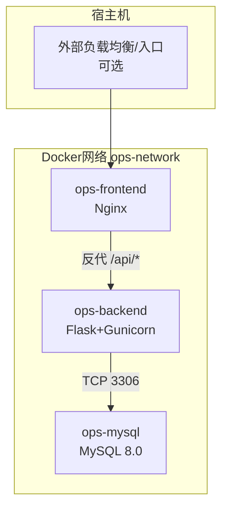
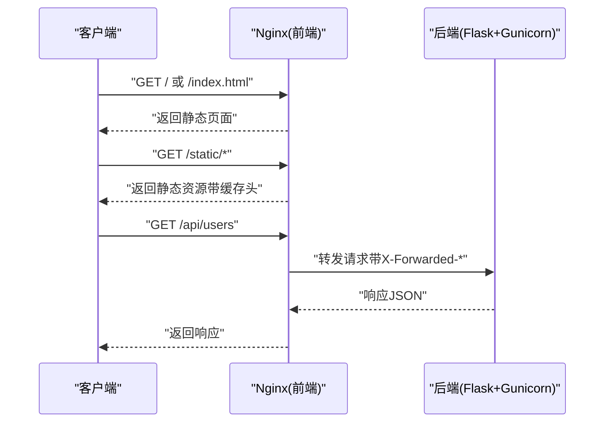
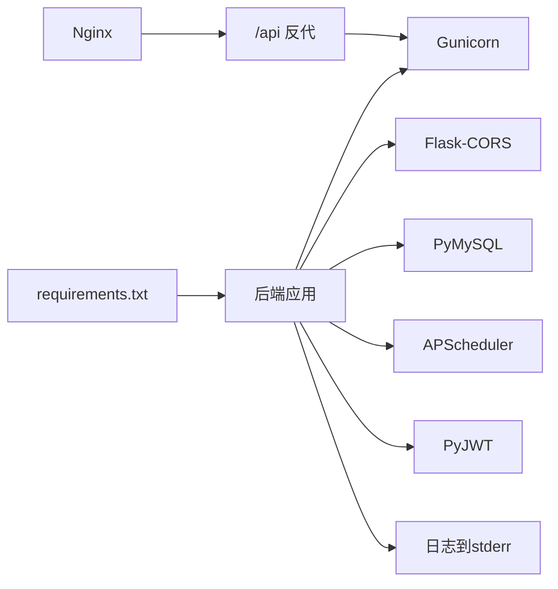

# 部署配置

<cite>
**本文引用的文件**
- [Dockerfile](file://backend/Dockerfile)
- [docker-compose.yml](file://docker-compose.yml)
- [nginx.conf](file://nginx.conf)
- [backend/app/config.py](file://backend/app/config.py)
- [backend/app/__init__.py](file://backend/app/__init__.py)
- [backend/run.py](file://backend/run.py)
- [backend/requirements.txt](file://backend/requirements.txt)
- [backend/init_db.py](file://backend/init_db.py)
- [backend/app/utils/db.py](file://backend/app/utils/db.py)
- [backend/app/api/auth.py](file://backend/app/api/auth.py)
</cite>

## 目录
1. [简介](#简介)
2. [项目结构](#项目结构)
3. [核心组件](#核心组件)
4. [架构总览](#架构总览)
5. [详细组件分析](#详细组件分析)
6. [依赖分析](#依赖分析)
7. [性能考虑](#性能考虑)
8. [故障排查指南](#故障排查指南)
9. [结论](#结论)
10. [附录](#附录)

## 简介
本文件面向生产环境，提供OPS项目的完整部署配置说明，涵盖：
- Docker容器化构建与运行
- docker-compose服务编排与网络配置
- Nginx反向代理与静态资源服务、负载均衡与SSL终止建议
- 关键环境变量配置说明（数据库、认证、CORS、监控等）
- 生产最佳实践（容器编排、服务发现、健康检查、日志收集）
- 部署脚本、监控配置、备份策略与故障恢复方案
- 常见部署问题诊断与解决方案

## 项目结构
项目采用前后端分离架构：
- 后端：基于Flask + Gunicorn，容器内通过Gunicorn提供HTTP服务
- 数据库：MySQL 8.0，持久化存储于命名卷
- 前端：Nginx提供静态站点与反向代理，将/api前缀转发至后端
- 编排：docker-compose统一管理三服务，使用自定义bridge网络

图表来源
- [docker-compose.yml:9-103](file://docker-compose.yml#L9-L103)
- [nginx.conf:32-47](file://nginx.conf#L32-L47)
- [backend/Dockerfile:34-35](file://backend/Dockerfile#L34-L35)

章节来源
- [docker-compose.yml:1-103](file://docker-compose.yml#L1-L103)
- [backend/Dockerfile:1-36](file://backend/Dockerfile#L1-L36)
- [nginx.conf:1-70](file://nginx.conf#L1-L70)

## 核心组件
- 后端服务（Flask + Gunicorn）
  - 构建镜像：基于Python 3.11 slim，安装系统依赖与Python依赖，暴露5000端口
  - 运行方式：Gunicorn以单worker多线程模式启动，避免APScheduler多进程重复注册
  - 日志：输出到stderr，便于容器日志收集
- 数据库服务（MySQL 8.0）
  - 默认数据库名、字符集与排序规则
  - 健康检查：通过mysqladmin ping
  - 数据持久化：命名卷mysql_data
- 前端服务（Nginx）
  - 提供静态站点与反向代理
  - /api前缀转发至后端服务
  - 静态资源缓存与类型优化
  - Grafana反向代理（iframe混合内容兼容）

章节来源
- [backend/Dockerfile:1-36](file://backend/Dockerfile#L1-L36)
- [docker-compose.yml:10-96](file://docker-compose.yml#L10-L96)
- [nginx.conf:1-70](file://nginx.conf#L1-L70)

## 架构总览
以下序列图展示从客户端到后端API的典型请求链路，以及Nginx如何处理静态资源与反向代理。

图表来源
- [nginx.conf:61-63](file://nginx.conf#L61-L63)
- [nginx.conf:26-30](file://nginx.conf#L26-L30)
- [nginx.conf:32-47](file://nginx.conf#L32-L47)
- [backend/Dockerfile:34-35](file://backend/Dockerfile#L34-L35)

## 详细组件分析

### Dockerfile构建配置
- 基础镜像与工作目录
- 环境变量设置（PYTHONDONTWRITEBYTECODE、PYTHONUNBUFFERED、FLASK_*）
- 系统依赖安装（编译工具与MySQL客户端开发包）
- Python依赖安装（requirements.txt）
- 应用代码复制与上传目录创建
- 端口暴露与Gunicorn启动参数（单worker多线程、超时、日志级别）

章节来源
- [backend/Dockerfile:1-36](file://backend/Dockerfile#L1-L36)

### docker-compose服务编排
- 网络：自定义bridge网络ops-network
- 卷：mysql_data持久化
- 服务：
  - mysql：环境变量、卷挂载、端口映射、健康检查
  - backend：构建上下文、环境变量（含密钥、数据库、CORS、监控）、卷挂载、端口映射、健康检查、依赖mysql健康
  - frontend：Nginx镜像、静态站点挂载、nginx.conf挂载、端口映射、依赖backend健康

章节来源
- [docker-compose.yml:7-103](file://docker-compose.yml#L7-L103)

### Nginx反向代理配置
- 监听80端口，server_name支持本地与域名
- 静态资源优化：JS/CSS/PNG/JPG/GIF/ICO/SVG/字体等缓存一年
- /api前缀反代至backend:5000，传递真实IP与协议头
- Grafana反代：解决HTTPS页面嵌入HTTP iframe的Mixed Content问题
- 错误页与MIME类型

章节来源
- [nginx.conf:1-70](file://nginx.conf#L1-L70)

### 后端应用工厂与配置
- 应用工厂create_app：加载Config类属性、设置中文JSON输出、CORS配置、注册蓝图、数据库预检与schema确保、定时任务初始化
- CORS：支持显式源列表+credentials；当CORS_ALLOW_ALL为真时允许任意源
- 日志：输出到stderr，便于容器日志收集
- 根路由：返回服务状态

章节来源
- [backend/app/__init__.py:28-114](file://backend/app/__init__.py#L28-L114)
- [backend/app/config.py:10-58](file://backend/app/config.py#L10-L58)

### 环境变量配置说明
- 应用与安全
  - SECRET_KEY、JWT_SECRET_KEY、JWT_EXPIRATION_HOURS
  - DATA_ENCRYPTION_KEY、OPS_DEV_ENCRYPTION_FALLBACK
- 数据库
  - DB_HOST、DB_PORT、DB_USER、DB_PASSWORD、DB_NAME
- 运行参数
  - FLASK_HOST、FLASK_PORT、FLASK_DEBUG
- CORS
  - CORS_ORIGINS（逗号分隔）、CORS_ALLOW_ALL
- 通知与监控
  - WECHAT_WEBHOOK_URL
  - GRAFANA_URL、GRAFANA_DASHBOARDS
- 定时任务与告警
  - SSL_CHECK_TIMEOUT、SSL_WARNING_DAYS、DOMAIN_WARNING_DAYS
  - CERT_AUTO_CHECK_CRON、DOMAIN_AUTO_NOTIFY_CRON

章节来源
- [backend/app/config.py:10-58](file://backend/app/config.py#L10-L58)
- [docker-compose.yml:36-59](file://docker-compose.yml#L36-L59)

### 数据库初始化与Schema
- 初始化脚本：创建数据库与表结构，插入默认字典数据与管理员账户
- 为现有表动态添加project_id字段（若缺失）
- 默认管理员：用户名与密码提示

章节来源
- [backend/init_db.py:22-391](file://backend/init_db.py#L22-L391)

### API示例：认证接口
- 登录：校验用户名/密码，生成JWT令牌
- 获取资料：JWT鉴权
- 修改密码：JWT鉴权，旧密码校验与新密码长度校验

章节来源
- [backend/app/api/auth.py:15-95](file://backend/app/api/auth.py#L15-L95)
- [backend/app/api/auth.py:98-128](file://backend/app/api/auth.py#L98-L128)
- [backend/app/api/auth.py:131-197](file://backend/app/api/auth.py#L131-L197)

## 依赖分析
- 后端依赖
  - Flask、Flask-CORS、Gunicorn、PyMySQL、PyJWT、Werkzeug、APScheduler、OpenPyXL、Cryptography、bcrypt、Paramiko、阿里云相关SDK
- 运行时依赖
  - MySQL客户端开发包（apt安装）
- 组件耦合
  - 后端通过环境变量读取数据库配置，依赖MySQL服务名作为DB_HOST
  - 前端通过Nginx反代访问后端API
  - 健康检查依赖后端根路由可达

图表来源
- [backend/requirements.txt:1-17](file://backend/requirements.txt#L1-L17)
- [backend/Dockerfile:14-23](file://backend/Dockerfile#L14-L23)
- [nginx.conf:32-47](file://nginx.conf#L32-L47)

章节来源
- [backend/requirements.txt:1-17](file://backend/requirements.txt#L1-L17)
- [backend/Dockerfile:14-23](file://backend/Dockerfile#L14-L23)

## 性能考虑
- Gunicorn配置
  - 单worker多线程：避免APScheduler多进程重复注册定时任务
  - 超时与日志级别：合理设置timeout与日志级别，平衡稳定性与可观测性
- Nginx静态资源
  - 长缓存与immutable头，减少带宽与服务器压力
  - MIME类型与try_files提升静态资源命中率
- 数据库连接
  - Flask应用上下文缓存连接，避免频繁建立/销毁连接
  - 连接超时与日志脱敏，便于定位问题

章节来源
- [backend/Dockerfile:34-35](file://backend/Dockerfile#L34-L35)
- [nginx.conf:26-30](file://nginx.conf#L26-L30)
- [backend/app/utils/db.py:43-69](file://backend/app/utils/db.py#L43-L69)

## 故障排查指南
- 后端无法启动/健康检查失败
  - 检查环境变量是否正确（密钥、数据库连接、CORS）
  - 查看容器日志，确认Gunicorn启动与stderr输出
  - 核对compose中depends_on与healthcheck条件
- 数据库连接失败
  - 确认DB_HOST为mysql（Docker内部服务名）、DB_PORT为3306
  - 核对DB_USER、DB_PASSWORD、DB_NAME与初始化脚本一致
  - 查看后端启动日志中的数据库预检异常栈
- CORS跨域问题
  - 当CORS_ALLOW_ALL为真时，不携带credentials；否则需提供明确origins列表
  - 确保前端请求携带credentials时，后端origins不为*
- Nginx反代异常
  - /api前缀是否正确转发至backend:5000
  - 检查X-Forwarded-*头是否透传
  - Grafana iframe混合内容：确认使用HTTPS回源或调整策略
- 健康检查失败
  - 后端健康检查依赖根路由可达；确保Flask应用正常启动
  - mysql健康检查依赖mysqladmin ping

章节来源
- [backend/app/__init__.py:88-104](file://backend/app/__init__.py#L88-L104)
- [backend/app/utils/db.py:28-40](file://backend/app/utils/db.py#L28-L40)
- [docker-compose.yml:66-80](file://docker-compose.yml#L66-L80)
- [nginx.conf:32-47](file://nginx.conf#L32-L47)

## 结论
本部署方案通过docker-compose实现一键拉起后端、数据库与前端服务，并以Nginx提供静态资源与API反代。结合合理的环境变量配置、健康检查与日志输出，满足生产环境的可用性与可观测性要求。建议在生产中进一步完善SSL终止、负载均衡、监控与备份策略。

## 附录

### A. 生产环境部署最佳实践
- 容器编排
  - 使用独立bridge网络隔离服务
  - 为数据库与应用分别设置健康检查
- 服务发现
  - 在Docker内部使用服务名作为主机名（如DB_HOST=mysql）
- 健康检查
  - 后端：根路由可达
  - 数据库：mysqladmin ping
- 日志收集
  - 后端日志输出到stderr，由容器运行时收集
- SSL终止与负载均衡
  - 建议在Nginx或反向代理层统一终止SSL，或在入口层（如Cloudflare）配置HTTPS回源
  - 如使用Cloudflare，源站仅开放80端口时，面板SSL选择“灵活”，或为源站配置443证书后再用“完全/完全(严格)”
- 监控与告警
  - 集成Prometheus/Grafana，采集后端指标与数据库状态
  - 配置微信机器人告警（WECHAT_WEBHOOK_URL）
- 备份策略
  - 定期备份mysql_data卷
  - 备份后端上传目录（脚本与证书）
- 故障恢复
  - 快速回滚镜像版本
  - 通过健康检查与日志定位问题
  - 使用初始化脚本快速重建数据库结构

章节来源
- [docker-compose.yml:4-5](file://docker-compose.yml#L4-L5)
- [docker-compose.yml:25-28](file://docker-compose.yml#L25-L28)
- [docker-compose.yml:69-80](file://docker-compose.yml#L69-L80)
- [backend/app/config.py:40-53](file://backend/app/config.py#L40-L53)

### B. 部署脚本与自动化建议
- 初始化数据库
  - 在首次部署时执行数据库初始化脚本，创建表结构与默认数据
- 部署流程
  - 构建镜像 -> 启动mysql -> 启动backend（等待mysql健康） -> 启动frontend（等待backend健康）
- 自动化
  - 使用CI/CD流水线集成docker-compose up/down
  - 配置蓝绿/滚动发布策略

章节来源
- [backend/init_db.py:22-391](file://backend/init_db.py#L22-L391)
- [docker-compose.yml:66-96](file://docker-compose.yml#L66-L96)

### C. 环境变量清单与说明
- 应用与安全
  - SECRET_KEY：应用密钥（生产必填）
  - JWT_SECRET_KEY：JWT密钥（生产必填）
  - JWT_EXPIRATION_HOURS：JWT过期小时数
  - DATA_ENCRYPTION_KEY：数据加密密钥
  - OPS_DEV_ENCRYPTION_FALLBACK：开发回退开关
- 数据库
  - DB_HOST：数据库主机（Docker内使用服务名）
  - DB_PORT：数据库端口
  - DB_USER：数据库用户
  - DB_PASSWORD：数据库密码
  - DB_NAME：数据库名
- 运行参数
  - FLASK_HOST：监听地址
  - FLASK_PORT：监听端口
  - FLASK_DEBUG：调试模式
- CORS
  - CORS_ORIGINS：允许的源（逗号分隔）
  - CORS_ALLOW_ALL：是否允许任意源
- 通知与监控
  - WECHAT_WEBHOOK_URL：微信机器人Webhook
  - GRAFANA_URL：Grafana地址
  - GRAFANA_DASHBOARDS：仪表板UID列表
- 定时任务与告警
  - SSL_CHECK_TIMEOUT：SSL检查超时秒数
  - SSL_WARNING_DAYS：SSL告警提前天数
  - DOMAIN_WARNING_DAYS：域名告警提前天数
  - CERT_AUTO_CHECK_CRON：证书自动检查Cron表达式
  - DOMAIN_AUTO_NOTIFY_CRON：域名自动通知Cron表达式

章节来源
- [backend/app/config.py:10-58](file://backend/app/config.py#L10-L58)
- [docker-compose.yml:36-59](file://docker-compose.yml#L36-L59)

### D. Nginx配置要点
- 监听80端口，server_name支持本地与域名
- 静态资源缓存与类型优化
- /api前缀反代至backend:5000，透传X-Forwarded-*头
- Grafana反代（解决HTTPS页面嵌入HTTP iframe的Mixed Content问题）

章节来源
- [nginx.conf:4-69](file://nginx.conf#L4-L69)