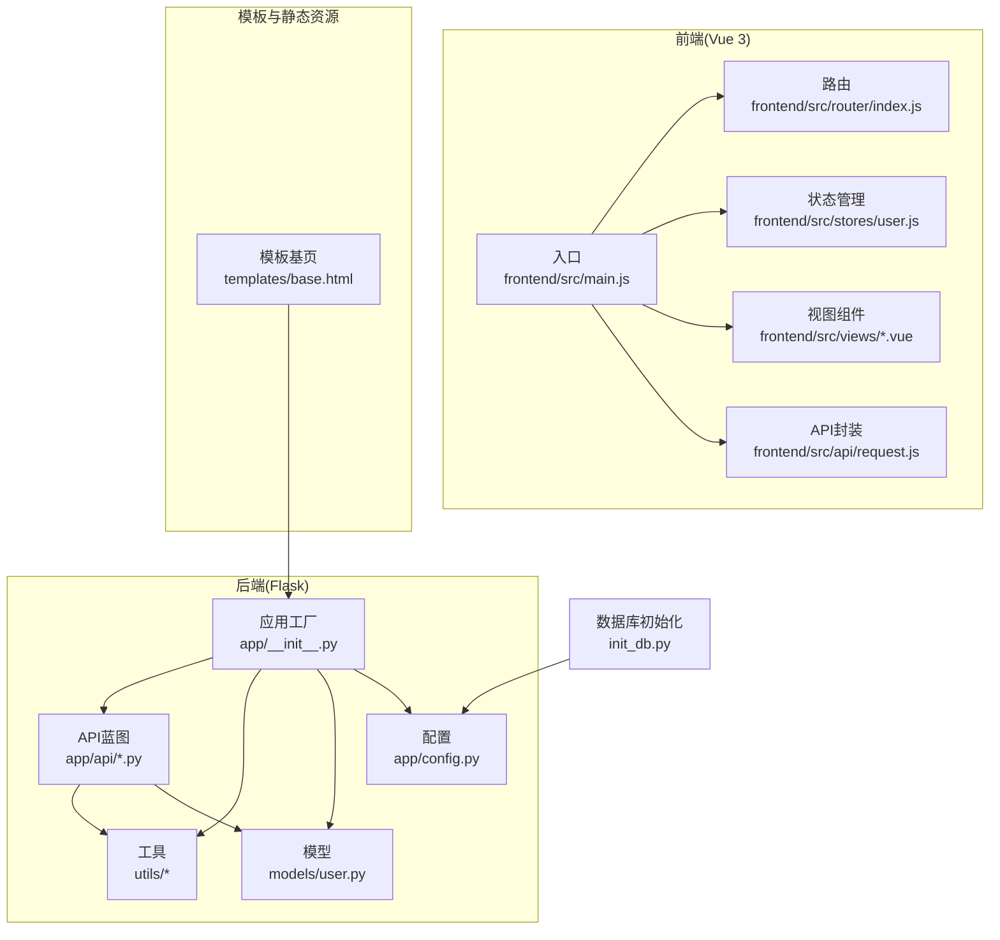
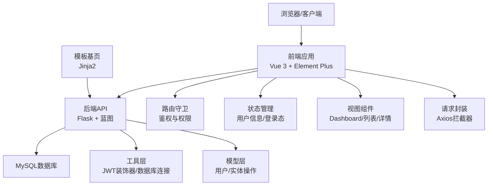
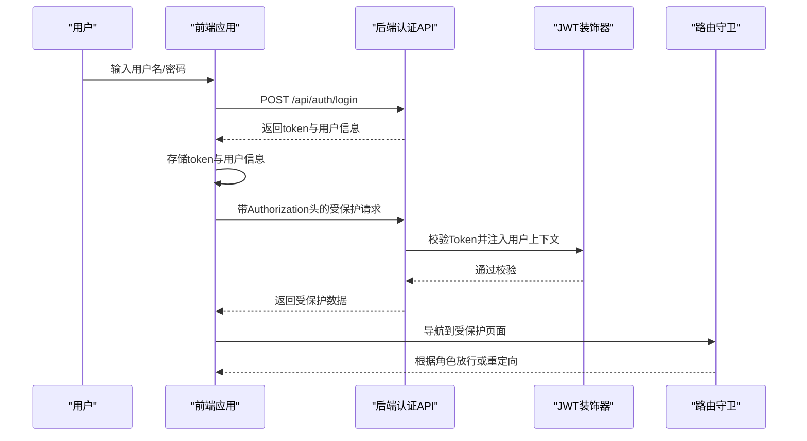
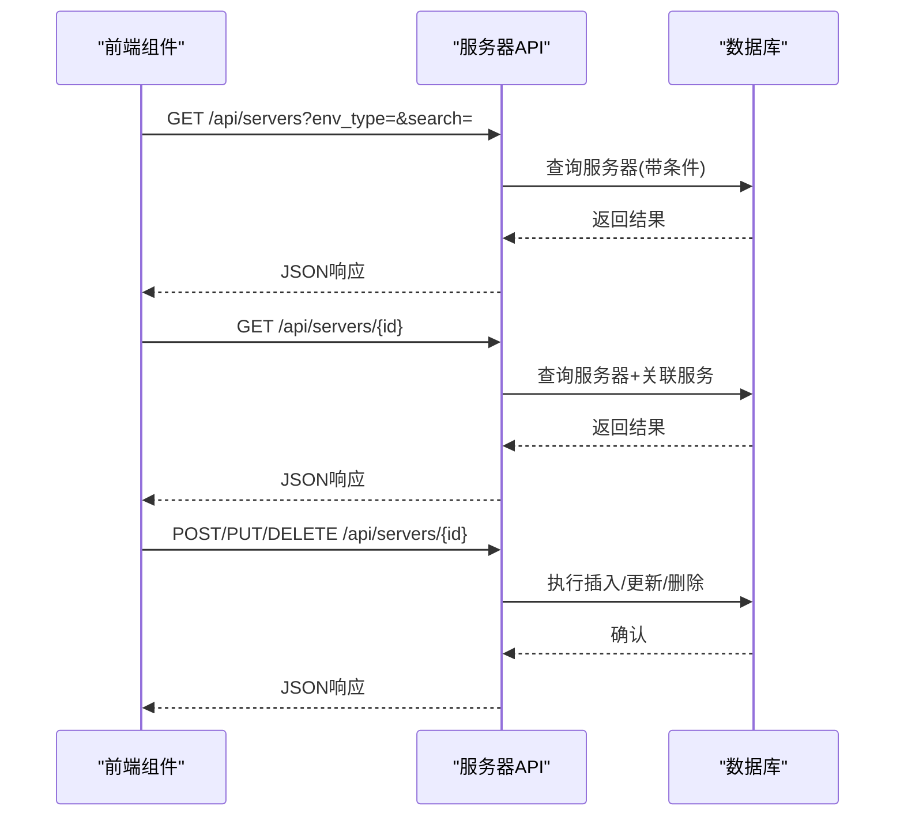
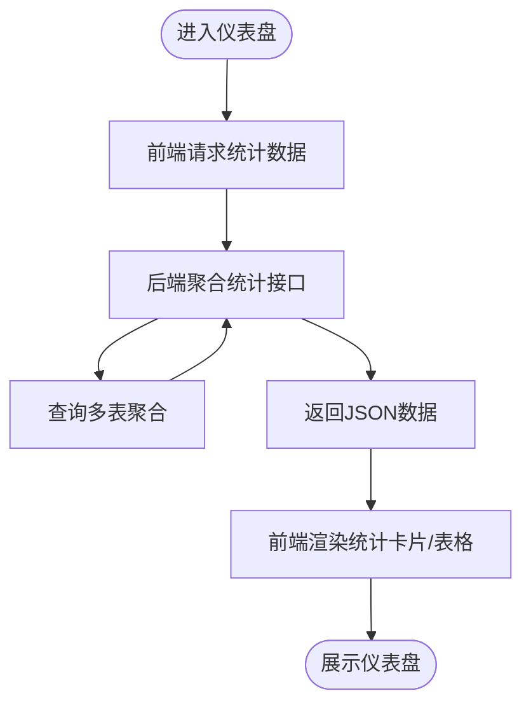
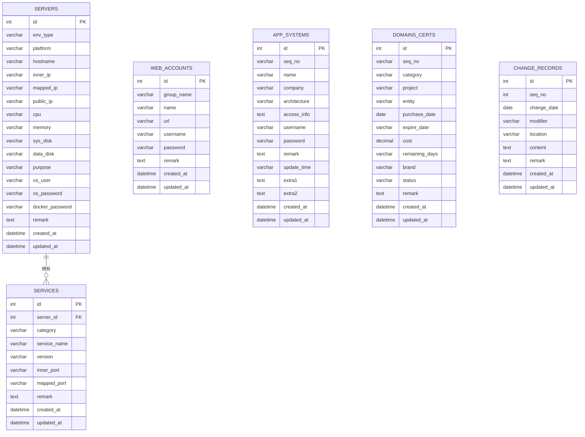
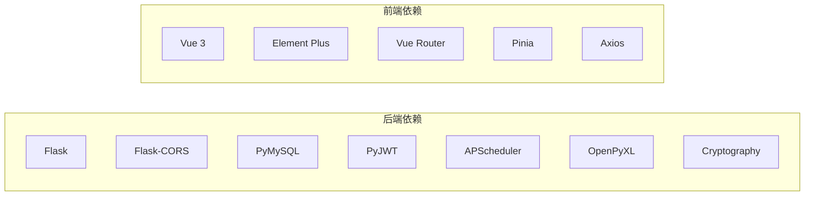

# 项目概述

<cite>
**本文档引用的文件**
- [app.py](file://app.py)
- [backend/app/__init__.py](file://backend/app/__init__.py)
- [backend/app/config.py](file://backend/app/config.py)
- [backend/requirements.txt](file://backend/requirements.txt)
- [backend/app/api/servers.py](file://backend/app/api/servers.py)
- [backend/app/api/auth.py](file://backend/app/api/auth.py)
- [backend/app/utils/decorators.py](file://backend/app/utils/decorators.py)
- [backend/app/models/user.py](file://backend/app/models/user.py)
- [frontend/src/main.js](file://frontend/src/main.js)
- [frontend/package.json](file://frontend/package.json)
- [frontend/src/router/index.js](file://frontend/src/router/index.js)
- [frontend/src/stores/user.js](file://frontend/src/stores/user.js)
- [frontend/src/views/Dashboard.vue](file://frontend/src/views/Dashboard.vue)
- [frontend/src/api/request.js](file://frontend/src/api/request.js)
- [templates/base.html](file://templates/base.html)
- [config.py](file://config.py)
- [init_db.py](file://init_db.py)
</cite>

## 目录
1. [引言](#引言)
2. [项目结构](#项目结构)
3. [核心组件](#核心组件)
4. [架构总览](#架构总览)
5. [详细组件分析](#详细组件分析)
6. [依赖分析](#依赖分析)
7. [性能考虑](#性能考虑)
8. [故障排除指南](#故障排除指南)
9. [结论](#结论)
10. [附录](#附录)

## 引言
本项目是一个面向企业级的云运维平台，旨在通过统一资产管理、可视化监控、权限控制与高效运维，提升IT资产透明度与运维效率。平台支持服务器、服务、Web账户、应用系统、域名证书及变更记录等多维度资产的全生命周期管理，并提供仪表盘概览、权限认证与路由守卫等基础能力，满足不同角色用户的日常运维需求。

项目采用前后端分离架构：后端基于Flask构建RESTful API与模板渲染，前端采用Vue 3 + Element Plus实现现代化交互界面；数据库使用MySQL，通过pymysql进行连接与事务管理；部署方面支持传统模板渲染与现代SPA两种模式，便于在不同环境中快速上线。

## 项目结构
项目采用“根目录 + backend + frontend + templates + static + init_db.py”的组织方式，核心模块划分如下：
- 后端应用入口与蓝图注册：Flask应用工厂、蓝图注册、CORS配置、定时任务初始化
- API层：按业务域拆分蓝图（认证、用户、服务器、服务、账户、应用、证书、记录、仪表盘）
- 工具层：数据库连接、JWT装饰器、调度器等
- 模型层：用户相关数据库操作
- 前端：Vue 3 + Pinia + Vue Router + Element Plus，统一请求封装与路由守卫
- 模板：Jinja2模板基页与各页面模板，用于传统服务端渲染场景
- 数据库初始化：自动创建数据库与表结构

**图表来源**
- [backend/app/__init__.py:6-25](file://backend/app/__init__.py#L6-L25)
- [backend/app/config.py:4-21](file://backend/app/config.py#L4-L21)
- [backend/app/api/servers.py:8](file://backend/app/api/servers.py#L8)
- [backend/app/utils/decorators.py:9-56](file://backend/app/utils/decorators.py#L9-L56)
- [backend/app/models/user.py:8-37](file://backend/app/models/user.py#L8-L37)
- [frontend/src/main.js:10-22](file://frontend/src/main.js#L10-L22)
- [frontend/src/router/index.js:30-61](file://frontend/src/router/index.js#L30-L61)
- [frontend/src/stores/user.js:5-40](file://frontend/src/stores/user.js#L5-L40)
- [frontend/src/api/request.js:5-54](file://frontend/src/api/request.js#L5-L54)
- [templates/base.html:84-169](file://templates/base.html#L84-L169)
- [init_db.py:21-156](file://init_db.py#L21-L156)

**章节来源**
- [backend/app/__init__.py:6-53](file://backend/app/__init__.py#L6-L53)
- [backend/app/config.py:4-21](file://backend/app/config.py#L4-L21)
- [frontend/src/main.js:1-23](file://frontend/src/main.js#L1-L23)
- [frontend/package.json:1-24](file://frontend/package.json#L1-L24)
- [templates/base.html:1-169](file://templates/base.html#L1-L169)
- [init_db.py:1-161](file://init_db.py#L1-L161)

## 核心组件
- 认证与权限控制
  - 后端：JWT装饰器实现认证与授权，支持角色白名单校验
  - 前端：路由守卫控制访问权限，Pinia存储用户信息与登录态
- 仪表盘与可视化
  - 前端Dashboard组件聚合统计卡片、环境分布与到期提醒
  - 后端提供统计数据接口，模板渲染模式下直接使用Jinja2模板
- 资产管理API
  - 服务器、服务、Web账户、应用系统、域名证书、变更记录等均提供增删改查接口
  - 支持条件筛选、排序与分页（通过查询参数）
- 数据库与初始化
  - 自动创建数据库与表结构，包含索引与外键约束，确保查询性能与数据一致性

**章节来源**
- [backend/app/api/auth.py:14-82](file://backend/app/api/auth.py#L14-L82)
- [backend/app/utils/decorators.py:9-95](file://backend/app/utils/decorators.py#L9-L95)
- [frontend/src/router/index.js:35-58](file://frontend/src/router/index.js#L35-L58)
- [frontend/src/stores/user.js:5-40](file://frontend/src/stores/user.js#L5-L40)
- [frontend/src/views/Dashboard.vue:138-199](file://frontend/src/views/Dashboard.vue#L138-L199)
- [backend/app/api/servers.py:11-203](file://backend/app/api/servers.py#L11-L203)
- [init_db.py:32-151](file://init_db.py#L32-L151)

## 架构总览
系统采用前后端分离架构，后端以Flask为核心，提供RESTful API与模板渲染；前端以Vue 3为核心，通过Axios封装统一请求，配合Element Plus实现UI组件化；数据库采用MySQL，初始化脚本自动创建所需表结构。

**图表来源**
- [frontend/src/main.js:10-22](file://frontend/src/main.js#L10-L22)
- [frontend/src/router/index.js:30-61](file://frontend/src/router/index.js#L30-L61)
- [frontend/src/stores/user.js:5-40](file://frontend/src/stores/user.js#L5-L40)
- [frontend/src/views/Dashboard.vue:138-199](file://frontend/src/views/Dashboard.vue#L138-L199)
- [frontend/src/api/request.js:5-54](file://frontend/src/api/request.js#L5-L54)
- [backend/app/__init__.py:28-53](file://backend/app/__init__.py#L28-L53)
- [backend/app/utils/decorators.py:9-56](file://backend/app/utils/decorators.py#L9-L56)
- [backend/app/models/user.py:8-37](file://backend/app/models/user.py#L8-L37)
- [templates/base.html:84-169](file://templates/base.html#L84-L169)

## 详细组件分析

### 认证与权限控制流程
- 登录流程：前端提交用户名与密码，后端验证用户是否存在且激活，校验密码哈希，签发JWT令牌
- 请求拦截：前端在请求头携带Bearer Token，后端JWT装饰器解析并校验Token，注入用户上下文
- 权限校验：角色装饰器根据用户角色与路由要求进行授权判断
- 路由守卫：根据Token与用户角色决定页面访问权限，非管理员访问管理页面将被重定向

**图表来源**
- [backend/app/api/auth.py:14-82](file://backend/app/api/auth.py#L14-L82)
- [backend/app/utils/decorators.py:9-56](file://backend/app/utils/decorators.py#L9-L56)
- [frontend/src/api/request.js:14-23](file://frontend/src/api/request.js#L14-L23)
- [frontend/src/router/index.js:35-58](file://frontend/src/router/index.js#L35-L58)

**章节来源**
- [backend/app/api/auth.py:14-184](file://backend/app/api/auth.py#L14-L184)
- [backend/app/utils/decorators.py:9-95](file://backend/app/utils/decorators.py#L9-L95)
- [frontend/src/api/request.js:1-54](file://frontend/src/api/request.js#L1-L54)
- [frontend/src/router/index.js:1-61](file://frontend/src/router/index.js#L1-L61)

### 服务器管理API工作流
- 列表查询：支持按环境类型与关键词筛选，返回服务器列表
- 详情查询：返回服务器基本信息及其关联的服务列表
- 创建/更新/删除：支持字段选择性更新，管理员与操作员可执行写操作

**图表来源**
- [backend/app/api/servers.py:11-203](file://backend/app/api/servers.py#L11-L203)

**章节来源**
- [backend/app/api/servers.py:11-203](file://backend/app/api/servers.py#L11-L203)

### 仪表盘数据流
- 前端Dashboard组件发起请求获取统计数据
- 后端聚合服务器、服务、账户、应用、证书、记录等计数与分布
- 模板渲染模式下，后端直接渲染HTML页面

**图表来源**
- [frontend/src/views/Dashboard.vue:155-167](file://frontend/src/views/Dashboard.vue#L155-L167)
- [templates/base.html:84-169](file://templates/base.html#L84-L169)

**章节来源**
- [frontend/src/views/Dashboard.vue:138-307](file://frontend/src/views/Dashboard.vue#L138-L307)
- [templates/base.html:1-169](file://templates/base.html#L1-169)

### 数据库表结构与关系
- 服务器表：记录服务器硬件配置、用途、IP映射与密码等
- 服务表：记录运行在服务器上的各类服务，包含分类、端口与版本
- Web账户表：记录各类系统的账户信息
- 应用系统表：记录应用系统的基本信息与登录凭据
- 域名证书表：记录域名与证书相关信息
- 变更记录表：记录运维过程中的变更信息

**图表来源**
- [init_db.py:32-151](file://init_db.py#L32-L151)

**章节来源**
- [init_db.py:1-161](file://init_db.py#L1-L161)

## 依赖分析
- 后端依赖
  - Flask >= 3.0.0：提供Web框架与蓝图机制
  - Flask-CORS >= 4.0.0：跨域资源共享支持
  - PyMySQL >= 1.1.0：MySQL连接与事务
  - PyJWT >= 2.8.0：JWT令牌生成与解析
  - APScheduler >= 3.10.0：定时任务调度
  - OpenPyXL >= 3.1.0：Excel导出能力
  - Cryptography >= 41.0.0：加密相关能力
- 前端依赖
  - Vue 3：响应式框架
  - Element Plus：UI组件库
  - Vue Router：前端路由
  - Pinia：状态管理
  - Axios：HTTP请求封装

**图表来源**
- [backend/requirements.txt:1-9](file://backend/requirements.txt#L1-L9)
- [frontend/package.json:11-22](file://frontend/package.json#L11-L22)

**章节来源**
- [backend/requirements.txt:1-9](file://backend/requirements.txt#L1-L9)
- [frontend/package.json:1-24](file://frontend/package.json#L1-L24)

## 性能考虑
- 数据库层面
  - 表上建立常用查询字段索引（如环境类型、IP、服务名等），减少查询扫描范围
  - 使用外键约束保证数据一致性，避免脏数据导致的重复查询
- 接口层面
  - 对列表查询支持条件过滤与排序，建议前端传入合理分页参数（如limit/offset）以降低单次响应体积
  - 对频繁调用的统计接口可考虑缓存策略（如Redis），减少数据库压力
- 前端层面
  - 组件懒加载与路由懒加载，减少首屏资源体积
  - 合理使用虚拟滚动与分页，避免一次性渲染大量数据
- 安全层面
  - 使用HTTPS传输，避免明文泄露
  - 对敏感字段（密码、令牌）严格控制输出与存储

## 故障排除指南
- 登录失败
  - 检查用户名与密码是否正确，确认用户是否激活
  - 查看后端日志与前端错误提示，确认JWT签发与前端存储是否正常
- 权限不足
  - 确认用户角色是否具备相应权限，路由守卫是否正确配置
  - 检查请求头Authorization是否包含有效的Bearer Token
- 数据库连接异常
  - 核对数据库连接参数（主机、端口、用户名、密码、数据库名）
  - 确认数据库服务可用，初始化脚本是否已执行
- 前端请求失败
  - 检查CORS配置与代理设置，确认请求拦截器是否正确附加Token
  - 关注响应拦截器中的错误提示，区分401过期与业务错误

**章节来源**
- [backend/app/api/auth.py:40-62](file://backend/app/api/auth.py#L40-L62)
- [backend/app/utils/decorators.py:22-54](file://backend/app/utils/decorators.py#L22-L54)
- [frontend/src/api/request.js:25-51](file://frontend/src/api/request.js#L25-L51)
- [config.py:6-17](file://config.py#L6-L17)
- [init_db.py:21-156](file://init_db.py#L21-L156)

## 结论
本项目通过前后端分离架构与模块化的蓝图设计，实现了统一资产管理、可视化监控与权限控制的运维平台。后端以Flask为核心，提供RESTful API与模板渲染能力；前端以Vue 3为基础，结合Element Plus与Pinia，提供良好的用户体验。数据库采用MySQL并通过初始化脚本完成表结构与索引的标准化设计。整体方案适合中小规模到中等规模企业的运维管理场景，具备良好的扩展性与维护性。

## 附录
- 技术选型说明
  - 后端：Flask轻量易用、生态丰富，适合快速迭代与模块化开发
  - 前端：Vue 3组合式API与TypeScript生态成熟，组件化程度高
  - 数据库：MySQL稳定可靠，适合中小型项目的数据持久化
  - 部署：支持传统模板渲染与现代SPA两种模式，便于迁移与扩展
- 系统特点与优势
  - 统一资产管理：覆盖服务器、服务、账户、应用、证书与变更记录
  - 可视化监控：仪表盘直观展示资产统计与到期提醒
  - 权限控制：基于JWT与角色的细粒度访问控制
  - 高效运维：提供批量导入导出、搜索筛选与快捷操作