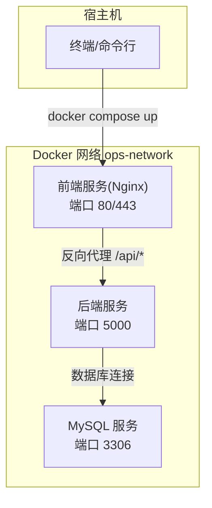
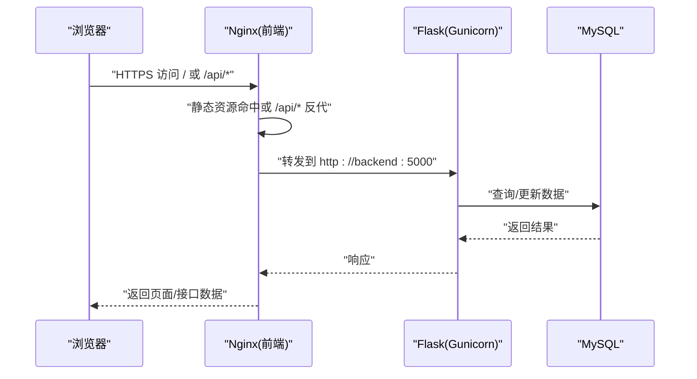
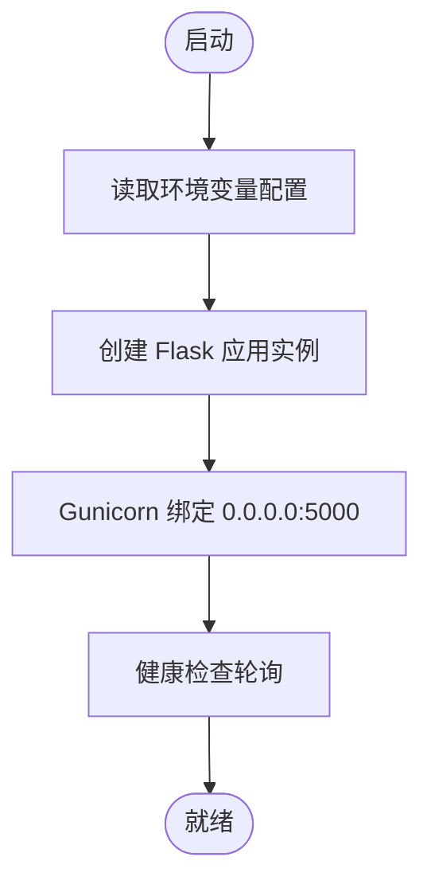
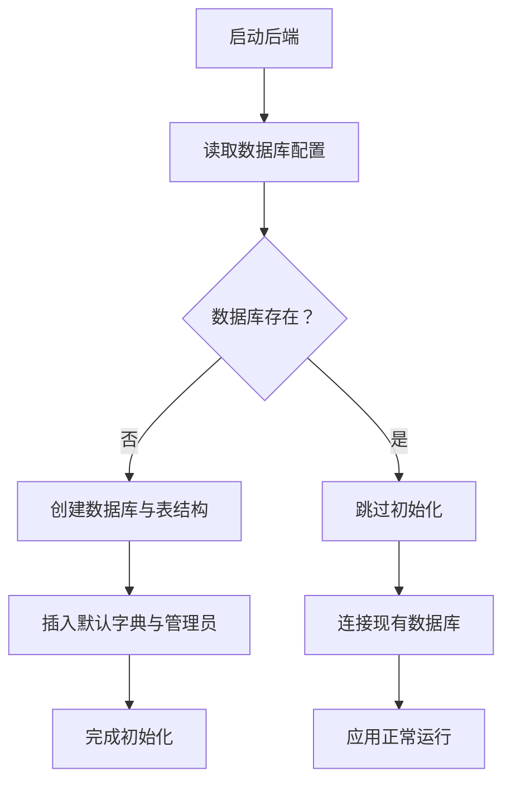
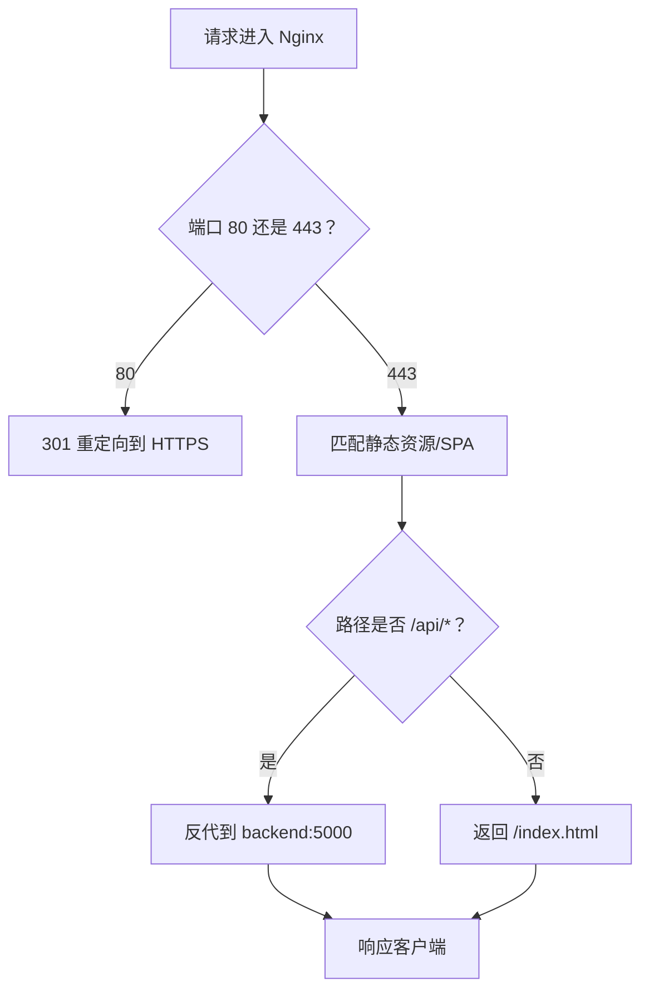
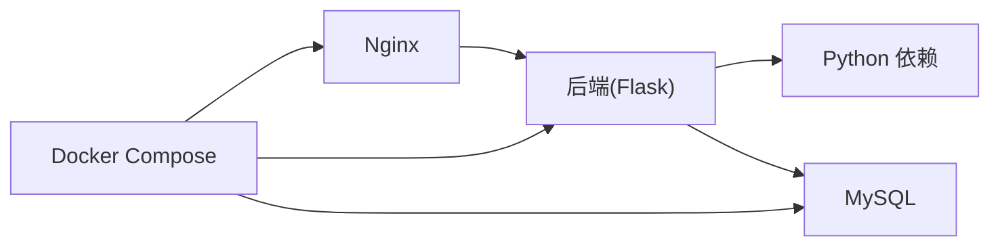

# 快速开始

<cite>
**本文引用的文件**
- [Dockerfile](file://backend/Dockerfile)
- [docker-compose.yml](file://docker-compose.yml)
- [requirements.txt](file://backend/requirements.txt)
- [run.py](file://backend/run.py)
- [config.py](file://backend/app/config.py)
- [db.py](file://backend/app/utils/db.py)
- [init_db.py](file://backend/init_db.py)
- [nginx.conf](file://nginx.conf)
</cite>

## 目录
1. [简介](#简介)
2. [项目结构](#项目结构)
3. [核心组件](#核心组件)
4. [架构总览](#架构总览)
5. [详细组件分析](#详细组件分析)
6. [依赖分析](#依赖分析)
7. [性能考虑](#性能考虑)
8. [故障排查指南](#故障排查指南)
9. [结论](#结论)
10. [附录](#附录)

## 简介
本指南面向首次接触 OPS 平台的新用户，帮助你在约 30 分钟内完成从环境准备到首次运行的全流程。你将获得：
- 环境准备：Python 3.11+、依赖安装、数据库配置
- Docker 环境：镜像构建、容器启动、服务配置
- 本地与生产部署差异说明
- 首次运行验证步骤与常见问题解决
- 简化配置示例与默认参数说明

## 项目结构
OPS 采用前后端分离的容器化架构，后端为 Python Flask 应用，使用 Gunicorn 运行，MySQL 提供持久化存储，Nginx 作为反向代理与静态资源服务。

图表来源
- [docker-compose.yml:9-108](file://docker-compose.yml#L9-L108)
- [nginx.conf:50-65](file://nginx.conf#L50-L65)
- [Dockerfile:34-35](file://backend/Dockerfile#L34-L35)

章节来源
- [docker-compose.yml:1-108](file://docker-compose.yml#L1-L108)
- [Dockerfile:1-36](file://backend/Dockerfile#L1-L36)
- [nginx.conf:1-76](file://nginx.conf#L1-L76)

## 核心组件
- 后端服务（Flask + Gunicorn）
  - 使用 Gunicorn 以“单 worker 多线程”模式运行，避免 APScheduler 在多进程场景重复注册定时任务
  - 默认监听 0.0.0.0:5000，通过健康检查探测可用性
- 数据库（MySQL 8.0）
  - 初始化数据库与表结构，内置默认字典与管理员账户
  - 支持通过环境变量配置连接参数
- 前端服务（Nginx）
  - 提供静态页面与 HTTPS 终端
  - 将 /api/* 请求反向代理至后端 5000 端口
- 配置体系
  - 通过环境变量集中管理密钥、数据库、CORS、监控等参数
  - 默认开启中文 JSON 输出，保持可读性

章节来源
- [Dockerfile:34-35](file://backend/Dockerfile#L34-L35)
- [docker-compose.yml:30-82](file://docker-compose.yml#L30-L82)
- [config.py:10-58](file://backend/app/config.py#L10-L58)
- [init_db.py:24-427](file://backend/init_db.py#L24-L427)
- [nginx.conf:50-65](file://nginx.conf#L50-L65)

## 架构总览
下图展示从浏览器到后端 API 的完整链路，以及 Nginx 如何将 /api/* 转发到后端服务。

图表来源
- [nginx.conf:50-65](file://nginx.conf#L50-L65)
- [docker-compose.yml:84-100](file://docker-compose.yml#L84-L100)
- [Dockerfile:34-35](file://backend/Dockerfile#L34-L35)

## 详细组件分析

### 后端服务（Flask + Gunicorn）
- 运行方式
  - 容器内通过 Gunicorn 启动，绑定 0.0.0.0:5000
  - 单 worker 多线程，线程数由配置决定
- 配置加载
  - 从环境变量读取密钥、数据库、CORS、监控等参数
  - 默认开启中文 JSON 输出，便于调试
- 健康检查
  - 通过轮询本地 5000 端口判断服务可用性

图表来源
- [run.py:1-8](file://backend/run.py#L1-L8)
- [config.py:10-58](file://backend/app/config.py#L10-L58)
- [Dockerfile:34-35](file://backend/Dockerfile#L34-L35)
- [docker-compose.yml:71-82](file://docker-compose.yml#L71-L82)

章节来源
- [run.py:1-8](file://backend/run.py#L1-L8)
- [config.py:10-58](file://backend/app/config.py#L10-L58)
- [Dockerfile:34-35](file://backend/Dockerfile#L34-L35)
- [docker-compose.yml:30-82](file://docker-compose.yml#L30-L82)

### 数据库初始化与连接
- 初始化流程
  - 创建数据库与表结构（含用户、服务器、项目、服务、域名、证书、定时任务、操作日志等）
  - 插入默认字典项与管理员账户
  - 通过环境变量 ADMIN_PASSWORD 设置初始管理员密码
- 连接参数
  - 从环境变量读取 DB_HOST、DB_PORT、DB_USER、DB_PASSWORD、DB_NAME
  - 启动时记录脱敏后的连接信息，便于核对配置

图表来源
- [init_db.py:24-427](file://backend/init_db.py#L24-L427)
- [db.py:18-80](file://backend/app/utils/db.py#L18-L80)
- [config.py:16-20](file://backend/app/config.py#L16-L20)

章节来源
- [init_db.py:24-427](file://backend/init_db.py#L24-L427)
- [db.py:18-80](file://backend/app/utils/db.py#L18-L80)
- [config.py:16-20](file://backend/app/config.py#L16-L20)

### 前端服务（Nginx）
- 功能
  - HTTP 80 自动重定向至 HTTPS 443
  - 提供静态资源与 SPA 入口
  - 将 /api/* 反向代理到后端 5000 端口
- SSL 配置
  - 使用挂载的证书文件路径
  - 启用 TLSv1.2/TLSv1.3 与推荐套件

图表来源
- [nginx.conf:4-69](file://nginx.conf#L4-L69)
- [docker-compose.yml:84-100](file://docker-compose.yml#L84-L100)

章节来源
- [nginx.conf:1-76](file://nginx.conf#L1-L76)
- [docker-compose.yml:84-100](file://docker-compose.yml#L84-L100)

## 依赖分析
- Python 依赖
  - Flask、Flask-CORS、Gunicorn、PyMySQL、PyJWT、Werkzeug、APScheduler、OpenPyXL、Cryptography、bcrypt、Paramiko、阿里云相关 SDK
- 容器依赖
  - MySQL 8.0、Nginx Alpine
- 关键耦合点
  - 后端通过环境变量读取数据库与密钥
  - Nginx 依赖后端健康状态再启动
  - 前端仅负责静态资源与 /api/* 反代

图表来源
- [requirements.txt:1-17](file://backend/requirements.txt#L1-L17)
- [docker-compose.yml:9-108](file://docker-compose.yml#L9-L108)

章节来源
- [requirements.txt:1-17](file://backend/requirements.txt#L1-L17)
- [docker-compose.yml:9-108](file://docker-compose.yml#L9-L108)

## 性能考虑
- 后端并发模型
  - 单 worker 多线程，适合轻量 API 场景；如需更高吞吐，可调整线程数或拆分服务
- 数据库连接
  - 使用连接池与超时控制，避免长时间占用
- Nginx 缓存
  - 对静态资源设置长缓存，减少后端压力
- 健康检查
  - 合理的间隔与超时，避免误判

## 故障排查指南
- 无法访问后端 API
  - 检查后端健康检查是否通过
  - 确认端口映射与防火墙开放
- 数据库连接失败
  - 核对 DB_HOST、DB_PORT、DB_USER、DB_PASSWORD、DB_NAME
  - 查看启动日志中的脱敏连接信息
- Nginx 返回 502/504
  - 检查后端是否健康
  - 调整代理超时参数
- 初次登录失败
  - 确认 ADMIN_PASSWORD 已正确设置
  - 首次启动会创建管理员账户

章节来源
- [docker-compose.yml:71-82](file://docker-compose.yml#L71-L82)
- [db.py:28-80](file://backend/app/utils/db.py#L28-L80)
- [nginx.conf:50-65](file://nginx.conf#L50-L65)
- [init_db.py:273-283](file://backend/init_db.py#L273-L283)

## 结论
通过本指南，你可以在 30 分钟内完成 OPS 平台的环境准备与首次运行。建议优先使用 Docker Compose 快速上线，随后根据生产需求调整密钥、CORS、监控与安全策略。

## 附录

### 环境准备步骤
- 安装 Python 3.11+
  - 下载并安装 Python 3.11+（建议使用官方安装包）
  - 验证安装：python --version
- 准备依赖
  - 进入后端目录，安装依赖：pip install -r requirements.txt
- 准备数据库
  - 使用 MySQL 8.0，确保端口 3306 可用
  - 首次运行会自动创建数据库与表结构

章节来源
- [requirements.txt:1-17](file://backend/requirements.txt#L1-L17)
- [docker-compose.yml:10-28](file://docker-compose.yml#L10-L28)
- [init_db.py:24-427](file://backend/init_db.py#L24-L427)

### Docker 环境搭建步骤
- 生成密钥（在根目录执行）
  - 生成 SECRET_KEY/JWT_SECRET_KEY：python -c "import secrets; print(secrets.token_hex(32))"
  - 生成 DATA_ENCRYPTION_KEY：python -c "from cryptography.fernet import Fernet; print(Fernet.generate_key().decode())"
- 修改 docker-compose.yml
  - 替换所有 your-* 示例值为真实值
  - 确保数据库口令、密钥、管理员密码均被覆盖
- 构建与启动
  - docker compose build
  - docker compose up -d
- 首次初始化
  - 等待后端健康检查通过后，数据库初始化完成
  - 初始管理员账户：admin（密码来自 ADMIN_PASSWORD）

章节来源
- [docker-compose.yml:1-6](file://docker-compose.yml#L1-L6)
- [docker-compose.yml:30-82](file://docker-compose.yml#L30-L82)
- [Dockerfile:1-36](file://backend/Dockerfile#L1-L36)
- [init_db.py:273-283](file://backend/init_db.py#L273-L283)

### 本地开发与生产部署差异
- 本地开发
  - 使用 FLASK_DEBUG=true，便于热更新与调试
  - CORS_ORIGINS 指向前端本地地址（如 http://localhost:3000）
- 生产部署
  - FLASK_DEBUG=false，关闭调试模式
  - CORS_ALLOW_ALL=false，明确指定允许的源
  - 所有密钥与口令通过环境变量注入，不硬编码在代码中

章节来源
- [docker-compose.yml:36-51](file://docker-compose.yml#L36-L51)
- [config.py:22-38](file://backend/app/config.py#L22-L38)

### 首次运行验证步骤
- 访问前端
  - 浏览器打开 http://localhost（自动跳转至 https://localhost）
- 登录系统
  - 使用默认管理员账户 admin 与 ADMIN_PASSWORD 登录
- 调用 API
  - 访问 https://localhost/api/（或通过 Nginx 反代）确认后端可用
- 查看日志
  - docker compose logs -f 查看实时日志

章节来源
- [docker-compose.yml:84-100](file://docker-compose.yml#L84-L100)
- [init_db.py:273-283](file://backend/init_db.py#L273-L283)

### 简化配置示例与默认参数
- 关键环境变量（示例值需替换）
  - SECRET_KEY、JWT_SECRET_KEY、DATA_ENCRYPTION_KEY
  - DB_HOST、DB_PORT、DB_USER、DB_PASSWORD、DB_NAME
  - CORS_ORIGINS、CORS_ALLOW_ALL
  - ADMIN_PASSWORD（首次启动创建管理员）
- 默认行为
  - 后端监听 0.0.0.0:5000
  - 前端监听 80/443，/api/* 反代至后端
  - 数据库字符集 utf8mb4，排序规则 utf8mb4_unicode_ci
  - 中文 JSON 输出（不转义）

章节来源
- [docker-compose.yml:36-60](file://docker-compose.yml#L36-L60)
- [config.py:10-58](file://backend/app/config.py#L10-L58)
- [nginx.conf:10-25](file://nginx.conf#L10-L25)