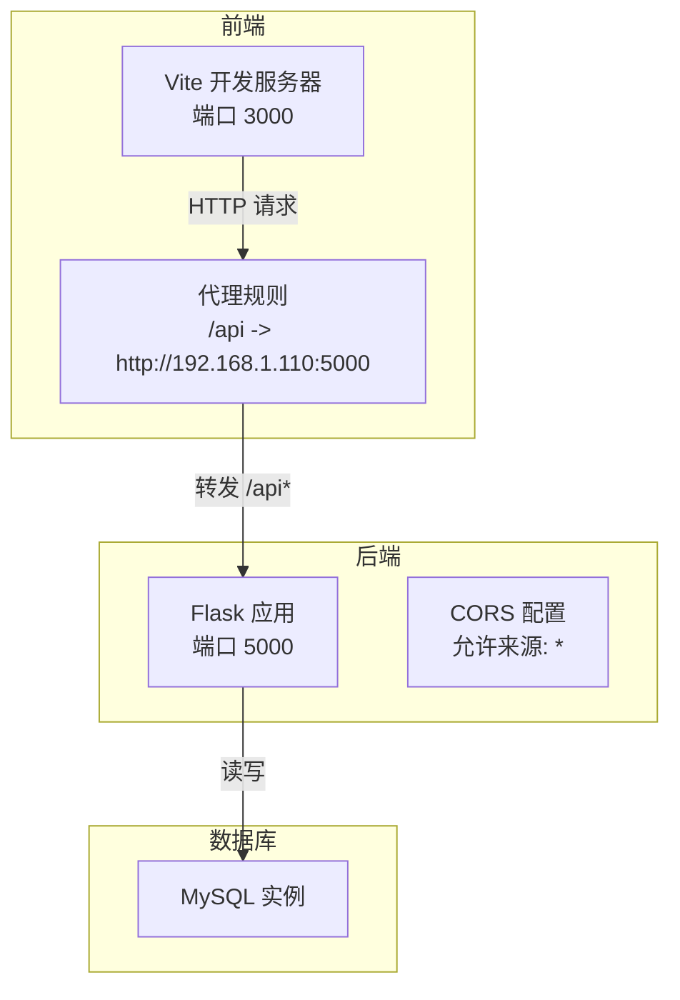
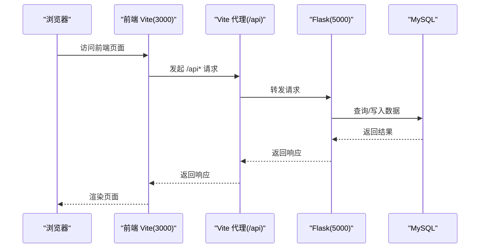
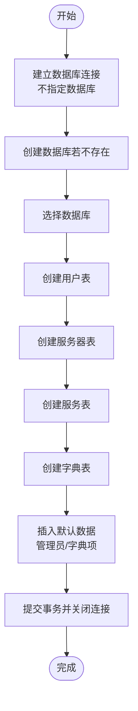
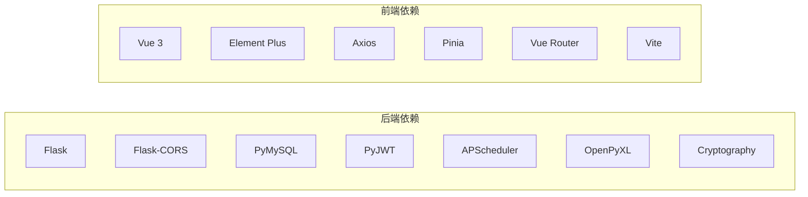

# 快速开始

<cite>
**本文引用的文件**
- [requirements.txt](file://backend/requirements.txt)
- [package.json](file://frontend/package.json)
- [init_db.py](file://backend/init_db.py)
- [config.py](file://backend/app/config.py)
- [__init__.py](file://backend/app/__init__.py)
- [db.py](file://backend/app/utils/db.py)
- [run.py](file://backend/run.py)
- [vite.config.js](file://frontend/vite.config.js)
- [main.js](file://frontend/src/main.js)
</cite>

## 目录
1. [简介](#简介)
2. [项目结构](#项目结构)
3. [核心组件](#核心组件)
4. [架构总览](#架构总览)
5. [详细组件分析](#详细组件分析)
6. [依赖分析](#依赖分析)
7. [性能考虑](#性能考虑)
8. [故障排查指南](#故障排查指南)
9. [结论](#结论)
10. [附录](#附录)

## 简介
本指南面向首次接触云运维平台的新用户，帮助你在约30分钟内完成从环境准备到应用启动的全流程。你将学会：
- 准备 Python 与 Node.js 运行环境
- 安装后端与前端依赖
- 安装并配置 MySQL 数据库
- 初始化数据库表结构
- 启动后端与前端开发服务器
- 修改基础配置（数据库连接、JWT 密钥、CORS）
- 首次运行验证与常见问题处理
- Docker 部署与一键启动思路

## 项目结构
该仓库采用前后端分离架构：
- 后端基于 Flask，提供 REST API 服务，默认监听 5000 端口
- 前端基于 Vue 3 + Vite，开发服务器默认监听 3000 端口，并通过代理转发 /api 请求到后端
- 数据库使用 MySQL，初始化脚本负责创建数据库、表结构及默认数据

图表来源
- [vite.config.js:6-16](file://frontend/vite.config.js#L6-L16)
- [__init__.py:24-25](file://backend/app/__init__.py#L24-L25)
- [config.py:15-17](file://backend/app/config.py#L15-L17)

章节来源
- [run.py:1-8](file://backend/run.py#L1-L8)
- [vite.config.js:1-17](file://frontend/vite.config.js#L1-L17)

## 核心组件
- 后端 Flask 应用：负责 API 路由注册、CORS 配置、定时任务初始化等
- 数据库工具：封装了基于当前 Flask 配置的数据库连接获取方法
- 前端 Vite：提供开发服务器与代理，便于前后端联调

章节来源
- [__init__.py:6-34](file://backend/app/__init__.py#L6-L34)
- [db.py:5-17](file://backend/app/utils/db.py#L5-L17)
- [main.js:1-23](file://frontend/src/main.js#L1-L23)

## 架构总览
下图展示了从浏览器到后端再到数据库的数据流：

图表来源
- [vite.config.js:9-14](file://frontend/vite.config.js#L9-L14)
- [__init__.py:10-17](file://backend/app/__init__.py#L10-L17)
- [db.py:8-16](file://backend/app/utils/db.py#L8-L16)

## 详细组件分析

### 环境准备与依赖安装
- Python 环境
  - 使用 Python 3.8+（建议使用虚拟环境隔离依赖）
  - 安装后端依赖：在 backend 目录执行 pip 安装 requirements.txt 中列出的包
- Node.js 环境
  - 使用 Node.js 16+（推荐使用 nvm 管理版本）
  - 在 frontend 目录执行 npm 安装 package.json 中的依赖

章节来源
- [requirements.txt:1-9](file://backend/requirements.txt#L1-L9)
- [package.json:6-10](file://frontend/package.json#L6-L10)

### 数据库安装与配置
- 安装 MySQL（5.7+ 或兼容版本）
- 在 MySQL 中创建数据库（可由初始化脚本自动创建），并准备具备创建、插入权限的账号
- 配置数据库连接参数（见“基础配置修改”）

章节来源
- [config.py:9-13](file://backend/app/config.py#L9-L13)
- [init_db.py:9-19](file://backend/init_db.py#L9-L19)

### 数据库初始化流程
- 执行初始化脚本以创建数据库与表结构，并插入默认数据
- 默认管理员账户信息会在初始化完成后打印，请妥善保存

图表来源
- [init_db.py:22-258](file://backend/init_db.py#L22-L258)

章节来源
- [init_db.py:1-263](file://backend/init_db.py#L1-L263)

### 应用启动方法
- 后端开发服务器
  - 在 backend 目录执行运行脚本，应用将根据配置监听主机与端口
- 前端开发服务器
  - 在 frontend 目录执行 dev 脚本，应用将启动本地开发服务器并通过代理转发 /api 请求

章节来源
- [run.py:6-8](file://backend/run.py#L6-L8)
- [package.json:6-10](file://frontend/package.json#L6-L10)
- [vite.config.js:6-16](file://frontend/vite.config.js#L6-L16)

### 基础配置修改
- 数据库连接配置
  - 可通过环境变量覆盖默认值：DB_HOST、DB_PORT、DB_USER、DB_PASSWORD、DB_NAME
- JWT 密钥设置
  - 可通过环境变量 JWT_SECRET_KEY 设置，用于签发与校验令牌
- CORS 配置
  - 后端已配置允许所有来源访问 /api/*，支持携带凭证

章节来源
- [config.py:4-21](file://backend/app/config.py#L4-L21)
- [__init__.py:24-25](file://backend/app/__init__.py#L24-L25)

### 首次运行验证步骤
- 启动后端与前端
- 在浏览器访问前端页面，观察是否能正常加载
- 打开浏览器开发者工具网络面板，访问登录页并尝试登录
  - 默认管理员账户信息由初始化脚本输出
- 若无法登录或接口报错，检查后端日志与数据库连接配置

章节来源
- [init_db.py:257-259](file://backend/init_db.py#L257-L259)
- [__init__.py:10-17](file://backend/app/__init__.py#L10-L17)

### 常见问题解决方案
- 前端无法访问后端接口
  - 检查前端代理配置是否指向正确的后端地址与端口
- 登录失败或接口 401/403
  - 检查 JWT 密钥是否一致且未被意外修改
- 数据库连接失败
  - 检查数据库主机、端口、账号与密码是否正确，确认数据库存在
- CORS 报错
  - 后端已允许来源为通配符，若仍异常请检查浏览器控制台与后端日志

章节来源
- [vite.config.js:10-13](file://frontend/vite.config.js#L10-L13)
- [config.py:5-6](file://backend/app/config.py#L5-L6)
- [config.py:9-13](file://backend/app/config.py#L9-L13)
- [__init__.py:24-25](file://backend/app/__init__.py#L24-L25)

## 依赖分析
后端依赖与前端依赖分别在各自目录的清单文件中声明，安装后即可满足开发需求。

图表来源
- [requirements.txt:1-9](file://backend/requirements.txt#L1-L9)
- [package.json:11-22](file://frontend/package.json#L11-L22)

章节来源
- [requirements.txt:1-9](file://backend/requirements.txt#L1-L9)
- [package.json:11-22](file://frontend/package.json#L11-L22)

## 性能考虑
- 合理设置数据库连接池与查询索引，避免全表扫描
- 前端代理仅用于开发联调，生产环境建议统一部署于同一域下以减少跨域影响
- 后端定时任务与并发请求需结合实际负载评估

## 故障排查指南
- 启动后端报端口占用
  - 修改配置中的端口或释放占用端口
- 启动前端报端口占用
  - 修改 Vite 配置中的端口号
- 数据库初始化失败
  - 确认数据库账号具备创建数据库与表的权限
- 接口返回跨域错误
  - 检查后端 CORS 配置与前端代理目标地址

章节来源
- [config.py:15-17](file://backend/app/config.py#L15-L17)
- [vite.config.js:7-8](file://frontend/vite.config.js#L7-L8)
- [init_db.py:22-31](file://backend/init_db.py#L22-L31)
- [__init__.py:24-25](file://backend/app/__init__.py#L24-L25)

## 结论
按照本指南，你可以在约 30 分钟内完成环境准备、依赖安装、数据库初始化与应用启动。建议在生产环境中进一步完善安全策略（如更换默认密钥、限制 CORS 来源、启用 HTTPS）与监控告警。

## 附录
- 一键启动脚本建议
  - 后端：在 backend 目录执行运行脚本
  - 前端：在 frontend 目录执行 dev 脚本
  - 数据库：确保 MySQL 已启动并可通过配置访问
- Docker 部署思路
  - 后端镜像：基于 Python 基础镜像，复制 requirements.txt 并安装依赖，复制后端代码，暴露 5000 端口
  - 前端镜像：基于 Node 基础镜像，复制 package.json 并安装依赖，构建产物 dist，使用 Nginx 提供静态服务，反向代理 /api 到后端
  - 数据库镜像：使用官方 MySQL 镜像，挂载持久化卷与初始化 SQL

章节来源
- [run.py:6-8](file://backend/run.py#L6-L8)
- [package.json:6-10](file://frontend/package.json#L6-L10)
- [config.py:9-13](file://backend/app/config.py#L9-L13)