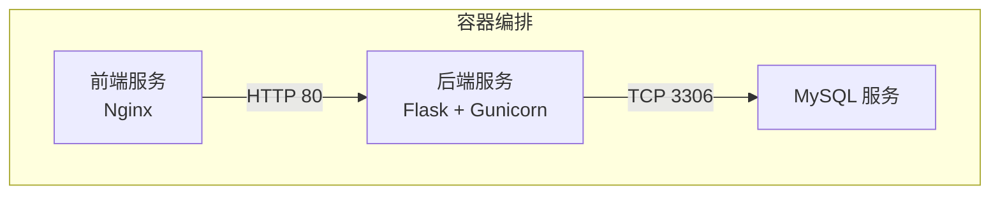
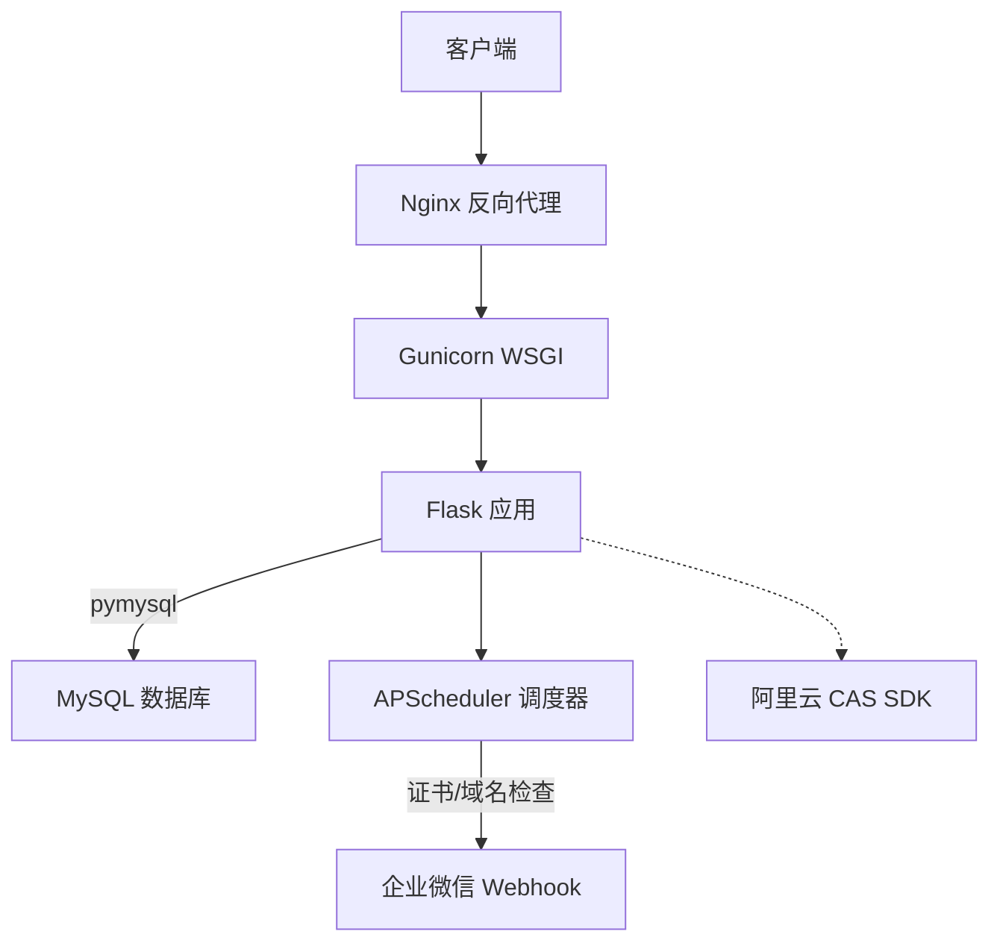
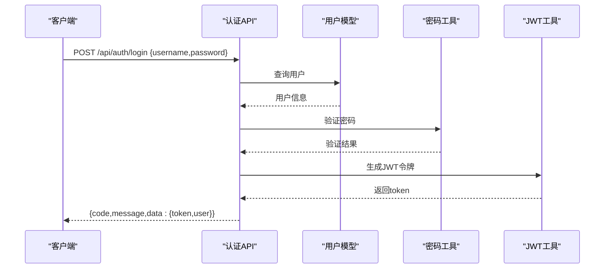
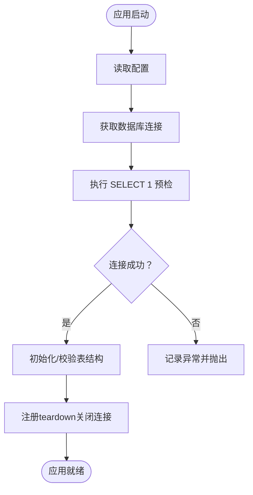
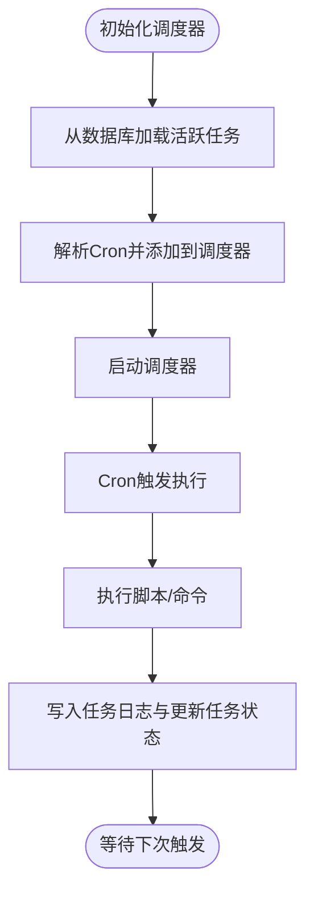
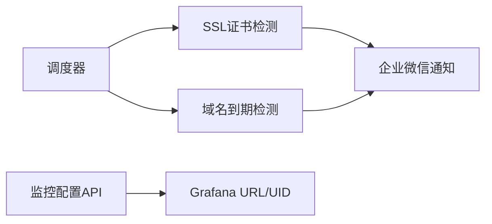
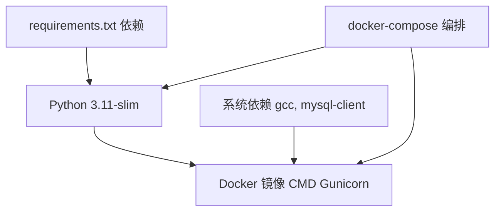

# 技术栈概览

<cite>
**本文档引用的文件**
- [requirements.txt](file://backend/requirements.txt)
- [Dockerfile](file://backend/Dockerfile)
- [docker-compose.yml](file://docker-compose.yml)
- [run.py](file://backend/run.py)
- [app/__init__.py](file://backend/app/__init__.py)
- [app/config.py](file://backend/app/config.py)
- [app/extensions.py](file://backend/app/extensions.py)
- [app/api/auth.py](file://backend/app/api/auth.py)
- [app/utils/auth.py](file://backend/app/utils/auth.py)
- [app/utils/password_utils.py](file://backend/app/utils/password_utils.py)
- [app/utils/db.py](file://backend/app/utils/db.py)
- [app/utils/scheduler.py](file://backend/app/utils/scheduler.py)
- [app/utils/script_runner.py](file://backend/app/utils/script_runner.py)
- [app/utils/ssl_checker.py](file://backend/app/utils/ssl_checker.py)
- [app/models/user.py](file://backend/app/models/user.py)
- [app/api/monitoring.py](file://backend/app/api/monitoring.py)
</cite>

## 目录
1. [简介](#简介)
2. [项目结构](#项目结构)
3. [核心组件](#核心组件)
4. [架构总览](#架构总览)
5. [详细组件分析](#详细组件分析)
6. [依赖关系分析](#依赖关系分析)
7. [性能考虑](#性能考虑)
8. [故障排查指南](#故障排查指南)
9. [结论](#结论)
10. [附录](#附录)

## 简介
本文件为OPS平台技术栈的全面概览文档，重点覆盖后端基于Flask的架构、数据库技术选型、认证安全方案、调度监控、容器化与编排、外部集成以及版本兼容性与升级路径建议。文档旨在帮助开发者快速理解技术选型与实现要点。

## 项目结构
项目采用前后端分离架构，后端使用Flask框架，通过docker-compose编排MySQL、后端服务与Nginx前端代理。核心目录组织如下：
- backend：后端应用，包含Flask应用工厂、蓝图API、工具模块、数据库模型与配置
- docker-compose.yml：服务编排，包含MySQL、后端、Nginx前端
- nginx.conf：Nginx反向代理配置（由compose挂载）

**图表来源**
- [docker-compose.yml:9-103](file://docker-compose.yml#L9-L103)

**章节来源**
- [docker-compose.yml:1-103](file://docker-compose.yml#L1-L103)
- [Dockerfile:1-36](file://backend/Dockerfile#L1-L36)

## 核心组件
- 后端框架与运行时
  - Flask 3.0+：应用工厂、蓝图注册、CORS配置、JSON编码设置
  - Gunicorn：生产级WSGI服务器，单worker多线程部署
- 数据库与连接
  - MySQL 8.0：pymysql驱动，Flask应用上下文缓存连接
- 认证与安全
  - JWT：HS256签名，配置化密钥与过期时间
  - bcrypt：密码哈希与验证，兼容Werkzeug scrypt格式
  - 对称加密：Fernet（可从字符串派生密钥），用于存储敏感信息
- 调度与监控
  - APScheduler：后台调度器，支持Cron触发与任务日志持久化
  - Grafana集成：监控配置读取与仪表盘UID管理
- 外部集成
  - 阿里云API：证书扫描与下载（CAS SDK）
  - SSH远程执行：通过脚本执行器支持自定义命令
  - 企业微信通知：Markdown消息推送
- 前端与部署
  - Nginx：静态资源与反向代理
  - Docker：Python 3.11-slim基础镜像，系统依赖gcc、mysql-client

**章节来源**
- [requirements.txt:1-17](file://backend/requirements.txt#L1-L17)
- [app/__init__.py:28-114](file://backend/app/__init__.py#L28-L114)
- [app/config.py:10-58](file://backend/app/config.py#L10-L58)
- [app/utils/db.py:43-80](file://backend/app/utils/db.py#L43-L80)
- [app/utils/auth.py:9-45](file://backend/app/utils/auth.py#L9-L45)
- [app/utils/password_utils.py:52-130](file://backend/app/utils/password_utils.py#L52-L130)
- [app/utils/scheduler.py:244-384](file://backend/app/utils/scheduler.py#L244-L384)
- [app/api/monitoring.py:11-42](file://backend/app/api/monitoring.py#L11-L42)
- [app/utils/ssl_checker.py:169-302](file://backend/app/utils/ssl_checker.py#L169-L302)
- [app/utils/script_runner.py:19-126](file://backend/app/utils/script_runner.py#L19-L126)
- [Dockerfile:1-36](file://backend/Dockerfile#L1-L36)

## 架构总览
后端采用Flask应用工厂模式创建应用，注册多个蓝图提供REST API；通过CORS中间件支持跨域；使用Gunicorn在容器中运行；数据库连接通过Flask g对象缓存；定时任务由APScheduler统一调度；监控配置来自应用配置。

**图表来源**
- [app/__init__.py:28-114](file://backend/app/__init__.py#L28-L114)
- [app/utils/scheduler.py:244-384](file://backend/app/utils/scheduler.py#L244-L384)
- [app/utils/ssl_checker.py:304-396](file://backend/app/utils/ssl_checker.py#L304-L396)
- [docker-compose.yml:30-81](file://docker-compose.yml#L30-L81)

## 详细组件分析

### 认证与授权组件
- 登录流程：接收用户名/密码，查询用户并校验激活状态，验证密码后生成JWT令牌
- 令牌管理：JWT载荷包含用户ID、用户名、角色与过期时间，使用配置的密钥签名
- 密码安全：bcrypt哈希，兼容Werkzeug scrypt格式；支持对称加密存储敏感信息

**图表来源**
- [app/api/auth.py:15-96](file://backend/app/api/auth.py#L15-L96)
- [app/models/user.py:36-52](file://backend/app/models/user.py#L36-L52)
- [app/utils/password_utils.py:64-91](file://backend/app/utils/password_utils.py#L64-L91)
- [app/utils/auth.py:9-28](file://backend/app/utils/auth.py#L9-L28)

**章节来源**
- [app/api/auth.py:15-197](file://backend/app/api/auth.py#L15-L197)
- [app/utils/auth.py:9-45](file://backend/app/utils/auth.py#L9-L45)
- [app/utils/password_utils.py:52-130](file://backend/app/utils/password_utils.py#L52-L130)
- [app/models/user.py:36-162](file://backend/app/models/user.py#L36-L162)

### 数据库连接与上下文缓存
- 连接参数：从应用配置读取主机、端口、用户、密码、数据库名
- 缓存策略：Flask g对象缓存连接，应用上下文结束时关闭
- 预检机制：启动时执行简单查询验证连接可用性

**图表来源**
- [app/__init__.py:88-113](file://backend/app/__init__.py#L88-L113)
- [app/utils/db.py:43-80](file://backend/app/utils/db.py#L43-L80)

**章节来源**
- [app/utils/db.py:18-80](file://backend/app/utils/db.py#L18-L80)
- [app/__init__.py:88-113](file://backend/app/__init__.py#L88-L113)

### 定时任务调度器
- 任务来源：数据库scheduled_tasks表，支持脚本文件与自定义命令两种执行方式
- 触发机制：Cron表达式，独立线程执行，超时控制
- 日志与状态：任务日志表记录执行状态、输出与错误，更新任务最后运行状态
- 内置任务：SSL证书自动检测与通知、域名到期自动通知

**图表来源**
- [app/utils/scheduler.py:244-384](file://backend/app/utils/scheduler.py#L244-L384)
- [app/utils/script_runner.py:49-116](file://backend/app/utils/script_runner.py#L49-L116)

**章节来源**
- [app/utils/scheduler.py:1-580](file://backend/app/utils/scheduler.py#L1-L580)
- [app/utils/script_runner.py:1-126](file://backend/app/utils/script_runner.py#L1-L126)

### 外部集成与监控
- 阿里云证书：扫描账户证书、下载证书内容，兼容多种响应结构
- 企业微信通知：Markdown消息，带重试机制
- Grafana监控：读取URL与仪表盘配置，提供前端访问入口

**图表来源**
- [app/utils/scheduler.py:391-580](file://backend/app/utils/scheduler.py#L391-L580)
- [app/utils/ssl_checker.py:304-492](file://backend/app/utils/ssl_checker.py#L304-L492)
- [app/api/monitoring.py:11-42](file://backend/app/api/monitoring.py#L11-L42)

**章节来源**
- [app/utils/ssl_checker.py:169-302](file://backend/app/utils/ssl_checker.py#L169-L302)
- [app/api/monitoring.py:11-42](file://backend/app/api/monitoring.py#L11-L42)

## 依赖关系分析
- 后端依赖：Flask、Flask-CORS、Gunicorn、PyMySQL、PyJWT、Werkzeug、APScheduler、OpenPyXL、cryptography、bcrypt、阿里云SDK系列、Paramiko
- 运行时：Python 3.11-slim，系统依赖gcc、mysql-client
- 编排：docker-compose定义MySQL、后端、Nginx三服务，健康检查与端口映射

**图表来源**
- [requirements.txt:1-17](file://backend/requirements.txt#L1-L17)
- [Dockerfile:1-36](file://backend/Dockerfile#L1-L36)
- [docker-compose.yml:30-81](file://docker-compose.yml#L30-L81)

**章节来源**
- [requirements.txt:1-17](file://backend/requirements.txt#L1-L17)
- [Dockerfile:1-36](file://backend/Dockerfile#L1-L36)
- [docker-compose.yml:1-103](file://docker-compose.yml#L1-L103)

## 性能考虑
- 连接池与缓存：Flask应用上下文内复用数据库连接，减少连接开销
- 调度并发：单worker多线程，避免多进程重复注册定时任务；任务执行在独立线程
- 超时控制：脚本执行超时默认300秒，防止阻塞；SSL检测支持超时配置
- 日志与诊断：启动阶段打印数据库连接参数（脱敏密码），便于问题定位

**章节来源**
- [app/utils/db.py:43-80](file://backend/app/utils/db.py#L43-L80)
- [app/utils/scheduler.py:175-179](file://backend/app/utils/scheduler.py#L175-L179)
- [app/__init__.py:88-113](file://backend/app/__init__.py#L88-L113)

## 故障排查指南
- 数据库连接失败
  - 现象：启动时报错，包含host/port/user/database等参数
  - 排查：确认环境变量DB_HOST/DB_PORT/DB_USER/DB_PASSWORD/DB_NAME；检查MySQL服务连通性
- JWT签发失败
  - 现象：生成令牌时报错，提示未配置JWT_SECRET_KEY
  - 排查：确保JWT_SECRET_KEY已设置，生产环境必须使用强密钥
- 定时任务不执行
  - 现象：任务未触发或日志未更新
  - 排查：确认Cron表达式格式正确；检查任务脚本路径或自定义命令是否存在；查看调度器日志
- 企业微信通知失败
  - 现象：告警未送达
  - 排查：确认WECHAT_WEBHOOK_URL配置；检查网络可达性；查看重试日志
- 阿里云证书功能不可用
  - 现象：报SDK未安装
  - 排查：安装阿里云相关SDK包；确认AccessKey配置正确

**章节来源**
- [app/__init__.py:88-113](file://backend/app/__init__.py#L88-L113)
- [app/utils/auth.py:24-28](file://backend/app/utils/auth.py#L24-L28)
- [app/utils/scheduler.py:194-228](file://backend/app/utils/scheduler.py#L194-L228)
- [app/utils/ssl_checker.py:21-35](file://backend/app/utils/ssl_checker.py#L21-L35)

## 结论
OPS平台采用成熟稳定的后端技术栈：Flask 3.0+ + Flask-CORS + PyMySQL + APScheduler + Gunicorn，结合JWT与bcrypt保障认证安全，通过docker-compose实现容器化与编排。外部集成涵盖阿里云API、SSH远程执行与企业微信通知，满足运维场景的多样化需求。建议在生产环境中严格管理密钥与配置，定期评估依赖版本升级路径。

## 附录

### 版本兼容性与升级路径建议
- Python 3.11+：Dockerfile固定使用python:3.11-slim，升级时需验证第三方库兼容性
- Flask 3.0+：新增对JSON非ASCII字符保留与更严格的Werkzeug集成要求，升级需检查蓝图与中间件适配
- PyMySQL：注意连接参数与游标类型变更；建议使用DictCursor保持字典返回
- APScheduler：Cron触发器语法稳定，升级时关注调度器生命周期与作业替换逻辑
- Gunicorn：单worker多线程部署避免多进程重复注册；升级时关注线程安全与超时配置
- bcrypt与cryptography：算法与密钥派生保持向后兼容，升级时确保密钥格式一致

**章节来源**
- [Dockerfile:1-36](file://backend/Dockerfile#L1-L36)
- [requirements.txt:1-17](file://backend/requirements.txt#L1-L17)
- [app/__init__.py:33-48](file://backend/app/__init__.py#L33-L48)
- [app/utils/scheduler.py:217-223](file://backend/app/utils/scheduler.py#L217-L223)