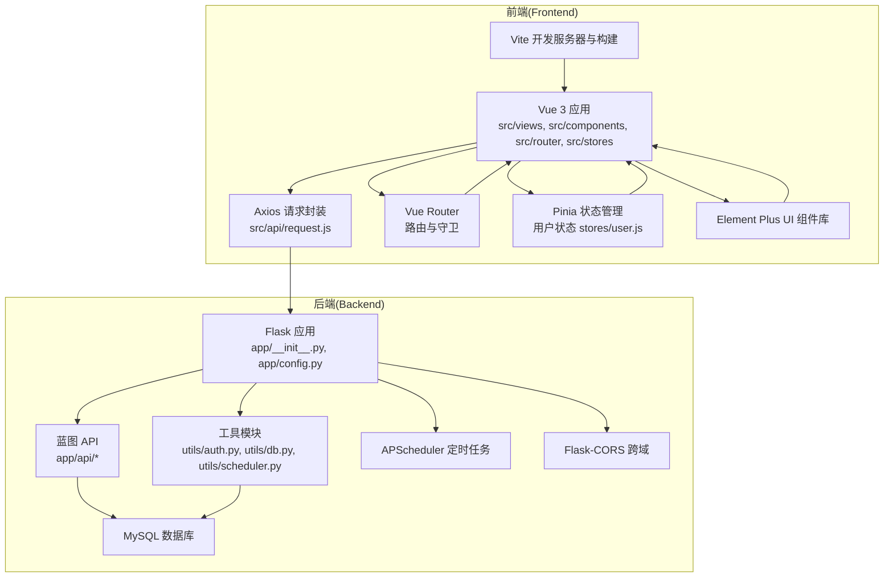
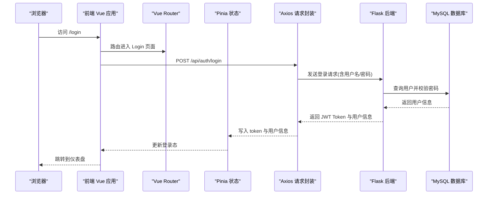
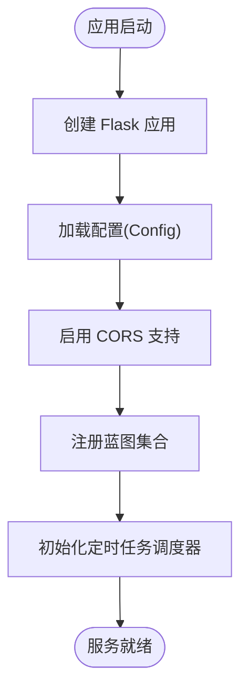
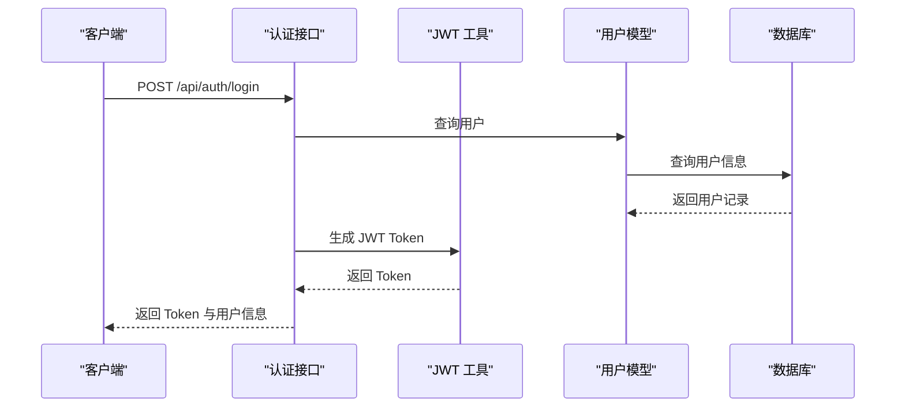
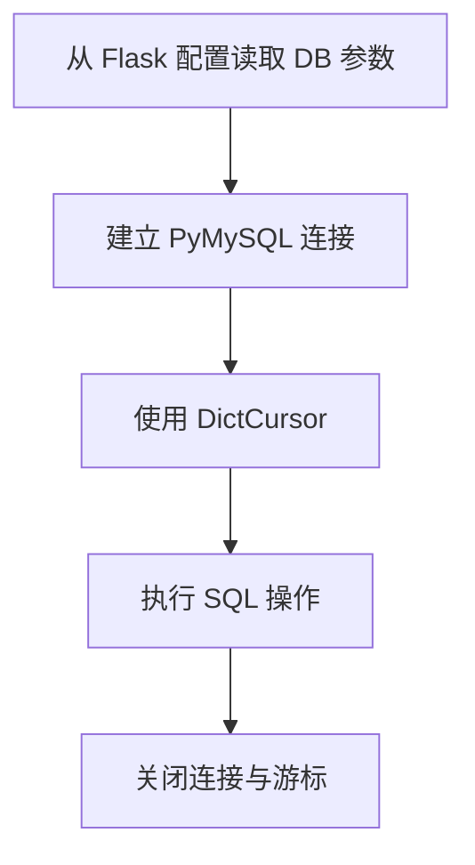
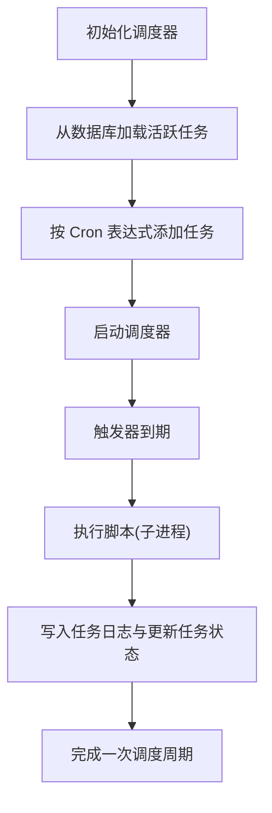
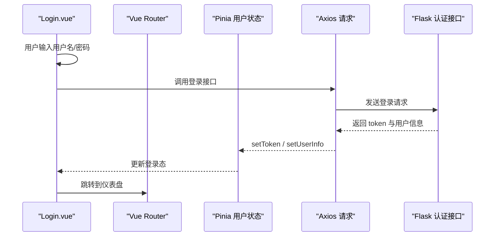
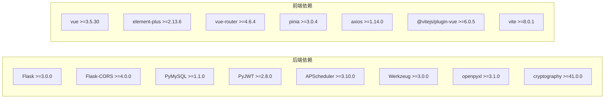

# 技术栈概览

<cite>
**本文档引用的文件**
- [requirements.txt](file://backend/requirements.txt)
- [package.json](file://frontend/package.json)
- [app/__init__.py](file://backend/app/__init__.py)
- [config.py](file://backend/app/config.py)
- [utils/db.py](file://backend/app/utils/db.py)
- [utils/auth.py](file://backend/app/utils/auth.py)
- [utils/scheduler.py](file://backend/app/utils/scheduler.py)
- [api/auth.py](file://backend/app/api/auth.py)
- [api/users.py](file://backend/app/api/users.py)
- [extensions.py](file://backend/app/extensions.py)
- [vite.config.js](file://frontend/vite.config.js)
- [main.ts](file://frontend/src/main.ts)
- [router/index.js](file://frontend/src/router/index.js)
- [stores/user.js](file://frontend/src/stores/user.js)
- [api/request.js](file://frontend/src/api/request.js)
- [tsconfig.json](file://frontend/tsconfig.json)
- [views/Login.vue](file://frontend/src/views/Login.vue)
</cite>

## 目录
1. [简介](#简介)
2. [项目结构](#项目结构)
3. [核心组件](#核心组件)
4. [架构总览](#架构总览)
5. [详细组件分析](#详细组件分析)
6. [依赖关系分析](#依赖关系分析)
7. [性能考虑](#性能考虑)
8. [故障排除指南](#故障排除指南)
9. [结论](#结论)
10. [附录](#附录)

## 简介
本文件为云运维平台项目的技术栈概览，面向后端与前端工程师及产品、运维人员，系统梳理并解释项目采用的技术栈选择、版本要求、兼容性信息以及架构设计思路。后端采用 Python 3.x + Flask + PyMySQL + PyJWT + APScheduler；前端采用 Vue 3 + TypeScript + Element Plus + Vue Router + Pinia；前后端通过 RESTful API 分离部署，使用 Vite 进行构建与开发。

## 项目结构
项目采用前后端分离架构，后端以 Flask 应用为核心，提供 RESTful API；前端以 Vue 3 应用为核心，通过 Axios 发起 API 请求，使用 Element Plus 提供 UI 组件，Pinia 管理全局状态，Vue Router 实现前端路由与鉴权守卫。开发阶段前端通过 Vite 代理到后端 API，生产环境可将前端产物部署至 Nginx 等静态资源服务器，后端提供独立的 API 服务。

**图表来源**
- [app/__init__.py:1-62](file://backend/app/__init__.py#L1-L62)
- [config.py:1-21](file://backend/app/config.py#L1-L21)
- [utils/db.py:1-17](file://backend/app/utils/db.py#L1-L17)
- [utils/auth.py:1-83](file://backend/app/utils/auth.py#L1-L83)
- [utils/scheduler.py:1-249](file://backend/app/utils/scheduler.py#L1-L249)
- [api/auth.py:1-184](file://backend/app/api/auth.py#L1-L184)
- [api/users.py:1-268](file://backend/app/api/users.py#L1-L268)
- [vite.config.js:1-17](file://frontend/vite.config.js#L1-L17)
- [router/index.js:1-61](file://frontend/src/router/index.js#L1-L61)
- [stores/user.js:1-41](file://frontend/src/stores/user.js#L1-L41)
- [api/request.js:1-54](file://frontend/src/api/request.js#L1-L54)

**章节来源**
- [app/__init__.py:1-62](file://backend/app/__init__.py#L1-L62)
- [config.py:1-21](file://backend/app/config.py#L1-L21)
- [vite.config.js:1-17](file://frontend/vite.config.js#L1-L17)

## 核心组件
- 后端技术栈
  - Python 3.x：提供稳定生态与简洁语法，配合 Flask 快速构建 API。
  - Flask：轻量 Web 框架，支持蓝图组织业务模块，易于扩展。
  - PyMySQL：纯 Python MySQL 驱动，连接稳定，便于在容器化环境中部署。
  - PyJWT：实现基于 JWT 的无状态认证，支持过期控制与签发策略。
  - APScheduler：后台定时任务调度，支持 Cron 触发器，具备任务持久化与日志记录能力。
  - Flask-CORS：解决跨域问题，支持凭据传输。
  - Werkzeug：WSGI 工具包，提供路由、调试与安全相关能力。
  - openpyxl、cryptography：分别用于 Excel 导出与加密需求。
- 前端技术栈
  - Vue 3：组合式 API，响应式系统与性能优化良好。
  - TypeScript：类型系统提升代码质量与可维护性。
  - Element Plus：丰富的桌面端组件库，与 Vue 3 协同良好。
  - Vue Router：前端路由与导航，支持路由守卫实现鉴权。
  - Pinia：轻量状态管理，替代 Vuex，API 更加直观。
  - Vite：快速开发服务器与构建工具，热更新体验佳。
  - Axios：HTTP 客户端，统一请求/响应拦截器处理认证与错误。

**章节来源**
- [requirements.txt:1-9](file://backend/requirements.txt#L1-L9)
- [package.json:1-24](file://frontend/package.json#L1-L24)

## 架构总览
前后端分离架构通过 RESTful API 通信，前端负责用户界面与交互逻辑，后端负责业务逻辑与数据持久化。开发时前端通过 Vite 代理将 /api 前缀请求转发至后端 Flask 服务，生产环境可将前端构建产物部署至静态服务器，后端提供独立的 API 服务。

**图表来源**
- [views/Login.vue:1-114](file://frontend/src/views/Login.vue#L1-L114)
- [router/index.js:1-61](file://frontend/src/router/index.js#L1-L61)
- [stores/user.js:1-41](file://frontend/src/stores/user.js#L1-L41)
- [api/request.js:1-54](file://frontend/src/api/request.js#L1-L54)
- [api/auth.py:1-184](file://backend/app/api/auth.py#L1-L184)
- [utils/auth.py:1-83](file://backend/app/utils/auth.py#L1-L83)
- [utils/db.py:1-17](file://backend/app/utils/db.py#L1-L17)

## 详细组件分析

### 后端 Flask 应用与配置
- 应用工厂模式：通过工厂函数创建 Flask 应用，集中初始化 CORS、蓝图注册与定时任务。
- 配置管理：从环境变量读取数据库、JWT、服务端口等配置，支持生产环境安全覆盖。
- 蓝图组织：按业务模块划分蓝图，便于扩展与维护。
- 定时任务：初始化调度器，从数据库加载活跃任务并启动。

**图表来源**
- [app/__init__.py:1-62](file://backend/app/__init__.py#L1-L62)
- [config.py:1-21](file://backend/app/config.py#L1-L21)
- [utils/scheduler.py:201-249](file://backend/app/utils/scheduler.py#L201-L249)

**章节来源**
- [app/__init__.py:1-62](file://backend/app/__init__.py#L1-L62)
- [config.py:1-21](file://backend/app/config.py#L1-L21)

### 认证与授权（JWT）
- 令牌签发：基于用户 ID、用户名、角色生成 JWT，设置过期时间。
- 令牌验证：解析并验证签名，处理过期与无效令牌场景。
- 密码处理：使用 Werkzeug 的哈希算法进行密码存储与校验。
- 接口保护：装饰器确保受保护接口仅对有效令牌放行。

**图表来源**
- [api/auth.py:1-184](file://backend/app/api/auth.py#L1-L184)
- [utils/auth.py:1-83](file://backend/app/utils/auth.py#L1-L83)
- [utils/db.py:1-17](file://backend/app/utils/db.py#L1-L17)

**章节来源**
- [api/auth.py:1-184](file://backend/app/api/auth.py#L1-L184)
- [utils/auth.py:1-83](file://backend/app/utils/auth.py#L1-L83)

### 数据库连接与访问
- 连接池：通过 PyMySQL 建立连接，使用 DictCursor 返回字典结构数据。
- 配置来源：从 Flask 应用配置读取主机、端口、账号、密码与数据库名。
- 使用场景：认证查询、用户管理、定时任务日志与状态更新等。

**图表来源**
- [utils/db.py:1-17](file://backend/app/utils/db.py#L1-L17)
- [config.py:1-21](file://backend/app/config.py#L1-L21)

**章节来源**
- [utils/db.py:1-17](file://backend/app/utils/db.py#L1-L17)
- [config.py:1-21](file://backend/app/config.py#L1-L21)

### 定时任务调度（APScheduler）
- 任务加载：启动时从数据库查询活跃任务，按 Cron 表达式注册到调度器。
- 任务执行：在独立线程中执行外部脚本，记录开始/结束时间、状态与输出。
- 错误处理：超时、异常均记录到任务日志，并更新任务状态。
- 任务管理：支持动态添加/移除任务，保证调度器运行状态。

**图表来源**
- [utils/scheduler.py:1-249](file://backend/app/utils/scheduler.py#L1-L249)

**章节来源**
- [utils/scheduler.py:1-249](file://backend/app/utils/scheduler.py#L1-L249)

### 前端应用与路由
- 路由守卫：根据本地 token 与用户角色决定是否允许访问受保护路由；支持管理员专用页面。
- 登录流程：表单校验、调用登录接口、保存 token 与用户信息、跳转首页。
- 状态管理：Pinia 管理 token、用户信息、登录态与管理员态计算属性。
- 请求封装：Axios 统一设置基础路径、超时、请求头与响应拦截器，处理 401 与通用错误。

**图表来源**
- [views/Login.vue:1-114](file://frontend/src/views/Login.vue#L1-L114)
- [router/index.js:1-61](file://frontend/src/router/index.js#L1-L61)
- [stores/user.js:1-41](file://frontend/src/stores/user.js#L1-L41)
- [api/request.js:1-54](file://frontend/src/api/request.js#L1-L54)
- [api/auth.py:1-184](file://backend/app/api/auth.py#L1-L184)

**章节来源**
- [router/index.js:1-61](file://frontend/src/router/index.js#L1-L61)
- [stores/user.js:1-41](file://frontend/src/stores/user.js#L1-L41)
- [api/request.js:1-54](file://frontend/src/api/request.js#L1-L54)
- [views/Login.vue:1-114](file://frontend/src/views/Login.vue#L1-L114)

### 开发工具链与构建
- Vite：开发服务器支持热更新与代理，生产构建优化打包。
- TypeScript：严格类型检查，提升代码质量与可维护性。
- Element Plus：提供丰富 UI 组件，与 Vue 3 协同良好。
- Vue Router/Pinia：前端路由与状态管理，简化复杂交互。
- Axios：统一请求/响应拦截器，减少重复代码。

**章节来源**
- [vite.config.js:1-17](file://frontend/vite.config.js#L1-L17)
- [tsconfig.json:1-27](file://frontend/tsconfig.json#L1-L27)
- [package.json:1-24](file://frontend/package.json#L1-L24)

## 依赖关系分析
后端依赖通过 requirements.txt 管控，前端依赖通过 package.json 管控。后端核心依赖包括 Flask、Flask-CORS、PyMySQL、PyJWT、APScheduler、Werkzeug、openpyxl、cryptography；前端核心依赖包括 Vue 3、Element Plus、Vue Router、Pinia、Axios、Vite 及其插件。

**图表来源**
- [requirements.txt:1-9](file://backend/requirements.txt#L1-L9)
- [package.json:1-24](file://frontend/package.json#L1-L24)

**章节来源**
- [requirements.txt:1-9](file://backend/requirements.txt#L1-L9)
- [package.json:1-24](file://frontend/package.json#L1-L24)

## 性能考虑
- 后端
  - 使用 PyMySQL 连接池与 DictCursor，减少内存占用与转换成本。
  - 定时任务在独立线程中执行，避免阻塞主事件循环。
  - CORS 仅对 /api/* 生效，降低跨域处理开销。
- 前端
  - Vite 开发时启用 HMR，提升迭代效率；生产构建进行 Tree-shaking 与压缩。
  - Axios 统一拦截器减少重复逻辑，提高请求/响应处理效率。
  - Element Plus 按需引入与组件复用，降低渲染压力。

## 故障排除指南
- 登录失败
  - 检查用户名/密码是否正确，确认用户是否被禁用。
  - 查看后端认证接口返回的状态码与消息。
- 401 未授权
  - 检查本地 token 是否存在且未过期，确认请求头 Authorization 是否携带 Bearer Token。
  - 前端响应拦截器会自动清除本地 token 并跳转登录页。
- 跨域问题
  - 确认 Flask-CORS 配置允许 /api/* 路径与凭据传输。
  - 前端代理配置需指向正确的后端地址。
- 定时任务未执行
  - 检查数据库中任务是否为活跃状态且脚本路径存在。
  - 查看调度器日志与任务日志表，确认 Cron 表达式格式正确。

**章节来源**
- [api/auth.py:1-184](file://backend/app/api/auth.py#L1-L184)
- [api/request.js:1-54](file://frontend/src/api/request.js#L1-L54)
- [app/__init__.py:24-25](file://backend/app/__init__.py#L24-L25)
- [vite.config.js:1-17](file://frontend/vite.config.js#L1-L17)
- [utils/scheduler.py:201-249](file://backend/app/utils/scheduler.py#L201-L249)

## 结论
本项目采用成熟稳定的全栈技术栈：后端以 Flask 为核心，结合 PyMySQL、PyJWT、APScheduler 构建高可用 API 服务；前端以 Vue 3 为基础，配合 Element Plus、Pinia、Vue Router、Axios 与 Vite，形成现代化、可扩展的前端应用。前后端分离架构清晰，开发与部署灵活，适合持续演进与团队协作。

## 附录

### 版本与兼容性要求
- 后端
  - Python 3.x：建议使用 3.9+ 以获得更好的性能与稳定性。
  - Flask >=3.0.0：提供更强的安全性与 WSGI 兼容性。
  - Flask-CORS >=4.0.0：支持现代浏览器跨域与凭据传输。
  - PyMySQL >=1.1.0：稳定连接与字符集支持。
  - PyJWT >=2.8.0：安全算法与过期控制。
  - APScheduler >=3.10.0：Cron 触发器与后台调度能力。
  - Werkzeug >=3.0.0：WSGI 工具与安全增强。
  - openpyxl >=3.1.0：Excel 导出功能。
  - cryptography >=41.0.0：加密与安全需求。
- 前端
  - Vue >=3.5.30：组合式 API 与性能优化。
  - Element Plus >=2.13.6：组件库稳定性与文档完善。
  - Vue Router >=4.6.4：路由守卫与历史模式。
  - Pinia >=3.0.4：状态管理最佳实践。
  - Axios >=1.14.0：HTTP 客户端稳定性。
  - Vite >=8.0.1：开发与构建工具。
  - TypeScript：类型系统与严格检查。

**章节来源**
- [requirements.txt:1-9](file://backend/requirements.txt#L1-L9)
- [package.json:1-24](file://frontend/package.json#L1-L24)
- [tsconfig.json:1-27](file://frontend/tsconfig.json#L1-L27)

### 技术选型决策依据与替代方案
- 后端
  - Flask vs Django：Flask 更轻量，适合 API 优先的场景；Django 提供 ORM、管理后台等，但体量更大。
  - PyMySQL vs SQLAlchemy：PyMySQL 简单直接，适合中小型项目；SQLAlchemy 功能更全，适合复杂 ORM 场景。
  - PyJWT vs OAuth2：JWT 无状态、易扩展；OAuth2 更复杂但适合第三方授权场景。
  - APScheduler vs Celery：APScheduler 轻量、易于集成；Celery 更适合分布式与队列场景。
- 前端
  - Vue 3 vs React：Vue 3 学习曲线较低，生态完善；React 生态更广泛，适合大型企业级应用。
  - Element Plus vs Ant Design Vue：Element Plus 更贴合国内设计规范；Ant Design Vue 设计体系更完整。
  - Pinia vs Vuex：Pinia 更简洁直观，推荐新项目使用。
  - Vite vs Webpack：Vite 开发体验更好，构建速度更快；Webpack 生态成熟，定制性强。