# 核心功能模块

<cite>
**本文引用的文件**
- [backend/app/api/auth.py](file://backend/app/api/auth.py)
- [backend/app/api/users.py](file://backend/app/api/users.py)
- [backend/app/api/servers.py](file://backend/app/api/servers.py)
- [backend/app/api/services.py](file://backend/app/api/services.py)
- [backend/app/api/apps.py](file://backend/app/api/apps.py)
- [backend/app/api/certs.py](file://backend/app/api/certs.py)
- [backend/app/api/dashboard.py](file://backend/app/api/dashboard.py)
- [backend/app/api/tasks.py](file://backend/app/api/tasks.py)
- [backend/app/models/user.py](file://backend/app/models/user.py)
- [backend/app/utils/decorators.py](file://backend/app/utils/decorators.py)
- [backend/app/config.py](file://backend/app/config.py)
- [backend/run.py](file://backend/run.py)
- [frontend/src/router/index.js](file://frontend/src/router/index.js)
- [frontend/src/stores/user.js](file://frontend/src/stores/user.js)
- [frontend/src/main.js](file://frontend/src/main.js)
</cite>

## 目录
1. [简介](#简介)
2. [项目结构](#项目结构)
3. [核心组件](#核心组件)
4. [架构总览](#架构总览)
5. [详细组件分析](#详细组件分析)
6. [依赖关系分析](#依赖关系分析)
7. [性能考虑](#性能考虑)
8. [故障排查指南](#故障排查指南)
9. [结论](#结论)
10. [附录](#附录)

## 简介
本文件面向云运维平台项目的“核心功能模块”，系统性梳理并解释以下模块的业务价值、使用场景、核心功能点、典型流程、模块间依赖与数据流转，并提供导航图、扩展与定制化建议，以及面向不同角色用户的权限与使用方式。涉及模块包括：
- 用户认证与权限管理
- 服务器生命周期管理
- 应用系统部署与监控
- 证书管理与续期
- 仪表板统计分析
- 定时任务与脚本执行
- 用户管理（管理员）

## 项目结构
后端采用 Flask 蓝图组织 API，前端基于 Vue + Pinia + Element Plus，通过路由守卫实现鉴权与菜单控制。整体采用前后端分离架构，后端提供 RESTful 接口，前端负责展示与交互。

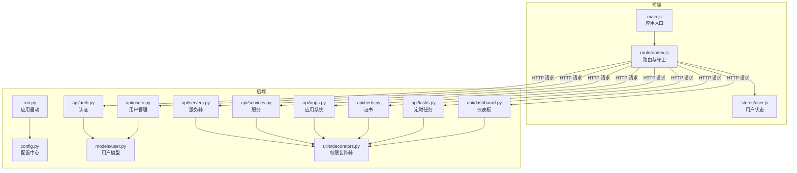

**图表来源**
- [frontend/src/main.js:1-23](file://frontend/src/main.js#L1-L23)
- [frontend/src/router/index.js:1-61](file://frontend/src/router/index.js#L1-L61)
- [frontend/src/stores/user.js:1-41](file://frontend/src/stores/user.js#L1-L41)
- [backend/run.py:1-8](file://backend/run.py#L1-L8)
- [backend/app/config.py:1-21](file://backend/app/config.py#L1-L21)
- [backend/app/api/auth.py:1-184](file://backend/app/api/auth.py#L1-L184)
- [backend/app/api/users.py:1-268](file://backend/app/api/users.py#L1-L268)
- [backend/app/api/servers.py:1-232](file://backend/app/api/servers.py#L1-L232)
- [backend/app/api/services.py:1-182](file://backend/app/api/services.py#L1-L182)
- [backend/app/api/apps.py:1-168](file://backend/app/api/apps.py#L1-L168)
- [backend/app/api/certs.py:1-145](file://backend/app/api/certs.py#L1-L145)
- [backend/app/api/dashboard.py:1-91](file://backend/app/api/dashboard.py#L1-L91)
- [backend/app/api/tasks.py:1-458](file://backend/app/api/tasks.py#L1-L458)
- [backend/app/models/user.py:1-183](file://backend/app/models/user.py#L1-L183)
- [backend/app/utils/decorators.py:1-95](file://backend/app/utils/decorators.py#L1-L95)

**章节来源**
- [frontend/src/main.js:1-23](file://frontend/src/main.js#L1-L23)
- [frontend/src/router/index.js:1-61](file://frontend/src/router/index.js#L1-L61)
- [backend/run.py:1-8](file://backend/run.py#L1-L8)
- [backend/app/config.py:1-21](file://backend/app/config.py#L1-L21)

## 核心组件
- 用户认证与权限管理：提供登录、个人资料查询、密码修改；基于 JWT 的认证与基于角色的访问控制。
- 服务器生命周期管理：支持服务器的增删改查、分页检索、详情联动服务列表。
- 应用系统管理：应用系统信息维护，支持分页与多字段检索。
- 服务管理：服务与服务器关联查询、分页与过滤、增删改查。
- 证书管理：域名证书记录维护，支持分类与项目检索。
- 仪表板统计：聚合统计、环境分布、近期变更与证书到期提醒。
- 定时任务：任务创建、启停、手动执行、日志查看，支持脚本上传与调度。
- 用户管理：管理员维度的用户全量管理、重置密码、禁用启用。

**章节来源**
- [backend/app/api/auth.py:14-184](file://backend/app/api/auth.py#L14-L184)
- [backend/app/utils/decorators.py:9-95](file://backend/app/utils/decorators.py#L9-L95)
- [backend/app/api/servers.py:11-232](file://backend/app/api/servers.py#L11-L232)
- [backend/app/api/apps.py:11-168](file://backend/app/api/apps.py#L11-L168)
- [backend/app/api/services.py:11-182](file://backend/app/api/services.py#L11-L182)
- [backend/app/api/certs.py:11-145](file://backend/app/api/certs.py#L11-L145)
- [backend/app/api/dashboard.py:20-91](file://backend/app/api/dashboard.py#L20-L91)
- [backend/app/api/tasks.py:33-458](file://backend/app/api/tasks.py#L33-L458)
- [backend/app/api/users.py:17-268](file://backend/app/api/users.py#L17-L268)

## 架构总览
后端以蓝图划分功能域，统一通过装饰器实现认证与授权；前端通过路由元信息与 Pinia 状态管理实现菜单与权限控制；配置集中于 Config 类，便于环境变量注入。

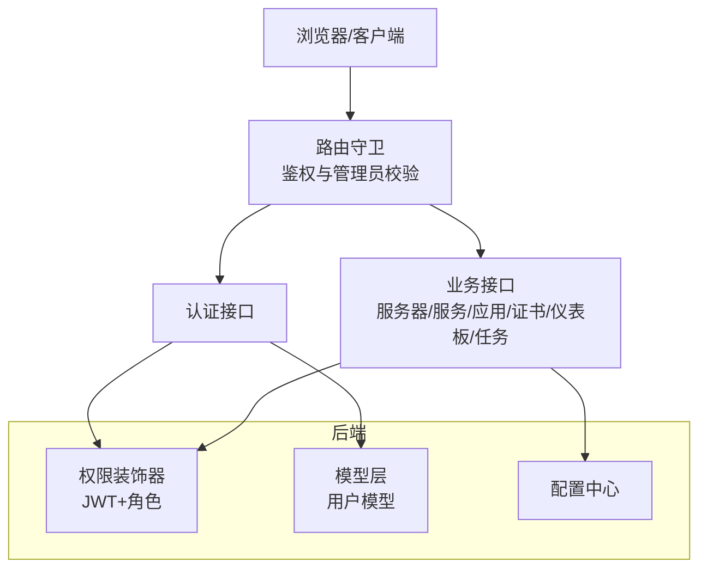

**图表来源**
- [frontend/src/router/index.js:35-61](file://frontend/src/router/index.js#L35-L61)
- [backend/app/utils/decorators.py:9-95](file://backend/app/utils/decorators.py#L9-L95)
- [backend/app/models/user.py:1-183](file://backend/app/models/user.py#L1-L183)
- [backend/app/config.py:1-21](file://backend/app/config.py#L1-L21)

## 详细组件分析

### 用户认证与权限管理
- 核心功能
  - 登录：校验用户名与密码，返回 JWT 令牌与用户信息。
  - 个人资料：携带 JWT 可获取当前用户信息。
  - 修改密码：校验旧密码，更新为新密码哈希。
  - 权限控制：JWT 验证与角色白名单校验，统一装饰器封装。
- 典型流程
  - 登录成功后，前端存储 token 与用户信息；后续请求在请求头携带 Bearer token。
  - 路由守卫根据 token 与用户角色决定页面访问权限。
- 数据流
  - 前端 -> 认证接口 -> 用户模型 -> 生成 JWT -> 前端持久化 -> 后续接口鉴权。

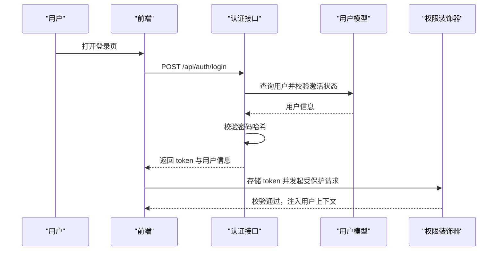

**图表来源**
- [backend/app/api/auth.py:14-184](file://backend/app/api/auth.py#L14-L184)
- [backend/app/models/user.py:39-80](file://backend/app/models/user.py#L39-L80)
- [backend/app/utils/decorators.py:9-57](file://backend/app/utils/decorators.py#L9-L57)
- [frontend/src/router/index.js:35-61](file://frontend/src/router/index.js#L35-L61)

**章节来源**
- [backend/app/api/auth.py:14-184](file://backend/app/api/auth.py#L14-L184)
- [backend/app/utils/decorators.py:9-95](file://backend/app/utils/decorators.py#L9-L95)
- [frontend/src/router/index.js:35-61](file://frontend/src/router/index.js#L35-L61)

### 服务器生命周期管理
- 核心功能
  - 列表查询：支持环境类型筛选、关键词搜索、分页。
  - 详情查询：返回服务器与关联服务列表。
  - 增删改查：仅管理员与运维角色可操作。
- 典型流程
  - 运维工程师在“服务器管理”页面创建/编辑服务器，随后在“服务管理”中绑定服务。
- 数据流
  - 前端 -> 服务器接口 -> 数据库 -> 返回结果。

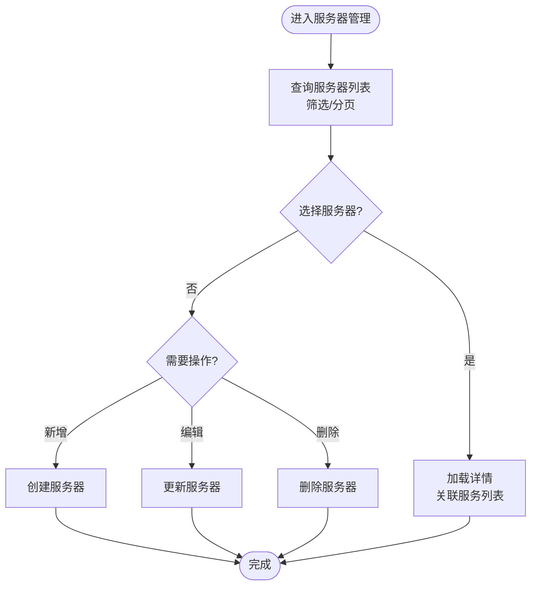

**图表来源**
- [backend/app/api/servers.py:11-232](file://backend/app/api/servers.py#L11-L232)

**章节来源**
- [backend/app/api/servers.py:11-232](file://backend/app/api/servers.py#L11-L232)

### 应用系统部署与监控
- 核心功能
  - 应用系统信息维护：名称、公司、访问地址、凭证等。
  - 支持多字段检索与分页。
- 典型流程
  - 运维工程师录入应用系统信息，用于统一管理与审计。
- 数据流
  - 前端 -> 应用接口 -> 数据库。

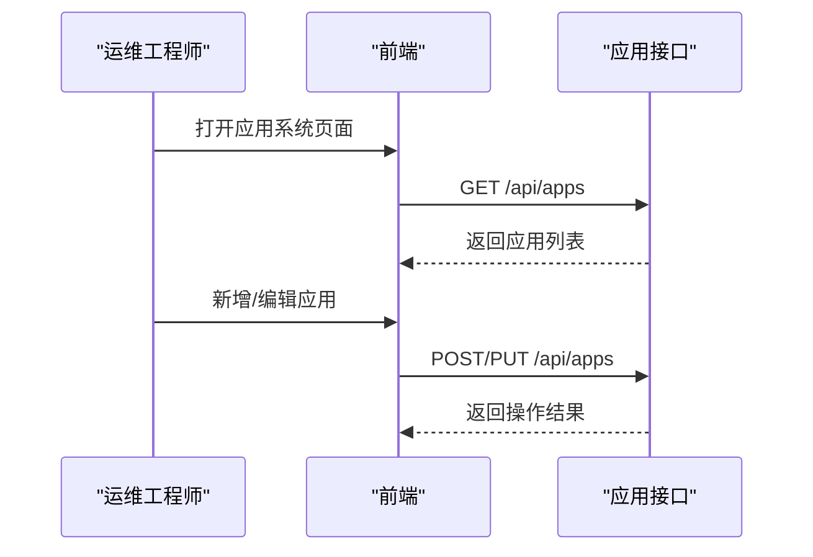

**图表来源**
- [backend/app/api/apps.py:11-168](file://backend/app/api/apps.py#L11-L168)

**章节来源**
- [backend/app/api/apps.py:11-168](file://backend/app/api/apps.py#L11-L168)

### 服务管理
- 核心功能
  - 服务与服务器关联查询，支持分类、环境类型、关键词过滤与分页。
  - 增删改查，仅管理员与运维角色可操作。
- 典型流程
  - 在服务器详情页查看关联服务，必要时新增/调整服务映射。
- 数据流
  - 前端 -> 服务接口 -> 数据库。

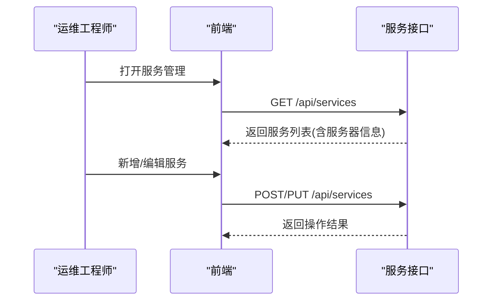

**图表来源**
- [backend/app/api/services.py:11-182](file://backend/app/api/services.py#L11-L182)

**章节来源**
- [backend/app/api/services.py:11-182](file://backend/app/api/services.py#L11-L182)

### 证书管理与续期
- 核心功能
  - 域名证书记录维护：项目、实体、购买/到期时间、品牌、状态等。
  - 支持分类与关键词检索。
- 典型流程
  - 运维工程师录入证书信息，结合仪表板“证书到期提醒”进行续期。
- 数据流
  - 前端 -> 证书接口 -> 数据库。

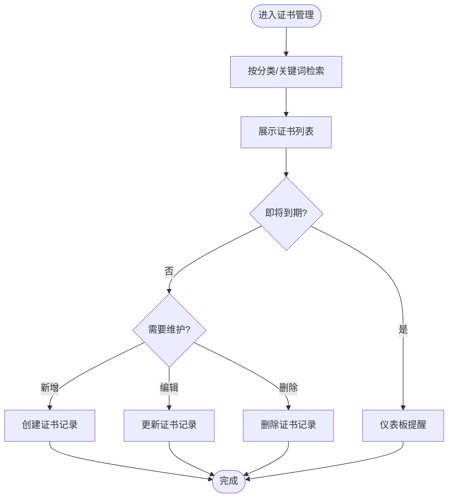

**图表来源**
- [backend/app/api/certs.py:11-145](file://backend/app/api/certs.py#L11-L145)
- [backend/app/api/dashboard.py:58-72](file://backend/app/api/dashboard.py#L58-L72)

**章节来源**
- [backend/app/api/certs.py:11-145](file://backend/app/api/certs.py#L11-L145)
- [backend/app/api/dashboard.py:58-72](file://backend/app/api/dashboard.py#L58-L72)

### 仪表板统计分析
- 核心功能
  - 聚合统计：服务器、服务、应用、证书、变更记录数量。
  - 环境分布：按环境类型统计服务器数量。
  - 近期变更：最近变更记录。
  - 证书到期提醒：按到期日排序的近期证书与剩余天数。
- 典型流程
  - 管理员/运维工程师打开仪表板，快速掌握全局状态与风险提示。
- 数据流
  - 前端 -> 仪表板接口 -> 数据库聚合查询。

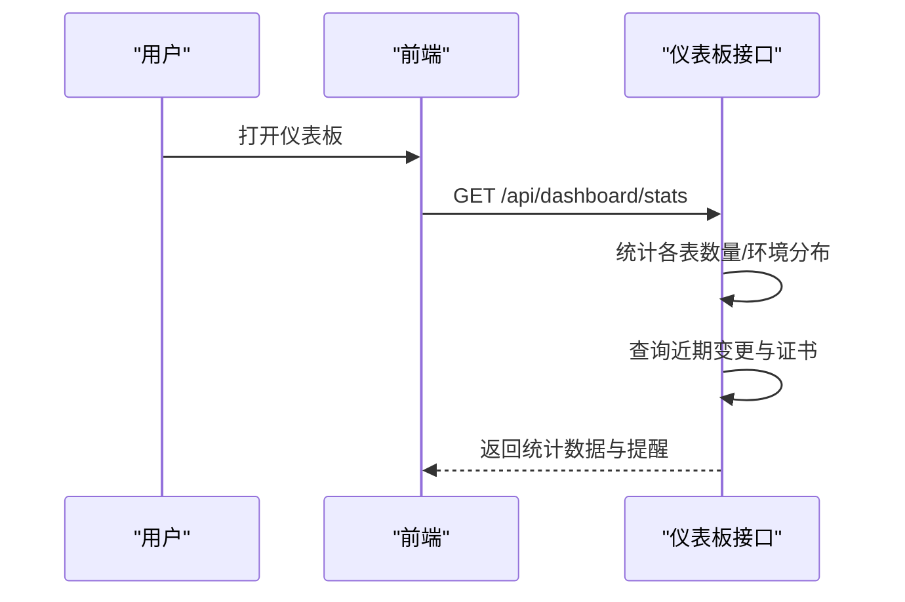

**图表来源**
- [backend/app/api/dashboard.py:20-91](file://backend/app/api/dashboard.py#L20-L91)

**章节来源**
- [backend/app/api/dashboard.py:20-91](file://backend/app/api/dashboard.py#L20-L91)

### 定时任务与脚本执行
- 核心功能
  - 任务管理：创建、更新、删除、启停、手动执行、查看日志。
  - 脚本上传：支持 Python/Shell/SQL 文件，自动保存至上传目录。
  - 调度集成：与调度器对接，动态添加/移除任务。
- 典型流程
  - 运维工程师编写脚本，配置 Cron 表达式，创建任务并启用；必要时手动触发或查看日志。
- 数据流
  - 前端 -> 任务接口 -> 文件系统/数据库/调度器。

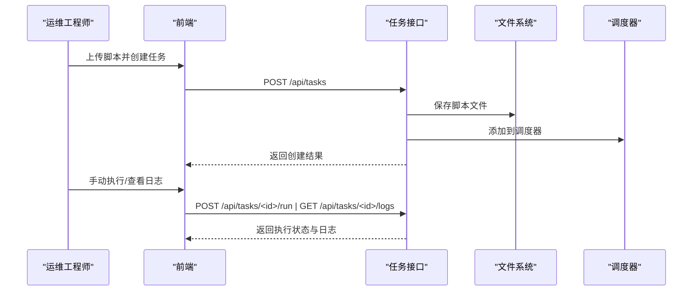

**图表来源**
- [backend/app/api/tasks.py:63-458](file://backend/app/api/tasks.py#L63-L458)

**章节来源**
- [backend/app/api/tasks.py:33-458](file://backend/app/api/tasks.py#L33-L458)

### 用户管理（管理员）
- 核心功能
  - 用户全量查询、创建、更新、删除、重置密码。
  - 仅管理员可操作，且禁止自我删除。
- 典型流程
  - 管理员在“用户管理”页面维护账号与角色。
- 数据流
  - 前端 -> 用户接口 -> 用户模型 -> 数据库。

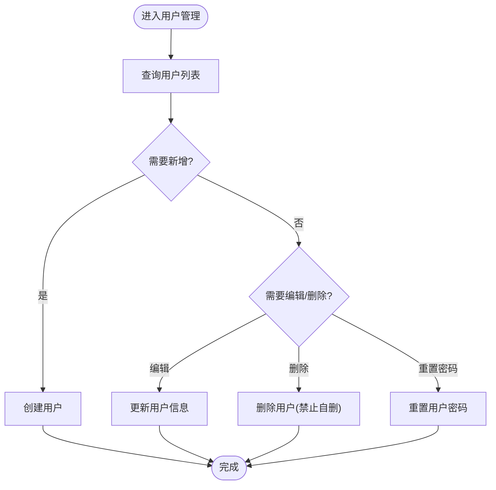

**图表来源**
- [backend/app/api/users.py:17-268](file://backend/app/api/users.py#L17-L268)
- [backend/app/models/user.py:8-183](file://backend/app/models/user.py#L8-L183)

**章节来源**
- [backend/app/api/users.py:17-268](file://backend/app/api/users.py#L17-L268)
- [backend/app/models/user.py:8-183](file://backend/app/models/user.py#L8-L183)

## 依赖关系分析
- 权限与认证
  - 所有业务接口均依赖装饰器进行 JWT 校验与角色校验。
  - 认证接口依赖用户模型进行用户查询与密码校验。
- 前端路由与权限
  - 路由守卫根据 token 与用户角色控制页面访问；管理员专属页面需额外校验。
- 配置中心
  - 后端运行配置、数据库连接、上传目录、最大文件大小等集中管理。
- 模块耦合
  - 业务模块相对独立，通过统一装饰器与配置中心耦合度低，便于扩展与替换。

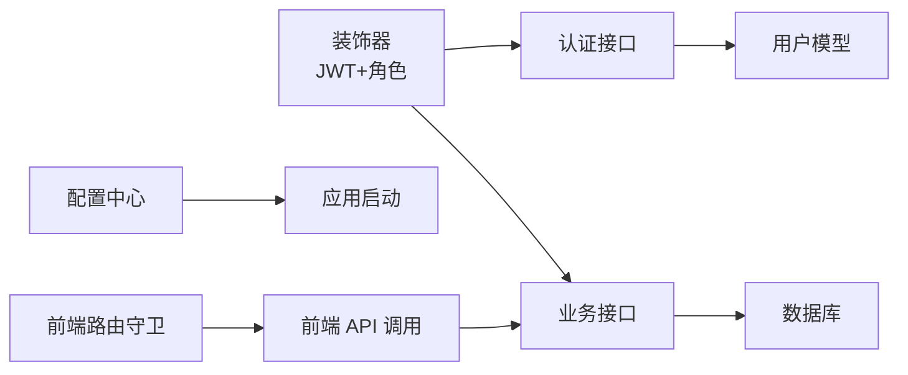

**图表来源**
- [backend/app/utils/decorators.py:9-95](file://backend/app/utils/decorators.py#L9-L95)
- [backend/app/api/auth.py:14-184](file://backend/app/api/auth.py#L14-L184)
- [backend/app/models/user.py:1-183](file://backend/app/models/user.py#L1-183)
- [backend/app/config.py:1-21](file://backend/app/config.py#L1-L21)
- [frontend/src/router/index.js:35-61](file://frontend/src/router/index.js#L35-L61)

**章节来源**
- [backend/app/utils/decorators.py:9-95](file://backend/app/utils/decorators.py#L9-L95)
- [frontend/src/router/index.js:35-61](file://frontend/src/router/index.js#L35-L61)
- [backend/app/config.py:1-21](file://backend/app/config.py#L1-L21)

## 性能考虑
- 分页与查询优化
  - 列表接口普遍支持分页与条件过滤，避免一次性加载大量数据。
  - 关联查询（服务与服务器）使用 JOIN，注意索引与字段选择。
- 缓存与调度
  - 仪表板聚合查询可考虑缓存热点数据，降低数据库压力。
  - 定时任务执行采用异步线程，避免阻塞主请求。
- 文件上传
  - 上传目录与最大文件大小限制，防止异常文件占用磁盘。
- 安全
  - JWT 过期时间可控，生产环境建议缩短并启用刷新机制。
  - 密码使用哈希存储，接口输入参数严格校验。

[本节为通用指导，无需特定文件引用]

## 故障排查指南
- 认证失败
  - 检查请求头是否包含有效的 Bearer token；确认 token 未过期。
  - 若返回“缺少认证信息/认证格式错误/Token 无效或已过期”，核对前端存储与后端密钥配置。
- 权限不足
  - 确认用户角色是否满足接口所需角色；管理员专属页面需确保角色为 admin。
- 数据库异常
  - 操作失败时查看后端回滚逻辑与错误响应；检查数据库连接配置。
- 任务执行问题
  - 确认脚本文件存在且可执行；查看任务日志定位错误输出。
- 前端路由跳转异常
  - 检查本地存储 token 与用户信息；确认路由守卫逻辑与 meta 标记。

**章节来源**
- [backend/app/utils/decorators.py:20-57](file://backend/app/utils/decorators.py#L20-L57)
- [backend/app/api/tasks.py:312-420](file://backend/app/api/tasks.py#L312-L420)
- [frontend/src/router/index.js:35-61](file://frontend/src/router/index.js#L35-L61)

## 结论
该平台以清晰的模块边界与统一的鉴权体系支撑运维日常：认证与权限保障安全，服务器/服务/应用/证书管理覆盖基础设施与资产，仪表板提供全局视图，定时任务提升自动化水平，用户管理完善组织治理。通过路由守卫与装饰器实现前后端一致的权限控制，具备良好的扩展性与定制化空间。

[本节为总结，无需特定文件引用]

## 附录

### 功能模块导航图（前端路由）
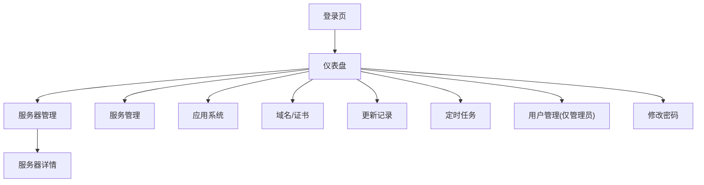

**图表来源**
- [frontend/src/router/index.js:3-27](file://frontend/src/router/index.js#L3-L27)

### 面向角色的权限与使用方式
- 管理员
  - 权限：用户管理、用户重置密码、所有资源的增删改查。
  - 使用：维护组织账号、分配角色、监督系统运行。
- 运维工程师
  - 权限：服务器/服务/应用/证书/任务的增删改查。
  - 使用：日常运维、服务上线、证书续期、任务编排。
- 普通用户
  - 权限：仅能查看与修改自身信息。
  - 使用：登录系统、查看仪表板、按需使用受控功能。

**章节来源**
- [backend/app/api/users.py:17-268](file://backend/app/api/users.py#L17-L268)
- [backend/app/utils/decorators.py:59-95](file://backend/app/utils/decorators.py#L59-L95)
- [frontend/src/router/index.js:48-54](file://frontend/src/router/index.js#L48-L54)

### 扩展性与定制化建议
- 模块扩展
  - 新增业务模块时，遵循现有蓝图命名与装饰器使用规范，保持一致的鉴权与错误处理风格。
- 配置管理
  - 通过环境变量集中管理密钥、数据库与上传目录，便于多环境部署。
- 安全加固
  - 引入刷新令牌、速率限制、敏感字段脱敏、审计日志等增强措施。
- 前端定制
  - 基于路由元信息与 Pinia 状态，灵活控制菜单显隐与按钮权限。

**章节来源**
- [backend/app/config.py:1-21](file://backend/app/config.py#L1-L21)
- [frontend/src/router/index.js:35-61](file://frontend/src/router/index.js#L35-L61)
- [frontend/src/stores/user.js:1-41](file://frontend/src/stores/user.js#L1-L41)