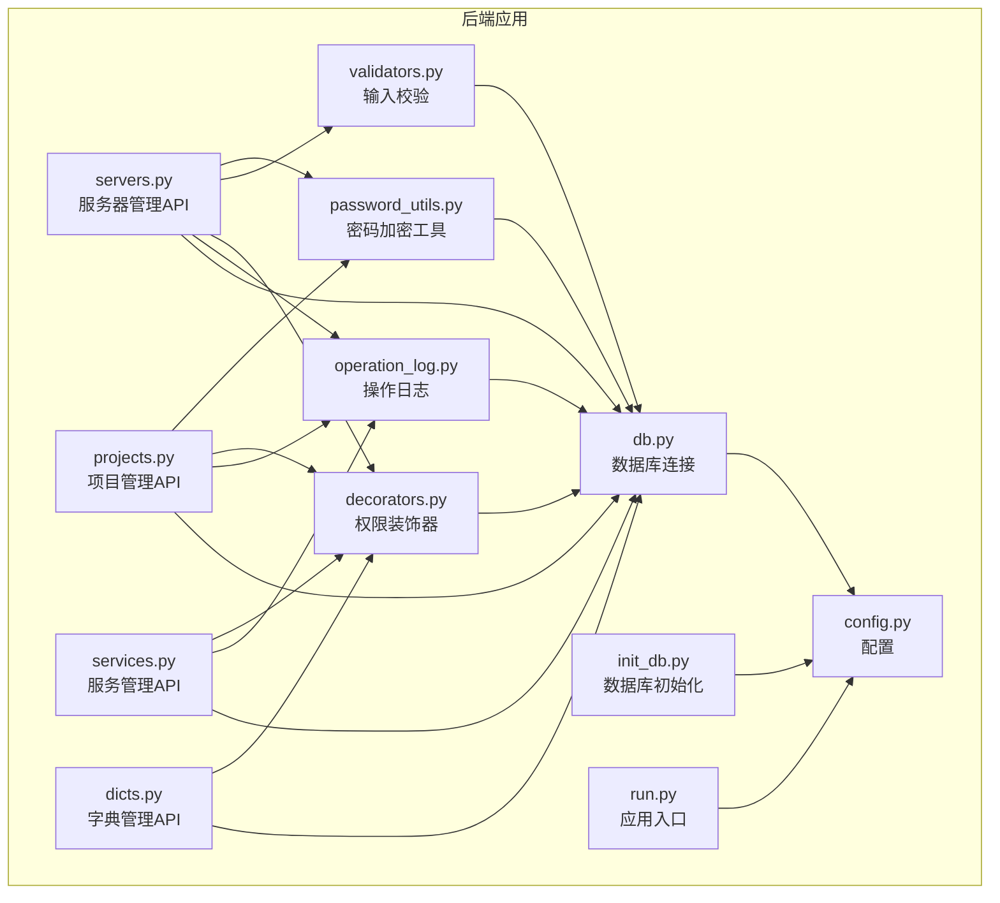
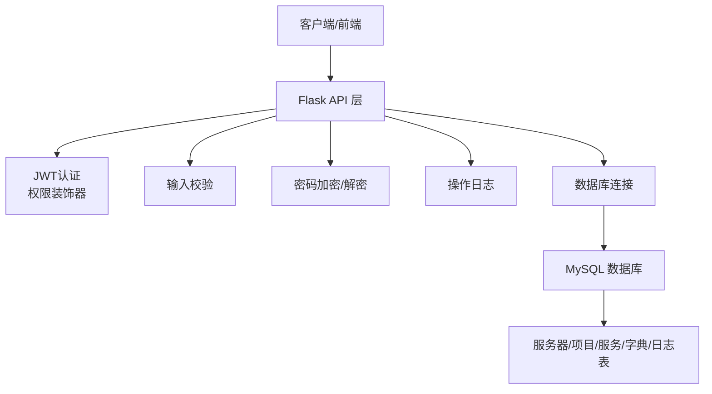
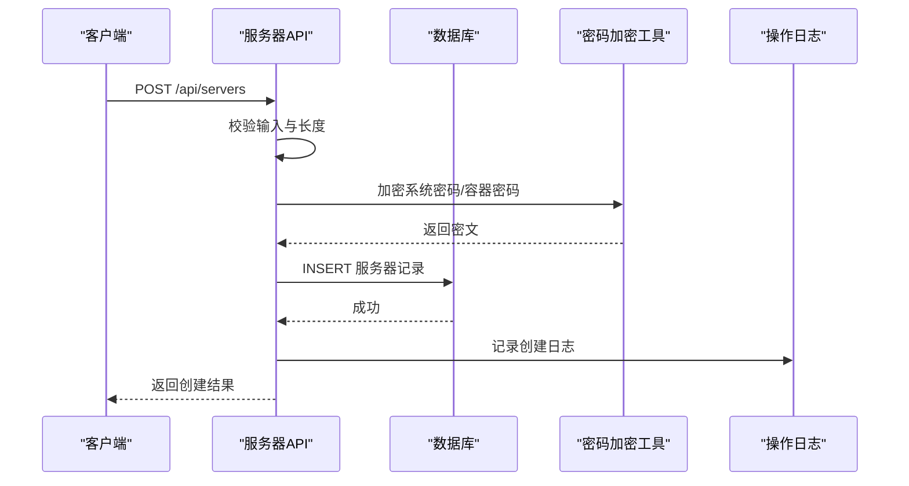
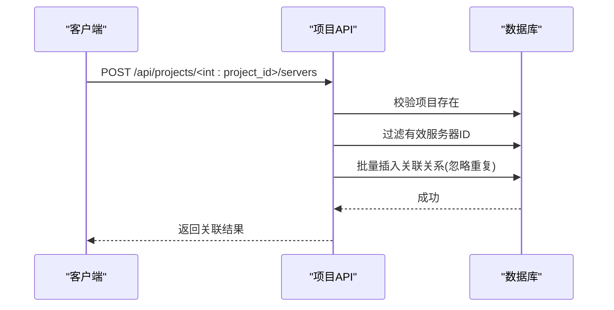
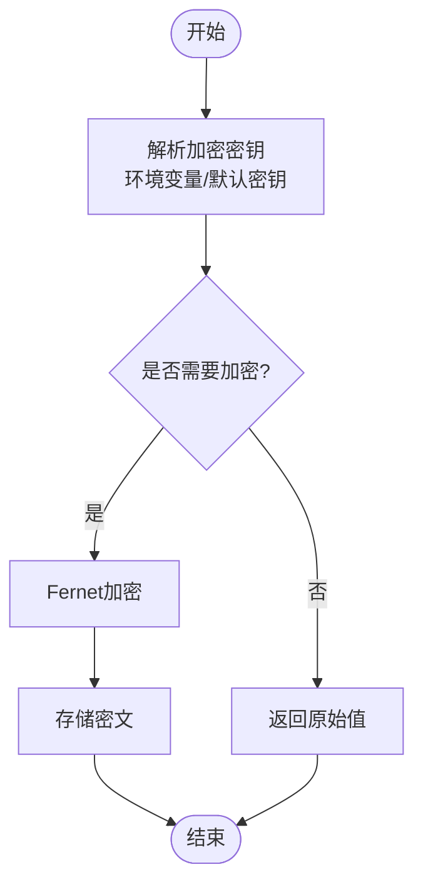
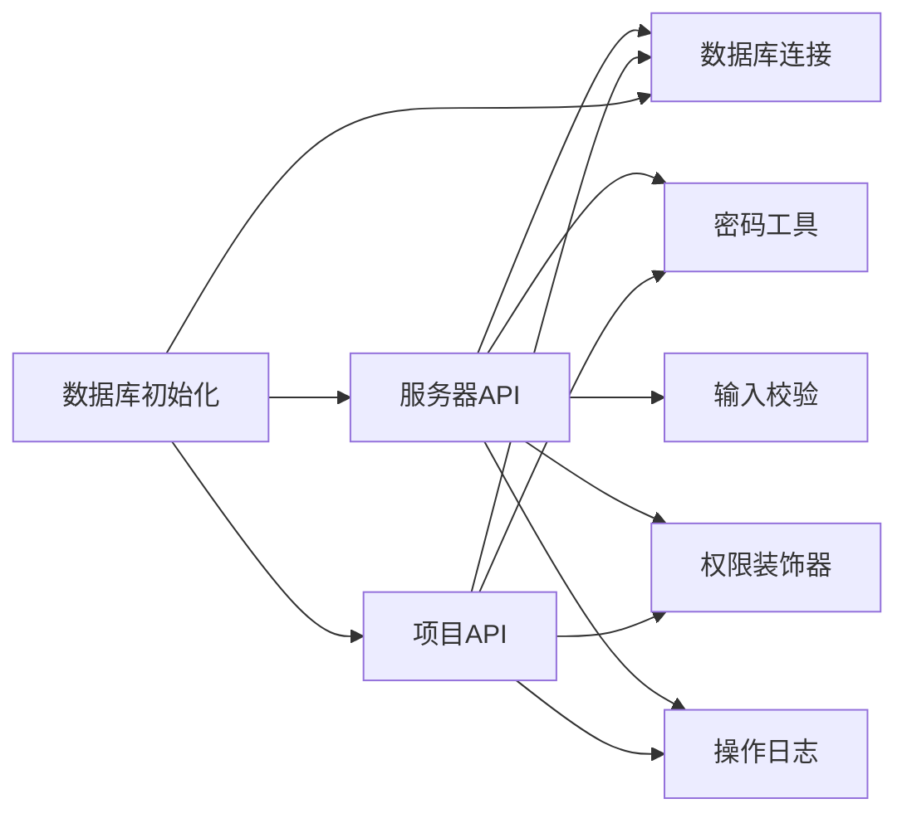

# 多环境服务器管理

<cite>
**本文档引用的文件**
- [servers.py](file://backend/app/api/servers.py)
- [projects.py](file://backend/app/api/projects.py)
- [password_utils.py](file://backend/app/utils/password_utils.py)
- [validators.py](file://backend/app/utils/validators.py)
- [decorators.py](file://backend/app/utils/decorators.py)
- [operation_log.py](file://backend/app/utils/operation_log.py)
- [db.py](file://backend/app/utils/db.py)
- [config.py](file://backend/app/config.py)
- [init_db.py](file://backend/init_db.py)
- [services.py](file://backend/app/api/services.py)
- [dicts.py](file://backend/app/api/dicts.py)
- [run.py](file://backend/run.py)
</cite>

## 目录
1. [简介](#简介)
2. [项目结构](#项目结构)
3. [核心组件](#核心组件)
4. [架构总览](#架构总览)
5. [详细组件分析](#详细组件分析)
6. [依赖关系分析](#依赖关系分析)
7. [性能考虑](#性能考虑)
8. [故障排查指南](#故障排查指南)
9. [结论](#结论)
10. [附录](#附录)

## 简介
本文件面向OPS平台的多环境服务器管理功能，系统化阐述平台如何统一管理开发、测试、生产等多环境服务器，涵盖服务器台账管理、环境类型分类、平台信息管理、IP地址管理、资源配置管理、密码加密存储机制、服务器与项目的关联管理，以及服务器创建、更新、删除的完整流程。文档还提供最佳实践建议（命名规范、资源配置建议、安全策略）与可视化图示，帮助技术与非技术读者快速理解与使用。

## 项目结构
后端采用Flask微服务架构，API按功能模块划分，工具类集中在utils目录，数据库初始化脚本负责表结构与默认数据创建。核心模块包括：
- 服务器管理API：提供服务器的增删改查、关联项目、详情查询、选项列表等能力
- 项目管理API：提供项目管理、项目与服务器关联、项目详情聚合查询等能力
- 工具模块：密码加密、输入校验、权限装饰器、操作日志、数据库连接等
- 数据库初始化：创建表结构、默认字典项、外键约束与索引

**图表来源**
- [servers.py:1-604](file://backend/app/api/servers.py#L1-L604)
- [projects.py:1-547](file://backend/app/api/projects.py#L1-L547)
- [services.py:1-210](file://backend/app/api/services.py#L1-L210)
- [dicts.py:1-263](file://backend/app/api/dicts.py#L1-L263)
- [password_utils.py:1-133](file://backend/app/utils/password_utils.py#L1-L133)
- [validators.py:1-151](file://backend/app/utils/validators.py#L1-L151)
- [decorators.py:1-214](file://backend/app/utils/decorators.py#L1-L214)
- [operation_log.py:1-173](file://backend/app/utils/operation_log.py#L1-L173)
- [db.py:1-80](file://backend/app/utils/db.py#L1-L80)
- [config.py:1-58](file://backend/app/config.py#L1-L58)
- [init_db.py:1-431](file://backend/init_db.py#L1-L431)
- [run.py:1-8](file://backend/run.py#L1-L8)

**章节来源**
- [servers.py:1-604](file://backend/app/api/servers.py#L1-L604)
- [projects.py:1-547](file://backend/app/api/projects.py#L1-L547)
- [init_db.py:1-431](file://backend/init_db.py#L1-L431)

## 核心组件
- 服务器管理API：提供服务器列表查询、详情查询、创建、更新、删除、选项列表、按项目筛选等能力；支持环境类型、平台、主机名/IP模糊搜索与分页；密码字段在入库加密、出库解密。
- 项目管理API：提供项目列表、详情、创建、更新、删除、项目与服务器批量关联/解除关联等能力；详情聚合返回服务器、服务、域名、证书、账号等资源统计与明细。
- 密码加密工具：基于Fernet对称加密，支持从环境变量加载密钥；提供加密/解密函数，用于服务器密码、Docker密码等敏感信息的安全存储与必要时的解密展示。
- 输入校验工具：提供IP、主机名、URL、端口、域名、用户名、邮箱、整数、字符串长度等校验方法，贯穿服务器与项目创建/更新流程。
- 权限装饰器：提供JWT认证、角色权限、模块访问权限三重保障，确保服务器管理API的调用安全。
- 操作日志：统一记录操作用户、模块、动作、目标、详情、客户端IP与UA等信息，便于审计与追踪。
- 数据库连接：封装MySQL连接、连接池缓存、异常处理与密码脱敏日志输出。
- 配置：集中管理数据库、JWT、CORS、定时任务等配置项。
- 数据库初始化：创建服务器、项目、服务、字典、操作日志等表，插入默认字典项与外键约束。

**章节来源**
- [servers.py:14-604](file://backend/app/api/servers.py#L14-L604)
- [projects.py:13-547](file://backend/app/api/projects.py#L13-L547)
- [password_utils.py:96-133](file://backend/app/utils/password_utils.py#L96-L133)
- [validators.py:6-151](file://backend/app/utils/validators.py#L6-L151)
- [decorators.py:26-214](file://backend/app/utils/decorators.py#L26-L214)
- [operation_log.py:49-173](file://backend/app/utils/operation_log.py#L49-L173)
- [db.py:43-80](file://backend/app/utils/db.py#L43-L80)
- [config.py:10-58](file://backend/app/config.py#L10-L58)
- [init_db.py:52-172](file://backend/init_db.py#L52-L172)

## 架构总览
平台采用“API层-工具层-数据层”的分层架构。API层负责对外暴露REST接口；工具层提供认证、权限、校验、加密、日志、数据库连接等通用能力；数据层由MySQL承载，包含服务器台账、项目管理、服务清单、字典表、操作日志等核心表。

**图表来源**
- [run.py:1-8](file://backend/run.py#L1-L8)
- [decorators.py:26-214](file://backend/app/utils/decorators.py#L26-L214)
- [validators.py:6-151](file://backend/app/utils/validators.py#L6-L151)
- [password_utils.py:96-133](file://backend/app/utils/password_utils.py#L96-L133)
- [operation_log.py:49-173](file://backend/app/utils/operation_log.py#L49-L173)
- [db.py:43-80](file://backend/app/utils/db.py#L43-L80)
- [init_db.py:52-172](file://backend/init_db.py#L52-L172)

## 详细组件分析

### 服务器管理API
- 功能概览
  - 列表查询：支持按环境类型、平台、项目ID、关键词搜索，分页控制
  - 详情查询：返回服务器详情、关联服务列表、关联项目列表；密码字段解密返回
  - 选项列表：供下拉选择的服务器简要信息
  - 创建：输入校验、敏感信息加密、事务提交、操作日志记录
  - 更新：字段白名单、输入校验、敏感信息加密、项目关联更新（先删后增）
  - 删除：先删除关联服务，再删除服务器，事务回滚保护
- 数据模型要点
  - 服务器表包含环境类型、平台、主机名、内网/映射/公网IP、CPU/内存/磁盘、用途、系统账户/密码、Docker账户/密码、证书路径、备注等字段
  - 项目-服务器为多对多关联，通过中间表维护
- 安全与合规
  - 敏感字段加密存储，解密仅在必要时进行
  - 权限控制：JWT认证+角色+模块权限
  - 操作日志记录所有关键操作

**图表来源**
- [servers.py:212-378](file://backend/app/api/servers.py#L212-L378)
- [password_utils.py:96-133](file://backend/app/utils/password_utils.py#L96-L133)
- [operation_log.py:49-119](file://backend/app/utils/operation_log.py#L49-L119)

**章节来源**
- [servers.py:14-604](file://backend/app/api/servers.py#L14-L604)

### 项目管理API
- 功能概览
  - 项目列表：支持按状态、关键词搜索，分页与资源计数
  - 项目详情：聚合返回服务器、服务、域名、证书、账号等明细
  - 项目CRUD：名称唯一性校验、更新字段白名单、外键级联删除
  - 项目-服务器关联：批量关联/单个解除，忽略重复
- 数据模型要点
  - 项目表与服务器通过中间表建立多对多关系
  - 服务、域名、证书、账号表均支持挂靠项目ID字段（初始化脚本已添加）

**图表来源**
- [projects.py:409-490](file://backend/app/api/projects.py#L409-L490)

**章节来源**
- [projects.py:13-547](file://backend/app/api/projects.py#L13-L547)

### 密码加密与解密机制
- 加密算法
  - 使用Fernet对称加密，支持标准32字节密钥或从任意字符串派生
  - 开发环境提供默认密钥，生产环境必须通过环境变量设置密钥
- 加密流程
  - 创建/更新服务器时，系统密码与Docker密码经加密后入库
  - 查询详情或列表时，若存在密码字段则进行解密返回
- 安全建议
  - 生产环境务必设置DATA_ENCRYPTION_KEY，避免使用默认密钥
  - 密钥轮换需谨慎，确保历史数据仍可解密

**图表来源**
- [password_utils.py:21-52](file://backend/app/utils/password_utils.py#L21-L52)
- [password_utils.py:96-133](file://backend/app/utils/password_utils.py#L96-L133)

**章节来源**
- [password_utils.py:1-133](file://backend/app/utils/password_utils.py#L1-L133)

### 输入校验与安全策略
- 校验范围
  - IP/主机名/URL/端口/域名/用户名/邮箱/整数/字符串长度等
- 安全策略
  - 服务器创建/更新严格限制字段白名单，防止SQL注入
  - 密码字段强制加密存储
  - 操作日志记录关键操作，便于审计

**章节来源**
- [validators.py:6-151](file://backend/app/utils/validators.py#L6-L151)
- [servers.py:395-527](file://backend/app/api/servers.py#L395-L527)

### 权限控制与操作日志
- 权限控制
  - JWT认证：校验令牌有效性、用户状态、密码变更后令牌失效
  - 角色权限：admin可绕过模块权限，其他角色需具备模块授权
  - 模块权限：通过角色-模块授权表控制各模块访问
- 操作日志
  - 统一记录模块、动作、目标、详情、IP、UA、时间戳
  - 登录/登出专用日志接口

**章节来源**
- [decorators.py:26-214](file://backend/app/utils/decorators.py#L26-L214)
- [operation_log.py:49-173](file://backend/app/utils/operation_log.py#L49-L173)

## 依赖关系分析
- 服务器API依赖
  - 工具：密码加密、输入校验、权限装饰器、操作日志、数据库连接
  - 数据：服务器表、项目-服务器关联表、服务表
- 项目API依赖
  - 工具：密码解密（账号密码）、权限装饰器、操作日志、数据库连接
  - 数据：项目表、服务器表、服务表、域名表、证书表、账号表
- 初始化脚本
  - 创建所有核心表、默认字典项、外键与索引
  - 为部分表补充项目ID字段（兼容历史数据）

**图表来源**
- [servers.py:1-11](file://backend/app/api/servers.py#L1-L11)
- [projects.py:1-10](file://backend/app/api/projects.py#L1-L10)
- [init_db.py:52-172](file://backend/init_db.py#L52-L172)

**章节来源**
- [servers.py:1-11](file://backend/app/api/servers.py#L1-L11)
- [projects.py:1-10](file://backend/app/api/projects.py#L1-L10)
- [init_db.py:52-172](file://backend/init_db.py#L52-L172)

## 性能考虑
- 查询优化
  - 服务器列表查询使用LEFT JOIN聚合项目名称/ID，避免N+1查询
  - 按环境类型、内网IP建立索引，提升过滤效率
- 分页与限制
  - 默认每页10条，最大100条，防止超大结果集
- 缓存与连接
  - 数据库连接使用Flask g上下文缓存，减少连接开销
- 日志与审计
  - 操作日志异步写入，避免阻塞主流程

[本节为通用性能建议，无需特定文件引用]

## 故障排查指南
- 数据库连接失败
  - 检查DB_HOST/DB_PORT/DB_USER/DB_PASSWORD/DB_NAME配置
  - 查看启动日志中脱敏后的连接参数
- 密钥相关错误
  - 生产环境未设置DATA_ENCRYPTION_KEY导致加密/解密失败
  - 开发环境可通过调试开关使用默认密钥（不推荐）
- 权限不足
  - 确认JWT令牌有效、用户状态正常、密码未在签发后修改
  - 检查角色是否具备模块访问权限
- 服务器/项目关联异常
  - 批量关联时检查服务器ID有效性与重复插入
  - 解除关联时确认记录存在

**章节来源**
- [db.py:28-80](file://backend/app/utils/db.py#L28-L80)
- [password_utils.py:21-32](file://backend/app/utils/password_utils.py#L21-L32)
- [decorators.py:26-123](file://backend/app/utils/decorators.py#L26-L123)
- [projects.py:409-490](file://backend/app/api/projects.py#L409-L490)

## 结论
OPS平台通过清晰的模块划分与完善的工具链，实现了多环境服务器的统一管理。服务器台账、环境类型与平台字典、IP与资源配置、密码加密存储、项目关联管理等能力形成完整的生命周期闭环。结合严格的权限控制与操作日志，平台在保证安全性的同时提供了良好的可运维性与可扩展性。

[本节为总结性内容，无需特定文件引用]

## 附录

### 最佳实践建议
- 命名规范
  - 服务器主机名遵循标准格式，避免连字符开头/结尾
  - 环境类型与平台名称统一使用字典维护，避免拼写差异
- 资源配置建议
  - CPU/内存/磁盘信息建议标准化单位与格式，便于横向对比
  - IP地址严格校验，公网/内网/映射IP分别标注
- 安全策略
  - 生产环境必须设置DATA_ENCRYPTION_KEY，定期轮换
  - 严格控制模块访问权限，最小授权原则
  - 定期审计操作日志，关注异常登录与高危操作

[本节为通用建议，无需特定文件引用]

### 数据模型概览

```mermaid
erDiagram
SERVERS {
int id PK
varchar env_type
varchar platform
varchar hostname
varchar inner_ip
varchar mapped_ip
varchar public_ip
varchar cpu
varchar memory
varchar sys_disk
varchar data_disk
varchar purpose
varchar os_user
varchar os_password
varchar docker_user
varchar docker_password
text remark
varchar cert_path
}
PROJECTS {
int id PK
varchar project_name UK
text description
varchar owner
varchar status
text remark
}
PROJECT_SERVERS {
int id PK
int project_id FK
int server_id FK
}
SERVICES {
int id PK
int server_id FK
varchar category
varchar service_name
varchar version
varchar inner_port
varchar mapped_port
text remark
}
DICT_ENV_TYPES {
int id PK
varchar name UK
int sort_order
}
DICT_PLATFORMS {
int id PK
varchar name UK
int sort_order
}
OPERATION_LOGS {
int id PK
int user_id
varchar username
varchar module
varchar action
int target_id
varchar target_name
text detail
varchar ip
varchar user_agent
}
SERVERS }o--|| PROJECT_SERVERS : "关联"
PROJECTS }o--|| PROJECT_SERVERS : "关联"
SERVERS ||--o{ SERVICES : "拥有"
```

**图表来源**
- [init_db.py:52-128](file://backend/init_db.py#L52-L128)
- [init_db.py:240-259](file://backend/init_db.py#L240-L259)