# 应用和服务管理

<cite>
**本文引用的文件**
- [apps.py](file://backend/app/api/apps.py)
- [services.py](file://backend/app/api/services.py)
- [servers.py](file://backend/app/api/servers.py)
- [projects.py](file://backend/app/api/projects.py)
- [dashboard.py](file://backend/app/api/dashboard.py)
- [db.py](file://backend/app/utils/db.py)
- [password_utils.py](file://backend/app/utils/password_utils.py)
- [validators.py](file://backend/app/utils/validators.py)
- [decorators.py](file://backend/app/utils/decorators.py)
- [config.py](file://backend/app/config.py)
- [init_db.py](file://backend/init_db.py)
- [run.py](file://backend/run.py)
- [docker-compose.yml](file://docker-compose.yml)
- [operation_log.py](file://backend/app/utils/operation_log.py)
- [user.py](file://backend/app/models/user.py)
</cite>

## 目录
1. [简介](#简介)
2. [项目结构](#项目结构)
3. [核心组件](#核心组件)
4. [架构总览](#架构总览)
5. [详细组件分析](#详细组件分析)
6. [依赖分析](#依赖分析)
7. [性能考虑](#性能考虑)
8. [故障排除指南](#故障排除指南)
9. [结论](#结论)
10. [附录](#附录)

## 简介
本文件面向OPS平台的应用与服务管理功能，围绕“应用系统”“服务”“服务器”“项目”四大实体，系统化梳理其管理机制与实现要点，包括：
- 应用系统管理：创建、配置、版本与访问信息维护
- 服务管理：服务分类、版本、端口映射、与服务器绑定
- 服务器管理：资产登记、项目绑定、敏感信息加密存储
- 项目管理：资源聚合、统计与关联关系维护
- 仪表盘：统计与到期提醒
- 权限与审计：JWT认证、模块权限、操作日志
- 部署与高可用：服务注册、负载均衡、故障转移思路
- 实际部署案例与故障排除

## 项目结构
后端采用Flask微服务风格，API集中在app/api目录，通用工具与模型位于app/utils与app/models，数据库初始化脚本位于根目录，Docker编排位于仓库根目录。

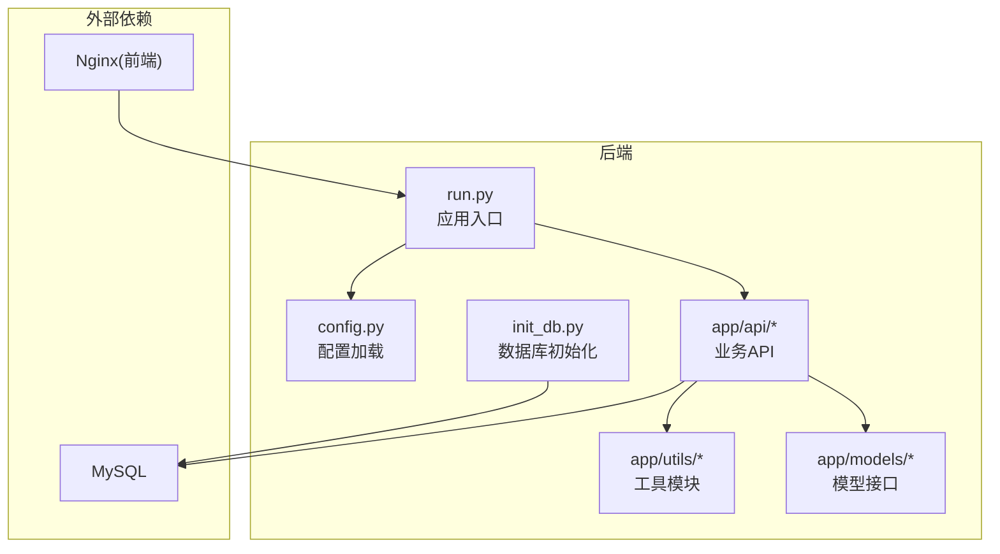

图表来源
- [run.py:1-8](file://backend/run.py#L1-L8)
- [config.py:1-58](file://backend/app/config.py#L1-L58)
- [init_db.py:1-431](file://backend/init_db.py#L1-L431)
- [docker-compose.yml:1-108](file://docker-compose.yml#L1-L108)

章节来源
- [run.py:1-8](file://backend/run.py#L1-L8)
- [config.py:1-58](file://backend/app/config.py#L1-L58)
- [docker-compose.yml:1-108](file://docker-compose.yml#L1-L108)

## 核心组件
- 应用系统管理API：负责应用的增删改查、输入校验、密码加密存储与解密返回、分页与搜索、操作日志记录
- 服务管理API：负责服务的增删改查、与服务器绑定、分页与搜索、项目维度聚合
- 服务器管理API：负责服务器台账、项目绑定、敏感信息加密存储、删除联动清理服务
- 项目管理API：负责项目生命周期、资源聚合统计、项目与服务器关联
- 仪表盘API：负责各类统计与即将到期提醒
- 权限与审计：JWT认证、角色与模块权限、操作日志
- 数据库工具：连接池封装、连接关闭、日志脱敏
- 加解密工具：bcrypt密码哈希、Fernet对称加密
- 校验工具：IP/主机名/URL/端口/字符串长度等
- 配置：环境变量驱动的配置加载
- 初始化：数据库表结构、默认字典、默认管理员与授权

章节来源
- [apps.py:1-348](file://backend/app/api/apps.py#L1-L348)
- [services.py:1-210](file://backend/app/api/services.py#L1-L210)
- [servers.py:1-604](file://backend/app/api/servers.py#L1-L604)
- [projects.py:1-547](file://backend/app/api/projects.py#L1-L547)
- [dashboard.py:1-166](file://backend/app/api/dashboard.py#L1-L166)
- [db.py:1-80](file://backend/app/utils/db.py#L1-L80)
- [password_utils.py:1-133](file://backend/app/utils/password_utils.py#L1-L133)
- [validators.py:1-151](file://backend/app/utils/validators.py#L1-L151)
- [decorators.py:1-214](file://backend/app/utils/decorators.py#L1-L214)
- [config.py:1-58](file://backend/app/config.py#L1-L58)
- [init_db.py:1-431](file://backend/init_db.py#L1-L431)
- [operation_log.py:1-173](file://backend/app/utils/operation_log.py#L1-L173)
- [user.py:1-162](file://backend/app/models/user.py#L1-L162)

## 架构总览
后端通过Blueprint组织API，统一使用装饰器进行JWT认证、角色与模块权限校验；数据库连接通过工具模块统一管理；敏感信息通过加密工具进行存储；操作日志贯穿各关键动作。

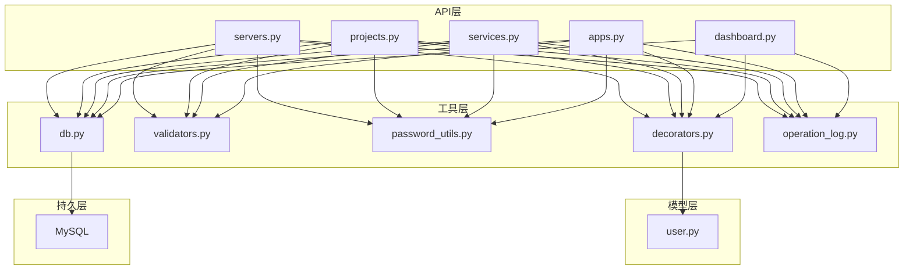

图表来源
- [servers.py:1-604](file://backend/app/api/servers.py#L1-L604)
- [projects.py:1-547](file://backend/app/api/projects.py#L1-L547)
- [services.py:1-210](file://backend/app/api/services.py#L1-L210)
- [apps.py:1-348](file://backend/app/api/apps.py#L1-L348)
- [dashboard.py:1-166](file://backend/app/api/dashboard.py#L1-L166)
- [decorators.py:1-214](file://backend/app/utils/decorators.py#L1-L214)
- [validators.py:1-151](file://backend/app/utils/validators.py#L1-L151)
- [password_utils.py:1-133](file://backend/app/utils/password_utils.py#L1-L133)
- [db.py:1-80](file://backend/app/utils/db.py#L1-L80)
- [operation_log.py:1-173](file://backend/app/utils/operation_log.py#L1-L173)
- [user.py:1-162](file://backend/app/models/user.py#L1-L162)

## 详细组件分析

### 应用系统管理（应用台账）
- 功能要点
  - 列表查询：支持关键词搜索（名称/单位/访问URL）、项目过滤、分页
  - 详情查询：返回应用信息，密码字段解密后返回
  - 创建：输入校验（名称、URL、用户名、密码、备注长度），密码加密存储
  - 更新：白名单字段更新，输入校验，密码加密处理
  - 删除：记录操作日志
- 安全与合规
  - 密码字段采用对称加密存储，返回时解密
  - 统一的输入长度与格式校验
- 日志与审计
  - 每次增删改均记录操作日志

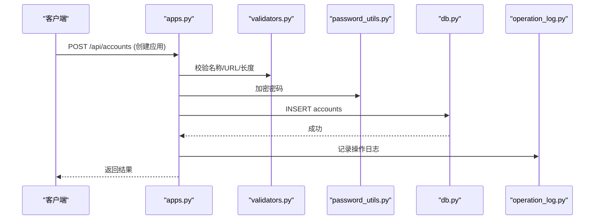

图表来源
- [apps.py:121-218](file://backend/app/api/apps.py#L121-L218)
- [validators.py:1-151](file://backend/app/utils/validators.py#L1-L151)
- [password_utils.py:96-133](file://backend/app/utils/password_utils.py#L96-L133)
- [db.py:43-80](file://backend/app/utils/db.py#L43-L80)
- [operation_log.py:49-119](file://backend/app/utils/operation_log.py#L49-L119)

章节来源
- [apps.py:1-348](file://backend/app/api/apps.py#L1-L348)

### 服务管理（服务清单）
- 功能要点
  - 列表查询：支持服务名/版本搜索、分类过滤、环境类型过滤、项目过滤、分页
  - 详情查询：返回服务及所属服务器信息（主机名、内网IP、映射IP、环境类型）
  - 创建/更新/删除：支持字段白名单更新，记录操作日志
- 关系与绑定
  - 服务与服务器一对多绑定，删除服务器会级联删除服务
  - 服务可归属项目，支持项目维度聚合

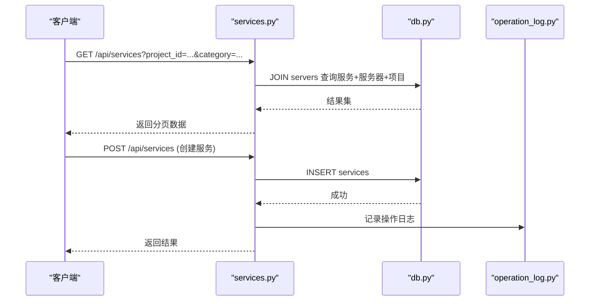

图表来源
- [services.py:12-90](file://backend/app/api/services.py#L12-L90)
- [services.py:92-130](file://backend/app/api/services.py#L92-L130)
- [db.py:43-80](file://backend/app/utils/db.py#L43-L80)
- [operation_log.py:49-119](file://backend/app/utils/operation_log.py#L49-L119)

章节来源
- [services.py:1-210](file://backend/app/api/services.py#L1-L210)

### 服务器管理（服务器台账）
- 功能要点
  - 列表查询：支持环境类型、平台、项目、搜索（主机名/IP/平台）、分页
  - 详情查询：返回服务器详情、关联服务列表、关联项目列表，敏感信息解密
  - 创建：输入校验（主机名、IP、字符串长度、证书路径），敏感信息加密存储
  - 更新：字段白名单更新，敏感信息加密处理，支持项目ID批量更新
  - 删除：先删除关联服务，再删除服务器，记录操作日志
- 项目绑定
  - 服务器与项目为多对多关系，通过中间表维护

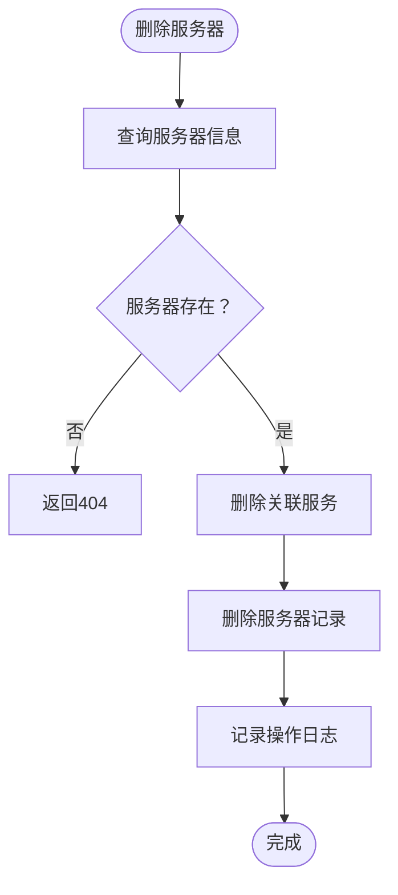

图表来源
- [servers.py:561-604](file://backend/app/api/servers.py#L561-L604)
- [operation_log.py:49-119](file://backend/app/utils/operation_log.py#L49-L119)

章节来源
- [servers.py:1-604](file://backend/app/api/servers.py#L1-L604)

### 项目管理（项目聚合）
- 功能要点
  - 列表查询：支持状态、搜索（项目名/负责人）、分页，返回各资源计数
  - 详情查询：聚合返回服务器、服务、域名、证书、账号列表
  - 创建/更新/删除：基本CRUD，删除级联中间表
  - 项目与服务器关联：批量添加/移除
- 资源统计
  - 通过子查询统计各资源数量，便于仪表盘展示

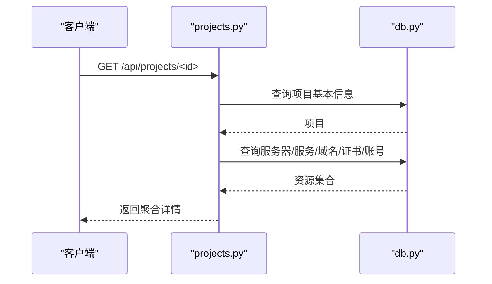

图表来源
- [projects.py:174-281](file://backend/app/api/projects.py#L174-L281)
- [db.py:43-80](file://backend/app/utils/db.py#L43-L80)

章节来源
- [projects.py:1-547](file://backend/app/api/projects.py#L1-L547)

### 仪表盘（统计与提醒）
- 统计指标：服务器、服务、应用、域名、证书、项目数量
- 到期提醒：证书与域名30天内到期提醒，按剩余天数排序
- 分布统计：按环境类型、服务分类、应用名称、项目分配统计

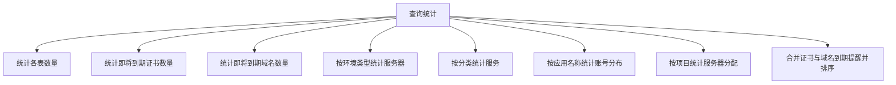

图表来源
- [dashboard.py:22-166](file://backend/app/api/dashboard.py#L22-L166)

章节来源
- [dashboard.py:1-166](file://backend/app/api/dashboard.py#L1-L166)

### 权限与审计
- JWT认证：校验令牌有效性、用户状态、密码变更时间
- 角色权限：admin直通，其他角色需检查模块授权
- 操作日志：记录模块、动作、目标、详情、IP、UA等

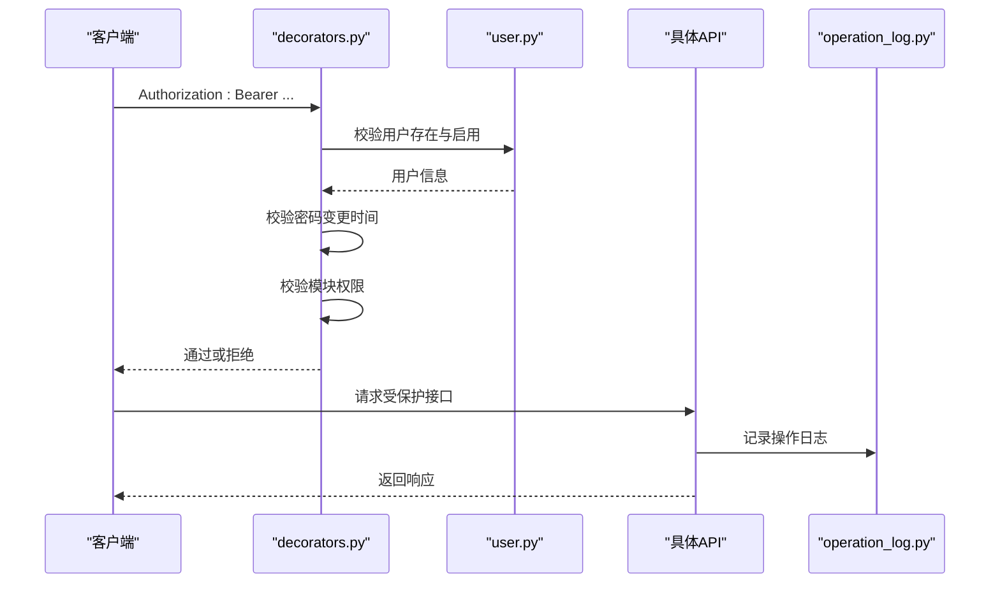

图表来源
- [decorators.py:26-214](file://backend/app/utils/decorators.py#L26-L214)
- [user.py:36-162](file://backend/app/models/user.py#L36-L162)
- [operation_log.py:49-173](file://backend/app/utils/operation_log.py#L49-L173)

章节来源
- [decorators.py:1-214](file://backend/app/utils/decorators.py#L1-L214)
- [operation_log.py:1-173](file://backend/app/utils/operation_log.py#L1-L173)
- [user.py:1-162](file://backend/app/models/user.py#L1-L162)

### 数据与安全
- 数据库连接：Flask应用上下文缓存，异常日志记录
- 敏感信息：bcrypt密码哈希、Fernet对称加密；生产环境必须配置密钥
- 输入校验：IP/主机名/URL/端口/字符串长度等

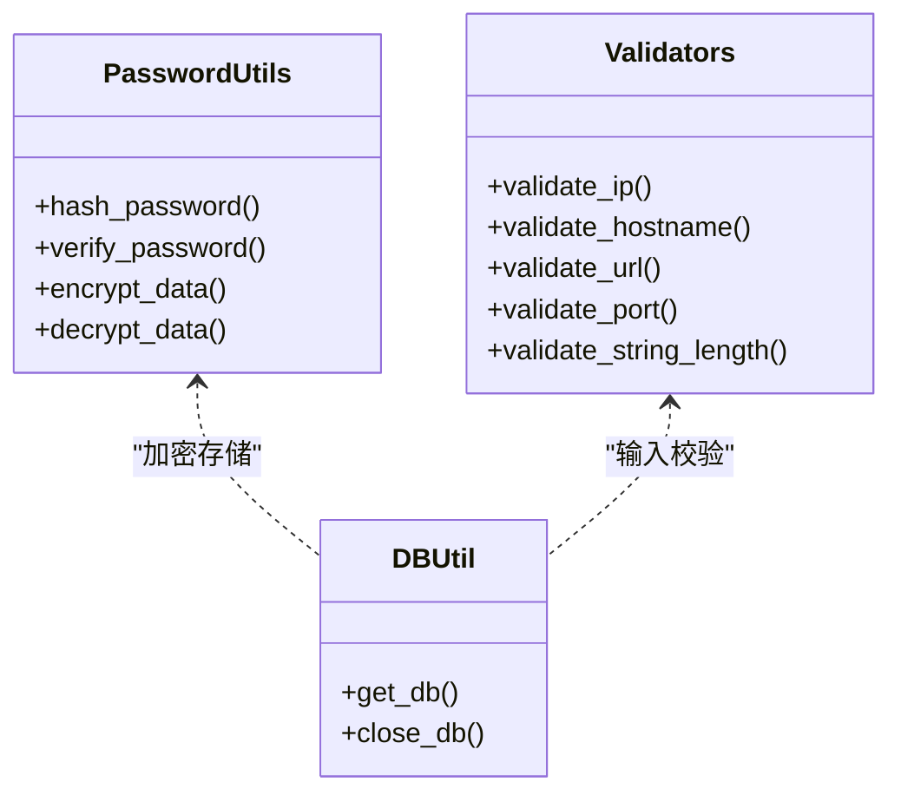

图表来源
- [password_utils.py:1-133](file://backend/app/utils/password_utils.py#L1-L133)
- [validators.py:1-151](file://backend/app/utils/validators.py#L1-L151)
- [db.py:1-80](file://backend/app/utils/db.py#L1-L80)

章节来源
- [password_utils.py:1-133](file://backend/app/utils/password_utils.py#L1-L133)
- [validators.py:1-151](file://backend/app/utils/validators.py#L1-L151)
- [db.py:1-80](file://backend/app/utils/db.py#L1-L80)

## 依赖分析
- 组件耦合
  - API层依赖工具层（校验、加密、日志、DB）
  - 权限装饰器依赖用户模型与角色模块授权
  - 数据库初始化脚本定义表结构与默认字典
- 外部依赖
  - MySQL：持久化存储
  - Nginx：静态资源与反向代理（前端）
- 循环依赖规避
  - 装饰器延迟导入模型，避免循环

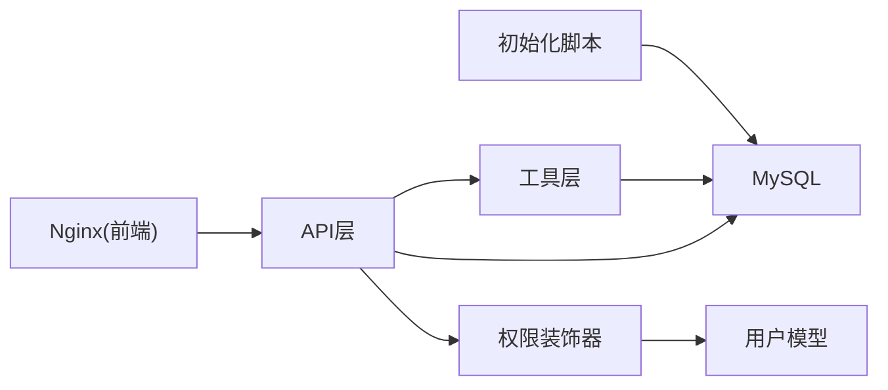

图表来源
- [init_db.py:1-431](file://backend/init_db.py#L1-L431)
- [docker-compose.yml:1-108](file://docker-compose.yml#L1-L108)

章节来源
- [init_db.py:1-431](file://backend/init_db.py#L1-L431)
- [docker-compose.yml:1-108](file://docker-compose.yml#L1-L108)

## 性能考虑
- 分页与索引
  - 列表查询均支持分页，SQL中使用LIMIT/OFFSET；相关字段建立索引（如env_type、inner_ip、project_name等）
- 连接管理
  - 数据库连接按请求缓存，避免频繁创建销毁
- 查询优化
  - 聚合统计使用子查询与GROUP BY，尽量减少不必要的JOIN
- 缓存与异步
  - 仪表盘统计可考虑Redis缓存热点数据，定时任务异步刷新

## 故障排除指南
- 数据库连接失败
  - 检查环境变量DB_HOST/DB_PORT/DB_USER/DB_PASSWORD/DB_NAME
  - 查看日志中脱敏后的连接信息
- JWT认证失败
  - 确认Authorization头格式为Bearer Token
  - 检查用户状态与密码变更时间
  - 确认模块权限是否授予
- 密码/证书解密失败
  - 生产环境必须设置DATA_ENCRYPTION_KEY
  - 开发环境可通过开关启用回退密钥（不安全）
- 服务器删除报错
  - 确认服务器是否存在，删除会级联清理服务
- 项目删除报错
  - 确认项目是否存在，删除会级联清理中间表

章节来源
- [db.py:28-80](file://backend/app/utils/db.py#L28-L80)
- [decorators.py:26-124](file://backend/app/utils/decorators.py#L26-L124)
- [password_utils.py:21-32](file://backend/app/utils/password_utils.py#L21-L32)
- [servers.py:561-604](file://backend/app/api/servers.py#L561-L604)
- [projects.py:362-406](file://backend/app/api/projects.py#L362-L406)

## 结论
OPS平台围绕“应用—服务—服务器—项目”构建了完整的资产管理与运维视图，通过严格的输入校验、敏感信息加密、JWT认证与模块授权、操作日志等手段保障安全性与可追溯性。结合仪表盘统计与到期提醒，形成闭环的运维管理能力。部署层面，Docker编排简化了环境搭建，生产环境需重点关注密钥与配置的安全设置。

## 附录

### 部署流程（概念性）
- 准备阶段
  - 设置环境变量（密钥、数据库、CORS、监控等）
  - 初始化数据库（执行初始化脚本）
- 启动服务
  - 启动MySQL容器
  - 启动后端容器（Flask），健康检查通过后对外提供服务
  - 启动Nginx容器作为前端与反向代理
- 配置高可用
  - 使用反向代理（Nginx）实现负载均衡与故障转移
  - 服务注册：后端健康检查通过后由代理接管流量
  - 存储：MySQL主从或集群（不在本仓库范围内）

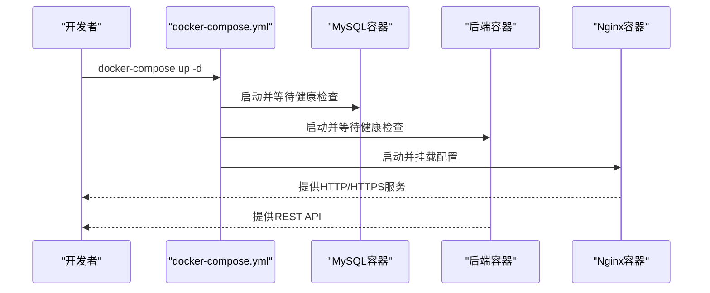

图表来源
- [docker-compose.yml:1-108](file://docker-compose.yml#L1-L108)

章节来源
- [docker-compose.yml:1-108](file://docker-compose.yml#L1-L108)

### 数据模型概览
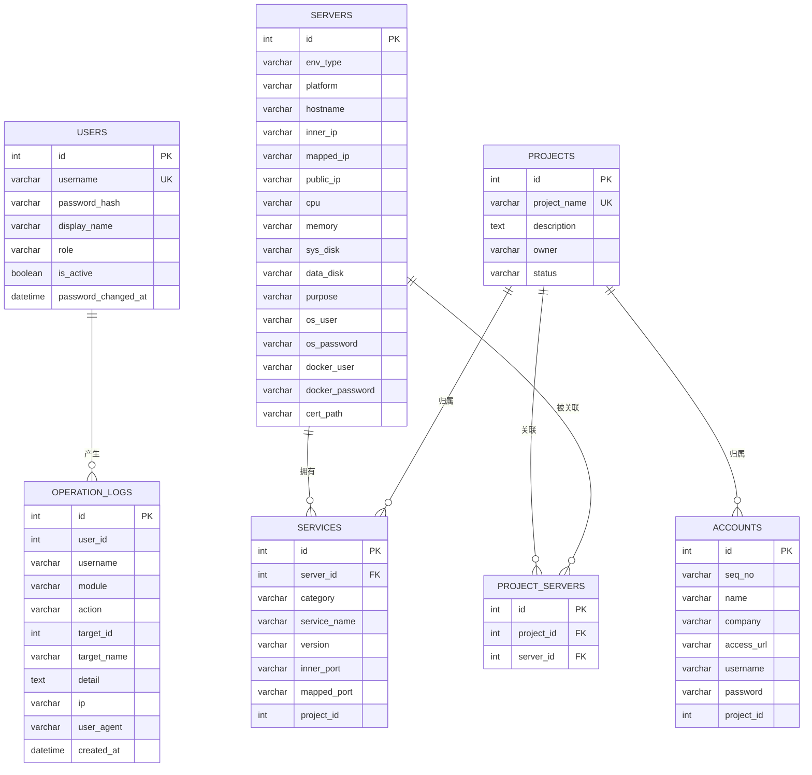

图表来源
- [init_db.py:35-189](file://backend/init_db.py#L35-L189)
- [init_db.py:194-259](file://backend/init_db.py#L194-L259)

章节来源
- [init_db.py:1-431](file://backend/init_db.py#L1-L431)