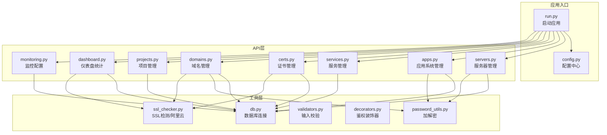
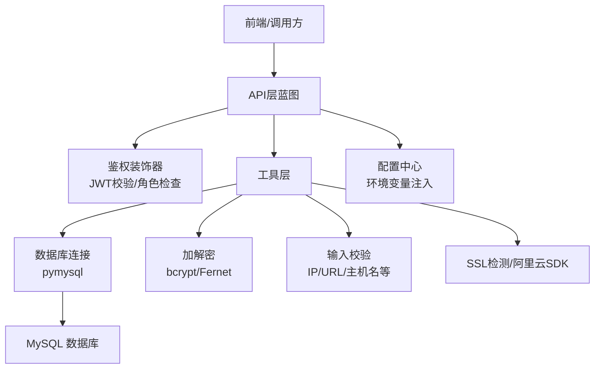
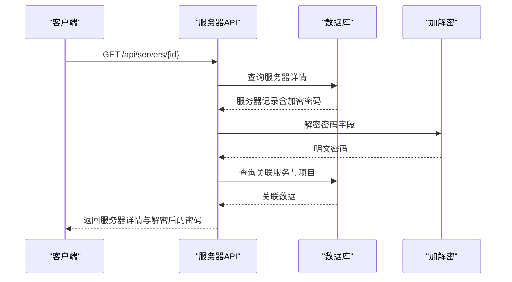
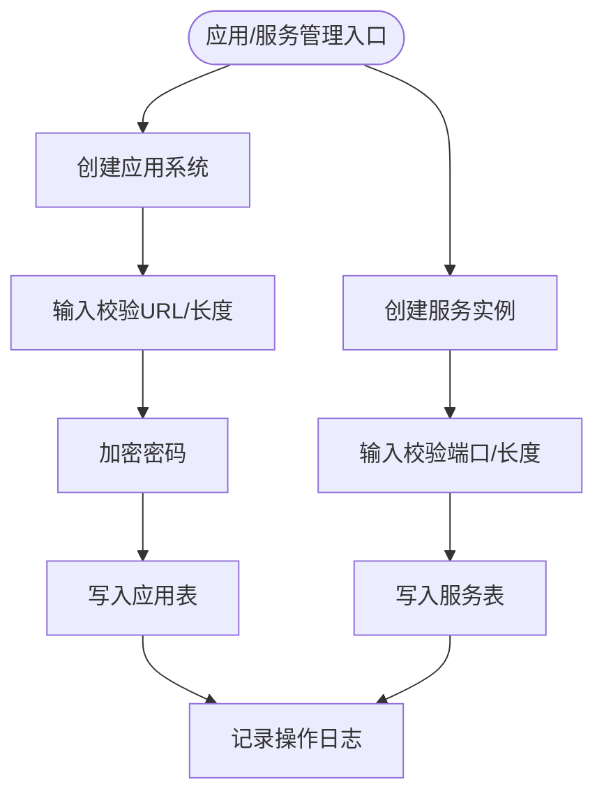
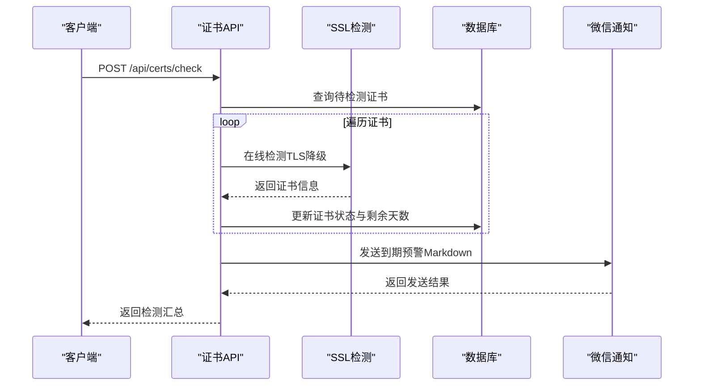
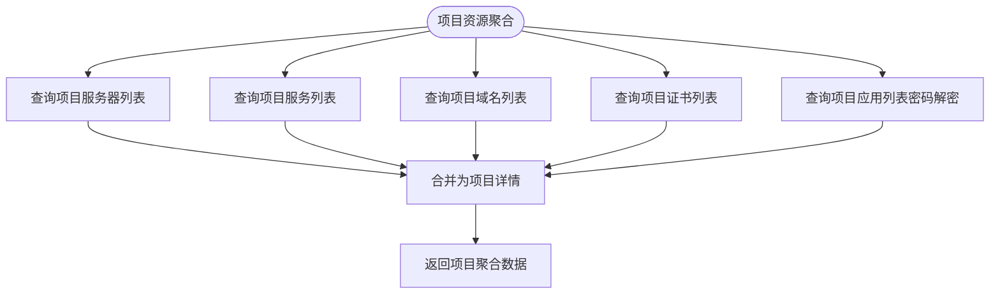
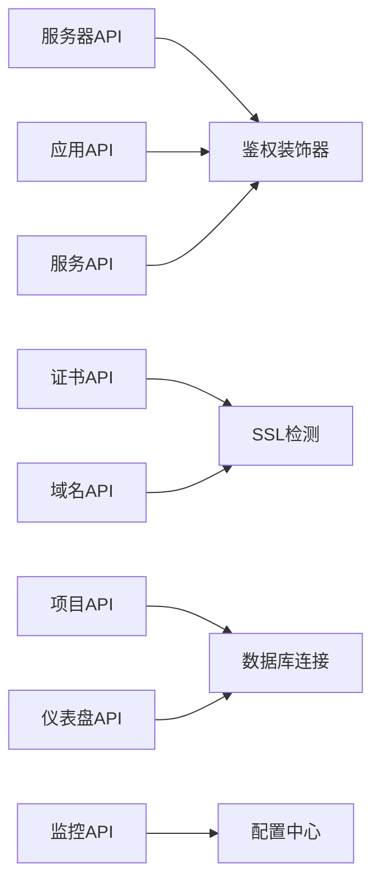

# 核心功能特性

<cite>
**本文引用的文件**   
- [servers.py](file://backend/app/api/servers.py)
- [apps.py](file://backend/app/api/apps.py)
- [services.py](file://backend/app/api/services.py)
- [certs.py](file://backend/app/api/certs.py)
- [domains.py](file://backend/app/api/domains.py)
- [projects.py](file://backend/app/api/projects.py)
- [dashboard.py](file://backend/app/api/dashboard.py)
- [monitoring.py](file://backend/app/api/monitoring.py)
- [db.py](file://backend/app/utils/db.py)
- [ssl_checker.py](file://backend/app/utils/ssl_checker.py)
- [password_utils.py](file://backend/app/utils/password_utils.py)
- [validators.py](file://backend/app/utils/validators.py)
- [decorators.py](file://backend/app/utils/decorators.py)
- [config.py](file://backend/app/config.py)
- [init_db.py](file://backend/init_db.py)
- [run.py](file://backend/run.py)
</cite>

## 目录
1. [简介](#简介)
2. [项目结构](#项目结构)
3. [核心组件](#核心组件)
4. [架构总览](#架构总览)
5. [详细组件分析](#详细组件分析)
6. [依赖分析](#依赖分析)
7. [性能考虑](#性能考虑)
8. [故障排查指南](#故障排查指南)
9. [结论](#结论)
10. [附录](#附录)

## 简介
本文件面向OPS平台的核心功能特性，围绕四大能力域展开：多环境服务器管理、应用与服务管理、证书与域名管理、项目资源关联与统计分析。文档从架构设计、数据流、处理逻辑、集成点、错误处理与性能特征等方面进行系统化说明，并提供功能特性对比、流程图与架构图，帮助读者快速理解平台价值、使用场景与实现原理。

## 项目结构
后端采用Flask微服务风格，按功能模块划分蓝图（Blueprint），统一通过装饰器进行鉴权与权限控制，数据库连接封装在工具模块中，配置集中于配置类并通过环境变量注入。核心API模块包括服务器、应用、服务、证书、域名、项目、仪表盘与监控配置等；工具模块涵盖数据库、密码加解密、输入校验、SSL检测、装饰器与操作日志等。

**图表来源**
- [run.py:1-8](file://backend/run.py#L1-L8)
- [config.py:10-58](file://backend/app/config.py#L10-L58)
- [servers.py:1-12](file://backend/app/api/servers.py#L1-L12)
- [apps.py:1-11](file://backend/app/api/apps.py#L1-L11)
- [services.py:1-9](file://backend/app/api/services.py#L1-L9)
- [certs.py:1-23](file://backend/app/api/certs.py#L1-L23)
- [domains.py:1-11](file://backend/app/api/domains.py#L1-L11)
- [projects.py:1-10](file://backend/app/api/projects.py#L1-L10)
- [dashboard.py:1-9](file://backend/app/api/dashboard.py#L1-L9)
- [monitoring.py:1-8](file://backend/app/api/monitoring.py#L1-L8)
- [db.py:1-80](file://backend/app/utils/db.py#L1-L80)
- [password_utils.py:1-130](file://backend/app/utils/password_utils.py#L1-L130)
- [validators.py:1-151](file://backend/app/utils/validators.py#L1-L151)
- [decorators.py:1-163](file://backend/app/utils/decorators.py#L1-L163)
- [ssl_checker.py:1-613](file://backend/app/utils/ssl_checker.py#L1-L613)

**章节来源**
- [run.py:1-8](file://backend/run.py#L1-L8)
- [config.py:10-58](file://backend/app/config.py#L10-L58)

## 核心组件
- 多环境服务器管理：统一管理开发、测试、生产等环境的服务器资产，支持分页检索、项目关联、密码解密展示与操作审计。
- 应用与服务管理：统一登记应用系统账号与服务实例，支持按分类、版本、端口等维度管理，提供项目维度聚合。
- 证书与域名管理：支持手动/上传/阿里云等多种证书来源，提供在线SSL检测、到期预警与微信通知；域名支持手动录入与阿里云同步。
- 项目资源关联与统计分析：以项目为中心聚合服务器、服务、域名、证书、应用等资源，提供仪表盘统计与Grafana监控配置。

**章节来源**
- [servers.py:14-170](file://backend/app/api/servers.py#L14-L170)
- [apps.py:14-118](file://backend/app/api/apps.py#L14-L118)
- [services.py:12-89](file://backend/app/api/services.py#L12-L89)
- [certs.py:154-241](file://backend/app/api/certs.py#L154-L241)
- [domains.py:34-111](file://backend/app/api/domains.py#L34-L111)
- [projects.py:13-86](file://backend/app/api/projects.py#L13-L86)
- [dashboard.py:22-129](file://backend/app/api/dashboard.py#L22-L129)
- [monitoring.py:11-42](file://backend/app/api/monitoring.py#L11-L42)

## 架构总览
平台采用“API层-工具层-数据层”三层结构，API层负责对外接口与业务编排，工具层提供通用能力（鉴权、加解密、校验、SSL检测、数据库连接），数据层由MySQL承载。平台通过配置中心集中管理数据库、CORS、Webhook、监控等参数，支持生产环境通过环境变量注入。

**图表来源**
- [decorators.py:26-163](file://backend/app/utils/decorators.py#L26-L163)
- [db.py:43-80](file://backend/app/utils/db.py#L43-L80)
- [password_utils.py:52-130](file://backend/app/utils/password_utils.py#L52-L130)
- [validators.py:6-151](file://backend/app/utils/validators.py#L6-L151)
- [ssl_checker.py:48-613](file://backend/app/utils/ssl_checker.py#L48-L613)
- [config.py:10-58](file://backend/app/config.py#L10-L58)

## 详细组件分析

### 多环境服务器管理
- 功能要点
  - 列表查询：支持按环境类型、平台、项目、关键词搜索与分页。
  - 详情查询：返回服务器详情、关联服务列表与项目列表，并对敏感字段进行解密展示。
  - 新增/更新/删除：提供输入校验、字段白名单更新、项目关联更新与操作日志记录。
  - 密码安全：对操作系统密码与Docker密码进行对称加密存储，查询时解密返回。
- 数据模型与复杂度
  - 服务器表与项目-服务器关联表构成多对多关系，查询涉及LEFT JOIN与GROUP_CONCAT聚合，分页查询通过LIMIT/OFFSET实现。
  - 敏感字段加密存储，解密仅在返回层进行，避免持久化明文。
- 集成点
  - 与项目管理模块通过project_servers表建立关联。
  - 与服务管理模块通过server_id建立一对多关系。
- 错误处理与性能
  - 异常回滚与统一错误码返回；分页上限控制防止过大请求。
  - 密码解密失败时保持原值，避免影响整体流程。

**图表来源**
- [servers.py:116-169](file://backend/app/api/servers.py#L116-L169)
- [password_utils.py:113-130](file://backend/app/utils/password_utils.py#L113-L130)

**章节来源**
- [servers.py:14-578](file://backend/app/api/servers.py#L14-L578)
- [password_utils.py:93-130](file://backend/app/utils/password_utils.py#L93-L130)

### 应用与服务管理
- 功能要点
  - 应用系统管理：支持应用名称、公司、访问URL、账号密码等字段的增删改查，密码加密存储与解密返回。
  - 服务管理：支持按分类、版本、端口等字段管理服务实例，支持项目维度聚合查询。
- 数据模型与复杂度
  - 服务表与服务器表通过server_id关联，查询时JOIN服务器表获取环境与IP信息。
  - 项目维度聚合通过子查询统计各资源数量，复杂度与项目规模线性相关。
- 集成点
  - 与项目管理模块通过project_id字段关联。
  - 与服务器管理模块通过server_id字段关联。

**图表来源**
- [apps.py:119-214](file://backend/app/api/apps.py#L119-L214)
- [services.py:91-128](file://backend/app/api/services.py#L91-L128)
- [password_utils.py:93-111](file://backend/app/utils/password_utils.py#L93-L111)

**章节来源**
- [apps.py:14-343](file://backend/app/api/apps.py#L14-L343)
- [services.py:12-206](file://backend/app/api/services.py#L12-L206)

### 证书与域名管理
- 功能要点
  - 证书管理：支持手动录入、上传证书文件自动解析、批量/单个在线检测、到期预警与微信通知、阿里云证书同步与下载。
  - 域名管理：支持手动录入、阿里云域名同步、到期预警通知、项目维度筛选。
- 数据模型与复杂度
  - 证书表与域名表均支持project_id关联，便于项目维度聚合统计。
  - SSL检测通过TLS降级策略兼容不同服务器证书链，提升检测成功率。
- 集成点
  - 与阿里云SDK集成，支持域名与证书的同步与下载。
  - 与微信机器人集成，支持Markdown格式通知。

**图表来源**
- [certs.py:585-707](file://backend/app/api/certs.py#L585-L707)
- [ssl_checker.py:48-167](file://backend/app/utils/ssl_checker.py#L48-L167)
- [ssl_checker.py:304-396](file://backend/app/utils/ssl_checker.py#L304-L396)

**章节来源**
- [certs.py:154-800](file://backend/app/api/certs.py#L154-L800)
- [domains.py:34-664](file://backend/app/api/domains.py#L34-L664)
- [ssl_checker.py:169-613](file://backend/app/utils/ssl_checker.py#L169-L613)

### 项目资源关联与统计分析
- 功能要点
  - 项目管理：支持项目创建、更新、删除、项目-服务器批量关联与取消关联。
  - 项目详情：聚合返回服务器、服务、域名、证书、应用等资源列表，并对敏感字段解密。
  - 仪表盘统计：提供各类资源数量、环境分布、服务分类分布、账号分布与近期到期证书列表。
  - 监控配置：提供Grafana访问地址与仪表盘UID列表。
- 数据模型与复杂度
  - 项目-服务器关联表为多对多关系，聚合查询通过子查询统计资源数量，复杂度与资源规模线性相关。
  - 仪表盘统计涉及多表聚合与日期计算，建议在数据库层面建立索引优化。
- 集成点
  - 与各资源模块通过project_id字段关联，形成统一的资源视图。

**图表来源**
- [projects.py:153-258](file://backend/app/api/projects.py#L153-L258)
- [apps.py:14-45](file://backend/app/api/apps.py#L14-L45)

**章节来源**
- [projects.py:13-521](file://backend/app/api/projects.py#L13-L521)
- [dashboard.py:22-129](file://backend/app/api/dashboard.py#L22-L129)
- [monitoring.py:11-42](file://backend/app/api/monitoring.py#L11-L42)

## 依赖分析
- 组件耦合与内聚
  - API层模块间低耦合，通过工具层共享通用能力（鉴权、加解密、校验、SSL检测、数据库连接）。
  - 项目管理模块对各资源模块具有聚合内聚性，形成统一的资源视图。
- 外部依赖与集成点
  - 阿里云SDK：域名与证书同步、证书下载。
  - 微信机器人：证书与域名到期通知。
  - Grafana：监控面板配置。
- 潜在环形依赖
  - 当前模块间无直接环形依赖，但API层与工具层双向依赖（API依赖工具，工具可能反向引用API模块，如鉴权装饰器依赖用户模型），需注意避免循环导入。

**图表来源**
- [decorators.py:26-163](file://backend/app/utils/decorators.py#L26-L163)
- [ssl_checker.py:21-34](file://backend/app/utils/ssl_checker.py#L21-L34)
- [config.py:10-58](file://backend/app/config.py#L10-L58)

**章节来源**
- [decorators.py:1-163](file://backend/app/utils/decorators.py#L1-L163)
- [ssl_checker.py:1-613](file://backend/app/utils/ssl_checker.py#L1-L613)
- [config.py:10-58](file://backend/app/config.py#L10-L58)

## 性能考虑
- 数据库连接与事务
  - 使用Flask g上下文缓存数据库连接，减少连接开销；异常时回滚，避免脏数据。
- 查询优化
  - 分页参数上限控制（最大100条/页），防止大页请求导致资源耗尽。
  - 多表JOIN与GROUP_CONCAT聚合查询，建议在高频字段上建立索引（如env_type、inner_ip、domain等）。
- 加解密性能
  - 对称加密采用Fernet，适合小量敏感字段存储；批量解密时注意异常处理与回退策略。
- SSL检测
  - TLS降级策略提升兼容性，但增加网络往返；建议合理设置超时时间与重试次数。

[本节为通用性能指导，无需特定文件引用]

## 故障排查指南
- 数据库连接失败
  - 检查数据库配置（主机、端口、用户、密码、库名）是否正确，确认连接超时与异常日志。
- 权限与认证问题
  - 确认JWT令牌格式与有效期，检查用户状态与密码变更时间；角色权限不足时返回403。
- 加解密异常
  - 确认DATA_ENCRYPTION_KEY环境变量配置；开发模式下可启用回退密钥（不适用于生产）。
- SSL检测失败
  - 检查域名可达性与TLS版本兼容性；调整SSL_CHECK_TIMEOUT配置；确认微信Webhook配置。
- 阿里云集成失败
  - 确认阿里云SDK安装与AccessKey配置；检查API响应结构与返回码。

**章节来源**
- [db.py:43-80](file://backend/app/utils/db.py#L43-L80)
- [decorators.py:26-163](file://backend/app/utils/decorators.py#L26-L163)
- [password_utils.py:18-29](file://backend/app/utils/password_utils.py#L18-L29)
- [ssl_checker.py:48-167](file://backend/app/utils/ssl_checker.py#L48-L167)
- [domains.py:345-349](file://backend/app/api/domains.py#L345-L349)

## 结论
OPS平台通过统一的API层与工具层，实现了多环境服务器、应用服务、证书域名与项目的全生命周期管理，并提供可视化统计与监控集成。其核心优势在于：
- 资源统一视图：以项目为中心聚合服务器、服务、域名、证书、应用，便于跨域协同与审计。
- 安全与合规：敏感字段加密存储与解密展示，操作日志与权限控制保障安全。
- 自动化与集成：SSL在线检测、到期预警、阿里云同步与微信通知，降低人工运维成本。
- 可扩展性：模块化设计与配置中心注入，便于横向扩展与定制化。

[本节为总结性内容，无需特定文件引用]

## 附录

### 功能特性对比（平台 vs 传统运维工具）
- 多环境统一管理：平台提供环境类型字典与项目维度聚合，传统工具通常分散在多个系统中。
- 自动化证书管理：平台支持上传解析、在线检测、到期预警与阿里云同步，传统工具多为手工维护。
- 域名与证书联动：平台将域名与证书统一管理并提供到期预警，传统工具常分离管理。
- 项目资源关联：平台以项目为中心聚合资源并提供统计分析，传统工具缺乏统一视图。
- 安全与审计：平台提供操作日志与权限控制，传统工具审计能力有限。

[本节为概念性对比，无需特定文件引用]

### 实际业务案例与使用效果（示例）
- 案例：某企业多项目并行，通过平台统一管理服务器与服务，实现项目维度资源统计与可视化，显著降低资源漂移风险。
- 案例：通过SSL在线检测与到期预警，提前发现即将过期证书并自动通知，避免业务中断。
- 案例：域名与证书统一管理后，域名同步与证书下载自动化，减少重复劳动与人为错误。

[本节为概念性案例，无需特定文件引用]