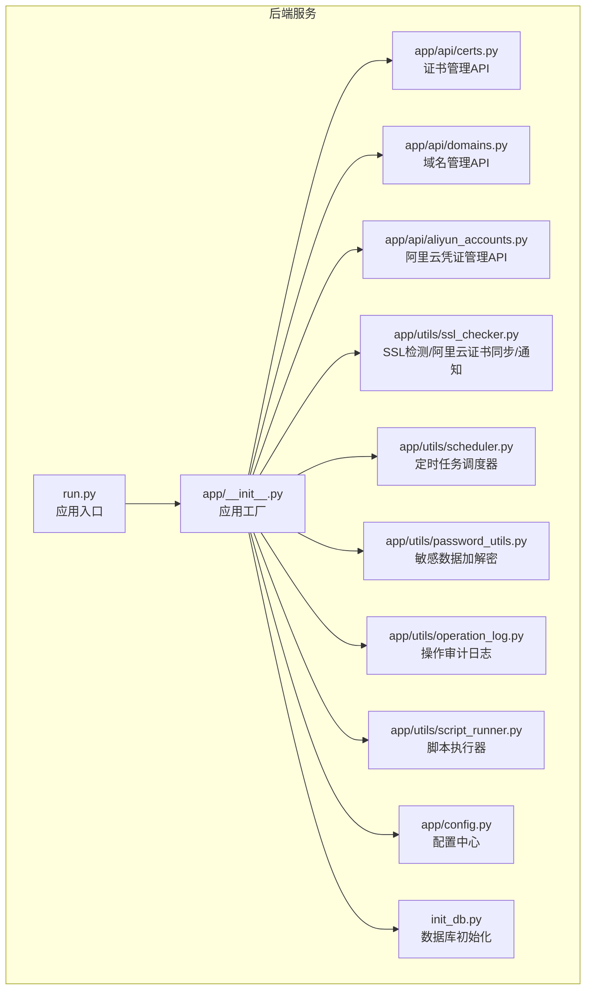
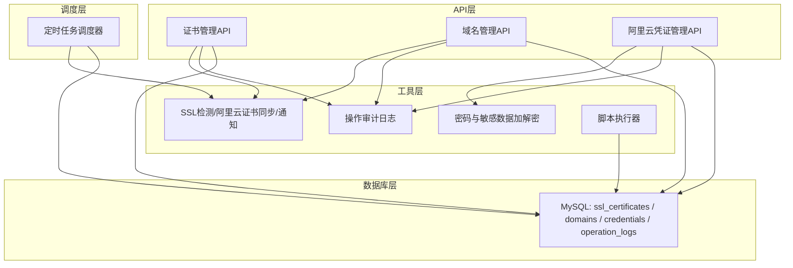
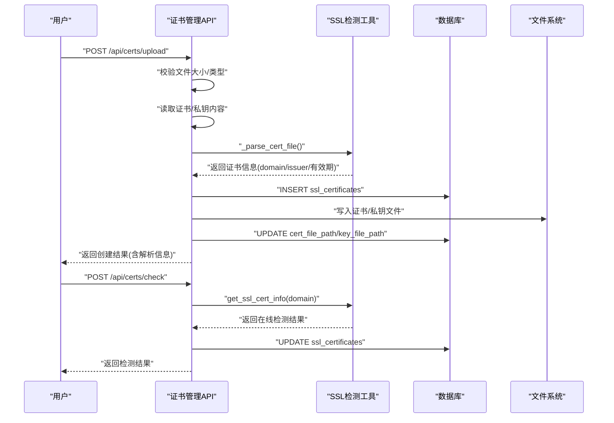
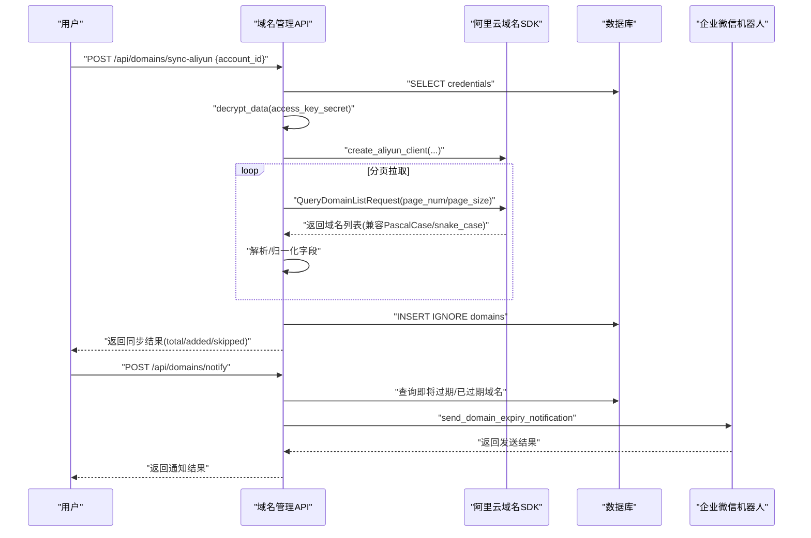
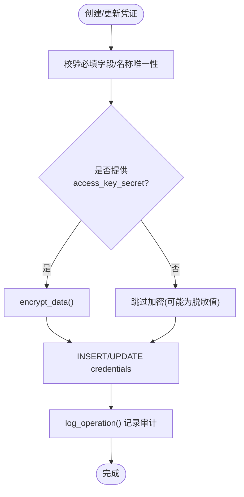
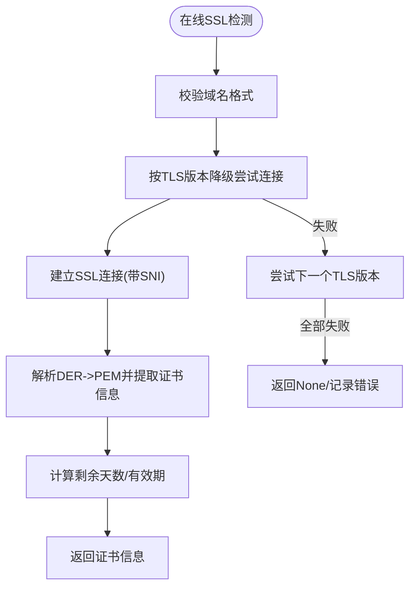
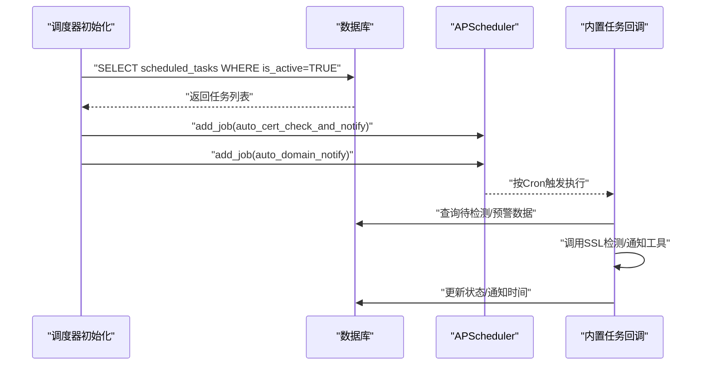
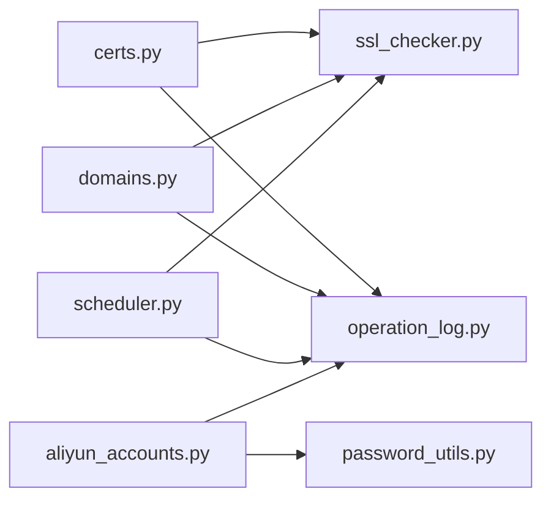
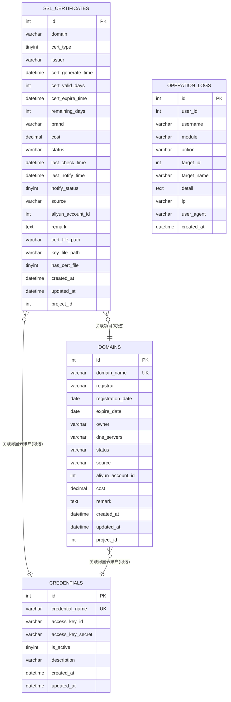

# 证书和域名管理

<cite>
**本文引用的文件**
- [certs.py](file://backend/app/api/certs.py)
- [domains.py](file://backend/app/api/domains.py)
- [aliyun_accounts.py](file://backend/app/api/aliyun_accounts.py)
- [ssl_checker.py](file://backend/app/utils/ssl_checker.py)
- [scheduler.py](file://backend/app/utils/scheduler.py)
- [password_utils.py](file://backend/app/utils/password_utils.py)
- [operation_log.py](file://backend/app/utils/operation_log.py)
- [config.py](file://backend/app/config.py)
- [init_db.py](file://backend/init_db.py)
- [script_runner.py](file://backend/app/utils/script_runner.py)
- [run.py](file://backend/run.py)
</cite>

## 目录
1. [简介](#简介)
2. [项目结构](#项目结构)
3. [核心组件](#核心组件)
4. [架构总览](#架构总览)
5. [详细组件分析](#详细组件分析)
6. [依赖关系分析](#依赖关系分析)
7. [性能考量](#性能考量)
8. [故障排除指南](#故障排除指南)
9. [结论](#结论)
10. [附录](#附录)

## 简介
本文件面向OPS平台的证书与域名管理能力，系统性阐述SSL证书的自动化管理流程（申请、部署、续期、监控）、与阿里云DNS/API的集成机制、域名解析自动配置、证书到期提醒与自动续期策略、证书文件的上传/存储/分发机制，以及域名解析配置管理。同时提供安全最佳实践（密钥保护、访问控制、审计日志）与故障排除、应急处理方案，帮助运维与开发人员高效、安全地维护线上证书与域名资产。

## 项目结构
后端采用Flask微服务风格，核心围绕“证书管理”“域名管理”“阿里云凭证管理”三大API模块展开，配合通用工具模块实现SSL检测、定时任务、密码加解密、操作审计等能力。数据库初始化脚本负责创建证书、域名、凭证、操作日志等关键表，并为历史表补充项目关联字段。

图表来源
- [run.py:1-8](file://backend/run.py#L1-L8)
- [certs.py:1-120](file://backend/app/api/certs.py#L1-L120)
- [domains.py:1-60](file://backend/app/api/domains.py#L1-L60)
- [aliyun_accounts.py:1-60](file://backend/app/api/aliyun_accounts.py#L1-L60)
- [ssl_checker.py:1-60](file://backend/app/utils/ssl_checker.py#L1-L60)
- [scheduler.py:1-60](file://backend/app/utils/scheduler.py#L1-L60)
- [password_utils.py:1-60](file://backend/app/utils/password_utils.py#L1-L60)
- [operation_log.py:1-60](file://backend/app/utils/operation_log.py#L1-L60)
- [script_runner.py:1-60](file://backend/app/utils/script_runner.py#L1-L60)
- [config.py:1-58](file://backend/app/config.py#L1-L58)
- [init_db.py:1-120](file://backend/init_db.py#L1-L120)

章节来源
- [run.py:1-8](file://backend/run.py#L1-L8)
- [config.py:10-58](file://backend/app/config.py#L10-L58)
- [init_db.py:363-393](file://backend/init_db.py#L363-L393)

## 核心组件
- 证书管理API：提供证书列表查询、手动/上传创建、更新、删除、批量/单个在线检测、证书文件存储路径管理等能力。
- 域名管理API：提供域名列表查询、手动创建、更新、删除、阿里云域名同步、到期预警通知等能力。
- 阿里云凭证管理API：提供凭证的增删改查、敏感字段加密存储、解密返回等能力。
- SSL检测与通知工具：提供在线SSL证书检测、阿里云证书同步、企业微信通知发送等能力。
- 定时任务调度器：基于APScheduler实现证书自动检测与通知、域名到期自动通知等内置任务。
- 密码与敏感数据工具：基于bcrypt与Fernet实现密码哈希与敏感数据对称加密。
- 操作审计日志：统一记录模块、动作、目标、详情、IP、UA、时间等审计信息。
- 配置中心：集中管理Webhook、超时、告警阈值、Cron表达式、上传目录等运行参数。

章节来源
- [certs.py:154-800](file://backend/app/api/certs.py#L154-L800)
- [domains.py:34-670](file://backend/app/api/domains.py#L34-L670)
- [aliyun_accounts.py:19-275](file://backend/app/api/aliyun_accounts.py#L19-L275)
- [ssl_checker.py:48-613](file://backend/app/utils/ssl_checker.py#L48-L613)
- [scheduler.py:244-580](file://backend/app/utils/scheduler.py#L244-L580)
- [password_utils.py:96-133](file://backend/app/utils/password_utils.py#L96-L133)
- [operation_log.py:49-173](file://backend/app/utils/operation_log.py#L49-L173)
- [config.py:40-58](file://backend/app/config.py#L40-L58)

## 架构总览
证书与域名管理的整体架构由“API层—工具层—调度层—数据库层”构成，API层负责对外暴露REST接口；工具层提供SSL检测、阿里云SDK调用、通知发送、加解密、审计等通用能力；调度层负责周期性任务；数据库层持久化证书、域名、凭证、操作日志等数据。

图表来源
- [certs.py:154-800](file://backend/app/api/certs.py#L154-L800)
- [domains.py:34-670](file://backend/app/api/domains.py#L34-L670)
- [aliyun_accounts.py:19-275](file://backend/app/api/aliyun_accounts.py#L19-L275)
- [ssl_checker.py:48-613](file://backend/app/utils/ssl_checker.py#L48-L613)
- [scheduler.py:244-580](file://backend/app/utils/scheduler.py#L244-L580)
- [password_utils.py:96-133](file://backend/app/utils/password_utils.py#L96-L133)
- [operation_log.py:49-173](file://backend/app/utils/operation_log.py#L49-L173)
- [init_db.py:363-393](file://backend/init_db.py#L363-L393)

## 详细组件分析

### 证书管理组件分析
- 功能要点
  - 列表查询：支持按域名/项目名搜索、按证书类型/项目筛选、分页。
  - 手动创建：支持手动录入证书信息（域名、颁发机构、到期时间、品牌、费用、状态、备注等）。
  - 上传创建：支持上传证书文件（.pem/.crt/.cer）与可选私钥（.key），自动解析证书信息并入库，同时落盘到安全目录。
  - 更新/删除：动态更新字段并重算剩余天数；删除时记录审计。
  - 在线检测：批量/单个域名在线检测，更新证书到期时间、剩余天数、状态、最后检测时间。
  - 存储路径：证书文件与私钥文件路径字段，支持has_cert_file标记是否已落盘。
- 关键流程
  - 上传创建流程：接收multipart文件→校验大小/类型→读取内容→解析证书→去重检查→入库→落盘→更新路径→记录审计。
  - 在线检测流程：批量/单个查询→调用SSL检测工具→更新数据库→记录审计。
- 安全与健壮性
  - 证书文件落盘采用安全目录与路径规范化，防止路径穿越。
  - 日期解析支持多种格式，异常时返回明确错误。
  - 审计日志记录模块、动作、目标、详情、IP、UA、时间等。

图表来源
- [certs.py:325-468](file://backend/app/api/certs.py#L325-L468)
- [certs.py:590-714](file://backend/app/api/certs.py#L590-L714)
- [ssl_checker.py:48-167](file://backend/app/utils/ssl_checker.py#L48-L167)

章节来源
- [certs.py:154-800](file://backend/app/api/certs.py#L154-L800)
- [ssl_checker.py:48-167](file://backend/app/utils/ssl_checker.py#L48-L167)
- [operation_log.py:49-119](file://backend/app/utils/operation_log.py#L49-L119)

### 域名管理组件分析
- 功能要点
  - 列表查询：支持按域名/所有者/注册商搜索、按项目筛选、分页。
  - 手动创建/更新/删除：支持字段校验与冲突检查。
  - 阿里云域名同步：根据凭证信息调用阿里云域名API，兼容不同SDK版本字段命名，批量插入数据库。
  - 到期预警通知：查询即将过期/已过期域名，通过企业微信机器人发送Markdown通知。
- 集成机制
  - 阿里云SDK可用性检测，兼容PascalCase/snake_case字段名，统一解析为内部结构。
  - 凭证解密后用于创建客户端，避免明文存储。
- 安全与健壮性
  - 凭证字段加密存储，返回时解密；支持脱敏值判断，避免覆盖敏感字段。
  - 通知发送具备重试与超时控制。

图表来源
- [domains.py:339-670](file://backend/app/api/domains.py#L339-L670)
- [aliyun_accounts.py:19-130](file://backend/app/api/aliyun_accounts.py#L19-L130)
- [ssl_checker.py:398-491](file://backend/app/utils/ssl_checker.py#L398-L491)

章节来源
- [domains.py:34-670](file://backend/app/api/domains.py#L34-L670)
- [aliyun_accounts.py:19-275](file://backend/app/api/aliyun_accounts.py#L19-L275)
- [ssl_checker.py:398-491](file://backend/app/utils/ssl_checker.py#L398-L491)

### 阿里云凭证管理组件分析
- 功能要点
  - 列表查询：返回凭证列表，解密access_key_secret字段。
  - 创建/更新/删除：支持名称唯一性校验、字段动态更新、脱敏值判断。
  - 敏感数据保护：加密存储access_key_secret，解密仅在必要时进行。
- 安全要点
  - 加密密钥来自环境变量，开发环境提供默认密钥但明确提示风险。
  - 脱敏值判断避免误覆盖敏感字段。

图表来源
- [aliyun_accounts.py:55-130](file://backend/app/api/aliyun_accounts.py#L55-L130)
- [password_utils.py:96-133](file://backend/app/utils/password_utils.py#L96-L133)
- [operation_log.py:49-119](file://backend/app/utils/operation_log.py#L49-L119)

章节来源
- [aliyun_accounts.py:19-275](file://backend/app/api/aliyun_accounts.py#L19-L275)
- [password_utils.py:96-133](file://backend/app/utils/password_utils.py#L96-L133)
- [operation_log.py:49-119](file://backend/app/utils/operation_log.py#L49-L119)

### SSL检测与通知组件分析
- 功能要点
  - 在线SSL证书检测：支持TLS版本降级，解析PEM证书，提取主题、颁发者、有效期、剩余天数等。
  - 阿里云证书同步：扫描账户下证书列表，解析common_name/not_after等字段，兼容不同SDK版本。
  - 通知发送：企业微信Markdown通知，支持重试与超时控制。
- 复杂度与性能
  - 在线检测对每个域名建立socket连接并尝试多个TLS版本，复杂度与域名数量线性相关。
  - 通知发送具备最大重试次数配置，避免瞬时失败导致漏报。

图表来源
- [ssl_checker.py:48-167](file://backend/app/utils/ssl_checker.py#L48-L167)

章节来源
- [ssl_checker.py:48-613](file://backend/app/utils/ssl_checker.py#L48-L613)

### 定时任务调度组件分析
- 功能要点
  - 初始化：从数据库加载活跃定时任务，支持脚本文件与自定义命令两种模式。
  - 内置任务：自动证书检测+通知、自动域名到期通知，基于Cron表达式周期执行。
  - 任务执行：独立线程执行，记录任务日志、最后运行时间、状态与输出。
- 配置项
  - 证书自动检测Cron、域名自动通知Cron、SSL检测超时、告警阈值、Webhook URL等。

图表来源
- [scheduler.py:244-384](file://backend/app/utils/scheduler.py#L244-L384)
- [scheduler.py:391-580](file://backend/app/utils/scheduler.py#L391-L580)

章节来源
- [scheduler.py:244-580](file://backend/app/utils/scheduler.py#L244-L580)
- [config.py:47-48](file://backend/app/config.py#L47-L48)

## 依赖关系分析
- 组件耦合
  - 证书/域名API依赖数据库工具与操作审计；证书API依赖SSL检测工具；域名API依赖SSL检测工具与阿里云SDK。
  - 定时任务调度器与SSL检测工具、通知工具存在跨模块调用关系。
  - 凭证管理API依赖密码工具进行敏感数据加解密。
- 外部依赖
  - 阿里云域名SDK与CAS SDK（证书下载/同步）。
  - APScheduler用于定时任务。
  - cryptography用于证书解析与TLS握手。
  - requests用于企业微信通知发送。
- 循环依赖
  - 当前模块间无明显循环依赖，调度器通过回调函数间接调用工具模块。

图表来源
- [certs.py:154-800](file://backend/app/api/certs.py#L154-L800)
- [domains.py:34-670](file://backend/app/api/domains.py#L34-L670)
- [aliyun_accounts.py:19-275](file://backend/app/api/aliyun_accounts.py#L19-L275)
- [ssl_checker.py:48-613](file://backend/app/utils/ssl_checker.py#L48-L613)
- [scheduler.py:244-580](file://backend/app/utils/scheduler.py#L244-L580)
- [operation_log.py:49-173](file://backend/app/utils/operation_log.py#L49-L173)
- [password_utils.py:96-133](file://backend/app/utils/password_utils.py#L96-L133)

章节来源
- [certs.py:154-800](file://backend/app/api/certs.py#L154-L800)
- [domains.py:34-670](file://backend/app/api/domains.py#L34-L670)
- [aliyun_accounts.py:19-275](file://backend/app/api/aliyun_accounts.py#L19-L275)
- [ssl_checker.py:48-613](file://backend/app/utils/ssl_checker.py#L48-L613)
- [scheduler.py:244-580](file://backend/app/utils/scheduler.py#L244-L580)
- [operation_log.py:49-173](file://backend/app/utils/operation_log.py#L49-L173)
- [password_utils.py:96-133](file://backend/app/utils/password_utils.py#L96-L133)

## 性能考量
- SSL在线检测
  - 每个域名尝试多个TLS版本，建议合理设置超时时间与并发上限，避免阻塞。
  - 批量检测时建议分批执行，结合数据库索引优化查询。
- 通知发送
  - 企业微信通知具备重试机制，建议控制重试次数与间隔，避免雪崩。
- 文件存储
  - 证书/私钥落盘采用安全目录与规范化路径，避免路径穿越；建议定期清理无用文件与冗余备份。
- 定时任务
  - Cron表达式与任务执行时间应避免高峰期，确保系统负载均衡。

## 故障排除指南
- 证书上传失败
  - 检查文件大小/类型限制、证书格式是否为PEM、域名是否已存在。
  - 查看数据库回滚与异常日志，确认落盘路径与权限。
- 在线检测失败
  - 检查域名可达性、防火墙策略、TLS版本兼容性；查看SSL检测工具日志。
- 阿里云同步失败
  - 检查凭证是否启用、AccessKey是否正确、SDK是否安装；查看API响应与异常堆栈。
- 通知发送失败
  - 检查Webhook URL配置、网络连通性、重试次数与超时设置。
- 定时任务未执行
  - 检查调度器是否启动、Cron表达式是否正确、任务是否处于激活状态。
- 审计日志缺失
  - 确认操作日志记录函数调用链路、数据库连接与事务提交。

章节来源
- [certs.py:325-468](file://backend/app/api/certs.py#L325-L468)
- [domains.py:339-670](file://backend/app/api/domains.py#L339-L670)
- [ssl_checker.py:304-396](file://backend/app/utils/ssl_checker.py#L304-L396)
- [scheduler.py:244-384](file://backend/app/utils/scheduler.py#L244-L384)
- [operation_log.py:49-119](file://backend/app/utils/operation_log.py#L49-L119)

## 结论
OPS平台的证书与域名管理模块通过标准化的API、完善的工具链与定时任务，实现了从证书申请、部署、续期到监控的全生命周期管理，并与阿里云生态深度集成。配合敏感数据加密、操作审计、通知机制与安全最佳实践，能够满足生产环境对安全性与可维护性的严格要求。建议持续优化检测与通知策略，完善监控与告警体系，确保线上资产稳定可靠。

## 附录
- 数据模型概览（关键表）
  - ssl_certificates：证书主表，包含域名、类型、颁发机构、生成/到期时间、剩余天数、状态、来源、阿里云账户关联、证书/私钥文件路径等。
  - domains：域名主表，包含域名、注册商、注册/到期日期、持有者、DNS服务器、状态、来源、阿里云账户关联等。
  - credentials：阿里云凭证表，包含凭证名称、AccessKey ID/Secret、启用状态、描述等。
  - operation_logs：操作审计日志表，包含模块、动作、目标、详情、IP、UA、时间等。

图表来源
- [init_db.py:363-393](file://backend/init_db.py#L363-L393)
- [init_db.py:341-361](file://backend/init_db.py#L341-L361)
- [init_db.py:326-339](file://backend/init_db.py#L326-L339)
- [init_db.py:240-259](file://backend/init_db.py#L240-L259)