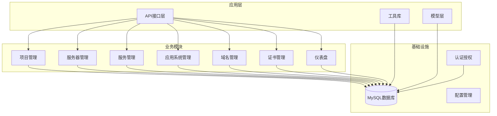
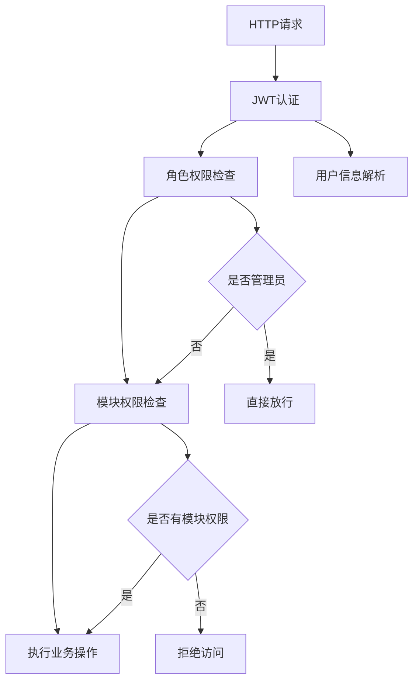
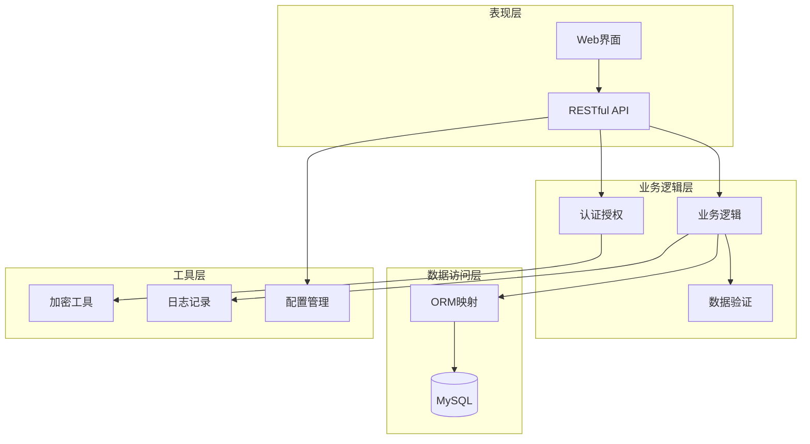
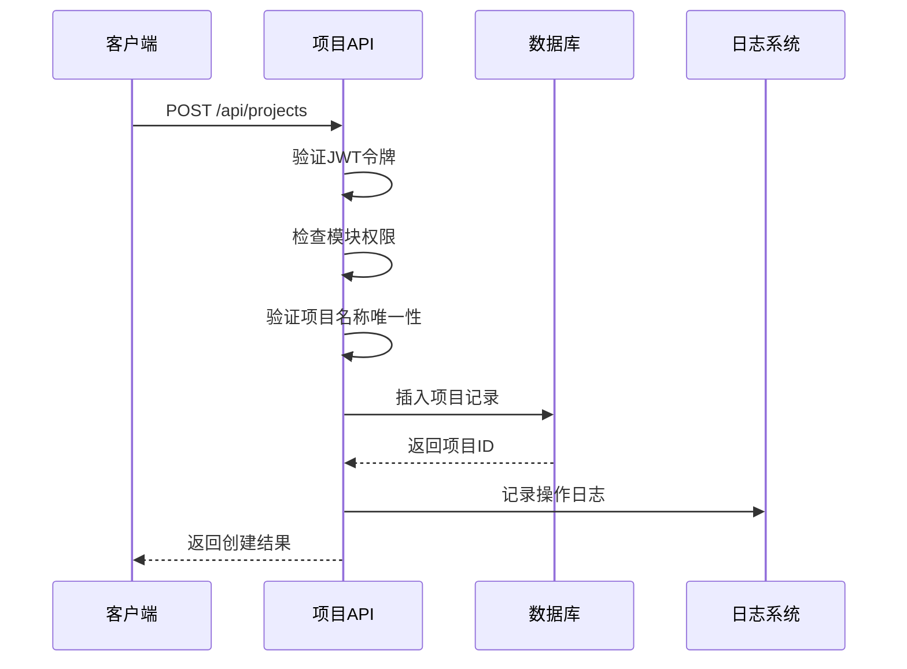
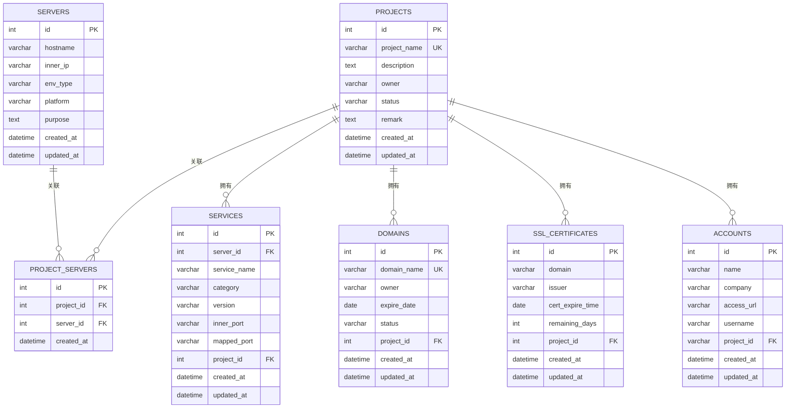
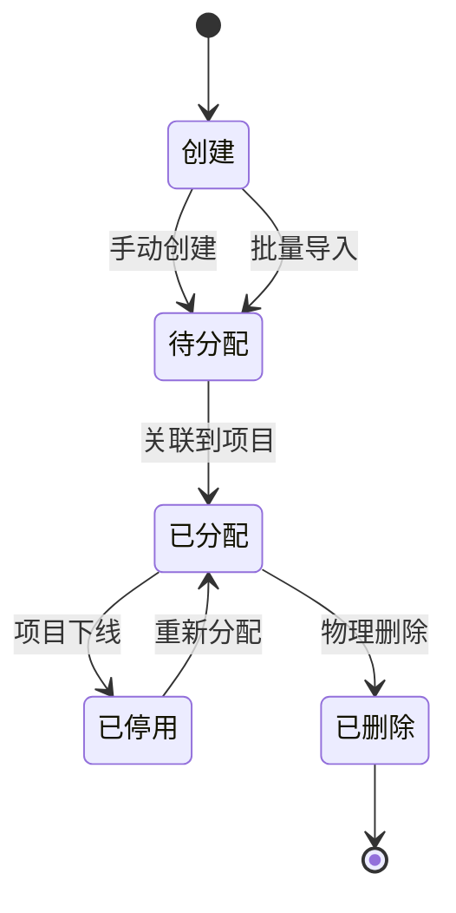
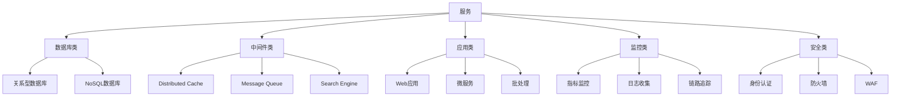
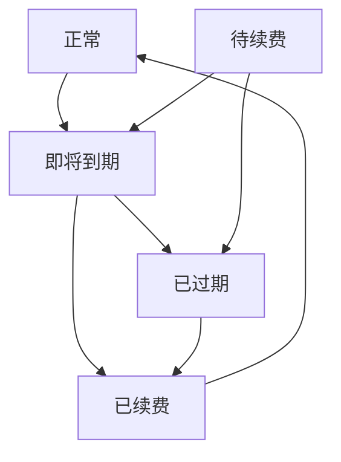
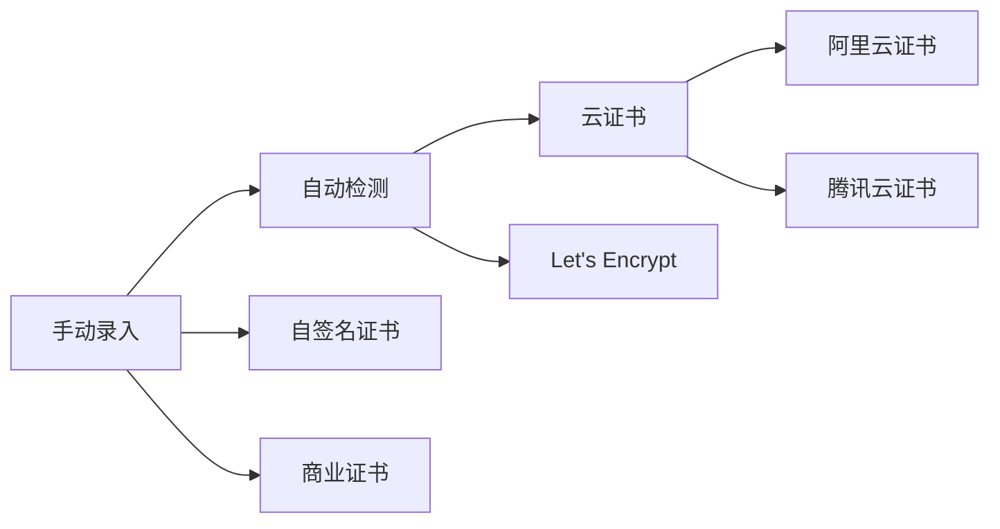
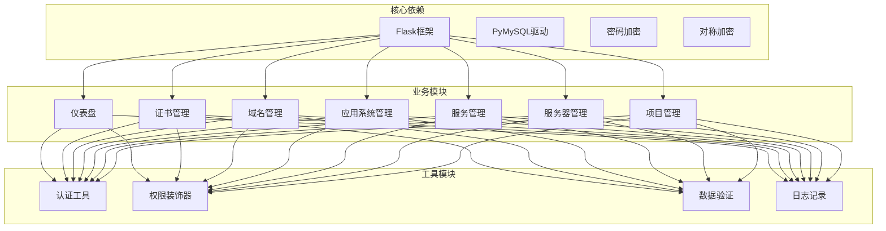

# 项目资源关联管理

<cite>
**本文档引用的文件**
- [projects.py](file://backend/app/api/projects.py)
- [servers.py](file://backend/app/api/servers.py)
- [apps.py](file://backend/app/api/apps.py)
- [services.py](file://backend/app/api/services.py)
- [domains.py](file://backend/app/api/domains.py)
- [certs.py](file://backend/app/api/certs.py)
- [dashboard.py](file://backend/app/api/dashboard.py)
- [db.py](file://backend/app/utils/db.py)
- [decorators.py](file://backend/app/utils/decorators.py)
- [operation_log.py](file://backend/app/utils/operation_log.py)
- [password_utils.py](file://backend/app/utils/password_utils.py)
- [user.py](file://backend/app/models/user.py)
- [config.py](file://backend/app/config.py)
- [init_db.py](file://backend/init_db.py)
- [run.py](file://backend/run.py)
</cite>

## 目录
1. [简介](#简介)
2. [项目结构](#项目结构)
3. [核心组件](#核心组件)
4. [架构概览](#架构概览)
5. [详细组件分析](#详细组件分析)
6. [依赖关系分析](#依赖关系分析)
7. [性能考虑](#性能考虑)
8. [故障排除指南](#故障排除指南)
9. [结论](#结论)
10. [附录](#附录)

## 简介

OPS平台的项目资源关联管理功能是一个综合性的资源管理解决方案，旨在帮助企业高效管理IT基础设施资源。该系统通过项目作为核心枢纽，实现了服务器、应用系统、服务、域名和SSL证书等各类资源的统一关联和管理。

系统采用基于Flask的RESTful API架构，结合MySQL数据库存储，提供了完整的资源生命周期管理能力。通过项目这一抽象概念，用户可以将相关的服务器、应用、服务、域名和证书资源进行逻辑分组，实现资源的集中管理和可视化展示。

## 项目结构

OPS平台采用模块化的项目结构设计，主要分为以下几个层次：

**图表来源**
- [projects.py:1-547](file://backend/app/api/projects.py#L1-L547)
- [servers.py:1-604](file://backend/app/api/servers.py#L1-L604)
- [services.py:1-210](file://backend/app/api/services.py#L1-L210)
- [apps.py:1-348](file://backend/app/api/apps.py#L1-L348)
- [domains.py:1-670](file://backend/app/api/domains.py#L1-L670)
- [certs.py:1-800](file://backend/app/api/certs.py#L1-L800)
- [dashboard.py:1-166](file://backend/app/api/dashboard.py#L1-L166)

**章节来源**
- [run.py:1-8](file://backend/run.py#L1-L8)
- [config.py:1-58](file://backend/app/config.py#L1-L58)

## 核心组件

### 项目管理模块

项目管理是整个资源关联体系的核心，负责项目的创建、维护和资源关联管理。系统支持项目的基本信息管理，包括项目名称、描述、负责人、状态等属性。

项目管理的关键特性包括：
- **项目生命周期管理**：从创建到删除的完整生命周期
- **资源关联管理**：支持服务器、服务、域名、证书、应用系统的关联
- **权限控制**：基于角色的访问控制和模块权限管理
- **审计日志**：完整的操作记录和变更追踪

### 资源管理模块

系统提供五大类核心资源的管理能力：

1. **服务器管理**：物理机、虚拟机等基础设施资源
2. **服务管理**：运行在服务器上的具体服务实例
3. **应用系统管理**：业务应用的账号和访问信息
4. **域名管理**：域名注册和到期管理
5. **证书管理**：SSL/TLS证书的生命周期管理

每个模块都提供完整的CRUD操作，并支持复杂的查询过滤和分页功能。

### 权限控制系统

系统采用多层次的权限控制机制：

**图表来源**
- [decorators.py:26-214](file://backend/app/utils/decorators.py#L26-L214)

**章节来源**
- [projects.py:13-547](file://backend/app/api/projects.py#L13-L547)
- [servers.py:14-604](file://backend/app/api/servers.py#L14-L604)
- [services.py:12-210](file://backend/app/api/services.py#L12-L210)
- [apps.py:14-348](file://backend/app/api/apps.py#L14-L348)
- [domains.py:34-670](file://backend/app/api/domains.py#L34-L670)
- [certs.py:154-800](file://backend/app/api/certs.py#L154-L800)

## 架构概览

OPS平台采用分层架构设计，确保了系统的可扩展性和可维护性：

**图表来源**
- [db.py:43-80](file://backend/app/utils/db.py#L43-L80)
- [operation_log.py:49-173](file://backend/app/utils/operation_log.py#L49-L173)
- [password_utils.py:96-133](file://backend/app/utils/password_utils.py#L96-L133)

系统的核心优势在于其模块化设计，每个业务模块都可以独立开发、测试和部署，同时通过统一的认证授权机制确保系统的安全性。

**章节来源**
- [init_db.py:35-431](file://backend/init_db.py#L35-L431)

## 详细组件分析

### 项目管理组件

项目管理组件是资源关联的核心，提供了完整的项目生命周期管理功能：

#### 项目创建流程

**图表来源**
- [projects.py:109-172](file://backend/app/api/projects.py#L109-L172)

#### 项目资源关联机制

项目与各类资源的关联通过中间表实现多对多关系：

**图表来源**
- [init_db.py:80-128](file://backend/init_db.py#L80-L128)
- [init_db.py:341-393](file://backend/init_db.py#L341-L393)

**章节来源**
- [projects.py:409-547](file://backend/app/api/projects.py#L409-L547)

### 服务器管理组件

服务器管理组件提供了全面的服务器资源管理功能：

#### 服务器生命周期管理

**图表来源**
- [servers.py:561-604](file://backend/app/api/servers.py#L561-L604)

#### 服务器信息管理

服务器信息包含硬件配置、网络信息、系统信息等多个维度：

- **硬件配置**：CPU、内存、磁盘等硬件规格
- **网络信息**：内网IP、映射IP、公网IP等网络配置
- **系统信息**：操作系统、用户凭据、证书路径等
- **业务信息**：用途说明、项目归属等

**章节来源**
- [servers.py:212-604](file://backend/app/api/servers.py#L212-L604)

### 服务管理组件

服务管理组件专注于应用服务的生命周期管理：

#### 服务分类体系

**图表来源**
- [init_db.py:152-161](file://backend/init_db.py#L152-L161)

**章节来源**
- [services.py:12-210](file://backend/app/api/services.py#L12-L210)

### 应用系统管理组件

应用系统管理组件负责业务应用的账号和访问信息管理：

#### 应用系统分类

应用系统按照业务类型和重要程度进行分类管理：

- **核心业务系统**：ERP、CRM等关键业务系统
- **支撑系统**：OA、财务、HR等支撑系统  
- **开发测试系统**：开发、测试、演示环境
- **第三方集成系统**：外部合作伙伴系统

**章节来源**
- [apps.py:14-348](file://backend/app/api/apps.py#L14-L348)

### 域名管理组件

域名管理组件提供了完整的域名生命周期管理：

#### 域名状态管理

**图表来源**
- [domains.py:601-670](file://backend/app/api/domains.py#L601-L670)

**章节来源**
- [domains.py:34-670](file://backend/app/api/domains.py#L34-L670)

### 证书管理组件

证书管理组件专注于SSL/TLS证书的全生命周期管理：

#### 证书类型分类

**图表来源**
- [certs.py:154-800](file://backend/app/api/certs.py#L154-L800)

**章节来源**
- [certs.py:154-800](file://backend/app/api/certs.py#L154-L800)

## 依赖关系分析

系统采用松耦合的设计原则，各模块之间的依赖关系清晰明确：

**图表来源**
- [decorators.py:1-214](file://backend/app/utils/decorators.py#L1-L214)
- [operation_log.py:1-173](file://backend/app/utils/operation_log.py#L1-L173)
- [password_utils.py:1-133](file://backend/app/utils/password_utils.py#L1-L133)

**章节来源**
- [db.py:1-80](file://backend/app/utils/db.py#L1-L80)

## 性能考虑

系统在设计时充分考虑了性能优化和扩展性需求：

### 数据库性能优化

1. **索引策略**：为常用查询字段建立合适的索引
2. **查询优化**：使用JOIN查询减少数据库往返次数
3. **分页机制**：支持大数据量的分页查询
4. **连接池**：使用Flask应用上下文缓存数据库连接

### 缓存策略

1. **会话缓存**：JWT令牌验证结果缓存
2. **配置缓存**：应用配置信息缓存
3. **权限缓存**：用户权限信息缓存

### 异步处理

1. **定时任务**：证书和域名到期检查
2. **后台任务**：大规模数据导入导出
3. **通知服务**：到期提醒邮件/微信推送

## 故障排除指南

### 常见问题诊断

#### 数据库连接问题

**症状**：API请求报数据库连接错误
**排查步骤**：
1. 检查数据库服务状态
2. 验证连接参数配置
3. 查看连接池状态
4. 检查防火墙设置

#### 权限认证问题

**症状**：401/403权限错误
**排查步骤**：
1. 验证JWT令牌有效性
2. 检查用户状态和角色
3. 确认模块权限配置
4. 查看操作日志

#### 资源关联问题

**症状**：项目资源关联失败
**排查步骤**：
1. 检查外键约束
2. 验证资源存在性
3. 确认唯一性约束
4. 查看事务状态

**章节来源**
- [db.py:43-80](file://backend/app/utils/db.py#L43-L80)
- [operation_log.py:49-173](file://backend/app/utils/operation_log.py#L49-L173)

## 结论

OPS平台的项目资源关联管理功能通过模块化设计和完善的权限控制，为企业提供了一套完整的IT资源管理体系。系统的主要优势包括：

1. **统一管理**：通过项目概念统一管理各类IT资源
2. **权限控制**：多层次的权限控制确保系统安全
3. **审计追踪**：完整的操作日志便于合规审计
4. **扩展性强**：模块化设计便于功能扩展
5. **性能优化**：合理的数据库设计和缓存策略

该系统特别适合需要精细化资源管理的企业用户，能够有效提升IT资源的利用效率和管理水平。

## 附录

### 最佳实践建议

1. **项目命名规范**：建立统一的项目命名规则
2. **资源分类标准**：制定详细的资源分类标准
3. **权限分配原则**：最小权限原则和职责分离
4. **备份策略**：定期备份数据库和配置文件
5. **监控告警**：建立完善的监控和告警机制

### 团队协作规范

1. **变更流程**：建立标准化的资源变更流程
2. **责任分工**：明确各角色的职责和权限
3. **文档管理**：维护完整的系统文档
4. **培训计划**：定期进行系统使用培训
5. **应急响应**：制定应急预案和响应流程

### 资源优化建议

1. **容量规划**：定期评估资源使用情况
2. **成本分析**：建立资源成本核算体系
3. **自动化运维**：推进运维自动化和智能化
4. **绿色节能**：优化资源利用率降低能耗
5. **安全加固**：持续改进系统安全防护能力