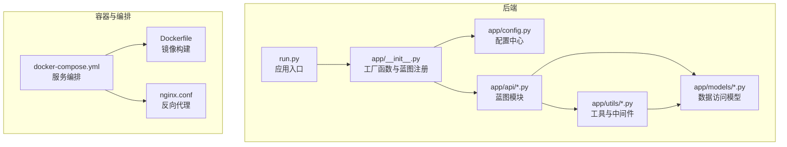
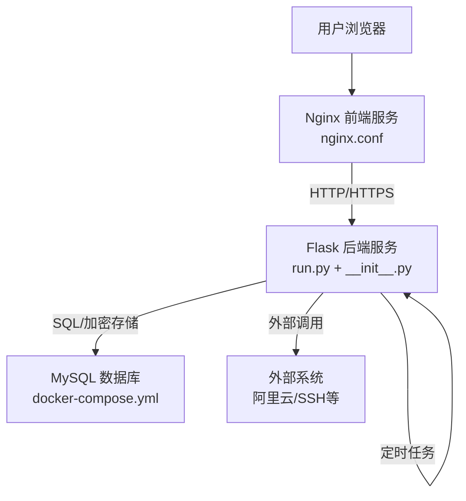
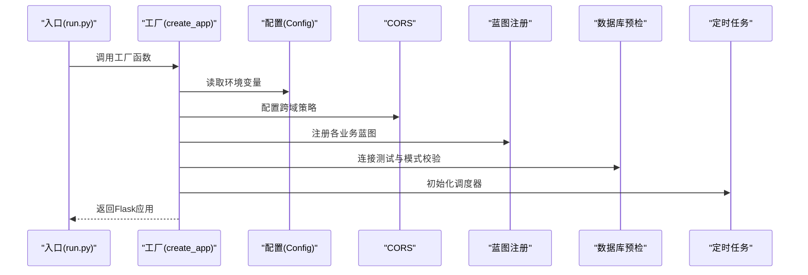
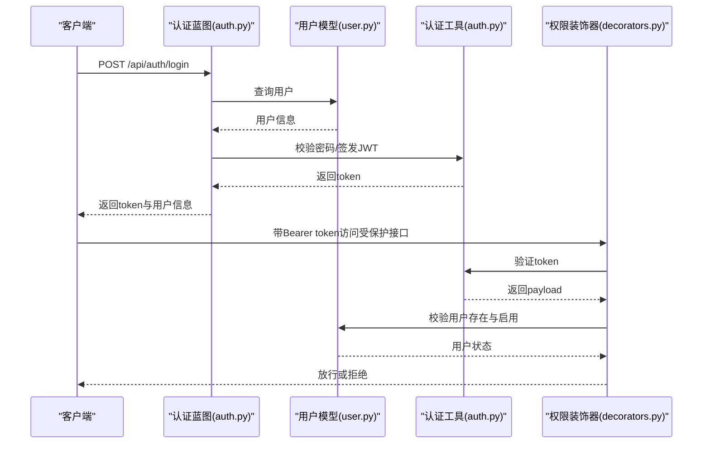
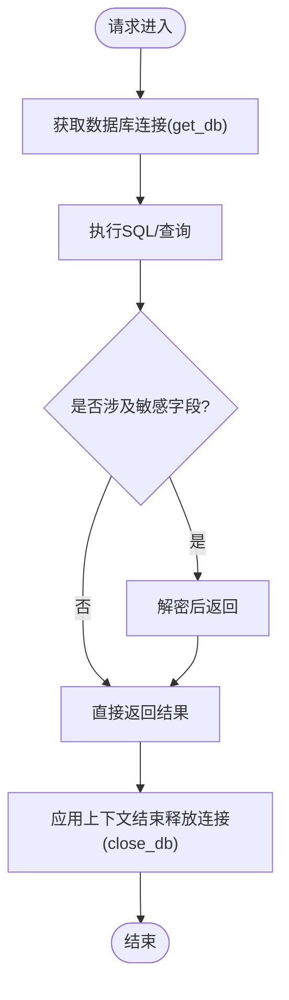
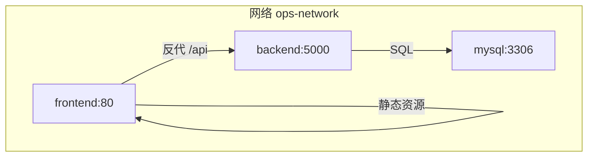
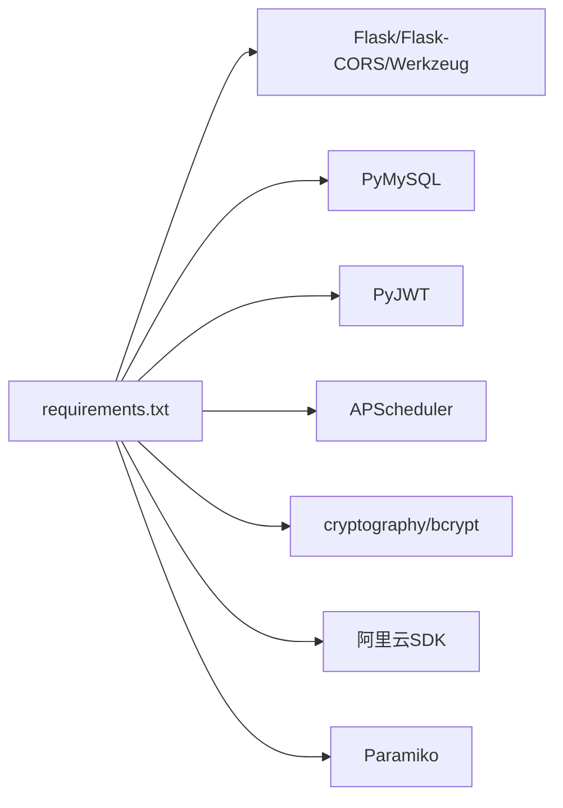

# 系统架构概览

<cite>
**本文引用的文件**
- [backend/app/__init__.py](file://backend/app/__init__.py)
- [backend/app/config.py](file://backend/app/config.py)
- [backend/run.py](file://backend/run.py)
- [backend/Dockerfile](file://backend/Dockerfile)
- [docker-compose.yml](file://docker-compose.yml)
- [nginx.conf](file://nginx.conf)
- [backend/app/api/auth.py](file://backend/app/api/auth.py)
- [backend/app/api/users.py](file://backend/app/api/users.py)
- [backend/app/api/servers.py](file://backend/app/api/servers.py)
- [backend/app/utils/db.py](file://backend/app/utils/db.py)
- [backend/app/utils/auth.py](file://backend/app/utils/auth.py)
- [backend/app/utils/decorators.py](file://backend/app/utils/decorators.py)
- [backend/app/models/user.py](file://backend/app/models/user.py)
- [backend/requirements.txt](file://backend/requirements.txt)
</cite>

## 目录
1. [引言](#引言)
2. [项目结构](#项目结构)
3. [核心组件](#核心组件)
4. [架构总览](#架构总览)
5. [详细组件分析](#详细组件分析)
6. [依赖分析](#依赖分析)
7. [性能考虑](#性能考虑)
8. [故障排查指南](#故障排查指南)
9. [结论](#结论)
10. [附录](#附录)

## 引言
本文件面向OPS平台的系统架构，围绕基于Flask的微服务化后端、模块化的蓝图设计、容器化部署与反向代理、以及从用户请求到数据库操作的完整数据流与控制流进行系统性梳理。文档同时给出架构决策的技术考量与权衡分析，并辅以多种架构图与时序图帮助理解。

## 项目结构
后端采用Flask应用，入口位于run.py，工厂函数create_app在app/__init__.py中完成应用初始化、蓝图注册、CORS配置、数据库预检与定时任务初始化。配置集中于app/config.py，通过环境变量注入。容器化与编排由Dockerfile、docker-compose.yml与nginx.conf共同完成。

图表来源
- [backend/run.py:1-8](file://backend/run.py#L1-L8)
- [backend/app/__init__.py:28-149](file://backend/app/__init__.py#L28-L149)
- [backend/app/config.py:10-58](file://backend/app/config.py#L10-L58)
- [backend/Dockerfile:1-36](file://backend/Dockerfile#L1-L36)
- [docker-compose.yml:1-103](file://docker-compose.yml#L1-L103)
- [nginx.conf:1-70](file://nginx.conf#L1-L70)

章节来源
- [backend/run.py:1-8](file://backend/run.py#L1-L8)
- [backend/app/__init__.py:28-149](file://backend/app/__init__.py#L28-L149)
- [backend/app/config.py:10-58](file://backend/app/config.py#L10-L58)
- [backend/Dockerfile:1-36](file://backend/Dockerfile#L1-L36)
- [docker-compose.yml:1-103](file://docker-compose.yml#L1-L103)
- [nginx.conf:1-70](file://nginx.conf#L1-L70)

## 核心组件
- 应用层（Flask应用）
  - 工厂函数负责配置加载、CORS策略、蓝图注册、数据库预检、定时任务初始化与日志配置。
  - 入口脚本run.py通过工厂函数创建应用实例，开发模式下直接启动，生产模式由Gunicorn托管。
- 服务层（蓝图API）
  - 以蓝图形式组织认证、用户、服务器、证书、监控、任务等业务域，每个蓝图独立维护URL前缀与路由。
  - 权限控制通过装饰器实现JWT校验与角色校验。
- 数据层（MySQL）
  - 通过工具模块统一建立与释放数据库连接，提供日志化连接参数与异常堆栈输出，支持加密存储与解密展示。
- 配置与环境
  - 配置集中于Config类，通过环境变量注入；支持CORS白名单、JWT过期时间、上传目录、定时任务表达式、第三方集成参数等。
- 容器化与编排
  - Dockerfile定义Python基础镜像、系统依赖、Python依赖安装、工作目录与Gunicorn启动命令。
  - docker-compose.yml定义MySQL、后端、前端(Nginx)三服务，网络隔离、健康检查与卷挂载。
  - Nginx配置反向代理/api至后端服务，静态资源直出，支持缓存头与超时参数。

章节来源
- [backend/app/__init__.py:28-149](file://backend/app/__init__.py#L28-L149)
- [backend/app/config.py:10-58](file://backend/app/config.py#L10-L58)
- [backend/run.py:1-8](file://backend/run.py#L1-L8)
- [backend/Dockerfile:1-36](file://backend/Dockerfile#L1-L36)
- [docker-compose.yml:1-103](file://docker-compose.yml#L1-L103)
- [nginx.conf:1-70](file://nginx.conf#L1-L70)

## 架构总览
系统采用“前端静态站点 + Nginx反向代理 + 后端Flask服务 + MySQL数据库”的经典三层架构。Nginx负责静态资源与/api路径转发，后端通过蓝图实现功能解耦，数据库连接按请求上下文缓存与释放，定时任务独立线程池运行。

图表来源
- [nginx.conf:1-70](file://nginx.conf#L1-L70)
- [backend/run.py:1-8](file://backend/run.py#L1-L8)
- [backend/app/__init__.py:28-149](file://backend/app/__init__.py#L28-L149)
- [docker-compose.yml:1-103](file://docker-compose.yml#L1-L103)

## 详细组件分析

### 应用工厂与蓝图注册
- 工厂函数create_app完成以下职责：
  - 加载配置、设置JSON中文输出、CORS策略（支持credentials与自定义headers）、注册蓝图、注册数据库关闭钩子。
  - 启动前进行数据库连接预检与模式校验，确保服务可用性。
  - 初始化定时任务调度器（独立连接，失败不影响应用启动）。
- 蓝图注册涵盖认证、用户、导出、任务、服务器、服务、应用、证书、仪表盘、字典、阿里云凭证、域名、操作日志、监控、项目等模块，实现功能域解耦。

图表来源
- [backend/run.py:1-8](file://backend/run.py#L1-L8)
- [backend/app/__init__.py:28-149](file://backend/app/__init__.py#L28-L149)
- [backend/app/config.py:10-58](file://backend/app/config.py#L10-L58)

章节来源
- [backend/app/__init__.py:28-149](file://backend/app/__init__.py#L28-L149)
- [backend/app/config.py:10-58](file://backend/app/config.py#L10-L58)
- [backend/run.py:1-8](file://backend/run.py#L1-L8)

### 认证与权限控制
- 认证流程
  - 登录接口接收用户名与密码，查询用户并校验激活状态与密码哈希，成功后签发JWT。
  - 个人资料与改密接口均需JWT鉴权。
- 权限控制
  - JWT装饰器校验令牌有效性、用户存在与启用状态、密码变更后的令牌失效逻辑。
  - 角色装饰器校验用户角色，确保管理员操作仅限管理员。

图表来源
- [backend/app/api/auth.py:15-96](file://backend/app/api/auth.py#L15-L96)
- [backend/app/models/user.py:36-71](file://backend/app/models/user.py#L36-L71)
- [backend/app/utils/auth.py:9-28](file://backend/app/utils/auth.py#L9-L28)
- [backend/app/utils/decorators.py:26-123](file://backend/app/utils/decorators.py#L26-L123)

章节来源
- [backend/app/api/auth.py:15-96](file://backend/app/api/auth.py#L15-L96)
- [backend/app/utils/auth.py:9-28](file://backend/app/utils/auth.py#L9-L28)
- [backend/app/utils/decorators.py:26-123](file://backend/app/utils/decorators.py#L26-L123)
- [backend/app/models/user.py:36-71](file://backend/app/models/user.py#L36-L71)

### 数据访问与安全
- 数据库连接
  - 工具模块提供连接参数构造、连接日志脱敏输出、Flask上下文缓存与关闭钩子释放。
- 加密与解密
  - 服务器管理接口在返回敏感字段前进行解密展示，密码更新与存储使用哈希工具。
- 操作日志
  - 关键操作（登录、用户增删改、服务器与证书等）均记录操作日志，便于审计与追踪。

图表来源
- [backend/app/utils/db.py:43-79](file://backend/app/utils/db.py#L43-L79)
- [backend/app/api/servers.py:91-103](file://backend/app/api/servers.py#L91-L103)

章节来源
- [backend/app/utils/db.py:43-79](file://backend/app/utils/db.py#L43-L79)
- [backend/app/api/servers.py:91-103](file://backend/app/api/servers.py#L91-L103)

### 外部系统集成
- 阿里云SDK
  - requirements中引入阿里云相关包，用于域名与证书等外部能力集成，蓝图中预留阿里云凭证管理。
- SSH集成
  - requirements中引入paramiko，用于远程主机连接与自动化脚本执行能力（蓝图中预留相关接口）。

章节来源
- [backend/requirements.txt:11-16](file://backend/requirements.txt#L11-L16)
- [backend/app/api/aliyun_accounts.py:1-200](file://backend/app/api/aliyun_accounts.py#L1-L200)

### 容器化与部署
- 镜像构建
  - 基于python:3.11-slim，安装gcc与MySQL客户端开发包，复制依赖与代码，创建上传目录，暴露5000端口，使用Gunicorn以1个worker+8线程启动。
- 编排与网络
  - docker-compose定义mysql、backend、frontend三服务，使用自定义bridge网络，设置健康检查与卷挂载，后端依赖数据库健康。
- 反向代理
  - Nginx监听80，静态站点根目录指向前端dist，/api前缀反代至backend:5000，设置超时、缓存头与代理头，支持Grafana反代。

图表来源
- [docker-compose.yml:9-103](file://docker-compose.yml#L9-L103)
- [nginx.conf:32-47](file://nginx.conf#L32-L47)

章节来源
- [backend/Dockerfile:1-36](file://backend/Dockerfile#L1-L36)
- [docker-compose.yml:1-103](file://docker-compose.yml#L1-L103)
- [nginx.conf:1-70](file://nginx.conf#L1-L70)

## 依赖分析
- 组件内聚与耦合
  - 蓝图间通过工具模块与模型模块松耦合交互，避免循环依赖；装饰器与认证工具独立，便于复用。
- 外部依赖
  - Flask生态（Flask、Flask-CORS、Werkzeug）、数据库驱动（PyMySQL）、调度（APScheduler）、加解密（cryptography/bcrypt）、JWT（PyJWT）、阿里云SDK、SSH（Paramiko）。
- 潜在风险
  - APScheduler在多进程场景下重复注册定时任务，compose中使用单worker规避；如需扩展需评估并发与锁机制。

图表来源
- [backend/requirements.txt:1-17](file://backend/requirements.txt#L1-L17)

章节来源
- [backend/requirements.txt:1-17](file://backend/requirements.txt#L1-L17)

## 性能考虑
- Web服务器
  - Gunicorn单worker+多线程，避免APScheduler重复注册；线程数可根据CPU与I/O特性调整。
- 数据库
  - 连接按请求上下文缓存，避免频繁建立/销毁；建议在高并发场景下引入连接池或优化查询。
- 反向代理
  - Nginx静态资源缓存与长缓存头减少带宽；代理超时参数需结合后端处理时长调优。
- 定时任务
  - 独立线程池运行，失败仅记录日志不阻塞主流程；建议增加任务执行监控与重试策略。

## 故障排查指南
- 启动阶段
  - 数据库连接预检失败：检查DB_HOST、DB_PORT、DB_USER、DB_PASSWORD、DB_NAME与网络连通性；查看完整异常堆栈定位问题。
- 认证失败
  - 缺少或格式错误的Authorization头、Token过期或被密码变更失效、用户禁用或不存在。
- 权限不足
  - 角色不在允许范围内，或未先通过JWT装饰器校验。
- 数据库异常
  - 连接失败日志包含脱敏后的连接参数，便于快速核对配置；确认MySQL服务健康与账号权限。
- 定时任务
  - 任务未触发或重复：确认compose中单worker配置与调度器初始化日志。

章节来源
- [backend/app/__init__.py:88-111](file://backend/app/__init__.py#L88-L111)
- [backend/app/utils/db.py:48-68](file://backend/app/utils/db.py#L48-L68)
- [backend/app/utils/decorators.py:26-123](file://backend/app/utils/decorators.py#L26-L123)

## 结论
OPS平台采用清晰的三层架构与模块化蓝图设计，结合容器化与反向代理实现前后端分离与可运维性。通过JWT与装饰器实现统一认证与权限控制，数据库连接与日志体系保障稳定性。外部系统集成点（阿里云、SSH）已在依赖与蓝图中预留，便于后续扩展。建议在高并发场景下进一步完善连接池、任务监控与告警策略。

## 附录
- 环境变量与配置要点
  - SECRET_KEY/JWT_SECRET_KEY：生产环境必须设置；JWT_EXPIRATION_HOURS：令牌有效期。
  - DB_*：数据库连接参数；CORS_ORIGINS/CORS_ALLOW_ALL：跨域策略。
  - SSL_CHECK_TIMEOUT/SSL_WARNING_DAYS/DOMAIN_WARNING_DAYS：证书与域名告警阈值。
  - CERT_AUTO_CHECK_CRON/DOMAIN_AUTO_NOTIFY_CRON：定时任务表达式。
  - GRAFANA_URL/GRAFANA_DASHBOARDS：监控面板配置。
- 部署建议
  - 生产环境使用HTTPS回源并配置Cloudflare证书；Nginx反代使用严格模式时需确保后端443证书可用。
  - 后端使用Gunicorn托管，合理设置worker与线程数；数据库使用持久化卷与备份策略。

章节来源
- [backend/app/config.py:10-58](file://backend/app/config.py#L10-L58)
- [docker-compose.yml:36-59](file://docker-compose.yml#L36-L59)
- [nginx.conf:1-70](file://nginx.conf#L1-L70)