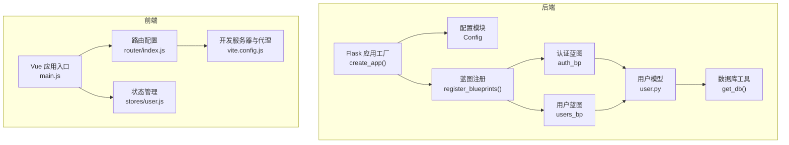
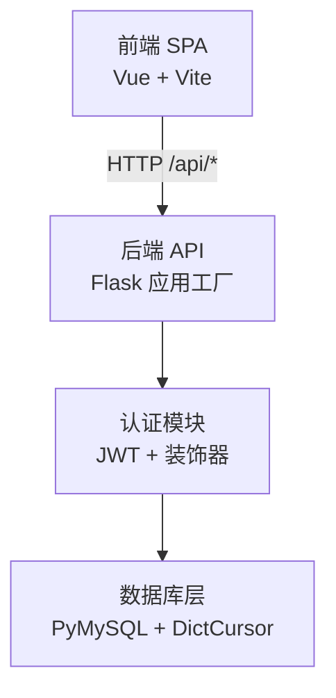
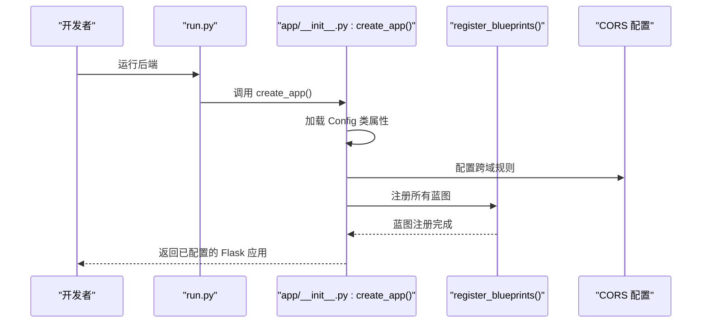
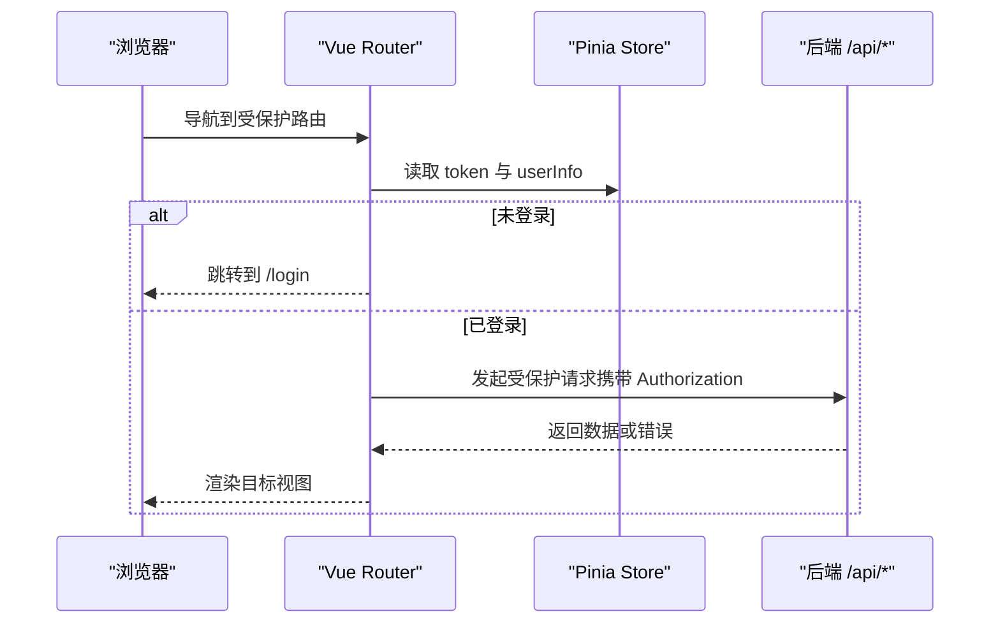
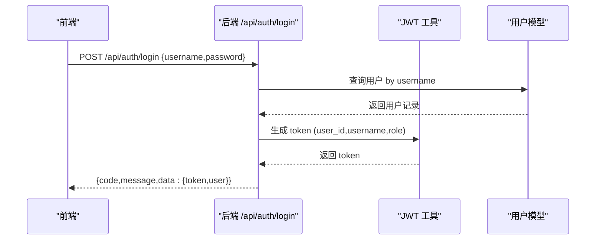
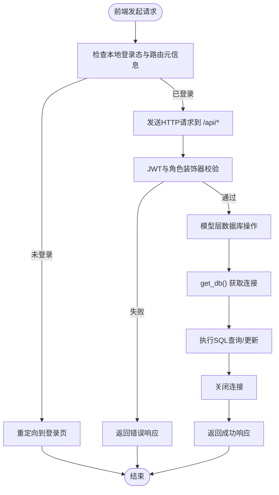
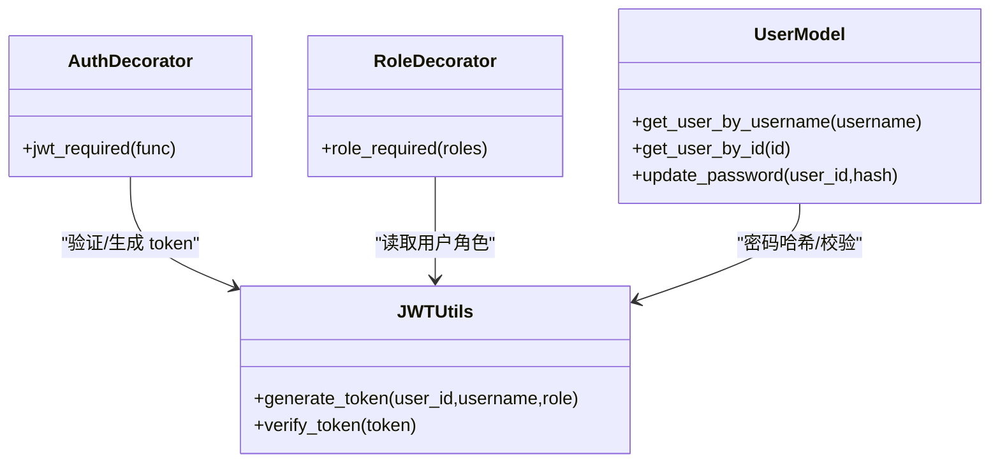
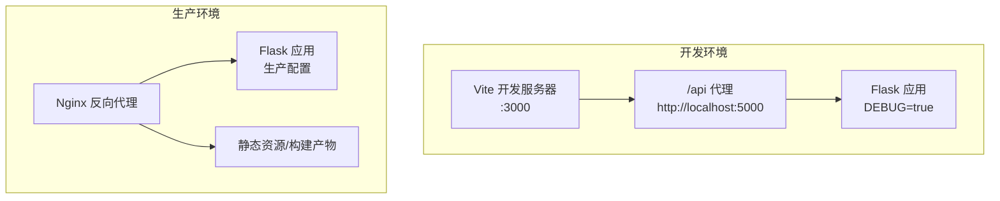
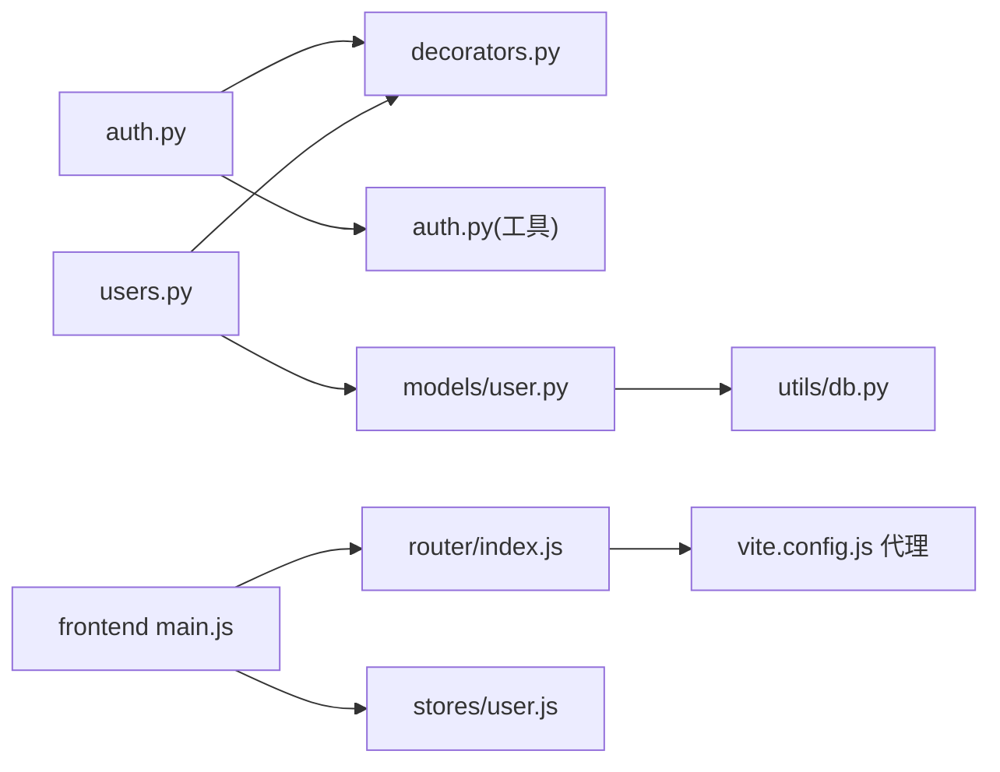

# 系统架构设计

<cite>
**本文引用的文件**
- [backend/app/__init__.py](file://backend/app/__init__.py)
- [backend/app/config.py](file://backend/app/config.py)
- [backend/run.py](file://backend/run.py)
- [backend/app/api/auth.py](file://backend/app/api/auth.py)
- [backend/app/utils/auth.py](file://backend/app/utils/auth.py)
- [backend/app/utils/decorators.py](file://backend/app/utils/decorators.py)
- [backend/app/models/user.py](file://backend/app/models/user.py)
- [backend/app/utils/db.py](file://backend/app/utils/db.py)
- [backend/app/api/users.py](file://backend/app/api/users.py)
- [frontend/src/main.js](file://frontend/src/main.js)
- [frontend/vite.config.js](file://frontend/vite.config.js)
- [frontend/src/router/index.js](file://frontend/src/router/index.js)
- [frontend/src/stores/user.js](file://frontend/src/stores/user.js)
- [frontend/package.json](file://frontend/package.json)
- [backend/requirements.txt](file://backend/requirements.txt)
</cite>

## 目录
1. [引言](#引言)
2. [项目结构](#项目结构)
3. [核心组件](#核心组件)
4. [架构总览](#架构总览)
5. [详细组件分析](#详细组件分析)
6. [依赖关系分析](#依赖关系分析)
7. [性能考虑](#性能考虑)
8. [故障排查指南](#故障排查指南)
9. [结论](#结论)
10. [附录](#附录)

## 引言
本文件面向云运维平台项目，提供系统架构设计文档。该系统采用前后端分离的微服务架构，后端以Flask应用工厂为核心，通过模块化的蓝图组织RESTful API；前端基于Vue 3与Vite构建单页应用（SPA），通过Axios发起HTTP请求并与后端交互。系统采用JWT认证机制实现用户鉴权与权限控制，并通过CORS支持跨域访问。数据库层使用MySQL，通过PyMySQL连接池进行访问。

## 项目结构
项目分为后端与前端两大子工程：
- 后端（Python/Flask）：集中于backend目录，包含应用工厂、配置、蓝图API、模型与工具模块。
- 前端（Vue 3/Vite）：集中于frontend目录，包含路由、状态管理、UI组件与API封装。

**图表来源**
- [backend/app/__init__.py:6-34](file://backend/app/__init__.py#L6-L34)
- [backend/app/__init__.py:37-62](file://backend/app/__init__.py#L37-L62)
- [backend/app/config.py:4-21](file://backend/app/config.py#L4-L21)
- [backend/app/models/user.py:1-183](file://backend/app/models/user.py#L1-L183)
- [backend/app/utils/db.py:1-17](file://backend/app/utils/db.py#L1-L17)
- [frontend/src/main.js:1-23](file://frontend/src/main.js#L1-L23)
- [frontend/src/router/index.js:1-61](file://frontend/src/router/index.js#L1-L61)
- [frontend/src/stores/user.js:1-41](file://frontend/src/stores/user.js#L1-L41)
- [frontend/vite.config.js:1-17](file://frontend/vite.config.js#L1-L17)

**章节来源**
- [backend/app/__init__.py:6-62](file://backend/app/__init__.py#L6-L62)
- [backend/app/config.py:4-21](file://backend/app/config.py#L4-L21)
- [frontend/src/main.js:1-23](file://frontend/src/main.js#L1-L23)
- [frontend/vite.config.js:1-17](file://frontend/vite.config.js#L1-L17)

## 核心组件
- Flask应用工厂：负责初始化Flask实例、加载配置、注册蓝图、启用CORS与定时任务调度器。
- Vue单页应用：负责用户界面渲染、路由导航、状态管理与API调用。
- RESTful API服务：以蓝图形式组织各业务模块（认证、用户、服务器、服务、应用、证书、任务、仪表盘、字典、导出、记录）。
- 数据库层：通过PyMySQL连接MySQL，提供统一的数据库连接获取与关闭逻辑。
- 安全模块：JWT工具、认证装饰器与权限装饰器，保障接口访问安全。

**章节来源**
- [backend/app/__init__.py:6-34](file://backend/app/__init__.py#L6-L34)
- [backend/app/__init__.py:37-62](file://backend/app/__init__.py#L37-L62)
- [backend/app/config.py:4-21](file://backend/app/config.py#L4-L21)
- [backend/app/utils/db.py:1-17](file://backend/app/utils/db.py#L1-L17)
- [backend/app/utils/auth.py:11-35](file://backend/app/utils/auth.py#L11-L35)
- [backend/app/utils/decorators.py:9-95](file://backend/app/utils/decorators.py#L9-L95)

## 架构总览
系统采用前后端分离的微服务架构：
- 前端通过Vite开发服务器启动，本地开发时通过代理将/api前缀请求转发至后端Flask服务。
- 后端以应用工厂模式创建Flask实例，注册多个蓝图提供RESTful API。
- 所有API均受JWT认证装饰器保护，部分接口进一步受角色权限装饰器限制。
- 数据库访问通过统一工具模块完成，确保连接配置一致性与资源释放。

**图表来源**
- [frontend/vite.config.js:6-16](file://frontend/vite.config.js#L6-L16)
- [backend/app/__init__.py:6-34](file://backend/app/__init__.py#L6-L34)
- [backend/app/utils/auth.py:11-35](file://backend/app/utils/auth.py#L11-L35)
- [backend/app/utils/decorators.py:9-95](file://backend/app/utils/decorators.py#L9-L95)
- [backend/app/utils/db.py:1-17](file://backend/app/utils/db.py#L1-L17)

## 详细组件分析

### Flask应用工厂与蓝图组织
- 应用工厂：创建Flask实例、加载配置、根路径返回服务状态、启用CORS、注册所有蓝图、初始化定时任务。
- 蓝图注册：集中于register_blueprints函数，按模块导入并注册认证、用户、导出、任务、服务器、服务、应用、证书、记录、仪表盘、字典等蓝图。
- 配置：Config类集中管理密钥、数据库连接参数、调试与监听地址、上传目录与大小限制等。

**图表来源**
- [backend/run.py:1-8](file://backend/run.py#L1-L8)
- [backend/app/__init__.py:6-34](file://backend/app/__init__.py#L6-L34)
- [backend/app/__init__.py:37-62](file://backend/app/__init__.py#L37-L62)
- [backend/app/config.py:4-21](file://backend/app/config.py#L4-L21)

**章节来源**
- [backend/run.py:1-8](file://backend/run.py#L1-L8)
- [backend/app/__init__.py:6-62](file://backend/app/__init__.py#L6-L62)
- [backend/app/config.py:4-21](file://backend/app/config.py#L4-L21)

### Vue单页应用与路由
- 应用入口：创建Vue实例、挂载Pinia与路由、引入Element Plus及图标。
- 路由配置：定义登录页与主布局下的多级视图，设置路由元信息（是否需要认证、是否管理员）。
- 路由守卫：根据localStorage中的token与用户角色决定放行或跳转至登录页。
- 状态管理：Pinia Store保存token与用户信息，提供登录态计算属性与登出清理逻辑。

**图表来源**
- [frontend/src/router/index.js:35-58](file://frontend/src/router/index.js#L35-L58)
- [frontend/src/stores/user.js:1-41](file://frontend/src/stores/user.js#L1-L41)
- [frontend/src/main.js:1-23](file://frontend/src/main.js#L1-L23)

**章节来源**
- [frontend/src/main.js:1-23](file://frontend/src/main.js#L1-L23)
- [frontend/src/router/index.js:1-61](file://frontend/src/router/index.js#L1-L61)
- [frontend/src/stores/user.js:1-41](file://frontend/src/stores/user.js#L1-L41)

### RESTful API服务与认证流程
- 认证蓝图：提供登录、获取当前用户资料、修改密码接口，均受JWT装饰器保护。
- JWT工具：生成与验证token，设置过期时间与算法；密码哈希与校验。
- 权限装饰器：从Authorization头解析Bearer token，验证后注入g.current_user；角色装饰器校验用户角色。
- 用户模型：封装用户增删改查与密码更新的数据库操作，统一使用get_db()获取连接。

**图表来源**
- [backend/app/api/auth.py:14-82](file://backend/app/api/auth.py#L14-L82)
- [backend/app/utils/auth.py:11-35](file://backend/app/utils/auth.py#L11-L35)
- [backend/app/models/user.py:39-58](file://backend/app/models/user.py#L39-L58)

**章节来源**
- [backend/app/api/auth.py:1-184](file://backend/app/api/auth.py#L1-L184)
- [backend/app/utils/auth.py:11-83](file://backend/app/utils/auth.py#L11-L83)
- [backend/app/utils/decorators.py:9-95](file://backend/app/utils/decorators.py#L9-L95)
- [backend/app/models/user.py:1-183](file://backend/app/models/user.py#L1-L183)

### 数据流向与处理逻辑
- 前端请求：Vue组件通过API模块发起HTTP请求，路由守卫保证登录态与权限。
- 后端API：蓝图接收请求，装饰器进行JWT与角色校验，模型层执行数据库操作。
- 数据库查询：统一通过get_db()建立连接，使用DictCursor返回字典结构结果，finally中关闭连接。
- 结果返回：标准化响应结构（code/message/data），前端根据code处理成功或错误。

**图表来源**
- [frontend/src/router/index.js:35-58](file://frontend/src/router/index.js#L35-L58)
- [backend/app/utils/decorators.py:9-95](file://backend/app/utils/decorators.py#L9-L95)
- [backend/app/utils/db.py:1-17](file://backend/app/utils/db.py#L1-L17)
- [backend/app/models/user.py:1-183](file://backend/app/models/user.py#L1-L183)

**章节来源**
- [frontend/src/router/index.js:1-61](file://frontend/src/router/index.js#L1-L61)
- [backend/app/utils/decorators.py:9-95](file://backend/app/utils/decorators.py#L9-L95)
- [backend/app/utils/db.py:1-17](file://backend/app/utils/db.py#L1-L17)
- [backend/app/models/user.py:1-183](file://backend/app/models/user.py#L1-L183)

### 安全架构
- JWT认证机制：后端生成含用户标识与角色的token，前端存储于localStorage并在请求头携带Authorization: Bearer <token>。
- 权限控制：装饰器链路先JWT校验再角色校验，管理员接口需具备admin角色。
- CORS配置：对/api/*开放跨域访问，允许凭据传输。
- 开发与生产差异：配置项从环境变量读取，生产环境需设置安全密钥与数据库连接参数。

**图表来源**
- [backend/app/utils/decorators.py:9-95](file://backend/app/utils/decorators.py#L9-L95)
- [backend/app/utils/auth.py:11-83](file://backend/app/utils/auth.py#L11-L83)
- [backend/app/models/user.py:1-183](file://backend/app/models/user.py#L1-L183)

**章节来源**
- [backend/app/utils/auth.py:11-83](file://backend/app/utils/auth.py#L11-L83)
- [backend/app/utils/decorators.py:9-95](file://backend/app/utils/decorators.py#L9-L95)
- [backend/app/__init__.py:24-25](file://backend/app/__init__.py#L24-L25)
- [backend/app/config.py:4-21](file://backend/app/config.py#L4-L21)

### 部署架构与环境差异
- 开发环境：前端Vite本地开发服务器监听3000端口，通过代理将/api请求转发至后端Flask（默认5000端口）。后端DEBUG开启，监听0.0.0.0。
- 生产环境：建议使用Nginx作为反向代理，将/api前缀转发至后端服务，静态资源由Nginx提供或前端构建产物托管。后端生产环境需设置安全密钥与数据库连接参数，关闭DEBUG。
- 依赖：后端依赖Flask、Flask-CORS、PyMySQL、PyJWT、Werkzeug、APScheduler、OpenPyXL、Cryptography；前端依赖Vue 3、Vue Router、Pinia、Element Plus、Axios。

**图表来源**
- [frontend/vite.config.js:6-16](file://frontend/vite.config.js#L6-L16)
- [backend/run.py:6-7](file://backend/run.py#L6-L7)
- [backend/app/config.py:15-17](file://backend/app/config.py#L15-L17)

**章节来源**
- [frontend/vite.config.js:1-17](file://frontend/vite.config.js#L1-L17)
- [backend/run.py:1-8](file://backend/run.py#L1-L8)
- [backend/app/config.py:15-17](file://backend/app/config.py#L15-L17)
- [backend/requirements.txt:1-9](file://backend/requirements.txt#L1-L9)
- [frontend/package.json:11-22](file://frontend/package.json#L11-L22)

## 依赖关系分析
- 组件耦合：后端蓝图与模型松耦合，通过工具模块统一访问数据库；认证与权限装饰器独立于具体业务蓝图。
- 外部依赖：后端依赖Flask生态与数据库驱动；前端依赖Vue生态与HTTP客户端。
- 潜在风险：若装饰器链顺序不当可能导致权限绕过；数据库连接未正确关闭可能造成资源泄漏。

**图表来源**
- [backend/app/api/auth.py:1-184](file://backend/app/api/auth.py#L1-L184)
- [backend/app/utils/decorators.py:9-95](file://backend/app/utils/decorators.py#L9-L95)
- [backend/app/utils/auth.py:11-83](file://backend/app/utils/auth.py#L11-L83)
- [backend/app/api/users.py:1-268](file://backend/app/api/users.py#L1-L268)
- [backend/app/models/user.py:1-183](file://backend/app/models/user.py#L1-L183)
- [backend/app/utils/db.py:1-17](file://backend/app/utils/db.py#L1-L17)
- [frontend/src/main.js:1-23](file://frontend/src/main.js#L1-L23)
- [frontend/src/router/index.js:1-61](file://frontend/src/router/index.js#L1-L61)
- [frontend/src/stores/user.js:1-41](file://frontend/src/stores/user.js#L1-L41)
- [frontend/vite.config.js:6-16](file://frontend/vite.config.js#L6-L16)

**章节来源**
- [backend/app/api/auth.py:1-184](file://backend/app/api/auth.py#L1-L184)
- [backend/app/api/users.py:1-268](file://backend/app/api/users.py#L1-L268)
- [backend/app/models/user.py:1-183](file://backend/app/models/user.py#L1-L183)
- [frontend/src/main.js:1-23](file://frontend/src/main.js#L1-L23)
- [frontend/src/router/index.js:1-61](file://frontend/src/router/index.js#L1-L61)
- [frontend/src/stores/user.js:1-41](file://frontend/src/stores/user.js#L1-L41)

## 性能考虑
- 数据库连接：统一通过工具模块获取连接，避免重复连接与资源泄漏；建议在生产环境启用连接池与超时控制。
- 接口响应：保持响应结构一致，减少前端分支判断；对大列表分页查询，避免一次性返回过多数据。
- 前端缓存：利用Pinia缓存用户信息与常用数据，减少重复请求；路由懒加载提升首屏性能。
- CORS与代理：开发环境代理简化跨域问题；生产环境由Nginx统一处理跨域与静态资源优化。

## 故障排查指南
- 登录失败：检查用户名/密码是否正确，确认用户状态是否激活；查看后端日志与响应code/message。
- Token无效：确认Authorization头格式为Bearer <token>，检查JWT密钥与过期时间配置；核对前端是否正确存储与传递token。
- 权限不足：确认用户角色是否满足接口要求；检查装饰器顺序（JWT必须在角色之前）。
- 数据库连接异常：检查DB_HOST/DB_PORT/DB_USER/DB_PASSWORD/DB_NAME配置；确认网络连通性与MySQL服务状态。
- 跨域问题：确认后端CORS配置对/api/*开放；开发环境检查Vite代理target是否正确。

**章节来源**
- [backend/app/api/auth.py:14-82](file://backend/app/api/auth.py#L14-L82)
- [backend/app/utils/decorators.py:9-95](file://backend/app/utils/decorators.py#L9-L95)
- [backend/app/utils/auth.py:38-56](file://backend/app/utils/auth.py#L38-L56)
- [backend/app/utils/db.py:1-17](file://backend/app/utils/db.py#L1-L17)
- [backend/app/__init__.py:24-25](file://backend/app/__init__.py#L24-L25)
- [frontend/vite.config.js:9-14](file://frontend/vite.config.js#L9-L14)

## 结论
本系统通过Flask应用工厂与蓝图实现了清晰的模块化API组织，结合JWT认证与权限装饰器提供了完善的访问控制；前端Vue应用通过路由守卫与状态管理保障了用户体验与安全性。开发与生产环境的差异通过配置与Nginx代理得以明确区分，整体架构具备良好的扩展性与可维护性。

## 附录
- 关键配置项：后端配置类集中管理密钥、数据库与调试参数；前端通过Vite代理与开发服务器协作。
- 依赖清单：后端与前端依赖分别在requirements.txt与package.json中声明，便于安装与升级。

**章节来源**
- [backend/app/config.py:4-21](file://backend/app/config.py#L4-L21)
- [frontend/package.json:11-22](file://frontend/package.json#L11-L22)
- [backend/requirements.txt:1-9](file://backend/requirements.txt#L1-L9)