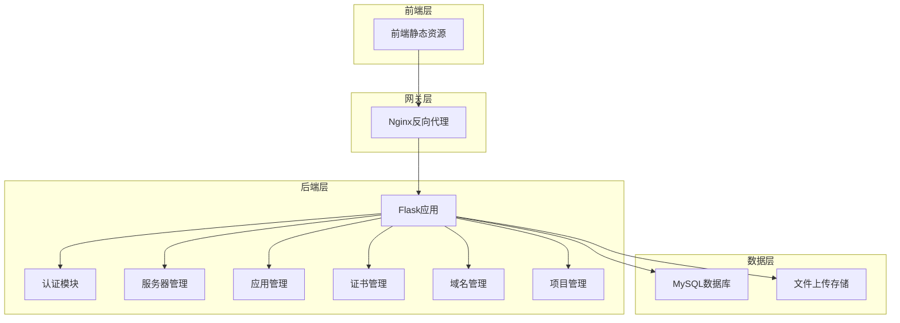
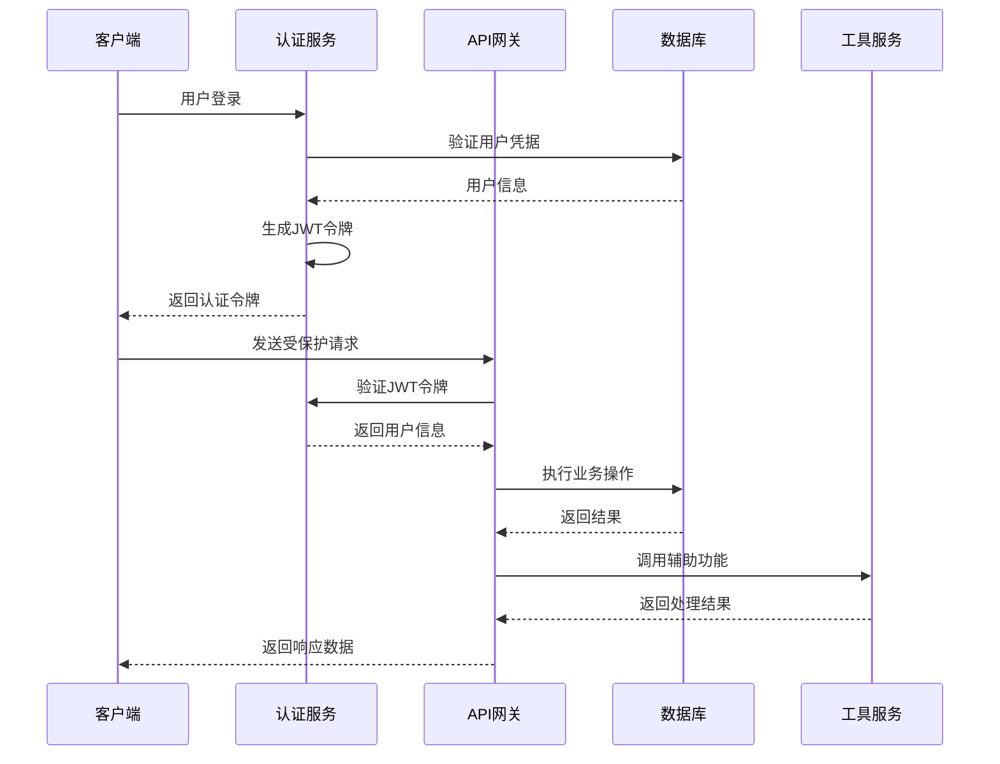
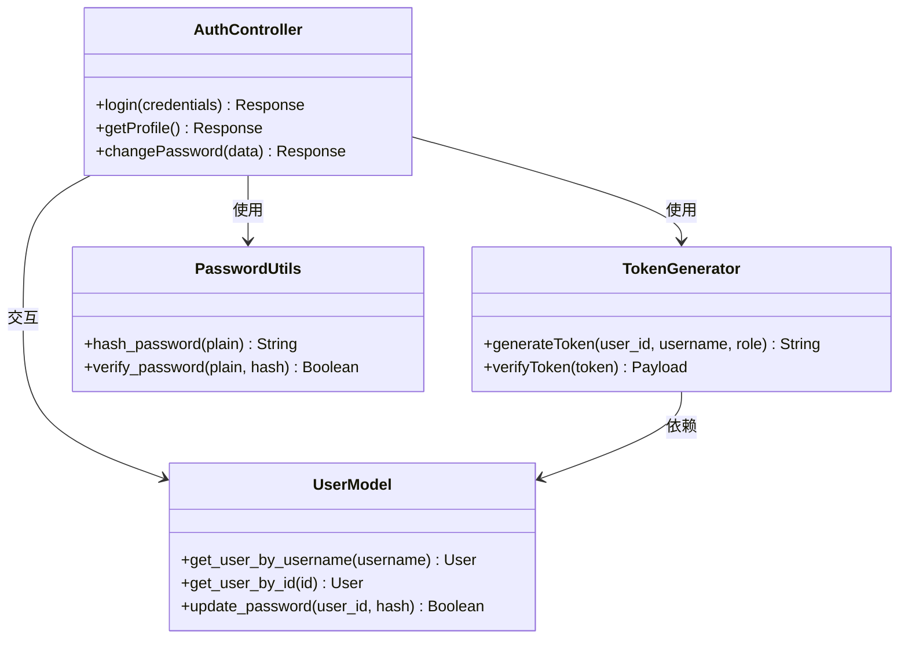
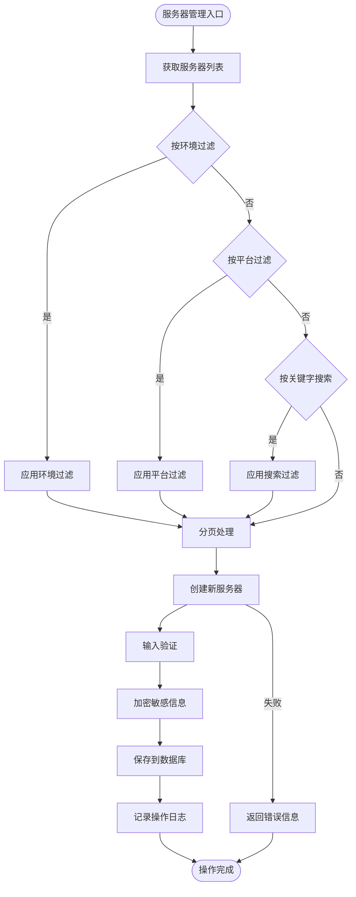
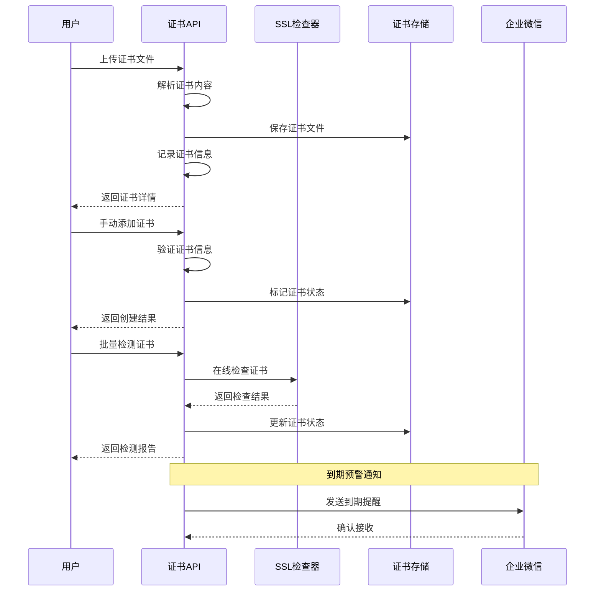
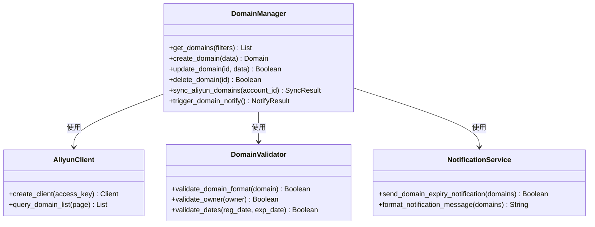
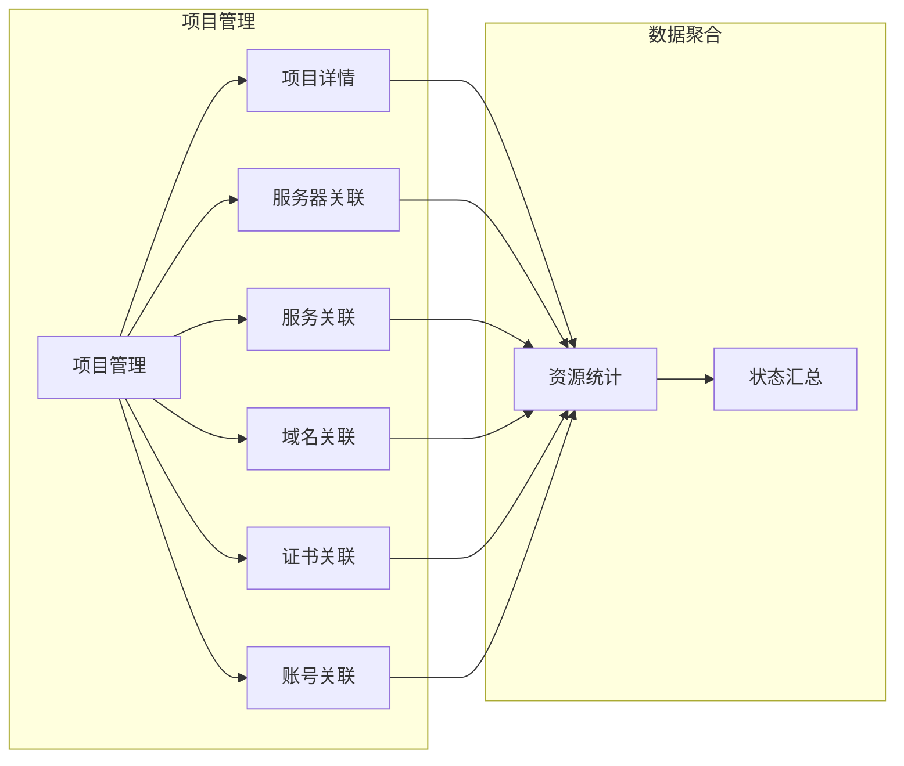

# 项目介绍

<cite>
**本文档引用的文件**
- [backend/app/__init__.py](file://backend/app/__init__.py)
- [backend/app/config.py](file://backend/app/config.py)
- [backend/run.py](file://backend/run.py)
- [docker-compose.yml](file://docker-compose.yml)
- [nginx.conf](file://nginx.conf)
- [backend/app/api/servers.py](file://backend/app/api/servers.py)
- [backend/app/api/apps.py](file://backend/app/api/apps.py)
- [backend/app/api/certs.py](file://backend/app/api/certs.py)
- [backend/app/api/domains.py](file://backend/app/api/domains.py)
- [backend/app/api/projects.py](file://backend/app/api/projects.py)
- [backend/app/api/auth.py](file://backend/app/api/auth.py)
- [backend/app/utils/auth.py](file://backend/app/utils/auth.py)
- [backend/app/models/user.py](file://backend/app/models/user.py)
- [backend/requirements.txt](file://backend/requirements.txt)
</cite>

## 目录
1. [引言](#引言)
2. [项目结构](#项目结构)
3. [核心组件](#核心组件)
4. [架构概览](#架构概览)
5. [详细组件分析](#详细组件分析)
6. [依赖分析](#依赖分析)
7. [性能考虑](#性能考虑)
8. [故障排除指南](#故障排除指南)
9. [结论](#结论)

## 引言

OPS运维管理平台是一个企业级的综合运维管理系统，旨在解决现代企业面临的复杂运维挑战。该平台通过统一的管理界面，实现了对多环境服务器、应用服务、证书域名等关键运维资产的集中化管理。

### 核心目标与使命

平台的核心目标是：
- **统一化管理**：将分散在不同环境和系统中的运维资产整合到一个统一平台
- **自动化运维**：通过内置的自动化机制减少重复性手工操作
- **安全保障**：提供完善的权限控制和操作审计功能
- **可视化监控**：通过直观的界面展示运维状态和趋势

### 平台定位与价值

OPS平台定位于企业级运维管理解决方案，特别适合：
- 中大型企业的多环境运维管理需求
- 需要统一证书和域名管理的企业
- 追求自动化和标准化运维流程的组织
- 对安全性和合规性要求较高的企业

平台的核心价值体现在：
- **提升运维效率**：通过集中管理和自动化减少人工干预
- **降低运营成本**：标准化流程和自动化减少人力成本
- **增强安全性**：完善的权限控制和操作审计保障系统安全
- **提高可靠性**：统一监控和预警机制提升系统稳定性

## 项目结构

项目采用典型的前后端分离架构，后端基于Flask框架构建RESTful API服务。

**图表来源**
- [backend/app/__init__.py:28-113](file://backend/app/__init__.py#L28-L113)
- [docker-compose.yml:9-102](file://docker-compose.yml#L9-L102)

### 目录结构说明

- **backend/**: 后端应用程序代码
  - **app/**: Flask应用主目录
  - **api/**: 各功能模块的API接口
  - **utils/**: 工具类和通用功能
  - **models/**: 数据模型定义
  - **uploads/**: 文件上传目录
- **docker-compose.yml**: 容器编排配置
- **nginx.conf**: Nginx反向代理配置

## 核心组件

平台由多个相互协作的功能模块组成，每个模块负责特定的运维管理领域。

### 认证授权模块
- **功能**：提供用户身份认证、权限管理和会话控制
- **技术实现**：基于JWT的无状态认证机制
- **安全特性**：支持密码哈希、角色权限控制

### 服务器管理模块
- **功能**：多环境服务器的全生命周期管理
- **特性**：支持服务器分类、环境隔离、项目关联
- **安全**：敏感信息加密存储，操作审计

### 应用管理模块
- **功能**：应用系统账号的统一管理
- **特性**：支持多项目关联，密码加密存储
- **集成**：与服务器管理模块无缝集成

### 证书管理模块
- **功能**：SSL/TLS证书的全生命周期管理
- **特性**：支持手动录入和文件上传，自动检测
- **集成**：与阿里云证书服务对接

### 域名管理模块
- **功能**：域名注册和到期管理
- **特性**：支持手动录入和阿里云同步
- **预警**：自动化的域名到期预警通知

### 项目管理模块
- **功能**：项目的统一管理视图
- **特性**：聚合展示项目关联的所有资源
- **关联**：与各功能模块深度集成

**章节来源**
- [backend/app/api/auth.py:15-95](file://backend/app/api/auth.py#L15-L95)
- [backend/app/api/servers.py:14-170](file://backend/app/api/servers.py#L14-L170)
- [backend/app/api/apps.py:14-117](file://backend/app/api/apps.py#L14-L117)
- [backend/app/api/certs.py:154-241](file://backend/app/api/certs.py#L154-L241)
- [backend/app/api/domains.py:34-111](file://backend/app/api/domains.py#L34-L111)
- [backend/app/api/projects.py:13-86](file://backend/app/api/projects.py#L13-L86)

## 架构概览

平台采用微服务化的API架构设计，通过RESTful接口实现模块间的松耦合通信。

**图表来源**
- [backend/app/api/auth.py:15-95](file://backend/app/api/auth.py#L15-L95)
- [backend/app/utils/auth.py:9-28](file://backend/app/utils/auth.py#L9-L28)
- [backend/app/__init__.py:116-149](file://backend/app/__init__.py#L116-L149)

### 技术栈选择

平台采用现代化的技术栈组合：
- **后端框架**：Flask 3.0+，轻量级但功能强大的Web框架
- **数据库**：MySQL 8.0，企业级关系型数据库
- **部署**：Docker容器化部署，支持快速扩展
- **反向代理**：Nginx，提供静态资源服务和负载均衡
- **任务调度**：APScheduler，支持定时任务执行

## 详细组件分析

### 认证授权系统

认证系统是整个平台的安全基石，采用JWT（JSON Web Token）实现无状态认证。

**图表来源**
- [backend/app/api/auth.py:15-197](file://backend/app/api/auth.py#L15-L197)
- [backend/app/utils/auth.py:9-45](file://backend/app/utils/auth.py#L9-L45)
- [backend/app/models/user.py:36-162](file://backend/app/models/user.py#L36-L162)

#### 认证流程

1. **用户登录**：客户端提交用户名和密码
2. **凭据验证**：系统验证用户是否存在且密码正确
3. **令牌生成**：成功后生成JWT访问令牌
4. **会话建立**：客户端使用令牌访问受保护资源
5. **令牌验证**：每次请求都验证JWT的有效性

#### 权限控制

平台支持三种用户角色：
- **admin**：管理员，拥有所有权限
- **operator**：运维操作员，具备大部分操作权限
- **viewer**：只读查看员，仅能查看信息

**章节来源**
- [backend/app/api/auth.py:15-95](file://backend/app/api/auth.py#L15-L95)
- [backend/app/utils/auth.py:31-45](file://backend/app/utils/auth.py#L31-L45)
- [backend/app/models/user.py:8-33](file://backend/app/models/user.py#L8-L33)

### 服务器管理系统

服务器管理模块提供了完整的服务器生命周期管理功能。

**图表来源**
- [backend/app/api/servers.py:14-115](file://backend/app/api/servers.py#L14-L115)
- [backend/app/api/servers.py:189-354](file://backend/app/api/servers.py#L189-L354)

#### 核心功能特性

1. **多环境支持**：支持开发、测试、生产等多环境服务器管理
2. **平台兼容**：支持Linux、Windows等多种操作系统平台
3. **项目关联**：服务器可以关联到具体的业务项目
4. **安全存储**：操作系统密码和Docker密码采用加密存储
5. **操作审计**：所有服务器操作都会记录详细的操作日志

#### 数据验证机制

系统对服务器信息进行全面的验证：
- **主机名验证**：确保符合DNS规范
- **IP地址验证**：支持IPv4和IPv6地址格式
- **长度限制**：对各种字段设置合理的长度限制
- **格式检查**：验证证书路径等特殊字段格式

**章节来源**
- [backend/app/api/servers.py:14-170](file://backend/app/api/servers.py#L14-L170)
- [backend/app/api/servers.py:189-354](file://backend/app/api/servers.py#L189-L354)

### 证书管理模块

证书管理模块提供了SSL/TLS证书的全生命周期管理能力。

**图表来源**
- [backend/app/api/certs.py:323-465](file://backend/app/api/certs.py#L323-L465)
- [backend/app/api/certs.py:585-707](file://backend/app/api/certs.py#L585-L707)
- [backend/app/api/certs.py:799-800](file://backend/app/api/certs.py#L799-L800)

#### 证书处理能力

1. **文件解析**：自动解析PEM格式的证书文件
2. **信息提取**：提取域名、颁发机构、有效期等关键信息
3. **状态监控**：定期检查证书的有效性和状态
4. **到期预警**：提前发送证书到期提醒通知
5. **文件管理**：安全存储证书和私钥文件

#### 阿里云集成

平台支持与阿里云证书服务的深度集成：
- **证书同步**：自动从阿里云同步证书信息
- **状态同步**：实时同步证书的在线状态
- **告警联动**：结合阿里云的告警机制

**章节来源**
- [backend/app/api/certs.py:154-241](file://backend/app/api/certs.py#L154-L241)
- [backend/app/api/certs.py:323-465](file://backend/app/api/certs.py#L323-L465)
- [backend/app/api/certs.py:585-707](file://backend/app/api/certs.py#L585-L707)

### 域名管理模块

域名管理模块专注于域名的全生命周期管理和服务。

**图表来源**
- [backend/app/api/domains.py:34-111](file://backend/app/api/domains.py#L34-L111)
- [backend/app/api/domains.py:335-594](file://backend/app/api/domains.py#L335-L594)
- [backend/app/api/domains.py:596-663](file://backend/app/api/domains.py#L596-L663)

#### 核心管理功能

1. **域名同步**：支持从阿里云自动同步域名信息
2. **状态监控**：实时监控域名的注册状态和到期时间
3. **到期预警**：基于配置的预警天数自动发送通知
4. **项目关联**：域名可以关联到具体的业务项目
5. **统计分析**：提供域名状态的统计和报表功能

#### 阿里云SDK集成

平台集成了阿里云域名管理SDK：
- **认证配置**：支持通过阿里云AccessKey进行认证
- **批量查询**：支持分页批量获取域名列表
- **状态解析**：自动解析域名的各种状态信息
- **错误处理**：完善的异常处理和重试机制

**章节来源**
- [backend/app/api/domains.py:34-111](file://backend/app/api/domains.py#L34-L111)
- [backend/app/api/domains.py:335-594](file://backend/app/api/domains.py#L335-L594)
- [backend/app/api/domains.py:596-663](file://backend/app/api/domains.py#L596-L663)

### 项目管理模块

项目管理模块提供了一个统一的视图来管理相关的运维资源。

**图表来源**
- [backend/app/api/projects.py:13-86](file://backend/app/api/projects.py#L13-L86)
- [backend/app/api/projects.py:153-258](file://backend/app/api/projects.py#L153-L258)

#### 项目聚合视图

项目管理模块的核心特色是提供资源聚合视图：
- **服务器统计**：显示项目关联的服务器数量和状态
- **服务概览**：展示项目内的服务分布和版本信息
- **域名清单**：列出项目相关的域名及其到期状态
- **证书管理**：集中展示项目证书的到期情况
- **账号信息**：统一管理项目相关的应用账号

#### 关联管理

平台支持灵活的资源关联机制：
- **服务器关联**：支持批量关联和取消关联服务器
- **服务管理**：通过项目视图统一管理服务
- **资源清理**：删除项目时自动清理关联关系

**章节来源**
- [backend/app/api/projects.py:13-86](file://backend/app/api/projects.py#L13-L86)
- [backend/app/api/projects.py:153-258](file://backend/app/api/projects.py#L153-L258)
- [backend/app/api/projects.py:385-465](file://backend/app/api/projects.py#L385-L465)

## 依赖分析

平台的依赖关系相对简单，主要集中在核心框架和数据库连接上。

```mermaid
graph TB
subgraph "核心依赖"
Flask[Flask 3.0+]
PyMySQL[PyMySQL 1.1+]
JWT[PyJWT 2.8+]
APScheduler[APScheduler 3.10+]
end
subgraph "安全依赖"
Cryptography[Cryptography 41.0+]
Bcrypt[Bcrypt 4.0+]
end
subgraph "阿里云依赖"
DomainSDK[alibabacloud_domain20180129]
CasSDK[alibabacloud_cas20200407]
OpenAPI[alibabacloud_tea_openapi]
Credentials[alibabacloud_credentials]
Util[alibabacloud_tea_util]
end
subgraph "其他依赖"
Paramiko[Paramiko 3.0+]
Excel[OpenPyXL 3.1+]
Gunicorn[Gunicorn 22.0+]
CORS[Flask-CORS 4.0+]
end
Flask --> PyMySQL
Flask --> JWT
Flask --> APScheduler
Flask --> CORS
Flask --> Gunicorn
Flask --> Cryptography
Flask --> Bcrypt
Flask --> DomainSDK
Flask --> CasSDK
Flask --> OpenAPI
Flask --> Credentials
Flask --> Util
Flask --> Paramiko
Flask --> Excel
```

**图表来源**
- [backend/requirements.txt:1-17](file://backend/requirements.txt#L1-L17)

### 关键依赖说明

1. **Flask生态**：提供Web框架、CORS支持、WSGI服务器
2. **数据库连接**：PyMySQL提供MySQL数据库连接
3. **安全工具**：Cryptography和Bcrypt提供加密和密码哈希
4. **任务调度**：APScheduler支持定时任务执行
5. **阿里云集成**：完整的阿里云SDK套件
6. **SSH支持**：Paramiko提供SSH连接功能

### 版本兼容性

平台选择了稳定且功能完整的依赖版本组合：
- **Python 3.8+**：支持最新的语言特性和性能优化
- **Flask 3.0+**：提供更好的性能和安全性
- **MySQL 8.0**：支持最新的数据库特性
- **Docker 3.8+**：容器化部署的最佳实践

**章节来源**
- [backend/requirements.txt:1-17](file://backend/requirements.txt#L1-L17)

## 性能考虑

平台在设计时充分考虑了性能优化和可扩展性。

### 数据库优化

1. **连接池管理**：通过PyMySQL的连接池机制减少连接开销
2. **索引策略**：为常用查询字段建立合适的索引
3. **查询优化**：使用分页查询避免大数据量影响
4. **事务管理**：合理使用事务确保数据一致性

### 缓存策略

1. **JWT令牌**：无状态认证减少服务器状态存储
2. **静态资源缓存**：Nginx提供静态资源缓存
3. **会话管理**：基于令牌的会话管理减少服务器压力

### 并发处理

1. **异步任务**：使用APScheduler处理定时任务
2. **并发控制**：Gunicorn提供多进程并发处理
3. **资源限制**：Docker容器提供资源隔离和限制

## 故障排除指南

### 常见问题诊断

#### 认证相关问题

1. **登录失败**
   - 检查用户名和密码是否正确
   - 验证用户是否被禁用
   - 确认JWT密钥配置正确

2. **令牌过期**
   - 检查JWT过期时间配置
   - 验证系统时间同步
   - 确认客户端正确处理令牌刷新

#### 数据库连接问题

1. **连接超时**
   - 检查MySQL服务状态
   - 验证网络连通性
   - 确认连接参数配置正确

2. **连接池耗尽**
   - 检查应用日志中的连接状态
   - 调整连接池大小配置
   - 优化查询性能减少连接占用

#### 证书管理问题

1. **证书解析失败**
   - 确认证书格式为PEM格式
   - 检查证书内容完整性
   - 验证证书链的正确性

2. **SSL检测失败**
   - 检查网络连通性
   - 验证域名解析正确性
   - 确认防火墙规则允许访问

#### 阿里云集成问题

1. **API调用失败**
   - 检查AccessKey配置
   - 验证网络访问权限
   - 确认API调用频率限制

2. **同步数据不一致**
   - 检查同步任务状态
   - 验证数据转换逻辑
   - 确认冲突处理机制

### 日志分析

平台提供了多层次的日志记录：
- **应用日志**：记录业务操作和系统事件
- **数据库日志**：记录SQL执行和错误信息
- **系统日志**：记录系统启动和运行状态
- **访问日志**：记录HTTP请求和响应信息

### 监控指标

建议关注以下关键指标：
- **响应时间**：API请求的平均响应时间
- **错误率**：各类错误的发生频率
- **数据库性能**：查询执行时间和连接数
- **资源使用**：CPU、内存、磁盘使用情况

**章节来源**
- [backend/app/__init__.py:10-25](file://backend/app/__init__.py#L10-L25)
- [backend/app/api/auth.py:47-61](file://backend/app/api/auth.py#L47-L61)
- [backend/app/api/certs.py:382-383](file://backend/app/api/certs.py#L382-L383)

## 结论

OPS运维管理平台是一个功能完善、架构清晰的企业级运维管理解决方案。通过统一的管理界面和强大的自动化能力，平台有效解决了现代企业面临的复杂运维挑战。

### 主要优势

1. **功能完整性**：涵盖了服务器、应用、证书、域名等核心运维领域
2. **安全性保障**：完善的认证授权和数据加密机制
3. **自动化程度高**：支持定时任务和批量操作
4. **易于扩展**：模块化设计便于功能扩展和定制
5. **部署友好**：Docker容器化部署简化了部署流程

### 适用场景

- **多环境管理**：需要管理开发、测试、生产等多个环境的企业
- **证书集中管理**：需要统一管理SSL证书的组织
- **域名监控**：需要监控域名状态和到期时间的公司
- **团队协作**：需要多人协作管理运维资源的团队

### 发展方向

平台在未来可以进一步发展的方向包括：
- **监控告警**：集成更完善的监控和告警机制
- **自动化部署**：支持应用的自动化部署和回滚
- **配置管理**：提供配置文件的版本管理和变更追踪
- **成本分析**：提供运维成本的统计和分析功能

通过持续的优化和完善，OPS平台将成为企业数字化转型过程中不可或缺的重要工具。