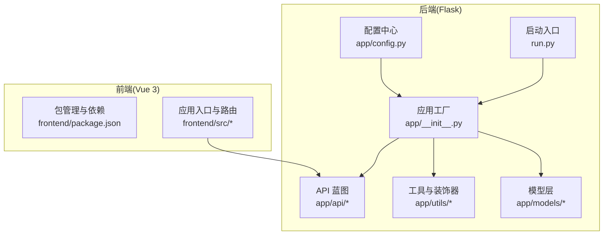
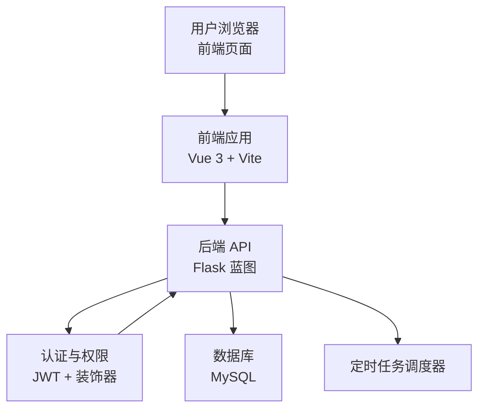
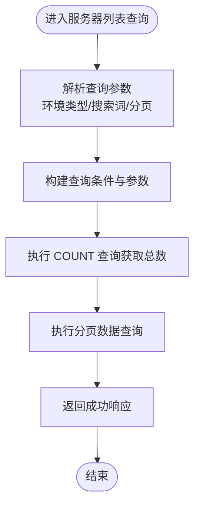
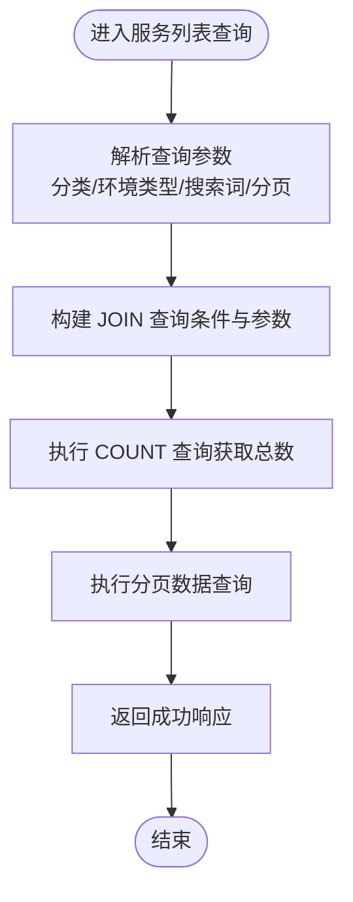
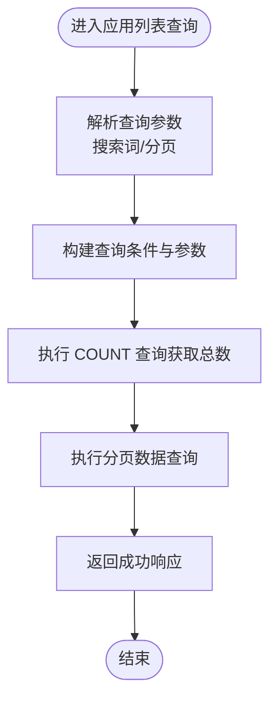
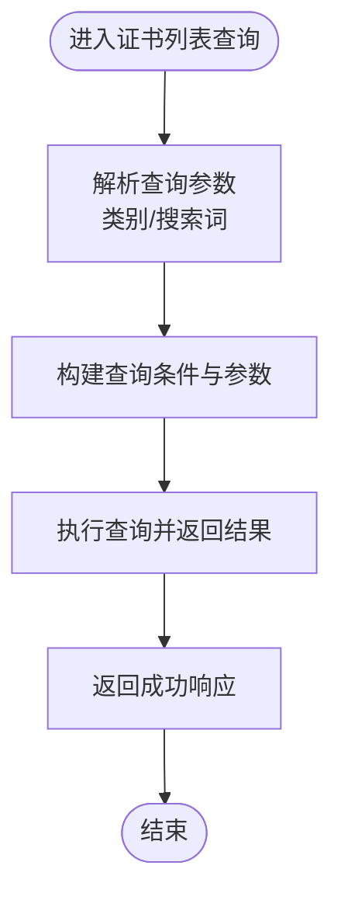
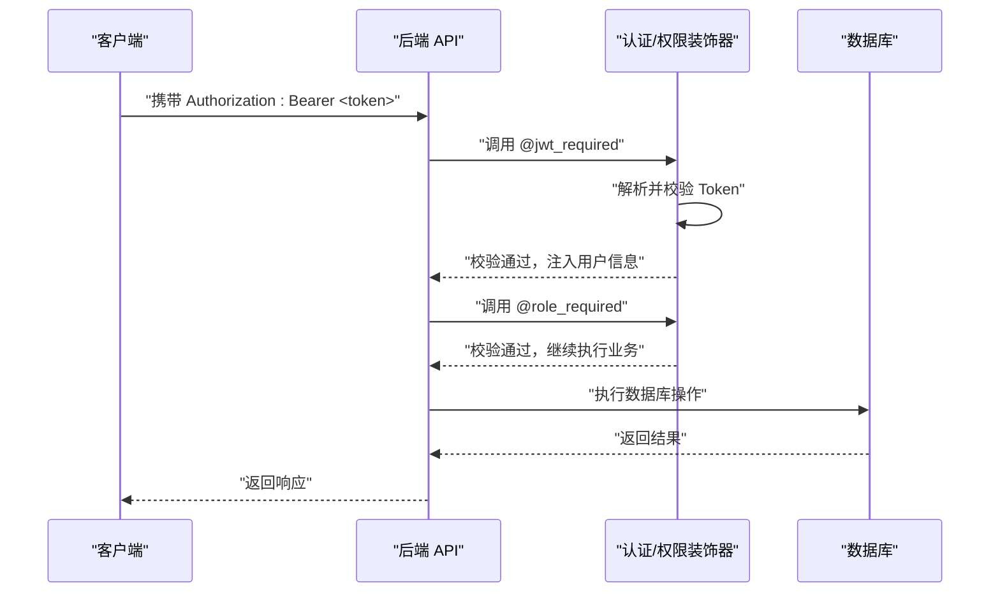
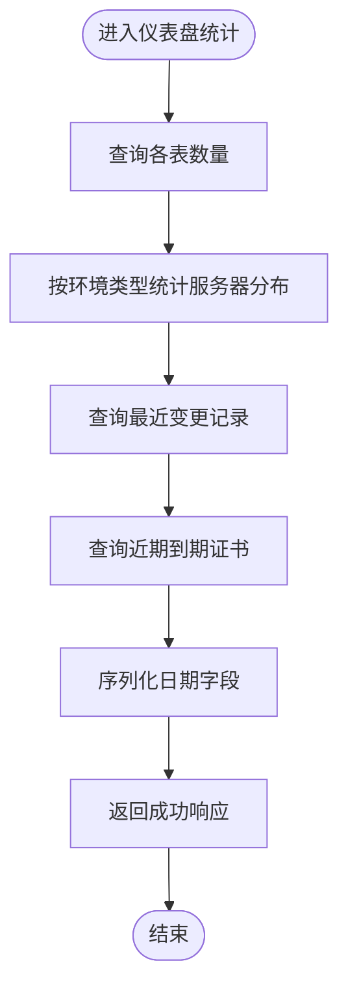
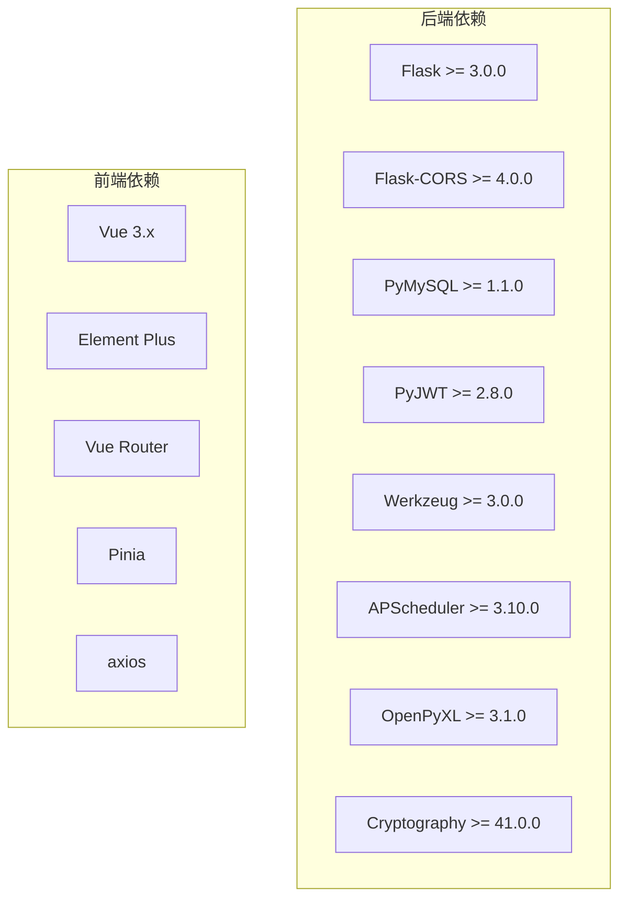

# 项目介绍

<cite>
**本文引用的文件**
- [backend/app/__init__.py](file://backend/app/__init__.py)
- [backend/app/config.py](file://backend/app/config.py)
- [backend/run.py](file://backend/run.py)
- [backend/requirements.txt](file://backend/requirements.txt)
- [backend/app/api/servers.py](file://backend/app/api/servers.py)
- [backend/app/api/services.py](file://backend/app/api/services.py)
- [backend/app/api/apps.py](file://backend/app/api/apps.py)
- [backend/app/api/certs.py](file://backend/app/api/certs.py)
- [backend/app/api/users.py](file://backend/app/api/users.py)
- [backend/app/api/dashboard.py](file://backend/app/api/dashboard.py)
- [backend/app/utils/decorators.py](file://backend/app/utils/decorators.py)
- [backend/app/models/user.py](file://backend/app/models/user.py)
- [frontend/package.json](file://frontend/package.json)
- [frontend/README.md](file://frontend/README.md)
</cite>

## 目录
1. [引言](#引言)
2. [项目结构](#项目结构)
3. [核心组件](#核心组件)
4. [架构总览](#架构总览)
5. [详细组件分析](#详细组件分析)
6. [依赖分析](#依赖分析)
7. [性能考虑](#性能考虑)
8. [故障排查指南](#故障排查指南)
9. [结论](#结论)
10. [附录](#附录)

## 引言
本项目是一个面向企业级场景的云运维管理平台，旨在通过统一的后台管理系统与现代化前端界面，帮助系统管理员、运维工程师与开发人员高效完成服务器资产管理、应用系统管理、服务编排、证书管理以及用户与权限控制等关键运维工作。平台采用前后端分离架构，后端基于 Python 的 Flask 框架提供 RESTful API，前端使用 Vue 3 + Vite 技术栈构建交互界面，支持多环境部署与扩展。

该平台的核心价值在于：
- 统一入口：集中管理服务器、服务、应用与证书等资产信息，降低跨系统切换成本。
- 权限与安全：内置 JWT 认证与角色授权机制，保障数据访问安全。
- 可扩展性：模块化蓝图设计，便于新增业务模块与集成第三方能力。
- 运维效率：提供仪表盘统计、分页查询、搜索过滤等功能，提升日常运维效率。

## 项目结构
项目采用典型的前后端分离布局：
- 后端（Python Flask）
  - 应用工厂模式创建 Flask 应用，统一注册各业务蓝图，启用 CORS 并初始化定时任务调度器。
  - 配置集中管理，支持环境变量注入数据库连接、密钥与服务监听参数。
  - API 层以蓝图形式组织，覆盖服务器、服务、应用、证书、用户、仪表盘等模块。
  - 工具层提供认证装饰器与数据库工具，模型层封装用户相关数据库操作。
- 前端（Vue 3 + Vite）
  - 使用 Element Plus 组件库与 Vue Router/Pinia 状态管理，构建多视图页面。
  - 通过 axios 发起 API 请求，实现与后端的数据交互。

图表来源
- [backend/app/__init__.py:1-62](file://backend/app/__init__.py#L1-L62)
- [backend/app/config.py:1-21](file://backend/app/config.py#L1-L21)
- [backend/run.py:1-8](file://backend/run.py#L1-L8)
- [frontend/package.json:1-24](file://frontend/package.json#L1-L24)

章节来源
- [backend/app/__init__.py:1-62](file://backend/app/__init__.py#L1-L62)
- [backend/app/config.py:1-21](file://backend/app/config.py#L1-L21)
- [backend/run.py:1-8](file://backend/run.py#L1-L8)
- [frontend/package.json:1-24](file://frontend/package.json#L1-L24)

## 核心组件
- 应用工厂与蓝图注册
  - 应用工厂负责创建 Flask 实例、加载配置、启用 CORS、注册所有 API 蓝图并初始化定时任务。
  - 蓝图涵盖认证、用户、导出、任务、服务器、服务、应用、证书、变更记录、仪表盘、数据字典等模块。
- 配置中心
  - 通过环境变量注入密钥、数据库连接、主机与端口、上传目录与最大文件大小等参数。
- 权限与认证
  - JWT 认证装饰器从请求头提取 Bearer Token 并校验有效性，将用户信息注入上下文；角色装饰器用于限制接口访问范围。
- 数据模型与用户管理
  - 用户模型封装了用户创建、查询、更新、删除与密码更新等数据库操作。
- 前端依赖与构建
  - 前端使用 Vue 3、Element Plus、Vue Router、Pinia 与 Vite，提供现代化交互体验。

章节来源
- [backend/app/__init__.py:1-62](file://backend/app/__init__.py#L1-L62)
- [backend/app/config.py:1-21](file://backend/app/config.py#L1-L21)
- [backend/app/utils/decorators.py:1-95](file://backend/app/utils/decorators.py#L1-L95)
- [backend/app/models/user.py:1-183](file://backend/app/models/user.py#L1-L183)
- [frontend/package.json:1-24](file://frontend/package.json#L1-L24)

## 架构总览
平台采用前后端分离架构，后端提供 RESTful API，前端通过 HTTP 与后端通信。认证采用 JWT，权限控制通过装饰器实现。数据库连接由后端工具模块统一管理，支持分页查询与条件筛选。

图表来源
- [backend/app/__init__.py:1-62](file://backend/app/__init__.py#L1-L62)
- [backend/app/utils/decorators.py:1-95](file://backend/app/utils/decorators.py#L1-L95)
- [backend/app/config.py:1-21](file://backend/app/config.py#L1-L21)

## 详细组件分析

### 服务器管理模块
- 功能概述
  - 支持服务器列表查询（按环境类型、模糊搜索）、分页与排序。
  - 提供服务器详情查询，包含关联的服务列表。
  - 支持服务器的增删改查，适用于不同环境（开发、测试、生产）的统一管理。
- 关键流程
  - 列表查询时根据环境类型与关键词构造 SQL 条件，执行分页查询并返回总数与数据。
  - 详情查询时先获取服务器信息，再联表查询关联服务列表。
- 处理逻辑流程图

图表来源
- [backend/app/api/servers.py:11-72](file://backend/app/api/servers.py#L11-L72)

章节来源
- [backend/app/api/servers.py:1-232](file://backend/app/api/servers.py#L1-L232)

### 服务管理模块
- 功能概述
  - 支持服务列表查询（按分类、环境类型、关键词），并联表展示服务器相关信息。
  - 提供服务的增删改查，便于对容器、中间件、数据库等服务进行统一编排与追踪。
- 关键流程
  - 列表查询时通过 JOIN 服务器表获取主机名、内网 IP、映射 IP 与环境类型，支持多条件过滤与分页。
- 处理逻辑流程图

图表来源
- [backend/app/api/services.py:11-83](file://backend/app/api/services.py#L11-L83)

章节来源
- [backend/app/api/services.py:1-182](file://backend/app/api/services.py#L1-L182)

### 应用系统管理模块
- 功能概述
  - 支持应用系统列表查询（按名称、公司、访问地址等关键词搜索），并支持分页。
  - 提供应用系统的增删改查，便于统一管理应用账号、访问地址与备注信息。
- 关键流程
  - 列表查询时根据关键词构造模糊匹配条件，执行分页查询并返回总数与数据。
- 处理逻辑流程图

图表来源
- [backend/app/api/apps.py:11-68](file://backend/app/api/apps.py#L11-L68)

章节来源
- [backend/app/api/apps.py:1-168](file://backend/app/api/apps.py#L1-L168)

### 证书管理模块
- 功能概述
  - 支持域名证书列表查询（按类别、关键词），便于统一管理证书购买时间、到期时间、品牌与状态。
  - 提供证书的增删改查，支持剩余天数动态计算与到期提醒。
- 关键流程
  - 列表查询时根据类别与关键词过滤，支持排序输出。
- 处理逻辑流程图

图表来源
- [backend/app/api/certs.py:11-43](file://backend/app/api/certs.py#L11-L43)

章节来源
- [backend/app/api/certs.py:1-145](file://backend/app/api/certs.py#L1-L145)

### 用户管理与认证授权模块
- 功能概述
  - 用户管理仅管理员可访问，支持用户列表查询、创建、更新、删除与重置密码。
  - 认证采用 JWT，权限控制通过装饰器实现，支持角色白名单校验。
- 关键流程
  - JWT 装饰器从请求头解析 Bearer Token，校验失败则返回 401；通过后将用户信息注入上下文。
  - 角色装饰器在 JWT 校验后进一步判断用户角色是否在允许范围内，否则返回 403。
- 序列图（认证与权限）

图表来源
- [backend/app/utils/decorators.py:9-95](file://backend/app/utils/decorators.py#L9-L95)
- [backend/app/api/users.py:17-30](file://backend/app/api/users.py#L17-L30)

章节来源
- [backend/app/api/users.py:1-268](file://backend/app/api/users.py#L1-L268)
- [backend/app/utils/decorators.py:1-95](file://backend/app/utils/decorators.py#L1-L95)
- [backend/app/models/user.py:1-183](file://backend/app/models/user.py#L1-L183)

### 仪表盘统计模块
- 功能概述
  - 提供各类资产数量统计、按环境类型的分布统计、最近变更记录与近期到期证书提醒。
  - 便于运维人员快速掌握整体资产状况与风险提示。
- 关键流程
  - 执行多条统计查询，组装返回数据结构，序列化日期类型字段。
- 处理逻辑流程图

图表来源
- [backend/app/api/dashboard.py:20-91](file://backend/app/api/dashboard.py#L20-L91)

章节来源
- [backend/app/api/dashboard.py:1-91](file://backend/app/api/dashboard.py#L1-L91)

## 依赖分析
- 后端依赖
  - Flask、Flask-CORS、PyMySQL、PyJWT、Werkzeug、APScheduler、OpenPyXL、Cryptography 等，满足 Web 服务、跨域、数据库连接、认证、调度与文件处理等需求。
- 前端依赖
  - Vue 3、Element Plus、Vue Router、Pinia、axios 等，提供组件化开发与状态管理能力。
- 版本与兼容性
  - 后端要求 Flask >= 3.0.0，前端使用 Vue 3.x 生态，建议保持依赖版本与后端兼容。

图表来源
- [backend/requirements.txt:1-9](file://backend/requirements.txt#L1-L9)
- [frontend/package.json:11-17](file://frontend/package.json#L11-L17)

章节来源
- [backend/requirements.txt:1-9](file://backend/requirements.txt#L1-L9)
- [frontend/package.json:1-24](file://frontend/package.json#L1-L24)

## 性能考虑
- 分页与查询优化
  - 列表查询均支持分页参数校验与上限控制，避免一次性返回大量数据导致性能问题。
  - 模糊搜索与多条件过滤通过参数化查询执行，减少 SQL 注入风险并提高查询稳定性。
- 数据库连接管理
  - 每个请求使用独立游标与连接，确保资源及时释放，避免连接泄漏。
- 前端交互
  - 使用虚拟滚动与懒加载策略（建议在前端页面中实现）可进一步提升大数据量下的渲染性能。
- 定时任务
  - 后端已初始化调度器，可用于定期任务（如证书到期提醒、日志清理等），需结合具体业务场景合理配置。

## 故障排查指南
- 认证失败
  - 现象：返回 401，提示缺少认证信息或 Token 无效。
  - 排查：确认请求头是否包含正确的 Bearer Token；检查 Token 是否过期或签名是否正确。
- 权限不足
  - 现象：返回 403，提示需要特定角色。
  - 排查：确认当前用户角色是否在接口允许范围内；检查装饰器顺序（JWT 必须在角色校验之前）。
- 数据库连接异常
  - 现象：接口报错或超时。
  - 排查：检查数据库主机、端口、用户名与密码是否正确；确认网络连通性与防火墙设置。
- 文件上传限制
  - 现象：上传超过限制大小的文件失败。
  - 排查：确认 MAX_CONTENT_LENGTH 设置与前端上传大小限制一致。
- 服务启动问题
  - 现象：无法访问根路径或服务未启动。
  - 排查：检查主机与端口配置，确认 Flask 调试模式与环境变量设置。

章节来源
- [backend/app/utils/decorators.py:20-56](file://backend/app/utils/decorators.py#L20-L56)
- [backend/app/utils/decorators.py:73-91](file://backend/app/utils/decorators.py#L73-L91)
- [backend/app/config.py:15-21](file://backend/app/config.py#L15-L21)
- [backend/run.py:6-8](file://backend/run.py#L6-L8)

## 结论
本云运维平台通过清晰的模块划分与完善的权限体系，为企业提供了统一的运维管理入口。其前后端分离架构与可扩展的蓝图设计，使得平台能够灵活适配不同规模与复杂度的运维场景。配合仪表盘统计与证书到期提醒等实用功能，平台能够显著提升运维效率与安全性。

## 附录
- 版本信息
  - 后端应用根路径返回版本号，表明当前服务版本为 2.0。
- 许可证与开源协议
  - 仓库未提供许可证文件，建议在项目根目录补充 LICENSE 文件以明确开源协议。
- 外部资源
  - 前端模板说明文档位于 [frontend/README.md](file://frontend/README.md)，可作为前端开发参考。
- GitHub 与文档
  - 仓库未提供 GitHub 链接与官方文档地址，请在项目元数据中补充以方便社区贡献与用户查阅。

章节来源
- [backend/app/__init__.py:10-17](file://backend/app/__init__.py#L10-L17)
- [frontend/README.md:1-6](file://frontend/README.md#L1-L6)