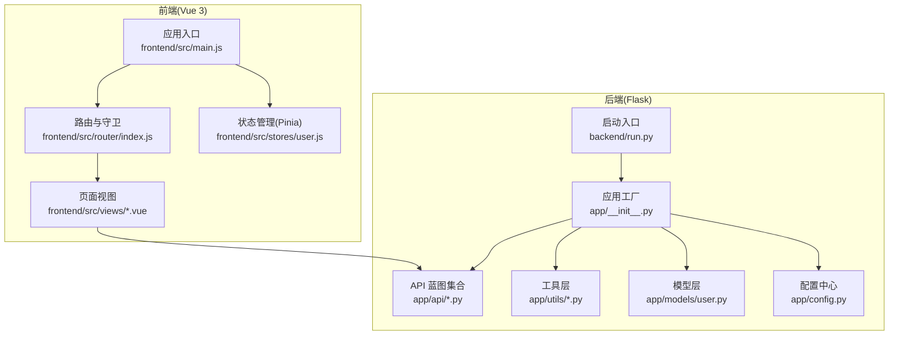
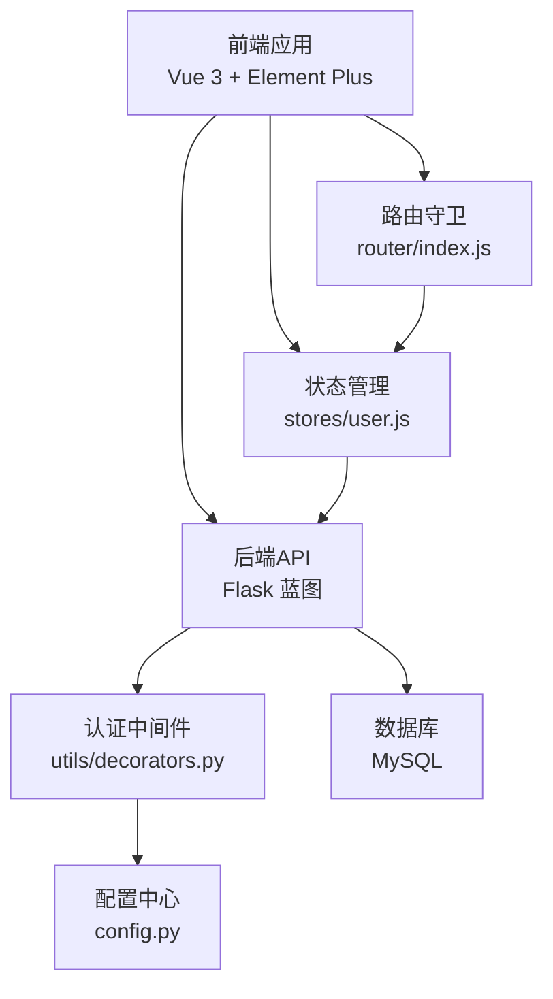
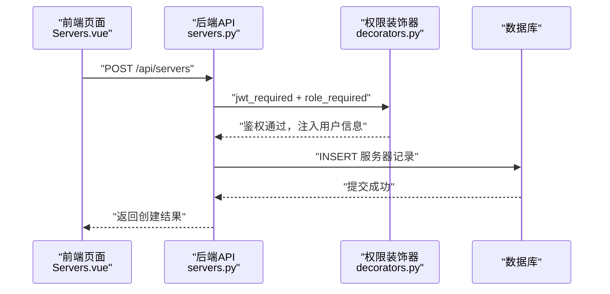
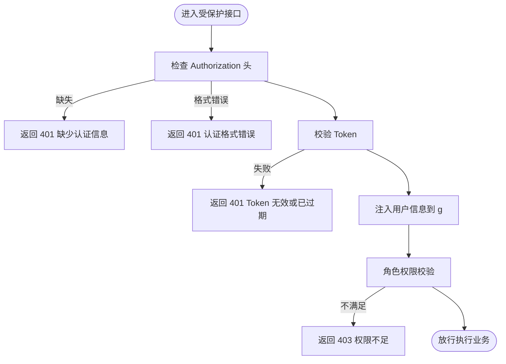
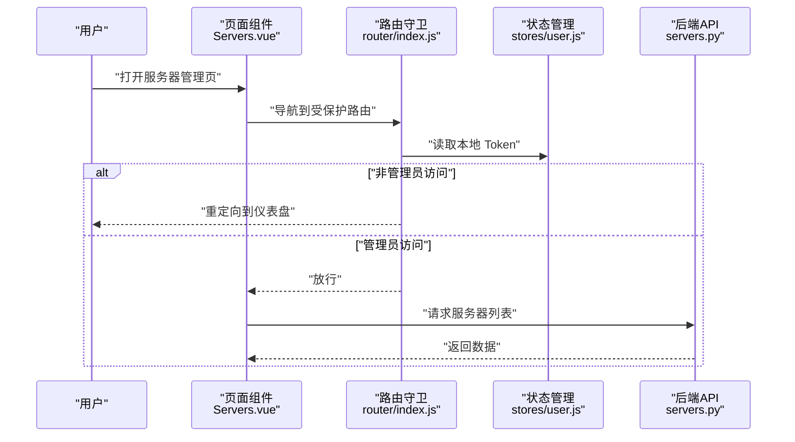
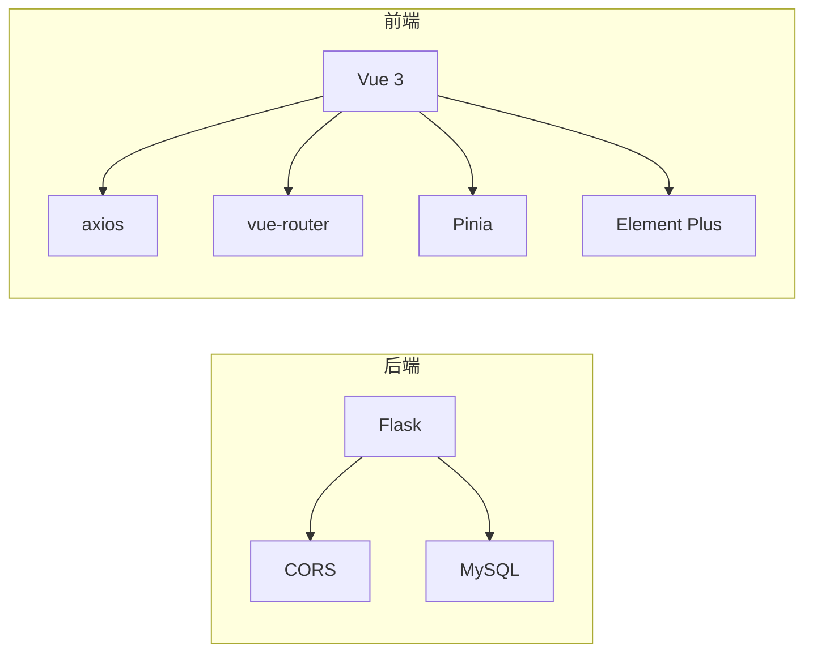

# 项目概述

<cite>
**本文引用的文件**
- [backend/app/__init__.py](file://backend/app/__init__.py)
- [backend/app/config.py](file://backend/app/config.py)
- [backend/run.py](file://backend/run.py)
- [backend/app/api/servers.py](file://backend/app/api/servers.py)
- [backend/app/api/apps.py](file://backend/app/api/apps.py)
- [backend/app/api/certs.py](file://backend/app/api/certs.py)
- [backend/app/api/users.py](file://backend/app/api/users.py)
- [backend/app/utils/decorators.py](file://backend/app/utils/decorators.py)
- [backend/app/models/user.py](file://backend/app/models/user.py)
- [frontend/src/main.js](file://frontend/src/main.js)
- [frontend/package.json](file://frontend/package.json)
- [frontend/src/router/index.js](file://frontend/src/router/index.js)
- [frontend/src/stores/user.js](file://frontend/src/stores/user.js)
- [frontend/src/views/Servers.vue](file://frontend/src/views/Servers.vue)
</cite>

## 目录
1. [引言](#引言)
2. [项目结构](#项目结构)
3. [核心组件](#核心组件)
4. [架构总览](#架构总览)
5. [详细组件分析](#详细组件分析)
6. [依赖分析](#依赖分析)
7. [性能考虑](#性能考虑)
8. [故障排查指南](#故障排查指南)
9. [结论](#结论)
10. [附录](#附录)

## 引言
本项目是一个云运维平台，目标是以统一的后台管理系统实现对服务器、应用系统、域名证书、用户权限等资源的集中化管理。系统采用前后端分离架构：后端基于 Flask 提供 RESTful API，前端基于 Vue 3 + Element Plus 构建交互界面；通过 JWT 实现鉴权与权限控制，支持分页查询、条件筛选、角色授权等能力。该平台旨在提升运维效率、降低管理成本，并为后续扩展（如监控、自动化任务、审计日志等）提供稳定的技术基座。

## 项目结构
项目分为两大部分：
- 后端（Flask）
  - 应用工厂与蓝图注册、CORS、定时任务初始化
  - 配置中心（环境变量驱动）
  - API 蓝图：认证、用户、导出、任务、服务器、服务、应用、证书、记录、仪表盘、字典
  - 工具层：认证、数据库连接、装饰器、调度器
  - 模型层：用户相关数据库操作
- 前端（Vue 3）
  - 应用入口、插件注册（Pinia、Router、Element Plus）
  - 路由与导航守卫
  - 状态管理（用户登录态与权限）
  - 页面视图与 API 适配层

图表来源
- [backend/app/__init__.py:1-62](file://backend/app/__init__.py#L1-L62)
- [backend/app/config.py:1-21](file://backend/app/config.py#L1-L21)
- [backend/run.py:1-8](file://backend/run.py#L1-L8)
- [frontend/src/main.js:1-23](file://frontend/src/main.js#L1-L23)
- [frontend/src/router/index.js:1-61](file://frontend/src/router/index.js#L1-L61)
- [frontend/src/stores/user.js:1-41](file://frontend/src/stores/user.js#L1-L41)

章节来源
- [backend/app/__init__.py:1-62](file://backend/app/__init__.py#L1-L62)
- [backend/app/config.py:1-21](file://backend/app/config.py#L1-L21)
- [backend/run.py:1-8](file://backend/run.py#L1-L8)
- [frontend/src/main.js:1-23](file://frontend/src/main.js#L1-L23)
- [frontend/src/router/index.js:1-61](file://frontend/src/router/index.js#L1-L61)
- [frontend/src/stores/user.js:1-41](file://frontend/src/stores/user.js#L1-L41)

## 核心组件
- 应用工厂与蓝图注册
  - 应用工厂负责初始化 Flask 应用、CORS、注册蓝图、定时任务等
  - 蓝图按功能域划分，便于维护与扩展
- 配置中心
  - 通过环境变量统一管理密钥、数据库连接、上传目录、调试与监听地址等
- 权限体系
  - JWT 鉴权装饰器与角色校验装饰器组合，确保接口访问安全
- 数据访问层
  - 统一数据库连接工具，配合模型层封装 CRUD
- 前端工程化
  - Vue 3 + Pinia + Router + Element Plus，页面组件与 API 层解耦

章节来源
- [backend/app/__init__.py:1-62](file://backend/app/__init__.py#L1-L62)
- [backend/app/config.py:1-21](file://backend/app/config.py#L1-L21)
- [backend/app/utils/decorators.py:1-95](file://backend/app/utils/decorators.py#L1-L95)
- [backend/app/models/user.py:1-183](file://backend/app/models/user.py#L1-L183)
- [frontend/src/main.js:1-23](file://frontend/src/main.js#L1-L23)
- [frontend/src/router/index.js:1-61](file://frontend/src/router/index.js#L1-L61)
- [frontend/src/stores/user.js:1-41](file://frontend/src/stores/user.js#L1-L41)

## 架构总览
系统采用前后端分离架构，后端以 Flask 提供 REST API，前端通过 Axios 与后端交互。认证采用 JWT，路由守卫与 Pinia 状态管理共同保障用户体验与权限控制。

图表来源
- [frontend/src/router/index.js:1-61](file://frontend/src/router/index.js#L1-L61)
- [frontend/src/stores/user.js:1-41](file://frontend/src/stores/user.js#L1-L41)
- [backend/app/utils/decorators.py:1-95](file://backend/app/utils/decorators.py#L1-L95)
- [backend/app/config.py:1-21](file://backend/app/config.py#L1-L21)

## 详细组件分析

### 服务器管理模块（后端 API）
- 功能要点
  - 列表查询：支持按环境类型、关键词搜索、分页
  - 详情查询：返回服务器与关联服务列表
  - 新增/更新/删除：受角色限制（管理员、运维）
  - 下拉列表：提供简要服务器信息用于联动选择
- 关键流程（新增服务器）

图表来源
- [frontend/src/views/Servers.vue:269-287](file://frontend/src/views/Servers.vue#L269-L287)
- [backend/app/api/servers.py:130-166](file://backend/app/api/servers.py#L130-L166)
- [backend/app/utils/decorators.py:9-95](file://backend/app/utils/decorators.py#L9-L95)

章节来源
- [backend/app/api/servers.py:1-232](file://backend/app/api/servers.py#L1-L232)
- [frontend/src/views/Servers.vue:1-325](file://frontend/src/views/Servers.vue#L1-L325)

### 应用系统管理模块（后端 API）
- 功能要点
  - 列表查询：支持按名称/公司/访问地址模糊搜索
  - 新增/更新/删除：受角色限制
- 处理逻辑
  - 参数校验与分页边界处理
  - 动态拼接 SQL 条件与分页偏移量
  - 异常回滚与统一响应结构

章节来源
- [backend/app/api/apps.py:1-168](file://backend/app/api/apps.py#L1-L168)

### 域名证书管理模块（后端 API）
- 功能要点
  - 列表查询：支持分类与关键词过滤
  - 新增/更新/删除：受角色限制
- 处理逻辑
  - 多条件动态拼接与排序
  - 完整的增删改异常处理

章节来源
- [backend/app/api/certs.py:1-145](file://backend/app/api/certs.py#L1-L145)

### 用户管理模块（后端 API）
- 功能要点
  - 列表查询：仅管理员可见
  - 新增/更新/删除：仅管理员可执行
  - 重置密码：仅管理员可执行
- 安全要点
  - 密码使用哈希存储
  - 严格的角色校验与自身保护（不可删除自己）

章节来源
- [backend/app/api/users.py:1-268](file://backend/app/api/users.py#L1-L268)
- [backend/app/models/user.py:1-183](file://backend/app/models/user.py#L1-L183)

### 权限与认证（后端装饰器）
- JWT 鉴权
  - 从请求头解析 Bearer Token，校验失败返回 401
  - 成功后将用户信息注入 g 对象
- 角色校验
  - 在 @jwt_required 之后使用，校验用户角色是否在允许列表中，否则返回 403

图表来源
- [backend/app/utils/decorators.py:9-95](file://backend/app/utils/decorators.py#L9-L95)

章节来源
- [backend/app/utils/decorators.py:1-95](file://backend/app/utils/decorators.py#L1-L95)

### 前端协作模式
- 应用入口与插件
  - 注册 Pinia、Router、Element Plus 及本地化
- 路由与守卫
  - 登录页免认证；其他页面需持有 Token；部分页面需管理员角色
- 状态管理
  - 存储 Token 与用户信息，提供登录态与管理员标识
- 页面与 API
  - 以组件为中心调用 API 层，统一处理加载态、分页与表单校验

图表来源
- [frontend/src/router/index.js:35-58](file://frontend/src/router/index.js#L35-L58)
- [frontend/src/stores/user.js:1-41](file://frontend/src/stores/user.js#L1-L41)
- [frontend/src/views/Servers.vue:222-231](file://frontend/src/views/Servers.vue#L222-L231)
- [backend/app/api/servers.py:11-72](file://backend/app/api/servers.py#L11-L72)

章节来源
- [frontend/src/main.js:1-23](file://frontend/src/main.js#L1-L23)
- [frontend/src/router/index.js:1-61](file://frontend/src/router/index.js#L1-L61)
- [frontend/src/stores/user.js:1-41](file://frontend/src/stores/user.js#L1-L41)
- [frontend/src/views/Servers.vue:1-325](file://frontend/src/views/Servers.vue#L1-L325)

## 依赖分析
- 后端依赖
  - Flask：应用框架与蓝图
  - CORS：跨域支持
  - MySQL：持久化存储（通过工具层连接）
- 前端依赖
  - Vue 3：响应式框架
  - Element Plus：UI 组件库
  - Pinia：状态管理
  - vue-router：路由
  - axios：HTTP 客户端

图表来源
- [frontend/package.json:11-17](file://frontend/package.json#L11-L17)
- [backend/app/__init__.py:24-25](file://backend/app/__init__.py#L24-L25)

章节来源
- [frontend/package.json:1-24](file://frontend/package.json#L1-L24)
- [backend/app/__init__.py:1-62](file://backend/app/__init__.py#L1-L62)

## 性能考虑
- 接口层
  - 分页参数边界控制，避免超大页大小导致数据库压力
  - 动态 SQL 拼接时注意参数绑定，防止 SQL 注入
- 数据库层
  - 合理使用索引（如按环境类型、主机名、访问地址等常用查询字段）
  - 批量写入时使用事务，失败回滚
- 前端层
  - 表格加载态与分页联动，减少重复请求
  - 表单校验前置，降低无效请求

## 故障排查指南
- 常见问题
  - 401 未认证：确认请求头携带正确的 Bearer Token
  - 403 权限不足：确认用户角色是否满足接口要求
  - 404 资源不存在：确认 ID 有效且资源存在
  - 500 服务器内部错误：查看后端日志定位具体异常
- 建议步骤
  - 前端：检查 Token 与用户信息是否正确存储
  - 后端：检查装饰器链路与数据库连接配置
  - 运维：核对环境变量与数据库连通性

章节来源
- [backend/app/utils/decorators.py:9-95](file://backend/app/utils/decorators.py#L9-L95)
- [backend/app/api/servers.py:84-90](file://backend/app/api/servers.py#L84-L90)
- [backend/app/api/users.py:175-181](file://backend/app/api/users.py#L175-L181)

## 结论
本项目以清晰的前后端分离架构为基础，结合 Flask 的轻量与 Vue 的易用，构建了具备良好扩展性的云运维平台。通过 JWT 与角色装饰器实现统一的安全控制，配合完善的 API 设计与前端组件化开发，能够快速支撑服务器、应用系统、证书与用户管理等核心业务场景。建议在后续迭代中补充监控告警、审计日志与自动化任务调度等能力，持续完善平台生态。

## 附录
- 开发与部署建议
  - 后端：通过环境变量配置数据库与密钥，生产环境关闭调试模式
  - 前端：构建产物部署至静态服务器，保持与后端 API 的域名一致以避免跨域问题
- 使用场景示例
  - 新增服务器：在“服务器管理”页面填写必要字段并提交，系统自动保存并返回结果
  - 查看应用详情：在“应用系统”页面搜索并点击查看，获取应用相关信息
  - 管理用户：管理员在“用户管理”页面进行用户增删改与密码重置